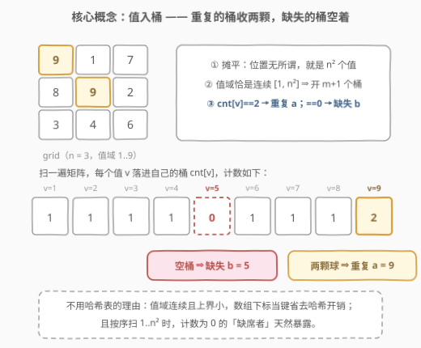
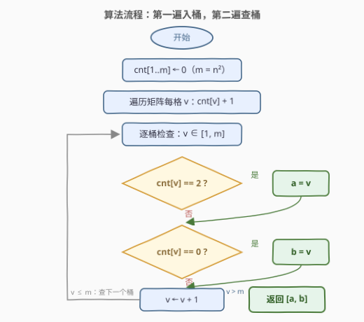
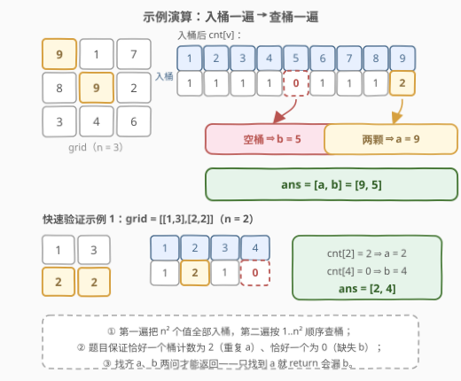

# LeetCode 找出缺失和重复的数字 题解

## 1. 题目概述

- **标题 / 题号**：找出缺失和重复的数字（#2965，easy）
- **链接**：https://leetcode.cn/problems/find-missing-and-repeated-values/
- **难度**：简单
- **标签**：数组、哈希表、数学、矩阵

**题意**：给你一个下标从 **0** 开始的二维整数矩阵 `grid`，大小为 `n * n`，其中的值在 `[1, n²]` 范围内。除了 `a` 出现 **两次**，`b` **缺失** 之外，每个整数都 **恰好出现一次**。

任务是找出重复的数字 `a` 和缺失的数字 `b`。

返回一个下标从 0 开始、长度为 `2` 的整数数组 `ans`，其中 `ans[0]` 等于 `a`，`ans[1]` 等于 `b`。

**示例 1**：

```text
输入：grid = [[1,3],[2,2]]
输出：[2,4]
解释：数字 2 重复，数字 4 缺失，所以答案是 [2,4]。
```

**示例 2**：

```text
输入：grid = [[9,1,7],[8,9,2],[3,4,6]]
输出：[9,5]
解释：数字 9 重复，数字 5 缺失，所以答案是 [9,5]。
```

**约束**：

- $2 \le n = grid.length = grid[i].length \le 50$
- $1 \le grid[i][j] \le n^2$

> 💡 读题先抓形态：`n×n` 矩阵只是**包装**——真正的主角是「$n^2$ 个值 + 连续值域 $[1, n^2]$：恰好一个值出现两次、恰好一个值缺席」。这是 [645. 错误的集合](https://leetcode.cn/problems/set-mismatch/) 家族的**二维版**。规模极小（$n \le 50$），怎么写都能过；值得抠的是三件事：① 位置信息完全无用，先在脑内**摊平**；② 值域连续且已知 ⇒ **计数数组（桶）比哈希表更贴**；③ 追问 $O(1)$ 空间时，有「和差 + 平方和差」联立方程与 XOR 两套备选（见第 5 节）。

## 2. 解题思路

### 2.1 暴力思路：逐个候选值数出现次数

最直接的做法有两档：

1. **$O(n^4)$ 逐值普查**：对每个候选 $v \in [1, n^2]$，扫整个矩阵数它出现几次——数为 2 的是 $a$，数为 0 的是 $b$。$n = 50$ 时约 $2500 \times 2500 = 6.25 \times 10^6$ 次比较，本题规模下也能过，但显然浪费：矩阵被反复扫了 2500 遍。
2. **$O(n^2)$ 哈希表计数**：一遍扫矩阵，用哈希表记录每个值的出现次数；再扫 $1..n^2$，次数为 2 的即 $a$、为 0 的即 $b$。

正解只是在第 2 档基础上换一个数据结构：**把哈希表换成数组**。

### 2.2 核心观察：值域连续已知 → 桶计数



三条性质框定解法形态：

1. **位置无用，先摊平**：题目只问「哪个值重复、哪个值缺席」，不问它们在矩阵的哪里——$n \times n$ 矩阵在读入视角就是 $n^2$ 个数，双层 for 循环摊平即可，不需要任何坐标技巧。
2. **值域恰是连续的 $[1, n^2]$，且上界很小**（$m = n^2 \le 2500$）：开一个长度 $m+1$ 的计数数组 `cnt`，`cnt[v]` 就是值 $v$ 的出现次数——**数组下标当键**，$O(1)$ 访问、零哈希开销，还天然支持按序扫描。
3. **两个指纹**：题目保证恰好一个 $a$ 出现 2 次、恰好一个 $b$ 出现 0 次。于是第二遍按序扫 $v \in [1, m]$：`cnt[v] == 2` 定位 $a$，`cnt[v] == 0` 定位 $b$——缺失值在**按序**扫描中天然暴露，这是哈希表给不了的便利。

$$\boxed{\ a = \{\, v \mid cnt[v] = 2 \,\},\qquad b = \{\, v \mid cnt[v] = 0 \,\},\qquad v \in [1,\, n^2]\ }$$

> 💡 一句话：**「值域连续 + 找异常计数」⇒ 桶计数是本分**。第一遍扫矩阵入桶，第二遍扫值域查桶，两遍各 $O(n^2)$。$n^2$ 个格子每个都可能是重复者，$\Omega(n^2)$ 也是读取下界——两遍扫描已经贴着下界走。

### 2.3 算法流程图



**完整步骤**：

1. **初始化**：长度 $m+1$（$m = n^2$）的计数数组 `cnt` 全 0；
2. **第一遍·入桶**：双层循环遍历矩阵，每读一个值 `v = grid[i][j]` 就 `cnt[v]++`；
3. **第二遍·查桶**：`v` 从 1 到 $m$ 逐桶检查——`cnt[v] == 2` 记 `a = v`，`cnt[v] == 0` 记 `b = v`；
4. **收尾**：`v` 越界（$v > m$）时两问必有答案，返回 `[a, b]`。

> ⚠️ 两个常见手误：① `cnt` 开成长度 $m$ 而不是 $m+1$——下标 $1..m$ 需要 $m+1$ 格，开短了 `cnt[m]` 越界；② 找到 `a` 就提前 `return`——`b` 可能排在 `a` 前面或后面，必须把值域扫完（或 `a`、`b` 都非空才 break）。

### 2.4 示例演算



以示例 2（`grid = [[9,1,7],[8,9,2],[3,4,6]]`，$n = 3$，值域 $1..9$）为例，第一遍入桶后：

| $v$ | 1 | 2 | 3 | 4 | 5 | 6 | 7 | 8 | 9 |
|-----|---|---|---|---|---|---|---|---|---|
| $cnt[v]$ | 1 | 1 | 1 | 1 | **0** | 1 | 1 | 1 | **2** |

第二遍按序查桶：扫到 $v = 5$ 发现空桶 ⇒ $b = 5$；扫到 $v = 9$ 发现两颗球 ⇒ $a = 9$。返回 `[9, 5]` ✓。

示例 1（`[[1,3],[2,2]]`，值域 $1..4$）：`cnt = [1, 2, 1, 0]` ⇒ $a = 2$、$b = 4$，返回 `[2, 4]` ✓。

## 3. 参考代码

### C++

```cpp
class Solution {
  public:
    vector<int> findMissingAndRepeatedValues(vector<vector<int>>& grid) {
        int n = grid.size(), m = n * n;
        vector<int> cnt(m + 1, 0);
        for (auto& row : grid)
            for (int v : row) cnt[v]++;
        int a = -1, b = -1;
        for (int v = 1; v <= m; v++) {
            if (cnt[v] == 2) a = v;
            else if (cnt[v] == 0) b = v;
        }
        return {a, b};
    }
};
```

### Python

```python
class Solution:
    def findMissingAndRepeatedValues(self, grid: List[List[int]]) -> List[int]:
        m = len(grid) ** 2
        cnt = [0] * (m + 1)
        for row in grid:
            for v in row:
                cnt[v] += 1
        a = b = 0
        for v in range(1, m + 1):
            if cnt[v] == 2:
                a = v
            elif cnt[v] == 0:
                b = v
        return [a, b]
```

> 💡 语言细节：C++ 用范围 for 逐行摊平，`cnt` 开 `m + 1` 格容纳下标 $1..m$；Python 也可写成 `cnt.index(2)` 与 `cnt.index(0, 1)`（第二个参数 `1` 跳过恒为 0 的 `cnt[0]`），但显式循环把「恰好一个 2、恰好一个 0」的题目保证写得更清楚。

## 4. 复杂度分析

| 维度 | 复杂度 | 说明 |
|------|--------|------|
| 时间复杂度 | $O(n^2)$ | 第一遍入桶扫 $n^2$ 格 + 第二遍查桶扫 $m = n^2$ 个值；$n^2$ 个格子每个都可能是重复者，$\Omega(n^2)$ 也是读取下界 |
| 空间复杂度 | $O(n^2)$ | 计数数组 $m + 1 = n^2 + 1$ 格；可被第 5 节数学法压到 $O(1)$ |

## 5. 扩展：O(1) 空间的三条路

桶计数的空间花在计数数组上。若面试官追问「不许开 $O(n^2)$ 空间」，还有三套打法：

### 5.1 数学法：和差 + 平方和差联立（推荐）

设 $m = n^2$。期望和 $T = \dfrac{m(m+1)}{2}$，期望平方和 $T_2 = \dfrac{m(m+1)(2m+1)}{6}$。实际和 $S$、实际平方和 $S_2$ 与期望的差异**全部来自 $a$、$b$**：

$$d_1 = S - T = a - b$$

$$d_2 = \frac{S_2 - T_2}{d_1} = \frac{a^2 - b^2}{a - b} = a + b$$

两个线性方程解两个未知数：$a = \dfrac{d_1 + d_2}{2}$，$b = \dfrac{d_2 - d_1}{2}$（$a \ne b$ 保证 $d_1 \ne 0$，除法安全）。

```cpp
class Solution {
  public:
    vector<int> findMissingAndRepeatedValues(vector<vector<int>>& grid) {
        long long m = grid.size() * grid.size();
        long long S = 0, S2 = 0;
        for (auto& row : grid)
            for (int v : row) { S += v; S2 += (long long)v * v; }
        long long d1 = S - m * (m + 1) / 2;
        long long d2 = (S2 - m * (m + 1) * (2 * m + 1) / 6) / d1;
        return { int((d1 + d2) / 2), int((d2 - d1) / 2) };
    }
};
```

```python
class Solution:
    def findMissingAndRepeatedValues(self, grid: List[List[int]]) -> List[int]:
        m = len(grid) ** 2
        S = S2 = 0
        for row in grid:
            for v in row:
                S += v
                S2 += v * v
        d1 = S - m * (m + 1) // 2
        d2 = (S2 - m * (m + 1) * (2 * m + 1) // 6) // d1
        return [(d1 + d2) // 2, (d2 - d1) // 2]
```

> ⚠️ **C++ 溢出坑**：$m = 2500$ 时 $T_2 \approx 5.2 \times 10^9$，超出 32 位 `int` 上限（约 $2.1 \times 10^9$），累加平方和与中间量必须用 `long long`；Python 原生大整数无此虑。

### 5.2 XOR 分组

矩阵全部值 $\oplus$ 全部 $1..m$ = $a \oplus b$（成对抵消）。取结果任一 set bit（$a$、$b$ 在该位不同），把两批数按该位分组各自异或，得到 $\{a, b\}$ 两个候选；但 XOR 分不出谁是谁——最后回矩阵扫一遍看谁**在场**，在场的即 $a$。与 [287. 寻找重复数](https://leetcode.cn/problems/find-the-duplicate-number/)、[260. 只出现一次的数字 III](https://leetcode.cn/problems/single-number-iii/) 同一脉。

### 5.3 原地标记

值 $v$ 的「家」在第 $\lfloor (v-1)/n \rfloor$ 行、$(v-1) \bmod n$ 列。遍历时先把每格值用 $\bmod (m+1)$ 还原成原值，再给对应格 `+= m+1`；全部做完后每格的 $\lfloor (val-1)/(m+1) \rfloor$ 就是该位对应值的出现次数（2 或 0 一目了然）。这是 [448. 找到所有数组中消失的数字](https://leetcode.cn/problems/find-all-numbers-disappeared-in-an-array/) 取负标记思路的矩阵推广——$O(1)$ 额外空间，代价是要修改输入。

## 6. 面试要点

1. **为什么计数数组优于哈希表？**

   - 值域连续 $[1, n^2]$ 且上界仅 2500 ⇒ 下标即键，无哈希/装箱开销
   - 第二遍**按序**扫 $1..n^2$ 时计数为 0 的缺席者天然暴露；哈希表还得逐个查 contains

2. **二维矩阵带来什么麻烦？**

   - 没有本质麻烦：题目只问值不问位置，双层循环摊平即可
   - 只有玩 5.3 原地标记才需要坐标换算：$v \leftrightarrow$ 第 $(v-1)/n$ 行、$(v-1) \bmod n$ 列

3. **数学法的两个方程怎么联立？**

   - 和差给 $a - b$；平方和差 $a^2 - b^2 = (a-b)(a+b)$ 除以前者得 $a + b$
   - 两个线性方程解两个未知数；C++ 记得 `long long`（$T_2 \approx 5.2 \times 10^9$ 溢出 int）

4. **能不能只靠 XOR？**

   - XOR 全部只能得 $a \oplus b$，分不出谁是谁
   - 需再按 set bit 分组异或得两个候选，并回扫矩阵判定谁在场（在场者重复）

5. **找到 a 之后能提前退出吗？**

   - 不能立刻返回：$b$ 的位置可能在 $a$ 之前或之后，只回答了一半
   - 要么扫完整个值域，要么 `a`、`b` 都已找到才 break

> 💡 **一句话总结**：摊平 + 值域连续 ⇒ 桶计数两遍扫描 $O(n^2)$ / $O(n^2)$；追问空间就上「和差 + 平方和差」联立方程压到 $O(1)$，C++ 记得 `long long`。

## 同类练习题

| # | 题目 | 与本题的关联 |
|---|------|-------------|
| 645 | [错误的集合](https://leetcode.cn/problems/set-mismatch/)（[题解](../0601-0700/645_错误的集合.md)） | 本题的一维原型——同样「一个重复 + 一个缺失」，解法家族完全一致 |
| 448 | [找到所有数组中消失的数字](https://leetcode.cn/problems/find-all-numbers-disappeared-in-an-array/)（[题解](../0401-0500/448_找到所有数组中消失的数字.md)） | 值域连续 ⇒ 原地取负标记，找全部缺失值，5.3 节的源头 |
| 442 | [数组中重复的数据](https://leetcode.cn/problems/find-all-duplicates-in-an-array/)（[题解](../0401-0500/442_数组中重复的数据.md)） | 448 的镜像——原地标记找全部重复值 |
| 287 | [寻找重复数](https://leetcode.cn/problems/find-the-duplicate-number/)（[题解](../0201-0300/287_寻找重复数.md)） | 只找重复 + 不许改数组 ⇒ Floyd 判环 / 二分答案，5.2 节 XOR 的近亲 |
