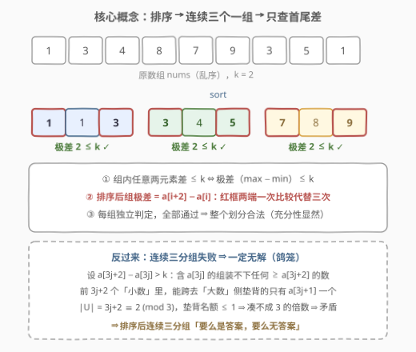
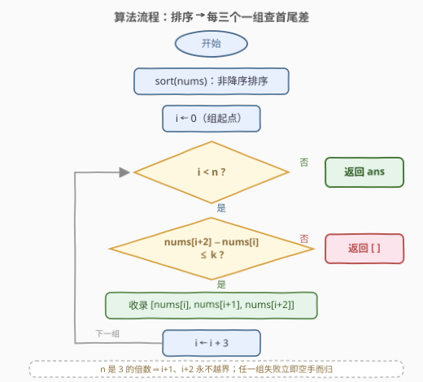
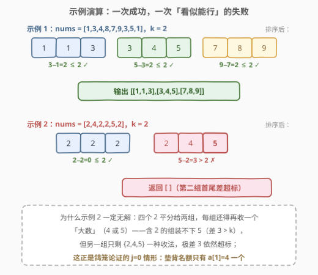

# 划分数组并满足最大差限制

- **题目名称**：划分数组并满足最大差限制
- **链接**：[2966. 划分数组并满足最大差限制](https://leetcode.cn/problems/divide-array-into-arrays-with-max-difference/)
- **难度**：中等
- **标签**：贪心、数组、排序

## 1. 题目概述

给你一个长度为 $n$ 的整数数组 `nums`，以及一个正整数 $k$。将这个数组划分为 $n/3$ 个**长度为 3** 的子数组，并满足以下条件：

- 子数组中**任意**两个元素的差必须**小于或等于** $k$。

返回一个二维数组，包含所有的子数组。如果不可能满足条件，就返回一个空数组。如果有多个答案，返回**任意一个**即可。

**示例 1**：

```text
输入：nums = [1,3,4,8,7,9,3,5,1], k = 2
输出：[[1,1,3],[3,4,5],[7,8,9]]
解释：每个数组中任何两个元素之间的差小于或等于 2。
```

**示例 2**：

```text
输入：nums = [2,4,2,2,5,2], k = 2
输出：[]
解释：将 nums 划分为 2 个长度为 3 的数组的方式有：
[[2,2,2],[2,4,5]]（及其排列）与 [[2,2,4],[2,2,5]]（及其排列）。
因为四个 2 无论怎么分，都会有一个包含 2 和 5 的数组，5 − 2 = 3 > k，无解。
```

**约束条件**：

- $n = nums.length$，$1 \le n \le 10^5$
- $n$ 是 $3$ 的倍数
- $1 \le nums[i] \le 10^5$
- $1 \le k \le 10^5$

> 💡 读题先抓形态：这是一道「**均匀分组判定**」题——每个元素恰好属于一组、每组恰好 3 个、组内任意两元素差 $\le k$。约束「任意两个元素的差」看着像要做 $O(3^2)$ 次比较，其实是烟雾弹：**它等价于组内极差 $\le k$**。排序让「谁和谁差得远」一目了然，于是「怎么分组」这个组合问题塌缩成「排序后切三连格」的线性扫描。

---

## 2. 解题思路

### 2.1 暴力思路：枚举所有划分

最朴素的做法是**枚举划分方案**：从 $n$ 个数里选 3 个当第一组，再从剩下 $n-3$ 个里选 3 个当第二组……方案数为

$$\binom{n}{3}\binom{n-3}{3}\cdots\binom{3}{3} \big/ \left(\tfrac{n}{3}\right)! \;=\; \frac{n!}{(3!)^{n/3}\,(n/3)!}$$

$n = 10^5$ 时这是天文数字（$10^5$ 阶乘级别），连枚举第一步都迈不出去。即便 $n$ 缩到 15，$\frac{15!}{6^5 \cdot 5!} \approx 1.3\times 10^5$ 勉强可行，也毫无推广价值。

暴力的困境在于：**乱序数组里「差值结构」完全不可见**，只能靠穷举去撞。突破口是把数组排序——排序后「任意两元素差 $\le k$」的可行分组结构会自然浮现。

### 2.2 核心观察：排序 + 连续三分组



三个观察层层递进：

**观察 1（等价转化）**：组内任意两个元素的差 $\le k$ $\iff$ 组内**极差** $\max - \min \le k$。任取两元素的差都不超过极差，而极差本身就是某一对元素的差——一次比较顶三次。

**观察 2（排序后取连续三个）**：数组排序后，每 $3$ 个**连续**元素划为一组。此时组内最大值就是 $a[i+2]$、最小值就是 $a[i]$，组是否合法只需看

$$a[i+2] - a[i] \le k.$$

**观察 3（失败即无解）**：这是贪心正确性的关键——若某个组起点处 $a[3j+2] - a[3j] > k$，则**任何**划分方案都不可能合法，返回空数组是对的。**鸽笼论证**：反设存在合法划分 $P$，记 $U = \{a[0], \dots, a[3j+1]\}$（最小的 $3j+2$ 个数），$U$ 外的数都 $\ge a[3j+2]$：

1. **含 $a[3j]$ 的组装不下大数**：组内任意元素与 $a[3j]$ 差 $\le k < a[3j+2] - a[3j]$，故组内所有值都 $< a[3j+2]$——它是「纯小组」，3 个元素全在 $U$ 内；
2. **跨界只能靠 $a[3j+1]$ 垫背**：一个组若同时含 $U$ 内与 $U$ 外的数，其 $U$ 内元素值必须 $\ge a[3j+2] - k > a[3j]$；而 $U$ 内值 $> a[3j]$ 的元素**只有 $a[3j+1]$ 一个**（下标 $\le 3j$ 的值都 $\le a[3j]$）。于是全部跨界组从 $U$ 拿走的元素总数 $\le 1$；
3. **数格子**：$|U| = 3j+2 = 3 \times (\text{纯小组个数}) + (\text{跨界拿走数})$，左边 $\equiv 2 \pmod 3$，右边只能 $\equiv 0$ 或 $1 \pmod 3$——凑不上，矛盾。

$$\boxed{\ \text{排序后}\ \forall i:\ a[3i+2]-a[3i] \le k \iff \text{存在合法划分（连续三分组即其一）}\ }$$

> 💡 一句话：**「排序 + 连续三分组」要么直接给出答案，要么证明答案不存在**——它同时解决了「构造」与「判定」两件事，这是排序贪心题最舒服的形态。

### 2.3 算法流程图



**完整步骤**：

1. **排序**：将 `nums` 排成非降序；
2. **逐组扫描**：`i` 从 0 开始、步长 3——若 `nums[i+2] - nums[i] > k`，立即返回空数组；
3. **收录**：否则把 `[nums[i], nums[i+1], nums[i+2]]` 加入答案；
4. **收尾**：`i` 越界（$i \ge n$）说明所有组通过，返回答案。

> ⚠️ 两个常见手误：① 去比较 `nums[i+1] - nums[i]`（相邻差）——相邻差小不代表极差小，见第 6 节；② 失败后继续扫描凑答案——任一组失败即无解（观察 3），必须立刻返回空。

### 2.4 示例演算



**示例 1**（`nums = [1,3,4,8,7,9,3,5,1]`，$k=2$）：排序后 `[1,1,3,3,4,5,7,8,9]`，切成三组：

| 组 | 元素 | 首尾差 | 判定 |
|----|------|--------|------|
| 0 | `[1,1,3]` | $3-1=2 \le 2$ | ✓ |
| 1 | `[3,4,5]` | $5-3=2 \le 2$ | ✓ |
| 2 | `[7,8,9]` | $9-7=2 \le 2$ | ✓ |

返回 `[[1,1,3],[3,4,5],[7,8,9]]` ✓。

**示例 2**（`nums = [2,4,2,2,5,2]`，$k=2$）：排序后 `[2,2,2,2,4,5]`，第二组 `[2,4,5]` 首尾差 $5-2=3 > 2$，失败——返回 `[]` ✓。这正是 2.2 鸽笼论证的 $j=0$ 情形：四个 2 必须摊进两组，每组还要再收大数，而能垫背的只有 $a[1]=4$ 一个名额。

---

## 3. 参考代码

### C++

```cpp
class Solution {
  public:
    vector<vector<int>> divideArray(vector<int>& nums, int k) {
        sort(nums.begin(), nums.end());
        int n = nums.size();
        vector<vector<int>> ans;
        ans.reserve(n / 3);
        for (int i = 0; i < n; i += 3) {
            if (nums[i + 2] - nums[i] > k) return {};
            ans.push_back({nums[i], nums[i + 1], nums[i + 2]});
        }
        return ans;
    }
};
```

### Python

```python
class Solution:
    def divideArray(self, nums: List[int], k: int) -> List[List[int]]:
        nums.sort()
        ans = []
        for i in range(0, len(nums), 3):
            if nums[i + 2] - nums[i] > k:
                return []
            ans.append([nums[i], nums[i + 1], nums[i + 2]])
        return ans
```

> 💡 语言细节：$n$ 保证是 3 的倍数，`i+1`、`i+2` 永不越界，无需边界判断；C++ 的 `ans.reserve(n / 3)` 是小优化，避免 vector 反复扩容。返回的组内元素天然非降序，题目对顺序无要求。

---

## 4. 复杂度分析

| 维度 | 复杂度 | 说明 |
|------|--------|------|
| 时间复杂度 | $O(n \log n)$ | 排序主导 $O(n \log n)$；分组扫描 $O(n)$（每组仅一次比较） |
| 空间复杂度 | $O(\log n)$ | 仅排序递归栈；不计输出数组 $O(n)$（Python 的 timsort 另需 $O(n)$ 辅助缓冲） |

> 💡 $n \le 10^5$ 时排序约 $1.7 \times 10^6$ 次比较，线性扫描 $10^5/3$ 次——整体毫秒级。判定「任意两元素」看似 $O(3^2)$，实际每组一次比较，扫描已经贴着读写下界走。

---

## 5. 扩展

### 5.1 计数排序：值域已知时的 O(n + V) 写法

$nums[i] \le 10^5$ 且值域从 1 开始——**值域连续已知**，可以把比较排序换成计数排序，整体 $O(n + V)$：

```python
class Solution:
    def divideArray(self, nums: List[int], k: int) -> List[List[int]]:
        V = max(nums)
        cnt = [0] * (V + 1)
        for v in nums:
            cnt[v] += 1
        ans, group = [], []
        for v in range(1, V + 1):
            for _ in range(cnt[v]):
                group.append(v)
                if len(group) == 3:
                    if group[2] - group[0] > k:
                        return []
                    ans.append(group)
                    group = []
        return ans
```

本题 $n$ 与 $V$ 同为 $10^5$ 量级，两种排序实际差距很小；但当 $n \ll V$ 时计数数组反成负担，$n \gg V$ 时才是真正的提速——面试中作为「追问不排序」的备选答案提一句即可。

### 5.2 兄弟题 2294：分组长度任意、最小化组数

本题的孪生题 [2294. 划分数组使最大差为 K](https://leetcode.cn/problems/partition-array-such-that-maximum-difference-is-k/) 把「恰好每组 3 个」放宽为「每组至少 1 个、组数最少」。排序贪心依旧成立，只是分组从「定量切」变成「尽量装」：每组从当前最小元素开始，一直吞到值超过 `首元素 + k` 为止：

```python
class Solution:
    def partitionArray(self, nums: List[int], k: int) -> int:
        nums.sort()
        ans, start = 1, 0
        for i, v in enumerate(nums):
            if v - nums[start] > k:
                ans += 1
                start = i
        return ans
```

> 💡 两题对照记：**「每组恰好 3 个」看首尾（步长切）**，**「组数最少」贪心扩张（滑到不能装）**——同一套「排序后值域相邻的扎一堆」直觉，两种切法。

---

## 6. 面试要点

1. **为什么每组只需比较 `nums[i+2] - nums[i]`，不用比较组内三对？**

   - 组内任意两元素的差 $\le k$ $\iff$ 极差 $\le k$：任一对的差不超过极差，极差本身又是某一对的差
   - 排序后组内最小、最大恰是首尾两个元素，一次比较完事

2. **为什么连续三分组失败就可以断言无解？（正确性核心）**

   - 鸽笼论证：若 $a[3j+2]-a[3j] > k$，含 $a[3j]$ 的组装不下任何 $\ge a[3j+2]$ 的数；最小的 $3j+2$ 个数中能跨界垫背的只有 $a[3j+1]$ 一个，$3j+2 \equiv 2 \pmod 3$ 凑不成 3 的倍数，矛盾
   - 一句话版：**连续三分组要么是答案，要么答案不存在**

3. **只检查相邻差 `nums[i+1] - nums[i] ≤ k` 行不行？**

   - 不行：相邻差都达标推不出极差达标。取 $k=1$、组 $[1,2,3]$：相邻差 $1,1$ 都 $\le k$，极差却是 $2 > k$
   - 极差要跨两个格子看：$a[i+2]-a[i]$ 才是组的「跨度」

4. **不排序能做吗？**

   - 值域已知（$1 \le nums[i] \le 10^5$）可上计数排序，$O(n + V)$（见 5.1）
   - 逐个 `multiset` 取最小再组队也行，但复杂度仍是 $O(n \log n)$，只是把排序摊进循环，无收益

5. **输出的组和元素的顺序有要求吗？**

   - 没有，题目明确「多个答案返回任意一个」；组内顺序、组间顺序都可任意
   - 面试中主动说明这一点，可避免在「要不要去重/按序输出」上浪费讨论时间

> 💡 **一句话总结**：排序 + 步长 3 扫一遍，每组一次比较 $a[i+2]-a[i]$；失败即无解（鸽笼垫背名额只有一个），$O(n \log n)$ / $O(\log n)$ 收工。

---

## 7. 同类练习题

- [2294. 划分数组使最大差为 K](https://leetcode.cn/problems/partition-array-such-that-maximum-difference-is-k/)（[题解](../2201-2300/2294_划分数组使最大差为K.md)）：本题的「任意长度」版——不限定组大小、最小化组数，同款排序贪心改成「滑到装不下」（5.2 节）
- [561. 数组拆分](https://leetcode.cn/problems/array-partition/)（[题解](../0501-0600/561_数组拆分.md)）：排序后相邻两两配对最大化 $\min$ 之和——「排序后取连续段」贪心的双元素版
- [1509. 三次操作后最大值与最小值的最小差](https://leetcode.cn/problems/minimum-difference-between-largest-and-smallest-value-in-three-moves/)（[题解](../1501-1600/1509_三次操作后最大值与最小值的最小差.md)）：排序后枚举删首尾元素压极差——极差思想的另一面
- [56. 合并区间](https://leetcode.cn/problems/merge-intervals/)（[题解](../0001-0100/56_合并区间.md)）：排序后线性扫描维护当前段——「排序贪心」家族的鼻祖模板
