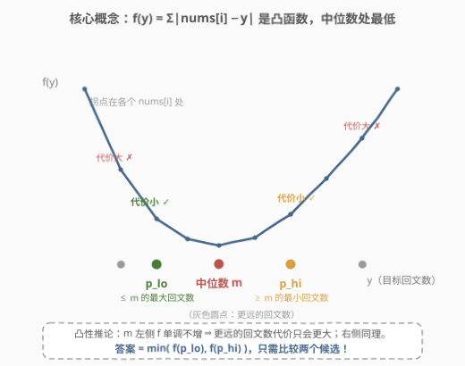
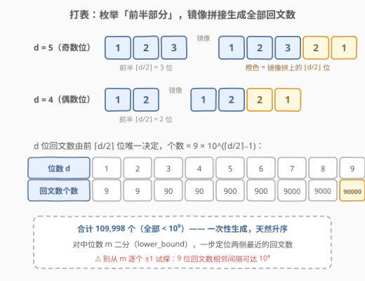
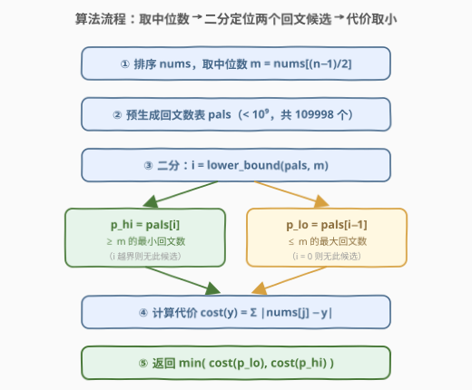
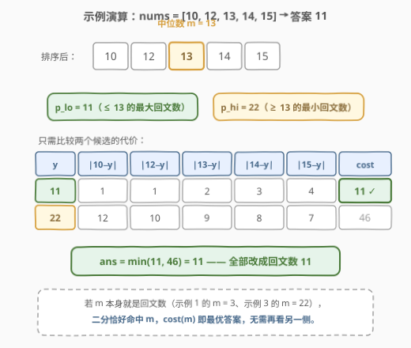

# 使数组成为等数数组的最小代价

- **题目名称**：使数组成为等数数组的最小代价
- **链接**：[2967. 使数组成为等数数组的最小代价](https://leetcode.cn/problems/minimum-cost-to-make-array-equalindromic/)
- **难度**：中等
- **标签**：贪心、数组、数学、二分查找、排序

## 1. 题目概述

给你一个长度为 $n$、下标从 **0** 开始的整数数组 `nums`。你可以执行**特殊操作任意次**（也可以 0 次），每次操作依次执行：

1. 从 $[0, n-1]$ 中选一个下标 $i$ 和一个**正**整数 $x$；
2. 把 $|{nums[i]} - x|$ 加进总代价；
3. 把 $nums[i]$ 变成 $x$。

正着读反着读都相同的数是**回文数**（如 121、2552、65756；24、46、235 不是）。如果数组所有元素都等于某个**小于 $10^9$ 的正回文数** $y$，则称其为**等数数组**。

返回使 `nums` 变成等数数组的**最小**总代价。

**示例 1**：

```text
输入：nums = [1,2,3,4,5]
输出：6
解释：全部变成回文数 3，代价 |1−3| + |2−3| + |4−3| + |5−3| = 6。
```

**示例 2**：

```text
输入：nums = [10,12,13,14,15]
输出：11
解释：全部变成回文数 11，代价 1+1+2+3+4 = 11，换成其他回文数代价都更大。
```

**示例 3**：

```text
输入：nums = [22,33,22,33,22]
输出：22
解释：全部变成回文数 22，两个 33 各花 11，代价 22。
```

**约束条件**：

- $1 \le n \le 10^5$
- $1 \le nums[i] \le 10^9$

> 💡 读题先抓形态：「任意次操作」看起来搜索空间无限，实则两次观察直接坍缩：① 同一个位置改多次不如**一步到位**（三角不等式），总代价就是 $\sum_i |nums[i] - y|$，唯一的决策变量是目标回文数 $y$；② 这个代价函数是**凸**的，最优 $y$ 被钉死在**中位数**附近——本题本质是 [462. 最小操作次数使数组元素相等 II](https://leetcode.cn/problems/minimum-moves-to-equal-array-elements-ii/)（中位数贪心）与 [564. 寻找最近的回文数](https://leetcode.cn/problems/find-the-closest-palindrome/)（回文构造）的合体。

---

## 2. 解题思路

### 2.1 暴力思路：枚举回文数算代价

分两档看：

1. **枚举所有 $y \in [1, 10^9)$**：$10^9$ 个候选 × $O(n)$ 代价计算 $= 10^{14}$，完全不可行。
2. **只枚举回文数 $y$**：小于 $10^9$ 的正回文数只有 **109998 个**（见 2.3 的计数），但每个候选仍要 $O(n)$ 算代价，总计 $109998 \times 10^5 \approx 1.1 \times 10^{10}$，依旧超时。

两档暴力的共同浪费：把**十万个候选**从头算到尾，而凸性告诉我们——**只有 2 个候选值得算**。

### 2.2 核心观察：代价函数是凸的，锚点在中位数

**观察 1（总代价的封闭形式）**：把位置 $i$ 从 $a$ 改到 $y$，无论中间倒几次手，代价都不小于 $|a - y|$（三角不等式 $|a-b|+|b-y| \ge |a-y|$），所以一步到位最优；不同位置之间互不干扰。于是

$$f(y) = \sum_{i=0}^{n-1} \left| nums[i] - y \right|$$

**唯一决策变量就是目标回文数 $y$**。

**观察 2（凸性与中位数）**：每个 $|nums[i] - y|$ 都是 V 形凸函数，凸函数之和仍是凸函数。$y$ 从左向右移动时 $f$ 的斜率 =「已越过的元素个数 − 未越过的元素个数」，在**中位数**处变号——这正是 462 题的经典结论：$f$ 在 $m = nums[(n-1)/2]$（排序后）处取得最小值；$n$ 为偶数时 $[\,$下中位数, 上中位数$]$ 整段区间都是最小值点，**任取一个中位数即可**。

**观察 3（候选坍缩到 2 个）**：凸函数在最小值点 $m$ 左侧**单调不增**、右侧**单调不减**。设

- $p_{lo}$ = $\le m$ 的最大回文数；
- $p_{hi}$ = $\ge m$ 的最小回文数。

则对任何回文数 $p \le p_{lo}$ 有 $f(p) \ge f(p_{lo})$（左侧越远越贵），对任何 $p \ge p_{hi}$ 有 $f(p) \ge f(p_{hi})$（右侧越远越贵）。因此

$$\boxed{\ \text{ans} = \min\big( f(p_{lo}),\ f(p_{hi}) \big)\ }$$



> 💡 一句话：**凸性把「十万个回文数」筛成「中位数两侧最近的两个」**。若 $m$ 本身就是回文数，二分恰好命中 $m$，$f(m)$ 就是最优解（此时另一侧候选只是陪跑）。

### 2.3 如何找「最近的回文数」：打表 + 二分

**回文数的结构规律**：一个 $d$ 位回文数由**前 $\lceil d/2 \rceil$ 位唯一决定**——后 $\lfloor d/2 \rfloor$ 位只是前半的镜像。于是枚举前半部分 $h$，镜像拼接即可批量生成：

- 奇数位（$d=5$，前半 `123`）：`123` + 反转(`12`) $\Rightarrow$ `12321`
- 偶数位（$d=4$，前半 `12`）：`12` + 反转(`12`) $\Rightarrow$ `1221`

统一写法：设 $s$ 为前半的字符串，回文数 $= s + \text{reverse}\big(s[:\lfloor d/2 \rfloor]\big)$。

**数量统计**：$d$ 位回文数共 $9 \times 10^{\lceil d/2 \rceil - 1}$ 个，$d = 1 \sim 9$ 合计

$$9 + 9 + 90 + 90 + 900 + 900 + 9000 + 9000 + 90000 = 109998$$

个。按「位数升序、前半升序」双层循环生成，结果**天然有序**，无需排序；对中位数 $m$ 做一次 `lower_bound` 二分，两侧最近回文数一步定位。



> ⚠️ 为什么不从 $m$ 出发逐个 $\pm 1$ 试探回文？9 位回文数的相邻间隔可达 $10^4$（如 `123454321` 与 `123464321` 相差 10000），最坏要扫上万步；打表 + 二分一次 $O(\log)$ 定位，稳得多。

### 2.4 算法流程图



**完整步骤**：

1. 排序 `nums`，取中位数 $m = nums[(n-1)/2]$（偶数长度任取一个中位数）；
2. 预生成回文数表 `pals`（$< 10^9$ 共 109998 个，天然升序，进程内只构造一次）；
3. 二分 $i = \text{lower\_bound}(\text{pals},\ m)$：`pals[i]` 是 $\ge m$ 的最小回文数，`pals[i-1]` 是 $< m$ 的最大回文数；
4. 对存在的候选分别计算 $cost(y) = \sum_j |nums[j] - y|$——注意两个边界：$m = 10^9$ 时 `pals[i]` 不存在（$10^9$ 到 $10^9+1$ 之间没有 $< 10^9$ 的数），只剩 $p_{lo} = 999999999$；$m = 1$ 时 `pals[i-1]` 不存在，$p_{hi} = 1$ 本身就是答案候选；
5. 返回两者中较小的代价。

### 2.5 示例演算

以示例 2（`nums = [10,12,13,14,15]`）为例：

- 排序后不变，$n = 5$，中位数 $m = nums[2] = 13$；
- $m$ 两侧最近的回文数：$p_{lo} = 11$（$\le 13$ 最大）、$p_{hi} = 22$（$\ge 13$ 最小）；
- $cost(11) = 1+1+2+3+4 = 11$，$cost(22) = 12+10+9+8+7 = 46$；
- 答案 $= \min(11, 46) = 11$ ✓。



示例 1 中 $m = 3$、示例 3 中 $m = 22$ 本身就是回文数——二分恰好命中，$cost(m)$ 即答案（6 与 22），另一侧候选无需关心。

---

## 3. 参考代码

### C++

```cpp
class Solution {
    // 生成所有小于 1e9 的正回文数（109998 个）：
    // 枚举前半部分 h（ceil(d/2) 位），镜像拼接后 floor(d/2) 位
    static vector<long long> buildPalindromes() {
        vector<long long> res;
        for (int d = 1; d <= 9; ++d) {
            int half = (d + 1) / 2;
            long long lo = 1;
            for (int i = 1; i < half; ++i) lo *= 10;      // 10^(half-1)
            for (long long h = lo; h < lo * 10; ++h) {
                string s = to_string(h);
                string rev(s.begin(), s.begin() + d / 2);  // 前 floor(d/2) 位
                reverse(rev.begin(), rev.end());           // 镜像
                res.push_back(stoll(s + rev));
            }
        }
        return res;  // 按 d 升序、前半升序生成，天然有序
    }

  public:
    long long minimumCost(vector<int>& nums) {
        static const vector<long long> pal = buildPalindromes();  // 仅构造一次
        sort(nums.begin(), nums.end());
        long long m = nums[(nums.size() - 1) / 2];  // 中位数（偶数长度取下中位）

        // i = 第一个 >= m 的回文数下标
        int i = lower_bound(pal.begin(), pal.end(), m) - pal.begin();

        auto cost = [&](long long y) {
            long long c = 0;
            for (int x : nums) c += llabs(x - y);
            return c;
        };

        long long ans = LLONG_MAX;
        if (i > 0) ans = min(ans, cost(pal[i - 1]));            // p_lo：<= m 的最大回文数
        if (i < (int)pal.size()) ans = min(ans, cost(pal[i]));  // p_hi：>= m 的最小回文数
        return ans;
    }
};
```

### Python

```python
from bisect import bisect_left


class Solution:
    pals: List[int] = []  # 类属性缓存回文数表，整个进程只构造一次

    def minimumCost(self, nums: List[int]) -> int:
        nums.sort()
        m = nums[(len(nums) - 1) // 2]  # 中位数（凸代价函数的最小值点）

        if not Solution.pals:
            for d in range(1, 10):  # 位数 1..9（< 10^9 至多 9 位）
                half = (d + 1) // 2  # 前半长度 ceil(d/2)
                for h in range(10 ** (half - 1), 10 ** half):
                    s = str(h)
                    Solution.pals.append(int(s + s[:d // 2][::-1]))  # 前半 + 镜像

        def cost(y: int) -> int:
            return sum(abs(x - y) for x in nums)

        i = bisect_left(Solution.pals, m)  # 第一个 >= m 的回文数下标
        cands = []
        if i < len(Solution.pals):
            cands.append(Solution.pals[i])      # p_hi：>= m 的最小回文数
        if i > 0:
            cands.append(Solution.pals[i - 1])  # p_lo：<= m 的最大回文数
        return min(cost(y) for y in cands)
```

> 💡 细节提醒：① **溢出**——总代价上界 $n \times 10^9 \approx 10^{14}$，超出 32 位 `int`，C++ 必须全程 `long long`；② **回文表只建一次**——C++ 用函数内 `static` 局部变量，Python 用类属性缓存，避免每个测试用例重复生成；③ 候选列表**永不为空**——$m \ge 1$ 保证 `pals[0] = 1` 可达，$m \le 10^9$ 保证 `pals[-1] = 999999999` 可达，两个边界分支天然兜底。

---

## 4. 复杂度分析

| 维度 | 复杂度 | 说明 |
|------|--------|------|
| **时间复杂度** | $O(n \log n + P)$ | 排序 $O(n \log n)$；生成回文表 $O(P)$，$P = 109998$；二分 $O(\log P)$；两个候选各一次 $O(n)$ 代价求和 |
| **空间复杂度** | $O(P)$ | 回文数表 109998 个数（进程内复用，摊到每个用例可视为 $O(1)$ 额外开销） |

> ⚠️ 对比 2.1：暴力枚举全部回文数是 $O(P \cdot n) \approx 1.1 \times 10^{10}$；凸性把候选筛到 2 个后，主开销只剩排序。若用第 5 节的 $O(\log m)$ 构造代替打表，空间可降到 $O(1)$（不计排序栈）。

---

## 5. 扩展：不打表，$O(\log m)$ 直接构造最近回文数

打表省心但不免「杀鸡用牛刀」——其实只要求 $m$ 两侧最近的回文数，可以**直接构造**（[564. 寻找最近的回文数](https://leetcode.cn/problems/find-the-closest-palindrome/) 的技巧）：

1. 取 $m$ 的前 $\lceil d/2 \rceil$ 位 $h$，镜像得候选 $p_0$（与 $m$ 共享前半，最接近）；
2. 前半 $h + 1$ 再镜像得候选 $p_1$；前半 $h - 1$ 再镜像得候选 $p_2$；
3. 在 $p_0, p_1, p_2$ 中挑出 $\le m$ 的最大者与 $\ge m$ 的最小者即可。

坑点全在**进位/借位改变位数**：如 $m = 1000$，前半 `10` 镜像得 `1001`（$\ge m$ ✓）；前半 $10 - 1 = 9$，需按原位数补齐为 `09` 再镜像得 `0990 = 990`（$\le m$ ✓）；再如前半为 `1` 时减 1 变 `0`，镜像出 `0` 不是正整数，要跳过。564 题还必须补上 $10^k + 1$ 与 $10^{k-1} - 1$（如 `1001`、`99`）这类跨位数候选。本题打表二分一次写对，564 则必须用构造法——两者互为镜像练习。

顺带一提：若代价计算需要**反复查询**（如 2968 的滑动窗口版），可对排序数组做前缀和，$cost(y) = k \cdot y - pre[k] + (pre[n] - pre[k]) - (n-k) \cdot y$，其中 $k$ 为 $\le y$ 的元素个数——单次查询 $O(\log n)$。本题只有 2 次查询，直接 $O(n)$ 求和更简单。

---

## 6. 面试要点

1. **为什么总代价就是 $\sum_i |nums[i] - y|$，多次操作会不会更省？**

   - 不会。同一位置 $a \to b \to y$ 的代价 $|a-b| + |b-y| \ge |a-y|$（三角不等式），一步到位最优；不同位置互不影响，总代价按位置独立累加。

2. **为什么最优目标在中位数？**

   - $f(y) = \sum |nums[i] - y|$ 是凸函数（V 形函数之和）；移动 $y$ 时斜率 =「左侧元素数 − 右侧元素数」，中位数处斜率变号。$n$ 偶数时两中位数之间 $f$ 是平的，任取其一。

3. **为什么只需比较两个回文候选？**

   - 凸性 ⇒ $f$ 在 $m$ 左侧单调不增：$\le m$ 的回文数中**最近者**代价最小；右侧对称。$m$ 本身是回文数时二分直接命中，$f(m)$ 即答案。

4. **怎么高效找到最近的回文数？**

   - 打表：$d$ 位回文数由前 $\lceil d/2 \rceil$ 位唯一决定，$< 10^9$ 共 109998 个，生成 + 二分；或 $O(\log m)$ 构造（前半镜像 + 前半 $\pm 1$ 镜像），注意 $1000 \to 990 / 1001$ 这类跨位数边界。逐个 $\pm 1$ 试探最坏要跨 $10^4$ 的间隔，不可取。

5. **边界与溢出要注意什么？**

   - $m = 10^9$ 时不存在 $\ge m$ 且 $< 10^9$ 的回文数，只剩 $p_{lo} = 999999999$；$m = 1$ 时只剩候选 1。总代价上界 $n \times 10^9 \approx 10^{14}$，C++ 必须 `long long`。

> 💡 **一句话总结**：三角不等式把「任意次操作」压成 $\sum |nums[i] - y|$，凸性把 $y$ 钉在中位数，回文约束只剩两侧最近两个候选——排序、取中位、打表二分、算两次代价取小，$O(n \log n)$ 收工。

---

## 7. 同类练习题

- [462. 最小操作次数使数组元素相等 II](https://leetcode.cn/problems/minimum-moves-to-equal-array-elements-ii/)（[题解](../0401-0500/462_最小操作次数使数组元素相等II.md)）：去掉回文约束的母题——$\sum |nums[i] - y|$ 的最小值点在中位数，本题观察 2 的源头
- [564. 寻找最近的回文数](https://leetcode.cn/problems/find-the-closest-palindrome/)（[题解](../0501-0600/564_寻找最近的回文数.md)）：$O(\log m)$ 构造最近回文数的专门训练场，本题第 5 节替代方案的实战场
- [2033. 获取单值网格的最小操作数](https://leetcode.cn/problems/minimum-operations-to-make-a-uni-value-grid/)（[题解](../2001-2100/2033_使网格单值的最少操作次数.md)）：中位数贪心 + 「目标必须是 $x$ 的倍数」的值域约束版，与本题「目标必须是回文数」同构
- [2968. 执行操作使频率分数最大](https://leetcode.cn/problems/apply-operations-to-maximize-frequency-score/)：中位数代价 + 预算约束 + 滑动窗口，本题思路的滑窗进阶（需第 5 节的前缀和优化代价查询）
