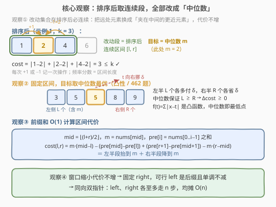
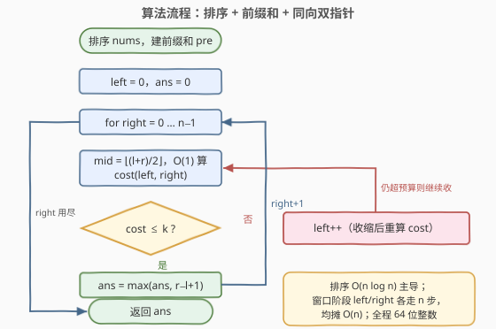
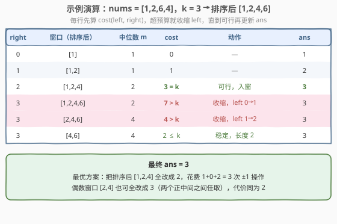

# 执行操作使频率分数最大

- **题目名称**：执行操作使频率分数最大
- **链接**：[2968. 执行操作使频率分数最大](https://leetcode.cn/problems/apply-operations-to-maximize-frequency-score/)
- **难度**：困难
- **标签**：数组、排序、滑动窗口、前缀和、二分查找

## 1. 题目概述

给你一个下标从 **0** 开始的整数数组 `nums` 和一个整数 `k`。

你可以对数组执行**至多** `k` 次操作：

- 从数组中选择一个下标 `i`，将 `nums[i]` **增加** 或者 **减少** `1`。

最终数组的**频率分数**定义为数组中**众数**的**频率**。

请你返回你可以得到的 **最大** 频率分数。

众数指的是数组中出现次数最多的数。一个元素的频率指的是数组中这个元素的出现次数。

**示例 1**：

```text
输入：nums = [1,2,6,4], k = 3
输出：3
解释：我们可以对数组执行以下操作：
- 选择 i = 0，将 nums[0] 增加 1，得到数组 [2,2,6,4]。
- 选择 i = 3，将 nums[3] 减少 1，得到数组 [2,2,6,3]。
- 选择 i = 3，将 nums[3] 减少 1，得到数组 [2,2,6,2]。
元素 2 是最终数组中的众数，出现了 3 次，所以频率分数为 3。
```

**示例 2**：

```text
输入：nums = [1,4,4,2,4], k = 0
输出：3
解释：我们无法执行任何操作，所以得到的频率分数是原数组中众数的频率 3。
```

**约束条件**：

- $1 \le \text{nums.length} \le 10^5$
- $1 \le \text{nums[i]} \le 10^9$
- $0 \le k \le 10^{14}$

> 💡 本题是 [1838. 最高频元素的频数](https://leetcode.cn/problems/frequency-of-the-most-frequent-element/) 的**双向版**：1838 每次操作只能「+1」，本题允许「±1」。两题完全同构——都是「**排序 + 滑动窗口 + 前缀和**」，唯一区别是最优目标值：只能增 → 目标取窗口**最大值**；可增可减 → 目标取窗口**中位数**（[462. 最小操作次数使数组元素相等 II](https://leetcode.cn/problems/minimum-moves-to-equal-array-elements-ii/) 的经典结论）。

---

## 2. 解题思路

### 2.1 暴力思路

最终众数是某个值 $t$，被改成 $t$（含原本就是 $t$）的元素构成一个集合。朴素做法：排序后枚举所有区间 $[l, r]$（$O(n^2)$ 个），对每个区间枚举目标值并计算把区间内元素全部变成目标的总代价（$O(n)$），统计代价 $\le k$ 的最长区间，总计 $O(n^3)$；即使前缀和优化代价计算到 $O(1)$，也有 $O(n^2) \approx 10^{10}$ 个区间，$n = 10^5$ 下必然超时。

瓶颈在于：**大量区间互相重叠、代价被反复计算**，且我们不知道哪些区间可行。需要三步转化：**排序把改动集合规约成连续区间、中位数把目标值确定下来、前缀和 + 同向双指针把「最长可行区间」压到线性扫描**。

### 2.2 核心观察：排序 + 中位数 + 同向双指针



**观察 1（改动的元素在排序后是连续段）**：设最终众数为 $t$，所有最终值为 $t$ 的元素构成集合 $S$（原本等于 $t$ 的元素代价为 $0$，交换中不会被换出）。若排序后 $i < j < l$ 且 $i, l \in S$ 而 $j \notin S$，由 $v_i \le v_j \le v_l$：若 $v_j < t$，则 $|v_j - t| \le |v_i - t|$，把 $j$ 换进、$i$ 换出，代价不增；若 $v_j > t$，则 $|v_j - t| \le |v_l - t|$，把 $j$ 换进、$l$ 换出，代价不增。反复交换后 $S$ 收敛为排序后的**连续区间**。于是问题转化为：

> 在排序后的数组中，找最长区间 $[l, r]$，使「区间内元素全部变成同一个值」的最小代价 $\le k$。

**观察 2（目标取中位数最优）**：固定区间，代价函数 $f(t) = \sum |x_i - t|$ 是**凸**的分段线性函数，在**中位数**处取最小——把 $t$ 从中位数向右挪 $\delta$，左侧（含等于）$L$ 个元素各多付 $\delta$、右侧 $R$ 个各省 $\delta$，中位数保证 $L \ge R$，故 $\Delta\text{cost} = \delta(L - R) \ge 0$；向左挪同理。区间长度为偶数时，两个正中间元素之间的任何整数（含两端）代价相同，取 $nums[\text{mid}]$、$\text{mid} = \lfloor (l+r)/2 \rfloor$ 即可。

**观察 3（前缀和 $O(1)$ 算代价）**：排序后建前缀和 $\text{pre}[i] = \sum_{j<i} nums[j]$，则

$$
\text{cost}(l, r) = \underbrace{m \cdot (\text{mid} - l) - \big(\text{pre}[\text{mid}] - \text{pre}[l]\big)}_{\text{左半段全部抬到 } m} + \underbrace{\big(\text{pre}[r+1] - \text{pre}[\text{mid}+1]\big) - m \cdot (r - \text{mid})}_{\text{右半段全部降到 } m}
$$

其中 $m = nums[\text{mid}]$。每项都是 $O(1)$。

**观察 4（代价对窗口单调 → 滑动窗口）**：区间去掉一个元素，最小代价不增——设 $t^\*$ 是 $S \cup \{y\}$ 的最优目标，则 $\text{cost}(S) \le \sum_{x \in S} |x - t^\*| \le \sum_{x \in S \cup \{y\}} |x - t^\*| = \text{cost}(S \cup \{y\})$。因此固定 $right$ 时可行的 $left$ 构成一段**后缀** $[f(right), right]$，且 $right$ 右移后 $f$ 单调不减——这正是**同向双指针**适用的信号，`left`、`right` 都只增不减。

### 2.3 算法流程图



**完整步骤**：

1. 排序 `nums`，建前缀和 `pre`
2. 初始化 `left = 0`、`ans = 0`
3. `right` 从 $0$ 到 $n-1$ 逐个右移，用观察 3 的公式 $O(1)$ 计算 $\text{cost}(left, right)$
4. 若代价 $> k$：循环执行 `left++` 并重算，直到恢复可行（`left == right` 时代价为 $0$，必然终止）
5. 更新 $ans = \max(ans,\ right - left + 1)$
6. `right` 走完全程，返回 `ans`

### 2.4 示例演算



以示例 1 `nums = [1,2,6,4]`、`k = 3` 为例，排序后为 `[1,2,4,6]`（完整过程见上表）：

- `right = 2` 时窗口 `[1,2,4]` 以中位数 $2$ 为目标，代价 $1 + 0 + 2 = 3$ 恰好等于 $k$，`ans = 3`。
- `right = 3` 时窗口 `[1,2,4,6]` 代价 $7 > 3$，连续收缩两次（`[2,4,6]` 代价 $4 > 3$ 仍超），最终窗口 `[4,6]` 代价 $2 \le 3$，长度 $2$ 不超过 `ans`。
- 最终答案 $3$ ✓

顺带验证示例 2：`nums = [1,4,4,2,4]`、$k=0$，排序后 `[1,2,4,4,4]`，窗口 `[4,4,4]` 代价 $0 \le 0$，`ans = 3` ✓。

---

## 3. 参考代码

### C++

```cpp
class Solution {
  public:
    int maxFrequencyScore(vector<int>& nums, long long k) {
        int n = nums.size();
        sort(nums.begin(), nums.end());
        vector<long long> pre(n + 1);
        for (int i = 0; i < n; i++) pre[i + 1] = pre[i] + nums[i];

        auto cost = [&](int l, int r) -> long long {  // nums[l..r] 全改成中位数的代价
            int mid = (l + r) / 2;
            long long m = nums[mid];
            return m * (mid - l) - (pre[mid] - pre[l])           // 左半段抬到 m
                 + (pre[r + 1] - pre[mid + 1]) - m * (r - mid);  // 右半段降到 m
        };

        int ans = 0, left = 0;
        for (int right = 0; right < n; right++) {
            while (cost(left, right) > k) left++;  // 超预算就收缩；left==right 时代价 0 必停
            ans = max(ans, right - left + 1);
        }
        return ans;
    }
};
```

### Python

```python
class Solution:
    def maxFrequencyScore(self, nums: List[int], k: int) -> int:
        nums.sort()
        n = len(nums)
        pre = [0] * (n + 1)
        for i, x in enumerate(nums):
            pre[i + 1] = pre[i] + x

        def cost(l: int, r: int) -> int:
            mid = (l + r) // 2
            m = nums[mid]
            return (m * (mid - l) - (pre[mid] - pre[l])
                  + pre[r + 1] - pre[mid + 1] - m * (r - mid))

        ans = left = 0
        for right in range(n):
            while cost(left, right) > k:
                left += 1
            ans = max(ans, right - left + 1)
        return ans
```

> ⚠️ **溢出**：前缀和最高约 $10^5 \times 10^9 = 10^{14}$，$m \cdot (\text{mid} - l)$ 同量级，$k$ 本身可达 $10^{14}$，而 32 位 `int` 上限约 $2.1 \times 10^9$——C++ 必须全程 `long long`（`pre`、`m` 及其乘法全部涉及）；Python 天然支持大整数无碍。

---

## 4. 复杂度分析

| 维度 | 复杂度 | 说明 |
|------|--------|------|
| 时间复杂度 | $O(n \log n)$ | 排序主导；窗口阶段 `left`、`right` 各至多前进 $n$ 步，每步代价计算 $O(1)$，均摊 $O(n)$ |
| 空间复杂度 | $O(n)$ | 前缀和数组（排序原地完成） |

---

## 5. 扩展：二分答案写法与 1838 的对照

**二分答案**（官方 hints 的思路）：由观察 4 的推论，「长度为 $L$ 的可行窗口存在」关于 $L$ 单调（若长度 $L$ 可行，从中截取 $L-1$ 也可行）。于是二分答案长度，每次 $O(n)$ 扫描所有长度为 $L$ 的窗口检查最小代价是否 $\le k$，总复杂度同样 $O(n \log n)$：

```cpp
int lo = 1, hi = n;
while (lo < hi) {
    int mid = (lo + hi + 1) / 2;
    if (feasible(mid)) lo = mid;   // 存在长度 mid 的窗口代价 ≤ k
    else hi = mid - 1;
}
return lo;
```

与滑动窗口对比：复杂度同阶，滑窗一次线性扫描常数更小、代码更短；二分版「猜长度再验证」的框架更通用——当可行性不满足双指针所需的单调性时（本题满足），二分往往仍是保底方案。

**与 1838 的对照**：1838 只能 +1，目标必须 $\ge$ 窗口最大值，最优目标取 $nums[r]$，代价 $= nums[r] \cdot \text{len} - \sum \text{窗口}$（前缀和只需用到一半）；本题可 ±1，最优目标变成中位数，代价公式左右对称各一半。两题的窗口移动逻辑完全相同。

---

## 6. 面试要点

1. **为什么改动的元素排序后一定连续？**

   - 交换论证：若改动集合在排序后有「洞」，洞中元素离目标比某一端更近，把它换进、把更远的一端换出，代价不增、个数不变。因此最优方案总是「排序后一段连续区间 + 全改成同一个值」。

2. **为什么目标取中位数？偶数长度区间取哪个？**

   - $f(t) = \sum |x_i - t|$ 是凸函数，中位数处最小：向一侧偏移 $\delta$，代价变化 $\delta \cdot (L - R)$，中位数保证偏移方向上「元素不少于一半的那侧」多付，代价不降。偶数长度时两个正中间元素之间任取一个整数（含两端）代价相同。

3. **滑动窗口为什么正确？收缩会不会误删最优解？**

   - 代价随窗口缩小单调不增（$\text{cost}(子区间) \le \text{cost}(父区间)$），所以固定 `right` 时可行 `left` 是一段后缀，且该后缀起点随 `right` 右移单调不减。双指针不重不漏地扫过所有「极大可行窗口」。

4. **哪些地方会溢出？**

   - 前缀和、$m \cdot (\text{mid} - l)$、$k$ 三者都可到 $10^{14}$ 量级，超过 32 位整数上限，必须用 64 位整数。

5. **和 1838 的本质区别是什么？**

   - 操作方向：只能增 vs 可增可减，导致最优目标从「区间最大值」变成「区间中位数」；排序、前缀和、滑动窗口的骨架完全同构，可以当成同一套模板的两个实例。

---

## 7. 同类练习题

- [1838. 最高频元素的频数](https://leetcode.cn/problems/frequency-of-the-most-frequent-element/)：只能 +1 的单向版，目标取窗口最大值（本仓库已有题解）
- [462. 最小操作次数使数组元素相等 II](https://leetcode.cn/problems/minimum-moves-to-equal-array-elements-ii/)：中位数最小化 $\sum |x - t|$ 的母题（本仓库已有题解）
- [2602. 使数组元素全部相等的最少操作数](https://leetcode.cn/problems/minimum-operations-to-make-all-array-elements-equal/)：中位数 + 前缀和 + 按目标值二分的查询版
- [2967. 使数组成为等数数组的最小代价](https://leetcode.cn/problems/minimum-cost-to-make-array-equalindromic/)：中位数家族再进一步——目标还必须是回文数
- [2090. 半径为 k 的子数组平均值](https://leetcode.cn/problems/k-radius-subarray-averages/)：前缀和 $O(1)$ 查询定长窗口的基础练习
