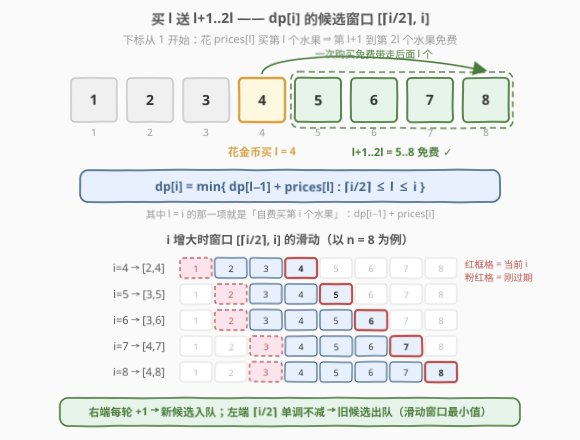
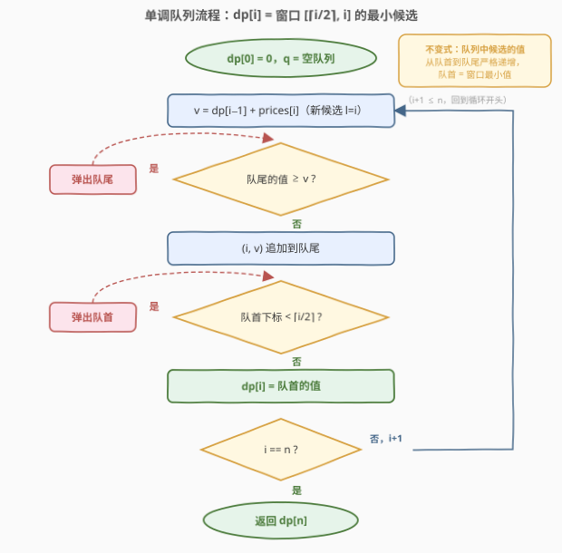
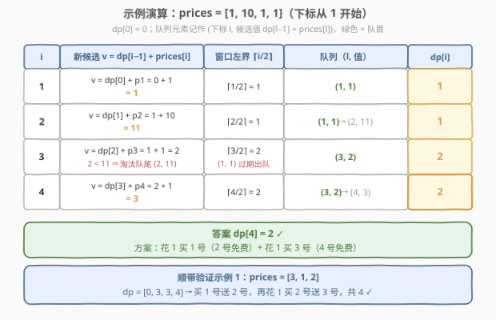

# LeetCode 购买水果需要的最少金币数 II 题解

## 1. 题目概述

- **标题 / 题号**：购买水果需要的最少金币数 II（#2969，hard）
- **链接**：https://leetcode.cn/problems/minimum-number-of-coins-for-fruits-ii/
- **难度**：困难
- **标签**：队列、数组、动态规划、单调队列、堆（优先队列）

> ⚠️ 本题为 LeetCode 付费题，题意描述根据官方示例用例与 hints 重建，可能与官方题面有出入。

**题意**：你在一个水果超市里，货架上的水果排成一行。给你一个 **下标从 1 开始** 的整数数组 `prices`，其中 `prices[i]` 表示购买第 `i` 个水果需要的金币数。

超市有以下促销活动：

- 如果你用 `prices[i]` 个金币购买第 `i` 个水果，那么**接下来的 `i` 个水果**（第 $i+1$ 到第 $2i$ 个）你都可以**免费获得**。

**注意**：即使你**可以**免费获得第 $j$ 个水果，你仍然可以用 `prices[j]` 个金币来购买它，以获取它带来的新优惠。

请返回获得**所有**水果所需的最少金币数。

**示例 1**：

```text
输入：prices = [3,1,2]
输出：4
解释：用 3 个金币购买第 1 个水果，可以免费获得第 2 个水果；
      再用 1 个金币购买第 2 个水果（虽然它已免费，但买它能触发新优惠），免费获得第 3 个水果。
      即使可以免费获得第 2 个水果，购买它是更优的选择。
```

**示例 2**：

```text
输入：prices = [1,10,1,1]
输出：2
解释：用 1 个金币购买第 1 个水果，免费获得第 2 个水果；
      用 1 个金币购买第 3 个水果，免费获得第 4 个水果。
```

**约束**：

- $1 \le \text{prices.length} \le 10^5$
- $1 \le \text{prices[i]} \le 10^5$

> 💡 本题与 [2944. 购买水果需要的最少金币数](https://leetcode.cn/problems/minimum-number-of-coins-for-fruits/) **完全同题**，只是把 $n \le 1000$ 加强到 $n \le 10^5$：2944 的 $O(n^2)$ DP 在本题会超时，必须用**单调队列**把每个状态的转移优化到均摊 $O(1)$。

## 2. 解题思路

### 2.1 暴力思路

定义 $dp[i]$ = 获得前 $i$ 个水果（第 $1 \sim i$ 个）所需的最少金币，$dp[0] = 0$。

按「最优方案中**最后一次购买**发生在哪个下标」做决策分解。设最后一次购买发生在下标 $l$：

- 这次购买花掉 $prices[l]$，免费覆盖到第 $2l$ 个水果；
- 要让第 $i$ 个水果被这次购买覆盖，需 $i \le 2l$，即 $l \ge \lceil i/2 \rceil$；
- 第 $l$ 个水果之前的部分（前 $l-1$ 个水果）的最优代价恰好是 $dp[l-1]$；
- 边界情形 $l = i$ 对应「自费买第 $i$ 个水果」，即 $dp[i-1] + prices[i]$，与统一公式相容。

$$dp[i] = \min_{\lceil i/2 \rceil \le l \le i} \big(dp[l-1] + prices[l]\big)$$

> ⚠️ **「免费的水果也能再买」是转移成立的关键**：第 $l$ 个水果即使已被 $dp[l-1]$ 对应方案免费覆盖，我们仍可以花 $prices[l]$ 买它来触发它的优惠。因此「前缀最优 $dp[l-1]$」和「单独买第 $l$ 个」总能无缝拼接，不必关心前缀方案是否已经覆盖了 $l$。

每个状态枚举 $O(n)$ 个 $l$，总计 $O(n^2) \approx 10^{10}$（$n = 10^5$）——超时。这正是 2969 与 2944 的分界线。

### 2.2 核心观察：转移区间是滑动窗口 → 单调队列



**观察 1（窗口两端都单调）**：候选 $l$ 的合法区间是 $[\lceil i/2 \rceil,\ i]$。当 $i \to i+1$ 时，右端点恰好 $+1$（新增候选 $l = i+1$），左端点 $\lceil i/2 \rceil$ 单调不减（$i$ 为偶数时不动、奇数时 $+1$）。因此**每个下标 $l$ 恰好入窗一次、出窗至多一次**。

**观察 2（候选值在入窗前就已确定）**：$w[l] = dp[l-1] + prices[l]$ 只依赖 $dp[l-1]$；计算 $dp[i]$ 时 $dp[i-1]$ 及更早的值都已就绪，所以新候选 $l = i$ 的值可以当场算出、无需回头修改。

这两点合起来正是「**滑动窗口最小值**」的标准结构：用一个**值从队首到队尾严格递增**的双端队列维护候选，插入、过期、取最小均摊 $O(1)$。

> 💡 官方 hints 还提到 multiset 与「DP + 树状数组」两条 $O(n \log n)$ 路线，本质都是这个窗口最小值查询的通用替身；单调队列是其中最轻量的 $O(n)$ 做法。

### 2.3 算法流程图



**完整步骤**：

1. `dp[0] = 0`，空队列 `q`（存 `(l, w[l])`，值从队首到队尾严格递增）
2. `i` 从 $1$ 到 $n$，每轮：
   - 计算新候选 `v = dp[i-1] + prices[i]`；把队尾值 `≥ v` 的候选依次弹出，再将 `(i, v)` 入队尾；
   - 弹出队首下标 `< ⌈i/2⌉` 的过期候选；
   - `dp[i] = 队首值`（即窗口 $[\lceil i/2\rceil, i]$ 内的最小候选）
3. 返回 `dp[n]`

### 2.4 示例演算

以示例 2 `prices = [1,10,1,1]` 为例（下标从 1 开始，共 4 步）：

- `i=1`：新候选 `(1, dp[0]+p1=1)`；窗口 `[1,1]`；`dp[1]=1`
- `i=2`：新候选 `(2, dp[1]+10=11)`；窗口 `[1,2]`；`dp[2]=min(1,11)=1`
- `i=3`：新候选 `(3, dp[2]+1=2)`，因 $2 < 11$ 淘汰队尾 `(2,11)`；窗口缩为 `[2,3]`，弹出过期的 `(1,1)`；`dp[3]=2`
- `i=4`：新候选 `(4, dp[3]+1=3)`；窗口 `[2,4]`；`dp[4]=min(2,3)=2` ✓



对应方案：花 1 买 1 号（2 号免费），再花 1 买 3 号（4 号免费），共 2 金币。顺带验证示例 1 `[3,1,2]`：$dp = [0,3,3,4]$，即买 1 号送 2 号、再花 1 买 2 号送 3 号，共 4 ✓。

## 3. 参考代码

### C++

```cpp
class Solution {
  public:
    int minimumCoins(vector<int>& prices) {
        int n = prices.size();
        vector<int> dp(n + 1, 0);              // dp[i]: 获得前 i 个水果的最少金币
        deque<pair<int, int>> q;               // (l, dp[l-1] + prices[l])，值严格递增
        for (int i = 1; i <= n; i++) {
            int v = dp[i - 1] + prices[i - 1];     // 新候选 l = i
            while (!q.empty() && q.back().second >= v) q.pop_back();
            q.emplace_back(i, v);
            int lo = (i + 1) / 2;                  // l >= ceil(i/2)
            while (q.front().first < lo) q.pop_front();
            dp[i] = q.front().second;              // 窗口 [lo, i] 的最小候选
        }
        return dp[n];
    }
};
```

### Python

```python
class Solution:
    def minimumCoins(self, prices: List[int]) -> int:
        n = len(prices)
        dp = [0] * (n + 1)              # dp[i]: 获得前 i 个水果的最少金币
        q = deque()                     # (l, dp[l-1] + prices[l])，值严格递增
        for i in range(1, n + 1):
            v = dp[i - 1] + prices[i - 1]   # 新候选 l = i
            while q and q[-1][1] >= v:
                q.pop()
            q.append((i, v))
            lo = (i + 1) // 2              # l >= ceil(i/2)
            while q[0][0] < lo:
                q.popleft()
            dp[i] = q[0][1]                # 窗口 [lo, i] 的最小候选
        return dp[n]
```

> ⚠️ 溢出与边界：只需购买 $1, 2, 4, 8, \dots, 2^k$ 号水果（每次购买的免费区间长度翻倍）即可覆盖全部 $n$ 个水果，约 $\log n + 1$ 次购买、每次 $\le 10^5$ 金币，故答案与中间量 $dp[i-1] + prices[i]$ 均 $\le 2 \times 10^6$，`int` 足够。另外 `(i, v)` 刚入队时必有 $i \ge \lceil i/2 \rceil$，队首过期判断前队列非空，无越界风险。

## 4. 复杂度分析

| 维度 | 复杂度 | 说明 |
|------|--------|------|
| 时间复杂度 | $O(n)$ | 每个候选 $l$ 恰好入队一次、出队至多一次（队尾淘汰或队首过期），均摊 $O(1)$ |
| 空间复杂度 | $O(n)$ | `dp` 数组与队列各 $O(n)$；倒序做法可在 `prices` 上原地转移省去 dp 数组，队列仍需 $O(n)$ |

## 5. 扩展：倒序 DP 与其它实现

**倒序定义**：$f[i]$ = 从第 $i$ 个水果开始买完剩余全部水果的最少金币，则

$$f[i] = prices[i] + \min_{i+1 \le j \le 2i+1} f[j]$$

（区间右端超出 $n$ 时按边界截断），答案为 $f[1]$。窗口右端 $2i+1$ 随 $i$ 减小而收缩，同样可用单调队列 $O(n)$ 求解，且可直接在 `prices` 数组上原地转移、省掉 dp 数组。

**multiset / 树状数组**（官方 hints 给出的两条路）：把候选值 $w[l]$ 放进 `multiset`，每轮插入新候选、删除过期候选、取 `*begin()` 即最小值，$O(n \log n)$；树状数组/线段树维护「单点更新 + 区间最小」同理。它们不如单调队列轻量，但当窗口左右端点**不规则移动**时依然适用，是滑动窗口最值的通用兜底。

## 6. 面试要点

1. **转移方程里 $l = i$ 这一项对应什么？**

   - 「自费买第 $i$ 个水果」：$dp[i-1] + prices[i]$。它与 $l < i$ 的「买 $l$ 送后面」统一在 $dp[i] = \min_{\lceil i/2\rceil \le l \le i}(dp[l-1] + prices[l])$ 一个式子里，不需要单独分类讨论。

2. **为什么决策分解不会漏掉最优解？**

   - 取最优方案中**最后一次购买**的位置 $l^*$。若 $l^* < \lceil i/2 \rceil$，则 $2l^* < i$，而更早的购买覆盖得更短，第 $i$ 个水果无人覆盖，矛盾；故 $l^*$ 落在窗口内。把 $l^*$ 之前的部分替换成最优前缀 $dp[l^*-1]$ 只会更省且依然合法——购买的覆盖范围只与位置有关，与前缀怎么买无关。

3. **「免费拿到还能再买」这条规则为什么重要？**

   - 它保证了转移的完备性：第 $l$ 个水果即使被前缀方案免费覆盖，再花 $prices[l]$ 买它就能得到 $l+1..2l$ 的免费权。示例 1 的最优解（免费拿到 2 号仍花 1 金币买它）正是这条规则的直接体现。

4. **单调队列为什么均摊 $O(1)$？和 239 题有何异同？**

   - 每个下标入队一次、出队至多一次，总操作数 $\le 2n$。239（滑动窗口最大值）是**定长**窗口、两端同步滑动；本题窗口右端每步 $+1$、左端每 $0 \sim 1$ 步 $+1$（长度 $\lfloor i/2 \rfloor + 1$ 逐渐变长），但「两端都单调移动」的本质相同，单调队列照用。

5. **如果 $n \le 1000$（即 2944）怎么做？**

   - 直接按转移方程 $O(n^2)$ 枚举，$10^6$ 量级轻松通过。本题把 $n$ 抬到 $10^5$，逼出线性优化——「数据范围放大两个数量级」通常就是「平方复杂度 → 线性/线性对数」的信号。

## 同类练习题

| # | 题目 | 与本题的关联 |
|---|------|-------------|
| 2944 | [购买水果需要的最少金币数](https://leetcode.cn/problems/minimum-number-of-coins-for-fruits/) | 本题的免费小数据版（$n \le 1000$），$O(n^2)$ DP 可过，适合先写暴力再优化 |
| 239 | [滑动窗口最大值](https://leetcode.cn/problems/sliding-window-maximum/) | 单调队列模板题，定长窗口的最大值版本 |
| 1696 | [跳跃游戏 VI](https://leetcode.cn/problems/jump-game-vi/) | dp[i] 依赖前 k 个 dp 值的最大值——单调队列优化 DP 的招牌题 |
| 1425 | [带限制的子序列和](https://leetcode.cn/problems/constrained-subsequence-sum/) | dp 依赖「往前一段窗口」的最大值，与本题同构 |
| 862 | [和至少为 K 的最短子数组](https://leetcode.cn/problems/shortest-subarray-with-sum-at-least-k/) | 单调队列维护候选下标的另一经典形态（按前缀和单调性出队） |
