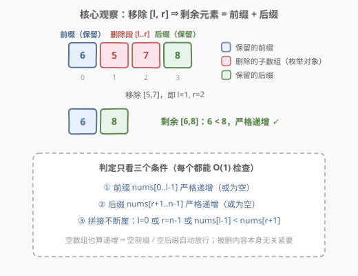
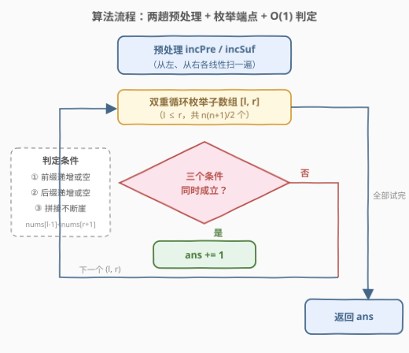
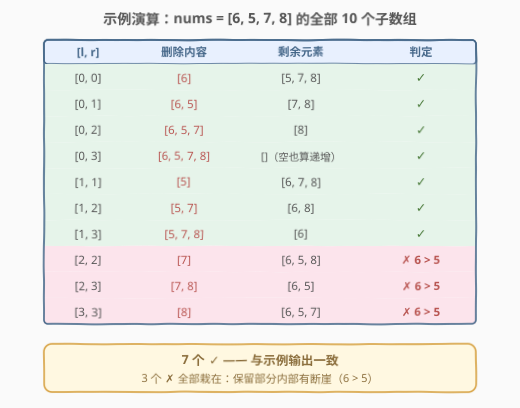
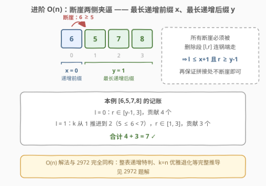

# LeetCode 统计移除递增子数组的数目 I 题解

## 1. 题目概述

- **标题 / 题号**：统计移除递增子数组的数目 I（#2970，easy）
- **链接**：https://leetcode.cn/problems/count-the-number-of-incremovable-subarrays-i/
- **难度**：简单
- **标签**：数组、双指针、二分查找、枚举

**题意**：给你一个下标从 **0** 开始的 **正** 整数数组 `nums`。

如果 `nums` 的一个子数组满足：移除这个子数组后剩余元素 **严格递增**，那么我们称这个子数组为 **移除递增** 子数组。比方说，`[5, 3, 4, 6, 7]` 中的 `[3, 4]` 是一个移除递增子数组，因为移除该子数组后，`[5, 3, 4, 6, 7]` 变为 `[5, 6, 7]`，是严格递增的。

请你返回 `nums` 中 **移除递增** 子数组的总数目。

**注意**，剩余元素为空的数组也视为是递增的。

**子数组** 指的是一个数组中一段非空且连续的元素序列。

**示例 1**：

```text
输入：nums = [1,2,3,4]
输出：10
解释：10 个移除递增子数组分别为：[1], [2], [3], [4], [1,2], [2,3], [3,4], [1,2,3], [2,3,4] 和 [1,2,3,4]。
移除任意一个子数组后，剩余元素都是递增的。注意，空数组不是移除递增子数组。
```

**示例 2**：

```text
输入：nums = [6,5,7,8]
输出：7
解释：7 个移除递增子数组分别为：[5], [6], [5,7], [6,5], [5,7,8], [6,5,7] 和 [6,5,7,8]。
nums 中只有这 7 个移除递增子数组。
```

**示例 3**：

```text
输入：nums = [8,7,6,6]
输出：3
解释：3 个移除递增子数组分别为：[8,7,6], [7,6,6] 和 [8,7,6,6]。
注意 [8,7] 不是移除递增子数组，因为移除 [8,7] 后 nums 变为 [6,6]，它不是严格递增的。
```

**约束**：

- $1 \le \text{nums.length} \le 50$
- $1 \le \text{nums}[i] \le 50$

> 💡 本题与 [2972. 统计移除递增子数组的数目 II](https://leetcode.cn/problems/count-the-number-of-incremovable-subarrays-ii/) 题面一字不差，仅数据范围不同（II 版 $n \le 10^5$）。官方 hint 明示「两重循环枚举所有子数组」——$O(n^3)$ 暴力是本题的门票解；但从暴力逐层优化到 $O(n^2)$ 预处理、再到 $O(n)$ 双指针的完整路径，才是这组双题的真正考点。本文主线讲 $O(n^2)$ 预处理判定，$O(n)$ 进阶见第 5 节（完整推导在 2972 题解）。

## 2. 解题思路

### 2.1 暴力思路：枚举全部子数组，整体重建检查

按定义直译：枚举全部 $\dfrac{n(n+1)}{2}$ 个子数组 $[l, r]$，把剩余元素拼出来整体扫一遍，检查是否严格递增，总计 $O(n^3)$：

```text
ans = 0
for l in 0..n-1:
    for r in l..n-1:
        rest = nums[0..l-1] + nums[r+1..n-1]
        if rest 严格递增: ans += 1
return ans
```

$n = 50$ 时子数组共 $\dfrac{50 \times 51}{2} = 1275$ 个，每个检查至多 50 次比较，总计约 $6 \times 10^4$ 次操作——对本题的数据范围绰绰有余。

> ⚠️ 暴力的浪费点：同一个前缀 $\text{nums}[0..l-1]$ 在不同 $r$ 的枚举里被一遍遍重复检查；同一个后缀 $\text{nums}[r+1..n-1]$ 也在不同 $l$ 下被反复扫描。合法性信息完全可以**预处理后复用**，这正是下一步的入口。

### 2.2 核心观察：剩余永远是「前缀 + 后缀」，判定可以 O(1)

**第一刀转化**：设删除的子数组为 $\text{nums}[l..r]$（非空），剩余元素必然是前缀 $\text{nums}[0..l-1]$ 与后缀 $\text{nums}[r+1..n-1]$ 的拼接，**与被删内容本身无关**。删除合法当且仅当三个条件同时成立：

1. **前缀严格递增**（或为空）；
2. **后缀严格递增**（或为空）；
3. **拼接处不断崖**：前缀为空、或后缀为空、或 $\text{nums}[l-1] < \text{nums}[r+1]$。



**第二刀预处理**：条件 1、2 是「一段区间是否严格递增」的询问，用两个布尔数组各扫一趟即可预处理：

$$\text{incPre}[i] = \text{incPre}[i-1] \wedge \left(\text{nums}[i-1] < \text{nums}[i]\right), \qquad \text{incSuf}[i] = \text{incSuf}[i+1] \wedge \left(\text{nums}[i] < \text{nums}[i+1]\right)$$

其中 $\text{incPre}[i]$ 表示 $\text{nums}[0..i]$ 严格递增、$\text{incSuf}[i]$ 表示 $\text{nums}[i..n-1]$ 严格递增。于是「前缀 $\text{nums}[0..l-1]$ 递增」$\iff l = 0$ 或 $\text{incPre}[l-1]$，「后缀 $\text{nums}[r+1..n-1]$ 递增」$\iff r = n-1$ 或 $\text{incSuf}[r+1]$——**三条件全部 $O(1)$ 判定**，总复杂度从 $O(n^3)$ 降到 $O(n^2)$。

> 💡 注意「空也算递增」的约定在这里被天然吸收：$l = 0$（空前缀）与 $r = n-1$（空后缀）各占一个短路分支，无需任何特判；「删除段必须非空」则由枚举本身保证（$r \ge l$）。

### 2.3 算法流程图



**完整步骤**：

1. **从左往右**递推 $\text{incPre}$：$\text{incPre}[0] = \text{true}$，其后每项继承前项并新增相邻比较；
2. **从右往左**递推 $\text{incSuf}$：$\text{incSuf}[n-1] = \text{true}$，对称处理；
3. **双重循环枚举** $[l, r]$（$0 \le l \le r \le n-1$），按三条件 $O(1)$ 判定，合法则 $\text{ans} \mathrel{+}= 1$；
4. 返回 $\text{ans}$。

> ⚠️ 两个易错边界：① **空数组不算删除**——枚举保证 $r \ge l$，删除段至少一个元素；② **可以删掉整个数组**——$l = 0, r = n-1$ 时前后缀皆空，天然合法。

### 2.4 示例演算

以示例 2 `nums = [6,5,7,8]` 为例，$n = 4$，共 $10$ 个子数组，逐一判定：

- **删左端（$l = 0$）**：剩 $[5,7,8]$、$[7,8]$、$[8]$、$[]$，全递增——4 个 ✓；
- **删中段（$l = 1$）**：删 $[5]$ 剩 $[6,7,8]$ ✓，删 $[5,7]$ 剩 $[6,8]$（$6 < 8$）✓，删 $[5,7,8]$ 剩 $[6]$ ✓——3 个；
- **删右段（$l \ge 2$）**：剩余都含 $[6,5]$ 这个断崖——删 $[7]$ 剩 $[6,5,8]$ ✗、删 $[7,8]$ 剩 $[6,5]$ ✗、删 $[8]$ 剩 $[6,5,7]$ ✗。

合计 $4 + 3 + 0 = 7$ ✓，与示例输出一致。全部 10 行明细见下表：



> 💡 观察 ✗ 的三行：它们全栽在「保留部分内部有断崖」——这正是 2.2 三条件里条件 ①② 的作用；而条件 ③（拼接不断崖）在本例未被触发，示例 3 的 `nums = [8,7,6,6]` 里 `删 [8,7] 剩 [6,6]` 则是专踩条件 ② 的反例（$6 \ge 6$ 非严格递增）。

## 3. 参考代码

### C++

```cpp
class Solution {
public:
    int incremovableSubarrayCount(vector<int>& nums) {
        int n = nums.size();
        vector<bool> incPre(n), incSuf(n);          // incPre[i]: nums[0..i] 严格递增
        incPre[0] = incSuf[n - 1] = true;           // incSuf[i]: nums[i..n-1] 严格递增
        for (int i = 1; i < n; i++)
            incPre[i] = incPre[i - 1] && nums[i - 1] < nums[i];
        for (int i = n - 2; i >= 0; i--)
            incSuf[i] = incSuf[i + 1] && nums[i] < nums[i + 1];

        int ans = 0;
        for (int l = 0; l < n; l++)
            for (int r = l; r < n; r++)
                if ((l == 0 || incPre[l - 1]) &&                // ① 前缀递增或空
                    (r == n - 1 || incSuf[r + 1]) &&            // ② 后缀递增或空
                    (l == 0 || r == n - 1 ||                    // ③ 拼接不断崖
                     nums[l - 1] < nums[r + 1]))
                    ans++;
        return ans;
    }
};
```

### Python

```python
class Solution:
    def incremovableSubarrayCount(self, nums: List[int]) -> int:
        n = len(nums)
        inc_pre = [True] * n                    # inc_pre[i]: nums[0..i] 严格递增
        inc_suf = [True] * n                    # inc_suf[i]: nums[i..n-1] 严格递增
        for i in range(1, n):
            inc_pre[i] = inc_pre[i - 1] and nums[i - 1] < nums[i]
        for i in range(n - 2, -1, -1):
            inc_suf[i] = inc_suf[i + 1] and nums[i] < nums[i + 1]

        ans = 0
        for l in range(n):
            for r in range(l, n):
                if (l == 0 or inc_pre[l - 1]) and \
                   (r == n - 1 or inc_suf[r + 1]) and \
                   (l == 0 or r == n - 1 or nums[l - 1] < nums[r + 1]):
                    ans += 1
        return ans
```

> 💡 判定式是三个条件的**直译**，短路分支（`l == 0`、`r == n - 1`）同时承担了「空段免检」与「空段跳过拼接比较」两重语义——不需要任何额外的边界特判。若只想稳妥拿分，2.1 的 $O(n^3)$ 暴力同样可以通过，只是错过了把「区间递增性」做成预处理的机会。

## 4. 复杂度分析

| 维度 | 复杂度 | 说明 |
|------|--------|------|
| **时间复杂度** | $O(n^2)$ | 预处理 $\text{incPre}$、$\text{incSuf}$ 各一趟 $O(n)$；枚举 $\dfrac{n(n+1)}{2}$ 个子数组，每个 $O(1)$ 判定 |
| **空间复杂度** | $O(n)$ | 两个布尔数组；若只写暴力则为 $O(1)$ 额外空间 |

> ⚠️ 对比暴力 $O(n^3)$：$n = 50$ 时两者都瞬间完成，差别要在 2972 的 $n = 10^5$ 下才见分晓——$O(n^3) \approx 10^{15}$、$O(n^2) \approx 10^{10}$、$O(n) \approx 10^5$，三档正好对应「超时 / 超时 / 通过」。

## 5. 扩展：O(n) 双指针 —— 原样平移到 2972

[2972. 统计移除递增子数组的数目 II](https://leetcode.cn/problems/count-the-number-of-incremovable-subarrays-ii/) 与本题题面完全相同，约束换成 $n \le 10^5$，$O(n^2)$ 也宣告失效。利用三条件的**结构受限性**可以压到 $O(n)$：

- 定义 $x$ 为**最长严格递增前缀**的末尾下标、$y$ 为**最长严格递增后缀**的起始下标。所有「断崖」（$\text{nums}[i] \ge \text{nums}[i+1]$ 的位置 $i$）必须被删除区间连锅端走，于是 $l \le x+1$ 且 $r \ge y-1$——枚举量骤减；
- $l$ 从小到大时 $\text{nums}[l-1]$ 沿递增前缀**严格递增**，于是「后缀中第一个 $> \text{nums}[l-1]$ 的下标 $k$」单调不减——$k$ 指针只前进不后退，合法性判定与计数合并成一趟扫描。



```python
class Solution:
    def incremovableSubarrayCount(self, nums: List[int]) -> int:
        n = len(nums)
        x = 0                                       # 最长严格递增前缀的末尾下标
        while x + 1 < n and nums[x] < nums[x + 1]:
            x += 1
        if x == n - 1:                              # 整个数组严格递增：全部子数组都合法
            return n * (n + 1) // 2

        y = n - 1                                   # 最长严格递增后缀的起始下标
        while y - 1 >= 0 and nums[y - 1] < nums[y]:
            y -= 1

        ans = n - y + 1                             # l = 0：删 [0..r]，r ∈ [y-1, n-1]
        k = y                                       # 后缀中第一个 > nums[l-1] 的下标
        for l in range(1, x + 2):                   # 枚举保留的前缀 nums[0..l-1]
            while k < n and nums[k] <= nums[l - 1]:
                k += 1
            ans += n - max(l, k - 1)                # r ∈ [max(l, k-1), n-1]
        return ans
```

| 解法 | 复杂度 | 2972 规模（$n = 10^5$）下的运算量 | 结果 |
|------|--------|-----------------------------------|------|
| 枚举 + 整体重建检查 | $O(n^3)$ | $\approx 10^{15}$ | 超时 |
| 预处理前后缀递增 + 枚举端点 | $O(n^2)$ | $\approx 10^{10}$ | 超时 |
| 前后缀分解 + 双指针计数 | $O(n)$ | $\approx 10^5$ | 通过 |

> ⚠️ 上面这份代码提交 2972 同样通过（2972 需把返回值换成 64 位整数：$n = 10^5$ 时答案上限 $\frac{n(n+1)}{2} \approx 5 \times 10^9$ 超出 32 位 `int`）。$x, y, k$ 三个游标的完整推导、二分解法与「$k = n$ 时公式优雅退化」的细节，见 [2972 题解](https://leetcode.cn/problems/count-the-number-of-incremovable-subarrays-ii/)。

## 6. 面试要点

1. **删除一段后剩余元素的形态是什么？为什么这是突破口？**

   - 剩余永远是「左前缀 $\text{nums}[0..l-1]$ + 右后缀 $\text{nums}[r+1..n-1]$」，与被删内容无关。合法性只由两个端点 $l, r$ 决定，于是 $O(n^2)$ 个删除区间的检查可以共享预处理，进一步还能按端点分桶计数。

2. **三个合法性条件分别怎么判？空段怎么处理？**

   - 前缀递增 $\iff l = 0$ 或 $\text{incPre}[l-1]$；后缀递增 $\iff r = n-1$ 或 $\text{incSuf}[r+1]$；拼接 $\iff l = 0$ 或 $r = n-1$ 或 $\text{nums}[l-1] < \text{nums}[r+1]$。「空数组也算递增」被前两个短路分支天然吸收，不需要特判。

3. **从 $O(n^2)$ 到 $O(n)$ 的单调性来自哪里？**

   - $l$ 递增时 $\text{nums}[l-1]$ 沿最长递增前缀严格递增，而 $k$（后缀中第一个更大值的下标）在递增后缀上必然单调不减——这等价于把重复的 `upper_bound` 二分摊还成一次线性扫描。

4. **哪些边界容易翻车？**

   - ① 空数组不是合法删除（$r \ge l$ 必须保证）；② 删整个数组合法（前后缀皆空）；③ 递增是**严格**的，`while` 与判定都用 `<`——示例 3 的 `[8,7,6,6]` 正是踩在 $6 \ge 6$ 的相等断崖上；④ 整个数组递增时答案为 $\frac{n(n+1)}{2}$（不含「删空」）。

5. **本题暴力就能过，为什么还要讲 $O(n^2)$ 和 $O(n)$？**

   - I/II 双题的设计意图就是「同一份题面、数据范围定解法档位」：$n \le 50$ 收编暴力，$n \le 10^5$ 检验套路。面试中先看数据范围反推目标复杂度，再沿「暴力 → 预处理 → 单调性」的路径逐层优化，是比直接背最优解更有说服力的展示。

> 💡 **一句话总结**：删除的合法性只挂在两个端点上——剩余 = 前缀 + 后缀，三条件（前缀递增 / 后缀递增 / 拼接不断崖）经两趟预处理后 $O(1)$ 判定，$O(n^2)$ 枚举端点数完全部合法删除；再借断崖夹逼与单调性可压到 $O(n)$，直接平移到 2972。

## 同类练习题

| # | 题目 | 与本题的关联 |
|---|------|-------------|
| 2972 | [统计移除递增子数组的数目 II](https://leetcode.cn/problems/count-the-number-of-incremovable-subarrays-ii/) | 本题 $n \le 10^5$ 的孪生版，$O(n)$ 双指针完整推导，体会数据范围如何决定解法档位 |
| 2908 | [元素和最小的山形三元组 I](https://leetcode.cn/problems/minimum-sum-of-mountain-triplets-i/) | 同款「I 版收编暴力、II 版逼出线性解」的双题设计，暴力与最优解的取舍路径一致 |
| 795 | [区间子数组个数](https://leetcode.cn/problems/number-of-subarrays-with-bounded-maximum/) | 「枚举端点 + 单调性 + 计数不枚举」的双指针计数骨架，与本题 $O(n)$ 版同源 |
| 2444 | [统计定界子数组的数目](https://leetcode.cn/problems/count-subarrays-with-fixed-bounds/) | 维护「最近违规位置」的计数型子数组进阶，与本题「断崖必须被删除段覆盖」一脉相承 |
| 238 | [除自身以外数组的乘积](https://leetcode.cn/problems/product-of-array-except-self/) | 前后缀分解思想的入门必修，感受「左半 + 右半」视角的普适性 |
