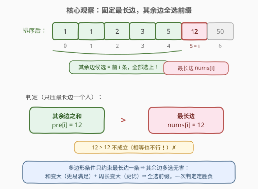
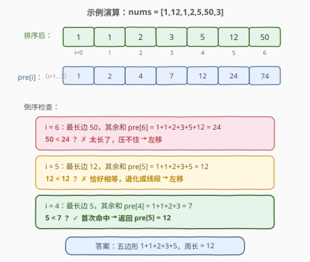

# LeetCode 找到最大周长的多边形 题解

## 1. 题目概述

- **标题 / 题号**：找到最大周长的多边形（#2971，medium）
- **链接**：https://leetcode.cn/problems/find-polygon-with-the-largest-perimeter/
- **难度**：中等
- **标签**：贪心、数组、排序、前缀和

**题意**：给你一个长度为 $n$ 的**正**整数数组 `nums`。

**多边形** 指的是一个至少有 3 条边的封闭二维图形。多边形的 **最长边** 一定 **小于** 所有其他边长度之和。

如果你有 $k$（$k \ge 3$）个 **正** 数 $a_1, a_2, a_3, \dots, a_k$ 满足 $a_1 \le a_2 \le a_3 \le \dots \le a_k$ **且** $a_1 + a_2 + a_3 + \dots + a_{k-1} > a_k$，那么 **一定** 存在一个 $k$ 条边的多边形，每条边的长度分别为 $a_1, a_2, a_3, \dots, a_k$。

一个多边形的 **周长** 指的是它所有边之和。

请你返回从 `nums` 中可以构造的 **多边形** 的 **最大周长**。如果不能构造出任何多边形，请你返回 $-1$。

**示例 1**：

```text
输入：nums = [5,5,5]
输出：15
解释：nums 中唯一可以构造的多边形为三角形，每条边的长度分别为 5，5 和 5，周长为 5 + 5 + 5 = 15。
```

**示例 2**：

```text
输入：nums = [1,12,1,2,5,50,3]
输出：12
解释：最大周长多边形为五边形，每条边的长度分别为 1，1，2，3 和 5，周长为 1 + 1 + 2 + 3 + 5 = 12。
我们无法构造一个包含变长为 12 或者 50 的多边形，因为其他边之和没法大于两者中的任何一个。
所以最大周长为 12。
```

**示例 3**：

```text
输入：nums = [5,5,50]
输出：-1
解释：无法构造任何多边形，因为多边形至少要有 3 条边且 50 > 5 + 5。
```

**约束**：

- $3 \le n \le 10^5$
- $1 \le \text{nums}[i] \le 10^9$

> 💡 本题核心是「**排序 + 固定最长边 + 前缀和贪心**」。题目已经把判定条件白送给你了：一组正数能构成多边形，当且仅当 **最大值严格小于其余数之和**。于是问题改写为——从 `nums` 中选一个大小 $\ge 3$ 的子集，在 $\max < \text{sum} - \max$ 的约束下最大化子集和。排序后枚举「最长边的位置」，贪心地把它前面的边**全部**选上，用前缀和 $O(1)$ 判定，一趟从右往左扫描即可出解。

## 2. 解题思路

### 2.1 暴力思路：枚举子集

按定义直译：枚举 `nums` 的所有大小 $\ge 3$ 的子集 $S$，检查 $\max(S) < \text{sum}(S) - \max(S)$，取合法子集的最大和：

```text
ans = -1
for S ⊆ nums, |S| >= 3:
    m = max(S), s = sum(S)
    if m < s - m:
        ans = max(ans, s)
return ans
```

子集数 $2^n$，$n = 10^5$ 时天文数字，完全不可行。瓶颈在于：**暴力把「选哪些边」和「判定可行性」耦合在一起逐个尝试**，没有利用约束只挂在「最长边」一个人身上的结构。

> ⚠️ 暴力法的硬伤：多边形条件 $\max < \text{sum} - \max$ 中，$\max$ 是唯一被约束的「特殊边」，其余边彼此之间**没有任何约束**——选谁、选多少条都不冲突，只看总和够不够。这种「单点约束」的结构，正是贪心与排序的用武之地。

### 2.2 核心观察：固定最长边，其余边全选前缀

关键观察来自**排序暴露结构 + 单点约束贪心**：

1. **排序**：将 `nums` 升序排序后，任何子集的最长边若是 $\text{nums}[i]$，则其余边必然全部来自下标 $[0, i-1]$（它们都 $\le \text{nums}[i]$）。这样「选边」问题被压缩成一维的「选前缀中哪些」。

2. **单点约束贪心**：多边形条件只约束最长边一条——其余边之和 $> \text{nums}[i]$。对其余边来说：
   - **多选无害**：每多选一条边，其余边之和严格变大（正数），条件只会更容易满足；周长也严格变大，结果只会更优；
   - **少选无益**：去掉任何一条边，和变小、周长变小，条件更难满足。
   
   所以固定最长边 $\text{nums}[i]$ 后，**最优策略就是把前 $i$ 条边全部选上**。

3. **前缀和判定**：「前 $i$ 条边之和」正是前缀和 $\text{pre}[i] = \text{nums}[0] + \dots + \text{nums}[i-1]$。于是「以 $\text{nums}[i]$ 为最长边能否构成多边形」等价于一个 $O(1)$ 判定：

$$\text{nums}[i] < \text{pre}[i] \iff \text{前 } i+1 \text{ 条边可以构成 } i+1 \text{ 边形（} i \ge 2 \text{）}$$

   - 若全选前缀都不满足 $\text{pre}[i] > \text{nums}[i]$，则任何子集（和 $\le \text{pre}[i]$）更不满足——**一次判定即可否掉整个阵营**；
   - 若满足，则 $\text{pre}[i+1]$ 就是「以 $\text{nums}[i]$ 为最长边」的最大周长。



> 💡 **为什么从右往左第一个命中的位置就是答案？** 位置 $i$ 可行时的周长为 $\text{pre}[i+1]$，而 $\text{pre}$ 关于 $i$ 单调递增——**可行位置越靠右，周长越大**。因此从 $i = n-1$ 往左扫，遇到的第一个满足 $\text{nums}[i] < \text{pre}[i]$ 的位置，直接给出全局最大周长 $\text{pre}[i+1]$；一路扫到 $i = 2$ 都不满足，则返回 $-1$。
>
> 注意 $i$ 的下界是 2：最长边之外至少要有 2 条边，凑足「多边形至少 3 条边」的底线。

### 2.3 算法流程图


**完整步骤**：

1. **排序**：`nums` 升序排序。
2. **预处理前缀和**：$\text{pre}[0] = 0$，$\text{pre}[i+1] = \text{pre}[i] + \text{nums}[i]$。
3. **倒序扫描**：$i$ 从 $n-1$ 递减到 $2$：
   - 若 $\text{nums}[i] < \text{pre}[i]$，返回 $\text{pre}[i+1]$（最大周长）。
4. **无解**：返回 $-1$。

> 💡 判定用的是**严格**不等号：$\text{pre}[i] = \text{nums}[i]$ 时所有边退化到一条直线上，构不成封闭图形。示例 2 中以 12 为最长边时 $1+1+2+3+5 = 12$ 恰好相等，正是这个边界让答案继续左移——细节决定成败。

### 2.4 示例演算

以 `nums = [1,12,1,2,5,50,3]`（示例 2）为例。排序得 $[1,1,2,3,5,12,50]$，前缀和 $\text{pre}[1..7] = [1,2,4,7,12,24,74]$：



| $i$ | $\text{nums}[i]$（最长边） | $\text{pre}[i]$（其余边之和） | 判定 $\text{nums}[i] < \text{pre}[i]$ | 结果 |
|-----|--------------------------|------------------------------|----------------------------------------|------|
| 6 | 50 | $1+1+2+3+5+12 = 24$ | $50 < 24$ ✗ | 左移 |
| 5 | 12 | $1+1+2+3+5 = 12$ | $12 < 12$ ✗（**相等不行**） | 左移 |
| 4 | 5 | $1+1+2+3 = 7$ | $5 < 7$ ✓ | 返回 $\text{pre}[5] = 12$ |

最终返回 $12$，即五边形 $1+1+2+3+5$，与示例输出一致。

> 💡 $i=5$ 这一步是本题最阴险的陷阱：其余边之和恰好等于最长边，看似「凑够了」，实际是面积为 0 的退化图形。$i=6$ 的另一种教训同样典型——最长边 50 太大，哪怕把它前面 **所有** 6 条边加起来（24）都压不住。两步连看：**要么最长边太长压不住，要么恰好压平了不算数**。

## 3. 参考代码

### C++

```cpp
class Solution {
public:
    long long largestPerimeter(vector<int>& nums) {
        sort(nums.begin(), nums.end());
        int n = nums.size();
        vector<long long> pre(n + 1, 0);          // pre[i] = 前 i 条边之和
        for (int i = 0; i < n; i++) pre[i + 1] = pre[i] + nums[i];
        for (int i = n - 1; i >= 2; i--) {        // 枚举最长边位置，倒序找最大周长
            if (nums[i] < pre[i]) return pre[i + 1];
        }
        return -1;
    }
};
```

### Python

```python
class Solution:
    def largestPerimeter(self, nums: List[int]) -> int:
        nums.sort()
        n = len(nums)
        pre = [0] * (n + 1)                        # pre[i] = 前 i 条边之和
        for i, x in enumerate(nums):
            pre[i + 1] = pre[i] + x
        for i in range(n - 1, 1, -1):              # 枚举最长边位置，倒序找最大周长
            if nums[i] < pre[i]:
                return pre[i + 1]
        return -1
```

> 💡 两版逻辑完全一致：**排序 → 前缀和 → 倒序枚举最长边，一次比较定胜负**。循环变量 $i$ 从 $n-1$ 走到 $2$（`range(n-1, 1, -1)` 不含 1），天然保证「其余边至少 2 条」的边界。C++ 中 `pre` 必须声明为 `long long`：$10^5$ 条边、每条最大 $10^9$，周长上界 $10^{14}$ 远超 `int`。

## 4. 复杂度分析

| 维度 | 复杂度 | 说明 |
|------|--------|------|
| **时间复杂度** | $O(n \log n)$ | 排序 $O(n \log n)$；前缀和与倒序扫描均为 $O(n)$，排序主导 |
| **空间复杂度** | $O(n)$ | 前缀和数组；可优化到 $O(1)$（见第 5 节滚动版，不计排序的栈空间） |

> ⚠️ 对比暴力 $O(2^n)$：本题 $n \le 10^5$，指数级毫无生机。贪心把「选哪些边」的组合爆炸压缩成「最长边在哪」的线性枚举——单点约束的问题，排序后往往一条前缀扫到底。

## 5. 扩展：与 976（三角形最大周长）的差异 + O(1) 空间版

**一、为什么不能照搬 976 的「只看相邻两条」？**

[976. 三角形的最大周长](https://leetcode.cn/problems/largest-perimeter-triangle/) 固定 $k = 3$：排序后从右往左找到第一个满足 $\text{nums}[i-2] + \text{nums}[i-1] > \text{nums}[i]$ 的位置。判定对象是**紧邻的两条边**——因为只能选恰好 3 条，最长边外只剩 2 个名额，最优必取紧邻的两条最大者。

本题 $k$ 任意（$\ge 3$）：最长边外的名额不限，其余边之和必须看**整个前缀**。反例就在示例 2 中：排序后 $[\dots, 5, 12]$，紧邻两条 $1+3 = 4 < 5$……更典型地看 12 这位：紧邻两条 $3+5 = 8 < 12$ 不成立，但若前面还有更多边（实际 $\text{pre}[5] = 12$ 也恰好不行，换成 $[1,1,2,3,6,12]$ 则 $\text{pre}[5] = 13 > 12$ 成立）——**相邻两条不够时，更前面的边仍可能凑够**。判定对象从「两条」升级为「前缀和」，正是前缀和登场的理由。

**二、O(1) 空间滚动版**

前缀和数组可以省掉：先求总和，倒序扫描时依次减去当前边，即可恢复「当前边之前的所有边之和」：

```cpp
class Solution {
public:
    long long largestPerimeter(vector<int>& nums) {
        sort(nums.begin(), nums.end());
        long long sum = 0;
        for (int x : nums) sum += x;
        for (int i = nums.size() - 1; i >= 2; i--) {
            sum -= nums[i];                        // sum = pre[i]，即 nums[i] 之前所有边之和
            if (nums[i] < sum) return sum + nums[i];
        }
        return -1;
    }
};
```

逻辑与数组版等价：第 $i$ 轮循环开头的 `sum` 恰为 $\text{pre}[i]$，命中后加回 $\text{nums}[i]$ 还原周长 $\text{pre}[i+1]$。空间从 $O(n)$ 降到 $O(1)$，面试中作为追问的加分项。

## 6. 面试要点

1. **为什么固定最长边后「其余边全选前缀」是最优的？**

   - 多边形条件只约束最长边一条：其余边之和 $> \text{nums}[i]$，其余边彼此之间无任何约束。固定 $\text{nums}[i]$ 后，前缀中每条边都是正数——多选一条，其余边之和与周长同时变大，条件只会更易满足、结果只会更优。因此全选前缀「既最容易可行，又周长最大」。反过来，若全选前缀都有 $\text{pre}[i] \le \text{nums}[i]$，任何子集之和不超过 $\text{pre}[i]$，更不可行——一次判定否掉整个阵营。

2. **从右往左扫，为什么第一个命中就是全局最大周长？**

   - 位置 $i$ 可行时的周长是 $\text{pre}[i+1]$，而 $\text{pre}$ 单调递增，可行位置越靠右周长越大。因此倒序扫描遇到的第一个可行位置即取到最大周长，无需扫完。

3. **为什么必须用 64 位整数？**

   - $n \le 10^5$、$\text{nums}[i] \le 10^9$，周长上界 $10^5 \times 10^9 = 10^{14}$，远超 32 位 `int`（约 $2.1 \times 10^9$）。C++ 中 `pre` 数组与返回值都必须是 `long long`；Python 原生大整数无此问题。

4. **判定条件为什么必须严格小于？**

   - $\text{pre}[i] = \text{nums}[i]$ 时，所有边首尾相接恰好铺成一条线段，「多边形」退化为面积为 0 的图形，不封闭。示例 2 中 $i = 5$ 处 $12 = 12$ 恰好踩中这个边界——写成 `<=` 会把 12 当成答案返回， WA。

5. **本题与 976 的核心区别是什么？**

   - 976 固定 $k=3$，最长边外只有 2 个名额，排序后检查**紧邻两条**之和即可；本题 $k$ 任意，其余边之和必须看**整个前缀** $\text{pre}[i]$。一句话：名额有限看相邻，名额无限看前缀和。

> 💡 **一句话总结**：2971 是「排序 + 前缀和贪心」的招牌题——多边形条件只压在最长边一个人身上，排序后固定最长边、其余边全选前缀就是每个阵营的最优解，前缀和 $O(1)$ 判定 + 倒序首命中即最大周长，$O(n \log n)$ 一趟出解。

## 同类练习题

| # | 题目 | 与本题的关联 |
|---|------|-------------|
| 976 | [三角形的最大周长](https://leetcode.cn/problems/largest-perimeter-triangle/) | 本题 $k=3$ 的特例，排序后只需检查紧邻两条边之和，体会「名额有限看相邻」与「名额无限看前缀」的差异 |
| 611 | [有效三角形的个数](https://leetcode.cn/problems/valid-triangle-number/) | 同一判定不等式 $a+b>c$ 的计数版，排序 + 固定最大边 + 双指针 |
| 1798 | [你能构造出连续值的最大数目](https://leetcode.cn/problems/maximum-number-of-consecutive-values-you-can-make/) | 前缀和 + 贪心的另一经典——前缀可达性逐位推进，与本题「前缀和参与判定」互为印证 |
| 330 | [按要求补齐数组](https://leetcode.cn/problems/patching-array/) | 前缀和贪心的天花板题，维护「当前可覆盖区间 $[1, x]$」决定补哪个数，同一「有序 + 前缀结构」思想 |
