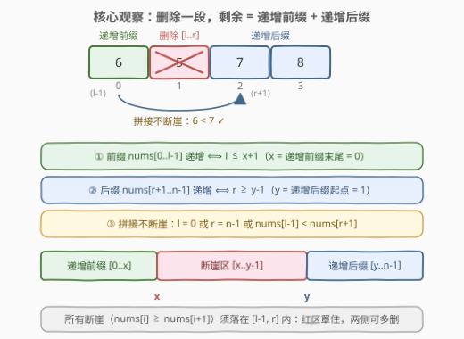
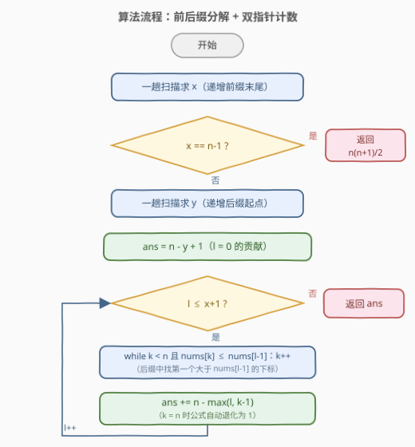
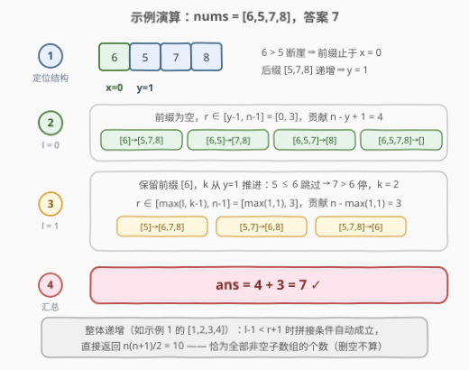

# LeetCode 统计移除递增子数组的数目 II 题解

## 1. 题目概述

- **标题 / 题号**：统计移除递增子数组的数目 II（#2972，hard）
- **链接**：https://leetcode.cn/problems/count-the-number-of-incremovable-subarrays-ii/
- **难度**：困难
- **标签**：数组、双指针、二分查找

**题意**：给你一个下标从 **0** 开始的 **正** 整数数组 `nums`。

如果 `nums` 的一个子数组满足：移除这个子数组后剩余元素 **严格递增**，那么我们称这个子数组为 **移除递增** 子数组。比方说，`[5, 3, 4, 6, 7]` 中的 `[3, 4]` 是一个移除递增子数组，因为移除该子数组后，`[5, 3, 4, 6, 7]` 变为 `[5, 6, 7]`，是严格递增的。

请你返回 `nums` 中 **移除递增** 子数组的总数目。

**注意**，剩余元素为空的数组也视为是递增的。

**子数组** 指的是一个数组中一段连续的元素序列。

**示例 1**：

```text
输入：nums = [1,2,3,4]
输出：10
解释：10 个移除递增子数组分别为：[1], [2], [3], [4], [1,2], [2,3], [3,4], [1,2,3], [2,3,4] 和 [1,2,3,4]。
移除任意一个子数组后，剩余元素都是递增的。注意，空数组不是移除递增子数组。
```

**示例 2**：

```text
输入：nums = [6,5,7,8]
输出：7
解释：7 个移除递增子数组分别为：[5], [6], [5,7], [6,5], [5,7,8], [6,5,7] 和 [6,5,7,8]。
nums 中只有这 7 个移除递增子数组。
```

**示例 3**：

```text
输入：nums = [8,7,6,6]
输出：3
解释：3 个移除递增子数组分别为：[8,7,6], [7,6,6] 和 [8,7,6,6]。
注意 [8,7] 不是移除递增子数组，因为移除 [8,7] 后 nums 变为 [6,6]，它不是严格递增的。
```

**约束**：

- $1 \le \text{nums.length} \le 10^5$
- $1 \le \text{nums}[i] \le 10^9$

> 💡 本题是 [2970](https://leetcode.cn/problems/count-the-number-of-incremovable-subarrays-i/) 的 $n \le 10^5$ 版本（2970 仅 $n \le 50$，暴力可过）。核心是「**前后缀分解 + 计数**」：删除一段连续子数组后，剩余必然是 **左前缀 + 右后缀** 两段。两趟扫描锁定最长严格递增前缀与最长严格递增后缀后，枚举保留的前缀左端，用双指针在递增后缀上定位「拼接点」——合法性判定全部 $O(1)$，**计数而非逐个枚举**，一趟 $O(n)$ 出解。

## 2. 解题思路

### 2.1 暴力思路：枚举所有子数组

按定义直译：枚举全部 $O(n^2)$ 个子数组 $[l, r]$，删除后检查剩余元素是否严格递增（$O(n)$），总计 $O(n^3)$：

```text
ans = 0
for l in 0..n-1:
    for r in l..n-1:
        rest = nums[0..l-1] + nums[r+1..n-1]
        if rest 严格递增: ans += 1
return ans
```

$n \le 50$ 的 2970 可以这样过，但本题 $n \le 10^5$，$O(n^3)$ 与 $O(n^2)$ 都毫无生机。瓶颈在于：**逐个枚举删除区间并整体重建检查**，完全没有利用「合法区间在结构上高度受限」这一性质。

> ⚠️ 暴力法的浪费点：删除 $[l, r]$ 后剩余的形态永远是「前缀 + 后缀」，与中间被删的内容无关。合法性只取决于 $l$、$r$ 两个**端点**，而不是区间里装了什么——这正是计数型双指针的入口。

### 2.2 核心观察：前后缀分解 + 双指针计数

**第一刀转化**：设删除的子数组为 $\text{nums}[l..r]$（非空），剩余元素为前缀 $\text{nums}[0..l-1]$ 与后缀 $\text{nums}[r+1..n-1]$。删除合法当且仅当三个条件同时成立：

1. **前缀严格递增**（或为空）；
2. **后缀严格递增**（或为空）；
3. **拼接处不断崖**：前缀为空、或后缀为空、或 $\text{nums}[l-1] < \text{nums}[r+1]$。

**第二刀结构化**：定义两个关键位置——

- $x$：**最长严格递增前缀**的末尾下标（$\text{nums}[0..x]$ 严格递增，且 $x = n-1$ 或 $\text{nums}[x] \ge \text{nums}[x+1]$）；
- $y$：**最长严格递增后缀**的起始下标（$\text{nums}[y..n-1]$ 严格递增）。

于是前两个条件被 $x, y$ 一网打尽：

$$\text{条件 1} \iff l \le x+1, \qquad \text{条件 2} \iff r \ge y-1 \ (\text{含 } r = n-1 \text{ 空后缀})$$

直觉上：所有「断崖」（$\text{nums}[i] \ge \text{nums}[i+1]$ 的位置 $i$）必须被删除区间**连锅端走**——断崖在 $l$ 之前会砸掉前缀，在 $r$ 之后会砸掉后缀，只有夹在删除区间内部才无害。$[x+1,\, y-1]$ 正是断崖聚集的「坏区」。



**特判：整个数组严格递增**（$x = n-1$）。此时对任意删除区间都有 $l - 1 < r + 1$，由整体严格递增直接得 $\text{nums}[l-1] < \text{nums}[r+1]$，拼接条件自动成立——**所有** $\dfrac{n(n+1)}{2}$ 个子数组都合法。

**一般情形的计数**（此时可证 $y \ge x+1$，即递增前缀与递增后缀不重叠：若 $y \le x$，则 $x, x+1$ 同落后缀内，后缀递增给 $\text{nums}[x] < \text{nums}[x+1]$，与 $x$ 的最大化定义矛盾）。固定 $l$，统计合法的 $r$：

- **$l = 0$（前缀为空）**：拼接条件自动成立，$r \in [y-1,\, n-1]$，共 $n - y + 1$ 个；
- **$l \in [1,\, x+1]$**：合法的 $r$ 需满足 $r \ge l$、$r \ge y-1$，且（$r = n-1$ 或 $\text{nums}[r+1] > \text{nums}[l-1]$）。由于后缀 $\text{nums}[y..n-1]$ **严格递增**，「值 $> \text{nums}[l-1]$」的下标构成后缀的一段连续区间——设 $k$ 为其中**第一个**满足 $\text{nums}[k] > \text{nums}[l-1]$ 的下标（不存在则 $k = n$），则

$$\text{合法 } r \in [\max(l,\, k-1),\ n-1], \qquad \text{个数} = n - \max(l,\, k-1)$$

  $k = n$ 时公式自动退化为 $n - \max(l, n-1) = 1$，恰好只剩「删掉从 $l$ 到末尾」这一种——**无需单独分支**。

**单调性（双指针的根基）**：$l$ 从 $1$ 递增到 $x+1$ 时，$\text{nums}[l-1]$ 沿递增前缀严格递增，于是 $k(l)$ **单调不减**——$k$ 指针只前进、永不后退，全局移动至多 $n$ 次。

> 💡 换个角度理解：这就是在「递增序列上找第一个大于目标值的位置」，即 `upper_bound`。既然目标值（前缀末尾）随 $l$ 单调递增，二分就能做的双指针一定能做，还省掉 $\log$ 因子。

### 2.3 算法流程图



**完整步骤**：

1. **求 $x$**：从左向右扫描，$x$ 停在最后一个满足 $\text{nums}[x] < \text{nums}[x+1]$ 的位置；若 $x = n-1$，直接返回 $\dfrac{n(n+1)}{2}$。
2. **求 $y$**：从右向左扫描，$y$ 停在第一个满足 $\text{nums}[y-1] < \text{nums}[y]$ 的位置。
3. **前缀为空的贡献**：$\text{ans} \mathrel{+}= n - y + 1$（删除区间 $[0, r]$，$r \in [y-1, n-1]$）。
4. **双指针主循环**：$k \leftarrow y$；$l$ 从 $1$ 到 $x+1$：内层 `while` 将 $k$ 推进到后缀中第一个 $> \text{nums}[l-1]$ 的下标（推到 $n$ 为止），然后 $\text{ans} \mathrel{+}= n - \max(l, k-1)$。
5. 返回 $\text{ans}$。

> ⚠️ 两个易错边界：① **空数组不算删除**——删除区间必须非空，这正是 $r \ge l$ 参与 $\max$ 的原因，也是整个数组递增时答案为 $\frac{n(n+1)}{2}$ 而非再多 $1$（删空）的原因；② **可以删掉整个数组**——$l=0, r=n-1$ 前后缀皆空，天然合法，已被公式覆盖。

### 2.4 示例演算

以 `nums = [6,5,7,8]`（示例 2）为例，$n = 4$：

- **求结构**：$\text{nums}[0]=6 > \text{nums}[1]=5$，前缀在 $0$ 处到头，$x = 0$；后缀 $[5,7,8]$ 递增，$y = 1$。数组不是整体递增，走一般流程。
- **$l = 0$**：$r \in [y-1, n-1] = [0, 3]$，贡献 $n - y + 1 = 4$：删 $[6]$、$[6,5]$、$[6,5,7]$、$[6,5,7,8]$。
- **$l = 1$**：保留前缀 $[6]$。$k$ 从 $y=1$ 出发：$\text{nums}[1]=5 \le 6$，$k \to 2$；$\text{nums}[2]=7 > 6$，停。贡献 $n - \max(1, 1) = 3$：$r \in [1,3]$，删 $[5]$、$[5,7]$、$[5,7,8]$。
- **汇总**：$4 + 3 = 7$，与示例输出一致。



再用示例 3 `nums = [8,7,6,6]` 验证极端情形：$x = 0$，后缀 $[6]$ 不向左扩（$6 \ge 6$ 是断崖），$y = 3$。$l = 0$ 贡献 $n - y + 1 = 2$（删 $[8,7,6]$、$[8,7,6,6]$）；$l = 1$ 时保留前缀 $[8]$，后缀中找不到 $> 8$ 的值，$k$ 推到 $n = 4$，贡献 $n - \max(1, 3) = 1$（删 $[7,6,6]$）。总计 $2 + 1 = 3$ ✓——公式在「拼接无解」时优雅退化。

## 3. 参考代码

### C++

```cpp
class Solution {
public:
    long long incremovableSubarrayCount(vector<int>& nums) {
        int n = nums.size();
        int x = 0;                                          // 最长严格递增前缀的末尾下标
        while (x + 1 < n && nums[x] < nums[x + 1]) x++;
        if (x == n - 1) return (long long)n * (n + 1) / 2;  // 整个数组严格递增

        int y = n - 1;                                      // 最长严格递增后缀的起始下标
        while (y - 1 >= 0 && nums[y - 1] < nums[y]) y--;

        long long ans = n - y + 1;                          // l = 0：删 [0..r]，r ∈ [y-1, n-1]
        int k = y;                                          // 后缀中第一个 > nums[l-1] 的下标
        for (int l = 1; l <= x + 1; l++) {                  // 枚举保留的前缀 nums[0..l-1]
            while (k < n && nums[k] <= nums[l - 1]) k++;
            ans += n - max(l, k - 1);                       // r ∈ [max(l, k-1), n-1]；k = n 时自动为 1
        }
        return ans;
    }
};
```

### Python

```python
class Solution:
    def incremovableSubarrayCount(self, nums: List[int]) -> int:
        n = len(nums)
        x = 0                                        # 最长严格递增前缀的末尾下标
        while x + 1 < n and nums[x] < nums[x + 1]:
            x += 1
        if x == n - 1:                               # 整个数组严格递增
            return n * (n + 1) // 2

        y = n - 1                                    # 最长严格递增后缀的起始下标
        while y - 1 >= 0 and nums[y - 1] < nums[y]:
            y -= 1

        ans = n - y + 1                              # l = 0：删 [0..r]，r ∈ [y-1, n-1]
        k = y                                        # 后缀中第一个 > nums[l-1] 的下标
        for l in range(1, x + 2):                    # 枚举保留的前缀 nums[0..l-1]
            while k < n and nums[k] <= nums[l - 1]:
                k += 1
            ans += n - max(l, k - 1)                 # r ∈ [max(l, k-1), n-1]；k = n 时自动为 1
        return ans
```

> 💡 两版逻辑完全一致：**求 $x$ → 特判整体递增 → 求 $y$ → $l=0$ 记账 → 双指针主循环**。C++ 中返回值必须 `long long`：$n = 10^5$ 时 $\frac{n(n+1)}{2} \approx 5 \times 10^9$，超出 32 位 `int` 上限（约 $2.1 \times 10^9$）。

## 4. 复杂度分析

| 维度 | 复杂度 | 说明 |
|------|--------|------|
| **时间复杂度** | $O(n)$ | 求 $x$、求 $y$ 各一趟线性扫描；主循环 $l$ 至多 $x+1$ 次，内层 $k$ 指针全局只前进不后退，总移动 $\le n$ |
| **空间复杂度** | $O(1)$ | 仅若干整型变量，原地完成 |

> ⚠️ 对比暴力 $O(n^3)$：合法性的全部信息都被压缩进 $x, y, k$ 三个游标。计数型题目遇到「枚举对象 $O(n^2)$、判定 $O(n)$」时，先找判定条件的**单调结构**——往往能把两层枚举压成一条双指针。

## 5. 扩展：二分解法与「至多」视角

**一、二分查找版（$O(n \log n)$）**

后缀 $\text{nums}[y..n-1]$ 严格递增，「找第一个 $> \text{nums}[l-1]$ 的下标」天然是 `upper_bound`。不利用单调性时，对每个 $l$ 直接二分即可：

```python
from bisect import bisect_right

class Solution:
    def incremovableSubarrayCount(self, nums: List[int]) -> int:
        n = len(nums)
        x = 0
        while x + 1 < n and nums[x] < nums[x + 1]:
            x += 1
        if x == n - 1:
            return n * (n + 1) // 2
        y = n - 1
        while y - 1 >= 0 and nums[y - 1] < nums[y]:
            y -= 1
        ans = n - y + 1
        for l in range(1, x + 2):
            k = bisect_right(nums, nums[l - 1], y, n)   # 后缀中第一个 > nums[l-1] 的下标
            ans += n - max(l, k - 1)
        return ans
```

正确性与双指针版完全等价（$k$ 若为 $n$，公式同样退化为 $1$）。由于目标值随 $l$ 单调递增，二分里重复比较的 $\log n$ 因子是纯浪费——**单调性是双指针对二分的降维打击**，面试中先写二分再优化成双指针是标准的加分路径。

**二、与 2970 的关系**

[2970. 统计移除递增子数组的数目 I](https://leetcode.cn/problems/count-the-number-of-incremovable-subarrays-i/) 与本题题意逐字相同，仅 $n \le 50$。这一对是「同一思路、数据范围定解法」的典型样本：$n \le 50$ 时 $O(n^3)$ 暴力（约 $10^5$ 次基本操作）最稳；$n \le 10^5$ 时必须 $O(n)$ / $O(n \log n)$。做题时先看数据范围反推目标复杂度，是竞赛与面试通用的第一反应。

## 6. 面试要点

1. **删除一段后剩余元素的形态是什么？为什么这是突破口？**

   - 剩余永远是「左前缀 $\text{nums}[0..l-1]$ + 右后缀 $\text{nums}[r+1..n-1]$」，与被删内容无关。合法性只由两个端点 $l, r$ 决定，于是 $O(n^2)$ 个删除区间可按端点**分桶计数**，而不是逐个检查。

2. **三个合法性条件分别如何 $O(1)$ 判定？**

   - 前缀递增 $\iff l \le x+1$（$x$ 为最长递增前缀末尾）；后缀递增 $\iff r \ge y-1$（$y$ 为最长递增后缀起点，$r = n-1$ 空后缀天然合法）；拼接 $\iff l = 0$ 或 $r = n-1$ 或 $\text{nums}[l-1] < \text{nums}[r+1]$。直觉：所有断崖必须被删除区间连锅端走。

3. **双指针的单调性来自哪里？为什么 $k$ 不会回退？**

   - $l$ 递增时 $\text{nums}[l-1]$ 沿递增前缀严格递增，而 $k$ 是递增后缀中「第一个更大值」的位置——目标值单调增，命中位置必然单调不减。这正是把 `upper_bound` 的重复二分摊还成一次线性扫描。

4. **$k$ 推到 $n$（后缀中找不到更大值）时为什么不用特判？**

   - 贡献公式 $n - \max(l, k-1)$ 在 $k = n$ 时给出 $n - \max(l, n-1) = 1$，恰好对应「删掉 $[l, n-1]$、只留前缀」这唯一解。公式自带边界，是本题代码简洁的关键。

5. **哪些边界容易翻车？**

   - ① 整个数组严格递增要特判 $\frac{n(n+1)}{2}$（一般公式在此情形会把「删空」也计进去）；② **空数组不算合法删除**，$r \ge l$ 必须参与 $\max$；③ **删整个数组合法**（前后缀皆空）；④ 答案需 64 位整数；⑤ 递增是**严格**的——`while` 条件用 `<` 而非 `<=`，示例 3 的 $[8,7,6,6]$ 正是踩在相等断崖上。

> 💡 **一句话总结**：2972 是「前后缀分解 + 计数型双指针」的招牌题——删除的合法性只挂在两个端点上，最长递增前缀 $x$ 与最长递增后缀 $y$ 把条件结构化，枚举保留前缀、后缀上双指针找拼接点，$O(n)$ 一趟数完全部合法删除。

## 同类练习题

| # | 题目 | 与本题的关联 |
|---|------|-------------|
| 2970 | [统计移除递增子数组的数目 I](https://leetcode.cn/problems/count-the-number-of-incremovable-subarrays-i/) | 本题 $n \le 50$ 的孪生版，暴力 $O(n^3)$ 与正解 $O(n)$ 都可写，用来体会数据范围如何决定解法档位 |
| 795 | [区间子数组个数](https://leetcode.cn/problems/number-of-subarrays-with-bounded-maximum/) | 同款「枚举右端点、左端点单调、计数不枚举」的双指针计数骨架 |
| 2444 | [统计定界子数组的数目](https://leetcode.cn/problems/count-subarrays-with-fixed-bounds/) | 计数型子数组问题的进阶练习，维护「最近违规位置」的思想与本题断崖必须被覆盖一脉相承 |
| 238 | [除自身以外数组的乘积](https://leetcode.cn/problems/product-of-array-except-self/) | 前后缀分解思想的入门必修，感受「左半 + 右半」视角的普适性 |
| 42 | [接雨水](https://leetcode.cn/problems/trapping-rain-water/) | 前后缀最值 + 双指针的经典天花板，与本题共享「两侧结构夹逼中间」的几何直觉 |
