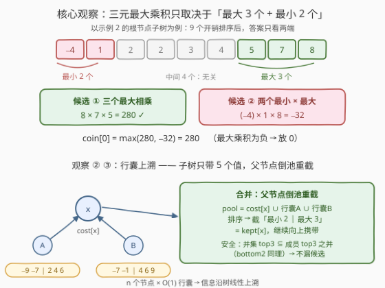
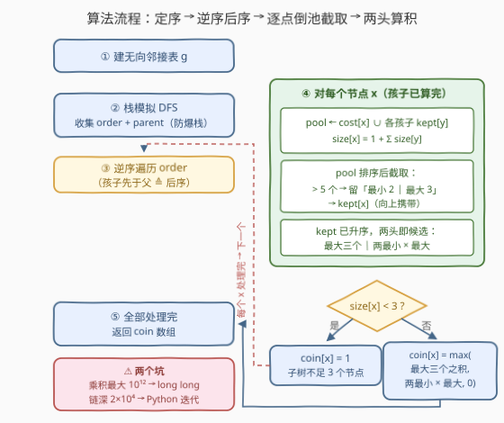
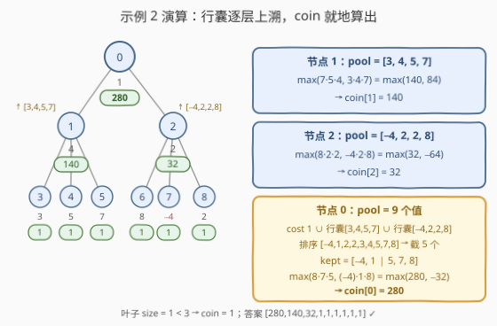

# LeetCode 树中每个节点放置的金币数目 题解

## 1. 题目概述

- **标题 / 题号**：树中每个节点放置的金币数目（#2973，hard）
- **链接**：https://leetcode.cn/problems/find-number-of-coins-to-place-in-tree-nodes/
- **难度**：困难
- **标签**：树、深度优先搜索、树形 DP、排序

**题意**：给你一棵 $n$ 个节点的**无向**树，节点编号 $0$ 到 $n-1$，根节点为 $0$；`edges[i] = [ai, bi]` 表示节点 $a_i$ 与 $b_i$ 之间有一条边。再给长度为 $n$ 的整数数组 `cost`，`cost[i]` 是第 $i$ 个节点的**开销**（可正可负但非零）。

需要在每个节点放置金币，节点 $i$ 处的金币数目 `coin[i]` 计算规则：

1. 若节点 $i$ 对应的子树中节点数目**小于 3**，放 **1** 个金币；
2. 否则计算该子树内 **3 个不同节点**开销乘积的**最大值**，放对应数目的金币；若最大乘积是**负数**，放 **0** 个金币。

返回长度为 $n$ 的数组 `coin`。

**示例 1**：

```text
输入：edges = [[0,1],[0,2],[0,3],[0,4],[0,5]], cost = [1,2,3,4,5,6]
输出：[120,1,1,1,1,1]
解释：节点 0 的子树取 6 * 5 * 4 = 120；其余节点均为叶子（子树只有 1 个节点），各放 1 个金币。
```

**示例 2**：

```text
输入：edges = [[0,1],[0,2],[1,3],[1,4],[1,5],[2,6],[2,7],[2,8]], cost = [1,4,2,3,5,7,8,-4,2]
输出：[280,140,32,1,1,1,1,1,1]
解释：节点 0 取 8 * 7 * 5 = 280；节点 1 取 7 * 5 * 4 = 140；节点 2 取 8 * 2 * 2 = 32；其余为叶子。
```

**示例 3**：

```text
输入：edges = [[0,1],[0,2]], cost = [1,2,-2]
输出：[0,1,1]
解释：节点 0 的子树恰 3 个节点，唯一的三元组合 2 * 1 * (−2) = −4 < 0，放 0 个金币。
```

**约束**：

- $2 \le n \le 2 \times 10^4$
- $1 \le |cost[i]| \le 10^4$（开销非零，可正可负）
- `edges` 一定构成一棵合法的树

> 💡 一句话：每个节点的答案只由其子树开销的**「最大 3 个 + 最小 2 个」**决定——把这 5 个数打包成「行囊」沿树向上合并，就是一道**信息压缩版树形 DP**。

## 2. 解题思路

### 2.1 暴力思路：逐节点全量枚举

对每个节点 $i$：先 DFS 收集子树全部开销（单次 $O(n)$），再枚举 $\binom{\text{size}}{3}$ 个三元组取最大乘积。链形树下 $\sum_i \binom{s_i}{3} = O(n^4)$；即便每个节点改用「排序 + 两端公式」降到 $O(s\log s)$，总量仍是 $O(n^2 \log n)$，在 $n \le 2\times10^4$ 下依然超时。

瓶颈在于：**同一批开销被每层祖先反复扫描**。而最大乘积其实只由子树里极少数「极端值」决定——中间那些不大不小的数，永远进不了最优组合。

### 2.2 核心观察：5 值行囊上溯合并

**观察 ①（三元最大乘积公式）**：把子树全部开销升序排序为 $A[0..m-1]$（$m \ge 3$），三个不同元素乘积的最大值为

$$\max\big(A[m{-}1] \cdot A[m{-}2] \cdot A[m{-}3],\quad A[0] \cdot A[1] \cdot A[m{-}1]\big)$$

分类讨论即可证明：最优组合要么**全取大端**——三个最大值（覆盖全正的情形；全负时任何三元组乘积皆为负，取绝对值最小的三个即三个最大值），要么**两负一正**——两个最小负数乘最大正数（负负得正）。两种候选恰好只用到**最大 3 个**与**最小 2 个**，共 5 个值。

**观察 ②（子树只需携带 5 个值）**：由观察 ①，任何祖先计算答案时，关于这棵子树用到的信息至多是「最大 3 + 最小 2」。于是每棵子树向上只需返回这 $\le 5$ 个值——一个小小「行囊」，中间值全部就地丢弃。

**观察 ③（行囊合并不漏候选）**：若干集合并集的**最大 3 个**元素，必落在其中某个成员的「最大 3 个」里（反证：若并集某前 3 大值 $v$ 在其所属成员中连前 3 都排不进，则该成员另有 3 个不小于 $v$ 的值，它们同样进入并集，与 $v$ 是前 3 大矛盾）；**最小 2 个**同理。于是父节点把 `cost[x]` 与各孩子行囊**倒进同一个池子**（大小 $\le 1 + 5\deg$），排序后重新截取「最小 2 ∣ 最大 3」，就得到自己的行囊——不漏任何候选。

**转移（节点 $x$，孩子 $y_1, \dots, y_k$）**：

$$\text{size}[x] = 1 + \sum_j \text{size}[y_j],\qquad \text{pool} = \operatorname{sort}\Big(\{cost[x]\} \cup \bigcup_j \text{kept}[y_j]\Big)$$

$$\text{kept}[x] = \begin{cases}\text{pool}, & |\text{pool}| \le 5 \\ \text{pool 的最小 2 个} \cup \text{最大 3 个}, & \text{否则}\end{cases}$$

$$\text{coin}[x] = \begin{cases}1, & \text{size}[x] < 3 \\ \max\big(\text{kept 的三元最大乘积},\ 0\big), & \text{否则}\end{cases}$$

> ⚠️ **乘积溢出**：$|cost[i]| \le 10^4$，三元乘积最大 $10^{12}$，远超 32 位 int（约 $2.1\times10^9$），C++ 必须用 `long long`。



> 💡 一句话：**三元乘积只看两端**（top3 ∣ bottom2）；**子树信息压成 5 值行囊**；**父节点倒池重截**继续上溯——每条边只搬 $O(1)$ 个数，整树线性遍历一遍。

### 2.3 算法流程图



**完整步骤**：

1. 由 `edges` 建无向邻接表 `g`；
2. 显式栈先序 DFS，收集 `order` 与 `parent`（父先于子；防链形树爆递归栈）；
3. **逆序遍历** `order`（孩子必先于父处理，天然等价后序）；
4. 对每个节点 $x$：合并 `cost[x]` 与各孩子行囊成 `pool`，排序截取 5 值得 `kept[x]`，同时累加 `size[x]`；
5. `size[x] < 3` → `coin[x] = 1`；否则由 `kept` 两端算三元最大乘积，负则置 0；
6. 遍历结束返回 `coin`。

### 2.4 示例演算

以示例 2 为例（后序处理顺序 3,4,5,6,7,8,1,2,0）：

| 节点 | pool（升序） | kept[x] | size | coin 计算 |
|:--:|:--|:--|:--:|:--|
| 3~8 | 单个叶子开销，如 {3} | 同 pool | 1 | size < 3 → 1 |
| 1 | [3, 4, 5, 7]（≤5 全留） | 同 pool | 4 | max(7·5·4, 3·4·7) = **140** |
| 2 | [−4, 2, 2, 8]（≤5 全留） | 同 pool | 4 | max(2·2·8, −4·2·8) = **32** |
| 0 | [−4, 1, 2, 2, 3, 4, 5, 7, 8] | [−4, 1 ∣ 5, 7, 8] | 9 | max(8·7·5, −4·1·8) = **280** |

注意节点 0：pool 有 9 个值，截成「最小 2 = −4, 1」与「最大 3 = 5, 7, 8」；两个候选积 280 与 −32，取较大者 280。输出 `[280,140,32,1,1,1,1,1,1]` ✓



## 3. 参考代码

### C++（递归版）

```cpp
class Solution {
public:
    vector<long long> placedCoins(vector<vector<int>>& edges, vector<int>& cost) {
        int n = cost.size();
        vector<vector<int>> g(n);
        for (auto& e : edges) {
            g[e[0]].push_back(e[1]);
            g[e[1]].push_back(e[0]);
        }

        vector<long long> coin(n, 1);
        vector<int> sz(n, 1);
        // dfs(x)：返回 x 子树的「行囊」= 最小 2 个 + 最大 3 个（升序）
        function<vector<int>(int, int)> dfs = [&](int x, int fa) -> vector<int> {
            vector<int> pool = {cost[x]};
            for (int y : g[x]) {
                if (y == fa) continue;                 // 无向边：跳过父节点
                auto pack = dfs(y, x);
                sz[x] += sz[y];
                pool.insert(pool.end(), pack.begin(), pack.end());
            }
            sort(pool.begin(), pool.end());
            vector<int> kept;
            if ((int)pool.size() <= 5) {
                kept = pool;
            } else {                                   // >5 个：只留两端
                kept.insert(kept.end(), pool.begin(), pool.begin() + 2);
                kept.insert(kept.end(), pool.end() - 3, pool.end());
            }
            if (sz[x] >= 3) {                          // kept 已升序，两头即候选
                int m = kept.size();
                long long best = max(1LL * kept[m - 1] * kept[m - 2] * kept[m - 3],
                                     1LL * kept[0] * kept[1] * kept[m - 1]);
                coin[x] = max(best, 0LL);              // 最大乘积为负 → 0
            }
            return kept;
        };
        dfs(0, -1);
        return coin;
    }
};
```

### Python（迭代版）

```python
class Solution:
    def placedCoins(self, edges: List[List[int]], cost: List[int]) -> List[int]:
        n = len(cost)
        g = [[] for _ in range(n)]
        for a, b in edges:
            g[a].append(b)
            g[b].append(a)

        # ① 显式栈先序收集 order 与 parent（父先于子，防链形树爆递归栈）
        order, parent = [], [-1] * n
        stack = [0]
        while stack:
            x = stack.pop()
            order.append(x)
            for y in g[x]:
                if y != parent[x]:
                    parent[y] = x
                    stack.append(y)

        # ② 逆序遍历 = 后序（孩子必先于父），逐点合并行囊
        sz = [1] * n
        kept = [[] for _ in range(n)]
        coin = [1] * n
        for x in reversed(order):
            pool = [cost[x]]
            for y in g[x]:
                if y != parent[x]:
                    sz[x] += sz[y]
                    pool += kept[y]
            pool.sort()
            # ≤5 个全留；>5 个只留「最小 2 ∣ 最大 3」
            kept[x] = pool if len(pool) <= 5 else pool[:2] + pool[-3:]
            if sz[x] >= 3:
                a = kept[x]                            # 已升序，两头即候选
                best = max(a[-1] * a[-2] * a[-3], a[0] * a[1] * a[-1])
                coin[x] = max(best, 0)                 # 最大乘积为负 → 0
        return coin
```

> 💡 两版逻辑一致。注意四点：① 三元乘积达 $10^{12}$，C++ 用 `1LL *` 起手 / `long long`；② 判定顺序：**先**判 `size < 3`（放 1），**再**算乘积、负则 0；③ 无向图 DFS 要跳过父节点（递归版用 `fa` 参数，迭代版用 `parent` 数组）；④ 链形树深达 $2\times10^4$，Python 递归必爆栈，用「先序收集 + 逆序处理」的显式栈套路；C++ 递归每帧很小一般可过，介意可套用 Python 的迭代写法。

## 4. 复杂度分析

| 维度 | 复杂度 | 说明 |
|------|--------|------|
| **时间复杂度** | $O(n\log n)$（上界，接近线性） | 所有 pool 总大小 $\sum_x (1 + 5\deg x) = O(n)$，逐 pool 一次小排序；最坏星形树时根的 pool 约 $5n$ 个值，贡献一次 $O(n\log n)$，一般形态接近 $O(n)$ |
| **空间复杂度** | $O(n)$ | 邻接表、`order`/`parent`/`sz`/`coin` 各 $O(n)$；每节点行囊 $\le 5$ 个值合计 $O(n)$；递归版另有 $O(h)$ 调用栈（链形树退化为 $O(n)$） |

## 5. 扩展：k 元最大乘积的一般化与堆视角

- **负数用几个？** 要让乘积尽量大，负因子必须**成对出现**（负负得正）。一般地，有序数组取 $k$ 个数的最大乘积 = 枚举从**最小端取偶数个** $j$ 个、其余 $k-j$ 个从**最大端**取：

$$\max_{\substack{j \text{ 为偶数} \\ 0 \le j \le k}} \Big(\prod_{i=0}^{j-1} A[i] \times \prod_{i=m-(k-j)}^{m-1} A[i]\Big)$$

  $k=3$ 时 $j \in \{0, 2\}$，正是「前三 ∣ 两小 × 最大」；相应地子树行囊需扩成「最大 $k$ 个 + 最小 $k$ 个」量级（$k=3$ 时奇数个负因子乘积必为负、不可能是最优正解，最小端可省到 2 个；全负情形由最大端覆盖）。

- **与堆的关系**：官方 hint 用两个大小为 3 的堆（最大 3 个正数 / 最小 3 个非正数）在线维护候选——与「行囊」是同一套信息压缩，只是组织方式不同。竞赛中直接对小数组排序往往更好写、常数也更小。

- **退化版**：若树退化成一条链且只问整棵树，就是 [628. 三个数的最大乘积](https://leetcode.cn/problems/maximum-product-of-three-numbers/) 的数组题——本题即「628 公式 + 树形合并」的叠加。

## 6. 面试要点

1. **为什么「最大 3 个 + 最小 2 个」就够？**

   - 分类讨论：全正 → 三个最大；有负有正且最优为正 → 要么三个最大正数，要么两个最负 × 最大正数；全负 → 任何三元组乘积皆负，取绝对值最小（即三个最大）。三种情形都被 $\max(A[m{-}1]A[m{-}2]A[m{-}3],\ A[0]A[1]A[m{-}1])$ 覆盖，只涉及两端共 5 个值。

2. **合并行囊为什么不会丢信息？**

   - 并集的最大 3 个必落在某成员的最大 3 个中（否则该成员已有 3 个不小于它的值同在并集，矛盾）；最小 2 个同理。归纳可知每个节点的行囊总包含其子树的全局 top3 与 bottom2，祖先据此算出的两个候选积与全量排序完全一致。

3. **实现上有哪些坑？**

   - ① 乘积最大 $10^{12}$，C++ 必须 `long long`（`1LL *` 起手）；② 判定顺序：`size < 3` → 1 优先于负乘积 → 0；③ 无向边遍历要跳过父节点；④ 链深 $2\times10^4$，Python 递归爆栈，改显式栈「先序收集 + 逆序处理」。

4. **为什么不直接保留子树全量开销，每个节点现算？**

   - 那是 2.1 的 $O(n^2)$ 做法。行囊把「向上传递的信息」压到常数个，每条边只搬 $O(1)$ 个值，所有 pool 总大小 $O(n)$——这是树形 DP「信息熵」思维：子树信息若可被常数个统计量概括，就能线性合并。

5. **与 2246、1519 这类题的共性？**

   - 都是「子树信息压缩上溯」：2246 每棵子树只带 top2 最长子链向上拼路径；1519 逐层上溯合并计数数组；本题带 top3 + bottom2 极值。后序自底向上、按孩子聚合的骨架完全一致，差别只在「带什么统计量上去」。

> 💡 **一句话总结**：三元最大乘积只看最大 3 与最小 2；把这两个 top-k 打包成行囊沿树后序上溯、父节点倒池重截，$O(n\log n)$ 收工。工程坑：`long long`、判定顺序、Python 爆栈。

## 同类练习题

| # | 题目 | 与本题的关联 |
|---|------|-------------|
| 628 | [三个数的最大乘积](https://leetcode.cn/problems/maximum-product-of-three-numbers/)（[题解](../0601-0700/628_三个数的最大乘积.md)） | 数组版三元最大乘积公式——本题每个节点做的「原子运算」就是它 |
| 2246 | [相邻字符不同的最长路径](https://leetcode.cn/problems/longest-path-with-different-adjacent-characters/)（[题解](../2201-2300/2246_相邻字符不同的最长路径.md)） | 同款「子树信息压缩上溯」，每棵子树只带 top2 最长子链向上拼路径 |
| 1519 | [子树中标签相同的节点数](https://leetcode.cn/problems/number-of-nodes-in-the-sub-tree-with-the-same-label/)（[题解](../1501-1600/1519_带给定标签的二叉树中的节点数.md)） | 子树计数逐层上溯合并的入门版 |
| 834 | [树中距离之和](https://leetcode.cn/problems/sum-of-distances-in-tree/)（[题解](../0801-0900/834_树中距离之和.md)） | 先序 + 后序两遍 DFS 的换根 DP，树形 DP 进阶 |
| 337 | [打家劫舍 III](https://leetcode.cn/problems/house-robber-iii/)（[题解](../0301-0400/337_打家劫舍III.md)） | 「选 / 不选」两状态后序转移模板，树形 DP 热身 |
