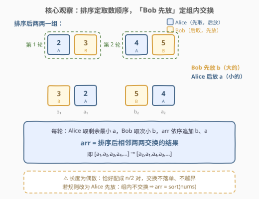
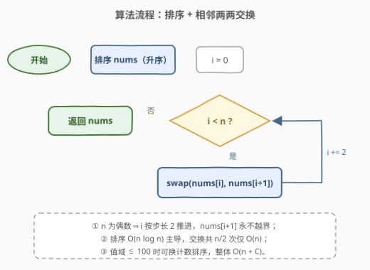
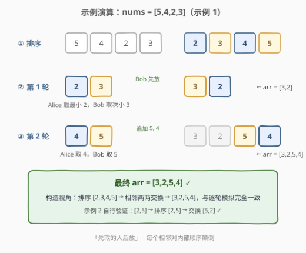

# 最小数字游戏

- **题目名称**：最小数字游戏
- **链接**：[2974. 最小数字游戏](https://leetcode.cn/problems/minimum-number-game/)
- **难度**：简单
- **标签**：数组、排序、模拟、堆（优先队列）

## 1. 题目概述

你有一个下标从 **0** 开始、长度为**偶数**的整数数组 `nums`，同时还有一个空数组 `arr`。Alice 和 Bob 决定玩一个游戏，游戏中每一轮两人各自执行一次操作。规则如下：

- 每一轮，Alice 先从 `nums` 中移除一个**最小**元素，然后 Bob 执行同样的操作；
- 接着，Bob 会将移除的元素添加到数组 `arr` 中，然后 Alice 也执行同样的操作；
- 游戏持续进行，直到 `nums` 变为空。

返回结果数组 `arr`。

**示例 1**：

```text
输入：nums = [5,4,2,3]
输出：[3,2,5,4]
解释：第一轮，Alice 先移除 2，然后 Bob 移除 3。然后 Bob 先将 3 添加到 arr 中，
接着 Alice 再将 2 添加到 arr 中。于是 arr = [3,2]。
第二轮开始时，nums = [5,4]。Alice 先移除 4，然后 Bob 移除 5。接着他们都
将元素添加到 arr 中，arr 变为 [3,2,5,4]。
```

**示例 2**：

```text
输入：nums = [2,5]
输出：[5,2]
解释：第一轮，Alice 先移除 2，然后 Bob 移除 5。然后 Bob 先将 5 添加到 arr 中，
接着 Alice 再将 2 添加到 arr 中。于是 arr = [5,2]。
```

**约束条件**：

- $1 \le nums.length \le 100$
- $1 \le nums[i] \le 100$
- $nums.length \% 2 == 0$

> 💡 读题先定性：双方的操作**完全确定**——每轮都取「当前最小」，没有任何决策空间，所以这不是博弈论，而是披着游戏外衣的**排序模拟题**。真正要看的只有一件事：「取数顺序」与「放置顺序」合起来对结果做了什么变换。

---

## 2. 解题思路

### 2.1 暴力思路：照题面逐轮模拟

最直接的做法：每一轮线性扫描两次找当前最小（Alice 一次、Bob 一次），从 `nums` 移除，再按 Bob → Alice 的顺序追加到 `arr`。共 $n/2$ 轮，时间 $O(n^2)$，$n \le 100$ 时毫无压力。

```cpp
// O(n^2)：照题面逐字模拟，n ≤ 100 稳过
vector<int> numberGame(vector<int>& nums) {
    vector<int> arr;
    while (!nums.empty()) {
        int a = *min_element(nums.begin(), nums.end());   // Alice 取最小
        nums.erase(find(nums.begin(), nums.end(), a));
        int b = *min_element(nums.begin(), nums.end());   // Bob 取次小
        nums.erase(find(nums.begin(), nums.end(), b));
        arr.push_back(b);   // Bob 先放
        arr.push_back(a);   // Alice 后放
    }
    return arr;
}
```

注意到本题标签里有**堆（优先队列）**——周赛时的常见写法是把 `nums` 建成小根堆，每轮 `pop` 两次、逆序追加，时间优化到 $O(n \log n)$：

```python
import heapq

def numberGame(nums):
    heapq.heapify(nums)
    arr = []
    while nums:
        a = heapq.heappop(nums)   # Alice：当前最小
        b = heapq.heappop(nums)   # Bob：次小
        arr += [b, a]             # Bob 先放，Alice 后放
    return arr
```

但无论怎么模拟，都绕不开一个结构性事实：**取数顺序是确定的**——排序后依次就是 Alice、Bob、Alice、Bob……这个确定性值得单独拎出来推一步。

### 2.2 核心观察：排序定取数，先放定交换



两层观察把「游戏」压缩成「一次排序 + 一遍交换」：

1. **「每轮移除最小」是确定性的**：玩家没有任何选择。将 `nums` 升序排序得 $a_1 \le a_2 \le a_3 \le a_4 \le \cdots$，则第 $k$ 轮 Alice 必然拿走 $a_{2k-1}$（剩余最小），Bob 必然拿走 $a_{2k}$（次小）。「谁拿什么」在排序完成的瞬间就已完全确定。
2. **「Bob 先放」决定组内顺序**：每轮 `arr` 依序追加的是 $[\,b,\ a\,] = [\,a_{2k},\ a_{2k-1}\,]$——大在前、小在后。

两者合并：

$$\boxed{\ arr = [\,a_2,\ a_1,\ a_4,\ a_3,\ \dots\,]\ \Longleftrightarrow\ \text{sort}(nums)\ \text{后相邻两两交换}\ }$$

「先取的人后放」恰好等于**每个相邻对内部顺序颠倒**。而 `nums` 长度为偶数，保证恰好配成 $n/2$ 对、不会落单。

> 💡 一句话：别去模拟「谁拿谁放」，直接对排序结果做一遍相邻交换——把 $n/2$ 轮游戏折叠成一次确定性的重排。

### 2.3 算法流程图



**完整步骤**：

1. **排序**：将 `nums` 升序排序；
2. **初始化**：`i = 0`；
3. **交换**：交换 `nums[i]` 与 `nums[i+1]`，然后 `i += 2`；
4. **循环**：只要 `i < n` 就回到第 3 步；
5. **收尾**：返回 `nums`。

> ⚠️ 交换循环的步长是 **2** 而不是 1——逐对处理，每对换一次；写成步长 1 会把数组转一圈等于没换（偶数次相邻交换抵消）。偶数长度保证 `i+1` 永不越界。

### 2.4 示例演算



以示例 1（`nums = [5,4,2,3]`）为例，排序得 $[2,3,4,5]$：

| 轮次 | Alice 取（剩余最小） | Bob 取（次小） | arr 追加 | arr 状态 |
|------|---------------------|----------------|----------|----------|
| 1 | 2 | 3 | 3, 2 | `[3,2]` |
| 2 | 4 | 5 | 5, 4 | `[3,2,5,4]` |

返回 `[3,2,5,4]` ✓。构造视角交叉验证：排序结果 `[2,3,4,5]` 相邻两两交换 → `[3,2,5,4]`，与逐轮模拟完全一致。示例 2 同理：`[2,5]` 排序后交换 → `[5,2]` ✓。

---

## 3. 参考代码

### C++

```cpp
class Solution {
  public:
    vector<int> numberGame(vector<int>& nums) {
        sort(nums.begin(), nums.end());
        for (int i = 0; i + 1 < (int)nums.size(); i += 2) {
            swap(nums[i], nums[i + 1]);
        }
        return nums;
    }
};
```

### Python

```python
class Solution:
    def numberGame(self, nums: List[int]) -> List[int]:
        nums.sort()
        for i in range(0, len(nums), 2):
            nums[i], nums[i + 1] = nums[i + 1], nums[i]
        return nums
```

> 💡 语言细节：两版都是**原地**排序 + 原地交换，最后原数组即答案。C++ 循环条件写 `i + 1 < n` 是防御式写法（偶数长度下其实恒真）；若不想修改入参，Python 可用切片一行构造：`s = sorted(nums); return [x for k in range(0, len(s), 2) for x in (s[k+1], s[k])]`。

---

## 4. 复杂度分析

| 维度 | 复杂度 | 说明 |
|------|--------|------|
| 时间复杂度 | $O(n \log n)$ | 排序主导；相邻交换共 $n/2$ 次，仅贡献 $O(n)$ |
| 空间复杂度 | $O(1)$ | 原地排序 + 原地交换（不计语言排序的栈开销，C++ introsort 为 $O(\log n)$） |

对照：线性扫最小的暴力模拟 $O(n^2)$；小根堆模拟 $O(n \log n)$ 但常数与代码量都更大。利用 $1 \le nums[i] \le 100$ 的值域，把比较排序换成**计数排序**可进一步做到 $O(n + C)$（$C = 100$），构造思路不变——数据规模下属于锦上添花。

---

## 5. 扩展：换个规则会怎样

本题的「游戏」外壳可以随便换参数，结论都由同一条推理链给出——**取数规则定排序，放置规则定组内顺序**：

| 规则变体 | 答案 |
|----------|------|
| 原题：取最小，Bob 先放 | $\text{swapPairs}(\text{sort}_{\uparrow}(nums))$ |
| Alice 先放（其余不变） | 组内不颠倒 ⇒ $\text{sort}_{\uparrow}(nums)$ 原样输出 |
| 每轮取**最大** | 降序排序 + 相邻两两交换 |
| 每轮三人 A→B→C 取最小，按 C→B→A 放 | 每 3 个一组组内反转（排序后 $[a,b,c]$ 输出为 $[c,b,a]$） |

再对照一个结构相同的经典题：**561. 数组拆分**——同样排序后「两两一组」，但 561 是配成对后**取每对的 min** 求总和最大化（需要配对方向的最优性论证），本题只是确定性的**重排输出**。一个结构、两种考法：561 考「为什么这样配对最优」，2974 考「为什么模拟可折叠成构造」。

> ⚠️ 若把「取最小」改成「玩家任选元素」，问题性质立刻改变——取数出现决策，`arr` 的内容与顺序都受策略影响，需要另行博弈分析。本题「每轮取最小」的确定性正是可构造的根基。

---

## 6. 面试要点

1. **为什么「排序 + 相邻交换」严格等价于游戏过程？**

   - 两层确定性叠加：① 每轮取剩余最小且玩家无选择 ⇒ 第 $k$ 轮取走排序后的第 $2k-1$、$2k$ 个；② Bob 先放 ⇒ 每组以 $[a_{2k}, a_{2k-1}]$ 顺序进入 `arr`
   - 两个确定性合起来 = 排序后每对内部交换，无任何信息丢失

2. **直接模拟、堆模拟、直接构造三者怎么取舍？**

   - 线性扫最小 $O(n^2)$、小根堆 $O(n \log n)$、构造 $O(n \log n)$（排序主导）
   - $n \le 100$ 三者都能过；构造版代码最短、常数最小，且体现「折叠模拟」的洞察，面试首选

3. **偶数长度约束在哪一步被用到？**

   - 交换以步长 2 成对推进，`i+1` 永不越界、无落单尾元素
   - 若长度为奇数，题目必须额外规定最后一个元素如何处理（谁取、谁放），否则答案不唯一

4. **能否做到 $O(n)$？**

   - 一般不行：输出的每一位都依赖全体元素的大小关系，下界就是排序
   - 但值域 $1 \sim 100$ 时可用计数排序 $O(n + C)$——约束里的小数字往往是提示

5. **什么时候才真需要堆？**

   - 若规则改成「动态插入/删除元素 + 反复取最小」（如数据流），排序不可维护，堆才是正解
   - 本题静态一次性取完，堆只是模拟思维的自然产物，构造解是它的最优折叠

> 💡 **一句话总结**：取数规则（每轮最小）⇒ 排序定序；放置规则（Bob 先放）⇒ 组内颠倒；两式相加 = $\text{sort}$ 后相邻两两交换，$O(n \log n)$ 一趟出答案。

---

## 7. 同类练习题

- [561. 数组拆分](https://leetcode.cn/problems/array-partition/)（[题解](../0501-0600/561_数组拆分.md)）：同款「排序 + 相邻两两配对」结构——配对后取 min 求最大和，配对方向与本题相反
- [1877. 数组中最大数对和的最小值](https://leetcode.cn/problems/minimize-maximum-pair-sum-in-array/)（[题解](../1801-1900/1877_数组中最大数对和的最小值.md)）：排序后首尾配对最小化最大数对和——配对策略的另一种经典方向
- [2164. 对奇偶下标分别排序](https://leetcode.cn/problems/sort-even-and-odd-indices-independently/)（[题解](../2101-2200/2164_对奇偶下标分别排序.md)）：排序后按下标奇偶回填目标位置，同属「先排序再重排位置」
- [2144. 购买糖果的最低成本](https://leetcode.cn/problems/minimum-cost-of-buying-candies-with-discount/)（[题解](../2101-2200/2144_购买糖果的最低成本.md)）：排序后从大到小每买二送一——排序 + 相邻分组贪心
- [1051. 高度检查器](https://leetcode.cn/problems/height-checker/)（[题解](../1001-1100/1051_高度检查器.md)）：排序结果与原数组逐位对比计数，排序简单应用的对照练习
