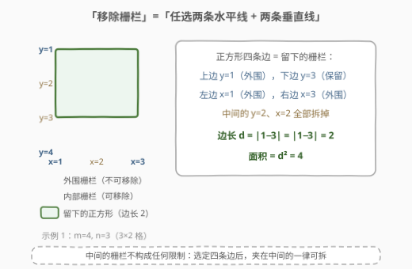
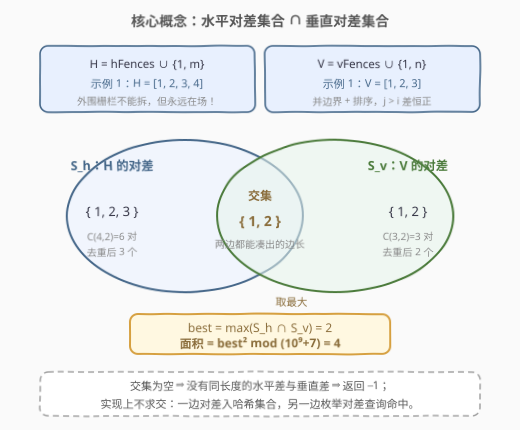
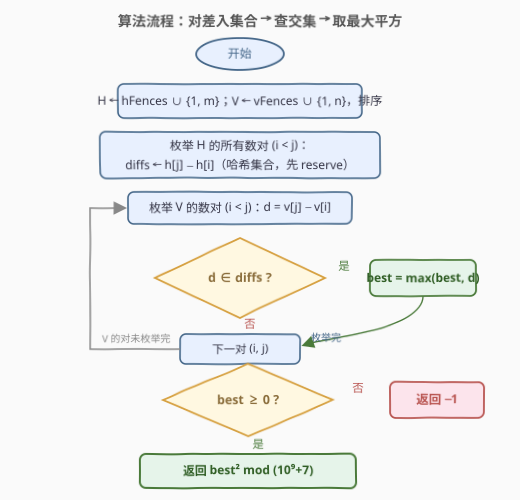
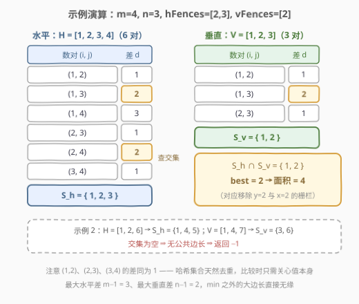

# 移除栅栏得到的正方形田地的最大面积

- **题目名称**：移除栅栏得到的正方形田地的最大面积
- **链接**：[2975. 移除栅栏得到的正方形田地的最大面积](https://leetcode.cn/problems/maximum-square-area-by-removing-fences-from-a-field/)
- **难度**：中等
- **标签**：数组、哈希表、枚举

## 1. 题目概述

有一个大型的 $(m-1) \times (n-1)$ 矩形田地，两个对角分别为 $(1, 1)$ 和 $(m, n)$，田地内部有一些水平栅栏和垂直栅栏，分别由数组 `hFences` 和 `vFences` 给出：

- 水平栅栏 $i$ 从坐标 $(\text{hFences}[i], 1)$ 到 $(\text{hFences}[i], n)$；
- 垂直栅栏 $i$ 从坐标 $(1, \text{vFences}[i])$ 到 $(m, \text{vFences}[i])$。

外围的四条栅栏（两条水平：$y=1$ 与 $y=m$；两条垂直：$x=1$ 与 $x=n$）**不能移除**。返回通过移除**一些**内部栅栏（可能不移除）所能形成的最大面积的**正方形**田地的面积；无法形成正方形则返回 $-1$。由于答案可能很大，返回结果对 $10^9 + 7$ **取余**后的值。

**示例 1**：

```text
输入：m = 4, n = 3, hFences = [2,3], vFences = [2]
输出：4
解释：移除位于 2 的水平栅栏和位于 2 的垂直栅栏，得到边长为 2 的正方形，面积为 4。
```

**示例 2**：

```text
输入：m = 6, n = 7, hFences = [2], vFences = [4]
输出：-1
解释：无法通过移除栅栏形成正方形田地。
```

**约束条件**：

- $3 \le m, n \le 10^9$
- $1 \le \text{hFences.length}, \text{vFences.length} \le 600$
- $1 < \text{hFences}[i] < m$，$1 < \text{vFences}[i] < n$
- `hFences` 和 `vFences` 中的元素互不相同

> 💡 读题先抓两个反差：**值域巨大**（$m, n$ 高达 $10^9$，田地画不出来）但**栅栏极少**（每个数组 $\le 600$ 条）。正方形的四条边必须落在**留下的栅栏**上——于是「移除哪些栅栏」是幌子，真正的问题是「**选哪两条水平线 + 哪两条垂直线**围正方形」。规模上 $600^2 \approx 3.6 \times 10^5$ 的对数枚举才是本题甜区。

---

## 2. 解题思路

### 2.1 暴力思路：正向枚举边长为何不可行

正方形边长 $d$ 的合法条件：

1. 水平方向：存在两条水平栅栏 $y = a, b$（含外围）使得 $|a - b| = d$；
2. 垂直方向：存在两条垂直栅栏 $x = c, e$（含外围）使得 $|c - e| = d$。

最朴素的想法是**正向枚举答案**：$d$ 从 $\min(m, n) - 1$ 往下扫，对每个 $d$ 判定两个方向能否凑出这个差。但 $d$ 的值域高达 $10^9$，即使单次判定只用排序 + 双指针 $O(k)$（$k \le 602$），总量也是 $10^9 \times 1200 \approx 10^{12}$ 级别，直接爆炸。

> ⚠️ 死结在于**方向反了**：答案值域 $\sim 10^9$，但真正能被栅栏差凑出的边长**至多** $\binom{602}{2} = 180901$ 个。**枚举对象应该是「栅栏对」而不是「边长值」**——把 $O(\text{值域})$ 的搜索空间压缩成 $O(k^2)$ 的生成空间。

### 2.2 核心观察：对差入集合，交集取最大



三步拆解：

1. **「移除」等价于「任选」**：只要选定上边 $y=a$、下边 $y=b$、左边 $x=c$、右边 $x=e$ 四条栅栏，中间所有栅栏一律拆掉即可。所以候选正方形 $\Leftrightarrow$ （一条水平栅栏对，一条垂直栅栏对），边长为 $d = |a-b| = |c-e|$。**外围栅栏不能拆但永远在场，必须参与配对**——把 $1, m$ 并入水平集合、$1, n$ 并入垂直集合：

$$H = \{1, m\} \cup \text{hFences},\qquad V = \{1, n\} \cup \text{vFences}$$

2. **边长候选 = 对差集合**：$H$ 中任意两数之差构成水平方向可达边长集合 $S_h = \{h_j - h_i \mid h_i < h_j\}$；同理垂直方向 $S_v$。两者大小均 $\le \binom{602}{2} \approx 1.8 \times 10^5$。

3. **正方形边长 = 两个集合的公共元素**：$d \in S_h \cap S_v$ 时，四条栅栏围出边长 $d$ 的正方形。答案即：

$$\boxed{\ \max(S_h \cap S_v)^2 \bmod (10^9+7)\quad\text{（交集为空则返回 } -1\text{）}\ }$$



实现上不必真求交集：把 $S_h$ 存入哈希集合，再枚举 $V$ 的对差查询命中，顺手维护最大值——**「枚举一边 + 哈希查另一边」**正是 [1. 两数之和](https://leetcode.cn/problems/two-sum/) 的反查套路。

### 2.3 算法流程图



**完整步骤**：

1. **加边界**：`h = hFences + [1, m]`，`v = vFences + [1, n]`，各自**排序**（排序后枚举 $j > i$ 的对，差恒为正，省去取绝对值）；
2. **建集合**：双重循环枚举 $H$ 的所有数对，把 $h_j - h_i$ 插入哈希集合 `diffs`；
3. **查交集**：双重循环枚举 $V$ 的所有数对，若 $d = v_j - v_i$ 在 `diffs` 中，用 $d$ 更新最大边长 `best`；
4. **收尾**：`best` 仍为初始值 $-1$ 说明交集为空，返回 $-1$；否则返回 $best^2 \bmod (10^9+7)$。

> ⚠️ 三个常见手误：① 忘记并入 $1, m$（和 $1, n$）——贴边的正方形（如示例 1 中 $y \in [1,3]$）会被漏掉；② 用 32 位 `int` 存 $d^2$——$d < 10^9$，$d^2$ 接近 $10^{18}$，C++ 必须 `long long`；③ 返回时对 $-1$ 也取模——$-1$ 是哨兵值，直接原样返回。

### 2.4 示例演算



以示例 1（$m=4, n=3$，`hFences=[2,3]`，`vFences=[2]`）为例：

**水平方向**：$H = \{1, 2, 3, 4\}$，$\binom{4}{2} = 6$ 对：

| 数对 | (1,2) | (1,3) | (1,4) | (2,3) | (2,4) | (3,4) |
|------|-------|-------|-------|-------|-------|-------|
| 差 $d$ | 1 | 2 | 3 | 1 | 2 | 1 |

$S_h = \{1, 2, 3\}$（注意最大可达边长恰为 $m - 1 = 3$）。

**垂直方向**：$V = \{1, 2, 3\}$，$3$ 对的差为 $1, 2, 1$，$S_v = \{1, 2\}$。

**交集**：$S_h \cap S_v = \{1, 2\}$，最大边长 $best = 2$，面积 $= 2^2 = 4$ ✓（对应移除 $y=2$ 的水平栅栏与 $x=2$ 的垂直栅栏）。

示例 2：$H = \{1, 2, 6\} \Rightarrow S_h = \{1, 4, 5\}$；$V = \{1, 4, 7\} \Rightarrow S_v = \{3, 6\}$。交集为空，返回 $-1$ ✓。

---

## 3. 参考代码

### C++

```cpp
class Solution {
  public:
    int maximizeSquareArea(int m, int n, vector<int>& hFences, vector<int>& vFences) {
        const long long MOD = 1e9 + 7;
        vector<int> h = hFences, v = vFences;
        h.push_back(1);
        h.push_back(m);
        v.push_back(1);
        v.push_back(n);
        sort(h.begin(), h.end());
        sort(v.begin(), v.end());

        int kh = h.size();
        unordered_set<int> diffs;
        diffs.reserve(kh * (kh - 1) / 2);
        for (int i = 0; i < kh; i++)
            for (int j = i + 1; j < kh; j++)
                diffs.insert(h[j] - h[i]);

        long long best = -1;
        int kv = v.size();
        for (int i = 0; i < kv; i++)
            for (int j = i + 1; j < kv; j++) {
                long long d = v[j] - v[i];
                if (diffs.count((int)d) && d > best) best = d;
            }

        return best < 0 ? -1 : (int)(best * best % MOD);
    }
};
```

### Python

```python
class Solution:
    def maximizeSquareArea(self, m: int, n: int, hFences: List[int], vFences: List[int]) -> int:
        MOD = 10 ** 9 + 7
        h = sorted(hFences + [1, m])
        v = sorted(vFences + [1, n])

        diffs = {h[j] - h[i]
                 for i in range(len(h)) for j in range(i + 1, len(h))}

        best = -1
        for i in range(len(v)):
            for j in range(i + 1, len(v)):
                d = v[j] - v[i]
                if d in diffs and d > best:
                    best = d

        return -1 if best < 0 else best * best % MOD
```

> 💡 语言细节：C++ 先 `reserve` 预留 $\binom{602}{2}$ 个桶，避免插入过程中反复 rehash；差值上界 $< 10^9$，用 `unordered_set<int>` 足够。Python 的集合推导式一行生成 $S_h$，原生大整数连溢出都不用操心。

---

## 4. 复杂度分析

| 维度 | 复杂度 | 说明 |
|------|--------|------|
| 时间复杂度 | $O(H^2 + V^2)$ | $H, V \le 602$，两侧对枚举各约 $1.8 \times 10^5$ 次，排序 $O(k \log k)$ 可忽略；哈希单次 $O(1)$ |
| 空间复杂度 | $O(H^2)$ | 哈希集合 `diffs` 至多 $\binom{602}{2} = 180901$ 个差值 |

> 💡 $m, n$ 高达 $10^9$ 但**完全不参与复杂度**——它们只是栅栏坐标的上界；算法只吃栅栏数量 $k \le 600$，这就是「值域大、实体少」题目的标准形态。

---

## 5. 扩展：几个可深挖的细节

### 5.1 为什么问的是正方形，矩形会怎样

若题目改成最大**矩形**面积，答案退化为 $(\max S_h) \times (\max S_v)$：水平方向最长可达 $(m-1)$（外围上下配对），垂直方向最长 $(n-1)$，两者独立取最值即可，连哈希都不需要。**正方形的约束把两个方向耦合起来**（$d$ 必须同时在两个集合里），这才逼出「交集」结构——面试中主动指出这一差别是加分点。

### 5.2 空间取舍：让小数组建集合

`diffs` 的大小是 $O(H^2)$。若一边栅栏明显更多（本题不会，但变体可能），应该用**较小**的一边建集合、较大的一边做查询，空间降到 $O(\min(H, V)^2)$，时间不变。「枚举一边 + 查询一边」与「查询一边 + 枚举一边」对称，选省空间的那个。

### 5.3 溢出的三层防线

1. 差值 $d \le \max(m, n) - 1 < 2^{31}$，`int` / `unordered_set<int>` 安全；
2. 面积 $d^2 < 10^{18}$，超出 `int`（约 $2.1 \times 10^9$）也超出 `unsigned`，C++ 中间量必须 `long long`；
3. 取模时机放在**返回前**，比较边长时用原值（先取模再比较会破坏大小关系）。

---

## 6. 面试要点

1. **「移除栅栏」为什么等价于「任选四条线」？**

   - 正方形的边必须由**留下的**栅栏充当：选定上、下两条水平栅栏和左、右两条垂直栅栏后，夹在中间的栅栏全部拆掉即可，不构成任何限制
   - 于是问题从「移除方案」转为「栅栏对的配对」——组合视角的降维

2. **为什么不能从大到小枚举边长？**

   - 边长值域 $\sim 10^9$，逐值判定总量 $\sim 10^{12}$；而栅栏对只有 $\le 3.6 \times 10^5$ 个
   - 反向枚举「栅栏对」直接生成全部真实候选，这是**答案空间远大于生成空间**时的通用手法

3. **为什么必须把 $1, m$（和 $1, n$）并入集合？**

   - 外围栅栏不能移除，但它们**永远在场**，完全可以充当正方形的边
   - 不并入会漏掉所有贴边的正方形（示例 1 的 $2\times2$ 正方形就贴着 $y=1$、$x=1$）；这也是官方 hint 的第一条

4. **交集怎么求最快？**

   - 一边对差全部插入哈希集合，另一边枚举对差查 `contains`，单次 $O(1)$
   - 不必先求出两个集合再 `set.intersection`——枚举时顺手维护最大值，一次遍历同时完成「判定存在」和「取最值」

5. **溢出与取模有哪些坑？**

   - $d^2$ 用 32 位存必炸（$d$ 接近 $10^9$ 时 $d^2 \approx 10^{18}$），C++ 全程 `long long`
   - 比较大小用原始边长，取模只在最后一步；`-1` 是哨兵返回值，不参与取模

> 💡 **一句话总结**：外围并入 + 排序枚举对差建哈希集合，另一侧对差查询命中取最大，$O(k^2)$ 时间换掉 $10^9$ 值域；C++ 记得 `long long` 存面积、`reserve` 哈希桶。

---

## 7. 同类练习题

- [1. 两数之和](https://leetcode.cn/problems/two-sum/)（[题解](../0001-0100/1_两数之和.md)）：哈希反查的鼻祖——枚举一边、查询另一边，本题求交集的手法与其同宗
- [532. 数组中的 k-diff 数对](https://leetcode.cn/problems/k-diff-pairs-in-an-array/)（[题解](../0501-0600/532_数组中的k-diff数对.md)）：数对差 + 哈希集合去重统计，对差视角的直接练习
- [2006. 差的绝对值为 K 的数对数目](https://leetcode.cn/problems/count-number-of-pairs-with-absolute-difference-k/)（[题解](../2001-2100/2006_差的绝对值为K的数对数目.md)）：把「查差是否存在」升级为「查差出现几次」，哈希计数同一模板
- [2013. 检测正方形](https://leetcode.cn/problems/detect-squares/)（[题解](../2001-2100/2013_检测正方形.md)）：同为「正方形」几何 + 哈希统计，用点计数代替线枚举，可对照两种建模范式
