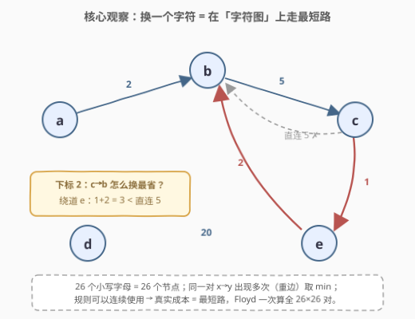
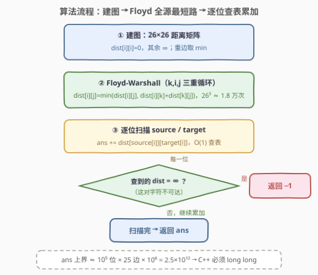
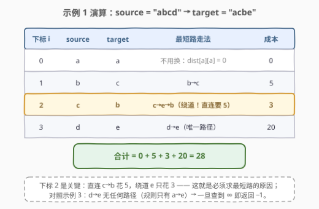

# 转换字符串的最小成本 I

- **题目名称**：转换字符串的最小成本 I
- **链接**：[2976. 转换字符串的最小成本 I](https://leetcode.cn/problems/minimum-cost-to-convert-string-i/)
- **难度**：中等
- **标签**：图、最短路、Floyd-Warshall、数组、字符串

## 1. 题目概述

给定两个下标从 0 开始、长度均为 $n$ 且由**小写英文字母**组成的字符串 `source` 和 `target`，再给定转换规则数组 `original`、`changed` 和整数数组 `cost`：`cost[i]` 表示把字符 `original[i]` 更改为 `changed[i]` 的成本。

你从 `source` 出发，可以**反复**施加规则：只要存在下标 $j$ 满足 `original[j] == x`、`changed[j] == y`，就可以任选串中一个字符 $x$ 以 `cost[j]` 的成本改成 $y$（同一规则可用多次，也可对同一位置连续换多步）。返回把 `source` 转换成 `target` 的**最小**总成本；无法完成返回 $-1$。

注意：可能存在 $i \ne j$ 使 `original[i] == original[j]` 且 `changed[i] == changed[j]`（**同一对转换出现多条规则，即重边**）。

**示例 1**：

```text
输入：source = "abcd", target = "acbe",
     original = ["a","b","c","c","e","d"], changed = ["b","c","b","e","b","e"],
     cost = [2,5,5,1,2,20]
输出：28
解释：下标 1 的 b→c 花 5；下标 2 的 c 先→e（1）再 e→b（2）共花 3；
     下标 3 的 d→e 花 20。总计 5 + 3 + 20 = 28。
```

**示例 2**：

```text
输入：source = "aaaa", target = "bbbb", original = ["a","c"], changed = ["c","b"], cost = [1,2]
输出：12
解释：a→c 花 1，c→b 花 2，故 a→b 最省 3；共 4 个位置，3 × 4 = 12。
```

**示例 3**：

```text
输入：source = "abcd", target = "abce", original = ["a"], changed = ["e"], cost = [10000]
输出：-1
解释：下标 3 的 d 无法变成 e，返回 -1。
```

**约束条件**：

- $1 \le \text{source.length} = \text{target.length} \le 10^5$
- `source`、`target` 均由小写英文字母组成
- $1 \le \text{cost.length} = \text{original.length} = \text{changed.length} \le 2000$
- `original[i]`、`changed[i]` 是小写英文字母，且 $\text{original}[i] \ne \text{changed}[i]$
- $1 \le \text{cost}[i] \le 10^6$

> 💡 读题抓两个信号：① 规则可以**连续施加**——示例 1 里 c 换成 b 直连要 5，绕道 e（c→e→b）只要 3，所以「按规则一步换」必然吃亏；② 字符集只有 **26 个小写字母**——转换关系天然是一张 26 个节点的有向图，且每位字符相互独立，总成本 = 每位最短路之和。两个信号合起来直接指向**小图全源最短路**。

---

## 2. 解题思路

### 2.1 暴力思路：一步直换与逐位现算，各错在哪

**暴力一：按规则表一步换。** 对每个 `source[i] != target[i]` 的位置，在规则表里找 `original = source[i]`、`changed = target[i]` 的规则直接换。两个致命伤：

1. **多跳更便宜**：示例 1 的下标 2（c→b），直连规则花 5，但 c→e（1）→b（2）只花 3。规则可以连续用，最优方案可能走好几步，一步换根本没考虑「路径」；
2. **重边没处理**：题目明说同一对 (x, y) 可能出现多次且 cost 各异，必须取最小。

**暴力二：每个位置现算一次最短路。** 意识到要找路径后，对每一位跑 BFS/Dijkstra 也能过——但这浪费在一个显然的结构上：**字符对只有 $26 \times 26 = 676$ 种**，而串长可达 $10^5$，同一种 (x, y) 会被重复查询上万次。正确姿势是**离线一次性算好全部 676 对的最短路，再逐位 O(1) 查表**。

### 2.2 核心观察：26 节点字符图 + Floyd 全源最短路



三步建模：

1. **节点**：26 个小写字母就是 26 个节点（值域极小正是本题甜区）；
2. **有向边**：每条规则 `original[i] → changed[i]` 是一条权为 `cost[i]` 的有向边，**重边取 min**（同一对出现多次只留最便宜的）；
3. **答案**：位置之间互不干扰（每次操作只改一个位置的字符），于是

$$\boxed{\ \text{ans} = \sum_{i=0}^{n-1} \text{dist}\big[\text{source}[i]\big]\big[\text{target}[i]\big]\quad\text{（任一项为 } \infty \text{ 则返回 } -1\text{）}\ }$$

其中 $\text{dist}[x][y]$ 是字符 $x$ 到 $y$ 在图上的**最短路**。

为什么用 **Floyd-Warshall**：我们需要的不是单源最短路，而是**全部 676 对**的查询——这正是 Floyd 的「全源最短路」形态。节点数只有 26，三重循环 $26^3 \approx 1.76$ 万次运算，一次算完，之后每位 O(1) 查表。另外初始化 $\text{dist}[i][i] = 0$ 天然处理了 `source[i] == target[i]` 的位置（成本 0，无需特判）。

### 2.3 算法流程图



**完整步骤**：

1. **建图**：`dist` 为 26×26 矩阵，`dist[i][i] = 0`，其余置 $\infty$；遍历规则数组，`dist[u][v] = min(dist[u][v], cost[i])`（重边取 min）；
2. **Floyd**：三重循环 $k, i, j$，`dist[i][j] = min(dist[i][j], dist[i][k] + dist[k][j])`；
3. **扫描累加**：遍历每个位置，`ans += dist[source[i]][target[i]]`；
4. **判 ∞**：任何一位查到 $\infty$（这对字符不可达）立即返回 $-1$；扫完返回 `ans`。

> ⚠️ 三个常见手误：① 建图忘了取 min 直接覆盖——重边会留下贵的；② C++ 用 `int` 存 `ans`——最坏 $10^5$ 位 × 每位 $25$ 条边 × $10^6 \approx 2.5 \times 10^{12}$，必炸，全程 `long long`；③ 对 `source[i] == target[i]` 单独特判——不必，`dist[i][i] = 0` 已经是 0。

### 2.4 示例演算



以示例 1（`source = "abcd"`，`target = "acbe"`）为例。建图后的边：a→b(2)、b→c(5)、c→b(5)、c→e(1)、e→b(2)、d→e(20)。Floyd 跑完后逐位查表：

| 下标 | source | target | 最短路走法 | 成本 |
|------|--------|--------|-----------|------|
| 0 | a | a | 不换（dist[a][a] = 0） | 0 |
| 1 | b | c | b→c | 5 |
| 2 | c | b | **c→e→b（直连要 5）** | **3** |
| 3 | d | e | d→e（唯一路径） | 20 |

合计 $0 + 5 + 3 + 20 = 28$ ✓。下标 2 正是本题的题眼：**绕道比直连便宜**，这就是必须求最短路而非查直连规则的原因。

示例 2：`dist[a][b] = dist[a][c] + dist[c][b] = 1 + 2 = 3`（传递性），4 个位置共 $3 \times 4 = 12$ ✓。

示例 3：`dist[d][e] = ∞`（规则里只有 a→e），返回 $-1$ ✓。

---

## 3. 参考代码

### C++

```cpp
class Solution {
  public:
    long long minimumCost(string source, string target, vector<char>& original,
                          vector<char>& changed, vector<int>& cost) {
        const long long INF = 1e15;
        vector<vector<long long>> dist(26, vector<long long>(26, INF));
        for (int i = 0; i < 26; i++) dist[i][i] = 0;

        for (int i = 0; i < (int)original.size(); i++) {
            int u = original[i] - 'a', v = changed[i] - 'a';
            dist[u][v] = min(dist[u][v], (long long)cost[i]);  // 重边取 min
        }

        for (int k = 0; k < 26; k++)
            for (int i = 0; i < 26; i++) {
                if (dist[i][k] == INF) continue;  // 剪枝：i 到 k 不通就跳过
                for (int j = 0; j < 26; j++)
                    if (dist[i][k] + dist[k][j] < dist[i][j])
                        dist[i][j] = dist[i][k] + dist[k][j];
            }

        long long ans = 0;
        for (int i = 0; i < (int)source.size(); i++) {
            long long d = dist[source[i] - 'a'][target[i] - 'a'];
            if (d >= INF) return -1;  // 这对字符不可达
            ans += d;
        }
        return ans;
    }
};
```

### Python

```python
class Solution:
    def minimumCost(self, source: str, target: str,
                    original: List[str], changed: List[str], cost: List[int]) -> int:
        INF = float('inf')
        dist = [[INF] * 26 for _ in range(26)]
        for i in range(26):
            dist[i][i] = 0

        for x, y, c in zip(original, changed, cost):
            u, v = ord(x) - 97, ord(y) - 97
            if c < dist[u][v]:          # 重边取 min
                dist[u][v] = c

        for k in range(26):
            dk = dist[k]
            for i in range(26):
                dik = dist[i][k]
                if dik == INF:          # 剪枝
                    continue
                di = dist[i]
                for j in range(26):
                    nd = dik + dk[j]
                    if nd < di[j]:
                        di[j] = nd

        ans = 0
        for s, t in zip(source, target):
            d = dist[ord(s) - 97][ord(t) - 97]
            if d == INF:
                return -1
            ans += d
        return ans
```

> 💡 语言细节：C++ 的 `INF` 取 $10^{15}$，既远大于任何真实路径（$\le 25 \times 10^6$），相加两次也不会溢出 `long long`；内层 `if (dist[i][k] == INF) continue` 是小优化，26 节点下可有可无但白拿。Python 用 `float('inf')` 天然免溢出，内层先取 `dik`/`dk` 局部变量可减少下标寻址。两份代码都先跑 Floyd 再扫串，`zip(source, target)` 逐位取字符比下标循环更 Pythonic。

---

## 4. 复杂度分析

| 维度 | 复杂度 | 说明 |
|------|--------|------|
| 时间复杂度 | $O(m + 26^3 + n)$ | $m \le 2000$ 为规则数（建图），$26^3 \approx 1.76$ 万（Floyd），$n \le 10^5$ 为串长（扫描查表）；实际由扫描主导 |
| 空间复杂度 | $O(26^2)$ | 距离矩阵 676 个元素，常数级 |

> 💡 复杂度的反差感：题目给的 $n$ 高达 $10^5$、$m$ 达 2000，但算法的「重活」Floyd 只有 $26^3$——**「字符集只有 26 个字母」这个不起眼的约束才是解题的钥匙**。把值域压缩成图节点后，查询端只剩纯 O(1) 查表。

---

## 5. 扩展：算法选型与续作 2977

### 5.1 为什么是 Floyd 而不是 Dijkstra

本题需要的是**全源**最短路（任意字符对的查询都要答）。理论上跑 26 次 Dijkstra（$O(26 \cdot m \log m)$）同样能过，但节点只有 26 个时，Floyd 的三重循环又短又快，是「节点数极小的稠密图全源问题」的标准答案。选型口诀：**单源用 Dijkstra，全源 + 小节点数用 Floyd，有负权边用 Bellman-Ford/SPFA**。

### 5.2 溢出的三层防线

1. 单条边 $\le 10^6$，单条最短路至多 25 条边 $\le 2.5 \times 10^7$，`int` 单项够用；
2. 总和最坏 $10^5 \times 2.5 \times 10^7 = 2.5 \times 10^{12}$，超出 32 位 `int`（约 $2.1 \times 10^9$）三个数量级，累加器必须 `long long`；
3. `INF` 本身参与 `dist[i][k] + dist[k][j]` 运算——取 $10^{15}$ 保证加两次仍在 `long long` 范围内，不会假溢出成负数污染答案。

### 5.3 续作：2977. 转换字符串的最小成本 II

本题的姐妹题把 `original`/`changed` 从单字符扩成**任意子串**（如 `"abc" → "xyz"`），节点不再是 26 个字母而是一个近乎无界的字符串集合——「小图全源最短路」的甜区消失，需要完全不同的建模（前缀树/区间 DP 方向）。对照做一遍能深刻体会：**Floyd 好写的前提是节点数有界且极小**，这个前提一旦被抽掉，套路就得推倒重来。

---

## 6. 面试要点

1. **为什么不能按规则表「一步换」？**

   - 规则可以**连续施加**：示例 1 中 c→b 直连花 5，绕道 c→e→b 只花 3
   - 最优成本是「图上最短路」而非「直连规则价」；此外同一对 (x, y) 可能有多条规则（重边），建图时必须取 min

2. **位置之间会互相影响吗？**

   - 不会：每次操作只作用于**一个位置**的字符，各位置完全独立
   - 所以总成本 = 每位 `dist[source[i]][target[i]]` 之和，逐位查表累加即可

3. **为什么选 Floyd-Warshall？**

   - 查询端要的是**全部 676 对**字符的最短路（全源），不是单源
   - 节点只有 26 个，$26^3 \approx 1.76$ 万次循环一次算完；跑 26 次 Dijkstra 也对，但代码更长、收益为零

4. **答案会溢出吗？**

   - 会：总和最坏 $\approx 10^5 \times 25 \times 10^6 = 2.5 \times 10^{12}$，C++ 必须全程 `long long`
   - `INF` 取 $10^{15}$，保证 `INF + INF` 不越过 `long long` 上界，避免假溢出

5. **`source[i] == target[i]` 需要特判吗？**

   - 不需要：初始化 `dist[i][i] = 0` 后，相同字符对查表自然得 0
   - 同理「同一位可以换多步」不需要显式模拟——最短路本身就允许任意条边

> 💡 **一句话总结**：26 个字母建 26 节点有向图（重边取 min），Floyd 一遍算全 676 对最短路，扫串逐位查表累加，查到 ∞ 即返回 −1；C++ 记得 `long long`。

---

## 7. 同类练习题

- [743. 网络延迟时间](https://leetcode.cn/problems/network-delay-time/)（[题解](../0701-0800/743_网络延迟时间.md)）：堆优化 Dijkstra 单源最短路模板，本题若只查一个源点时的基础件
- [1334. 阈值距离内邻居最少的城市](https://leetcode.cn/problems/find-the-city-with-the-smallest-number-of-neighbors-at-a-threshold-distance/)（[题解](../1301-1400/1334_阈值距离内邻居最少的城市.md)）：Floyd-Warshall 全源最短路模板题，本题三重循环的原型
- [399. 除法求值](https://leetcode.cn/problems/evaluate-division/)（[题解](../0301-0400/399_除法求值.md)）：同样把「点对查询」建成带权有向图再求路径值，「离线建图 + 查询」的同款思路
- [1976. 到达目的地的方案数](https://leetcode.cn/problems/number-of-ways-to-arrive-at-destination/)（[题解](../1901-2000/1976_到达目的地的方案数.md)）：Dijkstra 求最短路的同时做计数，最短路家族的进阶练习
- [2977. 转换字符串的最小成本 II](https://leetcode.cn/problems/minimum-cost-to-convert-string-ii/)：本题续作，替换单位从单字符扩展到任意子串，体会「节点数有界」这一前提消失后的建模变化
