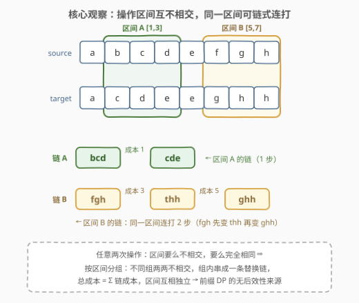
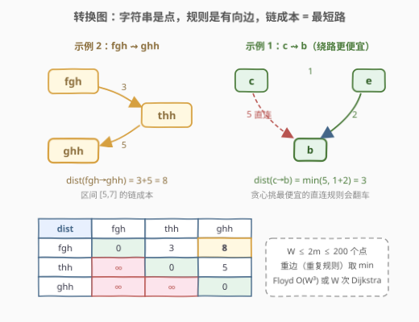
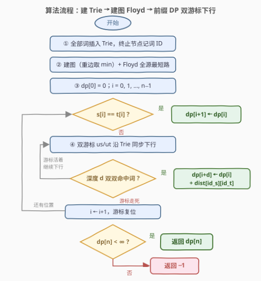

# LeetCode 转换字符串的最小成本 II 题解

## 1. 题目概述

- **标题 / 题号**：转换字符串的最小成本 II（#2977，hard）
- **链接**：https://leetcode.cn/problems/minimum-cost-to-convert-string-ii/
- **难度**：困难
- **标签**：图、字典树（Trie）、动态规划、最短路

**题意**：给定长度均为 $n$ 的小写字符串 `source` 和 `target`。另有字符串数组 `original`、`changed` 与整数数组 `cost`：花 $\text{cost}[i]$ 的成本，可以把字符串中等于 $\text{original}[i]$ 的子串**整段**替换成 $\text{changed}[i]$（两者等长，每条规则可用任意多次）。**任两次操作**选中的子串下标区间 $[a,b]$ 与 $[c,d]$ 必须满足二者之一：

1. **不相交**：$b < c$ 或 $d < a$；
2. **完全相同**：$a = c$ 且 $b = d$。

返回把 `source` 变成 `target` 的最小总成本；无法完成返回 $-1$。同一对 (original, changed) 的重复规则可能存在（取更便宜的）。

**示例 1**：

```text
输入：source = "abcd", target = "acbe",
     original = ["a","b","c","c","e","d"], changed = ["b","c","b","e","b","e"], cost = [2,5,5,1,2,20]
输出：28
解释：b→c(5)；c→e(1) 再 e→b(2)（同一位置 [2,2] 连打两步，绕路 3 < 直连 5）；d→e(20)。
```

**示例 2**：

```text
输入：source = "abcdefgh", target = "acdeeghh",
     original = ["bcd","fgh","thh"], changed = ["cde","thh","ghh"], cost = [1,3,5]
输出：9
解释：[1,3] 上 bcd→cde(1)；[5,7] 上 fgh→thh(3) 再 thh→ghh(5)（同区间两步）。
```

**示例 3**：

```text
输入：source = "abcdefgh", target = "addddddd",
     original = ["bcd","defgh"], changed = ["ddd","ddddd"], cost = [100,1578]
输出：-1
解释：[1,3] 与 [3,7] 共用下标 3，重叠即非法；两条路线互斥且各自凑不完整串。
```

**约束**：

- $1 \le n = \text{source.length} = \text{target.length} \le 1000$，均由小写字母组成
- $1 \le m = \text{cost.length} = \text{original.length} = \text{changed.length} \le 100$
- $1 \le \text{original}[i].\text{length} = \text{changed}[i].\text{length} \le n$，$\text{original}[i] \ne \text{changed}[i]$
- $1 \le \text{cost}[i] \le 10^6$

> 💡 读题先抓反差：规则是**子串级**的（2976 是单字符级），且操作之间横着一条「不相交或完全相同」的区间约束。这条约束不是花架子——它直接规定了整道题的骨架：**操作按区间分组**。规模上 $n \le 1000$、$m \le 100$，去重后字符串至多 $2m = 200$ 个，甜区全在「小图 + 短串」上。

## 2. 解题思路

### 2.1 暴力思路：两条死路

- **整串当状态**：把「当前整个字符串」当作 Dijkstra 的节点做最短路搜索——状态空间 $26^{1000}$，每个状态还要枚举所有区间 × 所有规则生成邻居，直接爆炸。
- **朴素前缀 DP + 逐个子串匹配**：DP 框架其实是对的（见 2.2），坏在「子串 → 词编号」的定位方式：对每个 $(i, d)$ 重新构造/哈希子串要 $O(d)$，总计 $O(n \cdot L_{\max}^2) \approx 5 \times 10^8$；改成「每个起点 $i$ 枚举全部 $m$ 条规则做子串比较」也是 $O(n \cdot m \cdot L) = 10^8$。C++ 贴地飞行，Python 直接出局。

> ⚠️ 瓶颈精确定位在**子串身份识别**：每个 $(i, d)$ 都在重复支付 $O(L)$ 的匹配费。把匹配费摊销成「沿 Trie 下行一步 $O(1)$」，是本题复杂度的命门（见 2.2 第 (4) 点）。

### 2.2 核心观察：不相交区间划分 + 同区间链 = 图最短路 + Trie 双游标

**(1) 区间结构：不相交的组，每组一条链。**



任两次操作的区间要么不相交、要么完全相同 → 把所有操作**按区间分组**：不同组的区间两两不相交，同组内的操作区间完全重合，构成一条首尾相接的替换链：

$$\text{source}[a..b] = c_0 \to c_1 \to \cdots \to c_k = \text{target}[a..b]$$

于是每个位置要么不被任何操作覆盖（此时必须 $source[i] = target[i]$），要么恰好被一个区间的链覆盖，**总成本 = 各链成本之和**，区间之间互不干扰。操作顺序与合法性无关（约束是成对区间关系），可以按左端点从左到右处理——这是前缀 DP 的无后效性来源。

**(2) 链成本 = 转换图上的最短路。**



把**去重后的字符串**（$\text{original} \cup \text{changed}$，至多 $W = 2m \le 200$ 个）当图节点，每条规则 $\text{original}[i] \to \text{changed}[i]$ 是一条权为 $\text{cost}[i]$ 的有向边（重复规则 = 重边，取 $\min$）。链的每一步「当前整段内容 $x$ 换成 $y$」恰是图中一条边，所以：

$$\text{把区间从 } s \text{ 变到 } t \text{ 的最小成本} = \text{dist}(s, t)$$

其中 $\text{dist}$ 是全源最短路（Floyd $O(W^3)$，或跑 $W$ 次 Dijkstra）。示例 1 的 $c \to e \to b$（$1+2=3$）便宜过直连 $c \to b$（$5$），正说明**链必须按路径最短算，不能贪心挑直连**。若起点 $s$ 不出现在任何 `original` 中（无出边）或终点 $t$ 不出现在任何 `changed` 中（无入边），则 $\text{dist} = \infty$——不必特判，最短路自动表达「该区间不可行」。

**(3) 前缀 DP：区间在左端点一次性结算。**

$$dp[i] = \text{前 } i \text{ 个字符完成转换的最小成本},\qquad dp[0] = 0$$

- **单字符白嫖**：$source[i] = target[i]$ 时 $dp[i+1] \leftarrow dp[i]$（成本 0）；
- **区间结算**：若 $source[i..i+d)$ 与 $target[i..i+d)$ 都是图中的词，则 $dp[i+d] \leftarrow dp[i] + \text{dist}(id_s, id_t)$。

区间互不相交恰好保证无后效性：**每个区间在它的左端点被整体结算，右端点之后的世界与它无关**。

**(4) Trie 双游标：把子串识别降到每层 $O(1)$。**

把全部 $2m$ 个词插入 Trie，终止节点记词编号。对每个起点 $i$，让两个游标 $u_s, u_t$ 从根出发**同步下行**：第 $d$ 层分别吃进 $source[i+d-1]$ 与 $target[i+d-1]$，任一游标无路可走即停；若某层两个游标都停在终止节点，就同时拿到两侧子串的词编号，查 $\text{dist}$ 更新 $dp[i+d]$。单个起点花费 $O(\min(L_{\max},\, n-i))$，全串 $O(n \cdot L_{\max}) \le 10^6$——对比 2.1 的 $O(n L_{\max}^2)$，这正是 Trie 在本题存在的意义（官方 tag 里 Trie 名列第二）。

### 2.3 算法流程图



**完整步骤**：

1. **建 Trie**：`original` 与 `changed` 全部词插入，终止节点记词编号（顺带完成去重）；
2. **建图**：每条规则是一条有向边，重边取 $\min$；
3. **全源最短路**：C++ 用 Floyd（$W^3 \le 8 \times 10^6$）；Python 跑 $W$ 次 Dijkstra；
4. **前缀 DP**：$i$ 从左到右——$source[i] = target[i]$ 则白嫖右移一格；同时双游标沿 Trie 下行，每层命中词对就用 $\text{dist}$ 结算区间；
5. **收尾**：$dp[n]$ 仍为 $\infty$ 返回 $-1$，否则返回 $dp[n]$。

> ⚠️ 三个高频手误：① 白嫖转移只看 $source[i] = target[i]$，别把「位置 $i$ 落在某个词开头」误当成「位置 $i$ 能跳过」；② 重边忘记取 $\min$（C++ 建矩阵必须取，Dijkstra 邻接表可挂重边天然免疫）；③ 用 32 位 `int` 存成本——答案上界约 $n \cdot W \cdot 10^6 \approx 2 \times 10^{11}$，C++ 全程 `long long`。

### 2.4 示例演算

![示例演算：dp 逐格推进，dp[8] = 9](../images/p2977_example_walkthrough.svg)

以示例 2（`source = "abcdefgh"`，`target = "acdeeghh"`）为例，词表 $= \{bcd, cde, fgh, thh, ghh\}$：

| 转移 | 类型 | 结果 |
|------|------|------|
| $dp[0] \to dp[1]$ | $a = a$ 白嫖 | $dp[1] = 0$ |
| $dp[1] \to dp[4]$ | 区间 $[1,4)$：bcd→cde，$\text{dist} = 1$ | $dp[4] = 1$ |
| $dp[4] \to dp[5]$ | $e = e$ 白嫖 | $dp[5] = 1$ |
| $dp[5] \to dp[8]$ | 区间 $[5,8)$：fgh⇝thh⇝ghh，$\text{dist} = 3+5 = 8$ | $dp[8] = 9$ |

$dp[2], dp[3] = \infty$：位置 1 的 `b` 变 `c` 没有任何长度 $\le 2$ 的词可套，前缀逐位卡死——但无妨，$dp[1]$ 用区间一步跨到 $dp[4]$。答案 $dp[8] = 9$ ✓。

示例 3 反向印证区间结构：`defgh→ddddd`（区间 $[3,8)$，成本 1578）看似诱人，但它要求 $dp[3]$ 可达，而前缀 `"abc"→"add"` 永远凑不出（`bcd` 从位置 1 出发会落到 4，与 $[3,8)$ 重叠）；另一条 `bcd→ddd`（区间 $[1,4)$）又把位置 3 占死，剩余 `efgh` 无规则可救——两条路线互斥且各自残缺，返回 $-1$。

## 3. 参考代码

### C++

```cpp
class Solution {
  public:
    long long minimumCost(string source, string target, vector<string>& original,
                          vector<string>& changed, vector<int>& cost) {
        int n = source.size(), m = original.size();

        vector<array<int, 26>> ch(1);
        ch[0].fill(-1);
        vector<int> nid(1, -1);
        vector<string> words;
        auto insert = [&](const string& w) {
            int u = 0;
            for (char c : w) {
                int k = c - 'a';
                if (ch[u][k] == -1) {
                    ch[u][k] = ch.size();
                    ch.push_back({});
                    ch.back().fill(-1);
                    nid.push_back(-1);
                }
                u = ch[u][k];
            }
            if (nid[u] == -1) {
                nid[u] = words.size();
                words.push_back(w);
            }
            return nid[u];
        };
        vector<int> oid(m), cid(m);
        for (int i = 0; i < m; i++) {
            oid[i] = insert(original[i]);
            cid[i] = insert(changed[i]);
        }
        int W = words.size();

        const long long INF = LLONG_MAX / 4;
        vector<vector<long long>> dist(W, vector<long long>(W, INF));
        for (int i = 0; i < W; i++) dist[i][i] = 0;
        for (int i = 0; i < m; i++)
            dist[oid[i]][cid[i]] = min(dist[oid[i]][cid[i]], (long long)cost[i]);
        for (int k = 0; k < W; k++)
            for (int i = 0; i < W; i++) {
                if (dist[i][k] >= INF) continue;
                for (int j = 0; j < W; j++)
                    if (dist[k][j] < INF)
                        dist[i][j] = min(dist[i][j], dist[i][k] + dist[k][j]);
            }

        vector<long long> dp(n + 1, INF);
        dp[0] = 0;
        for (int i = 0; i < n; i++) {
            if (dp[i] >= INF) continue;
            if (source[i] == target[i]) dp[i + 1] = min(dp[i + 1], dp[i]);
            int us = 0, ut = 0;
            for (int d = 1; i + d <= n; d++) {
                us = ch[us][source[i + d - 1] - 'a'];
                ut = ch[ut][target[i + d - 1] - 'a'];
                if (us < 0 || ut < 0) break;
                if (nid[us] != -1 && nid[ut] != -1 && dist[nid[us]][nid[ut]] < INF)
                    dp[i + d] = min(dp[i + d], dp[i] + dist[nid[us]][nid[ut]]);
            }
        }
        return dp[n] >= INF ? -1 : dp[n];
    }
};
```

### Python

```python
import heapq


class Solution:
    def minimumCost(self, source: str, target: str, original: List[str], changed: List[str], cost: List[int]) -> int:
        n, m = len(source), len(original)

        ch, nid, words = [{}], [-1], []

        def insert(w):
            u = 0
            for c in w:
                nxt = ch[u].get(c)
                if nxt is None:
                    nxt = len(ch)
                    ch.append({})
                    nid.append(-1)
                    ch[u][c] = nxt
                u = nxt
            if nid[u] == -1:
                nid[u] = len(words)
                words.append(w)
            return nid[u]

        oid = [insert(w) for w in original]
        cid = [insert(w) for w in changed]
        W = len(words)

        INF = float('inf')
        adj = [[] for _ in range(W)]
        for o, c, z in zip(oid, cid, cost):
            adj[o].append((c, z))

        dist = []
        for s in range(W):
            ds = [INF] * W
            ds[s] = 0
            heap = [(0, s)]
            while heap:
                d, u = heapq.heappop(heap)
                if d > ds[u]:
                    continue
                for v, w in adj[u]:
                    if d + w < ds[v]:
                        ds[v] = d + w
                        heapq.heappush(heap, (d + w, v))
            dist.append(ds)

        dp = [INF] * (n + 1)
        dp[0] = 0
        for i in range(n):
            if dp[i] == INF:
                continue
            if source[i] == target[i] and dp[i] < dp[i + 1]:
                dp[i + 1] = dp[i]
            us = ut = 0
            j = i
            while j < n:
                c1 = ch[us].get(source[j])
                c2 = ch[ut].get(target[j])
                if c1 is None or c2 is None:
                    break
                us, ut = c1, c2
                j += 1
                if nid[us] != -1 and nid[ut] != -1:
                    d = dist[nid[us]][nid[ut]]
                    if d < INF and dp[i] + d < dp[j]:
                        dp[j] = dp[i] + d
        return dp[n] if dp[n] < INF else -1
```

> 💡 语言细节：C++ 的 Trie 用 26 叉数组 `array<int,26>`（词总长 $\le 2\times10^5$，约 21 MB，内存紧张可换哈希子节点）；Python 用 dict 子节点。Python 侧刻意用 $W$ 次 Dijkstra 替代 Floyd——$W^3 = 8\times10^6$ 次纯解释执行要数秒，而 $W$ 次 Dijkstra 只有 $10^4$ 量级的堆操作。`dist[i][i] = 0` 对应「区间前后内容相同」的转移，等价于逐字符白嫖，无害保留。

## 4. 复杂度分析

| 维度 | 复杂度 | 说明 |
|------|--------|------|
| 时间复杂度 | $O(\Sigma\lvert w\rvert + W^3 + n \cdot L_{\max})$ | 建 Trie $O(\Sigma\lvert w\rvert) \le 2\times10^5$；Floyd $W^3 \le 200^3 = 8\times10^6$；DP 双游标 $\le n \cdot L_{\max} = 10^6$（Python 换 Dijkstra 后为 $O(W \cdot E \log W)$） |
| 空间复杂度 | $O(26 \cdot \Sigma\lvert w\rvert + W^2)$ | Trie 26 叉数组约 21 MB；$\text{dist}$ 矩阵 $W^2 \le 4\times10^4$；$dp$ 数组 $O(n)$ |

> 💡 三块开销里最大的是 Floyd 的 $8\times10^6$，但在 C++ 里只是毫秒级；真正的隐性上限反而是 Trie 的内存（26 叉数组）。$n \le 1000$、$L_{\max} \le 1000$ 时 DP 双游标恰好 $10^6$ 步——三个 $10^6$ 量级拼出本题的复杂度全景。

## 5. 扩展

### 5.1 与 2976 的直线距离

2976（转换字符串的最小成本 I）规则全是**单字符**：图退化为 26 个点，Floyd 后逐位独立查表，$O(26^3 + n)$ 完事。本题泛化到**任意等长子串**，一口气引进两个新结构：① 子串必须整段匹配 → Trie；② 操作的区间约束 → 前缀 DP。从 I 到 II 正是「逐位查表」到「区间结构 DP」的跃迁，两题对照食用效果最佳。

### 5.2 Floyd 还是 Dijkstra？

$W \le 200$、边数 $\le m = 100$ 是**稀疏小图**：C++ 两者的差距可以忽略（Floyd 三重循环写起来最短）；Python 的 $W^3$ 纯解释执行约数秒，Dijkstra（每个源点只碰 $10^2$ 条边）快两个数量级。语言特性倒逼算法选型，这是面试里「你会怎么选」的好素材。

### 5.3 如果允许区间重叠会怎样？

本题「不相交或完全相同」把操作结构锁死成**平面划分**，前缀 DP 才有无后效性。若放宽成任意重叠，后一次操作会改写前一次的匹配内容，链与链之间产生依赖，大概率要上区间 DP 或更复杂的模型；口述这一句，能展示对「DP 为什么成立」的理解深度。

## 6. 面试要点

1. **为什么操作可以按区间分组、组间独立？**

   - 任两次操作的区间要么不相交要么完全相同 → 不同区间两两不相交，同一区间的操作串成链
   - 合法性与成本只依赖「区间集合 + 每段链」，与操作顺序无关 → 可按左端点从左到右结算，前缀 DP 成立

2. **为什么区间成本 = 转换图最短路，而不是贪心挑最便宜的规则？**

   - 链的每一步是图中一条边，链成本是路径长；示例 1 中 c→e→b（3）便宜过直连 c→b（5）
   - 起点必须是某条 original（有出边）、终点必须是某条 changed（有入边），$\text{dist} = \infty$ 自动表达不可行

3. **Trie 双游标为什么能把匹配从 $O(n L_{\max}^2)$ 降到 $O(n L_{\max})$？**

   - 每个起点 $i$ 的所有长度前缀共享**一次**下行：第 $d$ 层只做 $O(1)$ 指针跳转，同时判定两侧长度为 $d$ 的子串是否都是词
   - 朴素做法每个 $(i,d)$ 重新哈希/比较子串，$O(d)$ 的重复劳动是纯浪费

4. **重复规则与 `dist[x][x] = 0` 怎么处理？**

   - 同一对字符串的多条规则是重边：矩阵建图取 $\min$（Dijkstra 邻接表挂重边天然免疫）
   - $\text{original}[i] \ne \text{changed}[i]$ 保证无自环；$\text{dist}[x][x]=0$ 的转移等价于白嫖，无害

5. **什么时候返回 -1？最容易漏判的是什么？**

   - $dp[n] = \infty$ 即返回 $-1$；典型卡点是某位置 $source[i] \ne target[i]$ 且没有**起始于左侧可达前缀**的词区间能罩住它
   - 「source 子串是词、target 子串不是词」同样不可行——只查 source 一头必挂

> 💡 **一句话总结**：区间约束 → 不相交划分 + 同区间链 → 链 = 字符串图上的最短路（Floyd/Dijkstra）→ 前缀 DP + Trie 双游标 $O(1)$ 定位子串；重边取 min、答案 long long、Python 换 Dijkstra。

## 同类练习题

| # | 题目 | 与本题的关联 |
|---|------|-------------|
| 2976 | [转换字符串的最小成本 I](https://leetcode.cn/problems/minimum-cost-to-convert-string-i/) | 单字符规则版，26 点 Floyd + 逐位查表，先做它再回看本题的泛化路径 |
| 139 | [单词拆分](https://leetcode.cn/problems/word-break/)（[题解](../0101-0200/139_单词拆分.md)） | 同为「前缀 DP + 词典匹配」，dp[i] 由词尾回跳的骨架与本题一致 |
| 208 | [实现 Trie (前缀树)](https://leetcode.cn/problems/implement-trie-prefix-tree/)（[题解](../0201-0300/208_实现Trie.md)） | Trie 模板题，本题双游标下行的基本功 |
| 743 | [网络延迟时间](https://leetcode.cn/problems/network-delay-time/)（[题解](../0701-0800/743_网络延迟时间.md)） | 堆优化 Dijkstra 模板，本题 Python 版全源最短路的直接来源 |
