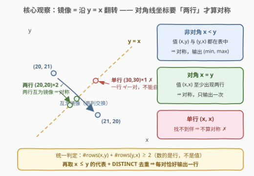
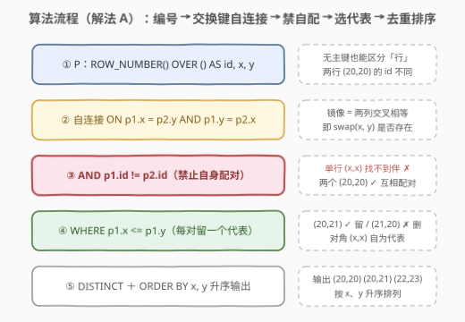
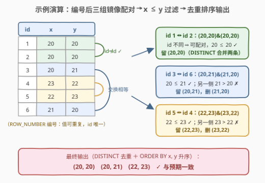

# 对称坐标

- **题目名称**：对称坐标
- **链接**：[2978. 对称坐标](https://leetcode.cn/problems/symmetric-coordinates/)
- **难度**：中等
- **标签**：SQL、自连接、窗口函数、GROUP BY 聚合、去重

## 1. 题目概述

> ⚠️ 本题为 LeetCode 付费题，题意描述根据官方示例用例与 hints 重建，可能与官方题面有出入。

给定一张 `Coordinates` 表，每行包含整数 `X`、`Y`。**表没有主键，可能包含重复行**。

如果两个坐标 `(X1, Y1)` 和 `(X2, Y2)` 满足 `X1 == Y2` 且 `X2 == Y1`（即互为沿直线 $y = x$ 的镜像），则称它们是**对称坐标**。

编写解决方案，在所有对称坐标中，只输出满足 `X1 <= Y1` 的**唯一坐标**（每对镜像只留一个代表），结果按 `X`、`Y` 分别**升序**排列。

**表结构**：

```text
Table: Coordinates
+-------------+------+
| Column Name | Type |
+-------------+------+
| X           | int  |  ← 无主键，允许重复行
| Y           | int  |
+-------------+------+
```

**示例 1**：

```text
输入：
Coordinates 表:
+----+----+
| X  | Y  |
+----+----+
| 20 | 20 |
| 20 | 20 |
| 20 | 21 |
| 23 | 22 |
| 22 | 23 |
| 21 | 20 |
+----+----+

输出：
+----+----+
| x  | y  |
+----+----+
| 20 | 20 |
| 20 | 21 |
| 22 | 23 |
+----+----+
```

**解释**：

| 坐标对 | 判定 | 输出 |
|--------|------|------|
| (20, 20) 与 (20, 20) | 表中确有两行 (20, 20)，两行互为镜像 → 对称 | 输出 **(20, 20)**（去重后一次） |
| (20, 21) 与 (21, 20) | 互为镜像 → 对称 | 只输出 **(20, 21)**（满足 X ≤ Y） |
| (23, 22) 与 (22, 23) | 互为镜像 → 对称 | 只输出 **(22, 23)**（满足 X ≤ Y） |

**约束条件**：

- `X`、`Y` 均为整数（可为负）
- 表可能包含**重复值**——这是本题的题眼（见 2.1 的陷阱分析）
- 「两个坐标」指的是**两行**：单独一行的 $(x, x)$ 不能和它自己配对成对称坐标

> 💡 本题考点浓缩在两处：**镜像配对**（自连接时交换 X/Y 作为连接键）与**对角线陷阱**（$(x,x)$ 型坐标必须由**两行**才能构成对称，单行自配对不算）。示例中 $(20,20)$ 故意出现两次，就是在暗示这条规则——若它只出现一次，是不配出现在答案里的。

---

## 2. 解题思路

### 2.1 暴力思路：朴素自连接 + 致命陷阱

最直觉的写法是「自己和自己按镜像条件连接」：

```sql
SELECT DISTINCT p1.x, p1.y
FROM Coordinates p1
JOIN Coordinates p2 ON p1.x = p2.y AND p1.y = p2.x
WHERE p1.x <= p1.y
ORDER BY 1, 2;
```

这条语句在官方示例上**恰好能通过**——但这是巧合：示例里 $(20,20)$ 恰好出现了两次。它潜藏一个**致命 bug**：

> ⚠️ **自配对陷阱**：对角线上的坐标 $(x, x)$ 若在表中只出现**一次**，这一行会与**它自己**连接成功（$x = x$ 且 $x = x$），被错误地判定为「对称坐标」。而题意说的是**两个坐标** $(X_1, Y_1)$ 和 $(X_2, Y_2)$ 对称——**单独一行不构成一对**。

用测试数据说明：

| 表内容 | 朴素自连接 | 正确答案 |
|--------|-----------|----------|
| `[(30, 30)]`（单行对角） | 输出 `(30, 30)` ✗ | 空集 ✓ |
| `[(30, 31), (30, 31)]`（同一行重复，无镜像） | 空集 ✓ | 空集 ✓ |
| `[(30, 31), (31, 30)]` | 输出 `(30, 31)` ✓ | 输出 `(30, 31)` ✓ |

第一行就是朴素解法翻车的地方。修复思路也就清晰了：**必须把「行」和「值」区分开**——两行值相同（如两个 $(20,20)$）可以配对，一行和自己不行。

### 2.2 核心观察：给行编号，禁止自身配对



**问题本质**：在值的多重集合 $\text{Coordinates}$ 中，找出所有满足以下条件的 $(x, y)$：

$$
\text{answer} = \bigl\{\, (x, y) \;:\; x \le y,\ \#\text{rows}(x, y) + \#\text{rows}(y, x) \ge 2 \,\bigr\}
$$

其中 $\#\text{rows}(x, y)$ 表示值为 $(x, y)$ 的**行数**。分两类讨论：

1. **非对角线**（$x < y$）：$(x,y)$ 与 $(y,x)$ **各至少一行**即对称。同一行重复出现（如两个 $(30,31)$）不能互相顶替——配对的是**值**，值 $(30,31)$ 与值 $(31,30)$ 都存在才算数。
2. **对角线**（$x = y$）：$(x,x)$ 必须有**至少两行**才对称。一行是自己，另一行是它的镜像（值恰好也是 $(x,x)$）。

由此得到两种等价实现：

- **解法 A（编号 + 自连接）**：用 `ROW_NUMBER() OVER ()` 给每行造一个唯一 `id`，连接条件里加 `p1.id != p2.id`，从物理上禁止一行和自己配对。两个 $(20,20)$ 编号不同，可以互相配对 ✓；单个 $(30,30)$ 找不到编号不同的镜像 ✗。
- **解法 B（归一化 + 分组计数）**：把每行 $(x, y)$ 归一化为 $(\min(x,y),\ \max(x,y))$，则一对镜像 $(a,b)+(b,a)$ 归一化后变成**两个相同的** $(\min,\max)$。于是「对称」统一翻译成 `GROUP BY` 后 `COUNT(*) > 1`。关键细节：
  - **非对角行必须先 `DISTINCT`**：两个 $(30,31)$ 而无 $(31,30)$ 时，若不先去重，归一化出两个 $(30,31)$ 会被误判为对称；
  - **对角行不能去重**：$(x,x)$ 归一化不变形，必须保留原始行数，两行才能凑够 `COUNT(*) > 1`。

> 💡 **为什么 `X <= Y` 能保证不重不漏**：一对互异的镜像 $(a,b)$ 与 $(b,a)$（$a < b$）中恰有一个满足 $x \le y$，作为代表输出一次；对角线 $(x,x)$ 自身就是自己的代表。于是「`WHERE x <= y` + `DISTINCT`」正好完成「每对输出一个唯一坐标」。

### 2.3 算法流程图



**逻辑执行步骤（解法 A）**：

| 步骤 | 操作 | 作用 |
|------|------|------|
| ① | CTE `P`：`ROW_NUMBER() OVER () AS id` | 给无主键的表造唯一行号，区分「行」与「值」 |
| ② | `p1 JOIN p2 ON p1.x = p2.y AND p1.y = p2.x` | 交换 X/Y 作连接键，找镜像行 |
| ③ | `AND p1.id != p2.id` | 禁止行与自己配对（对角线单行陷阱的解药） |
| ④ | `WHERE p1.x <= p1.y` | 每对镜像只留对角线上方（含线上）的代表 |
| ⑤ | `DISTINCT` + `ORDER BY x, y` | 去重（两行 $(20,20)$ 只输出一次）并按题意排序 |

### 2.4 示例演算

以示例 1 为例，追踪解法 A 的自连接（`id` 为 `ROW_NUMBER` 编号）：



**步骤 ①：编号后的表 `P`**

| id | x | y |
|----|----|----|
| 1 | 20 | 20 |
| 2 | 20 | 20 |
| 3 | 20 | 21 |
| 4 | 23 | 22 |
| 5 | 22 | 23 |
| 6 | 21 | 20 |

**步骤 ②③：满足 `p1.x = p2.y AND p1.y = p2.x AND p1.id != p2.id` 的配对**

| 配对 (p1 → p2) | 镜像判定 | `p1.x <= p1.y`？ |
|----------------|----------|------------------|
| id 1 (20,20) → id 2 (20,20) | $20=20,\ 20=20$，且 id 不同 ✓ | 20 ≤ 20 ✓ 留 |
| id 2 (20,20) → id 1 (20,20) | 同上 ✓ | ✓ 留（与上一行重复，`DISTINCT` 合并） |
| id 3 (20,21) → id 6 (21,20) | $20=20,\ 21=21$ ✓ | 20 ≤ 21 ✓ 留 |
| id 6 (21,20) → id 3 (20,21) | ✓ | 21 > 20 ✗ 删 |
| id 5 (22,23) → id 4 (23,22) | ✓ | 22 ≤ 23 ✓ 留 |
| id 4 (23,22) → id 5 (22,23) | ✓ | 23 > 22 ✗ 删 |

**步骤 ④⑤：`DISTINCT` 去重 + 升序** → 输出 $(20,20),\ (20,21),\ (22,23)$，与预期一致。

> ⚠️ **对比例外的场景**：若把表中两个 $(20,20)$ 删得只剩一个，id 1 将找不到 `id != 1` 的镜像行，$(20,20)$ 从答案中消失——这正是朴素自连接（无 `id != id`）会出错、而编号解法正确的分支。

---

## 3. 参考代码

### SQL（解法 A：ROW_NUMBER + 自连接）

```sql
# Write your MySQL query statement below
WITH P AS (
    SELECT ROW_NUMBER() OVER () AS id, x, y
    FROM Coordinates
)
SELECT DISTINCT p1.x, p1.y
FROM P AS p1
JOIN P AS p2
  ON p1.x = p2.y
 AND p1.y = p2.x
 AND p1.id != p2.id
WHERE p1.x <= p1.y
ORDER BY 1, 2;
```

> 💡 **写法要点**：
> - **`ROW_NUMBER() OVER ()`**：表没有主键，值可以重复，必须**人造行标识**才能表达「两行」的语义——`id` 是值之外唯一区分行的凭据。
> - **`ON p1.x = p2.y AND p1.y = p2.x`**：镜像条件的连接表达——两列**交叉相等**，等价于 $p_1 = \text{swap}(p_2)$。
> - **`p1.id != p2.id`**：全题最关键的一行，杜绝单行 $(x,x)$ 自配对；两个 $(20,20)$ 因 id 不同得以互相配对。
> - **`WHERE p1.x <= p1.y`**：每对镜像恰好留一个代表（含对角线自身）。
> - **`DISTINCT`**：镜像组内多对配对（两个 $(20,20)$ 产生两条 (1→2)、(2→1) 记录）只输出一次。
> - **`ORDER BY 1, 2`**：按第 1、2 列（即 x、y）升序，满足题目输出要求。

### SQL（解法 B：归一化 + 分组计数，O(n log n)）

```sql
# Write your MySQL query statement below
WITH T AS (
    SELECT LEAST(x, y) AS x, GREATEST(x, y) AS y
    FROM (SELECT DISTINCT x, y FROM Coordinates WHERE x != y) AS d
    UNION ALL
    SELECT x, y FROM Coordinates WHERE x = y
)
SELECT x, y
FROM T
GROUP BY x, y
HAVING COUNT(*) > 1
ORDER BY x, y;
```

> 💡 **写法要点**：
> - **归一化 `LEAST/GREATEST`**：把每个非对角坐标映射成 $(\min, \max)$，一对镜像 $(a,b)+(b,a)$ 归一化后变成**两行相同**的 $(\min,\max)$——「找镜像」被改写成「数重复」。
> - **非对角分支先 `DISTINCT`**：同一行值重复（两个 $(30,31)$ 而无 $(31,30)$）不能刷出计数 2，必须先按值去重；**对角分支故意不去重**：$(x,x)$ 的对称性就是由「行数 ≥ 2」定义的。
> - **`HAVING COUNT(*) > 1`**：统一的两类判定——非对角：$\min$-$\max$ 两个方向都出现；对角：至少两行。
> - **`UNION ALL` 而非 `UNION`**：两个分支值域不相交（一边 $x<y$、一边 $x=y$），无需再去重，少一次排序。
> - 相比解法 A 的自连接（最坏 $O(n^2)$ 次比较），本解法只需分组聚合 $O(n \log n)$，大表下更稳。

### Python（pandas）

```python
import pandas as pd

def find_symmetric_coordinates(coordinates: pd.DataFrame) -> pd.DataFrame:
    # 非对角行：按值去重后归一化为 (min, max)，出现两次 ⇒ 两个方向都有 ⇒ 对称
    off = coordinates[coordinates['X'] != coordinates['Y']].drop_duplicates()
    off_norm = pd.DataFrame({
        'x': off[['X', 'Y']].min(axis=1),
        'y': off[['X', 'Y']].max(axis=1),
    })
    off_ok = off_norm[off_norm.duplicated(keep=False)].drop_duplicates()

    # 对角行：保留原始行数，(x, x) 至少两行才算对称
    diag = coordinates[coordinates['X'] == coordinates['Y']]
    cnt = diag.groupby('X').size()
    diag_ok = pd.DataFrame({'x': cnt[cnt >= 2].index})
    diag_ok['y'] = diag_ok['x']

    return pd.concat([off_ok, diag_ok], ignore_index=True) \
             .sort_values(['x', 'y']).reset_index(drop=True)
```

> 💡 **pandas 对照**：`drop_duplicates` 对应解法 B 的 `DISTINCT`；`min/max(axis=1)` 对应 `LEAST/GREATEST` 归一化；`duplicated(keep=False)` 标记出现 ≥ 2 次的值，正是 `HAVING COUNT(*) > 1`；对角线分支 `groupby.size() >= 2` 单独数行数。注意两个分支去重策略一紧一松——非对角先去重、对角不去重，与 SQL 解法 B 的口径完全一致。

---

## 4. 复杂度分析

| 维度 | 复杂度 | 说明 |
|------|--------|------|
| **时间（解法 A）** | $O(n^2)$ 最坏 | 无索引自连接逐对比较；若连接键上有哈希索引可降到 $O(n)$，再叠加 `DISTINCT`/`ORDER BY` 的 $O(n \log n)$ |
| **时间（解法 B）** | $O(n \log n)$ | `DISTINCT` 与 `GROUP BY` 均为排序/哈希实现，$n$ = `Coordinates` 行数 |
| **空间** | $O(n)$ | 解法 A 物化两份带编号的表；解法 B 物化归一化中间表 `T` |
| **结果行数** | $O(n)$ | 每对镜像至多输出一行，不超过 $\lfloor n/2 \rfloor$ |

> ⚠️ 解法 A 的 `ROW_NUMBER() OVER ()` 本身只扫一遍表 $O(n)$，瓶颈在自连接；MySQL 8 对等值连接可用哈希连接优化，实测规模（题库约束通常数百行）两种解法都轻松通过。面试中先写 A（直白防坑），再主动给出 B（更优），是完整的答题节奏。

---

## 5. 扩展：镜像配对的三种等价写法

### 5.1 写法对比

| 写法 | 镜像判定 | 对角线判定 | 备注 |
|------|----------|------------|------|
| **A：编号自连接** | 交换键 `JOIN` | `id != id` 天然覆盖 | 语义最贴近题意，防自配对 |
| **B：归一化分组** | $(\min,\max)$ 计数 ≥ 2 | 计数 ≥ 2（行数） | 两类判定统一，$O(n\log n)$ |
| **C：EXISTS 半连接** | `EXISTS` 反查镜像值 | `GROUP BY HAVING COUNT(*) > 1` | 不产生连接笛卡尔积，分支各司其职 |

解法 C 的完整语句：

```sql
SELECT x, y FROM (
    SELECT DISTINCT x, y
    FROM Coordinates c1
    WHERE x < y
      AND EXISTS (SELECT 1 FROM Coordinates c2
                  WHERE c2.x = c1.y AND c2.y = c1.x)
    UNION
    SELECT x, y
    FROM Coordinates
    WHERE x = y
    GROUP BY x, y
    HAVING COUNT(*) > 1
) t
ORDER BY x, y;
```

> 💡 解法 C 把 2.2 的两类判定**直译**成两个分支：非对角分支用 `EXISTS` 问「镜像值是否在表中」（存在性，与行数无关，天然免疫同一行重复的干扰）；对角分支单独数行数。`UNION`（非 ALL）顺带完成两分支的合并去重。

### 5.2 「行 vs 值」：本题的元考点

SQL 中「重复行」是没有主键的表特有的语义模糊地带，本题把它推到极致：

| 问法 | 看什么 | 本题对应 |
|------|--------|----------|
| 值 $(x,y)$ **存在**吗？ | 集合语义（`EXISTS`/`DISTINCT` 后的值） | 非对角线的镜像判定 |
| 值 $(x,y)$ 有**几行**？ | 多重集合语义（`COUNT(*)` 不去重） | 对角线的「两行才算」 |

同宗技巧在 [196. 删除重复的电子邮箱](https://leetcode.cn/problems/delete-duplicate-emails/) 里也出现过：删重复行时必须按 id 比较同一张表的两份副本（`p1.Id > p2.Id` 留小删大），同样是「值相等、行不同」的区分。

---

## 6. 面试要点

1. **朴素自连接 `JOIN ... ON p1.x = p2.y AND p1.y = p2.x` 错在哪？**

   - 单行 $(x, x)$ 会和**它自己**连接成功，被误判为对称坐标；题意要求的是**两个坐标（两行）**之间的对称关系。官方示例恰好让 $(20,20)$ 出现两次，把这个 bug 掩盖了——换一张只有一行 $(30,30)$ 的表，朴素写法立刻输出错误答案。修复：`ROW_NUMBER()` 编号 + `p1.id != p2.id`，或改用解法 B 的归一化计数。

2. **为什么解法 B 里非对角分支要 `DISTINCT`、对角分支却不能去重？**

   - 非对角：判定的是「值 $(x,y)$ 与值 $(y,x)$ 是否都存在」，与行数无关。若不去重，两个 $(30,31)$（无 $(31,30)$）归一化出两个 $(30,31)$，`COUNT(*) = 2` 会误判对称。对角：$(x,x)$ 的对称恰恰由**行数 ≥ 2** 定义（一行是本尊、另一行是镜像，值恰好相同），去重会把两个 $(20,20)$ 压成一个导致漏解。**两类坐标的去重策略一紧一松，方向相反。**

3. **`WHERE p1.x <= p1.y` 为什么能保证「不重不漏」？**

   - 一对互异的镜像 $(a,b)$、$(b,a)$（$a<b$）中恰好只有一个满足 $x \le y$；对角线 $(x,x)$ 自身满足 $x = y$，天然是自己的代表。于是该过滤 + `DISTINCT` 恰好让每对对称坐标输出一次。若写成 `<` 会丢掉所有对角线答案（$x=x$ 的两行配对），写成 `<=` 才对。

4. **`ROW_NUMBER() OVER ()` 在本题里起什么作用？和 `OVER (ORDER BY ...)` 有何区别？**

   - 表无主键、值可重复，必须**人造唯一行标识**才能表达「不同的两行」。`OVER ()` 不排序、只编号，任意唯一编号都够用（此处不关心顺序）；而 626 换座位那类题需要 `OVER (ORDER BY id)` 的有序编号来定位相邻行。本质都是「把行的物理身份变成一列」。

5. **如果面试官追问性能：自连接 $O(n^2)$ 能优化吗？**

   - 等值连接（交换键）在 MySQL 8 会走哈希连接，实际 $O(n)$ 完成配对，编号过滤 `id != id` 在连接后筛选；解法 B 干脆用 `GROUP BY` 聚合把配对问题变成计数问题，整体 $O(n \log n)$、无平方行为。数据量再大时，可对 `(x, y)` 建复合索引让 `EXISTS` 反查变成索引点查（解法 C）。

> 💡 **一句话总结**：2978 是「**交换键自连接 + 行/值区分**」的招牌题——`ON p1.x = p2.y AND p1.y = p2.x` 表达镜像，`ROW_NUMBER` 造行标识、`id != id` 禁自配对解掉对角线陷阱，`x <= y` + `DISTINCT` 每对留一个代表。进阶把镜像判定改写为 $(\min,\max)$ 归一化计数，$O(n \log n)$ 收尾。记住「**两行才配对称，单行不配**」，本题就没有暗坑了。

---

## 7. 同类练习题

- [196. 删除重复的电子邮箱](https://leetcode.cn/problems/delete-duplicate-emails/)：同为无脑自连接的经典——`p1.Id > p2.Id` 区分「值相同、行不同」，与本题 `id != id` 的行身份区分同宗
- [181. 超过经理收入的员工](https://leetcode.cn/problems/employees-earning-more-than-their-managers/)：最基础的同表自连接——先练熟「一张表当两张用」的套路，再看本题的交换键变体
- [626. 换座位](https://leetcode.cn/problems/exchange-seats/)：`ROW_NUMBER()` 给无业务主键的表编号后做相邻交换——与本题「编号 + 交换」的组合技一致，可对照体会 `OVER ()` 与 `OVER (ORDER BY ...)` 的取舍
- [184. 部门工资最高的员工](https://leetcode.cn/problems/department-highest-salary/)：`JOIN + GROUP BY` 后取每组代表——与本题「每对镜像取一个代表（x ≤ y）」的代表选取思想相通
- [2922. 市场分析 III](https://leetcode.cn/problems/market-analysis-iii/)：付费 SQL 家族的并列全取题——对照理解「`DISTINCT` 去重计数」与本题「`DISTINCT` 防重复行刷数」两种去重动机
