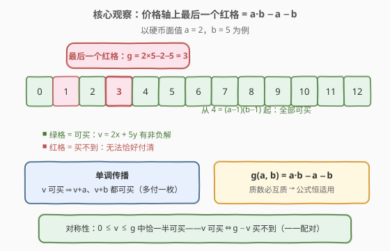
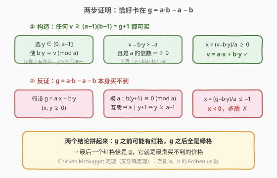
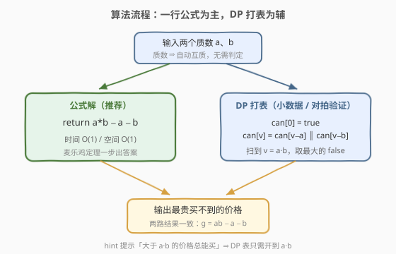
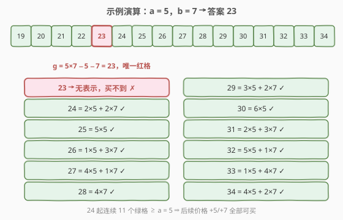

# 最贵的无法购买的商品

- **题目名称**：最贵的无法购买的商品
- **链接**：[2979. 最贵的无法购买的商品](https://leetcode.cn/problems/most-expensive-item-that-can-not-be-bought/)
- **难度**：中等
- **标签**：数学、动态规划、数论

## 1. 题目概述

> ⚠️ 本题为 LeetCode 付费题，题意描述根据官方示例用例与 hints 重建，可能与官方题面有出入。

一家商店只收两种面值的硬币：`primeOne` 元和 `primeTwo` 元，且**不找零**。一件价格为 `v` 的商品是**可购买**的，当且仅当存在非负整数 $x, y$ 使得

$$v = x \cdot \text{primeOne} + y \cdot \text{primeTwo}$$

即你能用恰好 $x$ 枚 `primeOne` 元硬币与 $y$ 枚 `primeTwo` 元硬币正好付清。返回**最贵的不可购买**的价格（题目保证存在）。

**示例 1**：

```text
输入：primeOne = 2, primeTwo = 5
输出：3
解释：1、3 无法恰好付清；4 = 2+2、5、6 = 2×3、7 = 2+5……从 4 起全部可买，
最贵买不到的价格是 3。
```

**示例 2**：

```text
输入：primeOne = 5, primeTwo = 7
输出：23
解释：23 无法写成 5x + 7y；24 = 5×2 + 7×2 起更大的价格全部可买。
```

**约束条件**（按官方 hints 推断）：

- $2 \le \text{primeOne}, \text{primeTwo} \le 10^5$
- `primeOne`、`primeTwo` 均为质数（且互不相同）

> 💡 读题先定性：这是数论里经典的 **Frobenius 问题**（硬币问题）在 $n=2$ 时的特例——两个互质面值下，求**最大的不可表示数**。官方 hints 也直接点破了三条路：① 大于 $a \cdot b$ 的价格总能买到；② 可买性可以沿 $+a$、$+b$ 单调传播（DP 的由来）；③ 存在 $O(1)$ 公式解，即 Chicken McNugget 定理（麦乐鸡定理）。

---

## 2. 解题思路

### 2.1 暴力思路：逐个价格试表示

最朴素的做法：hint ① 告诉我们大于 $a \cdot b$ 的价格必然可买，于是只需在 $[1, a\cdot b]$ 范围内**从大到小**枚举价格 $v$，对每个 $v$ 枚举 $y$（或直接枚举 $x$），检查是否存在 $v = ax + by$ 的非负解：

```python
def mostExpensiveItemBrute(a: int, b: int) -> int:
    for v in range(a * b, 0, -1):          # 大于 ab 必可买，上界收到 ab
        if all((v - b * y) % a for y in range(v // b + 1)):
            return v                        # 第一个找不到表示的即答案
    return -1
```

单个 $v$ 的检查是 $O(v/b)$，整体 $O(ab \cdot a)$ 量级。当 $a, b \le 100$ 时勉强能跑，但 $a, b$ 达到 $10^4 \sim 10^5$ 时 $a \cdot b$ 就是 $10^8 \sim 10^{10}$，直接爆掉。暴力只配当**对拍工具**，正解必须利用数论结构。

顺带一提，hint ② 给出的单调性——$v$ 可买 $\Rightarrow$ $v+a$、$v+b$ 可买——正是把「逐个检查」升级为「DP 打表」的钥匙，也是 2.2 中证明的支柱。

### 2.2 核心观察：麦乐鸡定理 $g(a,b) = ab - a - b$



把价格轴涂色：可买为绿、不可买为红。以 $a=2, b=5$ 为例，红格只有 $1, 3$，从 $4$ 起一路全绿。**最大的红格**就是答案，它有封闭公式：

$$\boxed{\ g(a, b) = a \cdot b - a - b\ }$$

这就是 **Chicken McNugget 定理**（麦乐鸡定理）：两个**互质**正整数 $a, b$ 的 Frobenius 数为 $ab - a - b$；所有大于它的整数都能写成 $ax + by\ (x,y \ge 0)$，它本身则不能。本题输入两个**质数**，质数彼此必然互质，公式无条件适用。

为什么恰好卡在 $ab - a - b$？两步就能证完：



**第一步（构造，上界）**：任何 $v \ge (a-1)(b-1) = ab - a - b + 1$ 都可买。

- 由 $\gcd(a, b) = 1$，$b$ 在模 $a$ 意义下有逆元，故存在**唯一**的 $y \in [0, a-1]$ 使 $b y \equiv v \pmod a$；
- 考察 $v - by$：它是 $a$ 的倍数，且 $v - by \ge (a-1)(b-1) - b(a-1) = -(a-1) > -a$。一个大于 $-a$ 的 $a$ 的倍数必然 $\ge 0$；
- 于是 $x = (v - by)/a \ge 0$，$v = ax + by$ 成立。$\blacksquare$

> 💡 直觉读法：把价格按**模 $a$ 的余数**分成 $a$ 类，每类里 $b, 2b, \dots$ 逐级「垫底」，再加若干个 $a$ 抬高。$y$ 只需在 $0 \sim a-1$ 里取就足以覆盖所有余数，而 $y \le a-1$ 保证了垫底消耗 $by \le ab - b$ 不会太贵——这就是上界 $(a-1)(b-1)$ 的来源。

**第二步（反证，下界）**：$g = ab - a - b$ 本身不可买。

- 假设 $g = ax + by$，$x, y \ge 0$。两边模 $a$：$by \equiv -b \pmod a$，即 $b(y+1) \equiv 0 \pmod a$；
- 由互质得 $a \mid y+1$，故 $y \ge a - 1$；
- 代回：$ax = ab - a - b - by \le ab - a - b - b(a-1) = -a < 0$，与 $x \ge 0$ 矛盾。$\blacksquare$

两步合起来：$g$ 之后全是绿格、$g$ 本身是红格 ⇒ **$g$ 就是最后一个红格**，即最贵买不到的价格。

### 2.3 算法流程图



**完整步骤（公式解，主路）**：

1. 读入两个质数 $a, b$（质数 ⇒ 互质，无需额外判定）；
2. 直接返回 $a \cdot b - a - b$。

**备用路（DP 打表，hint ③，适合小数据或对拍验证公式）**：

1. 由 hint ①，大于 $ab$ 的价格必可买，开布尔数组 `can[0..ab]`，`can[0] = true`（0 元 = 什么都不买）；
2. 递推 `can[v] = can[v-a] || can[v-b]`（$v \ge a$ / $v \ge b$ 时）；
3. 记录**最后一个 `can[v] == false` 的 $v$**，即为答案。

> ⚠️ DP 表的上界必须开到 $a \cdot b$ 而不是 $g = ab-a-b$：$g$ 只是答案本身，若只扫到某个更小的界（比如 $a+b$），会漏掉后面还没转绿的红格；扫到 $ab$ 则保证覆盖，且最后一个 false 恰好落在 $g$ 处。

### 2.4 示例演算



以 $a = 5, b = 7$（示例 2）为例，公式给出 $g = 35 - 5 - 7 = 23$。下面手工验证 23 附近的价格：

| 价格 $v$ | 表示 $5x + 7y$ | 状态 |
|----------|----------------|------|
| 19 | $5 + 2 \times 7$ | ✓ 可买 |
| 20 | $4 \times 5$ | ✓ 可买 |
| 21 | $3 \times 7$ | ✓ 可买 |
| 22 | $2 \times 5 + 2 \times 7$ | ✓ 可买 |
| **23** | **无表示** | **✗ 买不到** |
| 24 | $2 \times 5 + 2 \times 7$ | ✓ 可买 |
| 25 | $5 \times 5$ | ✓ 可买 |
| 26 | $5 + 3 \times 7$ | ✓ 可买 |
| 27 | $4 \times 5 + 7$ | ✓ 可买 |
| 28 | $4 \times 7$ | ✓ 可买 |
| 29 | $3 \times 5 + 2 \times 7$ | ✓ 可买 |
| 30 | $6 \times 5$ | ✓ 可买 |
| 31 | $2 \times 5 + 3 \times 7$ | ✓ 可买 |
| 32 | $5 \times 5 + 7$ | ✓ 可买 |
| 33 | $5 + 4 \times 7$ | ✓ 可买 |
| 34 | $4 \times 5 + 2 \times 7$ | ✓ 可买 |

23 的不可表示性也可以直接枚举：$y = 0,1,2,3$ 时 $23 - 7y = 23, 16, 9, 2$，没有一个是 5 的倍数。而 24 起连续 $a = 5$ 个绿格，之后每个价格都能由这 5 个「绿格种子」加若干个 5 得到——这正呼应了构造证明里的余数分类思想。示例 1 同理：$g = 10 - 2 - 5 = 3$ ✓。

---

## 3. 参考代码

### C++

```cpp
class Solution {
  public:
    int mostExpensiveItem(int primeOne, int primeTwo) {
        // Chicken McNugget 定理：互质 a、b 的 Frobenius 数
        return primeOne * primeTwo - primeOne - primeTwo;
    }
};
```

### Python

```python
class Solution:
    def mostExpensiveItem(self, primeOne: int, primeTwo: int) -> int:
        # Chicken McNugget 定理：互质 a、b 的 Frobenius 数
        return primeOne * primeTwo - primeOne - primeTwo
```

附 DP 打表版（$O(ab)$，用于小数据求解或验证公式，与上式对拍结果完全一致）：

```python
def most_expensive_item_dp(a: int, b: int) -> int:
    can = [False] * (a * b + 1)
    can[0] = True
    ans = -1
    for v in range(1, a * b + 1):
        if v >= a:
            can[v] = can[v] or can[v - a]
        if v >= b:
            can[v] = can[v] or can[v - b]
        if not can[v]:
            ans = v          # 最后一次出现 false 的位置
    return ans
```

> 💡 语言细节：$a, b \le 10^5$ 时 $ab \le 10^{10}$，C++ 中 `int` 会溢出，必须依赖 `long long` 参与运算（两个 `int` 相乘先溢出再赋值就晚了——所幸题面函数签名通常返回 `int`，说明实际数据范围不会让 $ab - a - b$ 超过 `int`，但写成 `1LL * primeOne * primeTwo - ...` 更稳妥）；Python 原生大整数无此顾虑。

---

## 4. 复杂度分析

| 维度 | 复杂度 | 说明 |
|------|--------|------|
| 时间复杂度 | $O(1)$ | 一次乘法两次减法；无需循环 |
| 空间复杂度 | $O(1)$ | 只用常数个变量 |

对照：暴力逐价检查 $O(ab \cdot a)$；DP 打表 $O(ab)$ 时间与空间——当 $a, b \sim 10^5$ 时 $ab \sim 10^{10}$，DP 同样不可行，公式解是大数据下唯一的路。这正是本题把两个数定为**质数**的深意：既保证互质（公式成立的前提），又把问题限制在 $n = 2$（$n \ge 3$ 时无简单公式）。

---

## 5. 扩展：从两个硬币到更多

**① 不互质会怎样？** 若 $\gcd(a, b) = d > 1$，则只有 $d$ 的倍数才可能被表示，**不可表示数有无穷多个**，「最大的不可表示数」根本不存在。互质（本题的质数条件）不只是公式成立的条件，而是问题本身良定义的前提。

**② 恰一半买得到（对称性）。** 在 $[0, g]$ 内，$v$ 可买 $\Leftrightarrow$ $g - v$ 不可买——两个方向的反证都与第二步同构。因此 $0 \sim g$ 共 $g + 1 = (a-1)(b-1)$ 个价格中**恰好一半可买**。以 $a=5, b=7$ 为例：$[0, 23]$ 共 24 个价格，可买的恰有 12 个。

**③ 三个及以上面值（一般 Frobenius 问题）。** $n \ge 3$ 时不存在封闭公式，判定「求给定 $n$ 个互质数的 Frobenius 数」是 **NP-hard**；实践中只能 DP 打表（值域受限时）或用数论近似。面试中若被追问「三枚硬币怎么办」，正确回答是：**放弃公式，回到 hint ② 的可达性 DP**（`can[v] = ∃c can[v−c]`），这恰好是完全背包的可达性版本。

**④ 定理名字的来历。** Chicken McNugget 定理得名于麦当劳麦乐鸡早期的 9 块与 20 块装：两种包装下买不到的最大块数是 $9 \times 20 - 9 - 20 = 151$。同款结论在数学界叫 **Frobenius 数** $g(a, b)$，在找零/邮资/装箱问题中反复出现。

---

## 6. 面试要点

1. **为什么答案是 $ab - a - b$？给出证明骨架。**

   - 上界（构造）：对 $v \ge (a-1)(b-1)$，用 $b$ 模 $a$ 的逆元取唯一 $y \in [0, a-1]$ 使 $by \equiv v \pmod a$，则 $v - by$ 是大于 $-a$ 的 $a$ 倍数 ⇒ 非负，$x = (v-by)/a$ 即非负解
   - 下界（反证）：若 $g = ax + by$，模 $a$ 推出 $y \ge a-1$，代回得 $x < 0$，矛盾

2. **为什么必须互质？质数条件起了什么作用？**

   - 不互质时不可表示数有无穷多个，答案不存在；质数两两互质，是「公式适用 + 问题良定义」的双重保证
   - 面值是一般互质数（非质数）时公式同样成立，质数只是互质的充分条件

3. **DP 打表的上界为什么开到 $a \cdot b$？复杂度多少？**

   - hint ① 保证大于 $ab$ 全可买，故最后一个 false 必在 $[1, ab]$ 内；开小了会漏，开大了浪费
   - $O(ab)$ 时间与空间，$a, b$ 上千后即不可行——它是「能想出公式前的保底解」与「验证公式的对拍器」

4. **把「最贵买不到」改成「买不到的价格有多少个」，怎么答？**

   - 由对称性，$[0, g]$ 内恰一半可买 ⇒ 不可买的价格共 $(g+1)/2 = (a-1)(b-1)/2$ 个
   - 追问证明：$v$ 可买 $\Leftrightarrow$ $g - v$ 不可买，构成双射

5. **这题和零钱兑换（322）是什么关系？**

   - 同属「线性组合可表示性」家族，但方向相反：322 是**给定金额求最少硬币数**（最优化 DP），本题是**给定硬币面值求最大不可表示金额**（数论封闭解）
   - 322 的面值不需要互质，本题的互质条件换来的是 $O(1)$ 公式——约束越强，解越巧

> 💡 **一句话总结**：两个互质面值 $a, b$ 下，最贵买不到的价格就是 Frobenius 数 $ab - a - b$；构造证明靠「模 $a$ 余数分类 + $b$ 垫底」，反证靠「模 $a$ 逼出 $y \ge a-1$」。一行公式，$O(1)$ 出答案。

---

## 7. 同类练习题

- [322. 零钱兑换](https://leetcode.cn/problems/coin-change/)（[题解](../0301-0400/322_零钱兑换.md)）：同款「硬币线性组合」的完全背包 DP——求给定金额的最少硬币数，与本题「求最大不可表示金额」互为镜像
- [2952. 需要添加的硬币的最小数量](https://leetcode.cn/problems/minimum-number-of-coins-to-be-added/)（[题解](../2901-3000/2952_需要添加的硬币的最小数量.md)）：补硬币使**所有目标金额都变得可表示**——可表示性从「找缺口」翻转为「填缺口」
- [365. 水壶问题](https://leetcode.cn/problems/water-and-jug-problem/)（[题解](../0301-0400/365_水壶问题.md)）：判定 $ax + by = z$ 是否有解的数论题（裴蜀定理），本题可视为它「求最大无解值」的进阶
- [983. 最低票价](https://leetcode.cn/problems/minimum-cost-for-tickets/)（[题解](../0901-1000/983_最低票价.md)）：按天决策的完全背包可达性 DP，练习 hint ② 「沿转移边传播」的递推手感
- [279. 完全平方数](https://leetcode.cn/problems/perfect-squares/)：另一道「可表示性 + 最少拆分数」的完全背包经典，与本题共享「面值组合」的世界观
