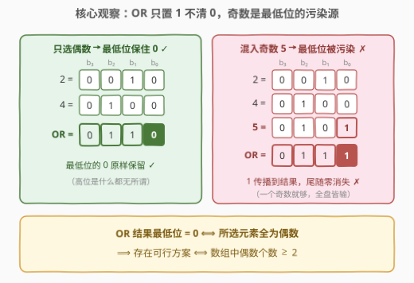
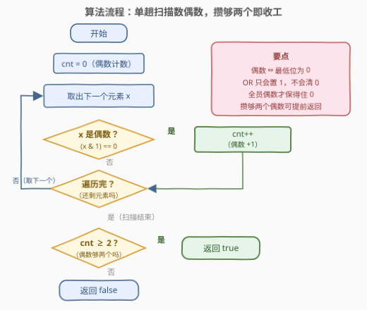
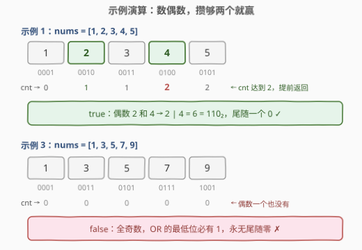

# 检查按位或是否存在尾随零

- **题目名称**：检查按位或是否存在尾随零
- **链接**：[2980. 检查按位或是否存在尾随零](https://leetcode.cn/problems/check-if-bitwise-or-has-trailing-zeros/)
- **难度**：简单
- **标签**：位运算、数组

## 1. 题目概述

给你一个**正整数**数组 `nums`。你需要检查是否可以从数组中选出**两个或更多**元素，满足这些元素的按位或运算（`OR`）结果的二进制表示中**至少**存在一个尾随零。

例如，数字 `5` 的二进制表示是 `"101"`，不存在尾随零，而数字 `4` 的二进制表示是 `"100"`，存在两个尾随零。

如果可以选择两个或更多元素，其按位或运算结果存在尾随零，返回 `true`；否则，返回 `false`。

**示例 1**：

```text
输入：nums = [1,2,3,4,5]
输出：true
解释：如果选择元素 2 和 4，按位或运算结果是 6，二进制表示为 "110"，存在一个尾随零。
```

**示例 2**：

```text
输入：nums = [2,4,8,16]
输出：true
解释：如果选择元素 2 和 4，按位或运算结果是 6，二进制表示为 "110"，存在一个尾随零。
其他存在尾随零的选择方案包括：(2, 8), (2, 16), (4, 8), (4, 16), (8, 16),
(2, 4, 8), (2, 4, 16), (2, 8, 16), (4, 8, 16), 以及 (2, 4, 8, 16)。
```

**示例 3**：

```text
输入：nums = [1,3,5,7,9]
输出：false
解释：不存在按位或运算结果存在尾随零的选择方案。
```

**约束条件**：

- $2 \le \text{nums.length} \le 100$
- $1 \le \text{nums}[i] \le 100$

> 💡 本题核心是「**OR 的单调性 + 最低位聚焦**」：按位或只会把 1 越或越多、绝不会把 1 或成 0，所以 OR 结果的最低位能否保住 0，完全取决于**所选元素里有没有奇数这个"污染源"**。问题瞬间从「枚举子集」坍缩成「数偶数」。

---

## 2. 解题思路

### 2.1 暴力思路：枚举元素对

题目要求选「两个或更多」元素，最朴素的想法是枚举所有大小 $\ge 2$ 的子集——但子集有 $2^n$ 个（$n = 100$ 时约 $10^{30}$），直接爆炸。

退一步，先只枚举**所有二元组** $(i, j)$，检查 $\text{nums}[i] \,|\, \text{nums}[j]$ 是否为偶数：

```text
for i in 0..n-1:
    for j in i+1..n-1:
        if ((nums[i] | nums[j]) & 1) == 0:   # OR 结果最低位为 0
            return true
return false
```

时间 $O(n^2)$，$n \le 100$ 时最多 $\binom{100}{2} = 4950$ 次检查，轻松通过。**但这个"暴力"其实一步就跳到了最优的判定形式上**——它隐含了一个关键命题：*如果任何可行方案存在，那么必存在一个只含两个元素的可行方案*（证明见 2.2 观察 3）。而判定本身还能再压缩：几个数的 OR 是不是偶数，根本不用算 OR，看每个数的最低位就够了。

### 2.2 核心观察：OR 只置 1 不清 0，奇数是污染源



**观察 1（尾随零 ⟺ 最低位为 0 ⟺ 偶数）**：尾随零是从最低位开始数连续 0 的个数。题目只要求"**至少一个**"，于是条件等价于**最低位（第 0 位）为 0**，也就是 **OR 结果是偶数**：

$$\text{OR 结果存在尾随零} \iff \text{OR 结果的第 0 位} = 0 \iff \text{OR 结果为偶数}$$

**观察 2（OR 的单调性）**：按位或的真值表是 $0|0=0$、$0|1=1$、$1|1=1$——**1 只会被传播，永远不会被清除**。所以：

$$\text{OR 结果的第 0 位} = 0 \iff \text{所选每个元素的第 0 位都是 0} \iff \text{所选元素全为偶数}$$

只要混进**一个**奇数，最低位立刻被 1 "污染"，尾随零归零；反之只要全员偶数，最低位的 0 就安然无恙（更高位是什么都无所谓）。

**观察 3（二元充分性）**：若某个大小 $\ge 2$ 的方案 $S$ 可行，由观察 2 知 $S$ 中**所有元素都是偶数**；从中任取两个组成的子方案依然全偶、依然可行。因此：

$$\text{存在可行方案} \iff \text{存在可行二元组} \iff \text{数组中偶数个数} \ge 2$$

三条观察合流，算法只剩一句话：**数一遍数组里的偶数个数，$\ge 2$ 返回 true**。

> 💡 这正是官方提示 "Bitwise OR can never unset a bit. If there is a solution, there must be a solution with only a pair of elements" 的完整推理链：单调性 → 全偶充要 → 二元充分 → 计数判定。

### 2.3 算法流程图



**完整步骤**：

1. **初始化**：偶数计数器 `cnt = 0`。
2. **单趟扫描**：遍历每个 $x \in \text{nums}$，若 `x & 1 == 0`（偶数），`cnt++`；攒够两个可立即返回 `true`（提前终止）。
3. **收尾**：扫描结束仍不足两个偶数，返回 `false`。

> 💡 流程的不变式：**任何时刻 `cnt` = 已扫描前缀的偶数个数**。判定只依赖这一个统计量——"选哪些、选几个、高位是什么"统统不影响答案，问题被彻底降维成一次奇偶计数。

### 2.4 示例演算

以示例 1 `nums = [1,2,3,4,5]` 与示例 3 `nums = [1,3,5,7,9]` 为例：



**示例 1**：

| $x$ | 二进制 | 奇偶 | cnt（更新后） |
|-----|--------|------|---------------|
| 1 | $0001_2$ | 奇 | 0 |
| 2 | $0010_2$ | **偶** | 1 |
| 3 | $0011_2$ | 奇 | 1 |
| 4 | $0100_2$ | **偶** | **2** |
| 5 | $0101_2$ | 奇 | 2 |

扫描到 4 时 `cnt` 达到 2，可提前终止返回 `true`——验证：$2 \,|\, 4 = 6 = 110_2$，尾随一个 0 ✓。

**示例 3**：$1, 3, 5, 7, 9$ 全是奇数，`cnt` 始终为 0，返回 `false`——五个数最低位全是 1，无论怎么选，OR 的最低位必为 1，不可能有尾随零。

---

## 3. 参考代码

### C++

```cpp
class Solution {
public:
    bool hasTrailingZeros(vector<int>& nums) {
        int cnt = 0;                              // 偶数计数器
        for (int x : nums)
            if ((x & 1) == 0 && ++cnt >= 2)       // x 是偶数则计数，攒够两个
                return true;                      // 提前收工
        return false;                             // 偶数不足两个
    }
};
```

### Python

```python
class Solution:
    def hasTrailingZeros(self, nums: List[int]) -> bool:
        cnt = 0
        for x in nums:
            if x & 1 == 0:                # 偶数：最低位为 0
                cnt += 1
                if cnt == 2:              # 攒够两个偶数
                    return True
        return False
```

> 💡 Python 也可以一行 `return sum(x % 2 == 0 for x in nums) >= 2`，语义更贴近观察 3；上面的写法则保留了「攒够即停」的提前终止。两版等价，任选其一。

---

## 4. 复杂度分析

| 维度 | 复杂度 | 说明 |
|------|--------|------|
| **时间复杂度** | $O(n)$ | 单趟扫描，每个元素一次 `x & 1` 判定；提前终止时更短 |
| **空间复杂度** | $O(1)$ | 只用 `cnt` 一个计数器 |

> ⚠️ $O(n)$ 已是下界：最坏情况下（偶数不足两个）每个元素都必须被检查一次奇偶性，任何正确算法都躲不开读完全部输入。2.1 的 $O(n^2)$ 枚举虽然也能过，但白白重复了对同一元素的奇偶判定——$(i,j)$ 与 $(i,k)$ 两对中，$i$ 的最低位被看了两遍。

---

## 5. 扩展：推广与对偶

**推广 1（至少 $k$ 个尾随零）**：OR 结果的低 $k$ 位全为 0，当且仅当所选**每个**元素的低 $k$ 位全为 0，即每个元素都是 $2^k$ 的倍数（判定：`x & ((1 << k) - 1) == 0`）。于是答案仍是数个数——数组中 $2^k$ 的倍数 $\ge 2$ 个。$k = 1$ 退化为本题，逻辑零改动，只换一个掩码。

**推广 2（对偶：AND 版本）**：若把 OR 换成 AND，语义恰好反转——AND 逐位取"全员为 1 才为 1"，最低位为 0 只需**一个**偶数混入即可。所以「AND 结果存在尾随零」$\iff$ 数组中至少有 1 个偶数（再任选一个别的元素凑够两个）。OR 要"全员偶"、AND 只要"一人偶"，一全称一存在，正好是一对对偶判定。

> 💡 更大的家族图景：[2917. 找出数组中的 K-or 值](2917_找出数组中的K-or值.md) 把 OR 推广成「按位投票」（第 $i$ 位至少 $k$ 票才点亮），本题则抓住 OR「只置 1 不清 0」的单调性做低位分析——同一枚硬币的两面：一个问"哪些位会被点亮"，一个问"哪个位永远点不亮"。

---

## 6. 面试要点

1. **为什么不用枚举子集？「两个元素就够」怎么证明？**

   - 核心是 OR 的单调性：方案可行的充要条件是"所选元素全为偶数"。全偶集合的任何 $\ge 2$ 元子集依然全偶、依然可行，因此"存在可行方案" $\iff$ "存在可行二元组" $\iff$ "偶数个数 $\ge 2$"。证必要性可直接反证：偶数不足两个时，任何 $\ge 2$ 元的选择必含奇数，最低位被污染，必不可行。

2. **「至少一个尾随零」为什么等价于「结果是偶数」？如果要求恰好一个呢？**

   - 尾随零从最低位起数，"至少一个" $\iff$ 最低位为 0 $\iff$ 偶数。若改成"恰好一个"，还需第 1 位为 1（判定变成 `(OR & 3) == 2`），从"看一位"变成"看两位"，但思路不变：盯住 OR 结果的低位，翻译成对所选元素的逐位约束。

3. **`x % 2 == 0` 与 `(x & 1) == 0` 用哪个？**

   - 非负整数域两者完全等价，位运算是算法圈的惯用写法。坑在**负数**：C++/Java 中 $(-3) \bmod 2 = -1$（向零取整），判奇要写 `x % 2 != 0` 而非 `== 1`；而补码下 `x & 1` 对负奇数恒得 1，跨语言语义更稳。本题约束 $1 \le \text{nums}[i] \le 100$，无此顾虑，但面试值得主动点出。

4. **把 OR 换成 XOR，答案怎么变？**

   - XOR 的最低位是所选元素最低位的**奇偶校验**：所选奇数个数为偶则为 0。于是「存在 $\ge 2$ 元子集 XOR 结果为偶」$\iff$ 有两个偶数（选它们）**或**有两个奇数（两个奇数最低位 $1 \oplus 1 = 0$）。答案 = 偶数个数 $\ge 2$ **或** 奇数个数 $\ge 2$，仅当 $n = 2$ 且恰好一奇一偶时为 false。OR/AND/XOR 三种运算各有一套低位语义，对比记忆效果最佳。

5. **本题和 2917（K-or）是什么关系？**

   - 同属"按位 OR 语义分析"家族。2917 问"每个位被多少元素点亮"（按位投票计数，逐位独立），本题问"最低位为什么点不亮"（单调性 + 全称约束）。两题合看，能把 OR 的两条基本性质——**逐位独立**、**只增不减**——一次吃透。

> 💡 **一句话总结**：2980 是"OR 单调性"的签到招牌题——1 只会被传播不会被清除，OR 结果最低位保住 0 当且仅当所选元素全为偶数；于是「选 $\ge 2$ 个元素使 OR 有尾随零」$\iff$「数组里至少有两个偶数」，一次奇偶计数收工。

---

## 7. 同类练习题

- [191. 位 1 的个数](https://leetcode.cn/problems/number-of-1-bits/)：`x & 1` 取最低位的母题，逐位统计基本功
- [231. 2 的幂](https://leetcode.cn/problems/power-of-two/)：`n & (n-1)` 探查低位结构的经典技巧，与本题"只盯最低位"一脉相承
- [2917. 找出数组中的 K-or 值](https://leetcode.cn/problems/find-the-k-or-of-an-array/)：OR 的按位投票推广，与本题互为 OR 两条基本性质的一体两面
- [2595. 奇偶位数](https://leetcode.cn/problems/number-of-even-and-odd-bits/)：同为「奇偶 × 位运算」签到题，数的是下标的偶位/奇位置位个数
- [2859. 计算 K 置位下标对应元素的和](https://leetcode.cn/problems/sum-of-values-at-indices-with-k-set-bits/)：popcount 判定的直接应用，位计数家族近邻
