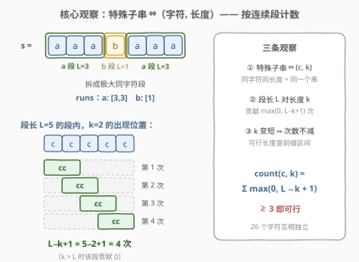
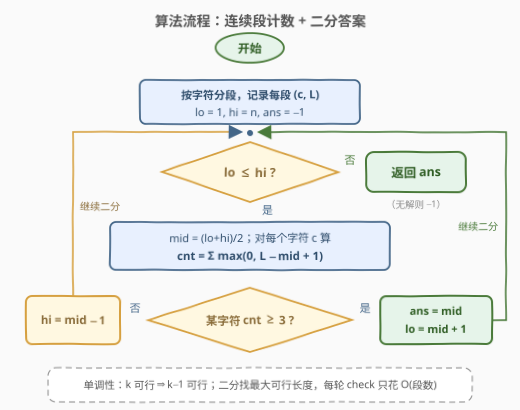
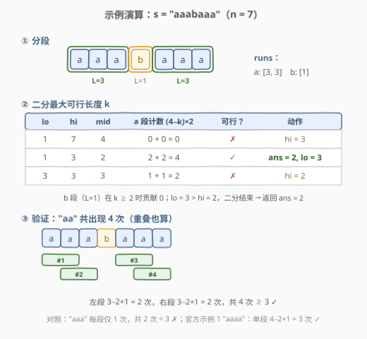

# 找出出现至少三次的最长特殊子字符串 I

- **题目名称**：找出出现至少三次的最长特殊子字符串 I
- **链接**：[2981. 找出出现至少三次的最长特殊子字符串 I](https://leetcode.cn/problems/find-longest-special-substring-that-occurs-thrice-i/)
- **难度**：中等
- **标签**：哈希表、字符串、二分查找、计数、滑动窗口

## 1. 题目概述

给你一个仅由小写英文字母组成的字符串 `s`。

如果一个字符串仅由单一字符组成，那么它被称为 **特殊** 字符串。例如，字符串 `"abc"` 不是特殊字符串，而字符串 `"ddd"`、`"zz"` 和 `"f"` 是特殊字符串。

返回在 `s` 中出现 **至少三次** 的 **最长特殊子字符串** 的长度，如果不存在出现至少三次的特殊子字符串，则返回 `-1`。

**子字符串** 是字符串中的一个连续 **非空** 字符序列。

**示例 1**：

```text
输入：s = "aaaa"
输出：2
解释：出现三次的最长特殊子字符串是 "aa"：子字符串 "**aa**aa"、"a**aa**a" 和 "aa**aa**"。
可以证明最大长度是 2。
```

**示例 2**：

```text
输入：s = "abcdef"
输出：-1
解释：不存在出现至少三次的特殊子字符串。因此返回 -1。
```

**示例 3**：

```text
输入：s = "abcaba"
输出：1
解释：出现三次的最长特殊子字符串是 "a"：子字符串 "**a**bcaba"、"abc**a**ba" 和 "abcab**a**"。
可以证明最大长度是 1。
```

**约束条件**：

- $3 \le s.length \le 50$
- `s` 仅由小写英文字母组成

> 💡 读题先定性：两个关键细节。①「出现至少三次」按**出现位置**计数，**重叠也算**——示例 1 中 `"aa"` 的三次出现两两重叠；②「特殊」的限制极强：一个特殊子串由 `(字符 c, 长度 k)` **唯一确定**，整个问题从「$O(n^2)$ 个子串的计数」瞬间坍缩成「26 个字符 × $n$ 种长度」的二维计数。

---

## 2. 解题思路

### 2.1 暴力思路：把每次出现单独塞进哈希表

最直接的做法：枚举每个起点 $i$，向右扩展 $j$（只要 `s[j] == s[i]` 就继续），每个 `(i, j)` 对应一次特殊子串出现，以 `(字符, 长度)` 二元组为键累加计数。最后在计数 $\ge 3$ 的键里取最长。

```python
from collections import defaultdict

def maximumLength(s: str) -> int:
    cnt = defaultdict(int)            # (字符, 长度) -> 出现次数
    n = len(s)
    for i in range(n):
        for j in range(i, n):
            if s[j] != s[i]:
                break                 # 跨过字符边界，不再是特殊子串
            cnt[(s[i], j - i + 1)] += 1
    return max((k for (c, k), v in cnt.items() if v >= 3), default=-1)
```

- 出现次数最坏 $O(n^2)$（全同字符时），键操作 $O(1)$——$n \le 50$ 时约 $10^3$ 量级，稳过；
- 但孪生题 **2982** 把规模升到 $n \le 10^5$，$O(n^2)$ 直接超时——暴力只能算热身。

> ⚠️ 键要用 `(字符, 长度)` 二元组而非子串本身——否则构造/哈希子串还要多乘一个 $O(n)$。这其实已经在暗示：特殊子串的「身份」只由两个小整数决定。

### 2.2 核心观察：连续段计数 + 单调性 → 二分答案



三条观察把问题从「数子串」折叠成「数段 + 二分」：

1. **特殊子串 ⇔ `(字符 c, 长度 k)`**：同字符同长度的特殊子串是**同一个串**。计数对象从子串降为 26 × n 个二元组。
2. **连续段（run）贡献公式**：特殊子串不能跨字符边界。把 `s` 拆成极大同字符段，字符 `c` 的某段长为 $L$，则长度 $k$ 的特殊子串 $c^k$ 在该段内恰好出现 $\max(0,\ L-k+1)$ 次（就是滑窗起点数，$k > L$ 时为 0）。于是

$$\text{count}(c, k) \;=\; \sum_{\text{c 的各段 } L_i} \max\!\big(0,\ L_i - k + 1\big)$$

   「长度 $k$ 是否可行」= 是否存在某个字符 $c$ 使 $\text{count}(c,k) \ge 3$。单次判定只需扫一遍所有段，$O(\text{段数})$。
3. **单调性**：若 $c^k$ 出现 $\ge 3$ 次，取其中三个出现起点 $p_1 < p_2 < p_3$，则 $c^{k-1}$ 在**同样的三个起点**各出现一次（每次出现的前缀）——所以 $k$ 可行 $\Rightarrow$ $k-1$ 可行，**可行长度是一段前缀区间 $[1, K]$**。求最大可行 $k$ 就是二分答案：

$$\text{ans} = \max\{\, k \;:\; \exists\, c,\ \text{count}(c, k) \ge 3 \,\}$$

> 💡 一句话：别数子串，数**段**——每段对每个 $k$ 的贡献用公式直接算出；再靠「$k$ 越小越容易凑满 3 次」的单调性，把线性扫描换成二分。

### 2.3 算法流程图



**完整步骤**：

1. **分段**：一次线性扫描，把 `s` 拆成极大同字符段，按字符归组记录每段长度；
2. **初始化**：`lo = 1, hi = n, ans = -1`；
3. **check(mid)**：对每个字符 `c` 累加 `max(0, L − mid + 1)`，只要某个字符合计 `≥ 3` 即可行；
4. **收缩**：可行 → `ans = mid, lo = mid + 1`；不可行 → `hi = mid − 1`；
5. `lo > hi` 时结束，返回 `ans`（全程无可行长度则保持 `-1`）。

> ⚠️ `max(L − k + 1, 0)` 的截断不可省——$k$ 超过段长时该段贡献是 0 而非负数；另外二分前 `ans` 必须初始化为 `-1`，覆盖「一次都没可行过」的输入（如 `"abcdef"`）。

### 2.4 示例演算



以 `s = "aaabaaa"`（$n = 7$，官方示例之外稍复杂的多段例子）为例：分段结果 `a: [3, 3]`、`b: [1]`。

| lo | hi | mid | a 段计数 (3−k+1)×2 | 可行？ | 动作 |
|----|----|-----|--------------------|--------|------|
| 1 | 7 | 4 | 0 + 0 = 0 | ✗ | `hi = 3` |
| 1 | 3 | 2 | 2 + 2 = 4 ≥ 3 | ✓ | `ans = 2, lo = 3` |
| 3 | 3 | 3 | 1 + 1 = 2 < 3 | ✗ | `hi = 2` |

`lo = 3 > hi = 2`，二分结束，返回 **2**：`"aa"` 在左段出现 2 次、右段 2 次，共 4 次 $\ge 3$；而 `"aaa"` 两段各 1 次共 2 次，不可行。

交叉验证官方示例：`"aaaa"` 单段 $L=4$，$k=2$ 时 $4-2+1=3$ 次 ✓（答案 2）；`"abcaba"` 中 `a` 有三段 $[1,1,1]$，$k=1$ 时 $1+1+1=3$ 次 ✓（答案 1）；`"abcdef"` 每字符仅一段长 1，任何 $k$ 都凑不满 3 次（返回 -1）。

---

## 3. 参考代码

### C++

```cpp
class Solution {
  public:
    int maximumLength(string s) {
        int n = s.size();
        // 1. 按字符收集所有连续段长度
        vector<vector<int>> runs(26);
        for (int i = 0; i < n; ) {
            int j = i;
            while (j < n && s[j] == s[i]) j++;
            runs[s[i] - 'a'].push_back(j - i);
            i = j;
        }
        // 2. check(k)：是否存在某字符长度为 k 的特殊子串出现 >= 3 次
        auto check = [&](int k) {
            for (auto& rs : runs) {
                int cnt = 0;
                for (int L : rs) cnt += max(L - k + 1, 0);
                if (cnt >= 3) return true;
            }
            return false;
        };
        // 3. 二分最大可行 k（可行 => 更短也可行，单调）
        int lo = 1, hi = n, ans = -1;
        while (lo <= hi) {
            int mid = lo + (hi - lo) / 2;
            if (check(mid)) { ans = mid; lo = mid + 1; }
            else            { hi = mid - 1; }
        }
        return ans;
    }
};
```

### Python

```python
class Solution:
    def maximumLength(self, s: str) -> int:
        n = len(s)
        runs = [[] for _ in range(26)]
        i = 0
        while i < n:
            j = i
            while j < n and s[j] == s[i]:
                j += 1
            runs[ord(s[i]) - ord('a')].append(j - i)
            i = j

        def check(k: int) -> bool:
            return any(
                sum(max(L - k + 1, 0) for L in rs) >= 3
                for rs in runs
            )

        lo, hi, ans = 1, n, -1
        while lo <= hi:
            mid = (lo + hi) // 2
            if check(mid):
                ans = mid
                lo = mid + 1
            else:
                hi = mid - 1
        return ans
```

> 💡 语言细节：段长列表只建一次，二分里 `check` 只读不写；26 个字符互相独立，短路的 `any` 让命中字符即提前返回。整份代码在 2982（$n \le 10^5$）规模下原样能过。

---

## 4. 复杂度分析

| 维度 | 复杂度 | 说明 |
|------|--------|------|
| 时间复杂度 | $O(n \log n)$ | 分段 $O(n)$；二分 $O(\log n)$ 轮 × 每轮 check $O(\text{段数} + 26) \le O(n)$ |
| 空间复杂度 | $O(n)$ | 各字符的段长列表（段数 $\le n$）+ 26 个空桶 |

对照：哈希表逐出现计数 $O(n^2)$——本题 $n \le 50$ 可过，2982 的 $n \le 10^5$ 不可过；二分版对 $10^5$ 规模仍有富余（还能再降到 $O(n)$，见下节）。

---

## 5. 扩展：不二分，前三大段直接出答案（O(n)）

判定只关心「能否凑满 3 次」，而段越长贡献越多——每个字符其实只需要**最长的 3 个段**。设某字符的段长降序为 $r_1 \ge r_2 \ge r_3$，可行 $k$ 的候选只有三种凑法：

| 凑法 | 条件 | 候选 $k$ |
|------|------|----------|
| 一段连取 3 次 | $r_1 - k + 1 \ge 3$ | $r_1 - 2$ |
| 最长段 2 次 + 次长段 1 次 | $k \le r_1 - 1$ 且 $k \le r_2$ | $\min(r_1 - 1,\ r_2)$ |
| 三段各 1 次 | $k \le r_1, r_2, r_3$ | $\min(r_1, r_2, r_3)$ |

（用第 4 段起手则 $k$ 还要 $\le r_4 \le r_3$，被「三段各 1 次」支配，故前三段足够。）对 26 个字符取所有候选的最大值即为答案：

```python
class Solution:
    def maximumLength(self, s: str) -> int:
        runs = defaultdict(list)
        i, n = 0, len(s)
        while i < n:
            j = i
            while j < n and s[j] == s[i]:
                j += 1
            runs[s[i]].append(j - i)
            i = j

        ans = -1
        for rs in runs.values():
            rs.sort(reverse=True)
            cand = rs[0] - 2                                 # 一段 3 次
            if len(rs) >= 2:
                cand = max(cand, min(rs[0] - 1, rs[1]))      # 2 + 1
            if len(rs) >= 3:
                cand = max(cand, min(rs[0], rs[1], rs[2]))   # 1 + 1 + 1
            ans = max(ans, cand)
        return ans if ans > 0 else -1
```

> ⚠️ 末尾的截断不可省：$r_1 = 2$ 时候选 $r_1 - 2 = 0$、$r_1 = r_2 = 1$ 时候选 $\min(r_1-1, r_2) = 0$——这些是「凑法本身不可行」的信号（合法长度至少为 1），不是答案 0，必须回落到 `-1`。这是公式法最容易翻车的边界。

> 💡 推广到「至少出现 $m$ 次」：同理只需每个字符的前 $m$ 大段，枚举「$j$ 段凑 $m$ 次」（$j = 1 \dots m$）取最大候选；或者干脆保留本文的二分框架，把 `check` 里的 `>= 3` 改成 `>= m`——工程上后者更不容易写错。

---

## 6. 面试要点

1. **「出现至少三次」怎么计数？重叠算不算？**

   - 按**出现位置**计数、重叠也算。示例 1 `"aaaa"` 的 `"aa"` 在下标 0/1/2 出现，两两重叠，正是答案 2 的来源；若规定不许重叠，问题会完全变样（也更难）。

2. **二分的单调性怎么证明？**

   - 若 $c^k$ 在起点 $p_1 < p_2 < p_3$ 各出现一次，则 $c^{k-1}$ 在相同三个起点各出现一次（每次出现的前缀）。故可行长度构成前缀区间 $[1, K]$，二分找右端点 $K$。

3. **为什么按段计数，而不是枚举子串？**

   - 特殊子串不能跨字符边界，长度 $L$ 的段对长度 $k$ 的贡献恒为 $\max(0, L-k+1)$——一个公式替代整段枚举，`check` 从 $O(n^2)$ 降到 $O(\text{段数})$。

4. **$n \le 50$ 暴力就能过，为什么还写 $O(n \log n)$ / $O(n)$？**

   - 孪生题 2982 把 $n$ 升到 $10^5$，「数据放大 2000 倍怎么办」也是面试标配追问。段计数 + 二分、前三大段公式都能无缝迁移。

5. **前三大段的三个候选分别对应什么？**

   - $r_1 - 2$：一段连取 3 次；$\min(r_1-1, r_2)$：最长段 2 次 + 次长段 1 次；$\min(r_1, r_2, r_3)$：三段各 1 次。第 4 长及以后的段只会压小 $k$，不可能提供更大的候选
   - 候选 $\le 0$ 表示该凑法不可行（合法长度至少为 1），最终要截断回 $-1$——$r_1 = 2$ 或 $r_1 = r_2 = 1$ 时最容易踩坑。

> 💡 **一句话总结**：特殊子串 = (字符, 长度) 二元组 → 按连续段贡献计数 $\text{count}(c,k)=\sum \max(0, L_i-k+1)$ → 可行长度是前缀区间 → 二分（或前三大段公式）收口，$O(n \log n)$ 乃至 $O(n)$。

---

## 7. 同类练习题

- [2982. 找出出现至少三次的最长特殊子字符串 II](https://leetcode.cn/problems/find-longest-special-substring-that-occurs-thrice-ii/)：同题面、$n \le 10^5$——本文的段计数 + 二分（或前三大段公式）代码原样通过
- [467. 环绕字符串中唯一的子字符串](https://leetcode.cn/problems/unique-substrings-in-wraparound-string/)（[题解](../0401-0500/467_环绕字符串中唯一的子字符串.md)）：同为「连续段决定子串贡献」的计数套路，统计的是本质不同子串数
- [1446. 连续字符](https://leetcode.cn/problems/consecutive-characters/)（[题解](../1401-1500/1446_连续字符.md)）：连续段（run）分解的入门题——求最长单字符段
- [875. 爱吃香蕉的珂珂](https://leetcode.cn/problems/koko-eating-bananas/)（[题解](../0801-0900/875_爱吃香蕉的珂珂.md)）：二分答案 + O(n) 验证的经典模板，与本文 `check` 的写法同构
- [424. 替换后的最长重复字符](https://leetcode.cn/problems/longest-repeating-character-replacement/)（[题解](../0401-0500/424_替换后的最长重复字符.md)）：单字符连续段的另一经典考法——窗口内允许 k 次替换求最长重复段
