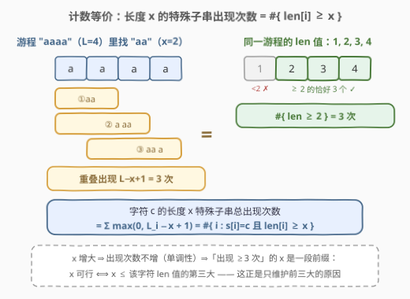
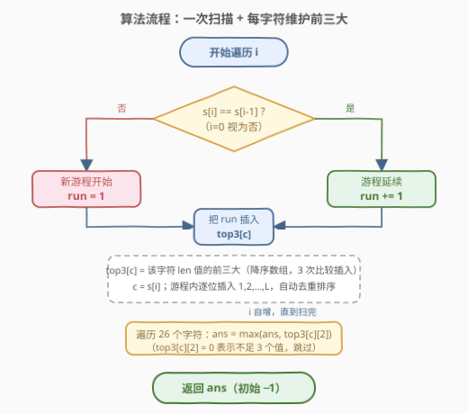
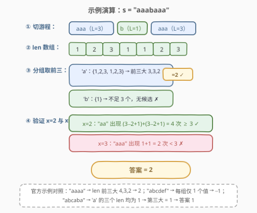

# LeetCode 找出出现至少三次的最长特殊子字符串 II 题解

## 1. 题目概述

- **标题 / 题号**：找出出现至少三次的最长特殊子字符串 II（#2982，medium）
- **链接**：https://leetcode.cn/problems/find-longest-special-substring-that-occurs-thrice-ii/
- **难度**：中等
- **标签**：哈希表、字符串、二分查找、计数、滑动窗口

**题意**：给你一个仅由小写英文字母组成的字符串 $s$。

如果一个字符串**仅由单一字符组成**，那么它被称为**特殊**字符串。例如 `"abc"` 不是特殊字符串，而 `"ddd"`、`"zz"`、`"f"` 是特殊字符串。

返回在 $s$ 中**出现至少三次**的**最长特殊子字符串**的长度；不存在则返回 $-1$。

**子字符串**是字符串中一个连续**非空**字符序列（出现次数按可重叠的方式统计）。

**示例 1**：

```text
输入：s = "aaaa"
输出：2
解释：出现三次的最长特殊子字符串是 "aa"："aa"aa、"a"aa"a" 和 "aa"aa"（重叠计数）。
```

**示例 2**：

```text
输入：s = "abcdef"
输出：-1
解释：不存在出现至少三次的特殊子字符串。
```

**示例 3**：

```text
输入：s = "abcaba"
输出：1
解释：出现三次的最长特殊子字符串是 "a"："a"bcaba、abc"a"ba、abcab"a"。
```

**约束**：

- $3 \le s.length \le 5 \times 10^5$
- $s$ 仅由小写英文字母组成。

> 💡 读题先抓规模信号：这是 [2981. 找出出现至少三次的最长特殊子字符串 I](https://leetcode.cn/problems/find-longest-special-substring-that-occurs-thrice-i/) 的数据加强版（I 版 $n \le 50$，II 版 $n \le 5 \times 10^5$）——出题人在明示「暴力哈希计数在 I 版甜区、II 版必须换范式」。另外注意**重叠计数**：示例 1 里 `"aa"` 在 `"aaaa"` 中算 3 次，这是本题计数的关键细节。

## 2. 解题思路

### 2.1 暴力思路：枚举全部特殊子字符串

最直接的做法：枚举 $s$ 的所有子字符串（或只枚举同字符段内的 $O(n^2)$ 个特殊子字符串），用哈希表对 `(字符, 长度)` 计数，最后取计数 $\ge 3$ 的最大长度。

- I 版（$n \le 50$）：子字符串总数 $O(n^2) = 2500$，随便过；
- II 版（$n = 5 \times 10^5$）：$O(n^2) \approx 2.5 \times 10^{11}$，且哈希表最多存 $O(n^2)$ 个键——时间和空间双双爆炸。

> ⚠️ 死结在于**枚举对象是「子字符串」**。特殊子字符串只由「字符 + 长度」两个量刻画（$c$ 重复 $x$ 次记作 $c^x$），而合法组合只有 $26 \times n$ 种——把搜索空间从 $O(n^2)$ 个子串压缩到 $O(n)$ 个「(字符， 长度)」状态，再想清楚每个状态的出现次数怎么 $O(1)$ 算出来。

### 2.2 核心观察：len[i] + 计数等价 + 每字符前三大

![核心概念：len[i] 与按字符分组取前三大](../images/p2982_runs_len_concept.svg)

**第一步：定义 len[i]。** 令 $len[i]$ 为**以 $i$ 结尾的最长特殊后缀**的长度：

$$len[i] = \begin{cases} len[i-1] + 1, & s[i] = s[i-1] \\ 1, & \text{否则} \end{cases}$$

一个长度为 $L$ 的极大同字符段（**游程**，run）内部的 $len$ 值恰好是 $1, 2, \dots, L$。

**第二步：计数等价。** 长度为 $x$ 的特殊子字符串 $c^x$，在一个长度为 $L$（字符为 $c$）的游程中出现 $\max(0,\ L - x + 1)$ 次——这些出现**可以重叠**（滑动窗口逐位右移）。于是全局出现次数：

$$\text{occ}(c, x) = \sum_{\text{游程}} \max(0,\ L_i - x + 1) = \#\{\, i : s[i] = c \text{ 且 } len[i] \ge x \,\}$$

两个量完全相等：游程长度 $L$ 贡献的 $len$ 值是 $1..L$，其中 $\ge x$ 的恰好 $L - x + 1$ 个。



**第三步：单调性 → 只需第三大。** $x$ 变大时 $\text{occ}(c, x)$ 只减不增，所以「$\text{occ}(c,x) \ge 3$」对 $x$ 是一段前缀，其右端点正是该字符所有 $len$ 值的**第三大值**：

$$\text{occ}(c, x) \ge 3 \iff \text{至少 3 个 } len \ge x \iff x \le \text{第三大}$$

$$\boxed{\ \text{ans} = \max_{c \in \{a..z\}} \big(\text{字符 } c \text{ 的 } len \text{ 值的第三大}\big)\quad\text{（均不足 3 个值则返回 } -1\text{）}\ }$$

于是**每组只需维护前三大**——26 个字符 × 3 个数，一张 $26 \times 3$ 的小表就够了，连哈希表都不用。

> 💡 直觉解读（面试可加分）：设某字符的游程长度降序为 $L_1 \ge L_2 \ge L_3$，第三大值恰等于 $\max(L_1 - 2,\ \min(L_1 - 1,\ L_2),\ L_3)$——分别对应「最长游程内部出现 3 次」「两个游程凑 3 次」「三个游程各出现 1 次」三种凑法，取最优。len 视角把这三种情况统一成了一个「第三大」。

### 2.3 算法流程图



**完整步骤**：

1. **一次扫描**：遍历 $i = 0..n-1$，按递推式算出 `run`（即 $len[i]$，游程延续则 +1，否则重置为 1）；
2. **插入前三大**：把 `run` 插入 `top3[s[i]]`（长度 3 的降序数组，三次比较完成插入）；游程内逐位插入 $1, 2, \dots, L$，重复值天然被正确保留（例如两个长度 3 的游程会得到 $[3, 3, 2]$）；
3. **汇总答案**：遍历 26 个字符，`top3[c][2] > 0`（说明该字符至少有 3 个 $len$ 值）时用它更新答案；初始答案为 $-1$。

> ⚠️ 两个常见手误：① 用 `ans = max(ans, top3[c][2])` 且初值为 $-1$——`top3[c][2] = 0` 时会把答案顶成 0，必须先判 `> 0`（或最后统一 `return ans if ans > 0 else -1`）；② 误以为「前三大」要去重——不去重！`"abcaba"` 中 'a' 的三个 $len$ 值都是 1，第三大就是 1（三个不同**位置**，不是三个不同**数值**）。

### 2.4 示例演算



以 $s = \texttt{"aaabaaa"}$ 为例（覆盖了「两个游程凑次数」的情形）：

**① 切游程**：`aaa | b | aaa`，'a' 的游程长度 $[3, 3]$，'b' 的 $[1]$。

**② len 数组**：`1 2 3 | 1 | 1 2 3`。

**③ 分组取前三**：

| 字符 | len 值集合 | 前三大 | 候选 |
|------|-----------|--------|------|
| 'a' | $\{1, 2, 3, 1, 2, 3\}$ | $3, 3, 2$ | 第三大 $= 2$ |
| 'b' | $\{1\}$ | 不足 3 个 | 无 |

**④ 验证**：$x = 2$ 时 "aa" 出现 $(3-2+1)+(3-2+1) = 4 \ge 3$ ✓；$x = 3$ 时 "aaa" 出现 $1 + 1 = 2 < 3$ ✗。答案 $= 2$ ✓。

再对照官方示例：`"aaaa"` 的 'a' 前三大为 $4, 3, 2$ → 答案 2；`"abcdef"` 每组仅 1 个值 → $-1$；`"abcaba"` 的 'a' 三个 $len$ 均为 1 → 答案 1。

## 3. 参考代码

### C++

```cpp
class Solution {
  public:
    int maximumLength(string s) {
        array<int, 3> top[26]{};          // top[c]：字符 c 的 len 值前三大（降序）
        int run = 0;
        char prev = 0;
        for (char ch : s) {
            run = (ch == prev) ? run + 1 : 1;
            prev = ch;
            auto &t = top[ch - 'a'];
            if (run > t[0]) {
                t[2] = t[1]; t[1] = t[0]; t[0] = run;
            } else if (run > t[1]) {
                t[2] = t[1]; t[1] = run;
            } else if (run > t[2]) {
                t[2] = run;
            }
        }
        int ans = -1;
        for (auto &t : top)
            if (t[2] > 0) ans = max(ans, t[2]);
        return ans;
    }
};
```

### Python

```python
class Solution:
    def maximumLength(self, s: str) -> int:
        top = [[0, 0, 0] for _ in range(26)]   # top[c]：字符 c 的 len 值前三大（降序）
        run, prev = 0, ''
        for ch in s:
            run = run + 1 if ch == prev else 1
            prev = ch
            t = top[ord(ch) - 97]
            if run > t[0]:
                t[0], t[1], t[2] = run, t[0], t[1]
            elif run > t[1]:
                t[1], t[2] = run, t[1]
            elif run > t[2]:
                t[2] = run
        third = max(t[2] for t in top)
        return third if third > 0 else -1
```

> 💡 语言细节：`top` 用值初始化为 0，`top3[c][2] = 0` 恰好充当「该字符不足 3 个 len 值」的哨兵；游程内逐位插入 $1..L$ 保证了重复值被保留（`"aaabaaa"` 的 'a' 最终是 $[3,3,2]$ 而非 $[3,2,0]$）。C++ 里 `array<int,3> top[26]{}` 值初始化全 0，无需手写循环。

## 4. 复杂度分析

| 维度 | 复杂度 | 说明 |
|------|--------|------|
| 时间复杂度 | $O(n)$ | 单次扫描，每个字符做 $O(3)$ 次比较插入；末尾再扫 26 组 |
| 空间复杂度 | $O(26 \times 3) = O(1)$ | 一张 $26 \times 3$ 的定长小表，与 $n$ 无关 |

> 💡 对照暴力 $O(n^2)$：瓶颈被「(字符， 长度) 状态压缩 + 计数等价」两步拆掉——本质是把「数子字符串」换成了「数 $len$ 值」。

## 5. 扩展：二分答案解法与三候选公式

### 5.1 二分答案 + 按游程计数

利用 2.2 的单调性（$x$ 增大 ⇒ 出现次数不增），可以**二分答案**（题目标签中的 Binary Search 即来源于此）：

- **判定 `check(x)`**：对每个字符 $c$，累加其所有游程的 $\max(0, L_i - x + 1)$；任一字符总和 $\ge 3$ 则 $x$ 可行；
- 在 $[1, n]$ 上二分最大可行 $x$，单次判定 $O(\text{游程数}) \le O(n)$，总复杂度 $O(n \log n)$。

```python
class Solution:
    def maximumLength(self, s: str) -> int:
        runs = [[] for _ in range(26)]          # 每个字符的游程长度列表
        i = 0
        while i < len(s):
            j = i
            while j < len(s) and s[j] == s[i]:
                j += 1
            runs[ord(s[i]) - 97].append(j - i)
            i = j

        def check(x: int) -> bool:
            return any(sum(L - x + 1 for L in r if L >= x) >= 3 for r in runs)

        lo, hi = 1, len(s)
        ans = -1
        while lo <= hi:
            mid = (lo + hi) // 2
            if check(mid):
                ans = mid
                lo = mid + 1
            else:
                hi = mid - 1
        return ans
```

比 top3 解法慢一个 $\log$，但**思路迁移性强**——「判定单调 ⇒ 二分答案」是出现次数类问题的万能骨架（对照 [875. 爱吃香蕉的珂珂](https://leetcode.cn/problems/koko-eating-bananas/)）。

### 5.2 游程视角的三候选公式

若直接按游程思考：设字符 $c$ 的游程长度降序为 $L_1 \ge L_2 \ge L_3$，则该字符的候选答案是三者取最大：

$$L_1 - 2 \quad(\text{最长游程内部出现 3 次}),\qquad \min(L_1 - 1,\ L_2) \quad(\text{两个游程凑 3 次}),\qquad L_3 \quad(\text{三个游程各 1 次})$$

这与「$len$ 值第三大」完全等价（$L_1-2$ 对应前三大全落在最长游程 $L_1, L_1-1, L_1-2$；$\min(L_1-1, L_2)$ 对应前两/三个值跨两个游程；$L_3$ 对应三个游程各贡献一个）。实现上同样只需维护每字符前三大的**游程长度**，一次扫描即可，两种视角可以互为验证。

## 6. 面试要点

1. **为什么「出现 ≥ 3 次」等价于「第三大 len ≥ x」？**

   - $\text{occ}(c, x) = \#\{i : s[i]=c,\ len[i] \ge x\}$：每个 $len[i] \ge x$ 的位置恰对应一次（可重叠的）出现
   - 「出现 ≥ 3 次」⟺「至少 3 个 $len$ 值 $\ge x$」⟺「$x \le$ 第三大」——阈值判定只关心第三大，前面的值多大都无关

2. **重叠出现怎么计数？为什么 $L - x + 1$？**

   - 游程 `"aaaa"`（$L=4$）中 `"aa"` 的出现是 `[0,1]`、`[1,2]`、`[2,3]` 共 3 次——长度 $x$ 的窗口在长度 $L$ 的段内可放 $L - x + 1$ 个位置
   - 漏掉「重叠」会把示例 1 算成 1（以为 `"aa"` 只出现 1 次），这是本题最阴的读题坑

3. **为什么不需要哈希表统计所有 (字符， 长度) 组合？**

   - 每个字符的可行 $x$ 是一段前缀，右端点就是第三大 $len$ 值——一次比较代替整个计数过程
   - 空间从 $O(n^2)$ 个键（甚至 $O(26n)$ 个键）降到 $26 \times 3$ 个整数

4. **和 2981（I 版）是什么关系？数据规模升级改变了什么？**

   - 完全同题，I 版 $n \le 50$ 允许 $O(n^2)$/$O(n^3)$ 暴力哈希；II 版 $n \le 5 \times 10^5$ 逼出 $O(n)$ / $O(n \log n)$
   - 面试先报暴力再报 top3 最优解，并主动指出复杂度分界点，是标准的「进阶式」答法

5. **二分答案为什么可行？判定函数怎么写？**

   - $x$ 增大 ⇒ 每个 $\max(0, L_i - x + 1)$ 不增 ⇒ 总出现次数不增 ⇒ 可行性单调，满足二分答案的前提
   - `check(x)` 对每个字符累加所有游程的 $L_i - x + 1$（$L_i \ge x$ 才计入），任一字符 $\ge 3$ 即可行

> 💡 **一句话总结**：`len[i]`（以 i 结尾的特殊后缀长度）把「数子字符串」变成「数 len 值」——每字符只留前三大，一次扫描 $O(n)$、空间 $O(1)$，第三大就是答案。

## 同类练习题

| # | 题目 | 与本题的关联 |
|---|------|-------------|
| 2981 | [找出出现至少三次的最长特殊子字符串 I](https://leetcode.cn/problems/find-longest-special-substring-that-occurs-thrice-i/) | 本题的 $n \le 50$ 版本，适合先手写暴力哈希再对照最优解，体会规模升级带来的范式切换 |
| 1759 | [统计同质子字符串的数目](https://leetcode.cn/problems/count-number-of-homogenous-substrings/)（[题解](../1701-1800/1759_统计同质子字符串的数目.md)） | 同一个「游程内 len 值 $1..L$」的计数视角，把本题的「出现次数」换成「子串总个数」（每游程贡献 $L(L+1)/2$） |
| 1180 | [统计只含单一字母的子串](https://leetcode.cn/problems/count-substrings-with-only-one-distinct-letter/)（[题解](../1101-1200/1180_统计只含单一字母的子串.md)） | 1759 的无取模裸版，游程计数的基本功练习 |
| 467 | [环绕字符串中唯一的子字符串](https://leetcode.cn/problems/unique-substrings-in-wraparound-string/)（[题解](../0401-0500/467_环绕字符串中唯一的子字符串.md)） | 同样是「以每个位置结尾的最长子串长度」做去重计数，`len[i]` 视角的另一道招牌题 |
| 424 | [替换后的最长重复字符](https://leetcode.cn/problems/longest-repeating-character-replacement/)（[题解](../0401-0500/424_替换后的最长重复字符.md)） | 连续同字符段 + 滑动窗口的进阶变体，与本题共享「游程/定长窗口」的几何直观 |
