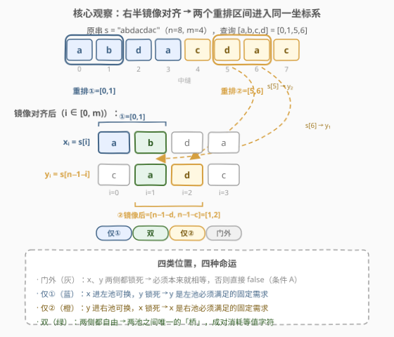
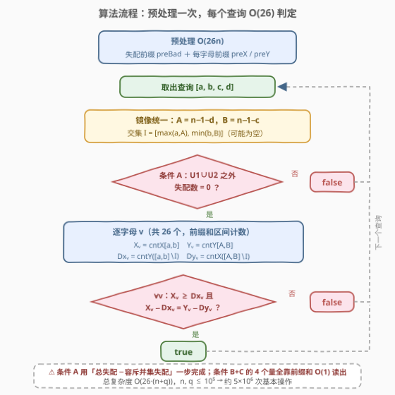
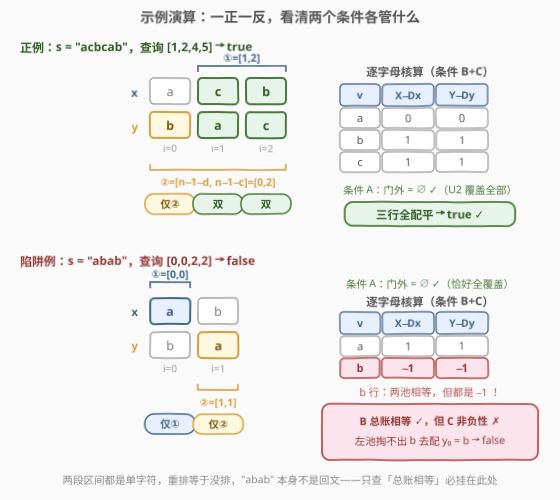

# 回文串重排列查询

- **题目名称**：回文串重排列查询
- **链接**：[2983. 回文串重排列查询](https://leetcode.cn/problems/palindrome-rearrangement-queries/)
- **难度**：困难
- **标签**：数组、哈希表、字符串、前缀和

## 1. 题目概述

给你一个长度为**偶数** $n$、下标从 0 开始的字符串 $s$，再给一个二维整数数组 $queries$，其中 $queries[i] = [a_i, b_i, c_i, d_i]$。对每个查询**独立**执行：

- 将**左半**子串 $s[a_i..b_i]$（$0 \le a_i \le b_i < n/2$）中的字符任意重排；
- 将**右半**子串 $s[c_i..d_i]$（$n/2 \le c_i \le d_i < n$）中的字符任意重排。

判断操作后 $s$ 能否变成**回文串**，返回布尔数组 $answer$。

**示例 1**：

```text
输入：s = "abcabc", queries = [[1,1,3,5],[0,2,5,5]]
输出：[true,true]
解释：查询 1：s[3..5]="abc" 重排为 "cba" → "abc"+"cba" = "abccba" ✓
      查询 2：s[0..2]="abc" 重排为 "cba"，s[5..5] 单字符不动 → "cba"+"abc" = "cbaabc" ✓
```

**示例 2**：

```text
输入：s = "abbcdecbba", queries = [[0,2,7,9]]
输出：[false]
解释：查询区间之外的中间位置 4/5 是 'd'、'e'，锁死且不相等，无法修复。
```

**示例 3**：

```text
输入：s = "acbcab", queries = [[1,2,4,5]]
输出：[true]
解释：s[1..2]="cb" 重排为 "bc"、s[4..5]="ab" 重排为 "ba" → "abccba" ✓
```

**约束条件**：

- $2 \le n = s.length \le 10^5$
- $1 \le queries.length \le 10^5$
- $0 \le a_i \le b_i < n/2$，$n/2 \le c_i \le d_i < n$
- $n$ 为偶数，$s$ 只含小写字母

> 💡 关键信号：$n, q$ 都到 $10^5$，逐查询必须做到 $O(26)$ 或 $O(\log n)$；字符集只有 26 个小写字母——「按字母的前缀计数」是这类区间字符统计题的标准武器。真正的难点不在前缀和，而在**判定条件本身的推导**：两次重排相互作用，怎样的字符计数条件才恰好充要？

---

## 2. 解题思路

### 2.1 暴力思路：枚举重排 / 逐查询全量扫描

最直白的暴力是对每个查询枚举两段子串的全部排列、逐一验证回文，单查询 $O\big((\frac{n}{2})!^2 \cdot n\big)$，$n=6$ 就已经爆炸。

退一步的「半暴力」：单独处理每个查询，扫描全串把每对对称位置分类、再用 $O(26 \cdot n)$ 统计两个区间的字符计数做判定——单查询 $O(n)$，总量 $O(nq) = 10^{10}$，依然不可行。但它指明了优化方向：**分类检查与字符计数全部用前缀和 $O(1)$ 读出**。问题是：读出哪些量、怎么组合成充要条件？这正是本题的核心。

### 2.2 核心观察：镜像统一坐标系 + 四类位置 + 双池配平



**观察① 镜像统一坐标系**。设 $m = n/2$，回文的条件是 $\forall i \in [0, m):\ s[i] = s[n-1-i]$。把右半「翻转对齐」到左半：

$$x_i = s[i], \qquad y_i = s[n-1-i]$$

查询的右区间 $[c, d] \subseteq [m, n)$ 在镜像坐标系里变成 $[A, B] = [n-1-d,\ n-1-c] \subseteq [0, m)$。记 $U_1 = [a, b]$、$U_2 = [A, B]$，两次重排就变成**同一坐标系**下对 $x$（在 $U_1$ 上）和 $y$（在 $U_2$ 上）的两次独立重排——两段区间从此**可能相交**，这是后续一切分析的地基。

**观察② 四类位置**。按 $i$ 落在哪个区间，$[0, m)$ 的每个位置分成四类：

| 类别 | 条件 | 命运 |
|------|------|------|
| 门外 | $i \notin U_1 \cup U_2$ | $x_i, y_i$ 都锁死，必须已相等 |
| 仅① | $i \in U_1 \setminus U_2$ | $x_i$ 进**左池**可换，$y_i$ 锁死 |
| 仅② | $i \in U_2 \setminus U_1$ | $y_i$ 进**右池**可换，$x_i$ 锁死 |
| 双 | $i \in U_1 \cap U_2$ | 两侧都自由，是两池之间唯一的「桥」 |

**观察③ 双池配平**。左池 $X$ 是 $\{x_i : i \in U_1\}$ 的多重集，右池 $Y$ 是 $\{y_i : i \in U_2\}$ 的多重集。对每个字母 $v$ 记：

- $X_v$、$Y_v$：两池中 $v$ 的个数（区间计数）；
- $Dx_v = \#\{i \in U_1 \setminus U_2 : y_i = v\}$：仅①位置的锁死 $y$，是对左池的**固定需求**；
- $Dy_v = \#\{i \in U_2 \setminus U_1 : x_i = v\}$：仅②位置的锁死 $x$，是对右池的固定需求。

关键在「双」位置：它从左右两池**各取一个字符且必须相等**。设配对值为 $v$ 的双位置共 $k_v$ 个，则两池各被消耗 $k_v$ 个 $v$，账本必须逐字母配平：

$$X_v = Dx_v + k_v, \qquad Y_v = Dy_v + k_v, \qquad k_v \ge 0$$

消去 $k_v$，得到整题的**判定式**：

$$\forall v:\quad X_v - Dx_v \;=\; Y_v - Dy_v \;\ge\; 0$$

**观察④ 判定式的语义拆解**。把等式改写成 $X_v + Dy_v = Y_v + Dx_v$，即 $\mathrm{cntX}(v,\ U_1 \cup U_2) = \mathrm{cntY}(v,\ U_1 \cup U_2)$——**并集区域内，左半字符与右半字符总账相等**（条件 B）；不等式则是**左池喂饱自家门内的固定需求后仍有余量供给双位置**（条件 C）。

> ⚠️ **两个条件缺一不可**。反例：$s = $ `"abab"`，查询 $[0,0,2,2]$：$U_1 = \{0\}$、$U_2 = \{1\}$，并集总账两侧同为 $\{a,b\}$，条件 B 通过；但 $X_b = 0 < Dx_b = 1$，条件 C 失败——左池里根本没有 `b` 去配锁死的 $y_0 = $ `b`。事实上两段区间都是单字符，重排等于没排，`"abab"` 不是回文。只查「总账相等」的写法必挂在此处。

**观察⑤ 门外检查（条件 A）**。设 $\mathrm{bad}(l, r)$ 为 $[l, r]$ 内 $x_i \ne y_i$ 的位置数（失配前缀和），门外失配数用容斥一步算出：

$$\mathrm{bad}(0, m{-}1) - \mathrm{bad}(U_1) - \mathrm{bad}(U_2) + \mathrm{bad}(U_1 \cap U_2) \overset{!}{=} 0$$

### 2.3 算法流程图



**完整步骤**：

1. **预处理** $O(26n)$：失配前缀 $\mathrm{preBad}$；每字母前缀计数 $\mathrm{preX}_v$（左半 $x$）与 $\mathrm{preY}_v$（镜像右半 $y$）；
2. **逐查询** $O(26)$：
   - 镜像统一：$A = n{-}1{-}d$，$B = n{-}1{-}c$；交集 $I = [\max(a, A),\ \min(b, B)]$（可为空）；
   - **条件 A**：门外失配数（上式容斥）为 0，否则 `false`；
   - **条件 B + C**：逐字母 $v \in [0, 26)$，用前缀和读出 4 个量
     $X_v = \mathrm{cntX}(a, b)$，$Y_v = \mathrm{cntY}(A, B)$，
     $Dx_v = \mathrm{cntY}(a, b) - \mathrm{cntY}(I)$，$Dy_v = \mathrm{cntX}(A, B) - \mathrm{cntX}(I)$；
     一旦 $X_v < Dx_v$ 或 $X_v - Dx_v \ne Y_v - Dy_v$，`false`；
   - 全部通过 → `true`。

> ⚠️ 三个易错点：① 交集 $I$ 为空时不能减（下标会交叉）；② 条件 C 的非负性检查 $X_v \ge Dx_v$ 绝不能省（见观察④的反例）；③ $A, B$ 是「先减 $d$ 后减 $c$」，顺序写反会得到反向区间。

### 2.4 示例演算



**正例（示例 3）**：$s = $ `"acbcab"`，$n = 6, m = 3$，查询 $[1,2,4,5]$。$x = $ `acb`，$y = $ `bac`；$U_1 = [1,2]$，$U_2 = [n{-}1{-}5,\ n{-}1{-}4] = [0,2]$，交集 $I = [1,2]$。位置分类：$i=0$ 仅②，$i=1, 2$ 双，门外为空 → 条件 A ✓。逐字母账本：

| $v$ | $X_v$ | $Dx_v$ | $X_v - Dx_v$ | $Y_v$ | $Dy_v$ | $Y_v - Dy_v$ | 判定 |
|-----|-------|--------|--------------|-------|--------|--------------|------|
| a | 0 | 0 | 0 | 1 | 1 | 0 | ✓ |
| b | 1 | 0 | 1 | 1 | 0 | 1 | ✓ |
| c | 1 | 0 | 1 | 1 | 0 | 1 | ✓ |

三行全配平且非负 → `true`。构造方案：双位置 $\{1,2\}$ 配对值取 $b, c$，左池 $\{c, b\}$ 拿出 $b, c$、右池 $\{b,a,c\}$ 拿出 $b, c$，仅②位置 $0$ 由右池剩余的 $a$ 配锁死的 $x_0 = a$ → `abccba`。

**陷阱例**：$s = $ `"abab"`，查询 $[0,0,2,2]$。$x = $ `ab`，$y = $ `ba`；$U_1 = \{0\}$，$U_2 = \{1\}$，无交集。账本：字母 a 两侧 $1 = 1$ ✓；字母 b 两侧 $-1 = -1$——**相等但为负**！条件 C 爆炸 → `false`。这正是「只查总账」的假算法翻车的地方。

**示例 2 的拦截方式**：$s = $ `"abbcdecbba"`，查询 $[0,2,7,9]$。$U_1 = [0,2]$ 与 $U_2 = [0,2]$ 完全重合，门外是 $i \in \{3, 4\}$：$x_4 = $ `d` 而 $y_4 = $ `e` 失配 → 条件 A 直接 `false`，根本轮不到算账本。

---

## 3. 参考代码

### C++

```cpp
class Solution {
  public:
    vector<bool> canMakePalindromeQueries(string s, vector<vector<int>>& queries) {
        int n = s.size(), m = n / 2;
        vector<int> preBad(m + 1, 0);
        vector<vector<int>> preX(26, vector<int>(m + 1, 0));
        vector<vector<int>> preY(26, vector<int>(m + 1, 0));
        for (int i = 0; i < m; ++i) {
            int xv = s[i] - 'a', yv = s[n - 1 - i] - 'a';
            preBad[i + 1] = preBad[i] + (xv != yv);
            for (int v = 0; v < 26; ++v) {
                preX[v][i + 1] = preX[v][i] + (v == xv);
                preY[v][i + 1] = preY[v][i] + (v == yv);
            }
        }

        vector<bool> ans;
        ans.reserve(queries.size());
        for (auto& q : queries) {
            int a = q[0], b = q[1], c = q[2], d = q[3];
            int A = n - 1 - d, B = n - 1 - c;
            int lo = max(a, A), hi = min(b, B);
            bool hasI = lo <= hi;

            int badU = preBad[b + 1] - preBad[a] + preBad[B + 1] - preBad[A];
            if (hasI) badU -= preBad[hi + 1] - preBad[lo];
            bool ok = (preBad[m] == badU);

            if (ok) {
                for (int v = 0; v < 26 && ok; ++v) {
                    int Xv = preX[v][b + 1] - preX[v][a];
                    int Yv = preY[v][B + 1] - preY[v][A];
                    int Dx = preY[v][b + 1] - preY[v][a];
                    int Dy = preX[v][B + 1] - preX[v][A];
                    if (hasI) {
                        Dx -= preY[v][hi + 1] - preY[v][lo];
                        Dy -= preX[v][hi + 1] - preX[v][lo];
                    }
                    if (Xv < Dx || Xv - Dx != Yv - Dy) ok = false;
                }
            }
            ans.push_back(ok);
        }
        return ans;
    }
};
```

### Python

```python
class Solution:
    def canMakePalindromeQueries(self, s: str, queries: List[List[int]]) -> List[bool]:
        n = len(s)
        m = n // 2
        preBad = [0] * (m + 1)
        preX = [[0] * (m + 1) for _ in range(26)]
        preY = [[0] * (m + 1) for _ in range(26)]
        for i in range(m):
            xv = ord(s[i]) - 97
            yv = ord(s[n - 1 - i]) - 97
            preBad[i + 1] = preBad[i] + (xv != yv)
            for v in range(26):
                preX[v][i + 1] = preX[v][i] + (v == xv)
                preY[v][i + 1] = preY[v][i] + (v == yv)

        ans = []
        for a, b, c, d in queries:
            A = n - 1 - d
            B = n - 1 - c
            lo = a if a > A else A
            hi = b if b < B else B
            hasI = lo <= hi

            badU = preBad[b + 1] - preBad[a] + preBad[B + 1] - preBad[A]
            if hasI:
                badU -= preBad[hi + 1] - preBad[lo]
            ok = preBad[m] == badU

            if ok:
                for v in range(26):
                    px = preX[v]
                    py = preY[v]
                    Xv = px[b + 1] - px[a]
                    Yv = py[B + 1] - py[A]
                    Dx = py[b + 1] - py[a]
                    Dy = px[B + 1] - px[A]
                    if hasI:
                        Dx -= py[hi + 1] - py[lo]
                        Dy -= px[hi + 1] - px[lo]
                    if Xv < Dx or Xv - Dx != Yv - Dy:
                        ok = False
                        break
            ans.append(ok)
        return ans
```

> 💡 实测代码已通过三个官方示例与 4000+ 组随机数据对拍（暴力枚举两段区间全部排列做金标准），另含 `"abab"` 陷阱用例专项验证条件 C。

---

## 4. 复杂度分析

| 维度 | 复杂度 | 说明 |
|------|--------|------|
| 时间复杂度 | $O(26 \cdot (n + q))$ | 预处理三组前缀和各 $O(26n)$；每查询条件 A 为 $O(1)$ 容斥、条件 B+C 最多 26 次前缀和区间计数。$n = q = 10^5$ 时约 $5 \times 10^6$ 次基本操作 |
| 空间复杂度 | $O(26n)$ | $\mathrm{preX}$、$\mathrm{preY}$ 各 $26 \times (n/2 + 1)$ 个整数，$\mathrm{preBad}$ 为 $O(n/2)$ |

---

## 5. 扩展：区间不相交时的退化形态

若 $U_1$ 与 $U_2$ **不相交**（交集为空），「双」位置不存在，$k_v \equiv 0$，判定式退化为两组**各自独立**的等式：

$$\mathrm{cntX}(v, U_1) = \mathrm{cntY}(v, U_1) \quad\text{且}\quad \mathrm{cntY}(v, U_2) = \mathrm{cntX}(v, U_2)$$

语义非常直观：两段重排互不相干，每段区间必须「自己救自己」——区间内左半字符的多重集恰好等于右半镜像字符的多重集，重排才能在区间内部完美配对。条件 A 的门外检查照旧。

另一个自然的念头是**用随机权值哈希把条件 B 做成 $O(1)$**：给每个字母赋随机 64 位权值，对「$\mathrm{preX}$ 权值和 $-$ $\mathrm{preY}$ 权值和」做前缀，并集总账相等就变成一次减法判零（Schwartz-Zippel 概率保证）。但条件 C 的**非负性**是逐字母的符号信息，无法用求和式哈希捕获——所以 $O(26)$ 逐字母仍是主线。反过来说，26 个字母的常数正是本题给的隐性红利：若字符集是 $10^5$ 级别，就得认真考虑哈希 + 树上差分之类的手段了。

---

## 6. 面试要点

1. **为什么要把右半「翻过来」对齐？**

   - 回文条件天然是「$s[i]$ 对 $s[n-1-i]$」的配对视角，镜像后两个操作区间落在同一坐标系 $[0, m)$ 内，**才可能相交**，四类位置（门外/仅①/仅②/双）的分类才完备；
   - 不做这一步，左右区间在原坐标里永远分离，很容易误判成「两段各自独立配平」——那只是不相交时的特例。

2. **「总账相等」为什么不够？非负性从哪来？**

   - 判定式里的 $k_v$ 是配对值取 $v$ 的双位置个数，是计数，天然非负——这就是 $X_v \ge Dx_v$ 的来源；
   - 反例 `"abab"` + $[0,0,2,2]$：总账逐字母相等但 $k_b = -1 < 0$，左池掏不出 `b` 去配锁死的 $y_0$；
   - 面试中主动给出这个反例，是证明自己真正推过充要条件的最好方式。

3. **「双」位置为什么是两池之间唯一的桥？**

   - 仅①位置 $y$ 锁死、仅②位置 $x$ 锁死，都只能单方面向一个池提需求；
   - 只有双侧自由的位置能同时从左右两池各消耗一个**等值**字符，充当两池之间的交换通道；通道不存在时（区间不相交），两池只能各自配平。

4. **条件 A 的容斥为什么要减交集？**

   - 门外失配 = 总失配 −（$U_1$ 内失配 + $U_2$ 内失配 − 交集失配），两区间相交时交集被算了两次；
   - 同样的容斥也出现在 $Dx_v$、$Dy_v$ 的计算里（区间差 = 区间 − 交集），三处共用同一个 $[\max(a,A), \min(b,B)]$。

5. **逐字母查 26 个会不会慢？**

   - $O(26(n+q)) \approx 5 \times 10^6$，C++ 轻松；Python 把 `preX[v]` 提为局部变量后最坏（全 true）约 3 秒内可过；
   - 循环内先做便宜的 $O(1)$ 条件 A 拦截，再进 26 循环，平均代价远低于最坏值。

---

## 7. 同类练习题

- [1177. 构建回文串检测](https://leetcode.cn/problems/can-make-palindrome-from-substring/)（[站内题解](../1101-1200/1177_构建回文串检测.md)）：本题最近的亲戚——区间查询 + 前缀字符计数 + 回文重排判定，只需数「出现奇数次的字母数」，先刷它再回来体会双池配平的升级
- [2384. 最大回文数字](https://leetcode.cn/problems/largest-palindromic-number/)（[站内题解](../2301-2400/2384_最大回文数字.md)）：字符计数 → 回文构造方向的贪心训练，与本题「计数 → 回文判定」互为正反两面
- [2131. 连接两字母单词得到的最长回文串](https://leetcode.cn/problems/longest-palindrome-by-concatenating-two-letter-words/)（[站内题解](../2101-2200/2131_连接两字母单词得到的最长回文串.md)）：配对计数构造回文的另一形态，训练「成对消耗 + 中心单放」的计数直觉
- [214. 最短回文串](https://leetcode.cn/problems/shortest-palindrome/)（[站内题解](../0201-0300/214_最短回文串.md)）：回文 + 前缀匹配（KMP/哈希）的经典，体会「回文条件」在不同题型下的转化手法
- [336. 回文对](https://leetcode.cn/problems/palindrome-pairs/)（[站内题解](../0301-0400/336_回文对.md)）：哈希 + 回文判定的组合技，字典序枚举的坑点与本题的区间坑点同样密集
