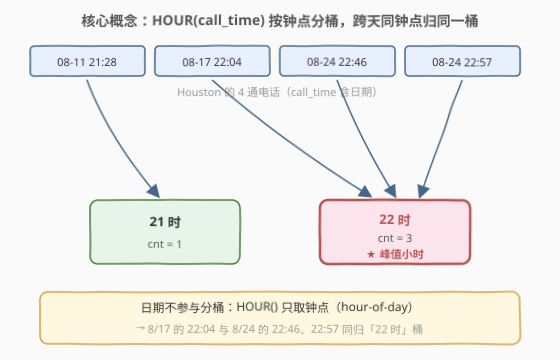
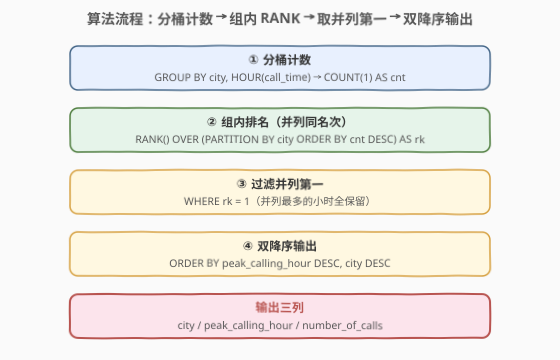
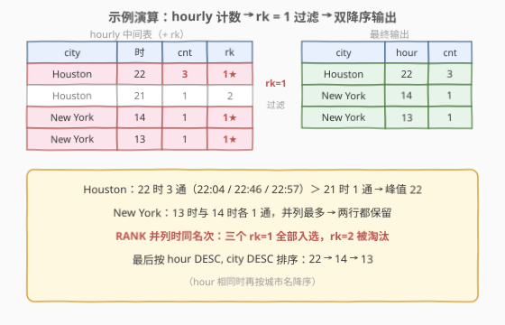

# 找到每座城市的高峰通话小时

- **题目名称**：找到每座城市的高峰通话小时
- **链接**：[2984. 找到每座城市的高峰通话小时](https://leetcode.cn/problems/find-peak-calling-hours-for-each-city/)
- **难度**：中等
- **标签**：数据库、SQL、窗口函数、分组统计

## 1. 题目概述

> ⚠️ 本题为 LeetCode 付费题，题意描述根据官方示例用例与外部资料重建，可能与官方题面有出入。

**表结构**：`Calls`

| 列名 | 类型 |
|------|------|
| caller_id | int |
| recipient_id | int |
| call_time | datetime |
| city | varchar |

- `(caller_id, recipient_id, call_time)` 为该表主键（组合唯一）。
- 每行记录一通电话：主叫 id、被叫 id、通话发生时间、通话所在城市。

**目标**：写一条 SQL 查询，找出**每座城市的高峰通话小时**（peak calling hour）。统计每座城市在 0–23 每个钟点小时内的通话次数，次数最多的小时即该城市的高峰小时；若多个小时**并列最多**，这些小时**全部**视为高峰小时，都要返回。

**输出**：`city`、`peak_calling_hour`、`number_of_calls` 三列，按 `peak_calling_hour` 和 `city` **降序**排列。

**示例 1**：

```text
输入：Calls 表
+-----------+--------------+---------------------+----------+
| caller_id | recipient_id | call_time           | city     |
+-----------+--------------+---------------------+----------+
| 8         | 4            | 2021-08-24 22:46:07 | Houston  |
| 4         | 8            | 2021-08-24 22:57:13 | Houston  |
| 5         | 1            | 2021-08-11 21:28:44 | Houston  |
| 8         | 3            | 2021-08-17 22:04:15 | Houston  |
| 11        | 3            | 2021-08-17 13:07:00 | New York |
| 8         | 11           | 2021-08-17 14:22:22 | New York |
+-----------+--------------+---------------------+----------+

输出：
+----------+-------------------+-----------------+
| city     | peak_calling_hour | number_of_calls |
+----------+-------------------+-----------------+
| Houston  | 22                | 3               |
| New York | 14                | 1               |
| New York | 13                | 1               |
+----------+-------------------+-----------------+
```

**解释**：

- Houston：22 时共 3 通（22:46、22:57、22:04），21 时 1 通 → 高峰小时为 **22 时**。
- New York：13 时与 14 时各 1 通，**并列最多** → 两个小时都是高峰小时。
- 输出按 `peak_calling_hour` 和 `city` 降序：22 → 14 → 13。

> 💡 读题三个关键点：①「小时」是**钟点对齐**的 hour-of-day 桶（22:46 → 22 时），**跨天**的通话按钟点归入同一桶，日期不参与分桶；② 并列最多的小时**全返回**；③ 排序是 `hour DESC, city DESC` **双降序**，LeetCode SQL 判题对行序敏感。

---

## 2. 解题思路

### 2.1 暴力思路：两次聚合 + 自连接

直觉解法分两步：先 `GROUP BY city, HOUR(call_time)` 数出每城每小时的通话数；再对每座城市求 `MAX(cnt)`，把等于最大值的行筛出来——这需要把聚合结果**自连接**（或相关子查询）回去，聚合逻辑写两遍，SQL 冗长且容易错列名。既然要的是「每城组内取**并列**第一」，这正是 `RANK()` 窗口函数的招牌场景，一条排名就能替代「求最大 + 连回」两步。

### 2.2 核心观察：HOUR() 分桶 + RANK() 组内并列第一

**观察一：小时 = 钟点桶，`HOUR()` 一步截断。**

`HOUR(call_time)` 直接取出 datetime 的钟点（0–23）。注意与 [2933. 高访问员工](https://leetcode.cn/problems/high-access-employees/)的**滑动 60 分钟窗口**不同，本题的「通话小时」就是**钟点对齐**的桶：22:46、22:04、22:57 都归「22 时」，21:28 归「21 时」。日期不参与分桶——8 月 17 日的 22:04 与 8 月 24 日的 22:46 在同一个「22 时」桶里。于是 `(city, HOUR(call_time))` 一次 `GROUP BY` 即得每城每小时的通话数。



**观察二：并列全返回 → RANK 而非 ROW_NUMBER。**

城市内按 `cnt DESC` 排名，用 `RANK() OVER (PARTITION BY city ORDER BY cnt DESC)`：并列最多的行都得到 `rk = 1`，`WHERE rk = 1` 一网打尽。`ROW_NUMBER` 会给并列者强行编号 1、2，漏掉并列者——纽约 13 时和 14 时各 1 通，用 `ROW_NUMBER` 只会留下一个。

**观察三：输出是双降序。**

`ORDER BY peak_calling_hour DESC, city DESC`——先按小时降序，小时相同再按城市名降序。方向写反或漏掉 `city` 都会判错。

### 2.3 算法流程图



**完整步骤**：

1. **分桶计数**：`GROUP BY city, HOUR(call_time)`，`COUNT(1) AS cnt` 得每城每小时通话数。
2. **组内排名**：`RANK() OVER (PARTITION BY city ORDER BY cnt DESC) AS rk`，每城最多的行 `rk = 1`。
3. **过滤**：`WHERE rk = 1`，保留所有并列高峰行。
4. **排序输出**：`ORDER BY peak_calling_hour DESC, city DESC`。

### 2.4 示例演算



聚合后的 hourly 中间表（含排名）：

| city | 时 | cnt | rk |
|------|----|-----|-----|
| Houston | 22 | 3 | **1** ★ |
| Houston | 21 | 1 | 2 |
| New York | 14 | 1 | **1** ★ |
| New York | 13 | 1 | **1** ★ |

- Houston：22 时 3 通 ＞ 21 时 1 通，只有 `rk = 1` 的 22 时入选。
- New York：13、14 时并列 1 通，`RANK` 给两者相同的 `rk = 1`，**两行全保留**；若用 `ROW_NUMBER` 会丢一行。
- 最终按 hour DESC、city DESC 输出：`Houston 22` → `New York 14` → `New York 13`。

---

## 3. 参考代码

### MySQL

```sql
# Write your MySQL query statement below
WITH hourly AS (
    SELECT
        city,
        HOUR(call_time) AS h,
        COUNT(1) AS cnt
    FROM Calls
    GROUP BY city, HOUR(call_time)
),
ranked AS (
    SELECT
        city,
        h,
        cnt,
        RANK() OVER (
            PARTITION BY city
            ORDER BY cnt DESC
        ) AS rk
    FROM hourly
)
SELECT
    city,
    h AS peak_calling_hour,
    cnt AS number_of_calls
FROM ranked
WHERE rk = 1
ORDER BY peak_calling_hour DESC, city DESC;
```

> 💡 两个 CTE 各司其职：`hourly` 完成「分桶计数」（粒度从通话流水折叠到城市×小时），`ranked` 完成「组内排名」，最后 `WHERE rk = 1` + 双降序输出。`HOUR()` 也可换成标准写法 `EXTRACT(HOUR FROM call_time)`，语义相同。整个查询没有 JOIN，聚合一次、排名一次，简洁且高效。

---

## 4. 复杂度分析

| 维度 | 复杂度 | 说明 |
|------|--------|------|
| **时间复杂度** | $O(n \log n)$ | `GROUP BY city, HOUR()` 聚合需分区/排序 $O(n \log n)$（哈希聚合可到 $O(n)$）；`RANK OVER` 对中间表（规模 $m \le 24 \times$ 城市数 $\ll n$）排序 $O(m \log m)$ |
| **空间复杂度** | $O(n)$ | 聚合中间表 + 窗口函数排序缓冲，与通话行数同阶 |

> ⚠️ $n$ 为 `Calls` 表行数。中间表每城至多 24 行（0–23 时），窗口排序开销可忽略；瓶颈只在外层聚合的一次排序/哈希。

---

## 5. 扩展：不用窗口函数的 JOIN MAX 写法（MySQL 5.7）

MySQL 8.0 之前没有窗口函数，也没有 CTE。等价做法是**派生表聚合两次 + 按 `cnt = MAX` 连接**：

```sql
-- 不使用窗口函数 / CTE，兼容 MySQL 5.7
SELECT
    t.city,
    t.h AS peak_calling_hour,
    t.cnt AS number_of_calls
FROM (
    SELECT city, HOUR(call_time) AS h, COUNT(1) AS cnt
    FROM Calls
    GROUP BY city, HOUR(call_time)
) t
JOIN (
    SELECT city, MAX(cnt) AS mx
    FROM (
        SELECT city, HOUR(call_time) AS h, COUNT(1) AS cnt
        FROM Calls
        GROUP BY city, HOUR(call_time)
    ) s
    GROUP BY city
) m ON m.city = t.city AND m.mx = t.cnt
ORDER BY peak_calling_hour DESC, city DESC;
```

> 💡 内层聚合 `(city, h, cnt)` 因 5.7 无 CTE 只能写两遍（8.0 可用 `WITH` 复用）。`JOIN ... ON cnt = mx` 是「组内最大值全返回」的经典等价物：等于最大值的行可能有多条，JOIN 不会漏。两版逻辑一致，窗口函数版把「求最大 + 连回」合并成一次排名，是 8.0 的推荐写法。

---

## 6. 面试要点

1. **本题的「高峰通话小时」和 2933 高访问员工的「同一小时」是一回事吗？**

   - 不是。本题的小时是**钟点对齐**的 hour-of-day 桶——`HOUR()` 直接截断，22:46 → 22 时，跨天合并；2933 的「一小时」是**任意滑动的 60 分钟窗口**（05:32 / 05:49 / 06:21 同窗）。一个是离散分桶、一个是连续窗口，读题时必须先分清，否则会把窗口题做成分桶题。

2. **为什么用 RANK() 而不是 ROW_NUMBER() / DENSE_RANK()？**

   - 并列最多的小时要**全返回**：`RANK` 对相同 `cnt` 给相同名次，并列第一都是 `rk = 1`，`WHERE rk = 1` 一网打尽。`ROW_NUMBER` 强行唯一编号，纽约 13/14 时各 1 通只会留下一行。`DENSE_RANK` 在只取第一名时结果与 `RANK` 相同，但 `RANK` 语义更直接。

3. **8 月 17 日的 22:04 和 8 月 24 日的 22:46 会进同一个桶吗？**

   - 会。「高峰通话小时」统计的是 hour-of-day 维度，`GROUP BY` 键只带 `HOUR(call_time)` 不带日期，不同日期同一钟点的通话累加进同一桶。若题目改成「哪一天的哪个小时通话最多」，`GROUP BY` 键就要加上 `DATE(call_time)`。

4. **不用窗口函数怎么做（MySQL 5.7）？**

   - 先派生表算 `(city, hour, cnt)`，再派生表按 city 求 `MAX(cnt)`，两表按 `city` 相等且 `cnt = mx` JOIN。聚合要写两遍（5.7 无 CTE）；也可用相关子查询 + `HAVING cnt = (每城最大)`。窗口函数版把这两步合成一次排名，更简洁。

5. **输出排序有什么易错点？**

   - 是 `peak_calling_hour DESC, city DESC` **双降序**——先按小时降序，小时相同再按城市名降序。LeetCode SQL 判行序敏感，写成升序、只排一列、或把 `city` 放到第一排序键都会判错（示例中 Houston 22 排在 New York 14 之前，验证了小时是第一排序键）。

> 💡 **一句话总结**：2984 是「**HOUR() 钟点分桶 + RANK() 组内并列第一**」的窗口函数模板题——`(city, HOUR(call_time))` 一次 GROUP BY 计数，`RANK() OVER (PARTITION BY city ORDER BY cnt DESC)` 取并列最大，最后双降序输出。$O(n \log n)$ 时间、$O(n)$ 空间，无 JOIN。

---

## 7. 同类练习题

- [184. 部门工资最高的员工](https://leetcode.cn/problems/department-highest-salary/)：「组内最大值全返回」的经典，RANK 或 JOIN MAX 皆可——本题的「工资」版
- [185. 部门工资前三高的所有员工](https://leetcode.cn/problems/department-top-three-salaries/)：DENSE_RANK 取组内 Top-N，与本题 Top-1 并列全返回对照
- [1086. 前五科的均分](https://leetcode.cn/problems/high-five/)：组内按分数排序取前 5 的均分，窗口函数组内截断的另一变体
- [197. 上升的温度](https://leetcode.cn/problems/rising-temperature/)：日期时间函数（DATEDIFF）入门题，与本题 HOUR() 同属「时间函数」考点
- [2933. 高访问员工](https://leetcode.cn/problems/high-access-employees/)：同为「通话/访问时间」聚合判定，但「一小时」是滑动 60 分钟窗口——与本题钟点桶对照着记
