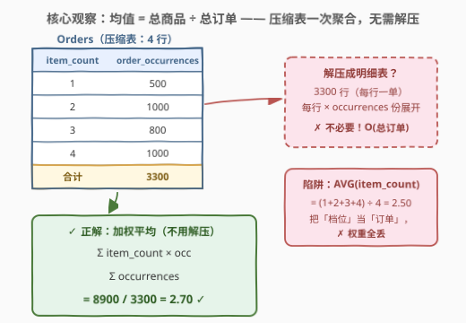
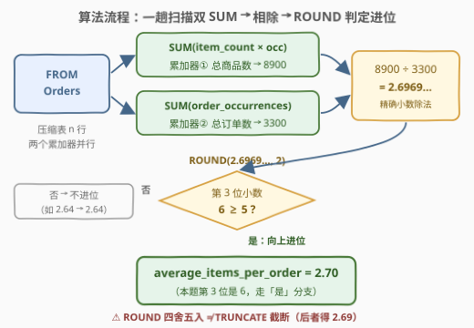
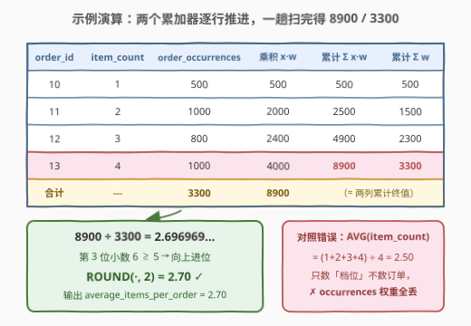

# 计算订单平均商品数量

- **题目名称**：计算订单平均商品数量
- **链接**：[2985. 计算订单平均商品数量](https://leetcode.cn/problems/calculate-compressed-mean/)
- **难度**：简单
- **标签**：SQL、聚合函数、加权平均、SUM、ROUND、压缩数据（RLE）

## 1. 题目概述

> ⚠️ 本题为 LeetCode 付费题，题意描述根据官方示例用例与 hints 重建，可能与官方题面有出入。

给定一张**压缩存储**的订单表 `Orders`：不逐笔记录订单，而是每个「商品数档位」一行——`item_count` 表示一笔订单含多少件商品，`order_occurrences` 表示**恰好有这么多件商品的订单共有多少笔**（这正是题名 *Calculate Compressed Mean* 的含义）。编写解决方案，计算**每笔订单的平均商品数量**，保留 `2` 位小数。以任意顺序返回结果。

**表结构**：

```text
Table: Orders
+-------------------+------+
| Column Name       | Type |
+-------------------+------+
| order_id          | int  |  ← 唯一列
| item_count        | int  |  ← 每笔订单的商品件数（档位）
| order_occurrences | int  |  ← 该档位对应的订单笔数（权重）
+-------------------+------+
```

**示例 1**：

```text
输入：
Orders 表:
+----------+------------+-------------------+
| order_id | item_count | order_occurrences |
+----------+------------+-------------------+
| 10       | 1          | 500               |
| 11       | 2          | 1000              |
| 12       | 3          | 800               |
| 13       | 4          | 1000              |
+----------+------------+-------------------+

输出：
+-------------------------+
| average_items_per_order |
+-------------------------+
| 2.70                    |
+-------------------------+

解释：
- 总商品数：(1 × 500) + (2 × 1000) + (3 × 800) + (4 × 1000) = 8900
- 总订单数：500 + 1000 + 800 + 1000 = 3300
- 平均每单商品数：8900 / 3300 = 2.70
```

**约束条件**：

- `order_id` 是 `Orders` 中具有唯一值的列
- 每行的语义是「`order_occurrences` 笔订单，每笔各含 `item_count` 件商品」——解压后总订单数为 $\sum \text{order\_occurrences}$
- 输出单行单列 `average_items_per_order`，保留 2 位小数

> 💡 本题考点浓缩在一个词上：**compressed（压缩）**。明细被压缩后，`AVG(item_count)` 这种「拿来就用」的聚合会悄悄丢掉权重；而**均值本质上是线性统计量**——只依赖「总商品数 ÷ 总订单数」两个和，在压缩表上**一次聚合即可无损还原**，连解压都不需要。这也是它与 [1251. 平均售价](../1201-1300/1251_平均售价.md) 加权平均套路一脉相承、又更纯粹的地方。

---

## 2. 解题思路

### 2.1 暴力思路：先解压、再求平均

最直觉的错误写法是「假装这张表就是明细表」，直接：

```sql
SELECT ROUND(AVG(item_count), 2) FROM Orders;   -- ✗ 得到 2.50
```

`AVG(item_count)` 把 4 个**档位**当成 4 笔**订单**求简单平均，$(1+2+3+4)/4 = 2.50$，而正确答案是 $2.70$——`order_occurrences` 承载的权重被完全丢掉了。

真正的暴力是「先还原再统计」：把每行按 `order_occurrences` **爆炸展开**成明细表（500 份 `item_count=1`、1000 份 `item_count=2`……共 3300 行），再对明细 `AVG`。SQL 里可以用递归 CTE 或数字辅助表 `JOIN` 实现：

```text
for each row (x, w) in Orders:
    emit w copies of x        # 解压：3300 行
AVG over all emitted rows     # 再对明细求平均
```

代价 $O(\sum \text{occurrences})$——本题才 3300，可一旦 `order_occurrences` 达到 $10^9$ 量级（压缩存储的意义恰恰在此），物化明细的内存与时间都直接爆炸。

> ⚠️ 暴力法的浪费在于：**均值根本不需要看到每一笔订单**。它只依赖两个标量——总商品数与总订单数，而这两个和在压缩表上逐行累加就能得到。为求统计量而还原明细，是典型的「用数据规模换代码直觉」。

### 2.2 核心观察：均值是线性统计量，加权平均一次聚合还原



**问题本质**：在**加权视角**下，`order_occurrences` 是 `item_count` 的权重，压缩表上的均值就是**加权平均**：

$$\text{average\_items\_per\_order} = \frac{\sum_{i} \text{item\_count}_i \times \text{order\_occurrences}_i}{\sum_{i} \text{order\_occurrences}_i} = \frac{\text{总商品数}}{\text{总订单数}}$$

**概率视角**则更优雅：把每个档位看作离散随机变量的取值 $x_i$，权重占比 $p_i = \text{occ}_i / \sum \text{occ}$ 就是其概率，均值 $= \sum x_i p_i = E[\text{item\_count}]$——离散分布的**期望**。

关键洞察有两个：

1. **均值只依赖两个 `SUM`**：分子 $\sum x_i w_i$（总商品数）与分母 $\sum w_i$（总订单数）。`SUM` 是可交换、可结合的聚合，压缩表逐行累加即可，**复杂度与压缩后的行数成正比，与解压后的订单总量无关**——3300 笔订单还是 33 亿笔，只要档位数有限，计算代价不变。

2. **简单平均 $\neq$ 加权平均**：`AVG(item_count)` 隐含「每行权重为 1」，只有当每行恰好代表一笔订单时才正确。识别「行 = 组，而不是行 = 单」是压缩表题目的第一道坎。

> 💡 这正是 [1251. 平均售价](../1201-1300/1251_平均售价.md) 的同构套路 `SUM(price × units) / SUM(units)`——那题的权重 `units` 挂在另一张销售表上，还要多一层非等值连接；本题权重就躺在表里，是最纯粹的加权平均。

### 2.3 算法流程图



**逻辑执行步骤**：

| 步骤 | 操作 | 作用 |
|------|------|------|
| ① | `FROM Orders` | 单表扫描，无连接无分组（整表即一个组） |
| ② | `SUM(item_count * order_occurrences)` | 加权分子 = 总商品数 = 8900 |
| ③ | `SUM(order_occurrences)` | 权重分母 = 总订单数 = 3300 |
| ④ | `分子 / 分母` | MySQL 的 `/` 是精确小数除法，得 2.6969… |
| ⑤ | `ROUND(·, 2)` | 四舍五入保留两位，得 2.70 |
| ⑥ | `AS average_items_per_order` | 别名即输出列名 |

> 💡 **两个 `SUM` 在同一次表扫描中同时完成**：聚合函数允许并列出现，`SUM(a)` 与 `SUM(b)` 各自维护累加器，一遍扫描全部累完，无需两次查询或子查询嵌套。这就是「线性统计量」在执行计划层面的样子。

### 2.4 示例演算

以示例 1 数据为例，逐行追踪两个累加器：



**逐行累加表**：

| order_id | item_count $x_i$ | order_occurrences $w_i$ | 乘积 $x_i \cdot w_i$ | $\sum w$（累计订单） | $\sum xw$（累计商品） |
|----------|------------------|-------------------------|----------------------|---------------------|----------------------|
| 10 | 1 | 500 | 500 | 500 | 500 |
| 11 | 2 | 1000 | 2000 | 1500 | 2500 |
| 12 | 3 | 800 | 2400 | 2300 | 4900 |
| 13 | 4 | 1000 | 4000 | **3300** | **8900** |

**收尾计算**：

$$\frac{8900}{3300} = 2.696969\ldots \xrightarrow{\ \text{ROUND}(·, 2)\ } 2.70$$

> ⚠️ 注意 $2.6969\ldots$ 的第三位小数是 6（≥ 5），四舍五入**进位**为 2.70；若误用 `TRUNCATE` 截断会得到 2.69。`ROUND` 是「四舍五入」，`TRUNCATE` 是「直接砍掉」——金额与统计报表里这两个函数绝不能混用。

---

## 3. 参考代码

### SQL（MySQL，一行聚合）

```sql
# Write your MySQL query statement below
SELECT ROUND(SUM(item_count * order_occurrences) / SUM(order_occurrences), 2) AS average_items_per_order
FROM Orders;
```

> 💡 **写法要点**：
> - **无 `GROUP BY`**：整张表就是一个组，聚合函数直接作用于全表，天然返回单行。
> - **两个 `SUM` 并列**：分子分母在同一趟扫描里同时累加。
> - **MySQL 的 `/` 不会整除截断**：对精确数值类型做小数除法（`SUM(int)` 返回 `DECIMAL`），2.6969… 完整保留给 `ROUND`；`DIV` 才是整数除法。
> - **别名 `average_items_per_order`**：必须与题目要求的输出列名逐字一致。

### SQL（防御性写法：防除零 + 跨方言小数化）

```sql
# Write your MySQL query statement below
SELECT ROUND(SUM(item_count * order_occurrences) * 1.0
             / NULLIF(SUM(order_occurrences), 0), 2) AS average_items_per_order
FROM Orders;
```

> 💡 **写法要点**：
> - **`NULLIF(SUM(order_occurrences), 0)`**：空表或权重全零时返回 `NULL` 而非依赖「MySQL 除零得 NULL」的隐式行为，语义显式、可移植。
> - **`* 1.0`**：强制转小数。MySQL 里可省，但 **PostgreSQL 的 `int / int` 会截断成整数**（2.69 → 2），跨方言运行或在线 SQL 面试平台不定时，这一步是廉价保险。

### Python（pandas）

```python
import pandas as pd

def calculate_compressed_mean(orders: pd.DataFrame) -> pd.DataFrame:
    total_items = (orders['item_count'] * orders['order_occurrences']).sum()
    total_orders = orders['order_occurrences'].sum()
    return pd.DataFrame({'average_items_per_order': [round(total_items / total_orders, 2)]})
```

> 💡 **pandas 对照**：`(x * w).sum() / w.sum()` 与 SQL 的两个 `SUM` 一一对应；`round(x, 2)` 对应 `ROUND(x, 2)`（注意 pandas 的 `round` 是银行家舍入，本题 2.6969… 不受影响）。同样**不要**写 `orders['item_count'].mean()`——那就是 `AVG(item_count)` 的 pandas 翻版，权重照样丢光。

---

## 4. 复杂度分析

| 维度 | 复杂度 | 说明 |
|------|--------|------|
| **时间** | $O(n)$ | $n$ = 压缩表行数（档位数），**不是**总订单数 $\sum \text{occ}$；两个 `SUM` 同一趟扫描完成 |
| **空间** | $O(1)$ | 只维护两个标量累加器；对比解压暴力需物化 $O(\sum \text{occ})$ 的明细 |
| **输出行数** | $O(1)$ | 单行单列 |

> ⚠️ 复杂度与「解压后规模」解耦正是压缩统计的精髓：压缩的意义就是**用档位数代替订单总数**存储。把代价从 $\sum \text{occ}$ 降到 $n$，解压暴力在这一点上恰好把压缩白做了。

---

## 5. 扩展：压缩数据上能算什么、不能算什么

### 5.1 线性统计量：一次聚合还原

能写成**有限个 $\sum$ 组合**的统计量，都能在压缩表上直接聚合：计数 $\sum w$、总和 $\sum xw$、均值 $\sum xw / \sum w$，乃至方差——$\mathrm{Var} = E[X^2] - (E[X])^2$，多加一列 `SUM(item_count * item_count * order_occurrences)` 即可，依旧无需解压。

### 5.2 非线性统计量：中位数需要前缀和定位

中位数、分位数**不能**写成有限个 $\sum$，必须知道「排在中间的是谁」。压缩表上的标准姿势：按 `item_count` 排序累加权重前缀和，找到前缀首次达到 $\lceil N/2 \rceil$ 的档位：

```sql
WITH t AS (
    SELECT item_count,
           SUM(order_occurrences) OVER (ORDER BY item_count) AS prefix,
           SUM(order_occurrences) OVER ()                    AS total
    FROM Orders
)
SELECT item_count
FROM t
WHERE prefix >= total / 2.0        -- 偶数个订单需取两个中位档再平均
ORDER BY item_count
LIMIT 1;
```

> 💡 均值与中位数的分野即「**线性 vs 非线性统计量**」：前者只依赖累加和、可交换可结合；后者依赖**次序**，压缩存储丢掉的恰是次序信息，只能靠前缀和重建定位。面试被追问「那中位数呢」时，能讲清这一层即是亮点。

### 5.3 整数除法与舍入的方言陷阱

| 场景 | MySQL | PostgreSQL |
|------|-------|------------|
| `int / int` | 精确小数除法，返回 `DECIMAL` | **截断为整数**，需 `::numeric` 或 `* 1.0` |
| 整数除法专用符 | `DIV` | `/` 本身 + `TRUNC` |
| `ROUND(DECIMAL, 2)` | 精确四舍五入（half away from zero） | 同为四舍五入 |
| 除以 0 | 返回 `NULL`（不报错） | **报错**，务必 `NULLIF` 兜底 |

> ⚠️ 浮点 `FLOAT/DOUBLE` 上的 `ROUND` 依赖 C 库且受二进制表示影响（0.005 可能实际是 0.00499…），金额统计永远优先 `DECIMAL`。本题 `SUM(int)` 天然产生 `DECIMAL`，踩不到这个坑，但换成 `AVG(price*1.0)` 之类就要当心。

---

## 6. 面试要点

1. **为什么 `AVG(item_count)` 是错的？正确答案差在哪？**

   - `AVG` 对**行**求简单平均，隐含「每行权重为 1」；而本题每行代表 `order_occurrences` 笔订单，是**加权平均**。示例里 $(1+2+3+4)/4 = 2.50$，加权后 $8900/3300 = 2.70$。只有当每行恰好一笔订单时 `AVG` 才等价于加权平均——判断「行 = 单 还是 行 = 组」是压缩表题的第一问。

2. **`SUM(int) / SUM(int)` 在 MySQL 里会被整除截断吗？换到 PostgreSQL 呢？**

   - MySQL 不会：`/` 是精确小数除法，且 `SUM(int)` 返回 `DECIMAL`，结果保真到 `ROUND`；`DIV` 才是整除。PostgreSQL 的 `int / int` **会**截断，必须 `CAST AS numeric` 或乘 `1.0`。跨方言可移植写法见参考代码解法 B。

3. **空表或 `order_occurrences` 全为 0 时，语句的行为是什么？**

   - MySQL 中除以 0 得 `NULL`，返回 `average_items_per_order = NULL` 不报错；但这是方言行为，PostgreSQL 直接抛除零错误。稳妥写法 `NULLIF(SUM(order_occurrences), 0)`，显式表达「无订单 → 无均值」的语义。

4. **乘法 `item_count * order_occurrences` 会不会溢出？**

   - MySQL 中两个 `int` 相乘按 `BIGINT` 运算、`SUM` 结果为 `DECIMAL`，常规约束下安全；若约束允许超大值（如 $10^{18}$ 级），显式 `CAST ... AS DECIMAL` 加宽即可。顺带一提：**溢出是解压暴力的另一个死法**——物化 33 亿行本身就先爆了。

5. **如果面试官追问：同一张压缩表怎么求中位数？**

   - 均值是线性统计量、一次聚合还原；中位数依赖次序，需按 `item_count` 排序后对 `order_occurrences` 做窗口前缀和，取前缀首次 $\ge \lceil N/2 \rceil$ 的档位（偶数取两档平均），见 5.2。能主动指出「线性 vs 非线性」的本质区别即是加分项。

> 💡 **一句话总结**：2985 是**加权平均**最纯粹的形态——压缩表把权重明晃晃地写在 `order_occurrences` 列里，`AVG` 的直觉诱饵与 `SUM(x·w)/SUM(w)` 的一行正解只隔一层窗户纸。记住「均值 = 两个 SUM 的商」，再看 [1251. 平均售价](../1201-1300/1251_平均售价.md) 的跨表加权与 5.2 的压缩中位数，加权统计这条线就通了。

---

## 7. 同类练习题

- [1251. 平均售价](https://leetcode.cn/problems/average-selling-price/)：加权平均同构招牌题——`SUM(price × units) / SUM(units)`，权重挂在销售表上需再连一层，体会「权重列」位置的两种出法
- [1211. 查询结果的质量和占比](https://leetcode.cn/problems/queries-quality-and-percentage/)：`ROUND(AVG(rating), 2)` 与百分比聚合——练习 `AVG` 用对场景（每行一笔）时怎么写
- [1934. 确认率](https://leetcode.cn/problems/confirmation-rate/)：`AVG`（布尔转 0/1 即比率）+ `ROUND` 保留两位的又一变体，LEFT JOIN 全员保全
- [1174. 即时食物配送 II](https://leetcode.cn/problems/immediate-food-delivery-ii/)：`MIN` 定位首次订单 + `AVG` 算即时配送百分比，聚合函数组合拳
- [1868. 两个行程编码数组的乘积](https://leetcode.cn/problems/product-of-two-run-length-encoded-arrays/)：非 SQL 的 RLE 同族题——在压缩表示上直接运算而不解压，与本题「压缩统计」思想一脉相承
