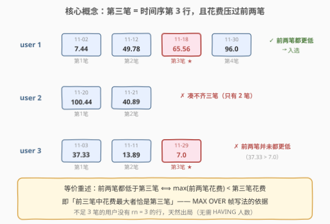
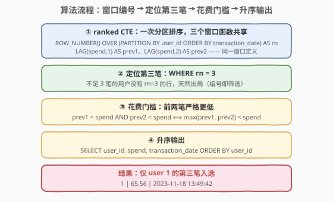
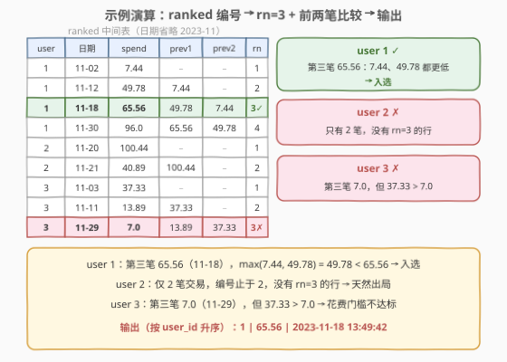

# 找到第三笔交易

- **题目名称**：找到第三笔交易
- **链接**：[2986. 找到第三笔交易](https://leetcode.cn/problems/find-third-transaction/)
- **难度**：中等
- **标签**：数据库、SQL、窗口函数、ROW_NUMBER、LAG、组内定位

## 1. 题目概述

> ⚠️ 本题为 LeetCode 付费题，题意描述根据官方示例用例与外部资料重建，可能与官方题面有出入。

**表结构**：`Transactions`

| 列名 | 类型 |
|------|------|
| user_id | int |
| spend | decimal |
| transaction_date | datetime |

- `(user_id, transaction_date)` 为该表主键——同一用户不会有两笔同一时刻的交易。
- 每行记录一笔交易：用户 id、花费、交易时间。

**目标**：编写查询，找出**符合条件的用户的第三笔交易**：

1. 用户**至少有三笔**交易，「第三笔」按 `transaction_date` 升序确定；
2. 该用户**前两笔交易的花费都严格低于**第三笔交易的花费。

输出 `user_id`、`spend`、`transaction_date` 三列，按 `user_id` **升序**返回。

**示例 1**：

```text
输入：
Transactions 表:
+---------+--------+---------------------+
| user_id | spend  | transaction_date    |
+---------+--------+---------------------+
| 1       | 65.56  | 2023-11-18 13:49:42 |
| 1       | 96.0   | 2023-11-30 02:47:26 |
| 1       | 7.44   | 2023-11-02 12:15:23 |
| 1       | 49.78  | 2023-11-12 00:13:46 |
| 2       | 40.89  | 2023-11-21 04:39:15 |
| 2       | 100.44 | 2023-11-20 07:39:34 |
| 3       | 37.33  | 2023-11-03 06:22:02 |
| 3       | 13.89  | 2023-11-11 16:00:14 |
| 3       | 7.0    | 2023-11-29 22:32:36 |
+---------+--------+---------------------+

输出：
+---------+-------+---------------------+
| user_id | spend | transaction_date    |
+---------+-------+---------------------+
| 1       | 65.56 | 2023-11-18 13:49:42 |
+---------+-------+---------------------+

解释：
- user 1 共 4 笔，按时间排序：7.44（11-02）→ 49.78（11-12）→ 65.56（11-18）→ 96.0（11-30）。
  第三笔 65.56，前两笔 7.44、49.78 都更低 → 入选。
- user 2 只有 2 笔交易，凑不出第三笔 → 不出现。
- user 3 第三笔是 7.0（11-29），但首笔花费 37.33 > 7.0，不满足「前两笔都更低」→ 淘汰。
```

**约束条件**：

- `(user_id, transaction_date)` 组合唯一（用户内时间戳无重复，编号无平局歧义）
- `spend` 为金额，可能为小数
- 「前两笔」指按时间排序的第 1、2 笔；「低于」为**严格小于**

> 💡 读题三个关键点：①「第三笔」是**按时间排序的第 3 行**，不是花费第三大——用 `ROW_NUMBER` 而非花费排名；② 隐藏门槛「**前两笔花费都严格更低**」正是本题标 Medium 的原因，只写 `rn = 3` 会放过 user 3 这类反例；③ 不足 3 笔的用户（user 2）天然不出现。

---

## 2. 解题思路

### 2.1 暴力思路：相关子查询逐行判定

对表中每一行 `t`，用**相关子查询**数一数「同一用户中时间更早的交易有几笔」——恰好 2 笔说明 `t` 是该用户的第三笔；再用 `NOT EXISTS` 检查更早的交易里**没有**花费 ≥ 本行的：

```sql
SELECT t.user_id, t.spend, t.transaction_date
FROM Transactions t
WHERE (SELECT COUNT(*)
       FROM Transactions x
       WHERE x.user_id = t.user_id
         AND x.transaction_date < t.transaction_date) = 2
  AND NOT EXISTS (SELECT 1
                  FROM Transactions y
                  WHERE y.user_id = t.user_id
                    AND y.transaction_date < t.transaction_date
                    AND y.spend >= t.spend)
ORDER BY t.user_id;
```

逻辑正确，但**每一行都触发一次子查询**重扫同用户的全部交易：$O(n^2)$。「谁是第三笔」「前两笔是谁」这两个问题本质上只取决于**每个用户内部的一次排序**，而排序恰恰是窗口函数的看家本领。

### 2.2 核心观察：ROW_NUMBER 定位第三笔 + LAG 回看前两笔



**观察一：「第三笔」= 分区内时间序第 3 行。**

按 `ROW_NUMBER() OVER (PARTITION BY user_id ORDER BY transaction_date)` 编号，`WHERE rn = 3` 一步定位。**不足 3 笔的用户没有 rn = 3 的行**，无需再写 `HAVING COUNT(*) >= 3`——编号即筛选。主键保证用户内时间戳唯一，`ROW_NUMBER` 不存在平局歧义。

**观察二：「前两笔都低于第三笔」= 第三笔是前三笔中的最大花费。**

记某用户前三笔花费为 $s_1, s_2, s_3$，条件 $s_1 < s_3 \wedge s_2 < s_3$ 等价于：

$$\max(s_1, s_2) < s_3$$

于是有两种窗口写法：

| 写法 | 表达式 | 特点 |
|------|--------|------|
| 双 `LAG` 回看 | `LAG(spend,1) < spend AND LAG(spend,2) < spend` | 直译题意，逐笔比较 |
| `MAX` 帧聚合 | `MAX(spend) OVER (... ROWS BETWEEN 2 PRECEDING AND 1 PRECEDING) < spend` | 「前两笔的 max」一步到位，泛化友好 |

`ROWS BETWEEN 2 PRECEDING AND 1 PRECEDING` 这个**物理帧**恰好圈住「当前行之前的两行」——对 rn = 3 的行来说就是前两笔，取 `MAX` 正是 $\max(s_1, s_2)$。

> 💡 与 [550. 游戏玩法分析 IV](../0501-0600/550_游戏玩法分析IV.md) 的「定位首笔」同构：那题 `ROW_NUMBER = 1` 找首日登录，本题 `ROW_NUMBER = 3` 找第三笔——「组内第 N 行」是同一模板换参数。本题多出的 LAG/MAX 回看比较，与 [1532. 最近的三笔订单](../1501-1600/1532_最近的三笔订单.md) 里「回看最近三笔」是同款操作，只是方向相反（本题看最早的三笔）。

### 2.3 算法流程图



**逻辑执行步骤**：

| 步骤 | 操作 | 作用 |
|------|------|------|
| ① | `ranked` CTE：`ROW_NUMBER` + 两个 `LAG` | 一次分区排序，三个窗口函数共享 |
| ② | `WHERE rn = 3` | 定位第三笔；不足 3 笔的用户自动出局 |
| ③ | `prev1 < spend AND prev2 < spend` | 花费门槛：前两笔严格更低 |
| ④ | `ORDER BY user_id` | 按 user_id 升序输出三列 |

> 💡 三个窗口函数的 `OVER` 规范完全相同（`PARTITION BY user_id ORDER BY transaction_date`），优化器只做**一次**分区排序——不是三次。MySQL 8.0 还支持 `WINDOW w AS (...)` 命名复用，见参考代码解法 B。

### 2.4 示例演算



`ranked` 中间表（按用户、时间排序，日期省略年份 2023-11）：

| user_id | 日期 | spend | prev1 | prev2 | rn | 判定 |
|---------|------|-------|-------|-------|----|------|
| 1 | 11-02 | 7.44 | – | – | 1 | |
| 1 | 11-12 | 49.78 | 7.44 | – | 2 | |
| 1 | 11-18 | 65.56 | 49.78 | 7.44 | 3 | ✓ 两笔都更低 → **入选** |
| 1 | 11-30 | 96.0 | 65.56 | 49.78 | 4 | |
| 2 | 11-20 | 100.44 | – | – | 1 | |
| 2 | 11-21 | 40.89 | 100.44 | – | 2 | ✗ 无 rn=3 → 出局 |
| 3 | 11-03 | 37.33 | – | – | 1 | |
| 3 | 11-11 | 13.89 | 37.33 | – | 2 | |
| 3 | 11-29 | 7.0 | 13.89 | 37.33 | 3 | ✗ 37.33 > 7.0 → 出局 |

- **user 1**：第三笔 65.56，$\max(7.44, 49.78) = 49.78 < 65.56$ ✓
- **user 2**：只有两行，编号到 2 为止，没有 rn=3 的行，天然出局
- **user 3**：第三笔 7.0，但 $\max(37.33, 13.89) = 37.33 \not< 7.0$ ✗

> ⚠️ user 3 是本题的「陷阱用例」：只写 `WHERE rn = 3` 会把它也选进来——**定位**（rn = 3）与**门槛**（前两笔更低）是两个独立的过滤条件，缺一不可。

---

## 3. 参考代码

### MySQL（ROW_NUMBER + LAG，直译题意）

```sql
# Write your MySQL query statement below
WITH ranked AS (
    SELECT
        user_id,
        spend,
        transaction_date,
        ROW_NUMBER() OVER (
            PARTITION BY user_id
            ORDER BY transaction_date
        ) AS rn,
        LAG(spend, 1) OVER (
            PARTITION BY user_id
            ORDER BY transaction_date
        ) AS prev1,
        LAG(spend, 2) OVER (
            PARTITION BY user_id
            ORDER BY transaction_date
        ) AS prev2
    FROM Transactions
)
SELECT user_id, spend, transaction_date
FROM ranked
WHERE rn = 3
  AND prev1 < spend
  AND prev2 < spend
ORDER BY user_id;
```

> 💡 **写法要点**：
> - 三个窗口函数 `OVER` 规范相同，实际只做**一次**分区排序；
> - `rn = 3` 的行必然存在 `prev1`/`prev2`（同分区恰有两行在前），`LAG` 的 `NULL` 只出现在分区头部两行，不会误伤；
> - `ORDER BY user_id` 满足题目要求的升序输出。

### MySQL（MAX OVER 帧 + 命名窗口，泛化友好）

```sql
# Write your MySQL query statement below
WITH ranked AS (
    SELECT
        user_id,
        spend,
        transaction_date,
        ROW_NUMBER() OVER w AS rn,
        MAX(spend) OVER (
            PARTITION BY user_id
            ORDER BY transaction_date
            ROWS BETWEEN 2 PRECEDING AND 1 PRECEDING
        ) AS prev_max
    FROM Transactions
    WINDOW w AS (PARTITION BY user_id ORDER BY transaction_date)
)
SELECT user_id, spend, transaction_date
FROM ranked
WHERE rn = 3
  AND prev_max < spend
ORDER BY user_id;
```

> 💡 **写法要点**：
> - 帧 `ROWS BETWEEN 2 PRECEDING AND 1 PRECEDING` 恰好覆盖「前两行」，对 rn=3 即前两笔，`prev_max < spend` 就是 $\max(s_1, s_2) < s_3$；
> - `WINDOW w AS (...)` 命名窗口是 SQL 标准语法（MySQL 8.0 支持），一处定义多处复用；
> - 若推广到「第 k 笔且前 k−1 笔都更低」，只需 `rn = k` + 帧改为 `ROWS BETWEEN k-1 PRECEDING AND 1 PRECEDING`，不用枚举 k−1 个 LAG。

### Python（pandas）

```python
import pandas as pd

def find_third_transaction(transactions: pd.DataFrame) -> pd.DataFrame:
    t = transactions.sort_values('transaction_date').copy()
    spend_by_user = t.groupby('user_id')['spend']
    t['rn'] = t.groupby('user_id').cumcount() + 1
    t['prev1'] = spend_by_user.shift(1)
    t['prev2'] = spend_by_user.shift(2)
    hit = t[(t['rn'] == 3)
            & (t['prev1'] < t['spend'])
            & (t['prev2'] < t['spend'])]
    return hit[['user_id', 'spend', 'transaction_date']].sort_values('user_id')
```

> 💡 **pandas 对照**：先全局按时间排序，`groupby('user_id').cumcount() + 1` 对应 `ROW_NUMBER`（组内从 1 连续编号），`groupby.shift(k)` 对应 `LAG(spend, k)`。NaN 参与比较得 `False`，与 SQL 中 `NULL` 比较得 `UNKNOWN` 被 `WHERE` 过滤的行为一致。

---

## 4. 复杂度分析

| 维度 | 复杂度 | 说明 |
|------|--------|------|
| **时间** | $O(n \log n)$ | 窗口函数按 `(user_id, transaction_date)` 分区排序一次；编号与 LAG 在排序结果上线性扫过 |
| **空间** | $O(n)$ | CTE 中间表与排序缓冲 |
| **暴力对照** | $O(n^2)$ | 相关子查询每行重扫同用户交易（2.1） |

> ⚠️ $n$ 为 `Transactions` 行数。若用户数为 $u$、平均每人 $m$ 笔，分区排序代价 $\sum_i m_i \log m_i \le n \log n$；`LAG`/`MAX` 是排序后的单遍扫描，不改变量级。

---

## 5. 扩展

### 5.1 无窗口函数（MySQL 5.7）：JOIN + GROUP BY + HAVING

```sql
-- 不使用窗口函数 / CTE，兼容 MySQL 5.7
SELECT a.user_id, a.spend, a.transaction_date
FROM Transactions a
JOIN Transactions b
  ON b.user_id = a.user_id
 AND b.transaction_date < a.transaction_date
GROUP BY a.user_id, a.spend, a.transaction_date
HAVING COUNT(*) = 2
   AND MAX(b.spend) < a.spend
ORDER BY a.user_id;
```

> 💡 语义直译：对候选行 `a`，把它「更早的同用户交易」全部 JOIN 进来——恰好 2 笔 ⇔ `a` 是第三笔（`COUNT(*) = 2`），且这 2 笔的最大花费更低 ⇔ 前两笔都更低（`MAX(b.spend) < a.spend`）。两个 HAVING 条件与窗口版的 `rn = 3`、`prev_max < spend` 一一对应。代价是 JOIN 展开为 $\sum_i \binom{m_i}{2}$ 行中间结果，仍是 $O(n^2)$ 级——用正确性与兼容性换性能。

### 5.2 泛化：第 k 笔且前 k−1 笔都更低

| 方案 | 修改点 |
|------|--------|
| 窗口 + MAX 帧 | `rn = k`，帧改 `ROWS BETWEEN k-1 PRECEDING AND 1 PRECEDING`，条件不变 |
| 窗口 + LAG | 需枚举 `LAG(spend, 1..k-1)` 共 k−1 个比较 |
| 5.1 的 JOIN 版 | `HAVING COUNT(*) = k-1 AND MAX(b.spend) < a.spend`，**零结构改动** |

注意与「第 k 大」一族（[176. 第二高的薪水](../0101-0200/176_第二高的薪水.md)、[177. 第N高的薪水](../0101-0200/177_第N高的薪水.md)）区分：那一族按**值**去重排名（`DENSE_RANK`），本题一族按**行**时序编号（`ROW_NUMBER`）——两个「第 N」语义不同，面试先分清再动手。

### 5.3 平局问题：同一用户同一时刻两笔交易

`ROW_NUMBER` 遇到并列 `ORDER BY` 键会**任意**打破平局——若允许同刻交易，「第三笔」本身不再良定义（两种不同的 rn=3 都说得通）。工程上两道保险：

1. `ORDER BY transaction_date, id`（自增主键）追加**决定性次序键**，保证结果可复现；
2. 若业务语义是「第三个不同日期」，改用 `DENSE_RANK() OVER (PARTITION BY user_id ORDER BY DATE(transaction_date))`，同日多笔算一个名次。

本题主键 `(user_id, transaction_date)` 已排除平局，但主动指出这一假设是面试加分项。

---

## 6. 面试要点

1. **「第三笔交易」按什么排？和「花费第三高」有什么区别？**

   - 按 `transaction_date` 升序的**第 3 行**（`ROW_NUMBER`），不是花费排名。user 1 花费第三高是 49.78，第三笔是 65.56——两个口径完全不同。见 5.2 的「第 N 行 vs 第 N 大」对照。

2. **为什么不用显式排除不足 3 笔的用户（如 HAVING COUNT(*) >= 3）？**

   - `ROW_NUMBER` 编号后 `WHERE rn = 3`：不足 3 笔的用户没有 rn=3 的行，天然出局。「编号即筛选」是组内第 N 行问题的通用简化，多写 HAVING 反而多一次聚合。

3. **「前两笔花费都低于第三笔」有哪些等价表达？**

   - ① `LAG(spend,1) < spend AND LAG(spend,2) < spend`；② `MAX(spend) OVER (... ROWS BETWEEN 2 PRECEDING AND 1 PRECEDING) < spend`。② 是 $\max(s_1, s_2) < s_3$ 的直译，且泛化到第 k 笔时无需枚举 LAG。

4. **同一用户同一时刻有两笔交易怎么办？**

   - `ROW_NUMBER` 任意打破平局，「第三笔」不再良定义；应在 `ORDER BY` 追加决定性次序键（如自增 id）。本题主键保证无平局——主动指出该假设是加分项（见 5.3）。

5. **多个窗口函数会排序多次吗？**

   - 规范相同（同 `PARTITION BY` + `ORDER BY`）时只做**一次**分区排序，`ROW_NUMBER`/`LAG`/`MAX` 共享；也可用 `WINDOW w AS (...)` 命名复用（参考代码解法 B）。规范不同则各排各的，写 SQL 时尽量统一窗口定义。

> 💡 **一句话总结**：2986 = 「组内第 3 行」（`ROW_NUMBER` 定位第三笔）+「回看比较」（`LAG`/`MAX` 帧判断前两笔更低），两个窗口原语一次排序完成。user 3 这行反例专治「只写 rn=3」的漏读题者——**定位**与**门槛**是两个独立的过滤条件。

---

## 7. 同类练习题

- [1532. 最近的三笔订单](https://leetcode.cn/problems/the-most-recent-three-orders/)：同为「每位用户的第三笔」，但 `ORDER BY order_date DESC` 倒序找**最近**三笔再回连原表——本题正序找**最早**的镜像变体
- [176. 第二高的薪水](https://leetcode.cn/problems/second-highest-salary/)：「第 N 大的值」（去重排名 + `LIMIT`）与本题「第 N 行」（时序编号）的语义对照，两种「第 N」混用是最常见的 WA 原因
- [185. 部门工资前三高的所有员工](https://leetcode.cn/problems/department-top-three-salaries/)：`DENSE_RANK` 组内 Top-N、并列值全保留——与 `ROW_NUMBER`「只要第 3 行」的适用边界互补
- [550. 游戏玩法分析 IV](https://leetcode.cn/problems/game-play-analysis-iv/)：`ROW_NUMBER = 1` 定位组内首行 + 衍生比率判定，「定位第 1 笔」与本题「定位第 3 笔」同模板换参数
- [177. 第N高的薪水](https://leetcode.cn/problems/nth-highest-salary/)：N 参化的「第 N 大」模板，与 5.2 的「第 k 笔」泛化互相印证
