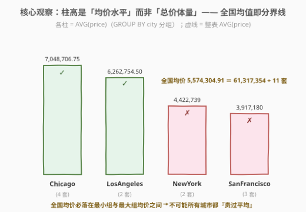
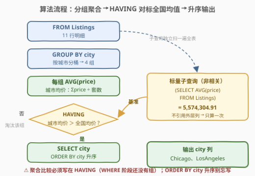
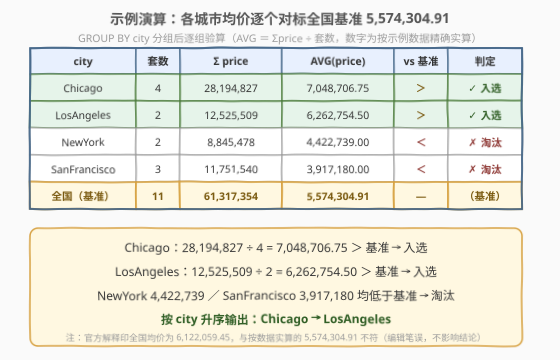

# LeetCode 寻找房价最贵的城市 题解

## 1. 题目概述

- **标题 / 题号**：寻找房价最贵的城市（#2987，easy）
- **链接**：https://leetcode.cn/problems/find-expensive-cities/
- **难度**：简单
- **标签**：SQL、数据库、GROUP BY、HAVING、AVG、子查询、聚合函数

> ⚠️ 本题为 LeetCode 付费题，题意描述根据官方示例用例与 hints 重建，可能与官方题面有出入。

**题意**：给定房源挂牌表 `Listings`，每行是一套待售房源：所在城市 `city` 与挂牌价 `price`。编写解决方案，找出**平均房价**超过**全国**（即全部房源整体）**平均房价**的**城市**，返回按 `city` **升序**排序的结果表，输出单列 `city`。

**表结构**：

```text
Table: Listings
+-------------+---------+
| Column Name | Type    |
+-------------+---------+
| listing_id  | int     |  ← 唯一列
| city        | varchar |
| price       | int     |
+-------------+---------+
```

**示例 1**：

```text
输入：
Listings 表:
+------------+--------------+---------+
| listing_id | city         | price   |
+------------+--------------+---------+
| 113        | LosAngeles   | 7560386 |
| 136        | SanFrancisco | 2380268 |
| 92         | Chicago      | 9833209 |
| 60         | Chicago      | 5147582 |
| 8          | Chicago      | 5274441 |
| 79         | SanFrancisco | 8372065 |
| 37         | Chicago      | 7939595 |
| 53         | LosAngeles   | 4965123 |
| 178        | SanFrancisco | 999207  |
| 51         | NewYork      | 5951718 |
| 121        | NewYork      | 2893760 |
+------------+--------------+---------+

输出：
+------------+
| city       |
+------------+
| Chicago    |
| LosAngeles |
+------------+

解释：
全国平均房价 = 61,317,354 ÷ 11 = 5,574,304.91，在列出的城市中：
- Chicago 的平均房价为 7,048,706.75，高于全国平均
- LosAngeles 的平均房价为 6,262,754.50，高于全国平均
- NewYork 的平均房价为 4,422,739，SanFrancisco 的平均房价为 3,917,180，均低于全国平均
只有 Chicago 和 LosAngeles 入选，按城市名升序输出。
```

> ⚠️ 官方示例解释中把全国均价印作 $6,122,059.45$（个别城市数字也有出入），与按示例数据实算的 $61,317,354 \div 11 = 5,574,304.91$ 不符，属官方编辑笔误——但两种基准下结论一致，均为 Chicago 与 LosAngeles 入选，不影响解题。

**约束条件**（按典型约束重建）：

- `listing_id` 是 `Listings` 中具有唯一值的列
- `price` 为正整数；同一城市可有多套房源
- 「超过」取**严格大于**语义；结果按 `city` 升序排序

> 💡 本题考点浓缩成一句：**分组聚合对标全局基准**——`GROUP BY` 分桶算组内均值、`HAVING` 做组级过滤、非相关子查询提供全局标量，三板斧缺一不可。它是 [1126. 查询活跃业务](../1101-1200/1126_查询活跃业务.md)「组统计量 vs 全体均值」这一经典模式的入门形态。

## 2. 解题思路

### 2.1 暴力思路：应用层循环 + N+1 查询

最直觉的笨办法是把聚合的活儿全揽到应用层：先发一条查询拿全国均价，再逐个城市发一条查询拿城市均价，在代码里比较、排序：

```sql
-- 第 1 趟：全国基准
SELECT AVG(price) FROM Listings;                        -- 5,574,304.91
-- 第 2 ~ k+1 趟：每个城市各来一发
SELECT AVG(price) FROM Listings WHERE city = 'Chicago'; -- 7,048,706.75
SELECT AVG(price) FROM Listings WHERE city = '...';     -- × k 次
```

$k$ 个城市就是 $k+1$ 次查询往返、$k+1$ 趟扫描，比较和排序全落在数据库之外——而「分组 → 组内聚合 → 组级过滤」本来就是 SQL 聚合引擎的原生职能，一条 `GROUP BY + HAVING` 就能全部下推回引擎。

另一个更隐蔽的直觉坑是拿**总价**比大小：Chicago 总价 $28{,}194{,}827$ 全场最高，但它挂了 4 套房——**房源套数（体量）和房价水平（均价）是两回事**，比较总价比的是谁房子多，不是谁房子贵。

> ⚠️ 暴力法的问题不在正确性而在表达力：SQL 引擎一次扫描就能同时完成分桶、聚合与过滤，把这件事拆成 $k+1$ 次往返，是用网络延迟换取代码直觉。

### 2.2 核心观察：分组聚合 + HAVING 对标全局标量



**问题本质**：对每个城市求 $\text{AVG}(\text{price})$，与整表的 $\text{AVG}(\text{price})$（一个标量）比较。三个关键洞察：

1. **分桶交给 `GROUP BY`**：一次扫描按 `city` 分桶，桶内 `AVG(price)` 自动完成「总和 ÷ 套数」——分母正是用来**消掉体量差异**的，让 4 套房的 Chicago 和 2 套房的 LosAngeles 站在同一标尺上比水平。

2. **聚合后的过滤写 `HAVING`**：SQL 逻辑执行顺序是 `FROM → WHERE → GROUP BY → HAVING → SELECT → ORDER BY`。`WHERE` 阶段逐行过滤、还没有「组」，`WHERE AVG(price) > ...` 直接报错（Invalid use of group function）；必须等 `GROUP BY` 分完组、每组算出聚合值后，由 `HAVING` 做组级过滤。

3. **全局均值是常量标量，写成非相关子查询**：`(SELECT AVG(price) FROM Listings)` 不引用外层的任何列，优化器只需对整表算一次 `AVG`，之后每个组拿这个常数参与比较。若误写成引用外层列的相关子查询，则可能退化为每组重算一趟。

外加一个漂亮的数学性质：**全国均价是各城市均价按套数占比的加权平均**，因此它必然落在最小组均价与最大组均价之间——**不可能所有城市都「贵过全国平均」**（否则加权平均高于自己，矛盾），严格高于基准的城市至多 $k-1$ 个。

### 2.3 算法流程图



**逻辑执行步骤**：

| 步骤 | 子句 | 作用 |
|------|------|------|
| ① | `FROM Listings` | 取 11 行明细 |
| ② | `GROUP BY city` | 按城市分桶 → 4 组 |
| ③ | `AVG(price)`（SELECT 列表） | 组内均价：Σprice ÷ 套数 |
| ④ | `(SELECT AVG(price) FROM Listings)` | 非相关子查询：全国基准 5,574,304.91，只算一次 |
| ⑤ | `HAVING AVG(price) > 基准` | 组级过滤，剩 Chicago、LosAngeles |
| ⑥ | `SELECT city` + `ORDER BY city` | 投影单列并升序排序 |

> 💡 主查询与子查询各自独立扫一遍 `Listings`，共约 $2n$ 行的扫描量；两者互不依赖，优化器可以自由安排执行顺序（子查询先行，结果当常数用）。

### 2.4 示例演算

以示例 1 数据逐组验算（价格为按数据精确实算）：



**分组验算表**：

| city | 套数 | Σprice | AVG(price) | vs 基准 5,574,304.91 | 判定 |
|------|------|--------|------------|----------------------|------|
| Chicago | 4 | 28,194,827 | 7,048,706.75 | ＞ | ✓ 入选 |
| LosAngeles | 2 | 12,525,509 | 6,262,754.50 | ＞ | ✓ 入选 |
| NewYork | 2 | 8,845,478 | 4,422,739.00 | ＜ | ✗ 淘汰 |
| SanFrancisco | 3 | 11,751,540 | 3,917,180.00 | ＜ | ✗ 淘汰 |
| **全国（基准）** | **11** | **61,317,354** | **5,574,304.91** | — | 基准 |

注意验算细节：全国基准**不是**四个城市均价的简单平均 $(7{,}048{,}706.75 + 6{,}262{,}754.50 + 4{,}422{,}739 + 3{,}917{,}180) \div 4 \approx 5{,}412{,}845$，而是全部 11 套房源的**逐套平均** $61{,}317{,}354 \div 11 \approx 5{,}574{,}304.91$——套数多的城市在全局基准中权重更大，这正是「加权平均」与「均值再平均」的分野（本题两种基准下结论恰好一致，但语义必须分清）。

最后按 `city` 升序输出：`Chicago` → `LosAngeles`。

## 3. 参考代码

### SQL（MySQL：GROUP BY + HAVING + 标量子查询）

```sql
# Write your MySQL query statement below
SELECT city
FROM Listings
GROUP BY city
HAVING AVG(price) > (SELECT AVG(price) FROM Listings)
ORDER BY city;
```

> 💡 **写法要点**：
> - **聚合比较必须落在 `HAVING`**：`WHERE` 阶段分组尚未发生，聚合值不存在。
> - **子查询不引用外层列**：非相关子查询被优化器物化为常量，整表只算一次 `AVG`。
> - **`ORDER BY city` 别漏**：题目要求升序；官方题解写 `ORDER BY 1`（按第 1 列位置排序）效果相同。
> - **输出列名 `city`**：与分组列同名天然满足，无需别名。

### SQL（窗口函数：一趟扫描双均值）

```sql
# Write your MySQL query statement below
SELECT DISTINCT city
FROM (
    SELECT city,
           AVG(price) OVER (PARTITION BY city) AS city_avg,
           AVG(price) OVER ()                  AS national_avg
    FROM Listings
) t
WHERE city_avg > national_avg
ORDER BY city;
```

> 💡 **写法要点**：
> - `AVG(price) OVER (PARTITION BY city)` 算城市均价、`AVG(price) OVER ()` 算全国均价，两个窗口函数在**同一趟扫描**内完成。
> - **窗口函数不收缩行数**：11 行进来还是 11 行出去，每行同时携带两个均值；外层 `WHERE` 此刻比较的是普通列（所以**能**用 WHERE），但同城市的行全同值，需 `DISTINCT` 去重。
> - 与解法一对比：窗口版少扫一遍表但多一次去重，`GROUP BY` 版语法更短、语义更直白——面试时两版都能写即是加分项。

### Python（pandas）

```python
import pandas as pd

def find_expensive_cities(listings: pd.DataFrame) -> pd.DataFrame:
    national_avg = listings['price'].mean()
    expensive = listings.groupby('city')['price'].mean().loc[lambda s: s > national_avg].index
    return pd.DataFrame({'city': expensive})
```

> 💡 **pandas 对照**：`listings['price'].mean()` 对应整表 `AVG`，`groupby('city')['price'].mean()` 对应 `GROUP BY + AVG`，布尔索引 `.loc[lambda s: s > ...]` 对应 `HAVING` 过滤；`groupby` 默认按键排序，天然满足 `ORDER BY city` 升序。同样别写成 `(listings.groupby('city')['price'].sum()).nlargest()`——比总高价就是比体量。

## 4. 复杂度分析

| 维度 | 复杂度 | 说明 |
|------|--------|------|
| **时间** | $O(n)$ | 主查询一趟 $O(n)$ + 子查询全表 `AVG` 一趟 $O(n)$，共约 $2n$；末尾排序 $O(k \log k)$，$k$ 为城市数 $\le n$ |
| **空间** | $O(k)$ | 分组中间态每组一行（本题 4 行），与房源总数无关 |
| **输出行数** | $\le k-1$ | 严格高于基准的城市至多 $k-1$ 个（全国基准是组均值的加权平均，不可能人人高于它，见 2.2） |

> ⚠️ 对比暴力法：$k+1$ 次往返 ≈ $O(k \cdot n)$ 次扫描 + $O(k)$ 网络往返；一条语句把代价压回 $O(n)$，且比较、过滤、排序全部下推进引擎。

## 5. 扩展

### 5.1 WHERE 与 HAVING 的分工

| 阶段 | 子句 | 过滤对象 | 能否用聚合函数 |
|------|------|----------|----------------|
| 分组前 | `WHERE` | 逐**行**过滤 | ✗（聚合值尚不存在） |
| 分组后 | `HAVING` | 逐**组**过滤 | ✓ |

养成习惯：**能下推到 WHERE 的条件绝不留在 HAVING**——WHERE 先缩行再分组，扫描量更小。本题的比较对象是聚合值（城市均价），天然只能走 HAVING；但如果题目附加「只统计 price > 100 万的房源」，这个行级条件就应当写进 WHERE。

### 5.2 「先聚合后过滤」的三种等价形态

```sql
-- 形态二：派生表——先分组物化成 4 行，再当普通表过滤
SELECT city
FROM (
    SELECT city, AVG(price) AS city_avg
    FROM Listings
    GROUP BY city
) t
WHERE city_avg > (SELECT AVG(price) FROM Listings)
ORDER BY city;
```

派生表版里 `city_avg` 已是物化列，外层用 `WHERE` 完全合法——「必须 HAVING」只是针对**同一层**查询里聚合值的限制。加上 2.2 的子查询版与 3 中的窗口版，三种形态殊途同归，面试可视追问灵活切换。

### 5.3 均值的数学约束与统计口径

- **不可能人人高于平均**：全国均价 $= \sum_c \frac{n_c}{n} \cdot \bar{p}_c$ 是组均值的凸组合（权重为各城套数占比），必然落在 $[\min \bar{p}_c, \max \bar{p}_c]$ 内。所以输出至多 $k-1$ 行——这是个一秒可验证的结果正确性 sanity check。
- **均价 vs 中位数**：一套 $9{,}833{,}209$ 的豪宅就能把 Chicago 的均价拉高不少。若面试官追问「换成中位数当基准怎么写」，均值这条路走不通（中位数不是有限个 $\sum$ 的组合），需按价格排序后用窗口函数或自连接定位——思路与 [2985. 计算订单平均商品数量](../2901-3000/2985_计算订单平均商品数量.md) 5.2 节的压缩表中位数一脉相承。

## 6. 面试要点

1. **为什么比较必须写在 HAVING 而不是 WHERE？**

   - 逻辑执行顺序 `FROM → WHERE → GROUP BY → HAVING → SELECT → ORDER BY`：WHERE 在分组前逐行执行，聚合值尚不存在，`WHERE AVG(price) > ...` 直接语法报错；HAVING 作用在分完组、算完聚合之后，才能引用 `AVG(price)`。

2. **HAVING 里的子查询会执行几次？怎么保证只算一次？**

   - `(SELECT AVG(price) FROM Listings)` 不引用外层任何列，是**非相关子查询**，优化器（MySQL 8.0）只对整表计算一次并作为常量参与各组比较；若写成相关子查询（引用外层 `city` 之类），则可能每组重算一趟，复杂度从 $O(n)$ 退化到 $O(k \cdot n)$。

3. **HAVING 里能直接引用 SELECT 列表的别名吗？**

   - MySQL 允许（方言扩展），`HAVING city_avg > (SELECT ...)` 加别名写法能跑；但标准 SQL 不保证别名在 HAVING 可见，跨方言（PostgreSQL 严格模式）会报错——稳妥写法是 HAVING 里重复 `AVG(price)`，或改用 5.2 的派生表形态。

4. **拿 SUM(price) 比较总价行不行？**

   - 不行。房源多的城市总价天然更大，比的是**体量**不是**价格水平**；均价的分母（套数）正是为了消除体量差异。本题里 Chicago 总价最高（4 套），但它恰好均价也最高纯属巧合——若 NewYork 也挂 4 套，其总价 $2 \times 4{,}422{,}739$ 将超过 LosAngeles，用总价就判错了。

5. **可能所有城市都高于全国均价吗？输出最多几行？**

   - 不可能。全国均价是各城均价按套数占比的**加权平均**（凸组合），必落在最小组均值与最大组均值之间；除非全部城市均价相等（此时无人「严格高于」），否则严格高于基准的城市至多 $k-1$ 个。能主动讲出这条不变量，说明对均值语义的理解超出背语法。

> 💡 **一句话总结**：2987 是「组统计量对标全局基准」的最简形态——`GROUP BY city` 立标尺、`HAVING` 做裁判、非相关子查询递基准值。把「WHERE/HAVING 分工」「相关/非相关子查询」「均值消体量」三件事讲透，再看 [1126. 查询活跃业务](../1101-1200/1126_查询活跃业务.md) 的同构升级就不迷路了。

## 同类练习题

| # | 题目 | 与本题的关联 |
|---|------|-------------|
| 1126 | [查询活跃业务](https://leetcode.cn/problems/active-businesses/) | 「组统计量 vs 全体均值 → HAVING 过滤」的同构招牌题，业务的事件次数对标该事件类型在全体的平均次数，多一层分组维度 |
| 1211 | [查询结果的质量和占比](https://leetcode.cn/problems/queries-quality-and-percentage/) | `GROUP BY` + `AVG` + `ROUND` 聚合基本功，练习分组统计的标准输出格式 |
| 1251 | [平均售价](https://leetcode.cn/problems/average-selling-price/) | 分组加权平均 `SUM(price × units) / SUM(units)`，体会均值分母承载的权重语义 |
| 1174 | [即时食物配送 II](https://leetcode.cn/problems/immediate-food-delivery-ii/) | `MIN` 定位首单 + `AVG` 算比率，组级聚合与全局统计混编的进阶组合 |
| 1934 | [确认率](https://leetcode.cn/problems/confirmation-rate/) | LEFT JOIN 全员保全 + `AVG`（布尔转 0/1 即比率），分组聚合在「缺失组」上的行为辨析 |
