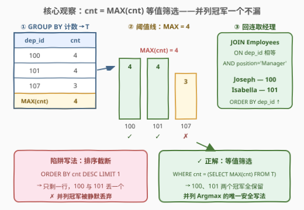
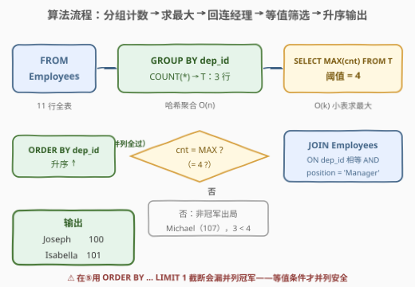
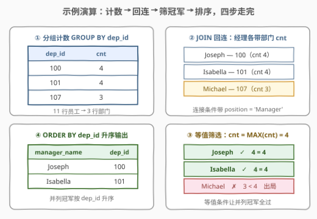

# 最大部门的经理

- **题目名称**：最大部门的经理
- **链接**：[2988. 最大部门的经理](https://leetcode.cn/problems/manager-of-the-largest-department/)
- **难度**：中等
- **标签**：SQL、GROUP BY 聚合、子查询求 MAX、并列最值（Argmax）、JOIN、窗口函数 RANK

## 1. 题目概述

> ⚠️ 本题为 LeetCode 付费题，题意描述根据官方示例用例与 hints 重建，可能与官方题面有出入。

给定员工表 `Employees`，每行是一位员工及其所属部门与职位。编写解决方案，找出**最大部门**（员工数最多的部门）的**经理**（`position = 'Manager'` 的员工）的姓名。**当多个部门员工数相同且并列最大时，这些部门的经理都要返回**。结果按 `dep_id` **升序**排列。

**表结构**：

```text
Table: Employees
+-------------+---------+
| Column Name | Type    |
+-------------+---------+
| emp_id      | int     |  ← 唯一列
| emp_name    | varchar |
| dep_id      | int     |  ← 部门编号
| position    | varchar |  ← 职位（Manager / Engineer / …）
+-------------+---------+
```

**示例 1**：

```text
输入：
Employees 表:
+--------+----------+--------+---------------+
| emp_id | emp_name | dep_id | position      |
+--------+----------+--------+---------------+
| 156    | Michael  | 107    | Manager       |
| 112    | Lucas    | 107    | Consultant    |
| 8      | Isabella | 101    | Manager       |
| 160    | Joseph   | 100    | Manager       |
| 80     | Aiden    | 100    | Engineer      |
| 190    | Skylar   | 100    | Freelancer    |
| 196    | Stella   | 101    | Coordinator   |
| 167    | Audrey   | 100    | Consultant    |
| 97     | Nathan   | 101    | Supervisor    |
| 128    | Ian      | 101    | Administrator |
| 81     | Ethan    | 107    | Administrator |
+--------+----------+--------+---------------+

输出：
+--------------+--------+
| manager_name | dep_id |
+--------------+--------+
| Joseph       | 100    |
| Isabella     | 101    |
+--------------+--------+

解释：
- 部门 100 与部门 101 各有 4 名员工，部门 107 只有 3 名员工；
- 100 与 101 并列最大，两个部门的经理 Joseph、Isabella 都在结果中；
- 结果按 dep_id 升序排列。
```

**约束条件**：

- `emp_id` 是 `Employees` 中具有唯一值的列
- 部门大小 = 该部门**全部员工**的人数（不止是 Manager）
- 并列最大时返回多行；输出列为 `manager_name` 与 `dep_id`，按 `dep_id` 升序

> 💡 本题考点浓缩在一个词上：**并列**。它考察的是 SQL 里 **Argmax（取最大者所在行）** 的标准姿势——当最大值可能并列时，「排序取一」(`ORDER BY ... LIMIT 1`) 会静默漏解，正确表达是**等值筛选** `cnt = MAX(cnt)`。这与 [1076. 项目员工II](../1001-1100/1076_项目员工II.md) 是同一套「最大组可能并列、全部返回」的套路，只是多了一步「从组回到人」的连接。

---

## 2. 解题思路

### 2.1 暴力思路：排序取一（漏并列）与相关子查询（平方级）

**直觉错误写法**——「找最大的部门」最直觉的 SQL 是排序后取第一条：

```sql
SELECT dep_id, COUNT(*) AS cnt
FROM Employees
GROUP BY dep_id
ORDER BY cnt DESC
LIMIT 1;        -- ✗ 只拿到 100（或 101），漏掉另一个并列冠军！
```

`LIMIT 1` 隐含「最大值唯一」的假设，而本题示例里 100 与 101 **并列** 4 人——排序截断会静默丢掉一个部门，且通常不报错，是本题最阴的坑。

**正确但笨的暴力**——对每个部门的经理行用相关子查询现场数人数，再逐行判断是否为最大：

```text
for each employee e with position = 'Manager':
    cnt(e) = SELECT COUNT(*) FROM Employees WHERE dep_id = e.dep_id   # 每次都扫同部门全部行
    if cnt(e) == max over all cnt:    # max 又要再算一遍
        output e
```

每位经理都要重扫其所在部门，代价 $O(n \cdot k)$（$k$ 为部门数），最坏 $O(n^2)$；而且「max over all cnt」若也写成相关子查询，嵌套更深。逻辑没错，但在 $n = 10^5$ 级别的员工表上跑不动。

> ⚠️ 暴力的两种死法各有教训：`LIMIT 1` 是**语义错**（漏并列），相关子查询是**性能错**（重复计数）。正解需要一次性把「每个部门多少人」物化成中间表，后面的筛选都基于它进行。

### 2.2 核心观察：Argmax 要「等值筛选」，不要「排序截断」



**问题本质**是一个两粒度问题：**部门的大小**（每部门一个数）与**经理的名字**（挂在某位成员行上）分属两个层级，解法自然分三步：

1. **分组计数**：`GROUP BY dep_id` 把 $n$ 行员工表压缩成 $k$ 行中间表 $T(\text{dep\_id}, \text{cnt})$——每部门一行，这趟哈希聚合是 $O(n)$ 的；
2. **等值筛选最大组**：在 $T$ 上求 $\text{MAX(cnt)}$，再用 `cnt = MAX` 筛选。**关键在于「=」而不是「排序取一」**——等值条件天然保留所有并列冠军；

   $$\text{Argmax 集} = \{\, \text{dep} : \text{cnt}(\text{dep}) = \max_{\text{dep}'} \text{cnt}(\text{dep}') \,\}$$

3. **连回员工表取经理**：最大部门的编号要换回经理姓名，需 `JOIN Employees ON dep_id 相等 AND position = 'Manager'`——连接条件里带上职位过滤，把「部门级」信息翻译成「人员级」答案。

> 💡 把「找最大组」和「找组里的人」拆成**分组（GROUP BY）→ 筛组（cnt = MAX）→ 回连（JOIN）**三段，是「分组 Top-1」类题目的通用范式。[602. 好友申请II谁有最多的好友](../0601-0700/602_好友申请II谁有最多的好友.md) 用 `HAVING cnt = (SELECT MAX(cnt) ...)` 把②③压进 HAVING，是同一思想的另一种排版。

### 2.3 算法流程图



**逻辑执行步骤**：

| 步骤 | 操作 | 作用 |
|------|------|------|
| ① | `FROM Employees` | 全表扫描，进入聚合 |
| ② | `GROUP BY dep_id` + `COUNT(*)` | 哈希聚合，得中间表 $T$：`(dep_id, cnt)`，示例中 3 行 |
| ③ | `SELECT MAX(cnt) FROM T` | 在 $k$ 行小表上求阈值，示例中 = 4 |
| ④ | `JOIN Employees ON dep_id AND position='Manager'` | 部门级连回人员级，只留经理行 |
| ⑤ | `WHERE cnt = MAX(cnt)` | 等值筛掉非最大部门（107 的 3 < 4 被淘汰） |
| ⑥ | `ORDER BY dep_id` | 100 → 101 升序输出 |

> 💡 步骤③的 `MAX` 作用在**中间表 $T$（仅 $k$ 行）**而非原表上——这就是「先分组再求最大」的意义：把 $O(n)$ 的求最大问题降为 $O(k)$。CTE（`WITH T AS ...`）让 $T$ 在③⑤两处复用而不必写两遍子查询。

### 2.4 示例演算



**第一步：分组计数**（对 `Employees` 按 `dep_id` 聚合）：

| dep_id | 员工 | cnt |
|--------|------|-----|
| 100 | Joseph, Aiden, Skylar, Audrey | **4** |
| 101 | Isabella, Stella, Nathan, Ian | **4** |
| 107 | Michael, Lucas, Ethan | 3 |

**第二步：求最大并筛选**：$\text{MAX(cnt)} = 4$，等值筛选保留 `dep_id ∈ {100, 101}`，107 出局。

**第三步：回连取经理**：

| dep_id | position='Manager' 的行 | manager_name |
|--------|--------------------------|--------------|
| 100 | (160, Joseph, 100, Manager) | Joseph |
| 101 | (8, Isabella, 101, Manager) | Isabella |

**第四步：排序输出**：`ORDER BY dep_id` → `(Joseph, 100), (Isabella, 101)`。

> ⚠️ 若第二步写成 `ORDER BY cnt DESC LIMIT 1`，只会剩下 100 或 101 其中之一——示例这个精心构造的**平局**正是出题人埋给「排序截断」写法的检测用例。

---

## 3. 参考代码

### SQL（MySQL，CTE + 等值连接）

```sql
# Write your MySQL query statement below
WITH T AS (
    SELECT dep_id, COUNT(*) AS cnt
    FROM Employees
    GROUP BY dep_id
)
SELECT e.emp_name AS manager_name, t.dep_id
FROM T AS t
JOIN Employees AS e
     ON t.dep_id = e.dep_id
    AND e.position = 'Manager'
WHERE t.cnt = (SELECT MAX(cnt) FROM T)
ORDER BY t.dep_id;
```

> 💡 **写法要点**：
> - **CTE 复用**：`T` 在 `JOIN` 与标量子查询里各用一次，MySQL 8 的 CTE 物化后只算一遍。
> - **连接条件带 `position = 'Manager'`**：比 `WHERE e.position = 'Manager'` 更早过滤，语义同为内连接，可读性上「连经理」意图更明显。
> - **`cnt = (SELECT MAX(cnt) FROM T)`**：等值筛选是并列 Argmax 的正确表达；想换排版可把条件挪进 `HAVING`（见扩展 5.2）。

### SQL（窗口函数版：RANK 天然表达并列）

```sql
# Write your MySQL query statement below
WITH T AS (
    SELECT dep_id, cnt,
           RANK() OVER (ORDER BY cnt DESC) AS rk
    FROM (
        SELECT dep_id, COUNT(*) AS cnt
        FROM Employees
        GROUP BY dep_id
    ) AS g
)
SELECT e.emp_name AS manager_name, t.dep_id
FROM T AS t
JOIN Employees AS e
     ON t.dep_id = e.dep_id
    AND e.position = 'Manager'
WHERE t.rk = 1
ORDER BY t.dep_id;
```

> 💡 **写法要点**：
> - **`RANK()` 对并列值给同一秩**：100 与 101 的 cnt 都是 4，`RANK()` 都记 1，`rk = 1` 恰好选出所有并列冠军——窗口函数版的「等值筛选」由秩的语义自动完成。
> - **千万别用 `ROW_NUMBER()`**：它强制把并列的 4、4 编成 1、2，`rn = 1` 只剩一个部门，退化成 `LIMIT 1` 的错误。
> - `DENSE_RANK()` 在本题与 `RANK()` 等价（只关心第 1 名）。

### Python（pandas）

```python
import pandas as pd

def find_manager(employees: pd.DataFrame) -> pd.DataFrame:
    cnt = employees.groupby('dep_id')['emp_id'].transform('count')  # 部门大小广播到每行
    mgr = employees[(cnt == cnt.max()) & (employees['position'] == 'Manager')]
    return (mgr[['emp_name', 'dep_id']]
            .rename(columns={'emp_name': 'manager_name'})
            .sort_values('dep_id'))
```

> 💡 **pandas 对照**：`transform('count')` 把「每部门人数」广播回每一行，等价于 SQL 里「分组表 JOIN 回原表」两步合一；`cnt == cnt.max()` 即等值筛选。注意 `transform` 返回的 Series 与 `employees` 行对齐，布尔下标与 `position` 条件按位与——与 SQL 的 `AND` 语义一致。

---

## 4. 复杂度分析

| 维度 | 复杂度 | 说明 |
|------|--------|------|
| **时间** | $O(n)$ | ① 分组计数一趟 $O(n)$（哈希聚合）；② 在 $k$ 行中间表上求 MAX 为 $O(k)$；③ JOIN 回表哈希连接 $O(n)$；整体线性 |
| **空间** | $O(k)$ | 中间表 $T$ 每部门一行（$k$ = 部门数）；哈希连接的构建侧同为 $O(k)$ 或 $O(n)$（视优化器选择） |
| **输出行数** | = 并列最大部门数 | 并列冠军有几个部门就有几行；本题无并列保证时退化为 1 行 |

> ⚠️ 相关子查询暴力为 $O(n \cdot k)$：每位经理都重扫一遍所在部门。当 $k \to n$（部门都很小）时逼近 $O(n^2)$——「一次物化、处处复用」正是 CTE 写法对它的降维打击。

---

## 5. 扩展：SQL 里 Argmax 的三种写法与并列语义

### 5.1 排序截断 vs 等值筛选 vs 窗口秩

| 写法 | 并列最大时的行为 | 本题可用 |
|------|------------------|----------|
| `ORDER BY cnt DESC LIMIT 1` | 只返回一行（顺序不定） | ✗ 漏解 |
| `cnt = (SELECT MAX(cnt) FROM T)` | 返回全部并列冠军 | ✓ |
| `RANK() OVER (ORDER BY cnt DESC) = 1` | 返回全部并列冠军 | ✓ |
| `ROW_NUMBER() OVER (ORDER BY cnt DESC) = 1` | 只返回一行 | ✗ 漏解 |

判断标准一句话：**先用等值/秩语义判断「它怎么处理平局」，再决定能不能用它做 Argmax**。

### 5.2 HAVING 版本：把筛选压进分组阶段

```sql
SELECT e.emp_name AS manager_name, e.dep_id
FROM Employees e
JOIN (
    SELECT dep_id
    FROM Employees
    GROUP BY dep_id
    HAVING COUNT(*) = (
        SELECT MAX(cnt) FROM (SELECT COUNT(*) AS cnt FROM Employees GROUP BY dep_id) AS g
    )
) AS top ON top.dep_id = e.dep_id
WHERE e.position = 'Manager'
ORDER BY e.dep_id;
```

与 CTE 版逻辑完全等价，只是把「筛组」压进 `HAVING`。代价是分组逻辑要在子查询里再写一遍——CTE 的价值正在于此：**定义一次，多处复用**。

### 5.3 边界讨论：最大部门没有经理怎么办？

本题示例中每个部门恰好一名 Manager，但真实数据未必。当前 `INNER JOIN` 的行为是**静默丢弃**没有经理的最大部门。若业务语义要求「部门必须出现在结果里、经理名留空」，应改用 `LEFT JOIN`：

```sql
FROM T AS t
LEFT JOIN Employees AS e
       ON t.dep_id = e.dep_id AND e.position = 'Manager'
```

配合 `COALESCE(e.emp_name, 'N/A')` 输出占位。面试中主动指出「内连接在缺经理时的静默丢行」并给出 LEFT JOIN 方案，是展示边界意识的加分点。

---

## 6. 面试要点

1. **为什么 `ORDER BY cnt DESC LIMIT 1` 在本题是错的？**

   - 最大值可能**并列**（示例中 100 与 101 都是 4 人），排序截断只取一行，另一个并列冠军被静默丢弃且不报错。Argmax 的正确表达是**等值筛选** `cnt = (SELECT MAX(cnt) FROM T)`，或等价地 `RANK() = 1`——两者都以「值相等/秩相等」定义冠军集合，天然保留平局。

2. **`WHERE cnt = MAX(cnt)` 直接写在 `HAVING` 里行不行？**

   - 不行：聚合函数 `MAX(cnt)` 里套聚合列 `cnt` 语义不成立——`cnt` 本身是 `COUNT(*)` 的别名，不能再对它做聚合。必须先把分组结果物化（CTE 或派生表），再在新的一层里做 `cnt = (SELECT MAX(cnt) FROM T)`。SQL 的「分层」本质：**聚合结果只能在比它高一级的查询层里被比较**。

3. **RANK、ROW_NUMBER、DENSE_RANK 在这道题里怎么选？**

   - 需要并列冠军 → `RANK()` 或 `DENSE_RANK()`（本题只看第 1 名，两者等价）；`ROW_NUMBER()` 强制连续编号，4、4 会被编成 1、2，`rn = 1` 只剩一个部门——它就是窗口函数版的 `LIMIT 1`，同样漏解。选窗口函数前先问「平局要几个」。

4. **整个查询的复杂度是多少？瓶颈在哪一步？**

   - 三段分别是哈希聚合 $O(n)$、$k$ 行小表求 MAX $O(k)$、哈希连接回表 $O(n)$，整体线性 $O(n)$，空间 $O(k)$。瓶颈在两次 $O(n)$ 扫描（分组 + 连接）；若 `Employees(dep_id)` 有索引，连接可走索引嵌套循环，省掉一次全扫。对比相关子查询的 $O(n \cdot k)$，「一次物化、处处复用」是关键优化思想。

5. **如果最大部门里有两名 Manager，或者一名都没有呢？**

   - 两名 Manager：`JOIN ... AND position = 'Manager'` 会输出两行（每个经理一行），符合「返回该部门经理」的字面语义；一名都没有：`INNER JOIN` **静默丢弃该部门**。需要保全时换 `LEFT JOIN` + `COALESCE`（见 5.3）。主动讨论连接的方向性（哪边驱动、哪边可丢）是面试的高频追问。

> 💡 **一句话总结**：2988 把 Argmax 最容易踩的「平局坑」摆在了台面上——**等值筛选 / RANK 同秩是并列冠军的正确语言，ORDER BY + LIMIT 是单冠军的专利**。掌握「分组 → 筛组 → 回连」三段式，再看 [1076. 项目员工II](../1001-1100/1076_项目员工II.md) 与 [602. 好友申请II谁有最多的好友](../0601-0700/602_好友申请II谁有最多的好友.md)，分组 Top-1 这条线就通了。

---

## 7. 同类练习题

- [1076. 项目员工II](https://leetcode.cn/problems/project-employees-ii/)：同为「员工数最多的组可能并列、全部返回」，本题最直接的同构前驱（少了回连经理这一步）
- [602. 好友申请 II ：谁有最多的好友](https://leetcode.cn/problems/friend-requests-ii-who-has-the-most-friends/)：UNION ALL 双向计数 + `HAVING cnt = (SELECT MAX(cnt) ...)`，Argmax 等值筛选的经典模板题
- [619. 只出现一次的最大数字](https://leetcode.cn/problems/biggest-single-number/)：MAX 聚合的边界题——空集返回 NULL 需要 IFNULL 兜底，练习「最大值不存在」时的防御写法
- [1341. 电影评分](https://leetcode.cn/problems/movie-rating/)：两个 Argmax 叙事（评分最高的电影 + 最活跃的用户），并列时用 ORDER BY 次序键 + LIMIT **显式**破平局的对照写法
- [585. 2016年的投资](https://leetcode.cn/problems/investments-in-2016/)：GROUP BY 计数 + HAVING 门槛筛选，巩固「分组 → 筛组」两段式范式
