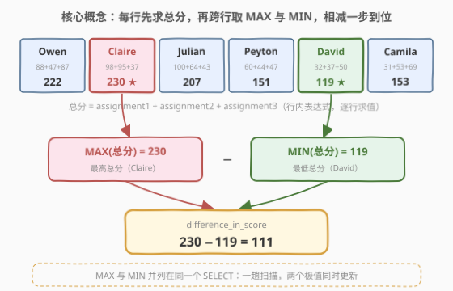
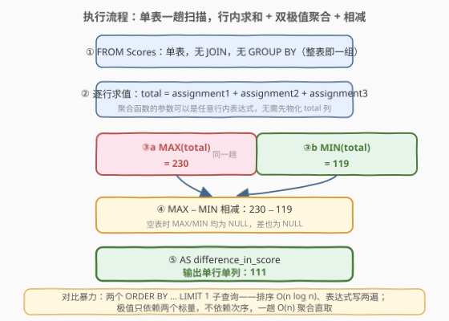
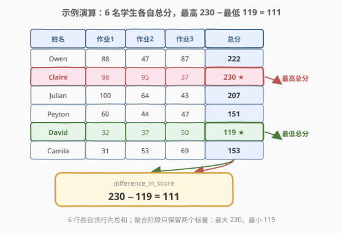

# 班级表现

- **题目名称**：班级表现
- **链接**：[2989. 班级表现](https://leetcode.cn/problems/class-performance/)
- **难度**：中等
- **标签**：数据库、SQL、聚合函数、`MAX`/`MIN`、行内表达式

## 1. 题目概述

> ⚠️ 本题为 LeetCode 付费题，题意描述根据官方示例用例与外部资料重建，可能与官方题面有出入。

**表结构**：`Scores`

| 列名 | 类型 |
|------|------|
| student_id | int |
| student_name | varchar |
| assignment1 | int |
| assignment2 | int |
| assignment3 | int |

- `student_id` 是这张表具有唯一值的列。
- 每行记录一名学生的姓名及其**三次作业**的分数。

**目标**：编写一个查询，计算学生获得的**最高总分**与**最低总分**之间的**差**（三次作业分数之和），输出单行单列 `difference_in_score`。

**示例 1**：

```text
输入：
Scores 表：
+------------+--------------+-------------+-------------+-------------+
| student_id | student_name | assignment1 | assignment2 | assignment3 |
+------------+--------------+-------------+-------------+-------------+
| 309        | Owen         | 88          | 47          | 87          |
| 321        | Claire       | 98          | 95          | 37          |
| 338        | Julian       | 100         | 64          | 43          |
| 423        | Peyton       | 60          | 44          | 47          |
| 896        | David        | 32          | 37          | 50          |
| 235        | Camila       | 31          | 53          | 69          |
+------------+--------------+-------------+-------------+-------------+

输出：
+---------------------+
| difference_in_score |
+---------------------+
| 111                 |
+---------------------+
```

**解释**：

- `student_id` 309 的总分为 $88 + 47 + 87 = 222$
- `student_id` 321 的总分为 $98 + 95 + 37 = 230$
- `student_id` 338 的总分为 $100 + 64 + 43 = 207$
- `student_id` 423 的总分为 $60 + 44 + 47 = 151$
- `student_id` 896 的总分为 $32 + 37 + 50 = 119$
- `student_id` 235 的总分为 $31 + 53 + 69 = 153$

`student_id` 321 拥有最高总分 230，`student_id` 896 拥有最低总分 119，两者之差为 $230 - 119 = 111$。

> 💡 读题两个关键点：①「总分」是**行内**三次作业相加，不是任何单列的极值；② 要的是「跨行取最高总分」减「跨行取最低总分」——**行内求和 + 跨行聚合**两个动作叠加，正是本题的全部考点。

---

## 2. 解题思路

### 2.1 暴力思路：排序取首尾

直觉写法是把总分排个序，取最大减最小。SQL 里对应两个子查询——一个降序取第一，一个升序取第一，再相减：

```sql
SELECT
    (SELECT assignment1 + assignment2 + assignment3 FROM Scores
      ORDER BY 1 DESC LIMIT 1)
  - (SELECT assignment1 + assignment2 + assignment3 FROM Scores
      ORDER BY 1 ASC  LIMIT 1) AS difference_in_score;
```

或者干脆 `SELECT *` 拉全表到应用层，用代码逐行求和、维护最大最小。

> ⚠️ 暴力法的浪费在于：**极值根本不需要次序信息**。排序付出 $O(n \log n)$ 的代价换来「谁排第几」的全序，而题目只要两个标量——最大与最小；两次子查询还把行内求和表达式原样写了两遍，`Scores` 也被扫了两趟。这与「先解压再统计」一样，属于用不上的信息买单。

### 2.2 核心观察：聚合函数可以直接「吃」行内表达式



**观察一：`MAX`/`MIN` 的参数可以是任意行内表达式。**

`MAX(assignment1 + assignment2 + assignment3)` 的求值顺序是：先对**每一行**计算三次作业之和，再在所有行的结果之间取最大——**先逐行求值、后跨行聚合**。因此不需要派生表或 CTE 先物化 `total` 列，聚合表达式一步到位。这是很多人写 SQL 时的盲区：以为聚合函数「只能吃列名」。

**观察二：整表即一组，两个极值一趟扫描同时维护。**

没有 `GROUP BY` 时，聚合函数把整张表当作一个组，查询**恒返回一行**。`MAX(·)` 与 `MIN(·)` 并列写在同一个 `SELECT` 里，执行器在一趟扫描中各维护一个极值累加器，互相独立、同时完成——与 [2985. 计算订单平均商品数量](2985_计算订单平均商品数量.md) 的两个 `SUM` 完全同构。

**观察三：max−min 是「一趟聚合」可还原的统计量。**

极值与求和一样，是可交换、可结合的聚合（逐行取 $\max$ / $\min$ 累加器即可），不依赖行的次序——对比中位数必须知道「排在中间的是谁」（见 2985 题解 5.2 的前缀和定位）。一句话：

$$\text{difference\_in\_score} = \max_{i} \left( \sum_{k=1}^{3} \text{assignment}_k^{(i)} \right) - \min_{i} \left( \sum_{k=1}^{3} \text{assignment}_k^{(i)} \right)$$

两个标量决定一切，排序给的全序是纯浪费。

### 2.3 算法流程图



**逻辑执行步骤**：

| 步骤 | 操作 | 作用 |
|------|------|------|
| ① | `FROM Scores` | 单表扫描，无 `JOIN` 无 `GROUP BY`（整表即一组） |
| ② | 逐行求值 `a1 + a2 + a3` | 行内表达式作为聚合输入，无需物化中间列 |
| ③ | `MAX(·)` ∥ `MIN(·)` | 同一趟扫描维护两个极值累加器：230 / 119 |
| ④ | `MAX(·) − MIN(·)` | 标量相减，得 111（空表时得 `NULL`） |
| ⑤ | `AS difference_in_score` | 别名即输出列名，单行单列 |

### 2.4 示例演算



**逐行求总分**：

| student_name | 作业1 | 作业2 | 作业3 | 总分 |
|--------------|-------|-------|-------|------|
| Owen | 88 | 47 | 87 | 222 |
| Claire | 98 | 95 | 37 | **230** ★ 最高 |
| Julian | 100 | 64 | 43 | 207 |
| Peyton | 60 | 44 | 47 | 151 |
| David | 32 | 37 | 50 | **119** ★ 最低 |
| Camila | 31 | 53 | 69 | 153 |

**收尾计算**：

$$230 - 119 = 111$$

> ⚠️ 注意 Julian 单科 100 是全班最高单项分，但他的总分 207 不是最高——「单列极值」与「行内和的极值」是两回事，正好引出 5.1 节 `MAX` 与 `GREATEST` 的辨析。

---

## 3. 参考代码

### SQL（MySQL，一行聚合）

```sql
# Write your MySQL query statement below
SELECT MAX(assignment1 + assignment2 + assignment3)
     - MIN(assignment1 + assignment2 + assignment3) AS difference_in_score
FROM Scores;
```

> 💡 **写法要点**：
> - **聚合参数是行内表达式**：`MAX`/`MIN` 先逐行求三次作业之和、再跨行取极值，无需中间表。
> - **两个聚合并列**：同一趟扫描各自维护极值累加器，无 `GROUP BY`、恒返回一行。
> - **别名 `difference_in_score`**：必须与题目要求的输出列名逐字一致。

### SQL（CTE 版：总分只写一遍）

```sql
# Write your MySQL query statement below
WITH totals AS (
    SELECT assignment1 + assignment2 + assignment3 AS total
    FROM Scores
)
SELECT MAX(total) - MIN(total) AS difference_in_score
FROM totals;
```

> 💡 **写法要点**：
> - 行内求和表达式只出现**一次**，杜绝复制粘贴改漏一列的事故；后续若要同时输出平均分、人数，直接在 `totals` 上加聚合即可。
> - 语义与一行版完全等价（CTE 在 MySQL 8 中通常会被合并或物化为一次扫描），两种写法都对，面试口头讲清「聚合参数可以是行内表达式」即可。

### Python（pandas）

```python
import pandas as pd

def class_performance(scores: pd.DataFrame) -> pd.DataFrame:
    total = scores['assignment1'] + scores['assignment2'] + scores['assignment3']
    return pd.DataFrame({'difference_in_score': [total.max() - total.min()]})
```

> 💡 **pandas 对照**：先逐行相加得到 Series，再 `.max()` / `.min()` 跨行取极值——与 SQL 的「行内表达式 + 聚合」一一对应。注意 pandas 的 `Series.max()` 默认跨行（`axis=0`），对应 SQL 的 `MAX`；若写成 `scores[['a1','a2','a3']].max(axis=1)` 那是**行内跨列**，对应的是 SQL 的 `GREATEST`，见 5.1。

---

## 4. 复杂度分析

| 维度 | 复杂度 | 说明 |
|------|--------|------|
| **时间** | $O(n)$ | $n$ = 学生数；单趟扫描，`MAX`/`MIN` 两个累加器并行更新。对比排序暴力 $O(n \log n)$ × 两趟 |
| **空间** | $O(1)$ | 只维护两个标量极值；无排序缓冲区、无中间表 |
| **输出行数** | $O(1)$ | 单行单列（聚合无 `GROUP BY` 恒返回一行） |

> ⚠️ 极值、求和、计数都是「一趟聚合」统计量——代价与行的**到达顺序无关**。凡是能「逐行累加/比较」维护的量都不需要排序；需要次序的（中位数、第 k 大、排名）才轮到排序或窗口函数出场。

---

## 5. 扩展：`MAX` vs `GREATEST`——跨行与行内的一字之差

### 5.1 两个「最大」函数的作用域

| 写法 | 作用域 | 语义 | 本题数据下的结果 |
|------|--------|------|------------------|
| `MAX(a1 + a2 + a3)` | **跨行**（同列方向） | 全体学生的总分之最大 | 230（Claire） |
| `GREATEST(a1, a2, a3)` | **行内**（跨列方向） | 每个学生三次作业的最高分 | Owen 是 88，Julian 是 100 |
| `GREATEST(a1,a2,a3) - LEAST(a1,a2,a3)` | 行内 | 每个学生单科的落差（波动幅度） | Owen 是 $88-47=41$ |

`MAX`/`MIN` 是**聚合函数**：纵向压缩多行为一行；`GREATEST`/`LEAST` 是**标量函数**：横向在**一行之内**比较多列，行数不变。两者恰好互为镜像——pandas 里对应 `df.max()`（`axis=0`）与 `df.max(axis=1)`。

> 💡 如果面试官把题目改一字：「求每个学生**最好一次作业**与**最差一次作业**的差距」，答案就从 `MAX(总和) − MIN(总和)` 变成 `GREATEST(a1,a2,a3) − LEAST(a1,a2,a3)`（外面包一层 `SELECT` 逐行输出即可）。听到「每个」→ 行内/分组；听到「全体」→ 聚合。

### 5.2 空表与 NULL 的边界行为

聚合查询没有 `GROUP BY` 时**恒返回一行**——哪怕表是空的。空表上 `MAX(·)` 与 `MIN(·)` 都返回 `NULL`，于是 `NULL − NULL = NULL`，输出一行 `difference_in_score = NULL`，而**不是 0 行、也不是 0**。若题目要求空表输出 0，需要显式兜底：

```sql
SELECT IFNULL(MAX(assignment1 + assignment2 + assignment3)
            - MIN(assignment1 + assignment2 + assignment3), 0) AS difference_in_score
FROM Scores;
```

这正是 [176. 第二高的薪水](../0101-0200/176_第二高的薪水.md) `IFNULL(..., 0)` 的同款套路。

### 5.3 如果要的是「最高总分学生」本人

极值聚合只返回**数值**，不携带所在行。要人名就得把行取回来：

```sql
SELECT student_name, assignment1 + assignment2 + assignment3 AS total
FROM Scores
ORDER BY total DESC
LIMIT 1;
```

若最高总分**并列**且要求全部返回，改用 `RANK()` 窗口取 `rk = 1`——与 [2984. 找到每座城市的高峰通话小时](2984_找到每座城市的高峰通话小时.md) 的「并列全返回」完全同款。

---

## 6. 面试要点

1. **聚合函数的参数能写 `a1 + a2 + a3` 这样的表达式吗？**

   - 能。聚合函数接受任意行内表达式，求值顺序是**先逐行计算表达式、再跨行聚合**。`MAX(a1+a2+a3)` 不需要先 `SELECT` 出 `total` 列再聚合，派生表/CTE 只是可读性选择而非必需。

2. **为什么 `MAX` 和 `MIN` 可以并列写在同一个 `SELECT` 里，却不用 `GROUP BY`？**

   - 没有 `GROUP BY` 时整张表被当作一个组，聚合查询恒返回一行；`MAX` 与 `MIN` 是两个独立的聚合参数，执行器在同一趟扫描中各维护一个极值累加器，同时完成，无需两次查询或自连接。

3. **空表时这条 SQL 返回什么？**

   - 返回**一行** `difference_in_score = NULL`——聚合无分组恒返回一行，`MAX`/`MIN` 在空集上为 `NULL`，`NULL − NULL` 仍为 `NULL`。不是 0 行也不是 0；要求 0 就 `IFNULL` 兜底（同 176 题）。

4. **`MAX` 和 `GREATEST` 有什么区别？**

   - `MAX` 是聚合函数，**跨行**比较同一（表达式）列，压缩行数；`GREATEST` 是标量函数，**行内**比较多个列（或字面量），不改变行数。pandas 对照：`df.max()` vs `df.max(axis=1)`。「求全班最高总分」用前者，「求每人最好一次作业」用后者。

5. **一行表达式版和 CTE 版，哪个更好？**

   - 语义等价、复杂度相同。一行版少一层嵌套；CTE 版行内求和只写一遍，扩展时（同时输出平均分/人数/人名）更从容。面试建议：先写一行版展示「聚合参数可以是表达式」这一知识点，再主动提 CTE 版作为工程上的可维护性选项。

> 💡 **一句话总结**：2989 是聚合函数最基础的形态——**行内求和交给表达式，跨行极值交给 `MAX`/`MIN`**，一趟扫描两个累加器，排序与两次子查询都是多余动作。再把 `MAX` vs `GREATEST`、空表 `NULL` 行为这两处边界讲清，这道「简单中等题」就能答出纵深。

---

## 7. 同类练习题

- [2853. 最高薪水差异](https://leetcode.cn/problems/highest-salaries-difference/)（[题解](../2801-2900/2853_最高薪水差异.md)）：`MAX−MIN` 差值的条件聚合升级版——两个部门各自取 `MAX` 再求差，对照本题「整表一组」与「分组取极值」的差别
- [176. 第二高的薪水](https://leetcode.cn/problems/second-highest-salary/)（[题解](../0101-0200/176_第二高的薪水.md)）：极值家族的「第二名」+ `IFNULL` 空值兜底，与 5.2 的空表边界互为印证
- [619. 只出现一次的最大数字](https://leetcode.cn/problems/biggest-single-number/)（[题解](../0601-0700/619_只出现一次的最大数字.md)）：外层 `MAX` 套内层 `GROUP BY + HAVING`——「聚合的输入是另一个聚合的结果」，与本题「聚合的输入是行内表达式」互为镜像
- [586. 订单最多的客户](https://leetcode.cn/problems/customer-placing-the-largest-number-of-orders/)（[题解](../0501-0600/586_订单最多的客户.md)）：分组 `COUNT` 后全局 `MAX`，双层聚合中内层换成分组计数的变体
- [2985. 计算订单平均商品数量](https://leetcode.cn/problems/calculate-compressed-mean/)（[题解](2985_计算订单平均商品数量.md)）：同区间姊妹篇——两个 `SUM` 一趟扫描与本题两个极值累加器完全同构，顺带补齐「线性 vs 依赖次序统计量」的分野
