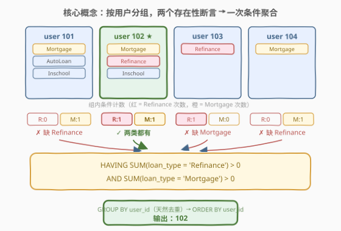
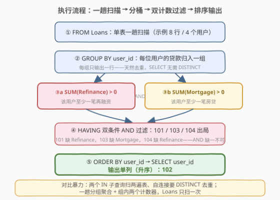
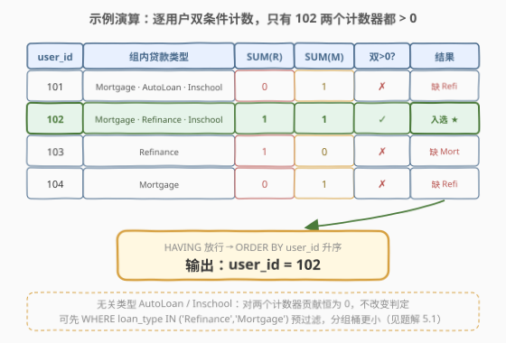

# LeetCode 贷款类型 题解

## 1. 题目概述

- **标题 / 题号**：贷款类型（#2990，easy）
- **链接**：https://leetcode.cn/problems/loan-types/
- **难度**：简单
- **标签**：数据库、SQL、`GROUP BY`、`HAVING`、条件聚合、`SUM(布尔表达式)`、`INTERSECT`、集合交集判定、LeetCode 锁题

> ⚠️ 本题为 LeetCode 付费题，题意描述根据官方示例用例与外部资料重建，可能与官方题面有出入。

**表结构**：`Loans`

| 列名 | 类型 |
|------|------|
| loan_id | int |
| user_id | int |
| loan_type | varchar |

- `loan_id` 是这张表具有唯一值的列。
- 每行记录一笔贷款：贷款 id、所属用户 id、贷款类型（如 `Mortgage` 房贷、`Refinance` 再融资、`AutoLoan` 车贷、`Inschool` 校园贷等）。

**目标**：编写一个解决方案，找出**同时拥有 `Refinance` 贷款类型和 `Mortgage` 贷款类型**的 `user_id`（去重），按 `user_id` **升序**返回。

**示例 1**：

```text
输入：
Loans 表：
+---------+---------+-----------+
| loan_id | user_id | loan_type |
+---------+---------+-----------+
| 683     | 101     | Mortgage  |
| 218     | 101     | AutoLoan  |
| 802     | 101     | Inschool  |
| 593     | 102     | Mortgage  |
| 138     | 102     | Refinance |
| 294     | 102     | Inschool  |
| 308     | 103     | Refinance |
| 389     | 104     | Mortgage  |
+---------+---------+-----------+

输出：
+---------+
| user_id |
+---------+
| 102     |
+---------+
```

**解释**：

| 用户 | 贷款类型集合 | 有 Refinance？ | 有 Mortgage？ | 入选？ |
|------|-------------|---------------|--------------|--------|
| 101 | {Mortgage, AutoLoan, Inschool} | ✗ | ✓ | ✗ |
| 102 | {Mortgage, Refinance, Inschool} | ✓ | ✓ | ✓ |
| 103 | {Refinance} | ✓ | ✗ | ✗ |
| 104 | {Mortgage} | ✗ | ✓ | ✗ |

> 💡 题眼是「**集合交集判定**」：每位用户的贷款构成一个类型集合 $S_u$，要筛选的是 $\text{Refinance} \in S_u \;\land\; \text{Mortgage} \in S_u$ 的用户——两条**存在性断言**的 AND。`AutoLoan`、`Inschool` 等其他类型是「无关类型」，不影响判定。直觉上会想"分别查两类用户再取交集"——可行，但**一次 `GROUP BY` + `HAVING` 条件聚合**能把两次扫描压成一次，与 [1398. 购买了产品 A 和产品 B 却没有购买产品 C 的顾客](../1301-1400/1398_购买了产品A和产品B却没有购买产品C的顾客.md) 完全同源。

**约束条件**（据重建题意）：

- `loan_id` 在表中唯一（每行一笔独立贷款）。
- 同一用户可有多笔贷款，同一类型也可重复出现。
- 输出单列 `user_id`，按**升序**排列。

## 2. 解题思路

### 2.1 暴力思路：两个子查询取交集

直觉写法是分别求两个用户集合，再做交集：

```sql
-- 伪代码：两次独立子查询 + IN
SELECT DISTINCT user_id
FROM Loans
WHERE loan_type = 'Refinance'
  AND user_id IN (SELECT user_id FROM Loans WHERE loan_type = 'Mortgage')
ORDER BY user_id;
```

- **正确**，逻辑直白。但 `Loans` 被**扫描了 2 次**（外层一次、`IN` 子查询一次），还要 `DISTINCT` 手动去重——外层命中 `Refinance` 的行有几笔，`user_id` 就重复几笔。
- 也可把全表读进应用层，用哈希表 `user → set(types)` 逐用户判 both——把本该由数据库引擎高效完成的聚合搬到应用层，既低效也违背 SQL 的声明式哲学。
- 集合论上还有一条直路：$\{\text{有 Refi 的用户}\} \cap \{\text{有 Mort 的用户}\}$，即 `INTERSECT`（见 3. 解法 B），但 MySQL 8.0.31 之前不支持。

> ⚠️ 暴力不是错，而是把「双存在性判定」拆成了多次独立扫描。看到"同时满足多个存在性条件"，就该想到：**一次分组 + 条件聚合**。

### 2.2 核心观察：两条存在性断言 → 一条 HAVING 条件聚合



**关键洞察**：「有 Refinance」「有 Mortgage」是两条对**组**的存在性断言，而存在性可以用**条件计数**等价改写——SQL 的招牌变换：

$$
\text{Refinance} \in S_u \iff \sum_{\ell \in \text{Loans}(u)} \mathbb{1}[\ell.\text{loan\_type} = \text{'Refinance'}] > 0
$$

即在 `GROUP BY user_id` 后，对组内每一行判断 `loan_type` 是否等于目标类型、命中记 1 否则记 0，再 `SUM` 得到该用户该类型的贷款笔数。**笔数 $>0$ ⇔ 借过**。两条断言拼成一条 `HAVING`：

```text
HAVING SUM(loan_type = 'Refinance') > 0   -- 该用户至少一笔 Refinance
   AND SUM(loan_type = 'Mortgage')  > 0   -- 该用户至少一笔 Mortgage
```

> 以 101 为例：类型集合 {Mortgage, AutoLoan, Inschool}，SUM(Refinance)=0、SUM(Mortgage)=1。第一条 $>0$ 失败，整组被 `HAVING` 拦掉——**AND 缺一不可**，单有 Mortgage 没用。102 的两个计数都是 1，双条件通过，入选。

> ⚠️ **`SUM(loan_type = 'Refinance')` 是 MySQL 简写**：布尔表达式求值为 `1`/`0`，可直接塞进 `SUM`。跨数据库请用标准写法 `SUM(CASE WHEN loan_type = 'Refinance' THEN 1 ELSE 0 END)`（PostgreSQL 的布尔不能直接 `SUM`，还可用 `COUNT(*) FILTER (WHERE ...)`）。

> 💡 **为什么 `SELECT` 不用 `DISTINCT`？** `GROUP BY user_id` 使每个分组只产出一行，天然去重。对比暴力法外层的 `DISTINCT` 与自连接版的 `DISTINCT`——去重这件事，分组自己就干了。

### 2.3 算法流程图



**五步流水线**：

| 步骤 | 操作 | 作用 |
|------|------|------|
| ① | `FROM Loans` | 单表扫描，无 `JOIN` |
| ② | `GROUP BY user_id` | 每位用户的所有贷款归入一组（天然去重） |
| ③ | `HAVING` 双条件聚合 | `SUM(Refinance) > 0` AND `SUM(Mortgage) > 0`，一步筛出两类都有的用户 |
| ④ | `ORDER BY user_id` | 满足题目升序要求 |
| ⑤ | `SELECT user_id` | 输出单列 |

> 💡 **逻辑执行顺序**：`FROM → WHERE → GROUP BY → HAVING → SELECT → ORDER BY`。两个计数条件都是「对组的断言」，必须放 `HAVING`（分组后判定）；`WHERE` 在分组前逐行过滤，看不到组内聚合值。

### 2.4 示例演算

以示例 1 的 4 位用户为例，跟踪「分组 → 双计数 → HAVING 过滤」全过程：



| user_id | 组内贷款类型 | SUM(Refinance) | SUM(Mortgage) | 双 >0？ | 输出 |
|---------|-------------|----------------|---------------|---------|------|
| 101 | Mortgage, AutoLoan, Inschool | 0 | 1 | ✗（缺 Refinance） | ✗ |
| 102 | Mortgage, Refinance, Inschool | 1 | 1 | ✓ | ✓ |
| 103 | Refinance | 1 | 0 | ✗（缺 Mortgage） | ✗ |
| 104 | Mortgage | 0 | 1 | ✗（缺 Refinance） | ✗ |

**关键验证点**：

- **101**：三种贷款类型齐全度最高，唯独没有 Refinance，SUM(Refinance)=0 → 拦掉。**类型多不等于类型对**——判定只关心两种目标类型。
- **102**：两类各至少一笔，双计数都为 1 → 入选。
- **103**：只有 Refinance，SUM(Mortgage)=0 → 拦掉。与 101 恰好是「缺另一边」的镜像。
- **104**：只有 Mortgage → 拦掉。
- **无关类型**：`AutoLoan`、`Inschool` 对两个计数器贡献恒为 0，扫到也只是陪跑，不改变判定。

> 💡 **守恒校验**：条件聚合结果与集合交集判定一致——只有 102 的类型集合同时包含 `Refinance` 与 `Mortgage`。若不一致，说明目标类型字符串拼写错误或 `>0` 方向写反。

## 3. 参考代码

### SQL（MySQL，解法 A：`HAVING` 条件聚合，推荐）

```sql
# Write your MySQL query statement below
SELECT user_id
FROM Loans
GROUP BY user_id
HAVING SUM(loan_type = 'Refinance') > 0
   AND SUM(loan_type = 'Mortgage') > 0
ORDER BY user_id;
```

> 💡 **写法要点**：
> - **`SUM(loan_type = '...')`**：MySQL 布尔简写，等价于 `SUM(CASE WHEN loan_type = '...' THEN 1 ELSE 0 END)`；跨库请用 `CASE` 版。
> - **`GROUP BY user_id` 天然去重**，`SELECT` 无需 `DISTINCT`。
> - `Loans` 只扫**一遍**，组内两个计数器同趟更新。

### SQL（解法 B：`INTERSECT` 集合交集，语义直译）

```sql
SELECT user_id FROM Loans WHERE loan_type = 'Refinance'
INTERSECT
SELECT user_id FROM Loans WHERE loan_type = 'Mortgage'
ORDER BY user_id;
```

> 💡 **写法要点**：
> - 把题意「两类都有」逐字翻译成集合交集：$\{\text{有 Refi}\} \cap \{\text{有 Mort}\}$，**`INTERSECT` 天然去重**（返回 DISTINCT 语义的结果）。
> - 末尾的 `ORDER BY` 作用于**整个交集结果**（SQL 标准行为），不是第二个子查询。
> - ⚠️ **可移植性**：MySQL **8.0.31 起**才支持 `INTERSECT`/`EXCEPT`；PostgreSQL、SQL Server 均支持。LeetCode 的 MySQL 版本较老时此写法会报语法错误，提交前先确认。

### SQL（解法 C：自连接 + `DISTINCT`）

```sql
SELECT DISTINCT l1.user_id
FROM Loans l1
JOIN Loans l2
  ON l1.user_id = l2.user_id
WHERE l1.loan_type = 'Refinance'
  AND l2.loan_type = 'Mortgage'
ORDER BY l1.user_id;
```

> 💡 **写法要点**：
> - 语义：把「同一用户的两种贷款行」两两配对，配上对的用户即入选——`l1` 出 Refinance 行、`l2` 出 Mortgage 行。
> - **必须 `DISTINCT`**：同一用户有多笔 Refinance × 多笔 Mortgage 时会配出多对，`user_id` 重复出现。
> - 也可写成双 `EXISTS`（`EXISTS Refinance 行 AND EXISTS Mortgage 行`），与 [1398](../1301-1400/1398_购买了产品A和产品B却没有购买产品C的顾客.md) 的解法 C 同款，可读性强、规避 `NOT IN` 的 NULL 陷阱（本题没有负条件，`NOT IN` 用不上）。

### Python（pandas）

```python
import pandas as pd

def loan_types(loans: pd.DataFrame) -> pd.DataFrame:
    # 镜像 SQL：先只保留两类目标行，再数每位用户的「不同类型数」= 2
    both = (loans[loans['loan_type'].isin(['Refinance', 'Mortgage'])]
            .groupby('user_id')['loan_type'].nunique())
    return pd.DataFrame({'user_id': sorted(both[both == 2].index)})
```

> 💡 **pandas 对照**：
> - `isin` 预过滤对应 SQL 的 `WHERE loan_type IN (...)`；`groupby('user_id')['loan_type'].nunique()` 对应 `COUNT(DISTINCT loan_type)`（见 5.1 等价改写）。
> - 另一条路是**两个集合求交**：`set(loans.loc[loans['loan_type']=='Refinance','user_id']) & set(loans.loc[loans['loan_type']=='Mortgage','user_id'])`，正是 `INTERSECT` 的 Python 镜像。
> - `sorted(...)` 保证升序输出，对应 `ORDER BY user_id`。

## 4. 复杂度分析

| 维度 | 复杂度 | 说明 |
|------|--------|------|
| **时间** | $O(n)$ | $n$ = `Loans` 行数；单趟扫描 + 哈希分组，每组两次 $O(1)$ 计数判断。对比暴力两趟扫描 $O(n)$ × 2、自连接最坏 $O(n^2)$（优化器可降为哈希连接 $O(n)$） |
| **空间** | $O(u)$ | $u$ = 不同 `user_id` 数（分组哈希表）；`INTERSECT` 版需两个用户结果集 $O(u_1 + u_2)$ |
| **输出** | $O(k)$ | $k$ = 入选用户数，$k \le u$ |

**三种 SQL 解法对照**：

| 维度 | A 条件聚合 | B `INTERSECT` | C 自连接 |
|------|-----------|---------------|----------|
| **扫描次数** | 1 次 | 2 次 | JOIN（哈希连接可 1 趟建桶 + 探测） |
| **去重来源** | `GROUP BY` 天然 | `INTERSECT` 天然 | 需手动 `DISTINCT` |
| **可移植性** | `CASE` 版全库通用 | MySQL 8.0.31+ | 全库通用 |
| **扩展性** | 加一个 `AND SUM(...)` 即可 | 加一个 `INTERSECT` | 加一层 JOIN |
| **推荐度** | ✓ **首选** | ✓ 语义最直观 | △ 好懂但易忘 DISTINCT |

> ⚠️ 本题示例级数据（8 行），任何正确写法都瞬过。复杂度差异的价值在**扩展性**：当条件从 2 个增到 10 个、贷款表上千万行时，解法 A 仍是「一条 `HAVING` 加几项 + 单趟扫描」，解法 B/C 则要膨胀成 10 层交集 / 9 次连接。

## 5. 扩展：等价改写与泛化模板

### 5.1 等价改写：`WHERE` 预过滤 + `COUNT(DISTINCT)` = 2

`AutoLoan`、`Inschool` 等无关行对两个计数器贡献恒为 0，**先过滤掉它们是安全的**——唯一受影响的是「两种目标类型一笔都没有的用户」，其分组会整个消失，而这类用户双计数为 0 本来就必然出局。预过滤后，组内只剩两种目标类型，于是「两类都有」⇔「不同类型数 = 2」：

```sql
SELECT user_id
FROM Loans
WHERE loan_type IN ('Refinance', 'Mortgage')
GROUP BY user_id
HAVING COUNT(DISTINCT loan_type) = 2
ORDER BY user_id;
```

> 💡 **为什么值得学这版**：它把「每个条件写一个 `SUM`」变成「**过滤后数不同取值个数**」。目标类型有 $k$ 种时，前者要写 $k$ 个条件，后者仍是 `COUNT(DISTINCT) = k` 一项——条件聚合适合条件少而异质（如 1398 的「无 C」），`COUNT(DISTINCT)` 适合条件同质且数量多。附带收益：分组前先把无关行裁掉，分组桶更小。

### 5.2 存在性判定的泛化模板

「在 `HAVING` 里把存在性转成计数正/零」是 SQL 通用模式（与 1398 一脉相承）：

| 场景 | HAVING 写法 | 语义 |
|------|------------|------|
| 两类都要有（本题） | `SUM(条件1) > 0 AND SUM(条件2) > 0` | 集合交集 |
| 有 A 无 B | `SUM(A) > 0 AND SUM(B) = 0` | 集合差（[1083. 销售分析 II](../1001-1100/1083_销售分析II.md)） |
| 有 A、有 B、无 C | 两个 `>0` + 一个 `=0` | 交集再作差（1398） |
| $k$ 种目标类型至少有 $j$ 种 | `COUNT(DISTINCT CASE WHEN type IN (...) THEN type END) >= j` | $j$-of-$k$ |
| 拥有**全部**类型 | 双重 `NOT EXISTS`（关系除法） | 集合包含全部 |

> 💡 **正负口诀**：正条件（要有）数 $>0$，负条件（不能有）数 $=0$。当目标类型集合大小不固定且「全都要有」时，条件聚合要枚举所有类型不可行，改用双重 `NOT EXISTS` 的**关系除法**：找出「不存在一种类型，该用户没有借过」的用户。

## 6. 面试要点

1. **为什么用 `HAVING` 而不是 `WHERE` 判定「有 Refinance」？**

   > `WHERE` 在分组**前**逐行过滤，无法访问组内聚合值；`SUM(loan_type='Refinance')` 是对**组**的断言，必须在分组**后**用 `HAVING` 判定。若硬要用 `WHERE`，得写 `WHERE loan_type='Refinance' AND user_id IN (SELECT ... WHERE loan_type='Mortgage')` 的嵌套子查询——多扫一遍表，不如一条 `HAVING`。

2. **为什么 `SELECT user_id` 不需要 `DISTINCT`？**

   > `GROUP BY user_id` 让每个分组只产出一行，输出天然无重复。对比：解法 C 的自连接中，同一用户的「Refinance 行 × Mortgage 行」会配出多对，必须 `DISTINCT`。口诀：**分组自带去重，连接才要 DISTINCT**。

3. **`SUM(loan_type = 'Refinance')` 这种写法跨数据库通用吗？**

   > 不通用。MySQL 的布尔表达式求值为 `1`/`0` 可直接聚合；PostgreSQL 的布尔类型不能直接 `SUM`，标准写法是 `SUM(CASE WHEN loan_type='Refinance' THEN 1 ELSE 0 END)`，PG 还可用 `COUNT(*) FILTER (WHERE loan_type='Refinance')`。面试先写 `CASE` 版保通用，再提 MySQL 简写展示熟练度。

4. **加 `WHERE loan_type IN ('Refinance','Mortgage')` 预过滤为什么安全？会不会漏人？**

   > 不会。无关类型行对两个计数器贡献都是 0，删掉不改变任何用户的判定结果；唯一「消失」的分组是两类目标贷款一笔都没有的用户——他们双计数为 0，本就必然出局。预过滤让进分组哈希表的行更少，纯优化无副作用（见 5.1）。

5. **如果改成「拥有**所有**贷款类型的用户」呢？**

   > 这是**关系除法**。条件聚合需要枚举全部类型各写一个 `SUM(...)>0`，类型多了不可行。通用解法是双重 `NOT EXISTS`：`NOT EXISTS (SELECT 1 FROM (SELECT DISTINCT loan_type FROM Loans) t WHERE NOT EXISTS (SELECT 1 FROM Loans l2 WHERE l2.user_id = l.user_id AND l2.loan_type = t.loan_type))`——不存在一种该用户没借过的类型。条件聚合适合固定少量条件，集合除法适合「全称量词」。

> 💡 **一句话总结**：2990 是 1398 的减配版——**双存在性断言用一条 `HAVING` 条件聚合**解决，`GROUP BY` 顺手把去重也做了。记住口诀「正条件数 $>0$、负条件数 $=0$」，再掌握 `WHERE` 预过滤 + `COUNT(DISTINCT) = k` 的等价改写与 `INTERSECT` 直译，这道题就能从"会做"答出"纵深"。

## 同类练习题

| # | 题目 | 与本题的关联 |
|---|------|-------------|
| 1398 | [购买了产品 A 和产品 B 却没有购买产品 C 的顾客](https://leetcode.cn/problems/customers-who-bought-products-a-and-b-but-not-c/)（[题解](../1301-1400/1398_购买了产品A和产品B却没有购买产品C的顾客.md)） | 三条件版（有 A、有 B、无 C）——同一套 `HAVING` 条件聚合多一条负条件 `=0`，是本题的进阶镜像 |
| 1083 | [销售分析 II](https://leetcode.cn/problems/sales-analysis-ii/)（[题解](../1001-1100/1083_销售分析II.md)） | 一正一负两条件（买 S8 未买 iPhone）——条件聚合的最小双向形态 |
| 2991 | [最好的三家酒庄](https://leetcode.cn/problems/top-three-wineries/)（[题解](2991_最好的三家酒庄.md)） | 同批次姊妹题——同一张表上的条件聚合从「存在性计数」升级到「分组 Top-N」 |
| 2985 | [计算订单平均商品数量](https://leetcode.cn/problems/calculate-compressed-mean/)（[题解](2985_计算订单平均商品数量.md)） | 同批次姊妹题——两个 `SUM` 一趟扫描的聚合基本功，与本题组内双计数器同构 |
| 1070 | [产品销售分析 III](https://leetcode.cn/problems/product-sales-analysis-iii/)（[题解](../1001-1100/1070_产品销售分析III.md)） | `GROUP BY` 后过滤的另一种形态（组内最值筛选），对照体会 `HAVING` 的两类用法 |
