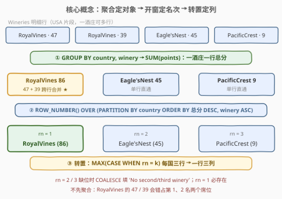
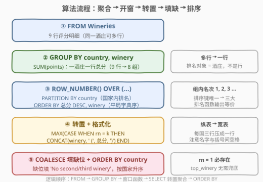
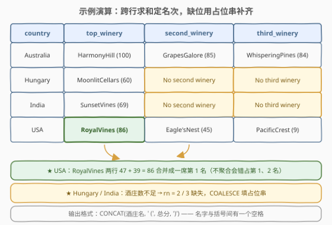

# 最好的三家酒庄

- **题目名称**：最好的三家酒庄
- **链接**：[2991. 最好的三家酒庄](https://leetcode.cn/problems/top-three-wineries/)
- **难度**：困难
- **标签**：SQL、窗口函数、ROW_NUMBER、分组聚合、条件聚合转置、字符串拼接

## 1. 题目概述

> ⚠️ 本题为 LeetCode 付费题，题意描述根据官方示例用例与 hints 重建，可能与官方题面有出入。

给定一张品酒评分表 `Wineries`，每行记录一条评分：某国家的某酒庄获得 `points` 分。**同一家酒庄可能出现多行**，其总评分为所有行评分之和。编写解决方案，找出**每个国家总评分前三的酒庄**，按国家一行输出三列，并且：

- 输出格式为「酒庄名 (总分)」，如 `HarmonyHill (100)`；
- 若多家酒庄总分相同，按**酒庄名字典序升序**定先后；
- 若某国没有第二/第三名酒庄，对应位置分别输出 `'No second winery'` / `'No third winery'`；
- 结果按 `country` **升序**返回。

**表结构**：

```text
Table: Wineries
+-------------+----------+
| Column Name | Type     |
+-------------+----------+
| id          | int      |  ← 唯一列
| country     | varchar  |
| points      | int      |  ← 该行评分
| winery      | varchar  |  ← 酒庄名（同一酒庄可多行）
+-------------+----------+
```

**示例 1**：

```text
输入：
Wineries 表:
+-----+-----------+--------+-----------------+
| id  | country   | points | winery          |
+-----+-----------+--------+-----------------+
| 103 | Australia | 84     | WhisperingPines |
| 737 | Australia | 85     | GrapesGalore    |
| 848 | Australia | 100    | HarmonyHill     |
| 222 | Hungary   | 60     | MoonlitCellars  |
| 116 | USA       | 47     | RoyalVines      |
| 124 | USA       | 45     | Eagle'sNest     |
| 648 | India     | 69     | SunsetVines     |
| 894 | USA       | 39     | RoyalVines      |
| 677 | USA       | 9      | PacificCrest    |
+-----+-----------+--------+-----------------+

输出：
+-----------+---------------------+-------------------+----------------------+
| country   | top_winery          | second_winery     | third_winery         |
+-----------+---------------------+-------------------+----------------------+
| Australia | HarmonyHill (100)   | GrapesGalore (85) | WhisperingPines (84) |
| Hungary   | MoonlitCellars (60) | No second winery  | No third winery      |
| India     | SunsetVines (69)    | No second winery  | No third winery      |
| USA       | RoyalVines (86)     | Eagle'sNest (45)  | PacificCrest (9)     |
+-----------+---------------------+-------------------+----------------------+

解释：
- Australia：HarmonyHill 总分 100 最高；GrapesGalore 85 次之；WhisperingPines 84 第三。
- Hungary：只有 MoonlitCellars 一家（60 分），无第二、第三名 → 填充占位串。
- India：只有 SunsetVines 一家（69 分），同理填充。
- USA：RoyalVines 出现两行，总分 47 + 39 = 86 最高；Eagle'sNest 45 第二；PacificCrest 9 第三。
```

**约束条件**：

- `id` 是 `Wineries` 中具有唯一值的列
- 每个国家至少有一家酒庄（即至少一行数据）
- 总分相同的酒庄按名称字典序升序排列

> 💡 本题是 **Top-N per group + 行转列** 的完整拼图：分组聚合、窗口排名、平局打破、条件转置、缺位填充、字符串格式化六个环节一个不少——这正是它被标为困难的原因：没有一环很难，但每一环都能踩坑。

---

## 2. 解题思路

### 2.1 暴力思路：自连接数名次

Top-N 问题的前窗口函数时代解法是**用计数定义名次**：「我的名次 = 同组中比我强的行数 + 1」。先聚合出每家酒庄总分，再让 `totals` 自己和自己连接：

```sql
WITH totals AS (
    SELECT country, winery, SUM(points) AS total_points
    FROM Wineries
    GROUP BY country, winery
)
SELECT t1.country, t1.winery, t1.total_points
FROM totals t1
WHERE (SELECT COUNT(*)
       FROM totals t2
       WHERE t2.country = t1.country
         AND (t2.total_points > t1.total_points
              OR (t2.total_points = t1.total_points AND t2.winery < t1.winery))
      ) < 3;
```

- 「比我强」的完整定义包含**平局规则**：总分更高，或总分相同但名字典序更小（`winery < t1.winery`）；
- 每行都要对同国全表数一遍，代价 $O(M^2)$（$M$ = 不同 `(country, winery)` 组数）；
- 更糟的是，这还没完——筛出前三后仍需**转置成三列**，还要再自连接或条件聚合一轮。

> ⚠️ 另一个常见念头是「每个国家 `ORDER BY ... LIMIT 3`」：但一条 SQL 要同时产出**所有国家**的结果，相关子查询里 `LIMIT` 的偏移量又不能引用外层列（MySQL 限制），这条路写出来比自连接还别扭——本质上你会被迫重新发明窗口函数。

### 2.2 核心观察：聚合 → 开窗 → 转置三段式



**第一观察：排名对象是「酒庄」而不是「行」。**
同一酒庄多行出现，必须先 `GROUP BY country, winery` 聚合出总分，排名才有意义。注意分组键要**带上 country**——排名发生在国家内部，且表结构并不保证酒庄名全局唯一（不同国家可以有同名酒庄）。

**第二观察：Top-N per group 的标准三段式。**

```text
阶段①  聚合   GROUP BY country, winery → SUM(points)      多行 → 一组一行
阶段②  开窗   ROW_NUMBER() OVER (PARTITION BY country
                ORDER BY 总分 DESC, winery ASC)            组内排名
阶段③  转置   MAX(CASE WHEN rn = k THEN ... END)           纵表 → 宽表
```

**第三观察：平局已被排序键「消灭」。**
`ORDER BY total_points DESC, winery` 中，`(country, winery)` 经分组后天然唯一，因此分区内**不存在排序键相同的两行**——`ROW_NUMBER`、`RANK`、`DENSE_RANK` 三者输出完全一致。选 `ROW_NUMBER` 语义最贴切：「恰好取前三家，各占一席」（见第 5 节对三函数分野的展开）。

**第四观察：缺位只发生在第 2、3 名。**
结果行来自对 `ranked` 按 `country` 的 `GROUP BY`——**一个国家因为至少有一行数据才存在于结果中**，所以 `rn = 1` 必然有值，`top_winery` 无需兜底；`rn = 2` 或 `3` 才可能缺失，用 `COALESCE` 填 `'No second winery'` / `'No third winery'`。再配合 `CONCAT(winery, ' (', total_points, ')')` 拼出目标格式。

> 💡 条件聚合转置的原理：`GROUP BY country` 后，每国的三行（rn=1/2/3）被压成一行；`CASE WHEN rn=k` 让每行只在自己那一列留下值，其余为 `NULL`，`MAX` 恰好把唯一的非 `NULL` 值「捞」出来。这套 `MAX(CASE …)` 是行转列的万能模板，与 [1783. 大满贯数量](https://leetcode.cn/problems/grand-slam-titles/) 同源。

### 2.3 算法流程图



**逻辑执行步骤**：

| 步骤 | 操作 | 作用 |
|------|------|------|
| ① | `FROM Wineries` | 读入 9 行原始评分记录 |
| ② | `GROUP BY country, winery` + `SUM(points)` | 聚合出每国每酒庄总分（9 行 → 8 组） |
| ③ | `ROW_NUMBER() OVER (PARTITION BY country ORDER BY 总分 DESC, winery)` | 国家内排名，平局名字典序升序 |
| ④ | `MAX(CASE WHEN rn = k THEN CONCAT(winery, ' (', 总分, ')') END)` | 每国三行转置为一行三列，拼目标格式 |
| ⑤ | `COALESCE(…, 'No second winery' / 'No third winery')` | 缺位填充占位串 |
| ⑥ | `ORDER BY country` | 按国家名升序输出 |

> 💡 **为什么 ②③ 不能合并**：窗口函数的 `ORDER BY SUM(points)` 看似能直接写在源表上，但窗口函数不收缩行数——不先 `GROUP BY`，同一酒庄的多行会各自占一个名次（USA 的 RoyalVines 两行会霸占第 1、2 名）。聚合在前、开窗在后，是「先确定排名对象，再排名」的必然顺序。

### 2.4 示例演算



**阶段②聚合后的 8 组**（按国家分组，★ 标记跨行合并者）：

| country | winery | total_points | 说明 |
|---------|--------|--------------|------|
| Australia | HarmonyHill | 100 | |
| Australia | GrapesGalore | 85 | |
| Australia | WhisperingPines | 84 | |
| Hungary | MoonlitCellars | 60 | 全组仅此一家 |
| India | SunsetVines | 69 | 全组仅此一家 |
| USA | RoyalVines | **86** | ★ 47 + 39 跨行合并 |
| USA | Eagle'sNest | 45 | |
| USA | PacificCrest | 9 | |

**阶段③排名与阶段④⑤转置**：

| country | rn=1 → top_winery | rn=2 → second_winery | rn=3 → third_winery |
|---------|-------------------|----------------------|---------------------|
| Australia | HarmonyHill (100) | GrapesGalore (85) | WhisperingPines (84) |
| Hungary | MoonlitCellars (60) | `NULL` → **No second winery** | `NULL` → **No third winery** |
| India | SunsetVines (69) | `NULL` → **No second winery** | `NULL` → **No third winery** |
| USA | RoyalVines (86) | Eagle'sNest (45) | PacificCrest (9) |

按 `country` 升序输出即得最终答案。USA 行是本题的题眼：**不聚合就会把 RoyalVines 拆成 47、39 两个名次**，Eagle'sNest 45 会顶到第二——这正是很多人首个错误版本的出处。

---

## 3. 参考代码

### SQL（MySQL，三段式标准解）

```sql
# Write your MySQL query statement below
WITH totals AS (
    SELECT country, winery, SUM(points) AS total_points
    FROM Wineries
    GROUP BY country, winery
),
ranked AS (
    SELECT country, winery, total_points,
           ROW_NUMBER() OVER (
               PARTITION BY country
               ORDER BY total_points DESC, winery
           ) AS rn
    FROM totals
)
SELECT country,
       MAX(CASE WHEN rn = 1
                THEN CONCAT(winery, ' (', total_points, ')') END) AS top_winery,
       COALESCE(MAX(CASE WHEN rn = 2
                         THEN CONCAT(winery, ' (', total_points, ')') END),
                'No second winery') AS second_winery,
       COALESCE(MAX(CASE WHEN rn = 3
                         THEN CONCAT(winery, ' (', total_points, ')') END),
                'No third winery') AS third_winery
FROM ranked
GROUP BY country
ORDER BY country;
```

> 💡 **写法要点**：
> - **CTE 两段切分**：`totals` 负责「一行一酒庄」，`ranked` 负责「一组一序列」，职责清晰、各自可测；MySQL 8.0 起支持 CTE 与窗口函数。
> - **`CONCAT` 的格式细节**：酒庄名与括号之间有一个**空格**——`'HarmonyHill (100)'` 而非 `'HarmonyHill(100)'`，逐字符对齐示例输出。
> - **`COALESCE` 只包第 2、3 列**：`rn=1` 必然存在，`top_winery` 不需要兜底。
> - **末尾 `ORDER BY country`**：`GROUP BY` 不保证输出顺序，显式排序是 SQL 题的铁律。

### SQL（进阶写法：窗口函数直接写在聚合查询上）

```sql
# Write your MySQL query statement below
WITH ranked AS (
    SELECT country, winery,
           ROW_NUMBER() OVER (PARTITION BY country
                              ORDER BY SUM(points) DESC, winery) AS rn,
           SUM(points) AS total_points
    FROM Wineries
    GROUP BY country, winery
)
SELECT country,
       MAX(CASE WHEN rn = 1
                THEN CONCAT(winery, ' (', total_points, ')') END) AS top_winery,
       COALESCE(MAX(CASE WHEN rn = 2
                         THEN CONCAT(winery, ' (', total_points, ')') END),
                'No second winery') AS second_winery,
       COALESCE(MAX(CASE WHEN rn = 3
                         THEN CONCAT(winery, ' (', total_points, ')') END),
                'No third winery') AS third_winery
FROM ranked
GROUP BY country
ORDER BY country;
```

> 💡 MySQL 允许窗口函数与 `GROUP BY` **同层出现**：先按 `country, winery` 分组聚合，窗口函数作用于**分组后的结果**（每个组一行），`SUM(points)` 在窗口与 SELECT 列表中都是组内总值。省掉一层 CTE，但可读性略降——两种写法执行计划相同，按团队口味选择。

### Python（pandas）

```python
import pandas as pd

def top_three_wineries(wineries: pd.DataFrame) -> pd.DataFrame:
    totals = (wineries
              .groupby(['country', 'winery'], as_index=False)['points']
              .sum()
              .sort_values(['country', 'points', 'winery'],
                           ascending=[True, False, True]))
    totals['rn'] = totals.groupby('country').cumcount() + 1
    totals['label'] = totals['winery'] + ' (' + totals['points'].astype(str) + ')'

    top3 = (totals[totals['rn'] <= 3]
            .pivot(index='country', columns='rn', values='label')
            .reindex(columns=[1, 2, 3]))
    top3.columns = ['top_winery', 'second_winery', 'third_winery']
    top3['second_winery'] = top3['second_winery'].fillna('No second winery')
    top3['third_winery'] = top3['third_winery'].fillna('No third winery')
    return (top3.reset_index()
                .sort_values('country')
                .reset_index(drop=True))
```

> 💡 **pandas 对照**：
> - `sort_values(['country', 'points', 'winery'], ascending=[True, False, True])` 一次性实现「分区 + 排序 + 平局打破」，`groupby('country').cumcount() + 1` 即 `ROW_NUMBER`；
> - `pivot(index='country', columns='rn')` 完成 `MAX(CASE WHEN rn=k)` 的转置，`reindex(columns=[1, 2, 3])` 防御「全局没有任何国家凑满三家」时列缺失；
> - 两处 `fillna` 对应 `COALESCE`——pandas 里同样**不要**给 `top_winery` 兜底，保持与 SQL 版语义一致。

---

## 4. 复杂度分析

| 维度 | 复杂度 | 说明 |
|------|--------|------|
| **时间** | $O(n + M\log M)$ | $n$ = 原始行数（哈希聚合一遍扫描）；$M$ = 不同 $(\text{country}, \text{winery})$ 组数（每国内部排序 $\log$ 级）；对比暴力自连接的 $O(M^2)$ |
| **空间** | $O(M)$ | 物化聚合/排名中间表，与原始行数 $n$ 解耦 |
| **输出行数** | $O(C)$ | $C$ = 国家数，每国固定压成一行三列 |

> ⚠️ 名义上扫了两遍（聚合一遍、排名一遍），但排名阶段的输入是 $M$ 行而非 $n$ 行——「先聚合」不只是正确性要求，也把排序规模从行数压到了组数，重复评分越密集收益越明显。

---

## 5. 扩展：ROW_NUMBER / RANK / DENSE_RANK 的分野

本题中三个排名函数输出**完全一致**——因为分组键 `(country, winery)` 唯一，加上平局用名字典序打破后，分区内**排序键无重复**，根本不存在「并列」。三函数的差异只在并列出现时：

| 函数 | 并列行为 | 序列示例（两行并列第 2） | 何时必须用 |
|------|----------|--------------------------|------------|
| `ROW_NUMBER` | 强制唯一，任意定序 | 1, 2, 3, 4 | 「恰好取前 K 行」——本题、分页去重 |
| `RANK` | 同名次，**跳号** | 1, 2, 2, 4 | 名次要反映「超过我的人数」——[178. 分数排序](https://leetcode.cn/problems/rank-scores/) |
| `DENSE_RANK` | 同名次，**不跳号** | 1, 2, 2, 3 | 「前 K 个**不同取值**的所有行」——[185. 部门工资前三高的所有员工](../0101-0200/185_部门工资前三高的所有员工.md) |

两个经典对比：

- **185 题为什么必须 `DENSE_RANK`**：它要「工资排前三**高**的**所有**员工」——若第三高工资有 5 人并列，5 人都要输出，行数超过 3。`ROW_NUMBER` 只留 3 行会丢人，`RANK` 跳号后 `rk <= 3` 同样丢人。本题正相反：**每席只此一家**，`ROW_NUMBER` 语义最准。
- **1077 题是 top-1 版本**：[项目员工 III](../1001-1100/1077_项目员工III.md) 要求每个项目**所有**经验最长的员工（并列全保留）——即 `DENSE_RANK() = 1` 的过滤，与本题为同一光谱上的两点。

> 💡 面试一句话：**并列要不要全保留、名次要不要跳号，决定了用哪个函数**；若题目显式给出平局打破规则（如本题的名字典序），说明出题人已替你消灭了并列，三函数殊途同归。

---

## 6. 面试要点

1. **为什么分组键是 `(country, winery)`，只按 `winery` 分组行不行？**

   - 排名发生在**国家内部**，聚合语义是「该国该酒庄的总分」；且表结构不保证酒庄名全局唯一——不同国家的同名酒庄应是两个独立实体。只按 `winery` 分组会把跨国同名酒庄的分数错误合并，再按 country 开窗时该酒庄还会同时出现在两个分区里，两处皆错。

2. **`ROW_NUMBER`、`RANK`、`DENSE_RANK` 在本题等价吗？为什么？**

   - 等价。分组键 `(country, winery)` 使每行代表唯一酒庄，`ORDER BY 总分 DESC, winery` 又用字典序打破最后的平局——分区内排序键无重复，「并列」根本不会发生。但若题意改成「总分并列视为同一名次、并列者都进前三」，就必须换 `DENSE_RANK`（185 题式），此时一个国家可能输出超过三家。

3. **为什么 `top_winery` 不需要 `COALESCE`，第 2、3 名需要？**

   - 结果行由 `GROUP BY country` 产生，而一个国家之所以出现在 `ranked` 里，是因为它至少有一行评分数据——聚合后至少一组，`rn=1` 必然存在。第 2、3 名则依赖该国酒庄数 ≥ 2、≥ 3，可能缺席，用 `COALESCE` 把 `MAX(CASE…)` 产生的 `NULL` 替换为占位串。

4. **`CONCAT(winery, ' (', total_points, ')')` 有哪些坑？**

   - 格式上：酒庄名与括号间**有一个空格**，拼接顺序漏一处就整题判错，提交前逐字符对照示例。行为上：MySQL 的 `CONCAT` 任一参数为 `NULL` 则整体返回 `NULL`（区别于 `||` 在部分方言中把 `NULL` 当空串）——本题 `SUM(points)` 不为 `NULL` 才安然无恙；若列可空，需 `CONCAT_WS` 或先 `IFNULL`。

5. **如果面试官追问：要输出 Top-K（K 由参数指定），SQL 怎么改？**

   - 本题的 `CASE WHEN rn = 1/2/3` 三连是**固定宽表 schema** 的产物，K 已知且小才这么写。K 不定时，SQL 里没有「动态生成 K 列」的原生手段（列是查询结构的一部分，不是数据）：要么用动态 SQL 拼语句，要么改用 PostgreSQL 的 `jsonb_agg` 按 rn <= K 聚合成 JSON 列，要么在应用层转置。能讲清「列的个数是编译期结构、不是运行期数据」这层，即是加分项。

> 💡 **一句话总结**：2991 把 **Top-N per group** 的全流程拆成了六道小关卡——聚合定对象、开窗定名次、平局定先后、转置定列、`COALESCE` 定缺位、`CONCAT` 定格式。拿下它，再看 [185. 部门工资前三高的所有员工](../0101-0200/185_部门工资前三高的所有员工.md)（并列全保留）与 [1783. 大满贯数量](https://leetcode.cn/problems/grand-slam-titles/)（纯转置），Top-N + 行转列这条线就全通了。

---

## 7. 同类练习题

- [185. 部门工资前三高的所有员工](https://leetcode.cn/problems/department-top-three-salaries/)：Top-3 per group 招牌题，但并列工资要**全保留**——必须 `DENSE_RANK`，对照本题 `ROW_NUMBER` 的选择理由
- [1077. 项目员工 III](https://leetcode.cn/problems/project-employees-iii/)：每个项目经验最长的**所有**员工（top-1 + 并列全保留），本题去掉缺位填充与字符串拼接后的瘦身版
- [1783. 大满贯数量](https://leetcode.cn/problems/grand-slam-titles/)：`MAX(CASE WHEN)` 条件聚合转置的纯拼图题，练熟本题阶段③的行转列模板
- [1112. 每位学生的最高成绩](https://leetcode.cn/problems/highest-grade-for-each-student/)：top-1 per group + `IFNULL` 缺省填充，体会「缺位兜底」在无并列场景的简版
- [2986. 找到第三笔交易](https://leetcode.cn/problems/find-third-transaction/)：同批 SQL 题，「第三」语义 + `ROW_NUMBER` 过滤 `rn = 3`，单体输出第三名的近亲
