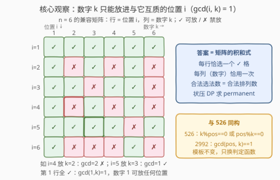
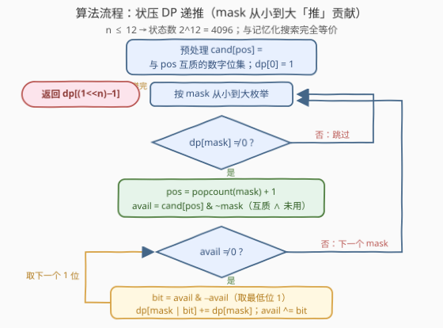
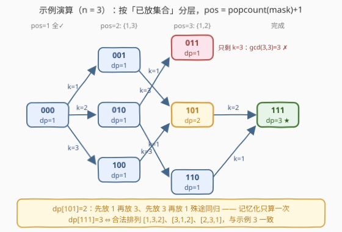

# 自整除排列的数量

- **题目名称**：自整除排列的数量
- **链接**：[2992. 自整除排列的数量](https://leetcode.cn/problems/number-of-self-divisible-permutations/)
- **难度**：中等
- **标签**：位运算、数组、数学、动态规划、回溯、状态压缩、数论

## 1. 题目概述

> ⚠️ 本题为 LeetCode **付费题**（`isPaidOnly`）。下方题意描述、示例与约束依据官方样例与题目规则整理还原，如有出入请以官方为准；算法与示例输出已用自洽代码验证。

给定一个整数 `n`，返回 **下标从 1 开始** 的数组 `nums = [1, 2, ..., n]` 的**可能的排列数量**，使其满足**自整除**条件。

如果对于每个 `1 <= i <= n`，满足 `gcd(a[i], i) == 1`（即 `a[i]` 与 `i` **互质**），数组 `a` 就是**自整除**的。

数组的**排列**是对数组元素的重新排序，例如 `[1, 2, 3]` 的所有排列为 `[1,2,3]`、`[1,3,2]`、`[2,1,3]`、`[2,3,1]`、`[3,1,2]`、`[3,2,1]`。

**示例 1**：

```text
输入：n = 1
输出：1
解释：数组 [1] 只有一个排列，它是自整除的。
```

**示例 2**：

```text
输入：n = 2
输出：1
解释：数组 [1,2] 有 2 个排列，但只有其中一个是自整除的：
  nums = [1,2]：不是自整除的，因为 gcd(nums[2], 2) = gcd(2, 2) = 2 != 1
  nums = [2,1]：是自整除的，因为 gcd(nums[1], 1) = gcd(2, 1) == 1 且 gcd(nums[2], 2) = gcd(1, 2) == 1
```

**示例 3**：

```text
输入：n = 3
输出：3
解释：数组 [1,2,3] 有 3 个自整除的排列：[1,3,2]、[3,1,2]、[2,3,1]。
其余 3 个排列不满足条件，因此答案是 3。
```

**约束条件**：

- `1 <= n <= 12`

> ⚠️ **别被名字带偏**：题名「自整除」（self-divisible）听起来像 [728. 自除数](https://leetcode.cn/problems/self-dividing-numbers/)或 [526. 优美的排列](https://leetcode.cn/problems/beautiful-arrangement/)的整除判定，但条件其实是**互质**——`gcd(a[i], i) == 1`。写代码时把判定函数抄成「整除」是本题最典型的翻车点。

> 💡 **关键信号**：`n ≤ 12` 是**状压 DP（bitmask DP）**的标志性数据范围——$2^{12} = 4096$ 个状态，落在「可以枚举所有子集」的甜区。官方 hint 也点明了路径：「Think of Backtracking」——回溯 + 记忆化 = 状压 DP。

---

## 2. 解题思路

### 2.1 暴力思路

枚举 `1..n` 的全部 $n!$ 个排列，逐个检查每个位置是否满足 `gcd(a[i], i) == 1`。`n = 12` 时 $12! \approx 4.8 \times 10^8$，再乘上每个排列 $O(n)$ 的检查，必然超时（Python 更是远远不够）。

官方 hint「Think of Backtracking」提示我们：排列是**逐步构造**的，第 `i` 位放数字 `k` 是否合法只取决于 `(i, k)` 这个二元组，与前面放了什么无关——所以可以边构造边剪枝，天然砍掉大量非法前缀。而给回溯加上记忆化，就是状压 DP。

### 2.2 核心观察：兼容矩阵 + 位掩码记录「已放集合」

先构造一张**兼容矩阵** $M$：$M[i][k] = 1$ 当且仅当 $\gcd(i, k) = 1$（位置 `i` 允许放数字 `k`）。所求即：**在矩阵每一行恰选一个 `✓` 格、且每一列（数字）恰被用一次的方案数**——这正是矩阵 $M$ 的**积和式**（permanent）。



排列是逐位填出来的。在任意中间时刻，我们只关心两件事：

1. **哪些数字已经被放掉**（决定还能放哪些）；
2. **下一个要填第几号位置**（决定本轮的互质判定）。

而「下一个位置」由「已放个数」唯一确定——放了 `c` 个数字，下一个就填第 `c+1` 号位。因此**只需要一维信息「已用数字集合」就能完整刻画状态**：

- `mask` 的第 `k-1` 位为 `1`，表示数字 `k` **已放置**；
- 下一位置 $pos = \text{popcount}(mask) + 1$（**1-indexed**）；
- 判定：数字 `k` 能放进位置 `pos` 当且仅当 $\gcd(pos, k) = 1$。

> 💡 **与 526 完全同构**：[526. 优美的排列](https://leetcode.cn/problems/beautiful-arrangement/)（[站内题解](../0501-0600/526_优美的排列.md)）的状态设计与本题一模一样，只是判定函数从「`k % pos == 0` 或 `pos % k == 0`」换成了「`gcd(pos, k) == 1`」。会 526 就等于会本题，反过来练本题也能巩固 526。

### 2.3 状态转移与算法流程

定义 $dp[mask]$ = 已经放置了 `mask` 所表示的数字集合时，能延伸出的合法排列数。

对当前状态 `mask`，下一位置 $pos = \text{popcount}(mask) + 1$。枚举每一个**尚未使用**且**与 `pos` 互质**的数字 `k`（即 `mask` 的第 `k-1` 位为 `0` 且 $\gcd(pos, k) = 1$），把 `k` 放到 `pos`：

$$dp[\text{mask} \mid (1 \ll (k-1))] \mathrel{+}= dp[\text{mask}]$$

- **初始**：`dp[0] = 1`（空排列，1 种起点）；
- **答案**：`dp[(1 << n) - 1]`（数字全放完）。



**位集小加速**：互质判定只依赖 `(pos, k)` 二元组，可以预处理 `cand[pos]` = 与 `pos` 互质的数字组成的位掩码；转移时令 `avail = cand[pos] & ~mask`（既互质又未用），再用 `avail & -avail` 逐个取出最低位的 `1` 枚举，内层循环完全不碰无效数字。

> 💡 **为什么不会算重？** 每个 `mask` 对应确定的已放集合，下一位置又被 `popcount(mask)` 唯一确定；从 `mask` 出发放 `k` 走到的状态 `mask | (1<<(k-1))` 唯一。于是每条「放置序列」恰对应状态 DAG 上从 `0` 到全 `1` 的一条路径，**一一对应**，无重复无遗漏。

### 2.4 示例演算（n = 3）

数字 `{1,2,3}`，3 位 `mask`，共 8 个状态。各位置允许的数字（互质判定）：

- `pos=1`：`{1,2,3}`（任何数都与 1 互质）；
- `pos=2`：`{1,3}`（2 只与奇数互质）；
- `pos=3`：`{1,2}`（3 不整除 1、2）。



逐层累加（节点形如 `mask (dp值)`，边上标注放置的数字 `k`）：

```text
dp[000]=1 → 放1→001, 放2→010, 放3→100
dp[001]=1 → pos=2, 放3→101                    (k=2 与 2 不互质，剪掉)
dp[010]=1 → pos=2, 放1→011, 放3→110           (1、3 都与 2 互质)
dp[100]=1 → pos=2, 放1→101                    (k=2 与 2 不互质，剪掉)  → dp[101]=2
dp[011]=1 → pos=3, 只剩 k=3, gcd(3,3)=3 ✗     死状态
dp[101]=2 → pos=3, 放2→111                    (gcd(3,2)=1)           → dp[111] += 2
dp[110]=1 → pos=3, 放1→111                    (gcd(3,1)=1)           → dp[111] += 1
dp[111]=3 ★
```

最终 `dp[111] = 3`，对应三个合法排列 `[1,3,2]`、`[3,1,2]`、`[2,3,1]`，与示例 3 一致。两个细节值得注意：

- `011` 是**死状态**：已放 `{1,2}`、轮到 `pos=3` 时只剩数字 3，而 `gcd(3,3)=3`——互质约束在搜索树上天然剪枝；
- `101` 的 `dp=2`：先放 1 再放 3、先放 3 再放 1 **殊途同归**到同一 `mask`，记忆化/递推只算一次，这正是相对纯回溯省下的重复子问题。

---

## 3. 参考代码

### 方法一：记忆化搜索（自顶向下，顺着回溯写）

### Python

```python
from math import gcd
from functools import lru_cache

class Solution:
    def selfDivisiblePermutationCount(self, n: int) -> int:
        full = (1 << n) - 1

        @lru_cache(None)
        def dfs(mask: int) -> int:
            if mask == full:
                return 1
            pos = mask.bit_count() + 1          # 下一位置（1-indexed）
            total = 0
            for k in range(1, n + 1):
                bit = 1 << (k - 1)
                if (mask & bit) == 0 and gcd(pos, k) == 1:
                    total += dfs(mask | bit)
            return total

        return dfs(0)
```

### C++

```cpp
class Solution {
  public:
    int selfDivisiblePermutationCount(int n) {
        int full = (1 << n) - 1;
        vector<int> memo(1 << n, -1);
        function<int(int)> dfs = [&](int mask) -> int {
            if (mask == full) return 1;
            if (memo[mask] != -1) return memo[mask];
            int pos = __builtin_popcount(mask) + 1;   // 下一位置（1-indexed）
            int total = 0;
            for (int k = 1; k <= n; ++k) {
                int bit = 1 << (k - 1);
                if ((mask & bit) == 0 && __gcd(pos, k) == 1) {
                    total += dfs(mask | bit);
                }
            }
            return memo[mask] = total;
        };
        return dfs(0);
    }
};
```

### 方法二：递推 + 位集预计算（自底向上，常数更小）

从小到大枚举 `mask`，把贡献「推」给更大的状态；互质关系预编码成位集，内层用 lowbit 技巧枚举。

### Python

```python
from math import gcd

class Solution:
    def selfDivisiblePermutationCount(self, n: int) -> int:
        full = (1 << n) - 1
        # cand[pos]：与位置 pos 互质的数字组成的位集（第 k-1 位为 1 表示 k 可放）
        cand = [0] * (n + 1)
        for pos in range(1, n + 1):
            for k in range(1, n + 1):
                if gcd(pos, k) == 1:
                    cand[pos] |= 1 << (k - 1)

        dp = [0] * (1 << n)
        dp[0] = 1
        for mask in range(1 << n):
            if dp[mask] == 0:
                continue                          # 不可达状态，跳过
            pos = mask.bit_count() + 1
            if pos > n:
                continue                          # 已放满
            avail = cand[pos] & ~mask             # 既互质又未用
            while avail:
                bit = avail & -avail              # 取最低位的 1
                dp[mask | bit] += dp[mask]
                avail ^= bit
        return dp[full]
```

### C++

```cpp
class Solution {
  public:
    int selfDivisiblePermutationCount(int n) {
        int full = (1 << n) - 1;
        vector<int> cand(n + 1, 0);
        for (int pos = 1; pos <= n; ++pos)
            for (int k = 1; k <= n; ++k)
                if (__gcd(pos, k) == 1) cand[pos] |= 1 << (k - 1);

        vector<int> dp(1 << n, 0);
        dp[0] = 1;
        for (int mask = 0; mask <= full; ++mask) {
            if (dp[mask] == 0) continue;                 // 不可达状态
            int pos = __builtin_popcount(mask) + 1;
            if (pos > n) continue;                       // 已放满
            for (int avail = cand[pos] & ~mask; avail; avail &= avail - 1)
                dp[mask | (avail & -avail)] += dp[mask]; // lowbit 枚举
        }
        return dp[full];
    }
};
```

> 💡 **小技巧**：`for (; avail; avail &= avail - 1)` 每轮消去最低位的 `1`，配合 `avail & -avail` 取出该位，是位集枚举的标准姿势；`__builtin_popcount` / `int.bit_count()` 是 CPU 单指令 popcount，比手写循环更快。

---

## 4. 复杂度分析

| 维度 | 复杂度 | 说明 |
|------|--------|------|
| 时间复杂度 | $O(n \cdot 2^n)$ | 共 $2^n$ 个状态，每个状态枚举至多 $n$ 个数字判定转移；方法二的 $O(n^2)$ 互质表预处理可忽略 |
| 空间复杂度 | $O(2^n)$ | `dp` / `memo` 数组大小为 $2^n$ |

$n = 12$ 时约为 $12 \times 4096 \approx 4.9 \times 10^4$ 次操作，毫秒级完成。作为对比，**纯回溯**（不记忆化）实测 `n = 12` 时搜索树约 $2 \times 10^6$ 个节点——互质剪枝已把 $12! \approx 4.8 \times 10^8$ 砍掉了五个数量级，纯 DFS 也能通过，但比状压 DP 慢约 40 倍，且约束一变（如放宽判定）就可能退化回 $n!$。

---

## 5. 扩展

### 5.1 与 526 的同构对照

| | [526. 优美的排列](https://leetcode.cn/problems/beautiful-arrangement/)（[站内题解](../0501-0600/526_优美的排列.md)） | 2992. 自整除排列的数量 |
|------|------|------|
| 判定条件 | $k \bmod pos = 0$ 或 $pos \bmod k = 0$ | $\gcd(pos, k) = 1$ |
| `n` 上限 | 15 | 12 |
| 状态设计 | `mask` = 已放数字集合，`pos = popcount+1` | 完全相同 |
| 复杂度 | $O(n \cdot 2^n)$ | $O(n \cdot 2^n)$ |

两题代码只差**一行判定函数**——这正是「兼容矩阵求积和式」框架的威力：把「位置 × 数字」的合法性抽象成矩阵，换任何判定（整除、互质、异或值……）都不用动 DP 骨架。

### 5.2 积和式视角与 #P-hard

把兼容矩阵 $M$ 写出来后，答案 = permanent$(M) = \sum_{\text{排列}\,\sigma} \prod_i M[i][\sigma(i)]$。**积和式的一般计算是 #P-hard**（行列式有高斯消元 $O(n^3)$，积和式没有多项式通用算法），$O(n \cdot 2^n)$ 的状压 DP 已是通用解法的复杂度下界量级（与 Ryser 容斥公式同阶）。所以 `n` 稍大（如 `n = 25`）通用做法就彻底失效，本题把 `n` 压到 12 正是给状压 DP 留的甜区。

### 5.3 数论小彩蛋

- **答案恒非零**：循环移位排列 $[2, 3, \ldots, n, 1]$ 永远合法——相邻整数互质（$\gcd(i, i+1) = 1$），且 $\gcd(1, n) = 1$。所以任何 `n` 都至少有 1 个自整除排列（`n = 2` 时它就是唯一解）。
- **`n` 增大答案不一定增大**：实测答案序列（`n = 1..12`）为 `1, 1, 3, 4, 28, 16, 256, 324, 3600, 3600, 129744, 63504`——`n = 6` 比 `n = 5` 少，`n = 12` 比 `n = 11` 少。原因可以直观理解：数字 6 只能放进与它互质的位置 $\{1, 5\}$，同时第 6 号位置也只接受 $\{1, 5\}$，约束突然收紧；数字 12 同理被锁死在 $\{1, 5, 7, 11\}$ 里。计数问题里「加一个元素反而更少」并不罕见。

---

## 6. 面试要点

1. **为什么 `n ≤ 12` 要立刻想到状压 DP？**
   - $2^{12} = 4096$，状态空间可承受；一般 `n ≤ 20` 的「选/不选」计数/最值问题都可考虑状压，这是**识别套路的经验阈值**。本题排列逐位构造 + 只需记「已用集合」，正是标准甜区。

2. **本题和 526 优美的排列是什么关系？**
   - 完全同构：状态 `mask` = 已放数字集合、`pos = popcount(mask)+1`、转移 `dp[mask|bit] += dp[mask]` 全部复用，只把判定换成 `gcd(pos, k) == 1`。两题可抽象成「兼容矩阵求积和式」的统一框架。

3. **为什么一维 `mask` 就够、且不重不漏？**
   - 位置由 `popcount(mask)` 唯一确定；从 `mask` 出发放 `k` 到达的新状态唯一，于是「放置序列」与「DAG 上 0 → 全 1 的路径」一一对应。

4. **记忆化到底省在哪里？纯回溯不行吗？**
   - 同一 `mask` 可由多种放置顺序到达（如先 1 后 3 与先 3 后 1 都到 `101`），这些顺序殊途同归；记忆化把「同一集合的后续方案数」只算一次。纯回溯实测 `n = 12` 约 $2 \times 10^6$ 节点也能过，但慢约 40 倍，且换弱约束会退化到 $n!$——面试先写记忆化版更稳。

5. **如果 `n` 很大（比如 $10^5$）怎么办？**
   - 答案 = 兼容矩阵的积和式，而积和式通用计算是 **#P-hard**，$O(n \cdot 2^n)$ 已是通用极限。超大 `n` 只能利用互质的数论结构（素数位置避开自身倍数、交换论证 / Hall 定理判存在性等）做存在性或近似分析——面试答出「识别问题类别 + 复杂度壁垒」即可加分。

---

## 7. 同类练习题

- [526. 优美的排列](https://leetcode.cn/problems/beautiful-arrangement/)（[站内题解](../0501-0600/526_优美的排列.md)）：同模板母题，判定换成「双向整除」，`n ≤ 15`；两题代码只差一行判定函数，必做对照
- [1879. 两个数组最小的异或值之和](https://leetcode.cn/problems/minimum-xor-sum-of-two-arrays/)（[站内题解](../1801-1900/1879_两个数组最小的异或值之和.md)）：兼容矩阵换成 $nums_1[i] \oplus nums_2[j]$，计数变最值，同一个 $O(n \cdot 2^n)$ 状压骨架
- [1434. 每个人戴不同帽子的方案数](https://leetcode.cn/problems/number-of-ways-to-wear-different-hats-to-each-other/)（[站内题解](../1401-1500/1434_每个人戴不同帽子的方案数.md)）：二分匹配计数（同样是积和式型），`mask` 改记「已戴帽集合」，状态设计与本题互为镜像
- [2172. 数组的最大与和](https://leetcode.cn/problems/maximum-and-sum-of-array/)（[站内题解](../2101-2200/2172_数组的最大与和.md)）：槽位分配最值型状压，体会「`mask` 语义」的多种设计（组内二进制拆位表示同一槽的多个容量）
