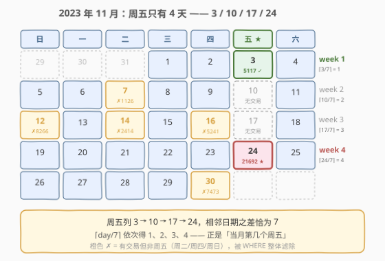
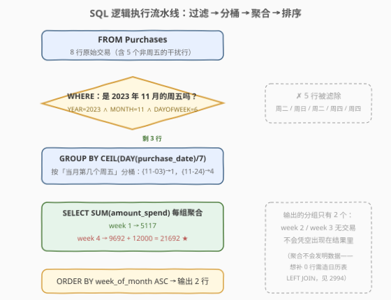
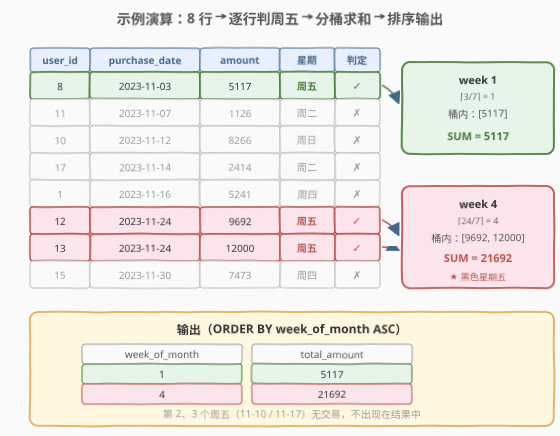

# LeetCode 发生在周五的交易 I 题解

## 1. 题目概述

- **标题 / 题号**：发生在周五的交易 I（#2993，medium）
- **链接**：https://leetcode.cn/problems/friday-purchases-i/
- **难度**：中等
- **标签**：SQL、日期函数、DAYOFWEEK、CEIL、GROUP BY 聚合

> ⚠️ 本题为 LeetCode 付费题，题意描述根据官方示例用例与 hints 重建，可能与官方题面有出入。

**题意**：给定一张交易表 `Purchases`，每行记录某用户在某天的消费金额。编写解决方案，统计 **2023 年 11 月每个周五的全平台总消费金额**：把同属一个周五的多笔消费求和，并标记它属于当月的第几个周五（`week_of_month`）。**若某个周五没有任何交易，该周不进入结果表**。按 `week_of_month` 升序返回。

**表结构**：

```text
Table: Purchases
+---------------+------+
| Column Name   | Type |
+---------------+------+
| user_id       | int  |
| purchase_date | date |  ← 格式 'YYYY-MM-DD'
| amount_spend  | int  |
+---------------+------+
(user_id, purchase_date) 是这张表的主键
```

**示例 1**：

```text
输入：
Purchases 表:
+---------+---------------+--------------+
| user_id | purchase_date | amount_spend |
+---------+---------------+--------------+
| 11      | 2023-11-07    | 1126         |
| 15      | 2023-11-30    | 7473         |
| 17      | 2023-11-14    | 2414         |
| 12      | 2023-11-24    | 9692         |
| 8       | 2023-11-03    | 5117         |
| 1       | 2023-11-16    | 5241         |
| 10      | 2023-11-12    | 8266         |
| 13      | 2023-11-24    | 12000        |
+---------+---------------+--------------+

输出：
+--------------+--------------+
| week_of_month | total_amount |
+--------------+--------------+
| 1            | 5117         |
| 4            | 21692        |
+--------------+--------------+

解释：
- 2023-11-03 是 11 月第 1 个周五：仅用户 8 消费，合计 5117
- 2023-11-10（第 2 个周五）、2023-11-17（第 3 个周五）无任何交易，不进入结果
- 2023-11-24 是 11 月第 4 个周五：9692 + 12000 = 21692
- 其余 5 行分别落在周二（11-07、11-14）、周日（11-12）、周四（11-16、11-30），被「周五」条件整体滤除
```

**约束**：

- `purchase_date` 为 `DATE` 类型，格式 `YYYY-MM-DD`
- `(user_id, purchase_date)` 为主键——同一用户同一天至多一行
- 输出列名为 `week_of_month`、`total_amount`，按 `week_of_month` 升序

> 💡 2023-11-24 恰好是 2023 年的**黑色星期五**（Black Friday，感恩节后第一个周五）——本系列题（2993/2994）以「黑五消费分析」为主题背景，示例中最大的一笔 12000 也压在这一天，出题人的小心思藏在数据里。

## 2. 解题思路

### 2.1 暴力思路：把四个周五日期硬编码进 SQL

最不动脑的写法：先翻日历查出 2023 年 11 月的周五是 3、10、17、24 号，再把日期逐个写死：

```sql
SELECT 1 AS week_of_month, SUM(amount_spend) AS total_amount
FROM Purchases WHERE purchase_date = '2023-11-03'
UNION ALL
SELECT 2, SUM(amount_spend) FROM Purchases WHERE purchase_date = '2023-11-10'
UNION ALL
SELECT 3, SUM(amount_spend) FROM Purchases WHERE purchase_date = '2023-11-17'
UNION ALL
SELECT 4, SUM(amount_spend) FROM Purchases WHERE purchase_date = '2023-11-24'
ORDER BY week_of_month;
```

能过，但有三宗罪：

1. **日历知识侵入了查询逻辑**——「哪天是周五」本是数据库日期函数的职责，现在变成了程序员的记忆负担；
2. **零泛化能力**——换个月份、换个年份立刻报废，2994 要求覆盖全部周五时更是无从下手；
3. **重复扫描**——`UNION ALL` 四段各扫一遍表（虽然本题数据量小无所谓）。

> ⚠️ 暴力法的本质问题是：让「人」干了「机器」的活。判断星期几、定位第几周，都应该交给日期函数在**一行数据内**就地完成。

### 2.2 核心观察：判周五交给 `DAYOFWEEK`，周序交给 $\lceil \text{day}/7 \rceil$



整个问题拆成两个独立的小问题，各有一个一行解法：

**观察 1（判周五）**：MySQL 的 `DAYOFWEEK(d)` 返回 $1\sim7$，**周日 = 1，周五 = 6**；`WEEKDAY(d)` 则是**周一 = 0，周五 = 4**。判定「这天是不是周五」就是一次函数调用，不需要任何字符串比较。

**观察 2（第几个周五）**：这是本题真正的题眼。**同一个星期几在一个月内出现的日期必然是 $d,\ d+7,\ d+14,\ d+21,\ldots$，且首项 $1 \le d \le 7$**（若首项超过 7，往前数 7 天还在同一个月内，矛盾）。于是：

$$\left\lceil \frac{d+7k}{7} \right\rceil = \left\lceil \frac{d}{7} \right\rceil + k = 1 + k$$

即 $\lceil \text{DAY}(d)/7 \rceil$ **恰好等于「当月第几个周 X」**——对任意月份、任意星期几都成立，绝非 2023 年 11 月的巧合。2023-11 的周五是 3、10、17、24 号，$\lceil 3/7\rceil=1$、$\lceil 10/7\rceil=2$、$\lceil 17/7\rceil=3$、$\lceil 24/7\rceil=4$，一步到位。

> 💡 一个常见的错误直觉是「`DAY(d) / 7` 四舍五入」或「按自然周切分」——后者要算 `WEEK(d) - WEEK(月初)` 还得对齐周边界，而 $\lceil \text{day}/7\rceil$ 连日历表都不需要。面试时能**当场证明**这个公式的正确性（首项 $d\in[1,7]$ + 差恒为 7），比背结论有说服力得多。

### 2.3 算法流程图



**逻辑执行步骤**（SQL 的书写顺序与执行顺序在此题中体现得非常典型）：

| 步骤 | 子句 | 作用 | 示例效果 |
|------|------|------|----------|
| ① | `FROM Purchases` | 全表 8 行进入流水线 | — |
| ② | `WHERE` 三条件 | 年=2023、月=11、`DAYOFWEEK=6` | 滤掉 5 个非周五行，剩 3 行 |
| ③ | `GROUP BY CEIL(DAY/7)` | 按「第几个周五」分桶 | `{11-03}→1`，`{11-24 ×2}→4` |
| ④ | `SELECT SUM(...)` | 桶内聚合 | week 1 → 5117；week 4 → 21692 |
| ⑤ | `ORDER BY` | 按 `week_of_month` 升序 | `(1, 5117)`、`(4, 21692)` |

> ⚠️ 注意第 ② 步的副作用：**`WHERE` 先过滤、`GROUP BY` 只对幸存行建组**，所以 week 2、week 3 根本不会出现在结果里——「聚合不会发明数据」。这正是本题与 2994 的分界线（见第 5 节）。

### 2.4 示例演算



把 8 行按日期排序后逐行过 `WHERE`：

| user_id | purchase_date | 星期 | 判定 | 去向 |
|---------|---------------|------|------|------|
| 8 | 2023-11-03 | 周五 | ✓ | 桶 1（$\lceil 3/7\rceil=1$），累加 5117 |
| 11 | 2023-11-07 | 周二 | ✗ | 滤除 |
| 10 | 2023-11-12 | 周日 | ✗ | 滤除 |
| 17 | 2023-11-14 | 周二 | ✗ | 滤除 |
| 1 | 2023-11-16 | 周四 | ✗ | 滤除 |
| 12 | 2023-11-24 | 周五 | ✓ | 桶 4（$\lceil 24/7\rceil=4$），累加 9692 |
| 13 | 2023-11-24 | 周五 | ✓ | 桶 4，累加 12000 |
| 15 | 2023-11-30 | 周四 | ✗ | 滤除 |

**收尾聚合**：

$$\text{week 1}: 5117 \qquad \text{week 4}: 9692 + 12000 = 21692$$

输出按 `week_of_month` 升序：`(1, 5117)`、`(4, 21692)`。

> 💡 干扰行的日期是有设计感的：覆盖了周二、周日、周四三种非周五情形，专抓「只会判大小」或「忘了判星期」的写法；其中 11-30（周四、月末日）还能钓出「按 `DAY/7` 截断而不是上取整」的边界错误——$\lfloor 30/7 \rfloor = 4$ 与 $\lceil 30/7 \rceil = 5$ 不同，好在它先被星期条件滤掉了。

## 3. 参考代码

### SQL（MySQL，主解法：日期函数 + 上取整）

```sql
# Write your MySQL query statement below
SELECT CEIL(DAY(purchase_date) / 7) AS week_of_month,
       SUM(amount_spend)          AS total_amount
FROM Purchases
WHERE YEAR(purchase_date) = 2023
  AND MONTH(purchase_date) = 11
  AND DAYOFWEEK(purchase_date) = 6   -- 周日=1, …, 周五=6
GROUP BY week_of_month
ORDER BY week_of_month;
```

> 💡 **写法要点**：
> - `CEIL(DAY(purchase_date) / 7)`：一行内算出「当月第几个周五」，无需日历表、无需窗口函数；
> - `GROUP BY week_of_month` 引用 `SELECT` 别名是 **MySQL 扩展**（PostgreSQL 同样允许，标准 SQL 不允许），可移植写法是原样重复表达式；
> - 若确认表内只有 2023 年 11 月的数据，`YEAR`/`MONTH` 两个条件可省——但保留它们是廉价的防御。

### SQL（备选：sargable 写法，索引友好）

```sql
# Write your MySQL query statement below
SELECT (DAY(purchase_date) + 6) DIV 7 AS week_of_month,
       SUM(amount_spend)              AS total_amount
FROM Purchases
WHERE purchase_date >= '2023-11-01'
  AND purchase_date <  '2023-12-01'
  AND WEEKDAY(purchase_date) = 4      -- 周一=0, …, 周五=4
GROUP BY week_of_month
ORDER BY week_of_month;
```

> 💡 **写法要点**：
> - **区间条件替代函数包裹列**：`purchase_date >= '2023-11-01' AND < '2023-12-01'` 是** sargable**（可下推索引做范围扫描）的写法；`YEAR(d)=2023 AND MONTH(d)=11` 把列包进函数，索引直接失效。本题数据量小无感，大表上是执行计划的分水岭。
> - `(DAY(d) + 6) DIV 7` 是 $\lceil \text{day}/7 \rceil$ 的整数变形：加 6 后整除等价于上取整，避免依赖 `/` 产生的小数。
> - 左闭右开 `< '2023-12-01'` 是时间区间的标准姿势——若列升级为 `DATETIME`，`<= '2023-11-30'` 会漏掉 11-30 当天 00:00 之后的数据。

### Python（pandas）

```python
import pandas as pd

def friday_purchases(purchases: pd.DataFrame) -> pd.DataFrame:
    d = purchases[purchases['purchase_date'].dt.dayofweek == 4]          # 周五：Mon=0 … Fri=4
    d = d[(d['purchase_date'].dt.year == 2023) & (d['purchase_date'].dt.month == 11)]
    d = d.assign(week_of_month=(d['purchase_date'].dt.day + 6) // 7)    # ⌈day/7⌉
    g = d.groupby('week_of_month', as_index=False)['amount_spend'].sum()
    return g.rename(columns={'amount_spend': 'total_amount'})
```

> 💡 **pandas 对照**：`dt.dayofweek == 4` 对应 `DAYOFWEEK() = 6`（两套编号不同：pandas 周一为 0，MySQL `DAYOFWEEK` 周日为 1）；`(day + 6) // 7` 对应 `CEIL(day / 7)`。`groupby` 默认按键升序，天然满足 `ORDER BY week_of_month`。

## 4. 复杂度分析

| 维度 | 复杂度 | 说明 |
|------|--------|------|
| **时间** | $O(n)$ | $n$ = 表行数；单表扫描一遍，过滤、分桶、求和一趟完成 |
| **空间** | $O(k)$ | $k$ = 输出组数；一个月至多 5 个周五，即 $k \le 5$，聚合器常数级 |
| **对比暴力** | 暴力 $O(4n)$ | `UNION ALL` 四段各扫一遍全表；虽同为线性，常数与扩展性都差 |

> ⚠️ 两种解法都逃不开全表扫描吗？不一定——备选解法的日期区间条件若命中 `purchase_date` 上的索引，可直接定位 11 月分片；但「周五」判定（`DAYOFWEEK`/`WEEKDAY` 作用于列）无法用普通索引加速，想彻底索引化需函数索引或生成列，本题规模下没必要。

## 5. 扩展：2994 与「缺失周五补零」的通用套路

本题的输出里，week 2、week 3 消失了——因为 `GROUP BY` 只给**存在的数据**建组。同系列的 [2994. 发生在周五的交易 II](https://leetcode.cn/problems/friday-purchases-ii/)（困难）恰好反其道而行：**11 月的每个周五都要出现在结果里，没有交易的周输出 0**（其示例输入与本题完全相同）。

补出「不存在的行」是 SQL 的经典题型，标准姿势是**日历表 LEFT JOIN 事实表**——用递归 CTE 从 11 月第一个周五开始，每次加 7 天生成全部周五：

```sql
WITH RECURSIVE friday AS (
    SELECT DATE('2023-11-03') AS d            -- 11 月的第一个周五
    UNION ALL
    SELECT d + INTERVAL 7 DAY
    FROM friday
    WHERE d + INTERVAL 7 DAY <= '2023-11-30'  -- 不越出 11 月
)
SELECT CEIL(DAY(f.d) / 7)          AS week_of_month,
       COALESCE(SUM(p.amount_spend), 0) AS total_amount   -- 无交易 → 0
FROM friday f
LEFT JOIN Purchases p ON p.purchase_date = f.d
GROUP BY week_of_month
ORDER BY week_of_month;
```

**方向不能反**：必须「日历表 LEFT JOIN 事实表」。若写成 `Purchases LEFT JOIN friday`，左表的每一行都还活着，无交易的周五照样凭空消失——LEFT JOIN 保留的是**左表**的完整性，谁当左表谁说了算。

> 💡 递归 CTE 的首日 `2023-11-03` 仍是硬编码，更彻底的做法是用「11 月 1 日 + (11 - dayofweek(11月1日)) mod 7」公式推出第一个周五，实现完全的「给定任意年月」泛化——面试追问时能主动走到这一步即是亮点。

## 6. 面试要点

1. **判断「周五」有几种写法？哪种最不可靠？**

   - `DAYOFWEEK(d) = 6`（周日=1）与 `WEEKDAY(d) = 4`（周一=0）都可靠；`DATE_FORMAT(d, '%W') = 'Friday'` **不可靠**——`%W` 返回星期全名，受服务器 `lc_time_names` 语言设置影响（中文环境可能返回非英文文本），字符串比较还丧失了类型语义。日期判定优先用数值函数，而不是格式化后比字符串。

2. **证明 `CEIL(DAY(d) / 7)` 恰好等于「当月第几个周五」。**

   - 同一星期几在月内的日期必为 $d, d+7, d+14, \ldots$，且首项 $1 \le d \le 7$（否则 $d-7 \ge 1$ 仍是同月的同一星期几，与首项矛盾）。于是第 $k$ 个（从 0 数）的日期为 $d + 7k$，$\lceil (d+7k)/7 \rceil = \lceil d/7 \rceil + k = 1 + k$。对任何月份、任何星期几都成立。

3. **`WHERE YEAR(d)=2023 AND MONTH(d)=11` 与日期区间条件，在执行计划上有何区别？**

   - 前者对**列**套函数，非 sargable，`purchase_date` 上有索引也用不上，只能全表扫描；`d >= '2023-11-01' AND d < '2023-12-01'` 是纯区间谓词，可走索引范围扫描。左闭右开写法还能免疫 `DATE` → `DATETIME` 的类型升级。

4. **结果里为什么没有 week 2、week 3？如果面试官要求补 0 呢？**

   - SQL 逻辑执行顺序是 `WHERE` 先于 `GROUP BY`：无交易的周五在分组前就被清场，`GROUP BY` 只为幸存行建组——聚合不会发明数据。补 0 需要**反向 LEFT JOIN**：先用递归 CTE（或 UNION ALL）生成当月全部周五的日历表作为**左表**，LEFT JOIN 交易表，再 `COALESCE(SUM(...), 0)`。这正是 2994 的考法。

5. **`GROUP BY week_of_month` 引用了别名，为什么能跑？**

   - MySQL（及 PostgreSQL）扩展允许 `GROUP BY`/`HAVING` 引用 `SELECT` 别名；但标准 SQL 不允许，换方言可能报「列不存在」。可移植写法是重复完整表达式 `GROUP BY CEIL(DAY(purchase_date) / 7)`。类似的坑还有 `ONLY_FULL_GROUP_BY` 模式下 `SELECT` 未聚合列必须出现在 `GROUP BY` 里。

> 💡 **一句话总结**：2993 把「日期函数」拆成两个独立考点——`DAYOFWEEK` 判星期、$\lceil \text{day}/7\rceil$ 定周序，后者靠「同星期几日期差恒为 7」这一日历不变式一步证明。把这两个函数吃透，再看 2994 的日历表补零，整条「时间分桶」线就通了。

## 同类练习题

| # | 题目 | 与本题的关联 |
|---|------|-------------|
| 2994 | [发生在周五的交易 II](https://leetcode.cn/problems/friday-purchases-ii/) | 同表数据的困难续作——11 月每个周五都要输出、无交易的周补 0，练递归 CTE 造日历 + LEFT JOIN 方向性 |
| 585 | [2016 年的投资](https://leetcode.cn/problems/investments-in-2016/) | `YEAR()`/`MONTH()` 日期函数过滤入门，顺带体会函数包裹列对索引的影响 |
| 550 | [游戏玩法分析 IV](https://leetcode.cn/problems/game-play-analysis-iv/) | `DATEDIFF` 算日期间隔 + 分组聚合判定留存，日期函数组合拳 |
| 1193 | [每月交易 I](https://leetcode.cn/problems/monthly-transactions-i/) | `DATE_FORMAT` 按月分桶统计交易额——「按时间分组聚合」的另一种形态，对比本题的按周分桶 |
