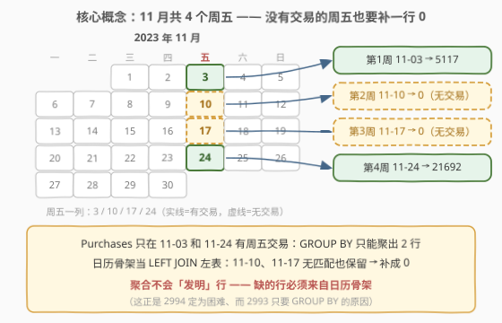
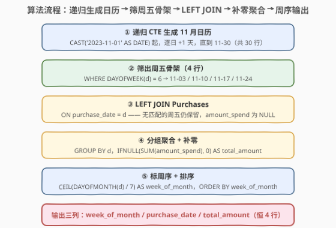
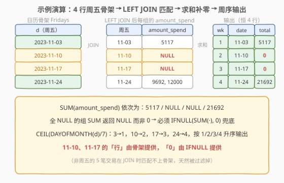

# 发生在周五的交易 II

- **题目名称**：发生在周五的交易 II
- **链接**：[2994. 发生在周五的交易 II](https://leetcode.cn/problems/friday-purchases-ii/)
- **难度**：困难
- **标签**：数据库、SQL、递归 CTE、日历骨架、LEFT JOIN、日期函数

## 1. 题目概述

> ⚠️ 本题为 LeetCode 付费题，题意描述根据官方示例用例与外部资料重建，可能与官方题面有出入。

**表结构**：`Purchases`

| 列名 | 类型 |
|------|------|
| user_id | int |
| purchase_date | date |
| amount_spend | int |

- `(user_id, purchase_date, amount_spend)` 为该表的主键（具有唯一值的列组合）。
- `purchase_date` 的取值范围从 2023-11-01 到 2023-11-30（含两端）。
- 每行包含用户 id、购买日期与消费金额。

**目标**：编写一个解决方案，计算用户在 **2023 年 11 月的每个星期五** 的**总花费**。若某个周五当天**没有**任何购买记录，该周仍要输出，总花费视为 `0`。结果按每月的周次序 `week_of_month` **升序**排列。

**输出**：`week_of_month`、`purchase_date`、`total_amount` 三列。

**示例 1**：

```text
输入：
Purchases 表：
+---------+---------------+--------------+
| user_id | purchase_date | amount_spend |
+---------+---------------+--------------+
| 11      | 2023-11-07    | 1126         |
| 15      | 2023-11-30    | 7473         |
| 17      | 2023-11-14    | 2414         |
| 12      | 2023-11-24    | 9692         |
| 8       | 2023-11-03    | 5117         |
| 1       | 2023-11-16    | 5241         |
| 10      | 2023-11-12    | 8266         |
| 13      | 2023-11-24    | 12000        |
+---------+---------------+--------------+

输出：
+---------------+---------------+--------------+
| week_of_month | purchase_date | total_amount |
+---------------+---------------+--------------+
| 1             | 2023-11-03    | 5117         |
| 2             | 2023-11-10    | 0            |
| 3             | 2023-11-17    | 0            |
| 4             | 2023-11-24    | 21692        |
+---------------+---------------+--------------+
```

**解释**：

- 第 1 周的周五（2023-11-03）：发生一笔 $5,117 的交易 → 5117。
- 第 2 周的周五（2023-11-10）：当天没有交易 → 仍输出一行，值为 0。
- 第 3 周的周五（2023-11-17）：当天没有交易 → 仍输出一行，值为 0。
- 第 4 周的周五（2023-11-24）：发生两笔交易 $12,000 + $9,692 = $21,692。
- 输出表按 `week_of_month` 升序排列。

> 💡 读题三个关键点：① 2023 年 11 月**恰有 4 个周五**（3 / 10 / 17 / 24），输出**恒为 4 行**——没有交易的周五也要补一行 0，这正是本题（困难）与简单版 [2993. 发生在周五的交易 I](https://leetcode.cn/problems/friday-purchases-i/)（只输出有交易的周五）的唯一差别；② `week_of_month` 的口径是 **1–7 日为第 1 周、8–14 日为第 2 周、15–21 日为第 3 周……**（即 `CEIL(日号 / 7)`），不是 ISO 周、也不是「包含 1 号的那一周」；③ 2023-11-24 恰是黑色星期五（感恩节后的周五），当天往往是全月交易峰值。

---

## 2. 解题思路

### 2.1 暴力思路：直接 GROUP BY（会丢行）

直觉写法：筛出 2023 年 11 月且是周五的记录，按日期分组求和：

```sql
SELECT
    CEIL(DAYOFMONTH(purchase_date) / 7) AS week_of_month,
    purchase_date,
    SUM(amount_spend) AS total_amount
FROM Purchases
WHERE DAYOFWEEK(purchase_date) = 6
GROUP BY purchase_date
ORDER BY week_of_month;
```

这个查询**只输出「有交易」的周五**——示例中 11-10 与 11-17 没有任何记录，`GROUP BY` 无从产生这两行，输出只有 2 行（11-03 与 11-24）而非 4 行。事实上这正是 2993 的正确答案；2994 的难点就在于：**数据里不存在的行，必须自己「造」出来**。SQL 的聚合只会「折叠」已有行、不会「发明」新行，行的唯一来源是表——所以要造一张与交易无关、天然齐全的「11 月日历表」来当行的来源。

### 2.2 核心观察：日历骨架 + LEFT JOIN 补零

**观察一：行的来源换成「日历骨架」。**

用递归 CTE 从 2023-11-01 开始逐日 `+1` 生成到 11-30，得到 30 行的日历表 `Days`；再筛出 `DAYOFWEEK(d) = 6` 的行（MySQL 中 `DAYOFWEEK`：1 = 周日、…、6 = 周五、7 = 周六），恰好 4 行：11-03 / 11-10 / 11-17 / 11-24。这 4 行**与交易数据无关、必然存在**，让它们当 `LEFT JOIN` 的**左表**，输出行数就被锁定为 4。



**观察二：LEFT JOIN 保行 + IFNULL 补零。**

`Fridays LEFT JOIN Purchases ON purchase_date = d`：右表无匹配时**行仍在**，只是 `amount_spend` 为 `NULL`；而 `SUM` 作用在「全 NULL 的组」上返回的是 **NULL 而不是 0**，必须写 `IFNULL(SUM(amount_spend), 0)`。两处缺一不可：换成 `INNER JOIN` 丢行，漏掉 `IFNULL` 得 NULL。

**观察三：week_of_month 用 CEIL(DAYOFMONTH(d) / 7)。**

按题目口径：日号 1–7 → 第 1 周，8–14 → 第 2 周，15–21 → 第 3 周，22–28 → 第 4 周，29–30 → 第 5 周。于是 `CEIL(3/7)=1`、`CEIL(10/7)=2`、`CEIL(17/7)=3`、`CEIL(24/7)=4`，与示例一致。注意 `WEEK()` 函数的口径（周从周日/周一起算、跨月归属还有 mode 参数）与题目定义不同，用它容易翻车。

### 2.3 算法流程图



**完整步骤**：

1. **生成日历**：递归 CTE 从 `CAST('2023-11-01' AS DATE)` 逐日加 1 天，直到 `2023-11-30`，共 30 行。
2. **筛出周五**：`WHERE DAYOFWEEK(d) = 6`，得到 4 行周五骨架。
3. **LEFT JOIN**：`ON Purchases.purchase_date = Fridays.d`，右表缺失的周五保留为 NULL。
4. **分组聚合**：`GROUP BY` 周五日期，`IFNULL(SUM(amount_spend), 0) AS total_amount`。
5. **标周序并输出**：`CEIL(DAYOFMONTH(d) / 7) AS week_of_month`，按其升序 `ORDER BY`。

### 2.4 示例演算



LEFT JOIN 后的中间明细（骨架 4 行，右表按日期匹配）：

| 周五 d | 匹配到的 amount_spend | SUM(amount_spend) | IFNULL → total_amount |
|--------|----------------------|-------------------|----------------------|
| 2023-11-03 | 5117（用户 8） | 5117 | 5117 |
| 2023-11-10 | 无匹配（NULL） | NULL | **0** |
| 2023-11-17 | 无匹配（NULL） | NULL | **0** |
| 2023-11-24 | 9692（用户 12）、12000（用户 13） | 21692 | 21692 |

- 11-10、11-17 两组的 `amount_spend` 全为 NULL，`SUM` 返回 NULL，`IFNULL` 兜底成 0——「没有交易」与「交易额为 0」在输出里被拉平。
- `CEIL(DAYOFMONTH(d) / 7)`：3→1、10→2、17→3、24→4，按 1 / 2 / 3 / 4 升序输出 4 行。
- 其余 5 笔交易（11-07 / 11-30 / 11-14 / 11-16 / 11-12）都不是周五，在 JOIN 时匹配不上骨架，天然被过滤掉。

---

## 3. 参考代码

### MySQL

```sql
# Write your MySQL query statement below
WITH RECURSIVE Days AS (
    SELECT CAST('2023-11-01' AS DATE) AS d
    UNION ALL
    SELECT d + INTERVAL 1 DAY
    FROM Days
    WHERE d < '2023-11-30'
),
Fridays AS (
    SELECT d
    FROM Days
    WHERE DAYOFWEEK(d) = 6
)
SELECT
    CEIL(DAYOFMONTH(Fridays.d) / 7) AS week_of_month,
    Fridays.d AS purchase_date,
    IFNULL(SUM(amount_spend), 0) AS total_amount
FROM Fridays
LEFT JOIN Purchases ON Purchases.purchase_date = Fridays.d
GROUP BY Fridays.d
ORDER BY week_of_month;
```

> 💡 要点：递归 CTE 生成 11 月全部 30 天（日期严格递增，`UNION ALL` 无需去重）；`Fridays` 只留 4 个周五当骨架；`LEFT JOIN` 保行、`IFNULL(SUM, 0)` 补零。`DAYOFWEEK` 返回 1 = 周日、6 = 周五；若改用 `WEEKDAY`（0 = 周一、4 = 周五），判断条件相应改成 `= 4`。锚点用 `CAST(... AS DATE)` 是为了让 CTE 列类型定为 DATE 而不是字符串。`ORDER BY week_of_month` 引用输出别名，也可写 `ORDER BY 1`。

---

## 4. 复杂度分析

| 维度 | 复杂度 | 说明 |
|------|--------|------|
| **时间复杂度** | $O(n + D)$ | 递归生成 $D = 30$ 天骨架 $O(D)$；LEFT JOIN 按 `purchase_date` 匹配并分组求和 $O(n)$（$n$ 为 `Purchases` 行数，MySQL 8 哈希 JOIN 下为线性扫描） |
| **空间复杂度** | $O(D)$ | 骨架表 30 行（周五 4 行）+ 分组结果 4 行，与 $n$ 无关 |

> ⚠️ $n$ 为 `Purchases` 表行数，$D$ 为当月天数（11 月为 30）。骨架规模是常数级，整个查询的开销几乎全在扫一遍 `Purchases` 上；若改用第 5.1 节硬编码 4 个周五的写法，骨架部分退化为 $O(1)$。

---

## 5. 扩展：不用递归的骨架写法与推广到任意月份

### 5.1 硬编码 4 个周五（MySQL 5.7 可用）

题目锁定 2023 年 11 月，周五只有 4 个，可以用 `UNION ALL` 直接拼出骨架，不依赖递归 CTE（MySQL 8.0 才支持 `WITH RECURSIVE`）：

```sql
-- 不使用递归 CTE，兼容 MySQL 5.7
SELECT
    CEIL(DAYOFMONTH(Fridays.d) / 7) AS week_of_month,
    Fridays.d AS purchase_date,
    IFNULL(SUM(amount_spend), 0) AS total_amount
FROM (
    SELECT CAST('2023-11-03' AS DATE) AS d
    UNION ALL SELECT '2023-11-10'
    UNION ALL SELECT '2023-11-17'
    UNION ALL SELECT '2023-11-24'
) Fridays
LEFT JOIN Purchases ON Purchases.purchase_date = Fridays.d
GROUP BY Fridays.d
ORDER BY week_of_month;
```

> 💡 `UNION ALL` 各分支会统一到首分支的 DATE 类型，后续分支写字面量即可。这种写法短平快，但「周五是哪几天」是手算出来的——数据换个月份就得重算，通用性不如递归生成。

### 5.2 推广到任意年月：LAST_DAY 控制边界

把锚点换成任意年月的一号，递归终止条件用 `LAST_DAY(d)`（返回 d 所在月的最后一天）即可让日历自动覆盖整月：

```sql
-- 把锚点换成任意年月的一号（如 '2024-02-01'），其余不动
WITH RECURSIVE Days AS (
    SELECT CAST('2024-02-01' AS DATE) AS d
    UNION ALL
    SELECT d + INTERVAL 1 DAY
    FROM Days
    WHERE d < LAST_DAY(d)
)
-- 后续 Fridays / LEFT JOIN / 聚合与主解法完全相同
```

`d < LAST_DAY(d)` 在月末最后一天自然为假，递归终止；跨月、闰年（如 2024 年 2 月 29 天）都不需要特判。

### 5.3 二维补零：周五 × 会员等级

直系续作 [3118. 发生在周五的交易 III](https://leetcode.cn/problems/friday-purchase-iii/) 要求对 Premium / VIP **每种会员**分别统计每个周五的花费、无交易补 0——骨架从「周五列表」升级为「周五列表 `CROSS JOIN` 会员等级列表」再 LEFT JOIN 交易表。通用法则：**需要补零的维度有几个，骨架就笛卡尔积几张小表**。

---

## 6. 面试要点

1. **为什么必须造一张「日历表」，直接 GROUP BY Purchases 不行吗？**

   - 聚合只能「折叠」已有行，不能「发明」不存在的行。11-10、11-17 在 `Purchases` 里没有记录，`GROUP BY` 永远输出不了这两行。要输出它们，行必须来自一张与交易无关、天然齐全的表——本月的日历骨架。这也是所有「按时间桶补零」报表题（日活、留存、每小时 UV）的通解：**驱动表（左表）永远是日历/维度表，事实表只配当右表**。

2. **LEFT JOIN 之后 SUM 为什么可能是 NULL？IFNULL 放在 SUM 里面还是外面？**

   - 无匹配的周五，组内 `amount_spend` 全为 NULL，`SUM` 返回 NULL（SUM 的空集/全 NULL 语义是 NULL 而非 0）。标准写法是 `IFNULL(SUM(amount_spend), 0)`——兜底包在聚合**外面**；写成 `SUM(IFNULL(amount_spend, 0))` 本题结果相同（全 NULL 组求和 0），但语义是把每行先改写再求和，行数大时多做无效工作，习惯上前者更直接。

3. **DAYOFWEEK 和 WEEKDAY 有什么区别？**

   - `DAYOFWEEK`：1 = 周日、2 = 周一、…、6 = 周五、7 = 周六（ODBC 标准）；`WEEKDAY`：0 = 周一、…、4 = 周五、6 = 周日。判断周五分别是 `= 6` 与 `= 4`，两套编号混用是日期题高频翻车点。

4. **week_of_month 为什么不能直接用 WEEK(date)？**

   - `WEEK()` 的周从周日（或周一，取决于 mode）起算，还有跨月归属规则，与题目「1–7 日为第 1 周」的定义不一致。`CEIL(DAYOFMONTH(d) / 7)` 与示例输出严格对应：3→1、10→2、17→3、24→4。按题目口径造表达式，而不是按直觉挑函数。

5. **递归 CTE 有哪些语法要点和坑？**

   - `WITH RECURSIVE` + 锚点查询 `UNION [ALL]` 递归查询；递归部分只能引用 CTE 自身一次、且必须有终止条件（本题 `WHERE d < '2023-11-30'`，否则报「递归超限」错误）；MySQL 8.0 才支持，5.7 要用派生表 `UNION ALL` 硬编码。锚点用 `CAST('2023-11-01' AS DATE)` 明确列类型，避免 CTE 列被推导成字符串导致日期运算隐式转换。

6. **如果要把「每个周五 × 每种会员等级」都补零，骨架怎么设计？**

   - 骨架升级为「周五列表 `CROSS JOIN` 会员等级列表」，再 LEFT JOIN 交易表（3118 的做法）。补零的维度有几个，骨架就笛卡尔积几张小维表；输出行数 = 各维度基数之积，本题是 4 × 1 = 4 行。

> 💡 **一句话总结**：2994 = 「**日历骨架 LEFT JOIN + IFNULL 补零**」——递归 CTE 生成 11 月 30 天，筛出 4 个周五当左表，LEFT JOIN `Purchases` 后按日期 GROUP BY，`IFNULL(SUM(amount_spend), 0)` 把无交易的周五拉平成 0，最后 `CEIL(DAYOFMONTH(d) / 7)` 标周序升序输出。$O(n + 30)$ 时间、$O(1)$ 级空间。

---

## 7. 同类练习题

- [2993. 发生在周五的交易 I](https://leetcode.cn/problems/friday-purchases-i/)：同表同输出的「简单版」——只输出有交易的周五，直接 GROUP BY 即可，对照体会本题「补零」难在哪
- [3118. 发生在周五的交易 III](https://leetcode.cn/problems/friday-purchase-iii/)：本题骨架再 CROSS JOIN 会员等级（Premium/VIP）二维补零，日历骨架的直系续作
- [197. 上升的温度](https://leetcode.cn/problems/rising-temperature/)：DATEDIFF 日期函数入门，热身「日期列当条件」的基本功
- [1193. 每月交易 I](https://leetcode.cn/problems/monthly-transactions-i/)：DATE_FORMAT 按月分桶 + 聚合，与本题「按周五分桶」同构（但无需补零）
- [1225. 报告系统状态的连续日期](https://leetcode.cn/problems/report-contiguous-dates/)：日期序列的缺口检测与区间合并，与日历骨架互补的「连续日期」套路
