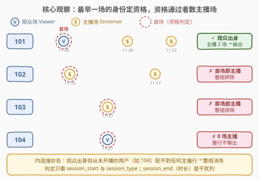
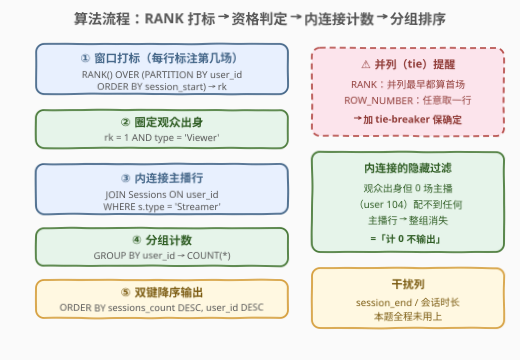
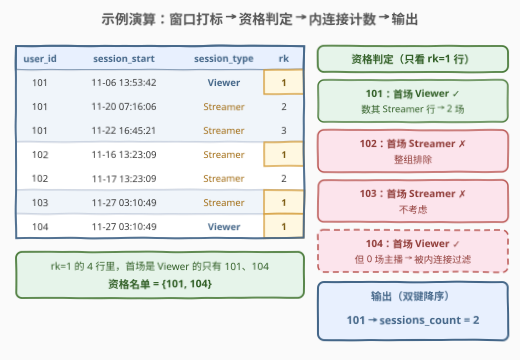

# LeetCode 观众变主播 题解

## 1. 题目概述

- **标题 / 题号**：观众变主播（#2995，hard）
- **链接**：https://leetcode.cn/problems/viewers-turned-streamers/
- **难度**：困难
- **标签**：SQL、窗口函数、RANK、自连接、分组聚合

> ⚠️ 本题为 LeetCode 付费题，题意描述根据官方示例用例与 hints 重建，可能与官方题面有出入。（题面已与社区镜像 doocs/leetcode 的官方中文翻译交叉核对，出入风险较低。）

**题意**：直播平台记录每个用户的全部会话：每个会话要么是**观众场**（`Viewer`，看直播），要么是**主播场**（`Streamer`，开直播）。编写解决方案，找出**首次会话（按 `session_start` 最早）是观众身份**的用户，统计他们各自的**主播会话数量**，按「会话数降序、`user_id` 降序」返回结果表。

**表结构**：

```text
Table: Sessions
+---------------+----------+
| Column Name   | Type     |
+---------------+----------+
| user_id       | int      |
| session_start | datetime |
| session_end   | datetime |
| session_id    | int      |  ← 唯一列
| session_type  | enum     |  ← ('Viewer', 'Streamer')
+---------------+----------+
```

**示例 1**：

```text
输入：
Sessions 表:
+---------+---------------------+---------------------+------------+--------------+
| user_id | session_start       | session_end         | session_id | session_type |
+---------+---------------------+---------------------+------------+--------------+
| 101     | 2023-11-06 13:53:42 | 2023-11-06 14:05:42 | 375        | Viewer       |
| 101     | 2023-11-22 16:45:21 | 2023-11-22 20:39:21 | 594        | Streamer     |
| 102     | 2023-11-16 13:23:09 | 2023-11-16 16:10:09 | 777        | Streamer     |
| 102     | 2023-11-17 13:23:09 | 2023-11-17 16:10:09 | 778        | Streamer     |
| 101     | 2023-11-20 07:16:06 | 2023-11-20 08:33:06 | 315        | Streamer     |
| 104     | 2023-11-27 03:10:49 | 2023-11-27 03:30:49 | 797        | Viewer       |
| 103     | 2023-11-27 03:10:49 | 2023-11-27 03:30:49 | 798        | Streamer     |
+---------+---------------------+---------------------+------------+--------------+

输出：
+---------+----------------+
| user_id | sessions_count |
+---------+----------------+
| 101     | 2              |
+---------+----------------+

解释：
- user_id 101 在 2023-11-06 13:53:42 以观众身份开始首次会话，随后进行了两次主播会话，计数为 2。
- user_id 102 尽管有两个会话，但初始会话是主播身份，排除此用户。
- user_id 103 只有一次主播会话（首场即主播），不考虑。
- user_id 104 以观众身份开始首次会话，但没有后续主播会话，不包括在最终结果中。
输出表按会话数量和 user_id 降序排序。
```

**约束条件**（依据示例重建）：

- `session_id` 是表中具有唯一值的列；
- `session_type` 是 ENUM 类型，取值 `('Viewer', 'Streamer')`；
- 输出列为 `user_id` 与 `sessions_count`，按 `sessions_count` 降序、`user_id` 降序排列。

> 💡 两个隐蔽细节：① **「首次」按 `session_start` 判定**，与插入顺序、`session_id` 大小无关；② **主播会话数为 0 的「纯观众」不输出**——不是输出 0，而是整行消失（示例 1 的 user 104）。这两个细节分别决定了「窗口函数/极值连接」与「内连接」两处关键写法。

> ⚠️ `session_end` 与会话时长在本题完全用不上——判定只关心 `session_start` 的先后与 `session_type` 的取值，`session_end` 是典型的**干扰列**。

## 2. 解题思路

### 2.1 暴力思路：应用层逐用户处理 / 逐行相关子查询

最直觉的写法：把每个 `user_id` 的会话捞出来排序，看第一行的 `session_type`：

```text
for each distinct user_id u:              # N 个用户
    rows = SELECT ... WHERE user_id = u
           ORDER BY session_start         # 每用户一趟查询 + 排序
    if rows[0].type == 'Viewer':
        count = rows 中 Streamer 行数      # 再数一遍
```

$N$ 个用户就是 $N$ 次往返查询；哪怕合并成一次拉全表到内存分组，也是把「**分组内找最早一行**」这件数据库本来就极擅长的事搬到应用层重做一遍。SQL 内的暴力版则是逐行相关子查询——每行都要 `(SELECT COUNT(*) FROM Sessions s2 WHERE s2.user_id = .. AND s2.session_start < ..)` 判断自己是不是本组首场，$O(n^2)$。

两种暴力的共同病灶：**没有识别出「首会话身份」是标准的分组极值问题**，数据库有原生武器（窗口函数 / `GROUP BY` + `MIN`）一步到位。

### 2.2 核心观察：拆成「首场身份判定」+「条件计数」两个独立子问题



问题可以干净地拆成两半：

1. **判定**：每个用户的**最早一场**是什么身份？——经典的「每组最早一行」问题：`RANK() OVER (PARTITION BY user_id ORDER BY session_start)` 取 `rk = 1`（或 `GROUP BY user_id` 求 `MIN(session_start)` 再回连）。判定结果是一张**每用户一行的身份表**。
2. **计数**：对「观众出身」的用户，数他们 `session_type = 'Streamer'` 的行数——普通条件计数。

两半用一次**等值连接**拼起来：身份表（每用户一行）⋈ 原表（主播行），`GROUP BY user_id` 计数。这里有个妙处：**内连接天然把「观众出身但从未开播」的用户（如 104）过滤掉了**——他们的行在连接时找不到任何主播行配对，整组消失，正好实现「计 0 不输出」的隐含要求。

> 💡 为什么「数全部主播场」=「数首场之后的主播场」？因为首场就是这个用户 `session_start` 最早的一行，任何主播场的开始时间都不会早于它——资格判定已经隐含了时序，无需再写 `s.session_start > 首场时间` 的比较。

### 2.3 算法流程图



**逻辑执行步骤**：

| 步骤 | 操作 | 作用 |
|------|------|------|
| ① | CTE `T`：`RANK() OVER (PARTITION BY user_id ORDER BY session_start)` | 给每行打上「本用户第几场」的序号 `rk` |
| ② | `rk = 1 AND session_type = 'Viewer'` | 圈出「观众出身」的用户名单 |
| ③ | `JOIN Sessions ON user_id` 且 `s.session_type = 'Streamer'` | 名单用户的主播行全部配对（0 场者自然消失） |
| ④ | `GROUP BY user_id` + `COUNT(*)` | 得到每用户的 `sessions_count` |
| ⑤ | `ORDER BY sessions_count DESC, user_id DESC` | 双键降序输出 |

### 2.4 示例演算

以示例 1 全量数据走一遍（按 `user_id`、`session_start` 整理，`rk` 为窗口序号）：



**打标后的明细**：

| user_id | session_start | session_type | rk | 身份判定 |
|---------|---------------|--------------|----|----------|
| 101 | 2023-11-06 13:53:42 | **Viewer** | **1** | 首场观众 ✓ 资格通过 |
| 101 | 2023-11-20 07:16:06 | Streamer | 2 | （待计数） |
| 101 | 2023-11-22 16:45:21 | Streamer | 3 | （待计数） |
| 102 | 2023-11-16 13:23:09 | **Streamer** | **1** | 首场即主播 ✗ 整组排除 |
| 102 | 2023-11-17 13:23:09 | Streamer | 2 | ✗ |
| 103 | 2023-11-27 03:10:49 | **Streamer** | **1** | 首场即主播 ✗ |
| 104 | 2023-11-27 03:10:49 | **Viewer** | **1** | 资格通过，但主播场数 = 0 → 内连接后消失 |

**连接与计数**：资格名单 $\{101, 104\}$ ⋈ 原表主播行（只有 `101` 的两行）→ `104` 无配对行被过滤 → `GROUP BY 101` 计数为 $2$。

**输出**：

```text
+---------+----------------+
| user_id | sessions_count |
+---------+----------------+
| 101     | 2              |
+---------+----------------+
```

## 3. 参考代码

### 解法 A：窗口函数 RANK + 等值连接（MySQL 8，推荐）

```sql
# Write your MySQL query statement below
WITH T AS (
    SELECT
        user_id,
        session_type,
        RANK() OVER (
            PARTITION BY user_id
            ORDER BY session_start
        ) AS rk
    FROM Sessions
)
SELECT t.user_id AS user_id,
       COUNT(*)  AS sessions_count
FROM T AS t
JOIN Sessions AS s ON s.user_id = t.user_id
WHERE t.rk = 1
  AND t.session_type = 'Viewer'
  AND s.session_type = 'Streamer'
GROUP BY t.user_id
ORDER BY sessions_count DESC, user_id DESC;
```

> 💡 **写法要点**：
> - **`PARTITION BY user_id ORDER BY session_start`**：按用户分组、组内按开始时间排序——「每组最早一行」的标准姿势；
> - **连接条件里三重过滤**：`rk = 1`（是首场）+ `t.session_type = 'Viewer'`（首场是观众）+ `s.session_type = 'Streamer'`（配对的是主播行），一次 `WHERE` 同时完成判定与筛选；
> - **内连接排除 0 场用户**：104 找不到主播行配对，整组消失，无需 `HAVING` 显式过滤；
> - **双键降序**：两个排序键都是 `DESC`，别名可直接用于 `ORDER BY`。

### 解法 B：FIRST_VALUE 一趟扫描（MySQL 8，免自连接）

```sql
# Write your MySQL query statement below
SELECT user_id, COUNT(*) AS sessions_count
FROM (
    SELECT user_id, session_type,
           FIRST_VALUE(session_type) OVER (
               PARTITION BY user_id
               ORDER BY session_start
           ) AS first_type
    FROM Sessions
) AS t
WHERE first_type = 'Viewer'
  AND session_type = 'Streamer'
GROUP BY user_id
ORDER BY sessions_count DESC, user_id DESC;
```

> 💡 **写法要点**：
> - `FIRST_VALUE` 把「首场身份」直接**标注在每一行上**，不再需要把首场行单独抽出来再连接；
> - 外层 `WHERE` 一次过滤同时完成「资格判定 + 主播行筛选」，剩下的行恰好是待计数的行，`COUNT(*)` 收尾；
> - 与解法 A 的差别：A 是「抽首场行 ⋈ 全部主播行」的**连接语义**，B 是「每行自带首场身份后直接过滤」的**标注语义**——后者少一次自连接，思路更管道化。

### 解法 C：GROUP BY + MIN 回连（无窗口函数，MySQL 5.7 可用）

```sql
# Write your MySQL query statement below
SELECT s.user_id, COUNT(*) AS sessions_count
FROM Sessions AS s
JOIN (
    SELECT DISTINCT s1.user_id
    FROM Sessions AS s1
    JOIN (
        SELECT user_id, MIN(session_start) AS first_start
        FROM Sessions
        GROUP BY user_id
    ) AS f ON s1.user_id = f.user_id
          AND s1.session_start = f.first_start
    WHERE s1.session_type = 'Viewer'
) AS vf ON s.user_id = vf.user_id
WHERE s.session_type = 'Streamer'
GROUP BY s.user_id
ORDER BY sessions_count DESC, s.user_id DESC;
```

> 💡 **写法要点**：
> - 最内层 `MIN(session_start) GROUP BY user_id` 求每用户首场时刻；回连原表取首场行，`WHERE session_type = 'Viewer'` 得「观众出身」名单；
> - **`DISTINCT` 是防并列的保险**：若某用户最早时刻恰有两行并列（理论边界），回连会产生重复的 user 行，外层计数会被成倍放大，`DISTINCT` 先去重；
> - 三层嵌套是 MySQL 5.7（无 CTE、无窗口函数）时代的标准写法，被追问「不用窗口函数怎么办」时就是它。

### Python（pandas）

```python
import pandas as pd

def viewers_turned_streamers(sessions: pd.DataFrame) -> pd.DataFrame:
    sessions = sessions.sort_values('session_start')
    first = sessions.drop_duplicates('user_id', keep='first')
    viewer_users = first.loc[first['session_type'] == 'Viewer', 'user_id']
    cnt = (
        sessions[
            sessions['user_id'].isin(viewer_users)
            & (sessions['session_type'] == 'Streamer')
        ]
        .groupby('user_id')
        .size()
        .reset_index(name='sessions_count')
    )
    return cnt.sort_values(
        ['sessions_count', 'user_id'], ascending=[False, False]
    ).reset_index(drop=True)
```

> 💡 **pandas 对照**：`sort_values + drop_duplicates(keep='first')` = 窗口函数「每组最早一行」；`isin(viewer_users) & (session_type == 'Streamer')` 布尔掩码 = 内连接 + `WHERE`——同样天然过滤掉 0 场用户（分组根本不会出现）；最后双键降序对应 `ORDER BY ... DESC, ... DESC`。注意**不要**用 `groupby.first()`——它取的是每列第一个非空值，有空值时与「最早一行」语义不符。

## 4. 复杂度分析

| 维度 | 复杂度 | 说明 |
|------|--------|------|
| **时间** | $O(n \log n)$ | 窗口函数需按 `user_id` 分组、组内按 `session_start` 排序；`(user_id, session_start)` 有索引时可降到接近 $O(n)$ |
| **空间** | $O(n)$ | CTE/子查询物化整表的 `rk` / `first_type` 标注列 |
| **输出行数** | $O(U)$ | $U$ = 「观众出身且至少开播一场」的用户数 ≤ 用户总数 |

> ⚠️ 解法 A 的自连接理论最坏 $O(n^2)$（某用户主播行极多时，首场行与它们逐一配对），但配对结果立即被 `GROUP BY` 聚合吸收，LeetCode 数据规模下无感；解法 B 无连接、纯一趟扫描，是复杂度最优的写法。

## 5. 扩展：并列首场、0 场输出与「第 N 场」变体

### 5.1 同一时刻并列的「首场」怎么算？

`RANK()` 与 `ROW_NUMBER()` 的差异在本题的具体表现：

| 写法 | 并列最早时的行为 | 本题语义 |
|------|------------------|----------|
| `RANK()` | 并列两行都 `rk = 1` | 只要有**任意一行**首场是 `Viewer`，用户即获资格（解法 A 语义） |
| `ROW_NUMBER()` | **任意**指定一行为 1 | 判定取决于数据库打破平局的顺序，结果不确定 |
| `MIN` 回连（解法 C） | 并列首场全部命中 | 同 `RANK`，但需 `DISTINCT` 防重复计数 |

题目约束未排除并列、也未定义其语义。**面试正确姿势**：主动指出歧义并与面试官约定平局规则——工程上最稳的是补一个确定性 tie-breaker（`ORDER BY session_start, session_id`）后用 `ROW_NUMBER()`，让「首场」唯一且可复现。

### 5.2 想输出 0 场的用户怎么办？

把内连接换成 `LEFT JOIN` + 条件计数：

```sql
SELECT t.user_id,
       COUNT(s.session_id) AS sessions_count   -- COUNT(列)：无配对时计 0
FROM T AS t                          -- T = rk=1 且 'Viewer' 的首场行
LEFT JOIN Sessions AS s
    ON s.user_id = t.user_id
   AND s.session_type = 'Streamer'
GROUP BY t.user_id;
```

> ⚠️ 关键在 `COUNT(列)` 而非 `COUNT(*)`：`LEFT JOIN` 无配对时那一行**本身存在**（右表列全为 NULL），`COUNT(*)` 会数出 1，只有 `COUNT(col)` 忽略 NULL 才能得到 0——这正是「INNER JOIN + COUNT(*)」与「LEFT JOIN + COUNT(col)」两种语义的分水岭。

### 5.3 变体推广：「第 N 场身份」与「首场后 M 天内开播」

- **第 N 场**：`RANK()` → `ROW_NUMBER()` 取 `rn = N`（确定 tie-breaker 后），2986「找到第三笔交易」就是同款套路；
- **首场后 M 天内开播**：资格表补一列首场时刻，连接条件从等值升级为区间：`s.session_start < f.first_start + INTERVAL M DAY`；
- **首场持续时长门槛**：这时 `session_end` 才派上用场——`TIMESTAMPDIFF(MINUTE, session_start, session_end) >= 10` 之类加进判定条件即可。

## 6. 面试要点

1. **为什么这里用 `RANK()` 而不是 `ROW_NUMBER()`？**

   - 无并列时两者结果一致；并列最早时 `RANK` 让并列行都为 1（任一观众行即获资格），`ROW_NUMBER` 任意取一行、结果不确定。题目未定义并列语义，稳妥做法是显式加 tie-breaker（`ORDER BY session_start, session_id`）后用 `ROW_NUMBER`，让「首场」唯一且可复现（见 5.1）。

2. **user 104 首场是观众，为什么不在输出里？输出 0 行不行吗？**

   - 示例解释明确 104「不包括在最终结果中」——0 场用户整行消失。内连接天然实现该语义（找不到主播配对行）；若改 `LEFT JOIN`，必须 `COUNT(s.session_id)` 计 0、再决定是否 `HAVING sessions_count > 0`——输出 0 还是过滤掉，属于语义选择，要和面试官对齐（见 5.2）。

3. **不用窗口函数（MySQL 5.7）怎么写？**

   - `GROUP BY user_id` 求 `MIN(session_start)` 得每用户首场时刻，回连原表取首场行、判 `Viewer` 得名单，再与主播行连接计数（解法 C）。核心是「**分组极值 → 回连取整行**」的替换模式——所有窗口函数题在 5.7 上都有这条退路。

4. **`COUNT(*)`、`COUNT(1)`、`COUNT(col)` 有区别吗？**

   - `COUNT(*)` 与 `COUNT(1)` 等价，统计行数；`COUNT(col)` 只统计 `col` 非 NULL 的行数。本题解法 A/B 的行已被 `WHERE` 过滤成主播行，三者等价；但在 `LEFT JOIN` 语义下必须用 `COUNT(col)` 才能区分「0 场」与「1 场全 NULL 行」（见 5.2）。

5. **这个查询怎么用索引优化？**

   - 窗口函数的 `PARTITION BY user_id ORDER BY session_start` 与连接键 `user_id` 都指向复合索引 `(user_id, session_start)`；再把 `session_type` 纳入做成覆盖索引 `(user_id, session_start, session_type)`，分组内排序直接按索引顺序扫描、免回表，整体从 $O(n \log n)$ 降到接近 $O(n)$。

> 💡 **一句话总结**：2995 的骨架是「**每组最早一行的身份决定资格**」+「**条件计数 + 双键降序**」——窗口函数 `RANK` 一列打通判定，内连接顺手实现「计 0 不输出」的隐含语义。它与 511/1077/1107 的「首次事件」家族一脉相承，是 Hard 标签里少见的「套路纯度」高于「代码长度」的题。

## 同类练习题

| # | 题目 | 与本题的关联 |
|---|------|-------------|
| 511 | [游戏玩法分析 I](https://leetcode.cn/problems/game-play-analysis-i/) | `MIN + GROUP BY` 找每玩家首次登录日期——本题「首场判定」的最简形态 |
| 1077 | [项目员工 III](https://leetcode.cn/problems/project-employees-iii/) | `RANK` 取每项目经验最多的员工——同一「组内第 1」窗口套路在「最值行」上的应用 |
| 1107 | [每日新用户统计](https://leetcode.cn/problems/new-users-daily-count/) | 先按用户求首次活跃日期、再按日期计数——与本题「首次身份判定 + 计数」完全同构 |
| 2986 | [找到第三笔交易](https://leetcode.cn/problems/find-third-transaction/) | 同区间姊妹题，`ROW_NUMBER` 取组内第 3 条——本题「首场」推广到「第 N 场」 |
| 586 | [订单最多的客户](https://leetcode.cn/problems/customer-placing-the-largest-number-of-orders/) | 条件计数 + 排序取最值——单独练习本题最后一步的聚合与双键排序 |
