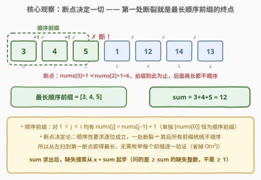
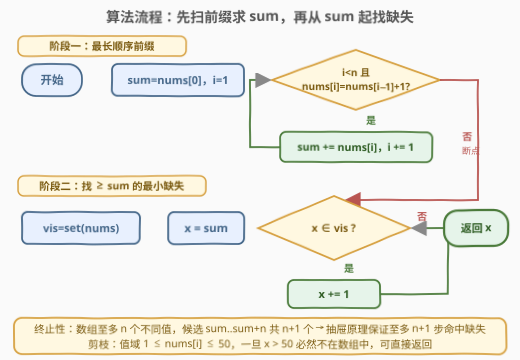
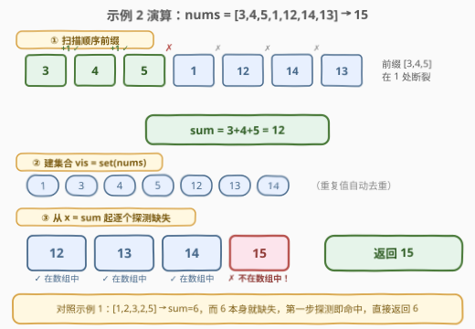

# 大于等于顺序前缀和的最小缺失整数

- **题目名称**：大于等于顺序前缀和的最小缺失整数
- **链接**：[2996. 大于等于顺序前缀和的最小缺失整数](https://leetcode.cn/problems/smallest-missing-integer-greater-than-sequential-prefix-sum/)
- **难度**：简单
- **标签**：数组、哈希表、一次遍历

## 1. 题目概述

给你一个下标从 **0** 开始的整数数组 `nums`。

如果一个前缀 `nums[0..i]` 满足对于 `1 <= j <= i` 的所有元素都有 `nums[j] = nums[j - 1] + 1`，那么我们称这个前缀是一个**顺序前缀**。特殊情况是，只包含 `nums[0]` 的前缀也是一个**顺序前缀**。

请你返回 `nums` 中**没有出现过的最小整数** `x`，满足 `x` **大于等于最长顺序前缀的和**。

**示例 1**：

```text
输入：nums = [1,2,3,2,5]
输出：6
解释：nums 的最长顺序前缀是 [1,2,3]，和为 6，6 不在数组中，
所以 6 是大于等于最长顺序前缀和的最小整数。
```

**示例 2**：

```text
输入：nums = [3,4,5,1,12,14,13]
输出：15
解释：nums 的最长顺序前缀是 [3,4,5]，和为 12，12、13 和 14 都在数组中，
但 15 不在，所以 15 是大于等于最长顺序前缀和的最小整数。
```

**约束条件**：

- $1 \le nums.length \le 50$
- $1 \le nums[i] \le 50$

> 💡 读题先拆解：本题是两个独立子问题的串联——① 从下标 0 出发找**最长顺序前缀**并求和 `sum`；② 从 `sum` 起向上找第一个**不在数组中**的整数。两步都各自有成熟的线性套路，唯一的「坑」是别把②的起点写成 1（题目问的是 $\ge sum$ 的缺失整数，不是全局最小正整数）。

---

## 2. 解题思路

### 2.1 暴力思路：枚举前缀 + 逐个查存在

最直白的做法完全照着定义来：

1. 对每个 $i$ 从 $0$ 到 $n-1$，检查前缀 $nums[0..i]$ 是否顺序——每次都从头重新验证所有相邻对 $nums[j]$ 与 $nums[j-1]+1$，单次 $O(i)$，整体 $O(n^2)$；
2. 对候选 $x = sum,\ sum+1,\ \dots$，每个候选都**线性扫描整个数组**判断存在性，单次 $O(n)$，最多扫 $n+1$ 个候选（终止性见 2.2），整体也是 $O(n^2)$。

$n \le 50$ 时 $O(n^2)$ 稳过，周赛先写暴力保底完全合理。但两处平方都在重复劳动：① 每次检查前缀把已经验证过的相邻对又验了一遍；② 每次查存在性把数组又扫了一遍。去掉重复，就是最优解。

### 2.2 核心观察：断点决定论 + 哈希集合



两个观察分别把两处 $O(n^2)$ 压成 $O(n)$：

1. **断点决定论**：顺序前缀要求 $nums[j] = nums[j-1] + 1$ 对 $1 \le j \le i$ **全部成立**——逐位与的条件意味着一处断裂、全盘否定。设第一断点出现在下标 $k$（即 $nums[k] \ne nums[k-1]+1$），则所有 $i \ge k$ 的前缀都不顺序，而 $i < k$ 的每个前缀都顺序（更短只会更安全）。**最长顺序前缀就是从 0 到第一断点之前的那一段**——一次线性扫描，遇断即停，无需枚举验证。单独 $[nums[0]]$ 恒为顺序前缀，所以扫描至少能拿到一个元素的合法起点。
2. **哈希集合查缺失**：把 `nums` 全部塞进哈希集合 `vis`，候选 $x$ 从 $sum$ 起自增，第一个 $x \notin vis$ 的即为答案——每次存在性判断从 $O(n)$ 降到 $O(1)$。

还有一个必须回答的问题：**② 的循环一定会终止吗？** 会，且至多走 $n+1$ 步——**抽屉原理**：数组中至多有 $n$ 个**不同**的值，而候选 $sum,\ sum+1,\ \dots,\ sum+n$ 共 $n+1$ 个数，不可能全部落在数组里，其中必有缺失，循环最迟在 $x = sum+n$ 处停下。本题 $n \le 50$，上界极小。

> 💡 一句话：①「最长顺序前缀」由第一断点唯一决定，线性扫描即得；② 缺失判定交给哈希集合，抽屉原理保证 $n+1$ 步内出答案。两段拼接，全程 $O(n)$。

顺手还能加一个**值域剪枝**：$1 \le nums[i] \le 50$，所以一旦 $x > 50$ 就必然不在数组中，可直接返回。这解释了一个有趣的现象：若 `nums` 恰为 $[1,2,\dots,50]$，则 $sum = 1275 \gg 50$，第一步探测就直接命中。

### 2.3 算法流程图



**完整步骤**：

1. **初始化**：$sum = nums[0]$，$i = 1$；
2. **扫前缀**：只要 $i < n$ 且 $nums[i] = nums[i-1] + 1$，就 $sum \mathrel{+}= nums[i]$、$i \mathrel{+}= 1$；条件破裂（越界或断点）即停；
3. **建集合**：$vis = \text{set}(nums)$；
4. **探缺失**：$x = sum$，只要 $x \in vis$ 就 $x \mathrel{+}= 1$；
5. **收尾**：返回 $x$。

> ⚠️ 第 2 步的循环条件把「越界」和「断点」合并在一个布尔式里短路求值，写代码时注意 `i < n` 必须放在 `nums[i] == nums[i-1] + 1` **前面**，否则会先访问越界下标。

### 2.4 示例演算



以示例 2（`nums = [3,4,5,1,12,14,13]`）为例：

**阶段一**：$3 \to 4$（$=3+1$ ✓）$\to 5$（$=4+1$ ✓）$\to 1$（$\ne 5+1$ ✗ 断）。最长顺序前缀 $[3,4,5]$，$sum = 12$。

**阶段二**：$vis = \{1,3,4,5,12,13,14\}$，探测过程：

| 候选 $x$ | 是否 $\in vis$ | 动作 |
|----------|----------------|------|
| 12 | ✓ | $x \mathrel{+}= 1$ |
| 13 | ✓ | $x \mathrel{+}= 1$ |
| 14 | ✓ | $x \mathrel{+}= 1$ |
| 15 | ✗ | 返回 15 |

对照示例 1（`nums = [1,2,3,2,5]`）：$sum = 6$，而 6 本身就不在数组中，第一步探测即命中，直接返回 6——**答案可能就是 $sum$ 本身**，「严格大于」与「大于等于」一字之差，起步候选别写成 $sum+1$。

---

## 3. 参考代码

### C++

```cpp
class Solution {
  public:
    int missingInteger(vector<int>& nums) {
        int n = nums.size();
        int sum = nums[0];
        for (int i = 1; i < n && nums[i] == nums[i - 1] + 1; i++) {
            sum += nums[i];
        }
        unordered_set<int> vis(nums.begin(), nums.end());
        int x = sum;
        while (vis.count(x)) {
            x++;
        }
        return x;
    }
};
```

### Python

```python
class Solution:
    def missingInteger(self, nums: List[int]) -> int:
        s = nums[0]
        for i in range(1, len(nums)):
            if nums[i] != nums[i - 1] + 1:
                break
            s += nums[i]
        vis = set(nums)
        while s in vis:
            s += 1
        return s
```

> 💡 语言细节：C++ 的 `for` 循环把「越界」与「断点」合并在条件里短路；Python 版若想更紧凑，阶段一可换成 `itertools.pairwise`：`k = 1 + next((i for i, (a, b) in enumerate(pairwise(nums)) if b != a + 1), len(nums) - 1)` 取断点位置，再 `s = sum(nums[:k])`——可读性见仁见智，朴素循环更直白。

---

## 4. 复杂度分析

| 维度 | 复杂度 | 说明 |
|------|--------|------|
| 时间复杂度 | $O(n)$ | 阶段一扫描 $O(n)$；建集合 $O(n)$；缺失探测至多 $n+1$ 步（抽屉原理），总计线性 |
| 空间复杂度 | $O(n)$ | 哈希集合存至多 $n$ 个元素；若用值域布尔数组则为 $O(C)$，$C = 50$ |

对照：暴力枚举前缀 + 逐候选线性查存在为 $O(n^2)$；本题数据规模下两者皆过，但 $O(n)$ 版本的两次「去重」思想（前缀检查去重复验证、存在性查询去重复扫描）是通用功。

---

## 5. 扩展：从哈希集合到原地哈希

本题给的值域 $1 \le nums[i] \le 50$ 小得奢侈，围着它可以做两层升级：

1. **值域布尔数组（桶标记）**：用 `bool vis[51]` 代替哈希集合——`vis[nums[i]] = true` 一趟标记，查询 $O(1)$ 且无哈希常数，空间 $O(C)$。这正是 448. 找到所有数组中消失的数字 的「下标当哈希键」思想的值域版。
2. **提前剪枝**：探测循环里加一句 `if (x > 50) break;`——一旦越过值域上界必然缺失。极端例子 $nums = [1,2,\dots,50]$ 时 $sum = 1275$，直接一步出答案。

更进一步的对照是 **41. 缺失的第一个正数**：同样是「从某起点向上找第一个缺失整数」，但 41 的起点固定为 1、要求 $O(n)$ 时间 $O(1)$ 空间、且不许用集合——只能用**原地哈希**（把值 $v$ 归位到下标 $v-1$，再扫一遍找第一个错位）。本题起点是动态的 $sum$、允许辅助空间，属于这族题目里被「投喂」了充足条件的入门款。

---

## 6. 面试要点

1. **为什么一次线性扫描就能找到「最长」顺序前缀？**

   - 顺序性是「逐位与」的条件：$nums[j] = nums[j-1]+1$ 须对 $1 \le j \le i$ 全部成立
   - 一处断裂 ⇒ 之后所有更长前缀必然不顺序；反过来第一断点之前每个前缀都顺序
   - 所以最长顺序前缀 = 从 0 到第一断点之前的段，遇断即停，无需回头

2. **阶段二的探测循环为什么一定终止？最多走几步？**

   - 数组至多 $n$ 个不同值，候选 $sum..sum+n$ 共 $n+1$ 个，抽屉原理必有缺失
   - 至多 $n+1$ 步；本题值域 $\le 50$ 还可加 $x > 50$ 提前返回的剪枝

3. **答案的起步候选是 $sum$ 还是 $sum+1$？**

   - 是 $sum$：题目要求「大于等于」前缀和，$sum$ 本身若缺失（示例 1 的 6）就是答案
   - 写成 $sum+1$ 起步会在 $sum$ 缺失时输出偏大的错误结果

4. **C++ 循环条件里 `i < n` 和 `nums[i] == nums[i-1]+1` 的顺序重要吗？**

   - 重要：`&&` 短路求值保证先判越界再取元素，写反了是未定义行为
   - Python 中对应写法是显式 `if ... break` 或把边界检查放在条件首位

5. **和 41. 缺失的第一个正数 的本质区别在哪？**

   - 起点：本题从动态的 $sum$ 起步，41 从固定值 1 起步
   - 约束：本题允许 $O(n)$ 辅助空间用哈希集合，41 逼你原地哈希把值 $v$ 归位下标 $v-1$
   - 相同骨架「自增探测第一个缺失」，不同约束决定不同实现档次

> 💡 **一句话总结**：断点决定最长顺序前缀（线性扫描），哈希集合决定探测效率（$O(1)$ 查询），抽屉原理保证探测最多 $n+1$ 步——两段式 $O(n)$ 拼装题。

---

## 7. 同类练习题

- [41. 缺失的第一个正数](https://leetcode.cn/problems/first-missing-positive/)（[题解](../0001-0100/41_缺失的第一个正数.md)）：同款「自增找第一个缺失整数」的困难版——起点固定为 1 且要求原地哈希 $O(1)$ 空间
- [1539. 第 k 个缺失的正整数](https://leetcode.cn/problems/kth-missing-positive-number/)（[题解](../1501-1600/1539_第k个缺失的正整数.md)）：有序数组中数缺失整数，可线性数也可二分加速——缺失计数的进阶形态
- [448. 找到所有数组中消失的数字](https://leetcode.cn/problems/find-all-numbers-disappeared-in-an-array/)（[题解](../0401-0500/448_找到所有数组中消失的数字.md)）：值域下标当哈希键找全部缺失数——本文扩展节桶标记思想的出处
- [128. 最长连续序列](https://leetcode.cn/problems/longest-consecutive-sequence/)（[题解](../0101-0200/128_最长连续序列.md)）：同样围绕「连续递增 1」，但 128 在无序集合中找最长连续段，本题只看前缀位置的连续性，对照理解「位置连续」与「值连续」
