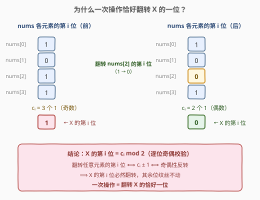
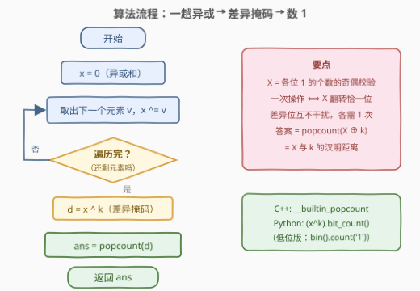
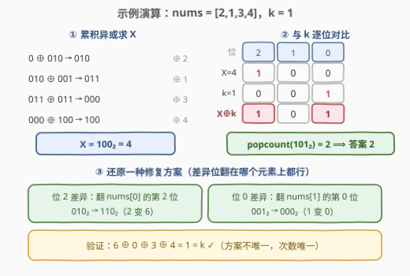

# 使数组异或和等于K的最少操作次数

- **题目名称**：使数组异或和等于 K 的最少操作次数
- **链接**：[2997. 使数组异或和等于 K 的最少操作次数](https://leetcode.cn/problems/minimum-number-of-operations-to-make-array-xor-equal-to-k/)
- **难度**：中等
- **标签**：位运算、数组

## 1. 题目概述

给你一个下标从 **0** 开始的整数数组 `nums` 和一个正整数 $k$。

你可以对数组执行以下操作**任意次**：

- 选择数组里的**任意**一个元素，并将它的**二进制**表示**翻转**一个数位，翻转数位表示将 `0` 变成 `1` 或者将 `1` 变成 `0`。

你的目标是让数组里**所有**元素的按位异或和得到 $k$，请你返回达成这一目标的**最少**操作次数。

**注意**，你也可以将一个数的前导 0 翻转。比方说，数字 $(101)_2$ 翻转第四个数位，得到 $(1101)_2$。

**示例 1**：

```text
输入：nums = [2,1,3,4], k = 1
输出：2
解释：我们可以执行以下操作：
- 选择下标为 2 的元素，也就是 3 == (011)2，我们翻转第一个数位得到 (010)2 == 2。数组变为 [2,1,2,4]。
- 选择下标为 0 的元素，也就是 2 == (010)2，我们翻转第三个数位得到 (110)2 == 6。数组变为 [6,1,2,4]。
最终数组的所有元素异或和为 (6 XOR 1 XOR 2 XOR 4) == 1 == k。
无法用少于 2 次操作得到异或和等于 k。
```

**示例 2**：

```text
输入：nums = [2,0,2,0], k = 0
输出：0
解释：数组所有元素的异或和为 (2 XOR 0 XOR 2 XOR 0) == 0 == k。所以不需要进行任何操作。
```

**约束条件**：

- $1 \le \text{nums.length} \le 10^5$
- $0 \le \text{nums}[i] \le 10^6$
- $0 \le k \le 10^6$

> 💡 本题核心是「**异或和的奇偶校验视角**」：全员异或和 $X$ 的第 $i$ 位，本质是所有元素第 $i$ 位上 1 的个数的**奇偶校验位**。翻转任意一个元素的第 $i$ 位，恰好让这个奇偶性反转一次——于是一次操作 ⟺ 翻转 $X$ 的恰好一位，答案瞬间坍缩成 $X$ 与 $k$ 的**汉明距离** $\operatorname{popcount}(X \oplus k)$。

---

## 2. 解题思路

### 2.1 暴力思路：把数组状态当节点做搜索（不可行）

最朴素的想法是把「整个数组」当作状态：初始状态是 `nums`，每次操作从状态 $S$ 转移到「翻转了某个元素某一位」的 $S'$，目标状态是「全员异或和等于 $k$」的所有数组。用 BFS 求最短操作数。

但状态空间是天文数字：每个元素有约 20 个可翻的位（$10^6 < 2^{20}$），$n$ 个元素的状态数高达 $\left(2^{20}\right)^n = 2^{20n}$，$n = 10^5$ 时连一个状态都存不下。

退一步想：**我们真的关心数组里每个元素长什么样吗？** 目标条件只看 $X = \text{nums}[0] \oplus \text{nums}[1] \oplus \cdots \oplus \text{nums}[n-1]$ 这**一个数**——所有 $X$ 相同的数组完全等价。于是问题降维成：

> 从整数 $X$ 出发，每次「操作」对 $X$ 做某种变换，最少几步变成 $k$？

剩下的唯一悬念：一次操作到底对 $X$ 做了什么？这正是 2.2 要回答的——答案是干净利落的「翻转恰一位」。

### 2.2 核心观察：一次操作 = 翻转 X 的恰好一位



**观察 1（异或和 = 逐位奇偶校验）**：异或是**逐位独立**运算。设 $c_i$ 为 `nums` 中第 $i$ 位上是 1 的元素个数，则 $X$ 的第 $i$ 位就是 $c_i \bmod 2$——第 $i$ 位上 1 出现奇数次则为 1，偶数次则为 0。

$$X \text{ 的第 } i \text{ 位} = c_i \bmod 2$$

**观察 2（翻转一个元素的某位 ⟺ $X$ 的对应位翻转）**：翻转 $\text{nums}[j]$ 的第 $i$ 位后，$c_i$ 恰好变化 $\pm 1$（原来该元素此位是 1 则减一、是 0 则加一），**奇偶性必然反转**；其他位的 $c$ 纹丝不动。于是：

$$\text{一次操作} \iff X \text{ 的第 } i \text{ 位从 } b \text{ 变成 } 1 - b\text{，其余位不变}$$

**观察 3（不同位互不干扰 → 答案是汉明距离）**：把问题彻底改写成——「把整数 $X$ 变成 $k$，每次翻转 $X$ 的恰好一位，最少几步？」设 $d = X \oplus k$，其每个为 1 的位都是 $X$ 与 $k$ 的差异位：

- **下界**：每个差异位需要被翻转**奇数次**（至少 1 次），而每次操作只翻转一位、不同位之间互不影响，故操作数 $\ge \operatorname{popcount}(d)$。
- **上界（构造）**：对 $d$ 的每个为 1 的位 $i$，**任选一个固定元素**（比如 $\text{nums}[0]$）翻转它的第 $i$ 位，$X$ 的第 $i$ 位即翻转一次。$\operatorname{popcount}(d)$ 次操作后每位差异都被消除。

$$\text{答案} = \operatorname{popcount}(X \oplus k)$$

> ⚠️ 「允许翻转前导 0」这一条件正是上界构造的可行性保障：差异位 $i$ 可能落在 $\text{nums}[0]$ 的最高有效位**之上**（此位为前导 0），若不允许翻前导 0，构造还得挑元素、讨论是否存在某元素该位为 1；允许之后「随便挑一个元素翻」永远合法。另外 $X, k \le 10^6 < 2^{20}$，第 20 位以上两者同为 0，不产生差异，无需考虑。

### 2.3 算法流程图



**完整步骤**：

1. **求异或和**：初始化 `x = 0`，遍历数组做 `x ^= v`，得到全员异或和 $X$。
2. **求差异掩码**：`d = x ^ k`，$d$ 的每个 1 位就是一个必须被翻转一次的差异位。
3. **数 1**：答案即 `d` 的置位数（popcount）。

> 💡 流程的不变式：「$X$ 与 $k$ 还剩多少个差异位」在每次操作后恰好减一（最优策略下）。整个算法其实什么都没"搜索"——它只是把这个不变式的**初值**数了出来。

### 2.4 示例演算

以示例 1 `nums = [2,1,3,4]`，`k = 1` 为例：



**第一步：累积异或求 $X$**

| 累积值 | 二进制 | ⊕ 元素 | 二进制 | 结果 |
|--------|--------|--------|--------|------|
| 0 | $000_2$ | ⊕ 2 | $010_2$ | $010_2$ |
| 2 | $010_2$ | ⊕ 1 | $001_2$ | $011_2$ |
| 3 | $011_2$ | ⊕ 3 | $011_2$ | $000_2$ |
| 0 | $000_2$ | ⊕ 4 | $100_2$ | $100_2$ |

得 $X = 100_2 = 4$。

**第二步：与 $k$ 逐位对比**

| 位 | 2 | 1 | 0 |
|----|---|---|---|
| $X = 4$ | **1** | 0 | 0 |
| $k = 1$ | 0 | 0 | **1** |
| $d = X \oplus k$ | **1** | 0 | **1** |

$d = 101_2$，两个 1 → **答案 2** ✓。

**第三步（还原一种具体方案）**：位 2 差异 → 翻转 $\text{nums}[0] = 010_2$ 的第 2 位得 $110_2 = 6$；位 0 差异 → 翻转 $\text{nums}[1] = 001_2$ 的第 0 位得 $000_2 = 0$。验证：$6 \oplus 0 \oplus 3 \oplus 4 = 1 = k$ ✓。（与官方示例的操作方案不同——差异位翻在**哪个元素**上任意，方案不唯一，但次数唯一。）

**示例 2**：$X = 2 \oplus 0 \oplus 2 \oplus 0 = 0 = k$，$d = 0$，答案 0 ✓。

---

## 3. 参考代码

### C++

```cpp
class Solution {
public:
    int minOperations(vector<int>& nums, int k) {
        int x = 0;
        for (int v : nums) x ^= v;                 // 全员异或和 X
        return __builtin_popcount(x ^ k);          // 与 k 的汉明距离
    }
};
```

### Python

```python
class Solution:
    def minOperations(self, nums: List[int], k: int) -> int:
        x = 0
        for v in nums:
            x ^= v                          # 全员异或和 X
        return (x ^ k).bit_count()          # Python 3.10+；低版本用 bin(x ^ k).count('1')
```

> 💡 `functools.reduce(operator.xor, nums, 0)` 也能一行求 $X$，但显式循环更直观。若追求极简：C++ 可用 `std::accumulate(nums.begin(), nums.end(), 0, std::bit_xor{})`，C++20 起还能直接写 `std::popcount(unsigned(x ^ k))`。

---

## 4. 复杂度分析

| 维度 | 复杂度 | 说明 |
|------|--------|------|
| **时间复杂度** | $O(n)$ | 一趟遍历求 $X$；popcount 只对固定的 ≤ 20 位整数操作，$O(1)$ |
| **空间复杂度** | $O(1)$ | 只用常数个整型变量 |

> ⚠️ $O(n)$ 已是下界：$X$ 依赖每一个元素的每一位，任何正确算法都必须完整读入数组（哪怕只读部分元素，漏掉的元素若与假设值不同，答案就可能出错）。好在「读入」之后的部分——求差异、数 1——都是常数开销，本题没有更优的渐进空间。

---

## 5. 扩展：变体与对偶

**变体 1（一次操作可翻转任意多个位）**：若把操作改成「选择一个元素，翻转它二进制表示的**任意多个**数位」，则一次操作可以把 $X$ 的任意位集合整体翻转，答案退化为 $[X \ne k]$（不同则 1 次搞定，相同则 0 次）。可见「每次恰好翻一位」的限制正是答案从 0/1 膨胀到 $\operatorname{popcount}(X \oplus k)$ 的原因。

**变体 2（操作影响两位的对偶）**：若操作改成「翻转**相邻两个元素**的同一位」，则 $c_i$ 变化 $0$ 或 $\pm 2$，**奇偶性不变**——$X$ 成了操作下的不变量！于是 $X = k$ 时答案 0，$X \ne k$ 时**无解**。「翻一个元素一位」与「翻两个元素同一位」恰好控制了奇偶性的「翻转」与「保持」两面。[2683. 相邻值的按位异或](https://leetcode.cn/problems/neighboring-bitwise-xor/) 正是这一不变量思想的完整展开。

**变体 3（最小化总代价）**：若翻转**第 $i$ 位**的代价是 $w_i$（与翻哪个元素无关），则答案是 $\sum_{i:\, d_i = 1} w_i$——逐位独立让「计数」升级为「按位求和」，套路不变。

> 💡 三条变体共用同一块地基：**异或和逐位独立 + 奇偶校验**。位与位之间不串扰，是这一家族所有问题都能「拆位分析」的根本原因。

---

## 6. 面试要点

1. **为什么一次操作恰好改变 $X$ 的一位？**

   - $X$ 的第 $i$ 位 $= c_i \bmod 2$（$c_i$ 为该位上 1 的元素个数）。翻转某个元素的第 $i$ 位使 $c_i \pm 1$，奇偶性必反转，故 $X$ 的第 $i$ 位翻转；其他位 $c$ 不变。一次操作对 $X$ 的全部效果 = 恰好翻转一位。

2. **$\operatorname{popcount}(X \oplus k)$ 的下界和上界分别怎么证？**

   - 下界：每个差异位（$d = X \oplus k$ 的每个 1 位）需被翻转奇数次，至少 1 次；不同位互不影响，总操作数 $\ge$ 差异位个数。上界：对每个差异位，固定翻同一个元素的该位即可，恰好 1 次/位。两者夹逼出唯一答案。

3. **「允许翻转前导 0」这个条件有什么用？**

   - 保证构造恒可行：差异位可以高于所选元素的最高有效位（落在前导 0 上），允许翻前导 0 意味着「随便挑一个元素翻它的第 $i$ 位」永远合法，无需讨论元素选择。另外 $X, k < 2^{20}$，第 20 位以上无差异，高位根本不用管。

4. **为什么数组本身不重要，只有 $X$ 重要？**

   - 目标条件与操作效果都只通过 $X$ 与外界交互：目标是 $X = k$，一次操作翻转 $X$ 的一位且与具体元素无关（哪个元素、该位原来是 0 还是 1 都不影响效果）。这是典型的「不变量/投影降维」：把 $2^{20n}$ 个数组状态压缩成一个 20 位整数后再思考。

5. **popcount 在各语言怎么写？**

   - C++：`__builtin_popcount(x)`（GCC/Clang 内建）或 C++20 `std::popcount`；Java：`Integer.bitCount(x)`；Python 3.10+：`x.bit_count()`，低版本 `bin(x).count('1')`。底层多为单条指令（如 x86 的 `POPCNT`），配合 [191. 位 1 的个数](https://leetcode.cn/problems/number-of-1-bits/) 的 `n & (n-1)` 逐个消 1 的写法对比记忆。

> 💡 **一句话总结**：2997 是「异或和 = 逐位奇偶校验」的招牌题——翻转任意元素的第 $i$ 位恰好翻转全员异或和 $X$ 的第 $i$ 位，于是「最少操作数」就是 $X$ 与 $k$ 的汉明距离，一趟异或 + 一次 popcount 收工。

---

## 7. 同类练习题

- [191. 位 1 的个数](https://leetcode.cn/problems/number-of-1-bits/)：popcount 基本功，`n & (n-1)` 消最低位 1 与内建函数两版写法
- [1310. 子数组异或查询](https://leetcode.cn/problems/xor-queries-of-a-subarray/)：前缀异或 $S[l..r] = S_r \oplus S_{l-1}$，异或「自消」性质的直接应用
- [2425. 所有数对的异或和](https://leetcode.cn/problems/bitwise-xor-of-all-pairings/)：成对出现的异或相互抵消，$n$ 为偶数时整段归零——奇偶性的另一种形态
- [2527. 查询数组异或美丽值](https://leetcode.cn/problems/find-xor-beauty-of-array/)：按位独立性的极致应用，三元组美貌值逐位拆开后整体只剩一层异或
- [2683. 相邻值的按位异或](https://leetcode.cn/problems/neighboring-bitwise-xor/)：本题变体 2 的完整版——翻转一个元素如何同时影响两个相邻异或值的奇偶性
