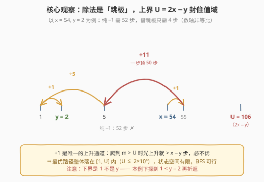
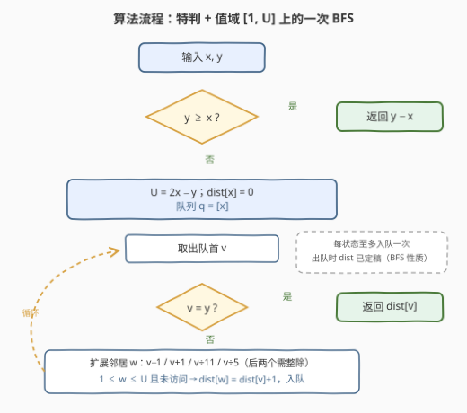
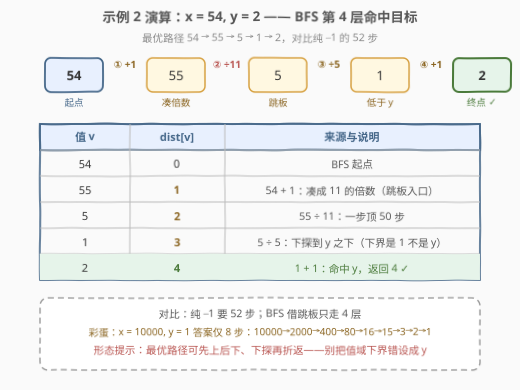

# 使 X 和 Y 相等的最少操作次数

- **题目名称**：使 X 和 Y 相等的最少操作次数
- **链接**：[2998. 使 X 和 Y 相等的最少操作次数](https://leetcode.cn/problems/minimum-number-of-operations-to-make-x-and-y-equal/)
- **难度**：中等
- **标签**：广度优先搜索、记忆化搜索、动态规划

## 1. 题目概述

给定两个正整数 $x$ 和 $y$。一次操作中，你可以执行以下四种操作**之一**：

1. 如果 $x$ 是 $11$ 的倍数，将 $x$ 除以 $11$；
2. 如果 $x$ 是 $5$ 的倍数，将 $x$ 除以 $5$；
3. 将 $x$ 减 $1$；
4. 将 $x$ 加 $1$。

返回让 $x$ 和 $y$ 相等的**最少**操作次数。

**示例 1**：

```text
输入：x = 26, y = 1
输出：3
解释：26 → 25（−1）→ 5（÷5）→ 1（÷5）。
```

**示例 2**：

```text
输入：x = 54, y = 2
输出：4
解释：54 → 55（+1）→ 5（÷11）→ 1（÷5）→ 2（+1）。
```

**示例 3**：

```text
输入：x = 25, y = 30
输出：5
解释：连续 5 次 +1。
```

**约束条件**：

- $1 \le x, y \le 10^4$

> 💡 关键信号：四种操作的代价同为一次，「最少操作次数」就是**无权图最短路**——把每个整数看成一个节点，四种操作是四条出边，BFS 首次到达即最短。唯一的障碍是「+1 可以无限执行」，状态空间看似无界。本题的全部技巧就在于论证：**最优解只需要一个很小的有界值域**。

---

## 2. 解题思路

### 2.1 暴力思路：纯加减与无界 BFS

- **只做加减**：逐格 $\pm 1$ 逼近，$|x - y|$ 步。反例：$x = 54, y = 2$ 需 52 步，而 $54 \to 55 \to 5 \to 1 \to 2$ 只要 4 步——**除法是必须利用的跳板**。
- **直接 BFS**：从 $x$ 出发，$+1$ 边可以无限延伸，队列永不收敛。必须先回答：**值域到底多大才够？**

> ⚠️ 暴力的死结不在搜索方式，而在「状态空间无界」。无界图上 BFS 无法终止；一旦给出安全上界，朴素 BFS 就是正解。

### 2.2 核心观察：BFS + 值域上界 $U = 2x - y$



**观察一（$y \ge x$ 时免费）**：$+1$ 是**唯一的上升通道**，除法只会让值变小。若 $y \ge x$，任何「翻过 $y$ 再除」的路径都不划算——升到 $m > y$ 后 $\div 5$ 落回 $y$ 附近，总代价为

$$
(m - x) + 1 + \left(y - \frac{m}{5}\right) = (y - x) + 1 + \frac{4m}{5} > y - x,
$$

（$\div 11$ 同理且更亏）。所以 $y \ge x$ 时答案直接就是 $y - x$——示例 3 的 5 步正是如此。

**观察二（除法是跳板）**：$+1$ 凑成 $5$ / $11$ 的倍数再除，一步跨越大段距离：$55 \div 11 = 5$，一步顶 50 次 $-1$。最优解常常**先升后除**，甚至除完落到 $y$ 之下再爬回来。

**观察三（上界封顶）**：$y < x$ 时，纯 $-1$ 的 baseline 是 $x - y$ 步。若路径爬到某个 $m > 2x - y$，由于 $+1$ 是唯一上升手段，仅上升就需 $m - x > x - y$ 步；此时还没到 $y$（$m > x > y$），至少再花 1 步——总代价必超 baseline，不可能最优。故**最优路径的值域 $\subseteq [1,\ 2x - y]$**。

> ⚠️ 下界是 $1$ 而不是 $y$：示例 2 的最优路径 $54 \to 55 \to 5 \to 1 \to 2$ 曾下探到 $1 < y = 2$ 再折返。除法完全可能把值越过 $y$ 甩到更低处，把 BFS 下界设成 $y$ 会丢解。

三个观察合流：特判 $y \ge x$ 后，在 $[1, U]$（$U = 2x - y \le 2 \times 10^4 - 1$）上做一次 BFS，每个状态扩展 4 条边，首达 $y$ 的层数即答案。

### 2.3 算法流程图



**完整步骤**：

1. **特判**：若 $y \ge x$，返回 $y - x$（观察一）；
2. **初始化**：$U = 2x - y$；$dist[x] = 0$，队列 $q = [x]$；
3. **主循环**：取出队首 $v$；若 $v = y$，返回 $dist[v]$；
4. **扩展**：枚举邻居 $w \in \{v - 1,\ v + 1,\ v / 11\ (v \bmod 11 = 0),\ v / 5\ (v \bmod 5 = 0)\}$；若 $1 \le w \le U$ 且 $w$ 未访问，则 $dist[w] = dist[v] + 1$ 并入队，回到步骤 3。

> 💡 除法分支必须先判整除；$\pm 1$ 分支只需界检查。每个状态至多入队一次，总工作量与值域同阶。

### 2.4 示例演算



以示例 2（$x = 54, y = 2$，$U = 106$）为例，BFS 逐层扩展，与最优路径相关的距离如下：

| 步骤 | 操作 | 值 | $dist$ | 说明 |
|------|------|-----|--------|------|
| — | 起点 | 54 | 0 | BFS 起点 |
| ① | $x + 1$ | 55 | 1 | 凑成 11 的倍数（跳板入口） |
| ② | $x \div 11$ | 5 | 2 | 一步顶 50 步 |
| ③ | $x \div 5$ | 1 | 3 | 下探到 $y$ 之下 |
| ④ | $x + 1$ | 2 | 4 | 命中 $y$，返回 4 ✓ |

对比纯 $-1$ 的 52 步，跳板把距离压缩到 4 层。再看示例 1（$x = 26, y = 1$）：$26 \to 25 \to 5 \to 1$，BFS 第 3 层命中。一个更极端的彩蛋：$x = 10^4, y = 1$ 时纯减要 9999 步，而 BFS 答案只有 **8** 步（$10000 \to 2000 \to 400 \to 80 \to 16 \to 15 \to 3 \to 2 \to 1$，其中 16 减 1 凑成 15 再 $\div 5$）——连跳板的入口都可能是「先减再除」。

---

## 3. 参考代码

### C++

```cpp
class Solution {
  public:
    int minimumOperationsToMakeEqual(int x, int y) {
        if (y >= x) return y - x;   // +1 是唯一上升通道，翻越必亏（观察一）
        int U = 2 * x - y;          // 最优路径值域上界（观察三）
        vector<int> dist(U + 1, -1);
        queue<int> q;
        dist[x] = 0;
        q.push(x);
        while (!q.empty()) {
            int v = q.front();
            q.pop();
            if (v == y) return dist[v];
            int nxt[4] = {v - 1, v + 1,
                          v % 11 == 0 ? v / 11 : -1,
                          v % 5 == 0 ? v / 5 : -1};
            for (int w : nxt) {
                if (w < 1 || w > U || dist[w] != -1) continue;
                dist[w] = dist[v] + 1;
                q.push(w);
            }
        }
        return -1;                  // y ≥ 1 恒可达，不会执行到这
    }
};
```

### Python

```python
class Solution:
    def minimumOperationsToMakeEqual(self, x: int, y: int) -> int:
        if y >= x:
            return y - x
        U = 2 * x - y                       # 值域上界
        dist = [-1] * (U + 1)
        dist[x] = 0
        q = collections.deque([x])
        while q:
            v = q.popleft()
            if v == y:
                return dist[v]
            # 不整除时用 0 占位：越界检查会将其过滤
            for w in (v - 1, v + 1,
                      v // 11 if v % 11 == 0 else 0,
                      v // 5 if v % 5 == 0 else 0):
                if 1 <= w <= U and dist[w] == -1:
                    dist[w] = dist[v] + 1
                    q.append(w)
        return -1
```

> 💡 两处细节：① Python 版用 `0` 给「不整除」占位，靠 `1 <= w` 统一过滤，省去条件分支；② $U \le 19999$，数组规模两万，线性扫描毫无压力。

---

## 4. 复杂度分析

| 维度 | 复杂度 | 说明 |
|------|--------|------|
| 时间复杂度 | $O(x)$ | $U = 2x - y \le 2 \times 10^4 - 1$；每个状态至多入队一次，每次扩展 4 个邻居，均摊 $O(1)$ |
| 空间复杂度 | $O(x)$ | `dist` 数组与队列，容量均不超过 $U + 1$ |

> 💡 输入只有两个数，「$n$」就是值域本身：$O(x)$ 已是信息论下界量级——每个候选值至少要看一眼才敢排除。

---

## 5. 扩展：反向 BFS 与「记忆化搜索」的陷阱

**变体：反向 BFS**。从 $y$ 出发反着走：邻居为 $v \pm 1$、$v \times 5$、$v \times 11$（乘法是除法的逆操作），仍以 $U = 2x - y$ 封顶，首次到达 $x$ 即答案。正确性同源：路径反转是两张图之间的双射，最优路径的值域不随方向改变。

**陷阱：朴素记忆化 DFS 会得到错误答案**。本题官方标签含「记忆化搜索」，一个自然的自顶向下写法是：

```text
dfs(v)：v ≤ y → 返回 y − v
        否则  → min(v − y, dfs(v−1)+1, dfs(v+1)+1,
                    dfs(v/11)+1（整除时）, dfs(v/5)+1（整除时）)
```

但它是**错的**：$v \leftrightarrow v \pm 1$ 是双向边，转移图里天然有环。递归进行中，`dfs(v−1)` 的 `+1` 分支会读到**仍在调用栈上的 `dfs(v)`**——此时 `memo[v]` 里存的是尚未定稿的中间值；若这个偏大的值恰好被取作最小值，错误会被永久缓存并向上传播。实测 $x = 4157, y = 822$ 时该写法返回 14，正确答案是 12（BFS 结果，已与宽界对拍验证）。

> ⚠️ 根因：记忆化 DP 要求子问题依赖构成 DAG，而本题 $\pm 1$ 双向边成环，不存在简单的递推拓扑序。BFS 之所以免疫，是因为它**按距离逐层定稿**——状态出队时距离已是最终值，邻居读到的永远是定稿数据。一句话：边权全为 1 时，「记忆化」的正确形态就是 BFS（若坚持递归写法，需要 Dijkstra 式按距离出堆的松弛，代价是多一个 $\log$ 因子）。

---

## 6. 面试要点

1. **为什么用 BFS 而不是 Dijkstra？**

   - 四种操作代价同为 1，是**无权图**最短路；BFS 首次到达即最短
   - Dijkstra 在边权全 1 时退化为 BFS，还多付一个堆的 $\log$ 因子

2. **上界 $U = 2x - y$ 为什么安全？**

   - $y < x$ 时 baseline 是 $x - y$ 步纯 $-1$
   - 爬到 $m > 2x - y$ 仅上升就需 $m - x > x - y$ 步，之后到 $y$ 至少再 1 步，总代价必劣于 baseline
   - 因此最优路径整体落在 $[1, 2x - y]$ 内，界内 BFS 不丢最优

3. **$y \ge x$ 时为什么直接返回 $y - x$？**

   - $+1$ 是唯一上升通道；翻越 $y$ 再除的账算不过来：多出的 $\frac{4m}{5}$ 亏损恒为正
   - 该论证对任意中间状态同样成立，这也是反向验证「从 $y$ 下方只需纯爬」的依据

4. **值域下界为什么是 1 而不是 $y$？**

   - 示例 2 的最优路径下探到 $1 < y = 2$ 再 $+1$ 折返
   - 除法可能把值越过 $y$ 甩到更低处；把下界设成 $y$ 会丢这类解

5. **朴素记忆化 DFS 为什么会错？怎么改？**

   - $\pm 1$ 双向边成环，递归中读到「未定稿」的 memo 值并被永久缓存（$x=4157, y=822$ 时返回 14，正确 12）
   - 改法：放弃自顶向下的 DAG 假设，用按距离逐层定稿的 BFS；或反向 BFS（从 $y$ 走 $\pm 1 / \times 5 / \times 11$）

---

## 7. 同类练习题

- [2059. 转化数字的最小运算数](https://leetcode.cn/problems/minimum-operations-to-convert-number/)（[站内题解](../2001-2100/2059_转化数字的最小运算数.md)）：同构题——`start` 出发每步 $\pm nums[i]$ 或异或 $nums[i]$ 求 `goal`，BFS + 值域 $[0, 1000]$ 剪枝
- [752. 打开转盘锁](https://leetcode.cn/problems/open-the-lock/)（[站内题解](../0701-0800/752_打开转盘锁.md)）：四位转盘每位 $\pm 1$ 的隐式图最短路，外加死锁集合剪枝
- [127. 单词接龙](https://leetcode.cn/problems/word-ladder/)（[站内题解](../0101-0200/127_单词接龙.md)）：边权为 1 的隐式图 BFS，可延伸到双向 BFS 优化
- [994. 腐烂的橘子](https://leetcode.cn/problems/rotting-oranges/)（[站内题解](../0901-1000/994_腐烂的橘子.md)）：多源 BFS——「距离层」语义的另一种用法
