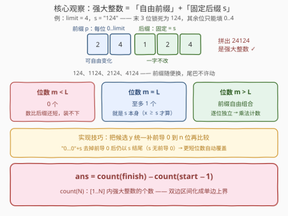
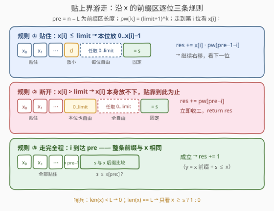
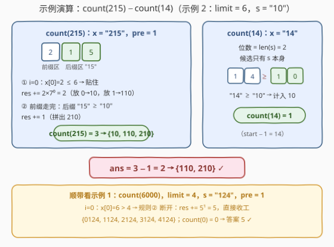

# LeetCode 统计强大整数的数目 题解

## 1. 题目概述

- **标题 / 题号**：统计强大整数的数目（#2999，hard）
- **链接**：https://leetcode.cn/problems/count-the-number-of-powerful-integers/
- **难度**：困难
- **标签**：数学、字符串、动态规划

**题意**：给你三个整数 `start`、`finish` 和 `limit`，同时给你一个下标从 0 开始的字符串 `s`，表示一个**正**整数。

如果一个正整数 `x` 结尾部分是 `s`（换句话说，`s` 是 `x` 的**后缀**），且 `x` 中的每个数位至多是 `limit`，那么我们称 `x` 是**强大的**。

请你返回区间 `[start..finish]` 内强大整数的**总数目**。

> 后缀定义：字符串 `x` 是 `y` 的后缀，当且仅当 `x` 与 `y` 中从某个下标开始（**包括 0**）到末尾的子串相等。比方说 `25` 是 `5125` 的一个后缀，但不是 `512` 的后缀。

**示例 1**：

```text
输入：start = 1, finish = 6000, limit = 4, s = "124"
输出：5
解释：区间 [1..6000] 内的强大整数为 124、1124、2124、3124 和 4124。
     注意 5124 不是强大整数，因为首位 5 > 4。
```

**示例 2**：

```text
输入：start = 15, finish = 215, limit = 6, s = "10"
输出：2
解释：区间 [15..215] 内的强大整数为 110 和 210。
```

**示例 3**：

```text
输入：start = 1000, finish = 2000, limit = 4, s = "3000"
输出：0
解释：区间内所有整数都小于 3000，"3000" 不可能是任何整数的后缀。
```

**约束**：

- `1 <= start <= finish <= 10^15`
- `1 <= limit <= 9`
- `1 <= s.length <= floor(log10(finish)) + 1`（即 `s` 不会比 `finish` 还长）
- `s` 的每个数位都小于等于 `limit`
- `s` 不包含任何前导 0

> 💡 **关键信号**：`finish ≤ 10^15`——逐个枚举区间必死，只能**计数**；「后缀固定 + 每位独立 ≤ limit」的结构让本题成为**数位 DP 的退化特例**：脱离上界后的方案数是纯乘法 $(\text{limit}+1)^k$，连 DP 表都不需要。约束里「`s` 各位 ≤ limit」「`s` 无前导 0」两条是官方送的安全保证，实现时能省掉两类特判（见 5.2）。

## 2. 解题思路

### 2.1 暴力思路

最直观的做法是枚举 `[start..finish]` 中每个 `x`，检查 `str(x)` 是否以 `s` 结尾且各位 ≤ `limit`。区间最长 $10^{15}$ 个数，完全不可行。即便只在「以 `s` 结尾」的数上以 $10^{L}$ 为步长跳跃（$L$ 为 `s` 长度），最坏（`L = 1`）仍有约 $10^{14}$ 步，同样不可行。

问题不在判定贵——判定一次只要 $O(16)$——而在**区间太长**。区间计数的标准拆法是**前缀和相减**：

$$\text{ans} = \text{count}(\text{finish}) - \text{count}(\text{start} - 1)$$

其中 `count(N)` 表示 `[1..N]` 内强大整数的个数。双边夹逼化成单边上界后，只剩一件事：设计 `count(N)`。

### 2.2 核心观察：撕开后缀，前缀纯组合

`count(N)` 统计的每一个候选 `y` 都被两道约束完全定型：

1. **后 $L$ 位**：必须逐字符等于 `s`（后缀约束把尾巴锁死）；
2. **其余位（前缀区，共 `pre = n − L` 位，`n = len(str(N))`）**：每位**独立地**在 `{0..limit}` 里选。

关键在「**每位独立**」：不像「各位互不相同」那类与前缀历史相关的约束，本题前缀区某一位放什么、是否合法，只看这一位本身。于是从左到右沿 `N` 的数位「贴上界」游走时，一旦某个位置脱离了与 `N` 的贴靠，其后所有位就**完全自由**——方案数是纯乘法 $(\text{limit}+1)^k$，无需任何记忆化。



按候选 `y` 的位数分类（设 `n = len(str(N))`）：

- **位数 < L**：数比后缀还短，装不下 → 0 个；
- **位数 = L**：候选只能是 `s` 本身（各位 ≤ limit 已由约束保证）→ `x ≥ s` 时恰 1 个；
- **位数 = n 且贴着上界**：逐位游走，见 2.3；
- **位数更短（L < m < n）**：前缀自由组合。这一类不必单独求和——用一个实现技巧自动覆盖：

> 💡 **补前导 0 对齐**：把所有 ≤ N 的候选统一补前导 0 到 `n` 位再比较。前缀区允许前导 0 并不会多数：`"0…0" + s` 去掉前导 0 后**仍以 `s` 结尾**（这里正用到「`s` 无前导 0」的约束），所以 `d = 0` 的分支恰好把「位数更短」的强大整数一并计入。代码因此无需按位数分层。

### 2.3 算法流程：贴上界游走

设 `x = str(N)`，`pre = n − L`，幂表 $pw[k] = (\text{limit}+1)^k$。游走位置 `i` 从 0 扫到 `pre − 1`，三条规则：

- **规则①（贴住）** `x[i] ≤ limit`：本位放 $d \in [0, x_i - 1]$ 都已严格小于 $x_i$，其后前缀区剩余位任取、后缀照抄 `s` → $\text{res} \mathrel{+}= x_i \cdot pw[\text{pre}-1-i]$，继续右移；
- **规则②（断开）** `x[i] > limit`：$x_i$ 本身放不下，贴靠到此为止；本位只能放 `[0, limit]`，其后全部自由 → $\text{res} \mathrel{+}= pw[\text{pre}-i]$，**立即收工**（不可能再贴回去）；
- **规则③（走完）** `i` 到达 `pre`：整条前缀与 `x` 相同，候选只剩 `y = x 前缀 + s`；同长度下 $y \le x \iff s \le x[\text{pre}:]$（字典序即数值序）→ 成立则 `res += 1`。

外加两个哨兵：`len(x) < L` 返回 0；`len(x) == L` 返回 `x >= s ? 1 : 0`。



### 2.4 示例演算

以示例 2（`start=15, finish=215, limit=6, s="10"`）完整走一遍：



**count(215)**：`x = "215"`，`pre = 1`，幂底 7：

- `i=0`：$x_0 = 2 \le 6$ → 规则①，$\text{res} += 2 \times 7^0 = 2$——首位放 0（即 10）或 1（即 110）；
- 走完：后缀 `"15" ≥ "10"` → 规则③，`res += 1`——即 210；
- `count(215) = 3`，对应 `{10, 110, 210}`。

**count(14)**：`len("14") == len("10")` → 哨兵，`"14" ≥ "10"` → 1，对应 `{10}`。

**ans** `= 3 − 1 = 2` → `{110, 210}`（10 < start=15 被 `count(start−1)` 减掉），与官方一致。

顺带示例 1（`finish=6000, limit=4, s="124"`）：`count(6000)` 在 `i=0` 就遇到 $x_0 = 6 > 4$ → 规则②断开，`res = 5^1 = 5`（前缀取 0..4 → 0124…4124）；`count(0) = 0`，答案 5。

## 3. 参考代码

### Python

```python
class Solution:
    def numberOfPowerfulInt(self, start: int, finish: int, limit: int, s: str) -> int:
        def count(n: int) -> int:                     # [1..n] 内强大整数的个数
            x = str(n)
            if len(x) < len(s):                       # 后缀比整个数还长
                return 0
            if len(x) == len(s):                      # 候选只能是 s 本身
                return 1 if x >= s else 0
            pre = len(x) - len(s)                     # 前缀区长度
            res = 0
            for i in range(pre):
                d = int(x[i])
                if d > limit:                         # 规则②：断开，其后全自由
                    return res + (limit + 1) ** (pre - i)
                res += d * (limit + 1) ** (pre - 1 - i)   # 规则①：贴住
            return res + 1 if x[pre:] >= s else res       # 规则③：走完全程

        return count(finish) - count(start - 1)
```

### C++

```cpp
class Solution {
  public:
    long long numberOfPowerfulInt(long long start, long long finish, int limit, string s) {
        return count(finish, s, limit) - count(start - 1, s, limit);
    }

  private:
    long long count(long long n, const string& s, int limit) {  // [1..n] 内强大整数的个数
        string x = to_string(n);
        int len = x.size(), L = s.size();
        if (len < L) return 0;                    // 后缀比整个数还长
        if (len == L) return x >= s ? 1 : 0;      // 候选只能是 s 本身
        int pre = len - L;                        // 前缀区长度
        long long pw[20];                         // pw[k] = (limit+1)^k
        pw[0] = 1;
        for (int k = 1; k <= pre; ++k) pw[k] = pw[k - 1] * (limit + 1);
        long long res = 0;
        for (int i = 0; i < pre; ++i) {
            int d = x[i] - '0';
            if (d > limit)                        // 规则②：断开，其后全自由
                return res + pw[pre - i];
            res += 1LL * d * pw[pre - 1 - i];     // 规则①：贴住
        }
        return res + (x.substr(pre) >= s ? 1 : 0);  // 规则③：走完全程
    }
};
```

> 💡 两处细节：① `len(x) == len(s)` 的比较是**同长度字符串比较**，字典序即数值序，无需转 `int`；② `count(start - 1)` 在 `start = 1` 时即 `count(0)`，`x = "0"` 走哨兵自然返回 0，无需特判。

## 4. 复杂度分析

| 维度 | 复杂度 | 说明 |
|------|--------|------|
| 时间复杂度 | $O(D)$，$D = \log_{10}(\text{finish}) \le 16$ | 两次 `count`，每次单趟扫描前缀区；幂表预计算 $O(D)$ |
| 空间复杂度 | $O(D)$ | 数字符串与幂表 |

即便 `finish` 取满 $10^{15}$，单次 `count` 也只循环至多 15 位，实测微秒级。「困难」难度难在想到拆结构与处理贴上界，不在实现量。

## 5. 扩展

### 5.1 为什么它长得像数位 DP，却不用 DP 表

标准数位 DP 的状态形如 `(位置, tight, 额外状态)`，需要记忆化的正是「额外状态」——凡是约束**与前缀历史相关**的问题（已用数字集合、数位和、模某数的余数……）都逃不掉。本题约束逐位独立 + 后缀固定，`tight` 一放开就是纯组合数 $(\text{limit}+1)^k$，于是退化成单趟扫描。面试中先识别「**能不能退化**」，往往能把 30 行的 DP 压成 10 行的循环——但前提是能说清楚为什么退化是安全的（每位独立）。

### 5.2 约束不是白给的：若 `s` 允许前导 0

补前导 0 的技巧会立刻失效。例如 `s = "0124"`：补零串 `"0" + "0124" = "00124"` 表示 124，而 `"124"` 并不以 `"0124"` 结尾——**多数了**；且不同补零长度还会把同一个数重复计入。修正办法是放弃对齐，改回**按真实位数分层**计数（首位 ≥ 1，层内自由组合），并单独校验 `m = L` 层。本题约束明确排除了这种情况，属于「读懂约束能省一半代码」的典型。

### 5.3 通用骨架

「统计 ≤ N 且满足逐位约束的数」这一族问题的万能骨架是：**短位数全自由计数 + 同位数贴上界游走 +（视约束而定）沿 tight 路径的 DP**。本题只需前两步；233、902 加一点高低位分解；1012、2719 才需要完整的第三步。把这套骨架练熟，数位计数一族可以通吃。

## 6. 面试要点

1. **区间 `[start, finish]` 计数的第一反应是什么？**
   - 前缀和相减 `count(finish) − count(start−1)`，把双边夹逼化成单边上界。只要「是否合法」与数的大小可比、且对单点判定容易，这一步几乎是万能起手式。

2. **为什么本题不需要 dp 数组？**
   - 约束逐位独立（每位 ≤ limit）且后缀固定，脱离 tight 后方案数是纯乘法 $(\text{limit}+1)^k$；只有当约束依赖前缀历史（数字互异、数位和、余数）时，才需要沿 tight 路径带状态记忆化。

3. **游走中遇到 `x[i] > limit`，为什么加 $pw[\text{pre}-i]$ 就能立即 return？**
   - `x[i]` 本身放不下，说明与 `x` 的公共前缀到 `i−1` 为止；本位放 `[0, limit]` 已严格小于 `x[i]`，其后 `pre − i` 位（含本位）全部自由、后缀照抄 `s`，恰 $(\text{limit}+1)^{\text{pre}-i}$ 个；此后不可能再出现 ≤ N 的同长度候选，短位数候选又已被补零对齐覆盖。

4. **前缀允许前导 0 会不会多数？**
   - 不会。补零串去掉前导 0 后仍以 `s` 结尾（前提：`s` 无前导 0，题目已保证）；`d = 0` 分支恰好把更短位数的强大整数计入，是特性不是 bug。若 `s` 可能带前导 0，该技巧失效，需按位数分层并扣掉前缀全 0 的重复计数。

5. **溢出与边界怎么处理？**
   - `count(N) ≤ N ≤ 10^15`，幂最大 $(\text{limit}+1)^{15} = 10^{15}$，`long long`（上限约 $9.2 \times 10^{18}$）全程安全，C++ 乘法记得 `1LL` 强转；`start = 1` 时 `count(0)` 走 `x = "0"` 的哨兵自然得 0，无需特判。

## 同类练习题

| # | 题目 | 与本题的关联 |
|---|------|-------------|
| 233 | [数字 1 的个数](https://leetcode.cn/problems/number-of-digit-one/)（[站内题解](../0201-0300/233_数字1的个数.md)） | 数位统计鼻祖题，按「高位·当前位·低位」拆贡献，同一套「≤ N 计数」框架 |
| 902 | [最大为 N 的数字组合](https://leetcode.cn/problems/numbers-at-most-n-given-digit-set/)（[站内题解](../0901-1000/902_最大为N的数字组合.md)） | 与本题最像——每位限用给定数字集合（逐位独立），短位数全排列 + 贴上界游走，必做对照 |
| 357 | [统计各位数字都不同的数字个数](https://leetcode.cn/problems/count-numbers-with-unique-digits/) | 约束开始与「已用集合」相关，引入排列计数，是从纯乘法迈向数位 DP 的台阶 |
| 1012 | [至少有 1 位重复的数字](https://leetcode.cn/problems/numbers-with-repeated-digits/)（[站内题解](../1001-1100/1012_至少有1位重复的数字.md)） | 正难则反 + 标准 tight/mask 数位 DP，体验「需要 DP 表」的世界 |
| 2719 | [统计整数数目](https://leetcode.cn/problems/count-of-integers/)（[站内题解](../2701-2800/2719_统计整数数目.md)） | 带数位和上下界的数位 DP，通用模板集大成 |
