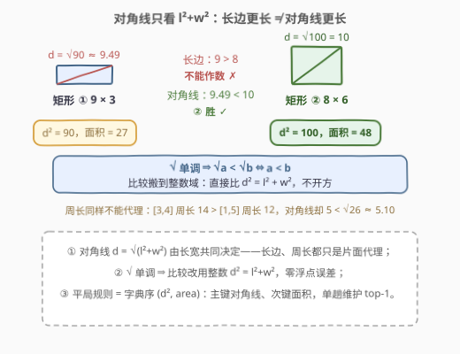
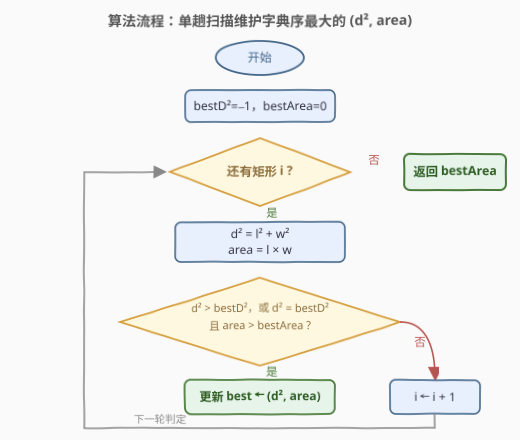
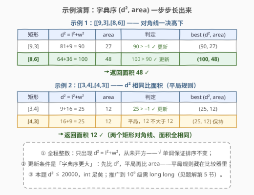

# 对角线最长的矩形的面积

- **题目名称**：对角线最长的矩形的面积
- **链接**：[3000. 对角线最长的矩形的面积](https://leetcode.cn/problems/maximum-area-of-longest-diagonal-rectangle/)
- **难度**：简单
- **标签**：数组、枚举

## 1. 题目概述

给你一个下标从 **0** 开始的二维整数数组 `dimensions`。对所有下标 `i`（`0 <= i < dimensions.length`），`dimensions[i][0]` 表示矩形 `i` 的**长度**，`dimensions[i][1]` 表示矩形 `i` 的**宽度**。

返回对角线最 **长** 的矩形的 **面积**。如果存在多个对角线长度相同的矩形，返回其中面积最 **大** 的矩形的面积。

**示例 1**：

```text
输入：dimensions = [[9,3],[8,6]]
输出：48
解释：下标 = 0，长度 = 9，宽度 = 3。对角线长度 = sqrt(9*9 + 3*3) = sqrt(90) ≈ 9.487。
     下标 = 1，长度 = 8，宽度 = 6。对角线长度 = sqrt(8*8 + 6*6) = sqrt(100) = 10。
     因此，下标为 1 的矩形对角线更长，所以返回面积 = 8 * 6 = 48。
```

**示例 2**：

```text
输入：dimensions = [[3,4],[4,3]]
输出：12
解释：两个矩形的对角线长度相同，为 5，所以最大面积 = 12。
```

**约束条件**：

- $1 \le dimensions.length \le 100$
- $dimensions[i].length = 2$
- $1 \le dimensions[i][0], dimensions[i][1] \le 100$

> 💡 读题先抓本质：这是一道**一趟扫描维护最优**的问题——答案被「对角线 + 面积」二元组唯一确定，规模极小（$n \le 100$），怎么写都能过；真正值得抠的只有两点：① 比较对角线时**不要开方**（单调性代换，全程整数）；② 平局规则怎么**藏进比较器**（字典序）。

---

## 2. 解题思路

### 2.1 暴力思路：逐个算对角线长度，谁长记谁

最直接的做法：对每个矩形 $[l, w]$ 计算 $d = \sqrt{l^2 + w^2}$，维护对角线最长的矩形；若与当前最长者对角线相等，再比面积 $l \times w$，更大则替换。这就是正解的框架——「暴力」与「正解」只差一步代换。

数据规模 $n \le 100$、$l, w \le 100$，即使逐个 `sqrt` 开 `double` 比较也能通过；但这依赖「本题数值小」的侥幸——把比较搬到整数域，才是稳定且可推广的写法。

### 2.2 核心观察：$\sqrt$ 单调 ⇒ 比平方和 + 字典序 $(d^2, area)$ 单趟维护



三条性质框定解法形态：

1. **对角线由长宽共同决定，片面代理都会翻车**：矩形 $9 \times 3$ 的长边更长（$9 > 8$），对角线却是 $\sqrt{90} \approx 9.49 < 10$，输给 $8 \times 6$；周长同理——$[3,4]$ 周长 $14$ 大于 $[1,5]$ 的 $12$，对角线却 $5 < \sqrt{26} \approx 5.10$。比较对象必须是对角线本身。
2. **$\sqrt$ 单调，比较不必开方**：对非负数，$d_1 > d_2 \iff d_1^2 > d_2^2$。因此比较 $\sqrt{l_1^2+w_1^2}$ 与 $\sqrt{l_2^2+w_2^2}$，等价于直接比较整数 $l_1^2+w_1^2$ 与 $l_2^2+w_2^2$——**单调函数不改变比较结果**，把开方彻底赶出代码，零浮点误差。
3. **平局规则 = 字典序**：「对角线最长、平局取面积最大」即按二元组 $(d^2,\ area)$ 取**字典序最大**——主键 $d^2$，次键 $area$。一趟扫描维护这个 top-1 二元组即可。

$$\boxed{\ \mathrm{ans} = \operatorname{area}\Big(\arg\max_{(l,\,w)\,\in\,dimensions}\ \big(l^2+w^2,\ \ l \cdot w\big)\Big)\ }$$

本题数值范围 $d^2 \le 100^2 + 100^2 = 20000$，`int` 绰绰有余；推广到 $l, w \le 10^9$ 时 $d^2 \le 2 \times 10^{18}$，需换 `long long`——这正暴露了整数路线的另一个好处：**值域与溢出一目了然**，而 `double` 在 $2^{53}$ 以上连整数都存不准（见第 5 节）。

> 💡 一句话：**「比谁的对角线长」翻译到整数域就是「比谁的 $l^2+w^2$ 大」，平局接一个面积次键——单趟扫描维护字典序最大的二元组，就是全部代码。**

### 2.3 算法流程图



**完整步骤**：

1. **初始化**：`bestD2 = -1`，`bestArea = 0`，下标 `i = 0`；
2. **计算**：取出矩形 $[l, w]$，算 $d^2 = l^2 + w^2$ 与 $area = l \times w$；
3. **更新**：若 $d^2 > bestD2$，或 $d^2 = bestD2$ 且 $area > bestArea$（即字典序更大），更新二元组；
4. **推进**：`i++`，只要还有矩形就回到第 2 步；
5. **收尾**：返回 `bestArea`。

> ⚠️ 常见手误是把条件写成 `d2 >= bestD2 && area > bestArea`——它在「对角线更长但面积更小」时会**漏更新**。反例：`[[9,9],[13,2]]`，第二个矩形 $d^2$ 从 $162$ 涨到 $173$、面积却从 $81$ 跌到 $26$，正确答案 $26$，这种写法会错答 $81$。正确姿势是纯字典序：`d2 > bestD2 || (d2 == bestD2 && area > bestArea)`。

### 2.4 示例演算



以示例 1（`[[9,3],[8,6]]`）为例：

| 矩形 | $d^2 = l^2+w^2$ | $area$ | 与当前 best 比较 | best $(d^2, area)$ |
|------|------------------|--------|------------------|--------------------|
| $[9,3]$ | $81+9=90$ | $27$ | $90 > -1$ → 更新 | $(90, 27)$ |
| $[8,6]$ | $64+36=100$ | $48$ | $100 > 90$ → 更新 | $(100, 48)$ |

遍历结束返回 $48$ ✓。示例 2（`[[3,4],[4,3]]`）则触发平局分支：两个 $d^2$ 均为 $25$，第二个矩形面积 $12$ 不大于 $12$，best 保持不变，返回 $12$——正是「字典序次键」的落点。

---

## 3. 参考代码

### C++

```cpp
class Solution {
  public:
    int areaOfMaxDiagonal(vector<vector<int>>& dimensions) {
        int bestD2 = -1, bestArea = 0;
        for (auto& d : dimensions) {
            int d2 = d[0] * d[0] + d[1] * d[1];
            int area = d[0] * d[1];
            if (d2 > bestD2 || (d2 == bestD2 && area > bestArea)) {
                bestD2 = d2;
                bestArea = area;
            }
        }
        return bestArea;
    }
};
```

### Python

```python
class Solution:
    def areaOfMaxDiagonal(self, dimensions: List[List[int]]) -> int:
        best_d2, best_area = -1, 0
        for l, w in dimensions:
            d2, area = l * l + w * w, l * w
            if d2 > best_d2 or (d2 == best_d2 and area > best_area):
                best_d2, best_area = d2, area
        return best_area
```

Python 还可利用元组**天然按字典序比较**的性质压成一行：

```python
class Solution:
    def areaOfMaxDiagonal(self, dimensions: List[List[int]]) -> int:
        return max((l * l + w * w, l * w) for l, w in dimensions)[1]
```

> 💡 语言细节：C++ 的 `||` 短路保证只有平局才看面积；Python 元组 `(d2, area)` 的比较就是字典序，`max` 直接取字典序最大元组，`[1]` 取面积——「主键 + 次键」打包成元组是最地道的写法。

---

## 4. 复杂度分析

| 维度 | 复杂度 | 说明 |
|------|--------|------|
| 时间复杂度 | $O(n)$ | 一趟扫描，每个矩形常数次乘加与比较；$\Omega(n)$ 也是读取下界——任何未读的矩形都可能是对角线最长者 |
| 空间复杂度 | $O(1)$ | 仅维护二元组 $(d^2, area)$ 与循环下标，不随输入规模增长 |

---

## 5. 扩展：浮点开方什么时候会翻车？

本题范围内 $d^2 \le 20000$，即使逐个 `sqrt` 比较也大概率无事——IEEE 754 的 `sqrt` 是**正确舍入**的，对相差至少 $1$ 的整数输入，开方结果不会判等。但把数值放大，侥幸就变成必然翻车：

- **大数平局误判**：$l, w \le 10^9$ 时 $d^2 \le 2 \times 10^{18} > 2^{53}$。`double` 在该量级的 ulp 达 $256$，**不同的 $d^2$ 可能舍入成同一个 `double`**，`sqrt(a) == sqrt(b)` 误报平局，随后拿错误的「平局」去比面积，直接输出错答案；
- **整数溢出更隐蔽**：C++ 中 `int` 存 $10^9$ 没问题，但 `l * l` 在 `int` 域内已经溢出成负数——平方和必须用 `long long` 接；
- **正确姿势**：比较一律在整数域进行（$d^2$ 用 `long long`），$\sqrt$ 只在需要**输出长度数值**时才计算。这也是 [69. x 的平方根](https://leetcode.cn/problems/sqrtx/)（二分全程 `mid <= x / mid` 防溢出）与 [367. 有效的完全平方数](https://leetcode.cn/problems/valid-perfect-square/)（不信任 `(int)sqrt(x)` 的精度，用二分/牛顿法在整数域验证）共同的教训。

> 💡 面试叙事：**「单调函数不改变比较结果」是可迁移的工具**——比较 $\sqrt{a}$ 与 $\sqrt{b}$、$a^2$ 与 $b^2$（非负）、$e^a$ 与 $e^b$，都可等价搬到计算与存储更便宜的域；代换时要有值域意识（整数溢出）与精度意识（浮点舍入）。

---

## 6. 面试要点

1. **为什么比较 $l^2+w^2$ 而不是 $\sqrt{l^2+w^2}$？**

   - $\sqrt$ 在非负域单调，$d_1 > d_2 \iff d_1^2 > d_2^2$，比较结果不变
   - 整数比较零误差、免开方；本题小数值侥幸能过，大数域 `double` 会因 $2^{53}$ 精度墙误判平局

2. **能不能拿长边或周长近似对角线？**

   - 不能：$9 \times 3$ 长边 $9 > 8$ 却输给 $8 \times 6$；$[3,4]$ 周长 $14 > [1,5]$ 的 $12$，对角线却更短
   - 对角线是 $l^2+w^2$ 的函数，长边/周长只是片面代理

3. **平局规则怎么写进一次比较？**

   - 字典序：`d2 > bestD2 || (d2 == bestD2 && area > bestArea)`
   - ⚠️ 反例 `d2 >= bestD2 && area > bestArea`：遇到「对角线更长但面积更小」（`[[9,9],[13,2]]`：$d^2$ $162 \to 173$、面积 $81 \to 26$）会漏更新，错答 $81$

4. **复杂度还能更好吗？**

   - 不能：$\Omega(n)$ 读取下界——任何未读的矩形都可能是答案
   - $O(n)$ 时间 + $O(1)$ 空间的单趟扫描已是理论最优

5. **Python 一行解法为什么成立？**

   - 元组比较天然按字典序：`max((d2, area) ...)` 主键 $d^2$、次键 $area$，`[1]` 取面积
   - 它展开后就是上面的单趟扫描，不是「另有一个神奇算法」

> 💡 **一句话总结**：$\sqrt$ 单调 ⇒ 比整数平方和；「最长对角线 + 平局最大面积」⇒ 字典序 $(d^2, area)$ 的 top-1；单趟扫描 $O(n)$ / $O(1)$ 即最优。

---

## 7. 同类练习题

- [69. x 的平方根](https://leetcode.cn/problems/sqrtx/)（[题解](../0001-0100/69_x的平方根.md)）：整数域求 $\sqrt{x}$，二分用除法防溢出——本文「不开方」思路的姊妹篇
- [367. 有效的完全平方数](https://leetcode.cn/problems/valid-perfect-square/)（[题解](../0301-0400/367_有效的完全平方数.md)）：不信 `(int)sqrt` 的精度，整数域二分验证——浮点不可靠的又一实证
- [414. 第三大的数](https://leetcode.cn/problems/third-maximum-number/)（[题解](../0401-0500/414_第三大的数.md)）：单趟维护 top-k + 去重与「不足 k 个回退」的边界处理
- [836. 矩形重叠](https://leetcode.cn/problems/rectangle-overlap/)（[题解](../0801-0900/836_矩形重叠.md)）：矩形几何判定，把「重叠」拆成「不重叠」的补来写条件
- [223. 矩形面积](https://leetcode.cn/problems/rectangle-area/)（[题解](../0201-0300/223_矩形面积.md)）：矩形并面积容斥，同属「矩形坐标计算」家族
