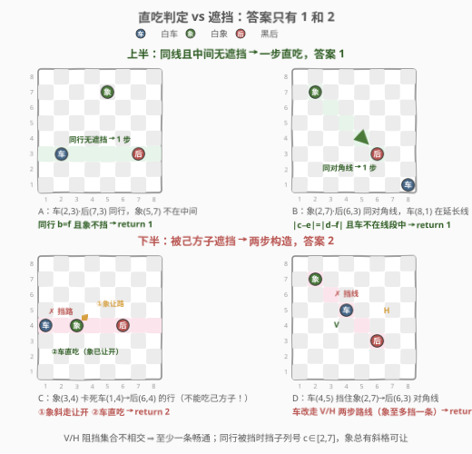
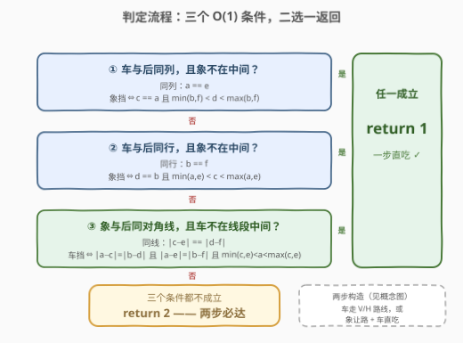
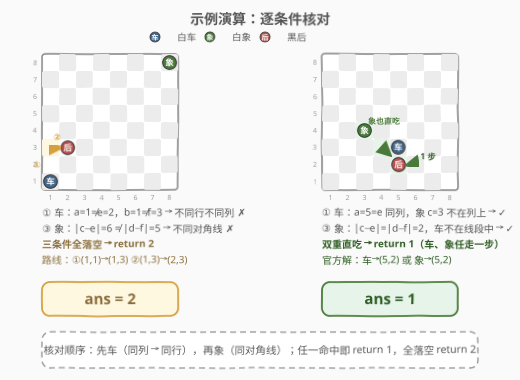

# 捕获黑皇后需要的最少移动次数

- **题目名称**：捕获黑皇后需要的最少移动次数
- **链接**：[3001. 捕获黑皇后需要的最少移动次数](https://leetcode.cn/problems/minimum-moves-to-capture-the-queen/)
- **难度**：中等
- **标签**：数学、枚举

## 1. 题目概述

现有一个下标从 **1** 开始的 `8 x 8` 棋盘，上面有 `3` 枚棋子。

给你 `6` 个整数 `a`、`b`、`c`、`d`、`e` 和 `f`，其中：

- `(a, b)` 表示白色车的位置。
- `(c, d)` 表示白色象的位置。
- `(e, f)` 表示黑皇后的位置。

假设你只能移动白色棋子，返回捕获黑皇后所需的**最少**移动次数。

**请注意**：

- 车可以向垂直或水平方向移动任意数量的格子，但不能跳过其他棋子。
- 象可以沿对角线方向移动任意数量的格子，但不能跳过其他棋子。
- 如果车或象能移向皇后所在的格子，则认为它们可以捕获皇后。
- 皇后不能移动。

**示例 1**：

```text
输入：a = 1, b = 1, c = 8, d = 8, e = 2, f = 3
输出：2
解释：将白色车先移动到 (1, 3)，然后移动到 (2, 3) 来捕获黑皇后，共需移动 2 次。
由于起始时没有任何棋子正在攻击黑皇后，要想捕获黑皇后，移动次数不可能少于 2 次。
```

**示例 2**：

```text
输入：a = 5, b = 3, c = 3, d = 4, e = 5, f = 2
输出：1
解释：可以通过以下任一方式移动 1 次捕获黑皇后：
- 将白色车移动到 (5, 2)。
- 将白色象移动到 (5, 2)。
```

**约束条件**：

- $1 \le a, b, c, d, e, f \le 8$
- 两枚棋子不会同时出现在同一个格子上。

> 💡 读题先抓形态：棋盘上只有 **3 枚棋子**、输入只有 **6 个整数**——这是**判定题**而非搜索题。真正的考点有二：① 「不能跳过其他棋子」的**遮挡语义**（注意白车和白象同色，**不能吃掉己方棋子**）；② 答案的理论取值只有 $1$ 和 $2$（官方 hints 明示），把「什么时候是 1」判对，剩下的全是 2。

---

## 2. 解题思路

### 2.1 暴力思路：BFS 搜索移动序列

把局面定义为 `(车位, 象位)`（皇后不动），状态空间至多 $64 \times 64 = 4096$。每个状态枚举车（至多 14 个可达格）与象（至多 13 个可达格）的滑动终点做转移，从初始局面 BFS，首次滑到皇后格的层数即答案。正确性无脑可靠，单次查询约 $10^5$ 量级操作。

但这是杀鸡用牛刀：答案只有两个取值，BFS 完全没利用棋理。把「答案为什么 $\le 2$」与「什么时候 $= 1$」想透，能直接写出 $O(1)$ 判定式。

### 2.2 核心观察：答案 $\in \{1, 2\}$ —— 直吃判定 + 两步必达



**观察一：答案是 1 当且仅当「车或象现在就攻击到皇后」。**

「攻击到」= **同线**（车的同行/同列，象的同对角线）且**线段中间没有己方子**：

1. **车直吃**：
   - 同列 $a = e$，且象不挡：象挡 $\iff c = a$ 且 $\min(b,f) < d < \max(b,f)$；
   - 同行 $b = f$，且象不挡：象挡 $\iff d = b$ 且 $\min(a,e) < c < \max(a,e)$。
2. **象直吃**：同对角线 $|c - e| = |d - f|$，且车不挡：车挡 $\iff |a-c| = |b-d|$ 且 $|a-e| = |b-f|$ 且 $\min(c,e) < a < \max(c,e)$。

> ⚠️ 象的遮挡判定为什么要**三个条件**？过一点有**两条**对角线：$|a-c| = |b-d|$ 只说明车在「象的某一条」对角线上，必须再叠加 $|a-e| = |b-f|$ 把车锁定到「象与后的**公共**对角线」，最后 $\min(c,e) < a < \max(c,e)$ 保证车严格在线段**内部**而非延长线上。反例一：象 $(2,7)$、后 $(6,3)$、车 $(3,8)$——车满足 $|a-c|=|b-d|=1$ 且 $a$ 介于 $c,e$ 之间，但 $|a-e|=3 \ne |b-f|=5$，它根本不在攻击线上；反例二：车 $(8,1)$ 在公共对角线的延长线上（线段外侧），同样不构成遮挡。

**观察二：直吃不成立时，答案必为 2 —— 两条构造性路线。**

关键认知先行：**白车不能吃白象**（不能吃己方棋子），所以遮挡只能「绕」或「让」，不能「吃掉清障」。

- **构造 A（车不在皇后的行/列上，即 $a \ne e$ 且 $b \ne f$）**：车有两条两步路线——先竖后横 $V: (a,b) \to (a,f) \to (e,f)$、先横后竖 $H: (a,b) \to (e,b) \to (e,f)$。能挡 $V$ 的格子全在「列 $a$ ∪ 行 $f$」上，能挡 $H$ 的格子全在「行 $b$ ∪ 列 $e$」上；由 $a \ne e$、$b \ne f$ 可验证两个阻挡集合**交为空**——一枚象至多挡住一条，另一条必畅通。
- **构造 B（车与皇后同行/列，但被象挡住）**：让**象**先动。象沿对角线走任意一步，行、列坐标**同时改变**，必然离开这条行/列；而挡在中间的象，其列号（或行号）严格介于两端之间 $\Rightarrow 2 \le c \le 7$（或 $2 \le d \le 7$），四角方向至少留出一个可走的斜格，且车、后都在这条行/列上、不会占据斜格。象让开后，车与皇后之间再无障碍，第二步直吃。

$$\boxed{\ \mathrm{ans} = \begin{cases} 1, & \text{车或象直吃皇后（同线且中间无己方子）} \\ 2, & \text{否则（构造 A / B 必有一条两步路线）} \end{cases}\ }$$

> 💡 不放心可以写独立 BFS 对拍：枚举全部 $8^6$ 种输入中三子互不同格的 249,984 种局面，判定式与滑动模拟逐个比对——零失配。

### 2.3 算法流程图



**完整步骤**：

1. **条件 ①**：车与后同列 $a = e$，且象不在中间（$c \ne a$ 或 $d$ 不严格介于 $b, f$ 之间）→ 命中返回 1；
2. **条件 ②**：车与后同行 $b = f$，且象不在中间（$d \ne b$ 或 $c$ 不严格介于 $a, e$ 之间）→ 命中返回 1；
3. **条件 ③**：象与后同对角线 $|c-e| = |d-f|$，且车不在公共对角线线段中间 → 命中返回 1；
4. 三条件全落空 → 返回 2（两步必达）。

> ⚠️ 常见手误：① 把「严格介于」写成 $\le$——端点恰好是三枚棋子自身的格子，靠「三子互不同格」的约束兜底才没出错，逻辑上并不严谨；② 象的遮挡只写 $|a-c| = |b-d|$ 一个条件——会把「车在象的另一条对角线上」误判成遮挡（见 2.2 反例一）。

### 2.4 示例演算



**示例 1**（车 $(1,1)$，象 $(8,8)$，后 $(2,3)$）：

| 条件 | 核对 | 结果 |
|------|------|------|
| ① 车同列 | $a = 1 \ne e = 2$ | ✗ |
| ② 车同行 | $b = 1 \ne f = 3$ | ✗ |
| ③ 象同对角线 | $\lvert c-e \rvert = 6 \ne \lvert d-f \rvert = 5$ | ✗ |

三条件全落空 → **2**。两步路线：车 $(1,1) \to (1,3) \to (2,3)$，第 1 列与第 3 行均无遮挡（构造 A 的 $H$ 路线）。

**示例 2**（车 $(5,3)$，象 $(3,4)$，后 $(5,2)$）：

| 条件 | 核对 | 结果 |
|------|------|------|
| ① 车同列 | $a = 5 = e$；象 $c = 3 \ne 5$ 不在该列 | ✓ |
| ③ 象同对角线 | $\lvert 3-5 \rvert = \lvert 4-2 \rvert = 2$；车 $\lvert 5-3 \rvert = 2 \ne \lvert 3-4 \rvert = 1$，不在对角线上 | ✓ |

条件①已命中 → **1**。有趣的是条件③同样成立——本题车、象**双双**直吃皇后，走哪枚都行。

---

## 3. 参考代码

### C++

```cpp
class Solution {
  public:
    int minMovesToCaptureTheQueen(int a, int b, int c, int d, int e, int f) {
        // ① 车与后同列，且象不严格卡在中间
        if (a == e && !(c == a && min(b, f) < d && d < max(b, f))) return 1;
        // ② 车与后同行，且象不严格卡在中间
        if (b == f && !(d == b && min(a, e) < c && c < max(a, e))) return 1;
        // ③ 象与后同对角线，且车不在线段中间（公共对角线 + 严格内部）
        if (abs(c - e) == abs(d - f) &&
            !(abs(a - c) == abs(b - d) && abs(a - e) == abs(b - f) &&
              min(c, e) < a && a < max(c, e)))
            return 1;
        // 直吃全不成立：两步必达
        return 2;
    }
};
```

### Python

```python
class Solution:
    def minMovesToCaptureTheQueen(self, a: int, b: int, c: int, d: int,
                                  e: int, f: int) -> int:
        # ① 车与后同列，且象不严格卡在中间
        if a == e and not (c == a and min(b, f) < d < max(b, f)):
            return 1
        # ② 车与后同行，且象不严格卡在中间
        if b == f and not (d == b and min(a, e) < c < max(a, e)):
            return 1
        # ③ 象与后同对角线，且车不在线段中间
        if (abs(c - e) == abs(d - f) and not (
                abs(a - c) == abs(b - d) and abs(a - e) == abs(b - f)
                and min(c, e) < a < max(c, e))):
            return 1
        # 直吃全不成立：两步必达
        return 2
```

> 💡 语言细节：Python 的链式比较 `min(b, f) < d < max(b, f)` 一行表达「严格介于」，C++ 没有链式比较要拆成两个条件；六个整数都 $\le 8$，无溢出之忧。

---

## 4. 复杂度分析

| 维度 | 复杂度 | 说明 |
|------|--------|------|
| 时间复杂度 | $O(1)$ | 三个布尔判定共十余次整数比较，无循环无搜索 |
| 空间复杂度 | $O(1)$ | 仅使用 6 个入参整数，无额外结构 |

---

## 5. 扩展：判定式失效时，退回 BFS 通解

$O(1)$ 判定式的成立前提是「一车一象一后、皇后不动」。条件稍一变化——皇后每回合也走一步（对抗搜索）、子力换成双车/加马、或改问「恰好 $k$ 步的捕获方案数」——「必达构造」不再成立，稳妥做法退回 **BFS**：

- **状态**：`(车位, 象位)` 至多 $64 \times 64 = 4096$ 个（皇后会动则再加一维）；
- **转移**：枚举车（$\le 14$ 格）与象（$\le 13$ 格）的滑动终点，遇己方子挡停；
- **答案**：首次滑入皇后格的 BFS 层数。

本题规模下单次 BFS 约 $10^5$ 量级操作，绰绰有余。面试叙事上，先给出 $O(1)$ 判定、再主动指出「子力一变判定式就碎，BFS 是兜底」，比背公式更能体现工程判断。

---

## 6. 面试要点

1. **为什么答案只可能是 1 或 2？**

   - 车不在后的行/列：$V/H$ 两条两步路线的阻挡集合不相交（一个在「列 $a$ ∪ 行 $f$」，一个在「行 $b$ ∪ 列 $e$」，且 $a \ne e$、$b \ne f$），象至多挡一条
   - 车在后行/列但被象挡：象斜走一步必然离开该行/列（挡子坐标严格介于两端 $\Rightarrow$ 落在 $[2,7]$，总有斜格可走），车第二步直吃

2. **车能吃掉挡路的白象「清障」吗？**

   - 不能——同色棋子不能互吃，这是本题最阴的坑；也正因如此才有「象让路」构造（构造 B）

3. **象的遮挡判定为什么三个条件缺一不可？**

   - $|a-c| = |b-d|$：车在象的**某条**对角线上（过一点有两条）
   - $|a-e| = |b-f|$：车也在后的对角线上 → 两条件合力锁定**公共**对角线
   - $\min(c,e) < a < \max(c,e)$：严格在线段内部，排除延长线上的车（如象 $(2,7)$、后 $(6,3)$、车 $(8,1)$ 同线但车在外侧）

4. **「严格介于」写成 $\le$ 会出错吗？**

   - 本题不会错——端点格子恰是三枚棋子自身，题目保证互不同格；但这是靠数据约束兜底，语义上就该写严格，别在变体题里赌运气

5. **如果皇后也会动（双方对抗）呢？**

   - 皇后兼具车象走法，转为 minimax 对抗搜索，状态加一维皇后位置；$O(1)$ 判定失效，回到第 5 节的搜索框架

> 💡 **一句话总结**：答案只有 1 和 2——「同线且中间无己方子」判 1，其余全是 2；三条 O(1) 判定里藏着一个坑（不能吃己方子）和一个细节（对角线遮挡要三条件锁定公共线段）。

---

## 7. 同类练习题

- [999. 可以被一步捕获的棋子数](https://leetcode.cn/problems/available-captures-for-rook/)（[题解](../0901-1000/999_可以被一步捕获的棋子数.md)）：单车四方向滑动模拟 + 逐格遮挡判断，本题「车直吃」判定的母题
- [1222. 可以攻击国王的皇后](https://leetcode.cn/problems/queens-that-can-attack-the-king/)（[题解](../1201-1300/1222_可以攻击国王的皇后.md)）：多皇后八方向攻击线 + 遮挡判定，方向枚举的进阶版
- [52. N 皇后 II](https://leetcode.cn/problems/n-queens-ii/)（[题解](../0001-0100/52_N皇后II.md)）：回溯 + 列/两条对角线冲突检测，对角线判定技巧的集大成
- [1812. 判断国际象棋棋盘中一个格子的颜色](https://leetcode.cn/problems/determine-color-of-a-chessboard-square/)（[题解](../1801-1900/1812_判断国际象棋棋盘中一个格子的颜色.md)）：$x+y$ 奇偶定格子颜色，同一条对角线上的格子必然同色，理解 $|dx| = |dy|$ 判定的热身
