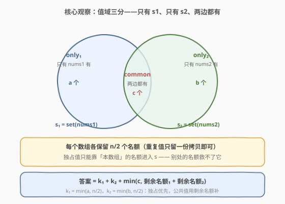
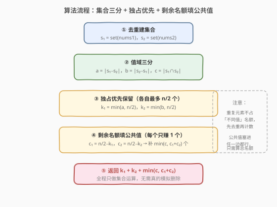

# 移除后集合的最多元素数

- **题目名称**：移除后集合的最多元素数
- **链接**：[3002. 移除后集合的最多元素数](https://leetcode.cn/problems/maximum-size-of-a-set-after-removals/)
- **难度**：中等
- **标签**：贪心、数组、哈希表

## 1. 题目概述

给定两个下标从 0 开始、长度均为**偶数** $n$ 的整数数组 `nums1` 和 `nums2`。你必须从 `nums1` 中移除 $n/2$ 个元素，同时从 `nums2` 中也移除 $n/2$ 个元素。移除之后，把两个数组中**剩下的元素**全部插入集合 $s$（集合自动去重）。返回集合 $s$ 可能包含的**最多**元素数。

> 💡 换个等价说法：每个数组各保留**恰好** $n/2$ 个元素（保留下标位置），最大化两边保留元素拼在一起的**不同值**个数。重复元素在集合里只算一次——这是本题所有贪心决策的出发点。

**示例 1**：

```text
输入：nums1 = [1,2,1,2], nums2 = [1,1,1,1]
输出：2
解释：各移除两个 1 后 nums1 = [2,2]，nums2 = [1,1]，s = {1,2}。
     nums1 的不同值只有 {1,2}，但名额仅 2 个且 1 与 nums2 重复，最多 {1,2} 两个值。
```

**示例 2**：

```text
输入：nums1 = [1,2,3,4,5,6], nums2 = [2,3,2,3,2,3]
输出：5
解释：nums1 移除 2、3、6 保留 {1,4,5}，nums2 移除一个 2、一个 3 保留 {2,3,2}，
     s = {1,2,3,4,5}。独占值 1,4,5,6 有 4 个但 nums1 名额只有 3 个，6 不得不放弃。
```

**示例 3**：

```text
输入：nums1 = [1,1,2,2,3,3], nums2 = [4,4,5,5,6,6]
输出：6
解释：两数组无公共值，各保留 3 个独占值 {1,2,3} 与 {4,5,6}，s 恰有 6 个元素。
```

**约束条件**：

- $n = \text{nums1.length} = \text{nums2.length}$，$1 \le n \le 2 \times 10^4$，$n$ 为偶数
- $1 \le \text{nums1}[i], \text{nums2}[i] \le 10^9$

---

## 2. 解题思路

### 2.1 暴力思路

从每个数组的 $n$ 个位置里各选 $n/2$ 个保留，组合数 $\binom{n}{n/2}^2$ 在 $n = 2\times10^4$ 时是天文数字，枚举必然超时。

换「值」的视角：设 $s_1 = \text{set(nums1)}$、$s_2 = \text{set(nums2)}$。集合 $s$ 的大小只取决于**哪些不同值被保留下来**，与保留几份拷贝无关。于是决策变成：对每个值选择「由 nums1 保留 / 由 nums2 保留 / 两者都不保留」，约束是 nums1 保留的不同值数 $\le n/2$、nums2 同理，最大化 $|s|$。仍是对「值集合」的指数级搜索，需要贪心性质压缩。

### 2.2 核心观察：值域三分 + 独占优先



把 $s_1 \cup s_2$ 的值分成互不重叠的三块：

- **独占值₁**（$a$ 个）：只在 $s_1$ 中，记 $a = \lvert s_1 \setminus s_2 \rvert$；
- **独占值₂**（$b$ 个）：只在 $s_2$ 中，记 $b = \lvert s_2 \setminus s_1 \rvert$；
- **公共值**（$c$ 个）：两边都有，记 $c = \lvert s_1 \cap s_2 \rvert$。

三条贪心直觉：

1. **重复值先去重**：同一值保留一份拷贝即可进入 $s$，多余拷贝白白占用「不同值名额」。所以每个数组的名额 $n/2$ 全部花在**互不相同**的值上。
2. **独占值只能靠本数组救**：独占值₁ 只存在于 nums1，nums2 的名额再多也帮不上忙。nums1 有 $n/2$ 个名额，故独占值₁ 至多保留 $k_1 = \min(a,\ n/2)$ 个；同理 $k_2 = \min(b,\ n/2)$。**先保独占**不吃亏——公共值无论从哪边保留都只给 $s$ 贡献 1 个元素，而独占值一旦因名额挤占而丢弃，就永远损失 1 个。
3. **公共值用剩余名额补**：nums1 用剩 $c_1 = n/2 - k_1$ 个名额、nums2 用剩 $c_2 = n/2 - k_2$ 个。每个公共值只需在**任一边**留一份拷贝即贡献 1 个新元素（公共值两边都有拷贝，塞哪边都行），于是还能再补 $\min(c,\ c_1 + c_2)$ 个。

$$
\text{ans} = k_1 + k_2 + \min(c,\ c_1 + c_2), \qquad k_1 = \min(a, \tfrac{n}{2}),\ k_2 = \min(b, \tfrac{n}{2})
$$

> 💡 **上界证明（为何不可能更大）**：设任意方案中 $s$ 含独占值₁ 共 $A$ 个、独占值₂ 共 $B$ 个、公共值共 $C$ 个。每个进入 $s$ 的独占值₁ 必须占用 nums1 的一个保留名额，故 $A \le \min(a, n/2) = k_1$；同理 $B \le k_2$。每个进入 $s$ 的公共值也必须占住某一边的一个名额，故 $C \le (n/2 - A) + (n/2 - B) = n - A - B$，又有 $C \le c$。于是
> $$|s| = A + B + C \le A + B + \min(c,\ n - A - B)$$
> 右端关于 $A$、$B$ **单调不减**（$A$ 增 1，前两项增 1，$\min$ 项至多减 1），故在 $A = k_1$、$B = k_2$ 处取到最大值——恰好就是贪心公式。而贪心公式**可达**：nums1 保留 $k_1$ 个独占值₁ 各一份、nums2 保留 $k_2$ 个独占值₂，再任选 $\min(c, c_1+c_2)$ 个公共值任意划分进两边的空名额即可。上界与构造吻合，贪心即最优。

### 2.3 算法流程图



全程只做**集合运算与计数**，完全不需要真的模拟「删哪 n/2 个元素」——去重之后，删除的具体位置无关紧要，只有「哪些值占用名额」重要。

### 2.4 示例演算

![示例演算：nums1=[1,2,3,4,5,6], nums2=[2,3,2,3,2,3]](../images/p3002_example_walkthrough.svg)

以示例 2 走一遍完整流程（$n = 6$，每边名额 3）：

| 步骤 | 计算 | 结果 |
|------|------|------|
| 去重 | $s_1 = \{1,2,3,4,5,6\}$，$s_2 = \{2,3\}$ | 6 个值 / 2 个值 |
| 三分 | only₁ = $\{1,4,5,6\}$，only₂ = $\varnothing$，common = $\{2,3\}$ | $a=4,\ b=0,\ c=2$ |
| 独占优先 | $k_1 = \min(4,3) = 3$（舍 6），$k_2 = \min(0,3) = 0$ | 剩余 $c_1 = 0,\ c_2 = 3$ |
| 补公共值 | $\min(2,\ 0+3) = 2$，把 2、3 塞进 nums2 的空名额 | 再添 2 个 |
| 答案 | $3 + 0 + 2$ | **5** ✓ |

对照示例 1：$a = 1$（值 2），$b = 0$，$c = 1$（值 1），$k_1 = 1$，$k_2 = 0$，$c_1 = 1$，$c_2 = 2$，答案 $= 1 + 0 + \min(1, 3) = 2$ ✓。示例 3：$a = b = 3$，$c = 0$，答案 $= 3 + 3 + 0 = 6$ ✓。

---

## 3. 参考代码

### C++

```cpp
class Solution {
  public:
    int maximumSetSize(vector<int>& nums1, vector<int>& nums2) {
        int half = nums1.size() / 2;
        unordered_set<int> s1(nums1.begin(), nums1.end());
        unordered_set<int> s2(nums2.begin(), nums2.end());
        int a = 0, b = 0, c = 0;                    // 独占₁ / 独占₂ / 公共
        for (int x : s1) (s2.count(x) ? c : a)++;
        for (int x : s2) if (!s1.count(x)) ++b;
        int k1 = min(a, half), k2 = min(b, half);   // 独占优先保留
        int c1 = half - k1, c2 = half - k2;         // 各自剩余名额
        return k1 + k2 + min(c, c1 + c2);           // 剩余名额补公共值
    }
};
```

### Python

```python
class Solution:
    def maximumSetSize(self, nums1: List[int], nums2: List[int]) -> int:
        half = len(nums1) // 2
        s1, s2 = set(nums1), set(nums2)
        a, b, c = len(s1 - s2), len(s2 - s1), len(s1 & s2)  # 三分值域
        k1, k2 = min(a, half), min(b, half)                 # 独占优先保留
        c1, c2 = half - k1, half - k2                       # 各自剩余名额
        return k1 + k2 + min(c, c1 + c2)                    # 剩余名额补公共值
```

> ⚠️ **不要**对「保留哪几份拷贝」做模拟——去重后名额语义（每个数组最多保留 $n/2$ 个**不同**值）才是本质。另注意答案天然不超过 $n$：$k_1 + k_2 \le n$ 且 $\min(c, c_1+c_2) \le c_1 + c_2 = n - k_1 - k_2$，无需额外取 `min(n, ...)`。

---

## 4. 复杂度分析

| 维度 | 复杂度 | 说明 |
|------|--------|------|
| 时间复杂度 | $O(n)$ | 建集合 + 遍历计数，每步均摊 $O(1)$ 哈希操作 |
| 空间复杂度 | $O(n)$ | $s_1$、$s_2$ 至多各存 $n$ 个值 |

---

## 5. 扩展：名额分配的可行性与变体

**为什么 $\min(c,\ c_1+c_2)$ 的分配总是可行？** 要补 $t = \min(c, c_1+c_2)$ 个公共值，任取 $t$ 个，把它们任意划分成「nums1 保留 $x$ 个（$x \le c_1$）」与「nums2 保留 $t - x$ 个（$t - x \le c_2$）」。每个公共值在两个数组里都至少有一份拷贝，塞进哪边都能落地——不存在「值只能从指定一边保留」的障碍，这正是「公共」二字换来的自由度。

**变体：若删除配额打通（两数组合计删 $n$ 个，不限各删几个）**，则答案退化为 $\min(n,\ \lvert s_1 \cup s_2 \rvert)$——总额 $n$ 个名额可完全自由地投向并集里的任何值。本题的关键约束正是「名额分属两个数组、独占值无法跨界借用」，这一对照能帮你确认自己真正理解了 $k_1, k_2$ 上界的来源。

---

## 6. 面试要点

1. **「移除 n/2 个」为什么等价于「保留 n/2 个名额」？**

   - 移除恰好 $n/2$ 个即保留恰好 $n/2$ 个。集合只看值不看次数，同一值留一份拷贝即可，所以名额等价于「至多保留 $n/2$ 个**不同**值」的配额，重复元素是最先被牺牲的。

2. **为什么独占值优先保留一定不劣？**

   - 交换论证：若某方案用 nums1 的名额保了公共值 $x$ 却放弃了独占值₁ $u$（名额未尽），把那份名额换成 $u$：$|s|$ 不减（$u$ 是新增，$x$ 可能由另一边兜底）。公共值两边都能救，独占值只有本数组能救——把稀缺的本数组名额优先花在「别处救不了」的值上。

3. **公共值为什么不用关心从哪边保留？**

   - 公共值对 $|s|$ 只贡献 1，只需在任一边留一份拷贝。两边剩余名额 $c_1 + c_2$ 构成一个可自由分割的总池，故能补 $\min(c, c_1+c_2)$ 个。

4. **如何证明上界 $k_1 + k_2 + \min(c, c_1+c_2)$？**

   - 设 $s$ 中独占₁/独占₂/公共值各 $A, B, C$ 个，则 $A \le k_1$、$B \le k_2$（本数组名额装独占值）、$C \le \min(c, n - A - B)$（公共值也要占名额）。$|s| \le A + B + \min(c, n-A-B)$ 对 $A, B$ 单调不减，在 $A=k_1, B=k_2$ 处最大，恰为贪心值；再给出对应的保留构造即证最优。

5. **复杂度与数据规模注意点？**

   - $n \le 2\times10^4$、值域 $10^9$：用哈希集合（`unordered_set` / `set`）去重与求交、差，$O(n)$ 时间即可；无需排序（排序 $O(n \log n)$ 也可过但没必要）。

---

## 7. 同类练习题

- [2215. 找出两数组的不同](https://leetcode.cn/problems/find-the-difference-of-two-arrays/)（[题解](../2201-2300/2215_找出两数组的不同.md)）：只考集合差集——本题 only₁/only₂ 的计算就是它的全部内容
- [349. 两个数组的交集](https://leetcode.cn/problems/intersection-of-two-arrays/)（[题解](../0301-0400/349_两个数组的交集.md)）：交集 common 部分的基础实现，配合 2215 凑齐本题的三分件
- [1481. 不同整数的最少数目](https://leetcode.cn/problems/least-number-of-unique-integers-after-k-removals/)（[题解](../1401-1500/1481_不同整数的最少数目.md)）：同为「删 k 个元素 + 集合大小」的贪心，方向相反——按频率从小到大删以最小化不同数
- [1657. 确定两个字符串是否接近](https://leetcode.cn/problems/determine-if-two-strings-are-close/)（[题解](../1601-1700/1657_确定两个字符串是否接近.md)）：两个输入的「字符集合 + 频率多重集」视角，同为本题「集合视角看两个数组」的延伸
