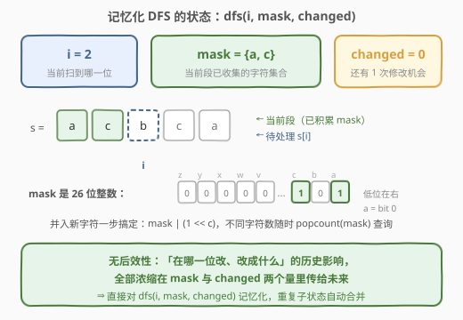
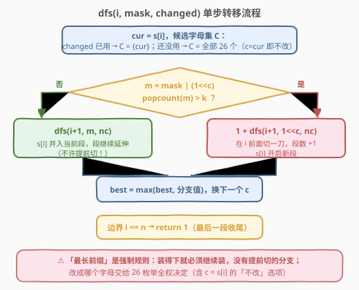
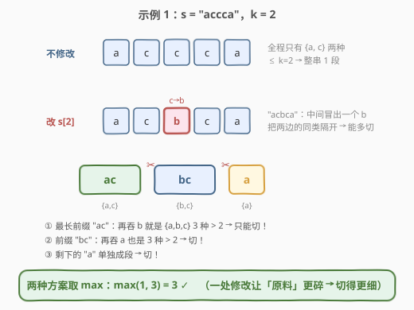

# LeetCode 执行操作后的最大分割数量 题解

## 1. 题目概述

- **标题 / 题号**：执行操作后的最大分割数量（#3003，hard）
- **链接**：https://leetcode.cn/problems/maximize-the-number-of-partitions-after-operations/
- **难度**：困难
- **标签**：位运算、字符串、动态规划、状态压缩、记忆化搜索

**题意**：给定一个字符串 `s` 和一个整数 `k`。

首先，你**最多**可以更改 `s` 中的**一处**下标对应字符为另一个小写英文字母。

之后，执行以下分割操作，直到 `s` 变为**空串**：

- 选择 `s` 的**最长**前缀，该前缀最多包含 `k` 个**不同**字符；
- 从 `s` 中**删除**这个前缀，并将分割数量加一。如果有剩余字符，它们在 `s` 中保持原来的顺序。

返回一个整数，表示在**最多改变一处下标对应字符**的情况下，经过操作后得到的最大分割数。

**示例 1**：

```text
输入：s = "accca", k = 2
输出：3
解释：把 s[2] 改成 b，得到 "acbca"。切分过程："ac" | "bc" | "a"，共 3 段。
```

**示例 2**：

```text
输入：s = "aabaab", k = 3
输出：1
解释：整串只有 2 种字符，改一处最多引入第 3 种，仍然 ≤ 3，
      最长前缀始终是整个串 → 只能切 1 段。
```

**示例 3**：

```text
输入：s = "xxyz", k = 1
输出：4
解释：把 s[0] 改成 w，得到 "wxyz"，4 种字符、k=1 → 4 个单字符段。
```

**约束**：

- $1 \le s.length \le 10^4$
- `s` 只包含小写英文字母
- $1 \le k \le 26$

## 2. 解题思路

### 2.1 暴力思路：枚举 26n 种改法逐一模拟

先理清一个基础事实：**切分过程没有任何选择余地**——「最长前缀」是强制规则，装得下（不同字符 $\le k$）就必须继续装，装不下就必须切。也就是说，**给定最终字符串，切分方式唯一确定**。

于是暴力解法水到渠成：枚举「不改」或「在第 $j$ 位改成 $c$」共 $1 + 25n$ 种方案，对每种方案贪心模拟一遍切分：

```python
def simulate(t, k):          # O(n) 模拟一种方案
    cnt, i, mask = 0, 0, 0
    while i < len(t):
        mask = 0
        while i < len(t) and (mask | 1 << ord(t[i]) - 97).bit_count() <= k:
            mask |= 1 << ord(t[i]) - 97
            i += 1
        cnt += 1
    return cnt
```

总复杂度 $O(26 n^2) \approx 2.6 \times 10^9$，Python 必然超时，C++ 也非常勉强。

> 💡 暴力的浪费是**结构性**的：改第 $j$ 位不影响 $[0, j)$ 已完成的切分；而修改点之后，各方案的局面又很快趋同（差别只剩「当前段攒了哪些字符」和「修改机会用没用」）。大量方案在大量位置上做着重复的后续计算——这是**记忆化搜索**的经典信号。

### 2.2 核心观察：$(i, mask, changed)$ 三元组决定一切



切分规则既然是确定性的，唯一的自由度就是「改哪一位、改成什么」。把搜索过程写成从左往右逐位决策，任一时刻的**全部有效历史**可以压缩成三个量：

| 状态量 | 含义 | 表示 |
|--------|------|------|
| $i$ | 当前处理到 `s` 的第几位 | $0 \le i < n$ |
| $mask$ | 当前段（正在积累、还没切掉的段）已出现的不同字符集合 | 26 位整数，第 $c$ 位为 1 表示字符 $c$ 已出现 |
| $changed$ | 那一次修改机会是否已用掉 | 布尔值 |

**无后效性**：后续能切出多少段，只取决于这三个量——「在哪一位改、改成了什么」对未来的影响，**全部通过 $mask$ 和 $changed$ 传导**，具体路径无关紧要。于是：

$$dfs(i, mask, changed) = \text{从 } i \text{ 到末尾（含当前段）能取得的最大分割数}$$

答案即 $dfs(0, 0, False)$。

用 26 位整数表示 $mask$ 还白送两个 $O(1)$ 操作：并入新字符 `mask | (1 << c)`，查询不同字符数 `popcount(mask)`——**状态压缩天然适配本题**。

### 2.3 算法流程：记忆化 DFS



处理 $s[i]$ 时，枚举它**实际呈现**的字符 $c$：

- 若 $changed = True$：只能 $c = s[i]$（真实字符）；
- 若 $changed = False$：$c$ 可取全部 26 个字母——$c = s[i]$ 即「不在此处改」，$c \ne s[i]$ 即「在此处消耗修改机会」。

记 $m = mask \mid (1 \ll c)$，分两种情况：

- **装得下**（$\mathrm{popcount}(m) \le k$）：$s[i]$ 并入当前段，转移到 $dfs(i+1, m, changed')$。注意**没有「提前切一刀」的分支**——「最长前缀」是题目强制的贪心规则；
- **装不下**（$\mathrm{popcount}(m) > k$）：当前段在 $i$ 之前终结，段数 $+1$，$s[i]$ 开启新段：转移到 $1 + dfs(i+1, 1 \ll c, changed')$。

边界：$i = n$ 时返回 $1$——最后一段（必然非空）也要被删除计数。为什么切分计数不在段开启时打、而在「下一段首字符触发溢出」时打？因为这样代码只需一个统一的转移式，最后一段的计数恰好由边界 `return 1` 兜住，无需特判。

> ⚠️ 有个容易忽略的**正确性陷阱**：「提前切分」看似可能切出更多段（例如 `"abab", k=2` 若允许提前切可切 `[a][b][ab]` 三段），但题目规定每次必须取**最长**前缀，提前切是非法操作。DFS 中装得下时只走「并入」一个分支，正是在忠实执行这条规则。

### 2.4 示例演算



以示例 1 `s = "accca", k = 2` 为例，走一遍最优路径的关键转移（$mask$ 用字符集示意）：

| 步骤 | 状态 | 决策 | 结果 |
|------|------|------|------|
| $i=0$ | $(0, \{\}, F)$ | $s[0]=a$，取 $c=a$ | $dfs(1, \{a\}, F)$ |
| $i=1$ | $(1, \{a\}, F)$ | $s[1]=c$，取 $c=c$ | $dfs(2, \{a,c\}, F)$ |
| $i=2$ | $(2, \{a,c\}, F)$ | $s[2]=c$，**改 $c \to b$**：$\{a,c,b\}=3 > 2$ 装不下 | $1 + dfs(3, \{b\}, T)$ **切第 1 刀** |
| $i=3$ | $(3, \{b\}, T)$ | $s[3]=c$ 只能原样：$\{b,c\} \le 2$ | $dfs(4, \{b,c\}, T)$ |
| $i=4$ | $(4, \{b,c\}, T)$ | $s[4]=a$：$\{a,b,c\}=3 > 2$ 装不下 | $1 + dfs(5, \{a\}, T)$ **切第 2 刀** |
| $i=5$ | 边界 | — | `return 1`（"a" 段收尾） |

合计 $1 + 1 + 1 = 3$ ✓。对照「不修改」路线：$mask$ 全程 $\{a,c\}$ 永不溢出，$dfs$ 一路滑到边界返回 1，取 $\max(1, 3) = 3$。

## 3. 参考代码

### C++

```cpp
class Solution {
  public:
    int maxPartitionsAfterOperations(string s, int k) {
        int n = s.size();
        vector<char> str(n);
        for (int i = 0; i < n; i++) str[i] = s[i] - 'a';

        // key = i<<27 | mask<<1 | changed，用哈希表而非数组（mask 达 2^26 开不了数组）
        unordered_map<long long, int> memo;
        memo.reserve(1 << 16);
        function<int(int, int, bool)> dfs = [&](int i, int mask, bool changed) -> int {
            if (i == n) return 1;                       // 最后一段收尾计数
            long long key = ((long long)i << 27) | ((long long)mask << 1) | (long long)changed;
            auto it = memo.find(key);
            if (it != memo.end()) return it->second;

            int cur = str[i];
            int best = 0;
            int from = changed ? cur : 0, to = changed ? cur : 25;  // 已改过就只能原样
            for (int c = from; c <= to; c++) {
                bool nc = changed || c != cur;          // c != cur 即消耗修改机会
                int m = mask | (1 << c);
                int r = __builtin_popcount(m) > k
                            ? 1 + dfs(i + 1, 1 << c, nc)   // 装不下：切一刀，s[i] 开新段
                            : dfs(i + 1, m, nc);           // 装得下：并入（不许提前切）
                best = max(best, r);
            }
            memo[key] = best;
            return best;
        };
        return dfs(0, 0, false);
    }
};
```

### Python

```python
class Solution:
    def maxPartitionsAfterOperations(self, s: str, k: int) -> int:
        sys.setrecursionlimit(10 ** 5)      # 递归深度可达 n = 10^4
        n = len(s)
        nums = [ord(c) - 97 for c in s]

        @cache
        def dfs(i: int, mask: int, changed: bool) -> int:
            if i == n:
                return 1                    # 最后一段收尾计数
            cur = nums[i]
            best = 0
            for c in ((cur,) if changed else range(26)):
                nc = changed or c != cur    # c != cur 即消耗修改机会
                m = mask | (1 << c)
                if m.bit_count() > k:       # 装不下：切一刀，s[i] 开新段
                    best = max(best, 1 + dfs(i + 1, 1 << c, nc))
                else:                       # 装得下：并入（不许提前切）
                    best = max(best, dfs(i + 1, m, nc))
            return best

        return dfs(0, 0, False)
```

> 💡 两个实现细节：一是 `changed=True` 时候选集收缩为 1 个字符——修改机会用掉后搜索不再分叉，这是状态数可控的关键之一；二是 $mask$ 理论上可达 $2^{26}$，无法开数组，C++ 用哈希表、Python 直接用 `@cache`（元组键自动处理）。

## 4. 复杂度分析

| 维度 | 复杂度 | 说明 |
|------|--------|------|
| 时间复杂度 | 均摊 $O(S)$，$S$ 为**可达**状态数 $\times$ 26 | 可达状态数远小于理论值（见下），实测 $n = 10^4$ 时 C++ 约 $0.1\sim0.9$ s、Python 约 $0.3\sim1$ s |
| 空间复杂度 | $O(S)$ | 记忆化表与递归栈深度 $O(n)$ |

**为什么可达状态数远小于 $n \cdot 2^{26}$ 的朴素上界？**三条结构性约束在起作用：

1. **未改主链只有一条**：$changed = False$ 的路径无分叉（不消耗机会时 $mask$ 由 $i$ 唯一决定），仅贡献 $O(n)$ 个状态；
2. **改完之后不再分叉**：$changed = True$ 的每条链是确定性的（候选只剩 1 个字符），搜索树呈「一条主链 + 26n 条线性尾巴」的形态；
3. **尾巴之间大量合并**：不同 $(j, c')$ 修改方案的链在 $(i, mask)$ 相同时被 memo 合并——而 $mask$ 是「当前段字符集」，取值受段长与 26 字母的强约束。

理论最坏上界仍可证为 $O(26 n^2)$ 量级，但实际数据（包括 26 字母均匀随机、全字母循环等对抗性构造）下状态数只有数十万级，两个语言都能稳定通过。

## 5. 扩展：严格 $O(26\,n\log n)$ 的官方解法

若追求确定性复杂度，官方提示给出了另一种拆法——**离线预处理 + 逐点枚举**：

- 不做任何修改，预处理三个数组：$pref[i]$（$s[0:i]$ 的分割数）、$suff[i]$（$s[i:n]$ 的分割数）、$partition\_start[i]$（不修改时第 $i$ 位所在段的起点）；
- 枚举修改位置 $i$ 与替换字符 $c$（26 种），修改只影响「包含 $i$ 的那一段」：在该段起点处重新积累字符集，**二分**找到最远右端点 $r$（使 $[partition\_start[i], r]$ 不同字符数 $\le k$）；
- 若 $r \ge i$：答案为 $1 + pref[partition\_start[i] - 1] + suff[r + 1]$；否则修改字符反而提前断段，需要再找一段 $[r, r_2]$，答案为 $2 + pref[\cdots] + suff[r_2 + 1]$；
- 所有 $(i, c)$ 取最大值。

该做法把「一次修改的扰动范围」精确隔离到常数段，代价是实现精巧、边界繁多（尤其 $r < i$ 的第二段拼接）。两相对比：记忆化 DFS 把聪明留给状态设计、代码极简；官方做法把聪明留给预处理、复杂度可控——面试中推荐先写前者，再口述后者作为复杂度优化方向。

## 6. 面试要点

1. **为什么说切分过程是确定性的？「贪心」体现在哪？**

   - 「选择最长前缀」是规则而非策略：前缀能延伸（不同字符 $\le k$）就必须延伸，装不下必须切，全程没有决策点；
   - 因此整道题唯一的自由度只剩「改哪一位、改成什么」，这正是暴力枚举的对象，也是状态设计的切入口。

2. **为什么状态只需 $(i, mask, changed)$ 三个量？怎么论证无后效性？**

   - 未来切分只依赖「接下来扫到哪、当前段已有哪些字符、还能不能改」；
   - 修改的影响完全体现在两处：某步并入 $mask$ 的位不同（改成什么）、$changed$ 翻转（在哪改）——历史其余细节对未来不可见，满足马尔可夫性，可放心记忆化。

3. **「装得下」时为什么不允许提前切一刀？切了会不会更多？**

   - 提前切确实可能产生更多段（如 `"abab", k=2`），但题目强制取**最长**前缀，提前切是非法操作；
   - 记忆化 DFS 忠实编码规则：$popcount \le k$ 时只有「并入」一个后继。这也是本题与 2405（最少划分，贪心延伸）方向相反、但共用「k 个不同字符」约束的有趣对照。

4. **边界 `i == n` 为什么返回 1 而不是 0？**

   - 递归推进到边界时，当前段至少含一个字符（最后一段的首字符已并入），按规则它也要被删除计数；
   - 采用「下一段首字符触发溢出时给上一段计数」的约定后，最后一段没有后继来触发，恰好由边界兜底，全程无需特判空段（$n \ge 1$ 保证初始 $mask = 0$ 只出现在第 0 步之前）。

5. **记忆化为什么真的快？有哪些实现层面的坑？**

   - 结构上：未改主链不分叉、改后链不分叉、不同修改方案的链在相同 $(i, mask)$ 处合并，可达状态远小于 $26 n^2$；
   - 坑一：递归深度 $O(n) = 10^4$，Python 必须 `setrecursionlimit`；坑二：$mask$ 值域 $2^{26}$ 开不了数组，C++ 用哈希表并手动打包 key（`i<<27 | mask<<1 | changed`）；坑三：`popcount` 选内建函数（`__builtin_popcount` / `int.bit_count`），别手写循环。

## 同类练习题

| # | 题目 | 与本题的关联 |
|---|------|-------------|
| 2405 | [子字符串的最优划分](https://leetcode.cn/problems/optimal-partition-of-string/)（[题解](../2401-2500/2405_子字符串的最优划分.md)） | 无修改版的「k 个不同字符」前缀切分（求最少段，方向相反），本题的退化骨架 |
| 340 | [至多包含 K 个不同字符的最长子串](https://leetcode.cn/problems/longest-substring-with-at-most-k-distinct-characters/)（[题解](../0301-0400/340_至多包含K个不同字符的最长子串.md)） | 滑窗视角维护同一约束，理解「最长前缀」的贪心本质 |
| 2516 | [每种字符至少取 K 个](https://leetcode.cn/problems/take-k-of-each-character-from-left-and-right/)（[题解](../2501-2600/2516_每种字符至少取K个.md)） | 字符计数 + 窗口/双指针的综合运用，同族字符集约束题 |
| 526 | [优美的安排](https://leetcode.cn/problems/beautiful-arrangement/)（[题解](../0501-0600/526_优美的排列.md)） | 位掩码记忆化搜索入门范本，体会「集合压进 int」的甜区 |
| 1434 | [每个人戴不同帽子的方案数](https://leetcode.cn/problems/number-of-ways-to-wear-different-hats-to-each-other/) | bitmask 作为状态主维度的进阶设计，与本题的 `mask \| (1<<c)` 一脉相承 |
