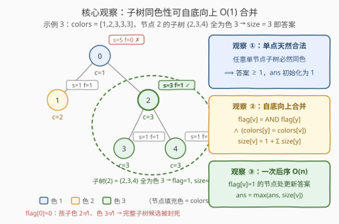
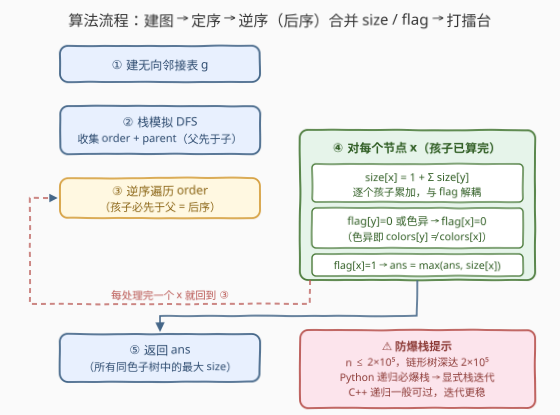
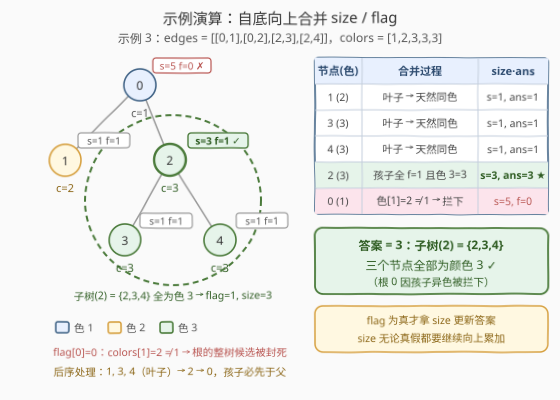

# 相同颜色的最大子树

- **题目名称**：相同颜色的最大子树
- **链接**：[3004. 相同颜色的最大子树](https://leetcode.cn/problems/maximum-subtree-of-the-same-color/)
- **难度**：中等
- **标签**：树、深度优先搜索、数组、动态规划、树形 DP

## 1. 题目概述

> ⚠️ 本题为 LeetCode 付费题，题意描述根据官方示例用例与 hints 重建，可能与官方题面有出入。

有一棵 $n$ 个节点的无向树，节点编号 $0$ 到 $n-1$，根节点为 $0$。`edges` 给出全部 $n-1$ 条边（`edges[i] = [u_i, v_i]` 表示 $u_i$ 与 $v_i$ 之间有一条边）；另有长度为 $n$ 的数组 `colors`，`colors[i]` 是节点 $i$ 的颜色。

节点 $v$ 的**子树**由 $v$ 自身及其**全部后代**构成。如果一棵子树内**所有节点的颜色都相同**，就称它是一棵**同色子树**。返回所有同色子树中**节点数的最大值**。

**示例 1**：

```text
输入：edges = [[0,1],[0,2],[0,3]], colors = [1,1,2,3]
输出：1
解释：根 0 的子树 {0,1,2,3} 颜色为 1,1,2,3，不是同色子树；
     每个单节点子树天然同色，最大只能取到 1。
```

**示例 2**：

```text
输入：edges = [[0,1],[0,2],[0,3]], colors = [1,1,1,1]
输出：4
解释：整棵树全为颜色 1，根的子树（4 个节点）就是最大的同色子树。
```

**示例 3**：

```text
输入：edges = [[0,1],[0,2],[2,3],[2,4]], colors = [1,2,3,3,3]
输出：3
解释：节点 2 的子树 {2,3,4} 全为颜色 3，共 3 个节点；
     根 0 的子树含颜色 1,2,3,3,3，不同色，不能作为候选。
```

**约束条件**（据示例与官方 hints 重建）：

- $n = \text{len(colors)}$，$2 \le n \le 2 \times 10^5$
- $\text{len(edges)} = n - 1$
- $0 \le u_i, v_i < n$
- $1 \le \text{colors}[i] \le 10^5$
- 输入保证 `edges` 构成一棵合法的树

> 💡 一句话：**子树同色性是可以自底向上合并的局部信息**——`flag`（是否同色）沿父子边做 AND、`size`（节点数）做加法，一次后序 DFS 就能拿到全局最优，是最朴素的**树形 DP**。

---

## 2. 解题思路

### 2.1 暴力思路：逐点整棵检查

枚举每个节点 $v$，DFS 整棵以 $v$ 为根的子树，检查是否全部同色并统计节点数，取最大值。单次检查 $O(n)$，总量 $O(n^2)$：链形树下每个点的检查都要走 $O(n)$，$n = 2\times10^5$ 时约 $4\times10^{10}$ 步，完全不可行。

关键浪费在于：**父子两棵子树的信息几乎完全重叠**——子树$(v)$ 是否同色，比子树$(y)$（$y$ 是 $v$ 的孩子）是否同色只多出「$\text{colors}[y]$ 是否等于 $\text{colors}[v]$」这一步判断。逐点独立检查等于把同一份信息沿深度重复算了 $O(\text{深度})$ 遍。要让信息**只算一次、逐层复用**，就得倒过来：自底向上合并。

### 2.2 核心观察：flag + size 自底向上合并

**观察 ①（单点天然合法）**：任意单节点子树必然同色，所以答案至少是 1，可把 `ans` 初始化为 1（或交给叶子去更新）。

**观察 ②（同色性满足最优子结构）**：定义 $\text{flag}[v]$ 表示「以 $v$ 为根的子树是否全部同色」。由于子树$(v) = \{v\} \cup \bigcup_y \text{子树}(y)$，一块集合整体同色当且仅当**每一块内部同色且每块根的颜色等于 $\text{colors}[v]$**：

$$\text{flag}[v] = \Big(\bigwedge_{y}\ \text{flag}[y]\Big) \wedge \Big(\bigwedge_{y}\ \text{colors}[y] = \text{colors}[v]\Big)$$

同时顺手维护子树大小：

$$\text{size}[v] = 1 + \sum_{y} \text{size}[y]$$

**观察 ③（合法即候选）**：$\text{flag}[v] = 1$ 时，以 $v$ 为根的整棵子树就是一个合法同色子树，用 $\text{size}[v]$ 更新答案。一次后序遍历处理完所有节点，每条边只参与一次合并。



> 💡 一句话：**flag 做 AND、size 做加法**，两份子树信息在后序回溯时一次合并；flag 为真的节点处拿 size 打擂台。这正是官方 hint 所说的 `flag[v]` 定义——孩子 flag 为假或颜色异于自己，父亲的 flag 随之变假。

### 2.3 算法流程图



**完整步骤**：

1. 由 `edges` 建**无向**邻接表 `g`；
2. 从根 0 出发用**显式栈** DFS，收集先序数组 `order`（父必先于子）及 `parent` 数组；
3. **逆序遍历** `order`（孩子必先于父处理，天然等价于后序）；
4. 对每个节点 $x$：把每个孩子 $y$ 的 `size[y]` 累加进 `size[x]`；只要有孩子 `flag[y] = 0` 或 $\text{colors}[y] \ne \text{colors}[x]$，就把 `flag[x]` 置 0；若 `flag[x]` 仍为 1，用 `size[x]` 更新 `ans`；
5. 返回 `ans`。

### 2.4 示例演算

以示例 3 为例：`edges = [[0,1],[0,2],[2,3],[2,4]]`，`colors = [1,2,3,3,3]`，后序处理顺序为 $1, 3, 4, 2, 0$：

| 步 | 节点(色) | 合并过程 | size | flag | ans |
|:--:|:--:|:--|:--:|:--:|:--:|
| 1 | 1 (2) | 叶子，天然同色 | 1 | 1 | 1 |
| 2 | 3 (3) | 叶子，天然同色 | 1 | 1 | 1 |
| 3 | 4 (3) | 叶子，天然同色 | 1 | 1 | 1 |
| 4 | 2 (3) | 孩子全 flag=1 且色 3=3 | 3 | 1 | **3** |
| 5 | 0 (1) | colors[1]=2 ≠ 1 → 拦下 | 5 | 0 | 3 |

答案 $3$ ✓（子树 $\{2,3,4\}$）。



示例 1 同法：根 0 的孩子 1 同色（色 1），但孩子 2、3 异色 → `flag[0] = 0`，答案停在 1；示例 2 全树同色，`flag[0] = 1`、`size[0] = 4`，答案 4。

---

## 3. 参考代码

### C++

```cpp
class Solution {
public:
    int maximumSubtreeSize(vector<vector<int>>& edges, vector<int>& colors) {
        int n = colors.size();
        vector<vector<int>> g(n);
        for (auto& e : edges) {
            g[e[0]].push_back(e[1]);
            g[e[1]].push_back(e[0]);
        }

        vector<int> size(n, 1), flag(n, 1), vis(n);
        int ans = 1;
        // dfs(x)：计算以 x 为根的子树大小，同时维护 flag[x] = 子树是否全部同色
        function<void(int)> dfs = [&](int x) {
            vis[x] = 1;
            for (int y : g[x]) {
                if (vis[y]) continue;                    // 无向边：父节点已访问，跳过
                dfs(y);
                size[x] += size[y];
                if (!flag[y] || colors[y] != colors[x])  // 孩子子树杂色 / 颜色异于自己
                    flag[x] = 0;
            }
            if (flag[x]) ans = max(ans, size[x]);        // 同色子树 → 候选
        };
        dfs(0);
        return ans;
    }
};
```

### Python

```python
class Solution:
    def maximumSubtreeSize(self, edges: List[List[int]], colors: List[int]) -> int:
        n = len(colors)
        g = [[] for _ in range(n)]
        for a, b in edges:
            g[a].append(b)
            g[b].append(a)

        # ① 显式栈先序收集 order（父先于子），记录 parent
        order, parent = [], [-1] * n
        stack = [0]
        while stack:
            x = stack.pop()
            order.append(x)
            for y in g[x]:
                if y != parent[x]:
                    parent[y] = x
                    stack.append(y)

        # ② 逆序遍历 = 后序（孩子必先于父），自底向上合并 size / flag
        size = [1] * n
        flag = [True] * n
        ans = 1
        for x in reversed(order):
            for y in g[x]:
                if y == parent[x]:
                    continue
                size[x] += size[y]
                if not flag[y] or colors[y] != colors[x]:
                    flag[x] = False
            if flag[x]:
                ans = max(ans, size[x])
        return ans
```

> 💡 两版逻辑一致。注意三点：① 建的是**无向**邻接表，遍历时用「已访问 / 父节点」跳过来路；② `size` 初始化为 1（算上自己）、`flag` 初始化为真，**叶子无需特判**——没有孩子时公式自然退化成单点合法；③ $n \le 2\times10^5$，链形树深达 $2\times10^5$，**Python 版刻意用显式栈迭代**防 `RecursionError`；C++ 递归一般也能过，介意栈深时可套用 Python 的「先序收集 + 逆序处理」两段式。

---

## 4. 复杂度分析

| 维度 | 复杂度 | 说明 |
|------|--------|------|
| **时间复杂度** | $O(n)$ | 建图 $O(n)$；DFS 每个节点进出一次，对孩子的 size/flag 合并均摊到每条边恰好一次，总计线性 |
| **空间复杂度** | $O(n)$ | 邻接表 $O(n)$ + `order`/`parent`/`size`/`flag` 数组 $O(n)$；递归版另有 $O(h)$ 调用栈（链形树退化为 $O(n)$） |

---

## 5. 扩展：为什么不能改成「最大同色连通块」？

一个貌合神离的错误简化：把**两端颜色相同的边**保留、其余边删掉，再取最大连通块的大小。反例：

```text
colors = [1,2,1]，edges = [[0,1],[1,2]]（0-1-2 链，根为 0）
```

候选只有完整子树：$\{0,1,2\}$ 色 $1,2,1$ ✗、$\{1,2\}$ 色 $2,1$ ✗、$\{2\}$ 色 $1$ ✓，答案应为 **1**；而任何「同色连通块」式的做法都无法给出正确框架——节点 0 与节点 2 同色但**并不相邻**。

本质区别在于：本题的合法解被严格限定为「某节点 $v$ **及其全部后代**」的**完整子树**，既不能中途截断，也不能绕过中间节点。因此 `flag` 的语义是「这棵完整子树整体同色与否」，它沿父子边向上做 AND——一旦某处异色，这条祖先链上的 `flag` 全部封死（官方 hint 第二条），但 `size` 仍要继续正确维护，供更上层的候选使用。若题目真的改成「最大同色连通块」，做法反而换成并查集 / DFS 连通块统计，与本解法只有「遍历树」这一步形似。

顺带一提，`flag`（布尔 AND）+ `size`（计数求和）这对聚合是「**子树信息合并**」家族的最简成员：2925 的 $\min$ 聚合、968 监控二叉树的多状态聚合、834 的换根两次遍历，骨架都是「后序自底向上、按孩子状态聚合」。

> ⚠️ 把「子树」误读成「连通块」时示例 2、3 可能侥幸通过（整体同色 / 恰好是连通块），链形反例必挂——审题时务必抠住「子树 = $v$ 及其全部后代」这一定义。

---

## 6. 面试要点

1. **为什么 flag 和 size 能逐层 O(1) 合并？**

   - 子树$(v) = \{v\} \cup \bigcup_y$ 子树$(y)$ 是**划分**：整块同色 ⟺ 每块内部同色（$\text{flag}[y]=1$）且每块根颜色等于 $\text{colors}[v]$。这是集合划分上的平凡等价，不需要任何附加条件。

2. **暴力 $O(n^2)$ 浪费在哪，如何消除？**

   - 父子子树的信息只差一层颜色判断，逐点独立检查把同一份信息沿深度重复计算 $O(\text{深度})$ 遍。改成后序自底向上，每条边只参与一次合并，复杂度降到 $O(n)$。

3. **flag 一旦变 0，size 还需要继续维护吗？**

   - 需要。`flag[v]=0` 只封死「以 $v$ 为根的完整子树」这一个候选，但 $v$ 的 `size` 仍会被祖先累加，去支撑更高处合法候选的计数——两份信息语义解耦，各走各的聚合通道。

4. **$n$ 达 $2\times10^5$，实现上有什么坑？**

   - 链形树递归深 $2\times10^5$：Python 默认递归上限 1000 直接 `RecursionError`，用「显式栈先序收集 order + 逆序处理」两段式最稳；C++ 递归通常能过，主动给出迭代版是加分项。

5. **与 1519（子树中标签相同的节点数）是什么关系？**

   - 同为「后序合并子树聚合信息」：1519 对每个节点统计子树内**同标签的个数**（计数版），本题只需一个布尔 `flag`（判定版），可视作其简化版。两者都能推广成「子树内满足某性质的极值 / 计数」通用模板。

> 💡 **一句话总结**：同色性是可合并的子树局部信息——flag 沿父子边做 AND、size 做加法，一次后序遍历，flag 为真处拿 size 打擂台；大 $n$ 记得迭代防爆栈。

---

## 7. 同类练习题

- [1519. 子树中标签相同的节点数](https://leetcode.cn/problems/number-of-nodes-in-the-sub-tree-with-the-same-label/)（[题解](../1501-1600/1519_带给定标签的二叉树中的节点数.md)）：同款「后序合并子树聚合信息」的计数加强版，本题 flag 的近亲
- [1443. 收集树上所有苹果的最少时间](https://leetcode.cn/problems/minimum-time-to-collect-all-apples-in-a-tree/)（[题解](../1401-1500/1443_收集树上所有苹果的最小时间.md)）：布尔 flag（子树是否含苹果）沿父子边向上传播的同款套路
- [2925. 在树上执行操作以后得到的最大分数](https://leetcode.cn/problems/maximum-score-after-applying-operations-on-a-tree/)（[题解](../2901-3000/2925_在树上执行操作以后得到的最大分数.md)）：后序树形 DP 的 $\min$ 聚合版，附同一套「先序收集 + 逆序处理」迭代防爆栈写法
- [543. 二叉树的直径](https://leetcode.cn/problems/diameter-of-binary-tree/)（[题解](../0501-0600/543_二叉树的直径.md)）：后序 DFS 自底向上合并子树信息的热身模板
