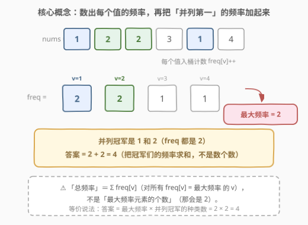
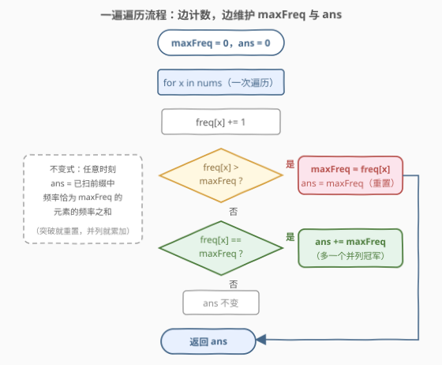
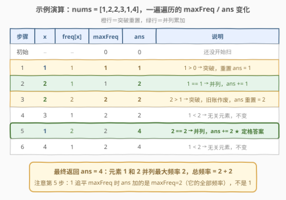

# 最大频率元素计数

- **题目名称**：最大频率元素计数
- **链接**：[3005. 最大频率元素计数](https://leetcode.cn/problems/count-elements-with-maximum-frequency/)
- **难度**：简单
- **标签**：数组、哈希表、计数

## 1. 题目概述

给你一个由**正整数**组成的数组 `nums`。元素的**频率**是指该元素在数组中出现的次数。

返回 `nums` 中所有具有**最大**频率的元素的**总频率**——即：设最大频率为 $f_{\max}$，答案是 $\sum_{v} \text{freq}[v]$，其中求和只遍历满足 $\text{freq}[v] = f_{\max}$ 的元素 $v$。

**示例 1**：

```text
输入：nums = [1,2,2,3,1,4]
输出：4
解释：元素 1 和 2 的频率为 2，是数组中的最大频率。
     频率等于 2 的元素共两个（1 和 2），总频率 = 2 + 2 = 4。
```

**示例 2**：

```text
输入：nums = [1,2,3,4,5]
输出：5
解释：所有元素的频率均为 1，都是最大频率，总频率 = 1×5 = 5。
```

**约束条件**：

- $1 \le \text{nums.length} \le 100$
- $1 \le \text{nums}[i] \le 100$

> ⚠️ 读题陷阱：「总频率」是**频率之和**而不是**元素个数**。示例 1 里并列冠军有 2 个，但答案是 4 不是 2。等价公式：答案 $= f_{\max} \times \#\{v : \text{freq}[v] = f_{\max}\}$。

---

## 2. 解题思路

### 2.1 暴力思路

对每个元素 `x`，内层重扫一遍数组数出它（作为值）的出现次数，记为 `freq[x]`；再取所有频率的最大值 `maxF`，把等于 `maxF` 的频率加起来。时间 $O(n^2)$、空间 $O(1)$。$n \le 100$ 时约 $10^4$ 次比较，能过，但两次扫描的写法既慢又丑，面试应该给出线性做法。

### 2.2 核心观察：哈希计数 + 最大频率求和



问题天然分两步：

1. **统计频率**：一遍扫描，`freq[v]++`，用哈希表（或值域数组）做键值计数，$O(n)$。
2. **求和**：先求 $f_{\max} = \max(\text{freq})$，再把所有等于 $f_{\max}$ 的频率累加。

> 💡 **为什么计数不用排序**：我们只关心「频率的最大值」和「频率等于最大值的项」，与元素本身的顺序无关——哈希计数恰好丢弃顺序、只留频次，正中要害。排序反而多花 $O(n \log n)$。

由约束 $1 \le \text{nums}[i] \le 100$ 可知值域极小，用长度 101 的数组当计数桶，比哈希表更省开销（见第 5 节）。

### 2.3 进阶：一遍遍历同步维护 maxFreq 与 ans



两遍扫描已经够了，但可以在**同一次遍历**里顺手把答案维护出来，少一次对哈希表的遍历。维护两个变量：

- `maxFreq`：目前已扫前缀中的最大频率；
- `ans`：目前已扫前缀中，频率恰为 `maxFreq` 的元素的频率之和。

每步 `freq[x] += 1` 之后只有三种情况：

| 情况 | 判定 | 动作 | 直觉 |
|------|------|------|------|
| **突破** | `freq[x] > maxFreq` | `maxFreq = freq[x]; ans = maxFreq` | 旧的并列冠军集团整体降级，目前**只有 x** 达到新王频率，答案重置 |
| **并列** | `freq[x] == maxFreq` | `ans += maxFreq` | 冠军集团多一个成员，贡献它的全部频率 `maxFreq` |
| **无关** | `freq[x] < maxFreq` | 什么都不做 | 它还差得远 |

> 💡 **不变式**：任意时刻 `ans` = 已扫前缀中频率恰为 `maxFreq` 的元素的频率之和。突破时旧账全部作废（没有任何元素的旧频率还能追上新的 `maxFreq`，除了刚刚突破的 x 自己），所以直接重置；并列时新成员带来恰好 `maxFreq` 的增量。遍历结束，不变式右端就是题目所求。

> ⚠️ 易错点：并列时加的是 `maxFreq`（该元素的**全部**频率），不是 1（不是「多了一个元素」）。`ans` 语义是频率之和，始终按频率记账。

### 2.4 示例演算



以 `nums = [1,2,2,3,1,4]` 走一遍 2.3 的一遍遍历：

| 步骤 | x | freq[x] | maxFreq | ans | 说明 |
|------|---|---------|---------|-----|------|
| 初始 | − | − | 0 | 0 | 还没开始扫 |
| 1 | 1 | 1 | **1** | **1** | $1 > 0$ 突破，重置 `ans = 1` |
| 2 | 2 | 1 | 1 | **2** | $1 = 1$ 并列，`ans += 1` |
| 3 | 2 | 2 | **2** | **2** | $2 > 1$ 突破，旧账作废，`ans` 重置为 2 |
| 4 | 3 | 1 | 2 | 2 | $1 < 2$ 无关，不变 |
| 5 | 1 | 2 | 2 | **4** | $2 = 2$ 并列，`ans += 2` ★ |
| 6 | 4 | 1 | 2 | 4 | $1 < 2$ 无关，不变 |

最终 `ans = 4`，与示例 1 一致。注意第 3 步：元素 2 突破后，之前元素 1 攒下的 `ans = 2` 作废——因为它此刻频率只有 1，不再站在冠军集团里；到第 5 步它追平才重新入账。

---

## 3. 参考代码

### C++（值域数组 + 一遍遍历）

```cpp
class Solution {
  public:
    int maxFrequencyElements(vector<int>& nums) {
        int freq[101] = {0};            // 1 <= nums[i] <= 100，值域桶当哈希
        int maxFreq = 0, ans = 0;
        for (int x : nums) {
            ++freq[x];
            if (freq[x] > maxFreq) {    // 突破：旧的并列集团整体作废
                maxFreq = freq[x];
                ans = maxFreq;          // 此刻只有 x 达到新 maxFreq
            } else if (freq[x] == maxFreq) {
                ans += maxFreq;         // 并列：新冠军贡献全部频率
            }
        }
        return ans;
    }
};
```

### Python（两遍写法 + 一遍写法）

两遍写法（`Counter` 惯用法，可读性最好）：

```python
class Solution:
    def maxFrequencyElements(self, nums: List[int]) -> int:
        freq = Counter(nums)
        max_freq = max(freq.values())
        return sum(f for f in freq.values() if f == max_freq)
```

一遍写法（与 C++ 版逻辑一致，天然支持流式输入）：

```python
class Solution:
    def maxFrequencyElements(self, nums: List[int]) -> int:
        freq = Counter()
        max_freq = ans = 0
        for x in nums:
            freq[x] += 1
            if freq[x] > max_freq:      # 突破：重置
                max_freq = freq[x]
                ans = max_freq
            elif freq[x] == max_freq:   # 并列：累加
                ans += max_freq
        return ans
```

> 💡 两遍版先 `max` 再筛选，语义与定义逐字对应，适合当「保底正确」的参考实现；一遍版把两步折叠进同一个循环，是面试的加分写法。两者复杂度同阶。

---

## 4. 复杂度分析

| 维度 | 复杂度 | 说明 |
|------|--------|------|
| 时间复杂度 | $O(n + U)$ | 遍历数组 $O(n)$；值域桶版初始化/扫描桶 $O(U)$，$U = 101$；哈希版直接 $O(n)$ |
| 空间复杂度 | $O(U)$ | 计数结构大小，$U = \min(n, 101)$；值域桶恒为 101，哈希表不超过不同元素个数 |

其中 $n = \text{len(nums)}$，$U$ 为值域大小。$n \le 100$ 下一切写法都绰绰有余；若 $n$ 放大到 $10^6$ 级，线性一遍遍历依然稳。

---

## 5. 扩展：值域桶 vs 哈希表，以及流式场景

**值域桶**：当值域是 $[1, C]$ 且 $C$ 很小（本题 $C = 100$）时，`int freq[C+1]` 数组比哈希表更快——无哈希计算、无冲突、缓存友好。这是**桶计数**思想的最小应用，与 [2965. 找出缺失和重复的数字](https://leetcode.cn/problems/find-missing-and-repeated-values/)、[448. 找到所有数组中消失的数字](../0401-0500/448_找到所有数组中消失的数字.md) 一脉相承。当值域大到 $10^9$ 或为负数/字符串时，退化用哈希表。

**流式 / 在线版本**：一遍遍历法的妙处在于它**不需要第二遍**——数据以流的形式到来，每个元素处理完即可丢弃，`ans` 随时是「当前所见数据的答案」。两遍写法做不到这一点（必须等全部数据到齐再扫一遍频率表）。面试被追问「数据流怎么办」时，这就是标准答案。

**公式化**：答案 $= f_{\max} \times \#\{v : \text{freq}[v] = f_{\max}\}$。若题目改问「并列冠军有几个」，只需把一遍遍历中「并列」分支改为 `cnt += 1`、「突破」分支改为 `cnt = 1`，最后返回 `cnt`。

---

## 6. 面试要点

1. **为什么 `freq[x] > maxFreq` 时 `ans` 直接重置为 `maxFreq`，不怕丢信息？**

   - 突破意味着新王登基：此刻**只有 x** 的频率等于新的 `maxFreq`，其他所有元素频率都严格更小，旧的 `ans` 对应的冠军集团已整体降级。历史账目不会「复活」——其他元素的频率只能通过自己再次出现而增加，真追平时会走「并列」分支重新入账。

2. **一遍遍历算法的不变式是什么？为什么遍历结束就能直接返回 `ans`？**

   - 不变式：`ans` = 已扫前缀中频率恰为 `maxFreq` 的元素的频率之和。三个分支各自保持不变式；遍历结束时「已扫前缀」就是整个数组，不变式右端即题目定义的答案。

3. **并列分支加 `maxFreq` 还是加 1？**

   - 加 `maxFreq`。`ans` 按**频率**记账：新并列成员的全部频率都是 `maxFreq`，入账 `maxFreq`；加 1 是把 `ans` 当成「元素个数」记，语义就错了（那是另一个问题，见第 5 节的公式化变体）。

4. **值域数组和哈希表怎么选？**

   - 值域小且为非负整数（如 $[1, 100]$）→ 数组桶，省哈希开销；值域大、稀疏或键非整数 → 哈希表。本题两者皆可，数组版略快且代码更短。

5. **和 [347. 前 K 个高频元素](https://leetcode.cn/problems/top-k-frequent-elements/) 的关系？**

   - 同属「哈希计数 + 按频率聚合」家族：本题只取频率的**最大值层**求和，是最简特例；347 要取频率前 K 大的所有元素，计数之后还需桶排序或堆。先会本题，再上 347/692 的 Top-K。

---

## 7. 同类练习题

- [347. 前 K 个高频元素](https://leetcode.cn/problems/top-k-frequent-elements/)：计数后按频率取前 K（桶排序/堆），本题的 Top-K 泛化
- [2404. 出现最频繁的偶数元素](https://leetcode.cn/problems/most-frequent-even-element/)：同样计数取最大频率，但并列时要按值取最小，考察并列时的 tie-break
- [1636. 按照频率将数组升序排序](https://leetcode.cn/problems/sort-array-by-increasing-frequency/)：频率当排序键，计数 + 自定义比较的同族题
- [1128. 等价多米诺骨牌对的数量](https://leetcode.cn/problems/number-of-equivalent-domino-pairs/)：哈希计数 + 组合数 $\binom{f}{2}$，计数家族另一经典变形
- [692. 前 K 个高频单词](https://leetcode.cn/problems/top-k-frequent-words/)（[题解](../0601-0700/692_前K个高频单词.md)）：Top-K 高频 + 字典序并列规则，把本题「并列」处理推向完整形态
