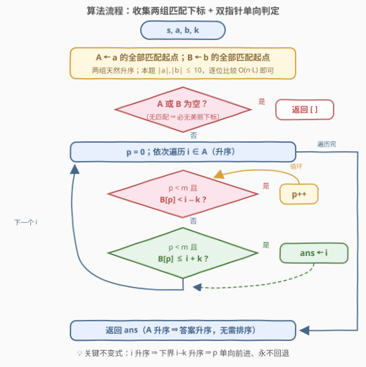
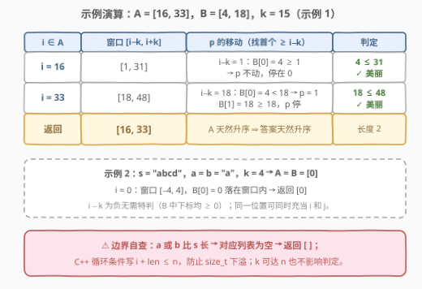

# LeetCode 找出数组中的美丽下标 I 题解

## 1. 题目概述

- **标题 / 题号**：找出数组中的美丽下标 I（#3006，medium）
- **链接**：https://leetcode.cn/problems/find-beautiful-indices-in-the-given-array-i/
- **难度**：中等
- **标签**：双指针、字符串、二分查找、字符串匹配

**题意**：给你一个下标从 **0** 开始的字符串 `s`、字符串 `a`、字符串 `b` 和一个整数 `k`。

如果下标 `i` 满足以下条件，则认为它是一个 **美丽下标**：

- $0 \le i \le \text{s.length} - \text{a.length}$
- $s[i..(i + \text{a.length} - 1)] = a$，即从 `i` 开始、长度为 `|a|` 的子串恰好等于 `a`
- 存在下标 `j` 使得：
  - $0 \le j \le \text{s.length} - \text{b.length}$
  - $s[j..(j + \text{b.length} - 1)] = b$
  - $|j - i| \le k$

以数组形式按 **从小到大排序** 返回所有美丽下标。

**示例 1**：

```text
输入：s = "isawsquirrelnearmysquirrelhouseohmy", a = "my", b = "squirrel", k = 15
输出：[16,33]
解释：存在 2 个美丽下标：[16,33]。
- 下标 16 是美丽下标，因为 s[16..17] == "my"，且存在下标 4，满足 s[4..11] == "squirrel" 且 |16 - 4| <= 15。
- 下标 33 是美丽下标，因为 s[33..34] == "my"，且存在下标 18，满足 s[18..25] == "squirrel" 且 |33 - 18| <= 15。
```

**示例 2**：

```text
输入：s = "abcd", a = "a", b = "a", k = 4
输出：[0]
解释：下标 0 是美丽下标，因为 s[0..0] == "a"，且存在下标 0，满足 s[0..0] == "a" 且 |0 - 0| <= 4。
```

**约束**：

- $1 \le k \le \text{s.length} \le 10^5$
- $1 \le \text{a.length}, \text{b.length} \le 10$
- `s`、`a`、`b` 只包含小写英文字母

> ⚠️ 两个易漏点：`a` / `b` 可能比 `s` 还长（此时没有任何匹配，注意 C++ 无符号数下溢）；同一个下标可以同时充当 `i` 和 `j`（示例 2 里的 0）。

## 2. 解题思路

### 2.1 暴力思路

先把 `a`、`b` 在 `s` 中的全部匹配起点收集成两个列表 `A`、`B`（按起点升序），然后枚举每一对 $(i, j) \in A \times B$，检查 $|i - j| \le k$ 是否成立。

问题出在配对数量：取 `s = "aaa...a"`、`a = b = "a"`，则 $|A| = |B| = n$，配对数约 $n^2 = 10^{10}$，必然超时。**收集匹配不是瓶颈**（逐位比较 $O(n \cdot L)$，$L = |a| + |b| \le 20$），**瓶颈在「判定」**——必须利用两组下标各自有序的事实，把每个 `i` 的判定代价从 $O(|B|)$ 压到 $O(\log |B|)$ 甚至均摊 $O(1)$。

### 2.2 核心观察：窗口覆盖判定——只看「最近的 j」

![核心概念：窗口 [i−k, i+k] 覆盖 b 的匹配点](../images/p3006_beautiful_concept.svg)

把美丽下标的条件翻译成集合语言：

$$i \text{ 是美丽下标} \iff B \cap [i-k,\ i+k] \ne \varnothing$$

而 `B` 是**升序**的，所以只需关注**第一个 $\ge i-k$ 的元素** $B[p]$（也就是 `lower_bound(B, i−k)`）：

- 若 $B[p] \le i+k$：命中，`i` 是美丽下标；
- 若 $B[p] > i+k$：比 $B[p]$ 早的元素都 $< i-k$（太靠左），比它晚的都 $\ge B[p] > i+k$（太靠右），**全部不满足**——一次比较即可否定。

> 💡 本质是**最近邻判定**：`i` 美丽 ⟺ `B` 中离 `i` 最近的元素与 `i` 的距离 $\le k$。有序性把「扫描全部候选」压缩成「只看一个候选」，这是二分 / 双指针都能吃到的那一口气。

### 2.3 算法流程：双指针单向扫描



`A` 同样是升序的，且随着 `i` 增大，窗口左端点 $i-k$ **单调不减**——于是「第一个 $\ge i-k$」的指针 `p` 也单调不减，**永不回退**。整个判定阶段就是一次归并式的线性扫描：

1. 两次扫描 `s`，收集 `A`（`a` 的全部匹配起点）与 `B`（`b` 的全部匹配起点）；
2. `p = 0`，依次遍历 $i \in A$：执行 `while p < |B| 且 B[p] < i−k: p++`；
3. 若 `p < |B|` 且 `B[p] ≤ i+k`，则 `i` 进入答案；
4. `A` 本身升序 ⇒ 答案天然升序，直接返回。

> 💡 也可以不维护指针，对每个 `i` 二分查找 `lower_bound(B, i−k)`，复杂度 $O(|A| \log |B|)$，在 $n \le 10^5$ 下同样轻松。双指针版是它的均摊 $O(1)$ 改进，两者正确性同源：都只检查那**一个**关键候选。

### 2.4 示例演算



对示例 1：`A = [16, 33]`、`B = [4, 18]`、`k = 15`。`i = 16` 时窗口 `[1, 31]` 包住 `j = 4`；`i = 33` 时窗口 `[18, 48]` 的左边界恰好压住 `j = 18`（$|33 - 18| = 15 = k$，**闭区间边界命中**）。两个都美丽，返回 `[16, 33]`，全程 `p` 只前进了 1 步。

## 3. 参考代码

### C++（逐位收集 + 双指针）

```cpp
class Solution {
  public:
    vector<int> beautifulIndices(string s, string a, string b, int k) {
        int n = s.size(), la = a.size(), lb = b.size();
        vector<int> A, B;                       // 两组匹配起点，天然升序
        for (int i = 0; i + la <= n; ++i)       // i + la <= n，防 size_t 下溢
            if (s.compare(i, la, a) == 0) A.push_back(i);
        for (int j = 0; j + lb <= n; ++j)
            if (s.compare(j, lb, b) == 0) B.push_back(j);

        vector<int> ans;
        int m = B.size(), p = 0;
        for (int i : A) {
            while (p < m && B[p] < i - k) ++p;  // B[p] 成为第一个 >= i-k 的候选
            if (p < m && B[p] <= i + k) ans.push_back(i);
        }
        return ans;
    }
};
```

### Python（startswith 收集 + 双指针）

```python
class Solution:
    def beautifulIndices(self, s: str, a: str, b: str, k: int) -> List[int]:
        n, la, lb = len(s), len(a), len(b)
        # startswith(p, i) 不切片，直接比较 s[i:i+len(p)] == p
        A = [i for i in range(n - la + 1) if s.startswith(a, i)]
        B = [j for j in range(n - lb + 1) if s.startswith(b, j)]

        ans, p = [], 0
        for i in A:                      # i 升序 => i-k 升序 => p 不回退
            while p < len(B) and B[p] < i - k:
                p += 1
            if p < len(B) and B[p] <= i + k:
                ans.append(i)
        return ans
```

二分版（与双指针等价，写起来更短）：

```python
from bisect import bisect_left

class Solution:
    def beautifulIndices(self, s: str, a: str, b: str, k: int) -> List[int]:
        A = [i for i in range(len(s) - len(a) + 1) if s.startswith(a, i)]
        B = [j for j in range(len(s) - len(b) + 1) if s.startswith(b, j)]
        return [i for i in A
                if (q := bisect_left(B, i - k)) < len(B) and B[q] <= i + k]
```

> ⚠️ 收集匹配别写成 `s[i:i+la] == a`——每个起点都切片复制一次子串，白白多出 $O(n \cdot L)$ 的拷贝开销；`startswith(a, i)` 零拷贝。另外 `range(n - la + 1)` 在 `la > n` 时得到空区间，`a` 比 `s` 长的边界自动成立。

## 4. 复杂度分析

设 $n = |s|$，$L = |a| + |b| \le 20$，$|A|, |B| \le n$。

| 维度 | 复杂度 | 说明 |
|------|--------|------|
| 时间复杂度 | $O(n \cdot L + |A| + |B|)$ | 逐位收集匹配 $O(n \cdot L) \le 2 \times 10^6$ 次字符比较；双指针判定阶段 `i` 与 `p` 各自单向前进，线性 |
| 空间复杂度 | $O(|A| + |B|)$ | 两个匹配起点列表，最坏 $O(n)$；返回值不计入 |

> 💡 若用 KMP / 滚动哈希收集匹配，时间降到 $O(n + |a| + |b|)$（见第 5 节）。本题 $L \le 10$，逐位比较已经绰绰有余。

## 5. 扩展：面向 3008 的 KMP 收集器

姊妹题 [3008. 找出数组中的美丽下标 II](https://leetcode.cn/problems/find-beautiful-indices-in-the-given-array-ii/) 把 $n$、$|a|$、$|b|$ 全部放大到 $5 \times 10^5$：逐位比较 $O(n \cdot L)$ 高达约 $2.5 \times 10^{11}$，直接不可行——**匹配阶段**必须换成线性算法（KMP / 滚动哈希 / Z 函数），**判定阶段**的双指针或二分原封不动，整体 $O(n + |a| + |b|)$：

```cpp
// 返回 p 在 s 中的全部匹配起点（KMP，O(n + |p|)）
vector<int> kmpAll(const string& s, const string& p) {
    int m = p.size();
    vector<int> pi(m);
    for (int i = 1; i < m; ++i) {             // 失配函数（前缀表）
        int j = pi[i - 1];
        while (j && p[i] != p[j]) j = pi[j - 1];
        pi[i] = j + (p[i] == p[j]);
    }
    vector<int> res;
    int j = 0;
    for (int i = 0; i < (int)s.size(); ++i) { // 文本指针 i 从不回退
        while (j && s[i] != p[j]) j = pi[j - 1];
        j += (s[i] == p[j]);
        if (j == m) { res.push_back(i - m + 1); j = pi[j - 1]; }
    }
    return res;
}
```

把第 3 节代码里的两个收集循环换成 `kmpAll(s, a)` / `kmpAll(s, b)` 即可通过 3008。滚动哈希（预处理好哈希数组后每个起点 $O(1)$ 比较）是等价替代，建议双哈希对抗碰撞。

**其它变体**：

- 若改问「每个 `i` 最近的 `j` 距离」，`lower_bound` 之后同时检查 `B[q]` 与 `B[q-1]` 两个邻居取更近者；
- 若 `b` 的匹配位置是动态插入的，把有序数组换成 `multiset` / 平衡树，每次查询 $O(\log n)$。

## 6. 面试要点

1. **为什么双指针 `p` 不会回退？**

   按升序遍历 $i \in A$，窗口左端点 $i - k$ 随之单调不减；「第一个 $\ge i-k$」的位置关于下界单调不减，所以 `p` 只会前进。一旦 `B[p] < i-k`，对后续所有更大的 `i` 它同样太小，跳过是安全的。

2. **为什么只检查 `B[p]` 一个元素就足够？**

   `B` 有序。`B[p]` 是第一个进入窗口左端的元素：若 `B[p] > i+k`，则比它早的都 `< i-k`、比它晚的都 `≥ B[p] > i+k`，两头出界，不存在满足 $|j - i| \le k$ 的 `j`。一次比较完成存在性判定。

3. **逐位比较匹配在本题为什么可行，在 3008 为什么不行？**

   本题 $|a|, |b| \le 10$，收集阶段 $O(n \cdot L) \le 2 \times 10^6$；3008 中 $L$ 可达 $5 \times 10^5$，$O(n \cdot L)$ 飙到 $10^{11}$ 量级，必须用 KMP / 哈希把匹配压到 $O(n + L)$。**先看数据范围定算法档次**，正是这对姊妹题的考点。

4. **有哪些边界情况？**

   `a` 或 `b` 比 `s` 长 → 对应列表为空 → 返回空（C++ 循环条件写 `i + la <= n` 而非 `i <= n - la`，避免 `size_t` 下溢成天文数字）；`i - k` 可为负 → 无需特判，`B` 中下标均非负；`k` 可达 `n` → 窗口远大于串长，判定逻辑天然覆盖；同一位置可同时充当 `i` 和 `j`（示例 2）。

5. **答案需要排序或去重吗？**

   都不用。`A` 按起点升序收集，遍历顺序即答案顺序；起点互不相同，`A` 内无重复。即使面试官说「按任意顺序返回」，升序收集依然是零成本的选择。

## 同类练习题

| # | 题目 | 与本题的关联 |
|---|------|-------------|
| 3008 | [找出数组中的美丽下标 II](https://leetcode.cn/problems/find-beautiful-indices-in-the-given-array-ii/) | 同题面、数据范围放大到 $5 \times 10^5$，逼你把匹配阶段升级成 KMP / 滚动哈希 |
| 28 | [找出字符串中第一个匹配项的下标](https://leetcode.cn/problems/find-the-index-of-the-first-occurrence-in-a-string/)（[题解](../0001-0100/28_找出字符串中第一个匹配项的下标.md)） | 单模式串匹配母题，KMP 的最小应用场景 |
| 187 | [重复的DNA序列](https://leetcode.cn/problems/repeated-dna-sequences/)（[题解](../0101-0200/187_重复的DNA序列.md)） | 滚动哈希收集全部出现位置，「匹配收集」阶段的另一条实现路线 |
| 658 | [找到 K 个最接近的元素](https://leetcode.cn/problems/find-k-closest-elements/) | 有序数组上按 $\|x - \text{target}\|$ 距离定位的纯二分练习，巩固 `lower_bound` 手感 |
| 986 | [区间列表的交集](https://leetcode.cn/problems/interval-list-intersections/)（[题解](../0901-1000/986_区间列表的交集.md)） | 两组有序序列的单向双指针归并，与本题判定阶段同构 |
