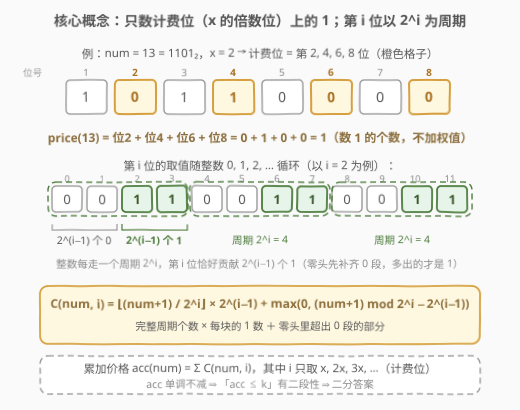
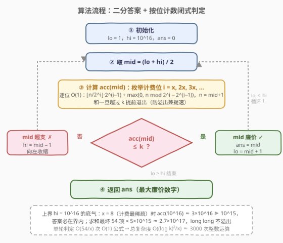
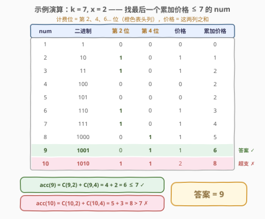

# 价值和小于等于 K 的最大数字

- **题目名称**：价值和小于等于 K 的最大数字
- **链接**：[3007. 价值和小于等于 K 的最大数字](https://leetcode.cn/problems/maximum-number-that-sum-of-the-prices-is-less-than-or-equal-to-k/)
- **难度**：中等
- **标签**：位运算、数学、二分查找、动态规划

## 1. 题目概述

给你一个整数 `k` 和一个整数 `x`。

整数 `num` 的**价格**（price）定义为：`num` 的二进制表示中，位于 $x, 2x, 3x, \dots$ 位置（从**最低有效位**开始，位下标从 1 开始）上的**设置位**（值为 1 的位）的数目。

`num` 的**累加价格**是从 `1` 到 `num` 的所有数字的**总**价格。如果 `num` 的累加价格小于或等于 `k`，则认为 `num` 是**廉价**的。

请你返回**最大**的廉价数字。

题首给出的价格计算示例（二进制按最高位在前书写）：

| x | num | 二进制表示 | 价格 |
|---|-----|-----------|------|
| 1 | 13 | `000001101` | 3 |
| 2 | 13 | `000001101` | 1 |
| 2 | 233 | `011101001` | 3 |
| 3 | 13 | `000001101` | 1 |
| 3 | 362 | `101101010` | 2 |

**示例 1**：

```text
输入：k = 9, x = 1
输出：6
解释：x = 1 时所有位都计价。num = 1..7 的价格依次为 1,1,2,1,2,2,3，
     累加价格为 1,2,4,5,7,9,12。6 的累加价格 9 ≤ 9，7 的累加价格 12 > 9，
     故 6 是最大的廉价数字。
```

**示例 2**：

```text
输入：k = 7, x = 2
输出：9
解释：x = 2 时只计第 2, 4, 6, … 位。num = 1..10 的价格依次为
     0,1,1,0,0,1,1,1,1,2，累加价格为 0,1,2,2,2,3,4,5,6,8。
     9 的累加价格 6 ≤ 7，10 的累加价格 8 > 7，故答案是 9。
```

**约束条件**：

- $1 \le k \le 10^{15}$
- $1 \le x \le 8$

> ⚠️ 读题陷阱：价格数的是计费位上**设置位的个数**，不是把这些位的权值 $2^{i-1}$ 加起来。`x = 2, num = 13`（`1101`）只在第 4 位（值 8 那一位）命中一次，价格是 **1** 而不是 8。

---

## 2. 解题思路

### 2.1 暴力思路：逐个累加价格

从 `num = 1` 开始，逐个用 $O(\log \text{num})$ 的位检查算出 `price(num)` 并累加，首次超过 `k` 时返回上一个 `num`。

问题在于答案的量级：`x = 8` 时计费位最稀疏（每 8 位才 1 个），一个数的期望价格只有约 $\frac{\log_2 \text{num}}{16}$；累加价格要涨到 $10^{15}$，`num` 得走到 $10^{14}$ 量级。暴力 $O(\text{answer})$ 直接超时，必须把「一批数的价格总和」变成**闭式计算**。

### 2.2 核心观察：单调性 ⇒ 二分答案 + 按位计数公式



**观察 1（单调性）**：每个数的价格非负，所以累加价格 $\text{acc}(\text{num})$ 关于 `num` **单调不减**。于是「$\text{acc}(\text{num}) \le k$」具有**二段性**：存在分界点 `ans`，`≤ ans` 的都廉价、`> ans` 的都超支——这正是[二分答案](../0801-0900/875_爱吃香蕉的珂珂.md)的适用结构，只是本题求的是**最大可行值**，可行时向右收缩。

**观察 2（按位计数闭式）**：累加价格可以按位拆开，把「计费位」的 1 一个个数出来：

$$\text{acc}(\text{num}) = \sum_{i = x,\, 2x,\, 3x, \dots} C(\text{num}, i)$$

其中 $C(\text{num}, i)$ 是 $0 \sim \text{num}$ 这 $\text{num}+1$ 个数中**第 $i$ 位为 1 的总个数**（0 的价格恒为 0，白送进统计区间不改变总和）。

第 $i$ 位的取值随整数递增以 $2^i$ 为**周期**循环：先 $2^{i-1}$ 个 0，再 $2^{i-1}$ 个 1。于是设 $n = \text{num}+1$：

$$C(\text{num}, i) = \left\lfloor \frac{n}{2^i} \right\rfloor \cdot 2^{i-1} + \max\left(0,\ n \bmod 2^i - 2^{i-1}\right)$$

- **完整周期**：$\lfloor n / 2^i \rfloor$ 个整块，每块贡献 $2^{i-1}$ 个 1；
- **零头**：剩余 $r = n \bmod 2^i$ 个数先走完 0 段（长 $2^{i-1}$），多出来的才是 1，故贡献 $\max(0, r - 2^{i-1})$。

这就是 [233. 数字 1 的个数](https://leetcode.cn/problems/number-of-digit-one/) 的「按位分周期计数」公式搬到二进制——每次查询 $O(1)$。

**二分上界取 $10^{16}$**：最坏情形 `x = 8`（计费最稀疏、累加价格涨得最慢）。$\text{num} = 10^{16}$ 时约 54 个二进制位、7 个计费位，每个计费位贡献约 $\text{num}/2 = 5 \times 10^{15}$ 个 1，$\text{acc}(10^{16}) \gtrsim 3 \times 10^{16} \gg 10^{15}$，故答案必小于 $10^{16}$。同时求和不会溢出：`x = 1`（计费位最多）时也只累加 54 项、每项 $\le 5 \times 10^{15}$，总和 $\le 2.7 \times 10^{17}$，远在 `long long` 上界 $9.2 \times 10^{18}$ 之内（代码里再加「超过 k 提前退出」双保险）。

> 💡 二分的判定函数 `check(mid)` 本质就是求 $\text{acc}(\text{mid})$——别的题是 $O(n)$ 扫一遍验证，本题靠闭式压到 $O(\log)$，这才让 $k \le 10^{15}$ 变得可解。

### 2.3 算法流程图



流程要点：

1. `lo = 1, hi = 10^16`，闭区间二分；
2. 每轮取 `mid`，枚举计费位 $i = x, 2x, 3x, \dots$（直到 $2^{i-1} > \text{mid}$），逐位套 $C$ 公式求和得 $\text{acc}(\text{mid})$；
3. $\text{acc}(\text{mid}) \le k$：`mid` 廉价，记录答案并向右收缩（`lo = mid + 1`）；否则向左收缩（`hi = mid − 1`）；
4. 区间为空时 `ans` 即最大廉价数字。

### 2.4 示例演算



以 `k = 7, x = 2` 为例，计费位是第 2、4、6… 位。用公式验证 $\text{acc}(9)$：

- $C(9, 2)$：$n = 10$，周期 $2^2 = 4$、半周期 $2$。$\lfloor 10/4 \rfloor \times 2 + \max(0, 10 \bmod 4 - 2) = 2 \times 2 + 0 = 4$（即 2, 3, 6, 7 四个数）；
- $C(9, 4)$：$n = 10$，周期 $2^4 = 16$、半周期 $8$。$0 \times 8 + \max(0, 10 - 8) = 2$（即 8, 9 两个数）；
- $\text{acc}(9) = 4 + 2 = 6 \le 7$ ✓

再算 $\text{acc}(10)$：$C(10, 2) = 2 \times 2 + \max(0, 3 - 2) = 5$，$C(10, 4) = \max(0, 11 - 8) = 3$，合计 $8 > 7$ ✗

与逐项表格完全一致，二分收敛到 **9**。

---

## 3. 参考代码

### C++

```cpp
class Solution {
  public:
    long long findMaximumNumber(long long k, int x) {
        long long lo = 1, hi = 1e16;          // 上界论证见 2.2
        long long ans = 0;
        while (lo <= hi) {
            long long mid = lo + (hi - lo) / 2;
            if (accPrice(mid, x, k) <= k) {
                ans = mid;                    // mid 廉价，尝试更大
                lo = mid + 1;
            } else {
                hi = mid - 1;                 // mid 超支，往小找
            }
        }
        return ans;
    }

  private:
    // 1..num 的累加价格；超过 k 提前退出（防溢出兼提速）
    static long long accPrice(long long num, int x, long long k) {
        long long sum = 0;
        for (long long i = x; (1LL << (i - 1)) <= num; i += x) {  // 只枚举计费位
            long long period = 1LL << i;      // 周期 2^i
            long long half = 1LL << (i - 1);  // 半周期 2^(i-1)
            long long n = num + 1;            // 统计 0..num 共 num+1 个数
            sum += n / period * half + max(0LL, n % period - half);
            if (sum > k) break;
        }
        return sum;
    }
};
```

### Python

```python
class Solution:
    def findMaximumNumber(self, k: int, x: int) -> int:
        def acc_price(num: int) -> int:
            # 1..num 的累加价格；超过 k 提前退出
            total = 0
            i = x
            while (1 << (i - 1)) <= num:      # 只枚举计费位
                period, half = 1 << i, 1 << (i - 1)
                n = num + 1
                total += n // period * half + max(0, n % period - half)
                if total > k:
                    break
                i += x
            return total

        lo, hi = 1, 10 ** 16
        ans = 0
        while lo <= hi:
            mid = (lo + hi) // 2
            if acc_price(mid) <= k:
                ans = mid                     # mid 廉价，尝试更大
                lo = mid + 1
            else:
                hi = mid - 1                  # mid 超支，往小找
        return ans
```

> ⚠️ **两个易错点**：
> 1. **统计个数是 `num + 1`**：公式数的是 $0 \sim \text{num}$，0 不贡献价格但让周期对齐，别忘了 `+1`。
> 2. **循环终止条件**用 $2^{i-1} \le \text{num}$（而不是 $2^i \le \text{num}$）：最高设置位所在的那一轮也要计入，漏掉会少算整段高位贡献。

---

## 4. 复杂度分析

| 维度 | 复杂度 | 说明 |
|------|--------|------|
| 时间复杂度 | $O\!\left(\dfrac{(\log k)^2}{x}\right)$ | 二分 $O(\log k) \approx 54$ 轮；每轮枚举 $\le \lceil 54/x \rceil$ 个计费位，每 位 $O(1)$ 公式求 $C$ |
| 空间复杂度 | $O(1)$ | 仅常数个变量 |

以 $k \le 10^{15}$ 计，总计约 $54 \times 54 \approx 3000$ 次整数运算，瞬间出结果。

---

## 5. 扩展：免二分的按位贪心构造

「找最大廉价数字」也可以不写二分，直接**从高位到低位贪心试填**：从第 54 位往第 1 位，每轮把当前位试置 1，用同一个 $\text{acc}$ 公式判定；可行（$\le k$）就保留该位。

```cpp
long long findMaximumNumber(long long k, int x) {
    long long ans = 0;
    for (int j = 54; j >= 1; --j) {            // 10^16 < 2^54
        long long cand = ans | (1LL << (j - 1));
        if (accPrice(cand, x, k) <= k) ans = cand;   // 贪心保留
    }
    return ans;
}
```

正确性一句话：设已确定前缀为 $P$，若 $P \,|\, 2^{j-1}$ 可行，则答案 $\ge P \,|\, 2^{j-1} > P \,|\, (\text{任何低位组合})$，故答案必含该位；归纳到底即得贪心结果就是最大廉价数字（本质是**数位 DP 的贪心退化**，[600. 不含连续 1 的非负整数](https://leetcode.cn/problems/non-negative-integers-without-consecutive-ones/) 是这一视角的一般形态）。

两种写法复杂度同为 $O((\log k)^2 / x)$：二分好写好证、边界统一；贪心省去「区间端点取开取闭」的心智负担，但需要额外论证「高位优先」的正确性。面试任选一种讲清即可。

---

## 6. 面试要点

1. **为什么能二分？二段性体现在哪？**

   - 每个数的价格非负，累加价格 $\text{acc}(\text{num})$ 随 `num` 单调不减，于是「$\text{acc} \le k$」呈**前缀真、后缀假**的二段性，分界点即所求最大廉价数字。

2. **$C(\text{num}, i)$ 公式怎么现场推导？**

   - 整数递增时第 $i$ 位以 $2^i$ 为周期：前 $2^{i-1}$ 个 0、后 $2^{i-1}$ 个 1。统计 $0 \sim \text{num}$ 共 $n = \text{num}+1$ 个数：完整周期 $\lfloor n/2^i \rfloor$ 块，每块 $2^{i-1}$ 个 1；零头 $r = n \bmod 2^i$ 先补齐 0 段，多出的 $\max(0, r - 2^{i-1})$ 个才是 1。

3. **二分上界 $10^{16}$ 怎么来的？会不会溢出？**

   - 最坏 `x = 8`：$\text{acc}(10^{16}) \gtrsim 7 \times 5 \times 10^{15} \approx 3.5 \times 10^{16} \gg 10^{15}$，答案必在界内。求和最坏 `x = 1`：54 项 $\times\ 5 \times 10^{15} \approx 2.7 \times 10^{17}$，`long long` 装得下；再加「超 k 即停」的提前退出双保险。Python 大整数天然无忧。

4. **为什么计费位只枚举 $x, 2x, 3x, \dots$？**

   - 价格定义只数这些位置上的设置位；其他位算出 $C$ 也不计入，直接跳过，既省常数又让「枚举到 $2^{i-1} > \text{num}$ 为止」的终止条件自然成立。

5. **和 233 / 600 是什么关系？**

   - 233 是同一「分周期计数」公式的十进制版母题；600 把「≤ n 且满足位约束的计数」推广成数位 DP。本题 = 该公式（二进制版）+ 一层二分答案，两块拼图各自都是经典。

---

## 7. 同类练习题

- [233. 数字 1 的个数](https://leetcode.cn/problems/number-of-digit-one/)（[题解](../0201-0300/233_数字1的个数.md)）：同款「按位分周期计数」公式的十进制母题，先会它再看本题事半功倍
- [600. 不含连续 1 的非负整数](https://leetcode.cn/problems/non-negative-integers-without-consecutive-ones/)（[题解](../0501-0600/600_不含连续1的非负整数.md)）：按位统计的数位 DP 形态，处理「≤ n 且满足位约束」的一般框架
- [875. 爱吃香蕉的珂珂](https://leetcode.cn/problems/koko-eating-bananas/)（[题解](../0801-0900/875_爱吃香蕉的珂珂.md)）：二分答案 + 单调判定模板，本题把判定函数从 O(n) 扫描升级成 O(log) 闭式
- [410. 分割数组的最大值](https://leetcode.cn/problems/split-array-largest-sum/)（[题解](../0401-0500/410_分割数组的最大值.md)）：二分答案经典款，check 用贪心划分，对照体会判定函数的设计差异
- [191. 位 1 的个数](https://leetcode.cn/problems/number-of-1-bits/)：单数 popcount（`n & (n−1)` 技巧），本题「价格」函数的原子操作
