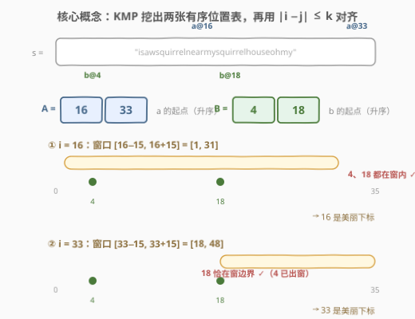
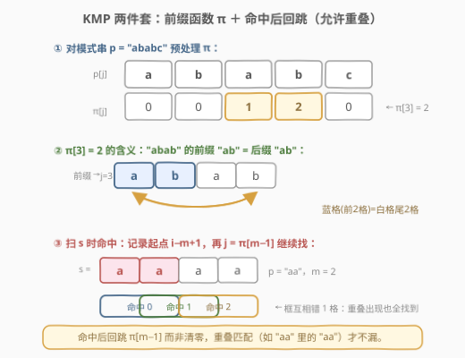
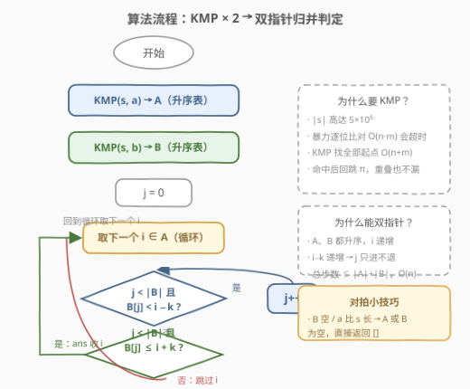

# 找出数组中的美丽下标II

- **题目名称**：找出数组中的美丽下标II
- **链接**：[3008. 找出数组中的美丽下标 II](https://leetcode.cn/problems/find-beautiful-indices-in-the-given-array-ii/)
- **难度**：困难
- **标签**：字符串匹配、KMP、双指针、二分查找

## 1. 题目概述

给你一个下标从 **0** 开始的字符串 `s`、字符串 `a`、字符串 `b` 和一个整数 `k`。

如果下标 `i` 满足以下条件，则认为它是一个**美丽下标**：

- `0 <= i <= s.length - a.length`
- `s[i..(i + a.length - 1)] == a`
- 存在下标 `j` 使得：
  - `0 <= j <= s.length - b.length`
  - `s[j..(j + b.length - 1)] == b`
  - `|j - i| <= k`

以数组形式按**从小到大排序**返回美丽下标。

**示例 1**：

```text
输入：s = "isawsquirrelnearmysquirrelhouseohmy", a = "my", b = "squirrel", k = 15
输出：[16,33]
解释：存在 2 个美丽下标：[16,33]。
- 下标 16 是美丽下标，因为 s[16..17] == "my"，且存在下标 4，满足 s[4..11] == "squirrel" 且 |16 - 4| <= 15。
- 下标 33 是美丽下标，因为 s[33..34] == "my"，且存在下标 18，满足 s[18..25] == "squirrel" 且 |33 - 18| <= 15。
```

**示例 2**：

```text
输入：s = "abcd", a = "a", b = "a", k = 4
输出：[0]
解释：存在 1 个美丽下标：[0]。
- 下标 0 是美丽下标，因为 s[0..0] == "a"，且存在下标 0，满足 s[0..0] == "a" 且 |0 - 0| <= 4。
```

**约束条件**：

- $1 \le k \le \text{s.length} \le 5 \times 10^5$
- $1 \le \text{a.length}, \text{b.length} \le 5 \times 10^5$
- `s`、`a`、`b` 只包含小写英文字母。

> ⚠️ 本题是 [3006. 找出数组中的美丽下标 I](https://leetcode.cn/problems/find-beautiful-indices-in-the-given-array-i/) 的数据加强版：$|s|$ 从 $10^5$ 放大到 $5 \times 10^5$，且 `a`、`b` 可以**比 `s` 更长**（此时无匹配）。数据规模的提升意味着暴力字符串比对必然超时，必须用 $O(n)$ 级的字符串匹配算法。

---

## 2. 解题思路

### 2.1 暴力思路

两层暴力：

1. **找匹配**：对每个合法起点 `i`，用 `s[i:i+len(a)] == a` 逐字符比对，收集 `a` 的全部出现起点 `A`；对 `b` 同理得 `B`。单次比对 $O(|a|)$，整体 $O(|s| \cdot |a|)$，最坏 $2.5 \times 10^{11}$ 次字符比较，直接爆炸。
2. **配对判定**：对每个 `i ∈ A`，内层扫 `B` 找是否存在 `|j − i| ≤ k`，$O(|A| \cdot |B|)$，同样可到 $10^{10}$ 级。

即便借用语言内置的 `find`（底层通常也是 $O(n \cdot m)$ 的朴素或混合策略），最坏构造（如 `s = "aaaa…"`、`a = "aa…ab"`）依然会卡满。正确姿势分两步走：**KMP 一次扫出全部起点，双指针（或二分）完成近邻判定**。

### 2.2 核心观察：KMP 挖两张升序表 + 双指针归并判定



把题目拆成两个独立子问题：

1. **多模式定位**：求 `a` 在 `s` 中的**全部**出现起点，得升序数组 `A`；对 `b` 同理得升序数组 `B`。这是 KMP 的拿手好戏——单趟扫描 $O(|s| + |a|)$，且**命中后失配指针回跳 $\pi[m-1]$ 而非清零**，重叠出现（如 `"aaaa"` 里的 `"aa"` 出现在 0、1、2）一个不漏。
2. **近邻判定**：`i` 是美丽下标 $\iff$ 存在 $j \in B$ 落在窗口 $[i-k,\ i+k]$ 内。即 $\min_{j \in B} |i - j| \le k$。

> 💡 **为什么双指针合法**：KMP 按起点从小到大扫描，`A`、`B` 天然升序。`i` 递增 → 窗口左端 `i−k` 递增 → 一旦某个 `B[j]` 因 `B[j] < i−k` 出窗，它对**所有后续** `i` 都永久出窗——`j` 只进不退，永不需要回头。这与归并排序的合并指针是同一个单调性论证。

判定逻辑只有三行：对每个 `i ∈ A`，先把 `j` 推到第一个满足 `B[j] ≥ i−k` 的位置（淘汰出窗的），然后看 `B[j] ≤ i+k` 是否成立：

| 情形 | 判定 | 含义 |
|------|------|------|
| `B[j] < i−k` | `j++` | 离得太远（在窗口左侧），且对后面更大的 `i` 更没戏，淘汰 |
| `i−k ≤ B[j] ≤ i+k` | 收 `i` | 窗口内存在 `b` 匹配，`i` 是美丽下标 |
| `B[j] > i+k`（或 `j` 越界） | 跳过 | 第一个没出左窗的 `B[j]` 已在右窗外，更后面的 `B` 只会更远 |

### 2.3 KMP 内功：前缀函数与命中回跳



本题要求 KMP 的「完整版」能力——**找全部出现而非首次出现**，两个细节必须写对：

1. **前缀函数 $\pi$**：$\pi[j]$ 定义为 $p[0..j]$ 的最长相等**真**前后缀长度。失配时指针不是退一格重比，而是跳到 $\pi[j-1]$——那里已经保证前后缀相等，直接从「已知对齐」继续。
2. **命中后 `j = π[m−1]`**：匹配成功记录起点 `i−m+1` 后，若把 `j` 清零，会漏掉所有**重叠匹配**（模式自己和自己部分重叠着出现）。回跳 $\pi[m-1]$ 相当于把「模式的最长相等前后缀」当作已匹配部分继续，`"aa"` 在 `"aaaa"` 中 3 次出现全数入账。

> ⚠️ 边界：`a` 或 `b` 可能比 `s` 长（本题约束允许 $|a|, |b|$ 达 $5\times10^5$ 而 $|s|$ 可以只有 1），此时对应位置表为空；`B` 为空则 `j` 永远停在 0 且 `0 < |B|` 不成立，任何 `i` 都不入选，双指针代码无需特判自然成立。

### 2.4 算法流程图



### 2.5 示例演算

![示例演算：A=[16,33], B=[4,18], k=15](../images/p3008_example_walkthrough.svg)

以示例 1 走一遍双指针：$A = [16, 33]$，$B = [4, 18]$，$k = 15$，`j` 从 0 出发。

| 步骤 | i | 窗口 [i−k, i+k] | j 的走位 | 判定 | ans |
|------|---|-----------------|----------|------|-----|
| 1 | 16 | [1, 31] | `B[0]=4 ≥ 1` → 不动，`j=0` | `B[0]=4 ≤ 31` ✓ | `[16]` |
| 2 | 33 | [18, 48] | `B[0]=4 < 18` → `j=1`；`B[1]=18 ≥ 18` → 停 | `B[1]=18 ≤ 48` ✓ | `[16, 33]` |

第 2 步里 `4` 被淘汰后就永远退出舞台——后续 `i` 只会更大，`i−k` 只会更靠右。整趟扫描 `j` 总共只前进了 $|B|$ 步，这就是双指针 $O(|A|+|B|)$ 的由来。

---

## 3. 参考代码

### C++（KMP + 双指针）

```cpp
class Solution {
  public:
    vector<int> beautifulIndices(string s, string a, string b, int k) {
        vector<int> A = kmpFind(s, a), B = kmpFind(s, b);
        vector<int> ans;
        int j = 0, m = B.size();
        for (int i : A) {
            while (j < m && B[j] < i - k) ++j;   // 淘汰出左窗的 B[j]，对后续 i 也永久无效
            if (j < m && B[j] <= i + k) ans.push_back(i);  // 第一个未出左窗的落在窗内？
        }
        return ans;
    }

  private:
    // 返回 p 在 s 中的全部出现起点（升序），含重叠出现
    vector<int> kmpFind(const string& s, const string& p) {
        int n = s.size(), m = p.size();
        if (m > n) return {};
        vector<int> pi(m, 0);                     // pi[j]: p[0..j] 的最长相等真前后缀长度
        for (int i = 1; i < m; ++i) {
            int j = pi[i - 1];
            while (j > 0 && p[i] != p[j]) j = pi[j - 1];   // 失配回跳，而非退一格重比
            if (p[i] == p[j]) ++j;
            pi[i] = j;
        }
        vector<int> res;
        int j = 0;                                // 已匹配长度
        for (int i = 0; i < n; ++i) {
            while (j > 0 && s[i] != p[j]) j = pi[j - 1];
            if (s[i] == p[j]) ++j;
            if (j == m) {
                res.push_back(i - m + 1);         // 记录起点
                j = pi[j - 1];                    // 回跳而非清零，重叠匹配不漏
            }
        }
        return res;
    }
};
```

### Python（KMP + 双指针，含二分写法）

```python
class Solution:
    def beautifulIndices(self, s: str, a: str, b: str, k: int) -> List[int]:
        def kmp_find(s: str, p: str) -> List[int]:
            m = len(p)
            if m > len(s):
                return []
            pi = [0] * m
            j = 0
            for i in range(1, m):
                while j and p[i] != p[j]:
                    j = pi[j - 1]                 # 失配回跳
                if p[i] == p[j]:
                    j += 1
                pi[i] = j
            res, j = [], 0
            for i, c in enumerate(s):
                while j and c != p[j]:
                    j = pi[j - 1]
                if c == p[j]:
                    j += 1
                if j == m:
                    res.append(i - m + 1)         # 起点
                    j = pi[j - 1]                 # 回跳，重叠匹配不漏
            return res

        A, B = kmp_find(s, a), kmp_find(s, b)
        ans, j = [], 0
        for i in A:
            while j < len(B) and B[j] < i - k:    # 淘汰出左窗的 B[j]
                j += 1
            if j < len(B) and B[j] <= i + k:
                ans.append(i)
        return ans
```

> 💡 双指针也可以换成二分：对每个 `i`，用 `bisect_left(B, i - k)` 找到第一个 `≥ i−k` 的位置再检查上界，复杂度 $O(|A| \log |B|)$。两者都过本题；双指针更优且更贴「有序表归并」的味道，二分写法胜在与「是否存在区间内元素」这类问题通用。

---

## 4. 复杂度分析

| 维度 | 复杂度 | 说明 |
|------|--------|------|
| 时间复杂度 | $O(|s| + |a| + |b|)$ | 两次 KMP 各自线性（预处理 $\pi$ 为 $O(|p|)$、扫 $s$ 均摊 $O(|s|)$，失配指针回跳总量不超过前进总量）；双指针合并 $O(\|A\| + \|B\|)$ |
| 空间复杂度 | $O(|a| + |b| + \|A\|)$ | $\pi$ 数组与两张位置表（输出数组不计则 $O(|a|+|b|)$） |

其中 $\|A\| \le |s| - |a| + 1$、$\|B\| \le |s| - |b| + 1$。对比暴力 $O(|s| \cdot |a|)$ 与内置 `find` 的最坏复杂度，线性 KMP 是 $|s| = 5 \times 10^5$ 规模下的唯一稳妥解。

---

## 5. 扩展：字符串匹配算法选型与 Z 函数替代

**为什么是 KMP 而不是别的**：本题标签里还挂了字符串哈希（Rolling Hash）、Boyer–Moore、扩展 KMP——都是可行路线：

- **滚动哈希**：把 `a`、`b` 的哈希值算好，滑窗扫一遍 `s` 比对哈希，$O(n)$ 期望。代码短，但有极小概率哈希碰撞（双模数可忽略），且乘法取模常数不小；
- **Z 函数（扩展 KMP）**：算 `p + '#' + s` 的 Z 数组，`Z[i] == |p|` 即匹配，逻辑同样线性，喜欢 Z 函数的读者可以等价替换；
- **Boyer–Moore**：子串搜索平均快，但**找全部出现**的场景下最坏仍是 $O(n \cdot m)$，不保险。

面试默认写 KMP：无哈希碰撞风险、无随机性、双百表现稳。

**通用模板抽象**：本题的 `kmpFind(s, p)` 就是「找子串全部出现」的万能件，与「找首次出现」（[28. 找出字符串中第一个匹配项的下标](https://leetcode.cn/problems/find-the-index-of-the-first-occurrence-in-a-string/)）只差命中后是否 `break`。同理，双指针近邻判定（有序表 B 中是否存在元素落在 $[i-k, i+k]$）也是「区间存在性」问题的标准件，把 `A`、`B` 换成任意两张有序表（时间戳、坐标、事件点）都成立。

**数据结构视角**：若 `A` 不是按升序给出（比如在线流式到达），双指针失效，可换**有序集合 + 查前驱后继**（`SortedList` / `lower_bound`）维护 `B` 的动态窗口，每个查询 $O(\log |B|)$——这正是 220（存在重复元素 III）桶/平衡树的近邻查询套路。

---

## 6. 面试要点

1. **为什么 KMP 命中后 `j` 要回跳 `π[m−1]` 而不是清零？**

   - 清零会漏掉**重叠出现**：`"aa"` 在 `"aaaa"` 中出现于 0、1、2。命中后模式的最长相等前后缀（长度 $\pi[m-1]$）仍然与主串尾部对齐，把它当作「已匹配部分」继续比较，才能把错位重叠的出现全部收入。本题要求**全部**出现位置，这一点写错直接漏解。

2. **双指针为什么不会漏判、也不会重扫？**

   - `j` 始终指向「第一个 `≥ i−k` 的 `B[j]`」。出左窗的 `B[j]` 对当前及后续所有 `i`（更大 → `i−k` 更大）都不可能再满足 `|i−j| ≤ k`，淘汰是无悔的；而第一个未出左窗的 `B[j]` 是距窗口左端最近的候选，若它都 `> i+k`，更后面的 `B` 只会更远。两条合起来保证：不漏判（最近的候选已检查）且不重扫（`j` 单调不降，总移动 $\le |B|$）。

3. **`a` 比 `s` 长时程序行为如何？需要特判吗？**

   - `kmpFind` 开头的 `m > n` 检查返回空表，之后 `A` 或 `B` 为空：`A` 空则外层循环不执行；`B` 空则 `j < m` 恒假、任何 `i` 都不入选。双指针主干**无需任何额外特判**，自然返回 `[]`——这是把边界收敛进 KMP 函数的好处。

4. **KMP 均摊 $O(n)$ 的论证？**

   - 扫描中 `j` 每步至多 `+1`（`i` 前进一格），整个循环 `j` 的总增量 $\le n$；失配回跳 `j = π[j−1]` 严格减小 `j`，回跳总量不会超过总增量，故内层 while 的总执行次数均摊 $O(n)$。前缀函数的构造同理。这是教科书级的「势能/计数摊还」论证，面试被追问时按此作答。

5. **和 3006（简单版）的差别？**

   - 题意完全相同，仅数据范围不同：3006 的 $|s| \le 10^5$ 给了暴力/内置 `find` 一线生机（且最坏仍可能超时），3008 的 $5 \times 10^5$ 彻底关上这扇门，逼出 KMP + 线性/对数判定。这也是 LeetCode「I/II 双联题」的常见出题模式：I 是思路验证场，II 是复杂度硬门槛。

---

## 7. 同类练习题

- [3006. 找出数组中的美丽下标 I](https://leetcode.cn/problems/find-beautiful-indices-in-the-given-array-i/)：本题的弱化版（$|s| \le 10^5$），同一份 KMP + 双指针代码双杀，先在 I 上验证再移植
- [28. 找出字符串中第一个匹配项的下标](https://leetcode.cn/problems/find-the-index-of-the-first-occurrence-in-a-string/)：KMP 找**首次**出现的裸模板，命中即 break，是本题 `kmpFind` 的最小子集
- [459. 重复的子字符串](https://leetcode.cn/problems/repeated-substring-pattern/)：前缀函数的经典应用——$\pi[n-1]$ 与 $n$ 的整除关系判周期性，练 $\pi$ 数组的语义理解
- [1392. 最长快乐前缀](https://leetcode.cn/problems/longest-happy-prefix/)：直接求 $\pi[n-1]$（整个字符串的最长相等前后缀），补全前缀函数单点能力
- [214. 最短回文串](https://leetcode.cn/problems/shortest-palindrome/)：前缀函数在「拼接串 + 分隔符」技巧下的进阶应用，`kmpFind` 里 `p + '#' + s` 的构造思想与此同源
