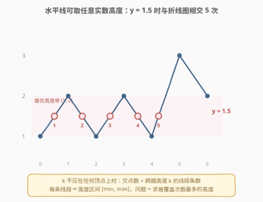
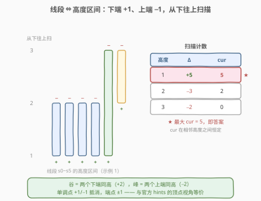
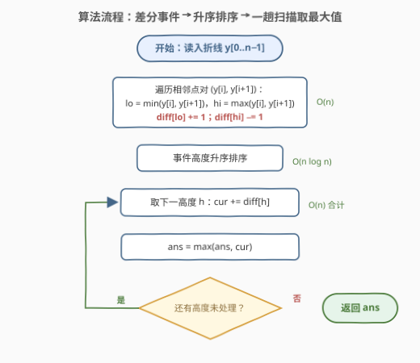
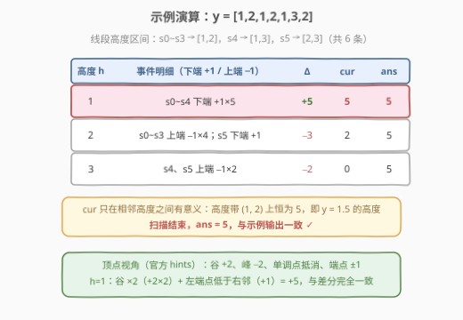

# LeetCode 折线图上的最大交点数量 题解

## 1. 题目概述

- **标题 / 题号**：折线图上的最大交点数量（#3009，hard）
- **链接**：https://leetcode.cn/problems/maximum-number-of-intersections-on-the-chart/
- **难度**：困难
- **标签**：扫描线、差分、几何、排序、哈希表、树状数组

> ⚠️ 本题为 LeetCode 付费题，题意描述根据官方示例用例与 hints 重建，可能与官方题面有出入。

**题意**：给你一个整数数组 `y`，它表示一张**折线图**：在二维平面上依次画出点 $(0, y[0]), (1, y[1]), \ldots, (n-1, y[n-1])$，并用**线段**连接每一对相邻的点 $(i, y[i])$ 与 $(i+1, y[i+1])$。

现在取一条**水平线** $y = k$（$k$ 可以是**任意实数**），它与折线图相交于若干个点。请求出：水平线与折线图的**交点数量的最大值**。

**示例 1**：

```text
输入：y = [1,2,1,2,1,3,2]
输出：5
解释：水平线取 y = 1.5（该高度带内任意实数均可）时，与折线图相交 5 次。
```

**示例 2**：

```text
输入：y = [2,1,3,4,5]
输出：2
解释：水平线取 y = 1.5 时相交 2 次；其后折线一路单调上升，交点数无法更多。
```

**约束条件**（付费题，按 hints 与常见数据规模重建，以官方为准）：

- $3 \le y.length \le 10^5$
- $1 \le y[i] \le 10^9$

官方 hints 给出的路线：把水平线从图表**底部向上移动**，每经过一个顶点，交点数可能变化——该点比前/后点**低**则交点数**增加**，比前/后点**高**则**减少**；另有树状数组（Fenwick Tree）解法。

## 2. 解题思路

### 2.1 暴力思路

最优水平线一定可以取在**两个相邻不同高度之间**（2.2 节证明）。于是暴力做法：

1. 把 `y` 排序去重，得到全部候选高度带 $(h_j, h_{j+1})$；
2. 对每个高度带取中点 $k$，遍历全部 $n-1$ 条线段，数有多少条满足 $\min(y[i], y[i{+}1]) < k < \max(y[i], y[i{+}1])$。

复杂度 $O(n^2)$（至多 $n-1$ 个高度带 × 每带 $O(n)$ 重数一遍），$n = 10^5$ 时约 $10^{10}$ 次比较，必然超时。

### 2.2 核心观察：线段 ⇔ 高度区间，最大交点数 = 最大区间重叠数



**第一步：把「几何」翻译成「计数」。** 一条线段 $(i, y[i])$-$(i{+}1, y[i{+}1])$ 与水平线 $y=k$ 相交，当且仅当 $k$ 落在这条线段两端点的高度之间。也就是说，每条线段本质上是**高度轴上的一个区间**：

$$[\,\min(y[i], y[i{+}1]),\ \max(y[i], y[i{+}1])\,]$$

而水平线 $y=k$ 的交点数 = **跨越高度 $k$ 的线段条数** = 高度 $k$ 被**多少个区间覆盖**。

> 💡 **为什么可以只考虑避开所有顶点高度 $k$**：若 $k$ 恰好压在某个顶点上，两条相邻线段的交点会**合并成一个点**（穿过式顶点：一升一降，两个交点退化为顶点本身），或者退化为一个**切点**（峰/谷顶点：把 $k$ 微调到峰下方/谷上方即可得到 2 个交点）。两种情况交点数都**不会超过**邻近的「一般高度」。因此最优解总可以在两个相邻不同高度之间的开区间内取得——这正是示例 1 中 $y = 1.5$ 的由来，也说明每条线段按**开区间** $(lo, hi)$ 参与覆盖即可。

**第二步：最大区间重叠 = 差分 + 排序扫描。** 这就是经典的「最多同时重叠区间」问题（同 253 会议室 II、1094 拼车）：

- 每条线段在高度轴上贡献两个事件：**下端 $lo$ 处 $+1$**（水平线上移越过 $lo$，开始穿过这条线段）、**上端 $hi$ 处 $-1$**（越过 $hi$，不再穿过）；
- 把所有事件按高度**从小到大**排序，维护计数器 $cur$，一趟扫描取 $cur$ 的最大值即为答案。



**顶点视角（官方 hints 的说法）**：把水平线从下往上扫，每经过一个顶点，看它比前后点高还是低——**谷（比左右邻点都低）$+2$、峰（比左右邻点都高）$-2$、单调点 $+1-1=0$、端点 $\pm 1$**。这与「线段区间差分」完全等价：谷的两条相邻线段的**下端**都停在谷底（两个 $+1$），峰的两条相邻线段的**上端**都停在峰顶（两个 $-1$），单调点一升一降恰好抵消。

### 2.3 算法流程图



### 2.4 示例演算



以示例 1 `y = [1,2,1,2,1,3,2]` 走一遍。6 条线段的高度区间：$s_0\sim s_3 \to [1,2]$，$s_4 \to [1,3]$，$s_5 \to [2,3]$。

| 高度 $h$ | 事件明细 | $\Delta$ | $cur$（紧随其上的高度带） | $ans$ |
|------|----------|------|------|------|
| 1 | $s_0\sim s_4$ 下端 $+1\times5$ | $+5$ | **5** | **5** |
| 2 | $s_0\sim s_3$ 上端 $-1\times4$，$s_5$ 下端 $+1$ | $-3$ | 2 | 5 |
| 3 | $s_4, s_5$ 上端 $-1\times2$ | $-2$ | 0 | 5 |

高度带 $(1,2)$ 上恒有 5 条线段被穿过（如 $y = 1.5$），扫描结束 $ans = 5$，与示例输出一致。示例 2 同理：线段区间为 $[1,2],[1,3],[3,4],[4,5]$，高度带 $(1,2)$ 上覆盖数为 2，答案即 2。

## 3. 参考代码

### C++（差分 + 排序扫描）

```cpp
class Solution {
  public:
    int maxIntersectionCount(vector<int>& y) {
        map<int, int> diff;                    // 高度 -> 事件增量（map 按高度升序）
        for (int i = 0; i + 1 < (int)y.size(); ++i) {
            int lo = min(y[i], y[i + 1]);
            int hi = max(y[i], y[i + 1]);
            ++diff[lo];                        // 水平线越过 lo：开始穿过该线段
            --diff[hi];                        // 水平线越过 hi：不再穿过该线段
        }
        int ans = 0, cur = 0;
        for (auto& [h, d] : diff) {            // 从下往上扫描
            cur += d;                          // 同一高度的事件先合并再计数
            ans = max(ans, cur);
        }
        return ans;
    }
};
```

### Python（差分 + 排序扫描）

```python
class Solution:
    def maxIntersectionCount(self, y: List[int]) -> int:
        diff = {}                              # 高度 -> 事件增量
        for a, b in zip(y, y[1:]):
            lo, hi = (a, b) if a < b else (b, a)
            diff[lo] = diff.get(lo, 0) + 1
            diff[hi] = diff.get(hi, 0) - 1
        ans = cur = 0
        for h in sorted(diff):                 # 高度从小到大扫描
            cur += diff[h]                     # 同一高度事件合并后计数
            ans = max(ans, cur)
        return ans
```

> 💡 若出现**相邻等值**（水平线段），$lo = hi$ 使 $+1/-1$ 在同一高度抵消，该线段自动被忽略——最优高度总可以避开它，行为正确；官方数据也不依赖这一退化情形。

## 4. 复杂度分析

| 维度 | 复杂度 | 说明 |
|------|--------|------|
| 时间复杂度 | $O(n \log n)$ | 生成事件 $O(n)$；哈希表合并同高度事件后至多 $n$ 个键，排序 $O(n \log n)$；扫描 $O(n)$ |
| 空间复杂度 | $O(n)$ | 差分表（高度 → 增量）至多存 $n$ 个不同高度 |

对比暴力 $O(n^2)$：把「每个高度带重数一遍」改为「事件只在自己的端点处生效一次」，是典型的**离线差分**优化。

## 5. 扩展：顶点增量法与树状数组解法

**顶点增量法（官方 hints 的直接实现）**：不构造线段区间，直接对每个顶点按「比左/右邻点高还是低」累计增量，排序后扫描：

```python
class Solution:
    def maxIntersectionCount(self, y: List[int]) -> int:
        n = len(y)
        events = {}                            # 高度 -> 增量
        for i in range(n):
            d = 0
            if i > 0:                          # 与左邻点比较：更低则该侧线段开始被穿过
                if y[i] < y[i - 1]: d += 1
                elif y[i] > y[i - 1]: d -= 1
            if i < n - 1:                      # 与右邻点比较
                if y[i] < y[i + 1]: d += 1
                elif y[i] > y[i + 1]: d -= 1
            events[y[i]] = events.get(y[i], 0) + d
        ans = cur = 0
        for h in sorted(events):
            cur += events[h]
            ans = max(ans, cur)
        return ans
```

谷（两侧都低）自然累计 $+2$，峰 $-2$，单调点 $0$，端点 $\pm 1$——与差分法逐事件等价。

**树状数组解法（官方提到的 Fenwick 路线）**：$y[i]$ 可达 $10^9$，先**离散化**到名次 $1 \ldots m$；树状数组维护「高度事件的前缀和」，单点加 $O(\log m)$、前缀和查询 $O(\log m)$：

```python
class Solution:
    def maxIntersectionCount(self, y: List[int]) -> int:
        vals = sorted(set(y))                  # 离散化：高度 -> 名次（1-indexed）
        rank = {v: i + 1 for i, v in enumerate(vals)}
        m = len(vals)
        tree = [0] * (m + 1)

        def update(i, d):
            while i <= m:
                tree[i] += d
                i += i & (-i)

        def prefix(i):                         # 前 i 个名次上的事件之和
            s = 0
            while i > 0:
                s += tree[i]
                i -= i & (-i)
            return s

        for a, b in zip(y, y[1:]):
            lo, hi = (a, b) if a < b else (b, a)
            update(rank[lo], 1)                # 区间加的差分写法
            update(rank[hi], -1)
        # prefix(rank[h]) = 覆盖高度带 (h, 下一个高度) 的线段数
        return max(prefix(r) for r in range(1, m + 1))
```

本质上树状数组在这里扮演「可随机查询的差分数组」：$\mathrm{prefix}(\mathrm{rank}[h])$ 恰等于高度带 $(h, \text{下一高度})$ 上的覆盖数。本题是**离线**一次性求最大值，排序扫描已足够；但若改成**在线**（线段逐条插入、随时询问当前最大交点数），就必须用树状数组/线段树维护「区间加 + 区间最大值」（同 732 我的日程安排表 III）。

## 6. 面试要点

1. **为什么最优水平线可以避开所有顶点高度？**

   - 设 $k$ 恰为某顶点高度：**穿过式**顶点（一侧升一侧降）把两个交点合并为顶点这一个点；**峰/谷**顶点退化为一个切点，而把 $k$ 微调到峰下方（或谷上方）立刻得到 2 个交点。两种情况交点数都 $\le$ 邻近「一般高度」的计数，所以最大值总在两个相邻不同高度之间的开区间内取得。这也解释了为什么每条线段可以放心按开区间 $(lo, hi)$ 处理覆盖。

2. **差分的 $+1/-1$ 为什么放在 $lo$ 和 $hi$？同一高度多个事件怎么处理？**

   - 水平线自下而上扫描：越过 $lo$ 时该线段开始被穿过（$+1$），越过 $hi$ 时停止（$-1$）。计数只在「高度之间」有意义，因此同一高度上的多个事件必须**先合并再计数**——用哈希表/`map` 按高度聚合，再按键升序扫描，天然满足这一点。

3. **这题和「会议室 II / 拼车」是什么关系？**

   - 完全同构：都是「最多多少个区间同时覆盖一点」。会议室 II 是时间轴上的区间重叠，本题是高度轴上的区间重叠，差分事件 + 排序扫描是统一模板。区别只在区间的来源——本题需要先把「线段与水平线相交」翻译成「高度落在两端点之间」这一几何观察。

4. **官方 hints 的「谷加峰减」和差分法如何对应？**

   - 谷顶点：两条相邻线段的下端都停在谷底高度，产生两个 $+1$；峰顶点：两条相邻线段的上端都停在峰顶，产生两个 $-1$；单调顶点：一条线段在此到达上端（$-1$）、另一条在此到达下端（$+1$），净值为 0；端点只邻接一条线段，贡献 $\pm 1$。两个视角逐事件等价。

5. **什么情况下才真的需要树状数组？**

   - 离线一次性求最大覆盖：排序扫描 $O(n \log n)$ 最简单，树状数组只是换个姿势实现同样的差分。若题目要求**在线**逐条插入区间并随时查询当前最大重叠（如 732 我的日程安排表 III），或需要支持撤销/修改，才必须上树状数组/线段树（区间加 + 区间最大值）。

## 同类练习题

| # | 题目 | 与本题的关联 |
|---|------|-------------|
| 253 | [会议室 II](https://leetcode.cn/problems/meeting-rooms-ii/) | 时间轴版「最大区间重叠」，差分/堆双解，与本题模板完全同构 |
| 1094 | [拼车](https://leetcode.cn/problems/car-pooling/) | 差分模板裸练手，端点 $+1/-1$ 后前缀和判定 |
| 1109 | [航班预订统计](https://leetcode.cn/problems/corporate-flight-bookings/) | 区间加 + 单点查的差分/树状数组练手题 |
| 732 | [我的日程安排表 III](https://leetcode.cn/problems/my-calendar-iii/) | 本题的**在线版**——边插入区间边询问最大重叠，正是树状数组/线段树的用武之地 |
| 315 | [计算右侧小于当前元素的个数](https://leetcode.cn/problems/count-of-smaller-numbers-after-self/) | 树状数组「离散化 + 单点更新 + 前缀查询」的另一种用法（已写题解） |
