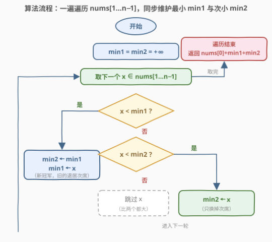

# 将数组分成最小总代价的子数组I

- **题目名称**：将数组分成最小总代价的子数组 I
- **链接**：[3010. 将数组分成最小总代价的子数组 I](https://leetcode.cn/problems/divide-an-array-into-subarrays-with-minimum-cost-i/)
- **难度**：简单
- **标签**：数组、枚举、排序

## 1. 题目概述

给你一个长度为 $n$ 的整数数组 `nums`。一个数组的**代价**是它的**第一个**元素（如 `[1,2,3]` 的代价是 `1`，`[3,4,1]` 的代价是 `3`）。

你需要将 `nums` 分成 `3` 个**连续且互不相交**的子数组，返回这些子数组的**最小**代价**总和**。

**示例 1**：

```text
输入：nums = [1,2,3,12]
输出：6
解释：最佳分割 [1] | [2] | [3,12]，总代价 1 + 2 + 3 = 6。
      对比 [1] | [2,3] | [12] 代价 1+2+12 = 15，
           [1,2] | [3] | [12] 代价 1+3+12 = 16。
```

**示例 2**：

```text
输入：nums = [5,4,3]
输出：12
解释：只能分成 [5] | [4] | [3]，总代价 5 + 4 + 3 = 12。
```

**示例 3**：

```text
输入：nums = [10,3,1,1]
输出：12
解释：最佳分割 [10,3] | [1] | [1]，总代价 10 + 1 + 1 = 12。
```

**约束条件**：

- $3 \le n \le 50$
- $1 \le \text{nums}[i] \le 50$

> ⚠️ 读题关键：「连续且互不相交」意味着 3 个子数组首尾相接、正好覆盖整个 `nums`——所以**第一个子数组必然以下标 0 开头**，这份代价想躲都躲不掉。

---

## 2. 解题思路

### 2.1 暴力思路：枚举两个切点

设第 2、3 个子数组的首元素下标分别为 $i$、$j$（$1 \le i < j \le n-1$），总代价就是 $\text{nums}[0] + \text{nums}[i] + \text{nums}[j]$。二重循环枚举所有 $(i, j)$ 对取最小，时间 $O(n^2)$。$n \le 50$ 时至多约 $1200$ 对，稳过——但看清代价结构后，可以一步到位做到 $O(n)$。

### 2.2 核心观察：代价结构 + 取最小两个

![核心概念：3 段各付首元素，nums[0] 固定入选](../images/p3010_split_concept.svg)

把总代价拆开看，三项里**有一项是死的**：

$$\text{总代价} = \underbrace{\text{nums}[0]}_{\text{固定}} + \text{nums}[i] + \text{nums}[j], \quad 1 \le i < j \le n-1$$

关键在于 $(i, j)$ 的选择**自由度是满的**——双向论证：

- **任意合法分割都对应某对 $i<j$**：3 段连续覆盖，第 2 段首下标 $i$、第 3 段首下标 $j$ 天然满足 $1 \le i < j \le n-1$；
- **任意 $1 \le i < j \le n-1$ 都对应合法分割**：取第 1 段 $[0, i-1]$、第 2 段 $[i, j-1]$、第 3 段 $[j, n-1]$，三段都非空且恰好拼满原数组。

于是「最小化总代价」等价于「在 $\text{nums}[1..n-1]$ 中任取两个不同下标的元素，使之和最小」——那当然就是**取最小的两个元素**（$n \ge 3$ 保证 `nums[1:]` 至少有两个元素）。排序取前两小，或一遍遍历维护「最小 + 次小」皆可，$O(n)$ / $O(1)$。

> 💡 **直觉**：切点切在哪根本不重要，重要的是每段「出头」的那个元素是谁。第 1 段的头被 `nums[0]` 锁死，剩下两个头随便挑——那就挑最便宜的两个。

### 2.3 算法流程图：一遍维护最小与次小



维护 `min1 ≤ min2`（最小、次小），遍历 `nums[1..n-1]`：

1. 若 `x < min1`：新冠军登顶，旧冠军退居次席（`min2 ← min1; min1 ← x`）；
2. 否则若 `x < min2`：只挤掉次席（`min2 ← x`）；
3. 否则跳过。

遍历结束返回 `nums[0] + min1 + min2`。

### 2.4 示例演算

![示例演算：nums=[10,3,1,1] 逐步维护 min1/min2](../images/p3010_example_walkthrough.svg)

以示例 3 `nums = [10,3,1,1]` 走一遍（候选序列为 `[3,1,1]`）：

| 步骤 | x | 判定 | min1 | min2 | 说明 |
|------|---|------|------|------|------|
| 初始 | — | — | +∞ | +∞ | 还没扫 `nums[1:]` |
| k=1 | 3 | `3 < +∞` ✓ | **3** | +∞ | 首个候选直接登顶 |
| k=2 | 1 | `1 < 3` ✓ | **1** | **3** | 新冠军，3 退居次席 |
| k=3 | 1 | `1 ≮ 1`，但 `1 < 3` ✓ | 1 | **1** | 并列最小也收下 |

最终答案 = `nums[0] + min1 + min2 = 10 + 1 + 1 = 12`，与示例一致。注意 k=3 这步：`x = min1` 时严格小于不成立，转走 `min2` 分支——**并列的两个最小值都能被收进来**。

---

## 3. 参考代码

### C++（一遍遍历维护最小两个）

```cpp
class Solution {
  public:
    int minimumCost(vector<int>& nums) {
        int min1 = INT_MAX, min2 = INT_MAX;   // min1 ≤ min2：最小与次小
        for (int i = 1; i < (int)nums.size(); ++i) {
            int x = nums[i];
            if (x < min1) {                    // 新冠军，旧冠军退居次席
                min2 = min1;
                min1 = x;
            } else if (x < min2) {             // 挤掉次席
                min2 = x;
            }
        }
        return nums[0] + min1 + min2;
    }
};
```

### Python（一遍遍历 + 排序一行版）

一遍遍历版（与 C++ 逻辑一致，$O(n)$ / $O(1)$）：

```python
class Solution:
    def minimumCost(self, nums: List[int]) -> int:
        min1 = min2 = float('inf')     # min1 ≤ min2
        for x in nums[1:]:
            if x < min1:               # 新冠军
                min1, min2 = x, min1
            elif x < min2:             # 新亚军
                min2 = x
        return nums[0] + min1 + min2
```

排序一行版（$n \le 50$，可读性优先时的惯用法）：

```python
class Solution:
    def minimumCost(self, nums: List[int]) -> int:
        return nums[0] + sum(sorted(nums[1:])[:2])
```

> 💡 一遍版天然支持流式输入且空间 $O(1)$；排序版把「取最小两个」的意图写得最直白。面试先给排序版说清思路，再升级成一遍版是标准节奏。

---

## 4. 复杂度分析

| 维度 | 复杂度 | 说明 |
|------|--------|------|
| 时间复杂度 | $O(n)$ | 一遍遍历 `nums[1..n-1]`，每个元素至多两次比较（排序版为 $O(n \log n)$） |
| 空间复杂度 | $O(1)$ | 只用 `min1` / `min2` 两个变量（排序版需 $O(n)$ 切片副本） |

---

## 5. 扩展：两个常见追问

**「干脆整个数组排序取前三个最小」为什么错？** `nums[0]` 是被**强制选中**的——第 1 个子数组必须从下标 0 开始，没得挑。反例 `nums = [10,3,1,1]`：排序取前三得 `1+1+3 = 5`，但正确答案是 `10+1+1 = 12`。约束优化的第一课：先看清哪些变量是自由的、哪些被锁死。

**数据放大版（3013）怎么办？** 本题是 [3013. 将数组分成最小总代价的子数组 II](../3001-3100/3013_将数组分成最小总代价的子数组II.md) 的小数据特例：II 把 $n$ 放大到 $10^5$、要分成 $k$ 段，还给切点加了「首下标跨度 $\le dist$」的窗口约束，一遍维护两个最值不再够用，需要**滑动窗口 + 双多重集**动态维护「窗口内最小的 $k-1$ 个元素之和」，$O(n \log n)$。这是典型的「I 暴力 / II 数据放大逼出单调性优化」双题套路，同 153/154（旋转数组找最小值）、875/1011 家族。

---

## 6. 面试要点

1. **为什么总代价里 `nums[0]` 是必选项？**

   - 3 个子数组必须**连续且互不相交**地覆盖整个数组，第 1 个子数组只能从下标 0 开始，其首元素恒为 `nums[0]`。这也是「整个数组取前三个最小」这种写法的错误根源。

2. **「在 `nums[1..n-1]` 取任意两个不同下标」为什么都对应合法分割？**

   - 双向论证：合法分割的第 2、3 段首下标天然是某对 $1 \le i < j \le n-1$；反过来给定任意 $i < j$，切出 $[0,i-1]$、$[i,j-1]$、$[j,n-1]$ 三段均非空且拼满原数组。所以最小化总和 ⟺ 取 `nums[1..]` 最小的两个元素。

3. **一遍维护 `min1`/`min2` 时，遇到 `x == min1` 会出问题吗？**

   - 不会。严格小于不成立则转 `min2` 分支，`min2 ← x` 把并列最小收进来（如示例 3 的两个 `1`）。把判定改成 `x <= min1` 也正确：`min2 ← min1; min1 ← x` 结果一致。等值安全性是这个模板的考点。

4. **更新顺序为什么是先判 `min1` 再判 `min2`，且换冠军时 `min2` 要接住旧 `min1`？**

   - 旧 `min1` 被顶下来后仍是「除新冠军外」的候选，必须降到次席而不是直接丢弃，否则次小信息丢失。先判大门槛再判小门槛，保证 `min1 ≤ min2` 的不变式始终成立。

5. **如果让你口述 $O(n^2)$ 到 $O(n)$ 的优化过程，怎么讲最顺？**

   - 先写代价表达式 `nums[0] + nums[i] + nums[j]`，指出 `nums[0]` 常数项；再证 $(i,j)$ 取值无额外约束（任意两个不同下标都合法）；于是目标函数与下标顺序无关，只剩「选两个最小的」——排序或一遍维护前两小，自然收尾。

---

## 7. 同类练习题

- [3013. 将数组分成最小总代价的子数组 II](https://leetcode.cn/problems/divide-an-array-into-subarrays-with-minimum-cost-ii/)（[题解](../3001-3100/3013_将数组分成最小总代价的子数组II.md)）：本题的数据放大版，滑窗 + 双多重集维护窗口内 k−1 最小之和
- [628. 三个数的最大乘积](https://leetcode.cn/problems/maximum-product-of-three-numbers/)：一遍维护最大三个与最小两个，同「线性维护前 k 个最值」模板
- [414. 第三大的数](https://leetcode.cn/problems/third-maximum-number/)：一遍维护前三大且要求去重，`min1`/`min2` 维护逻辑的进阶变体
- [2578. 最小和分割](https://leetcode.cn/problems/split-with-minimum-sum/)：排序后贪心组成两个数求最小和，同「排序取最小」家族的另一种玩法
