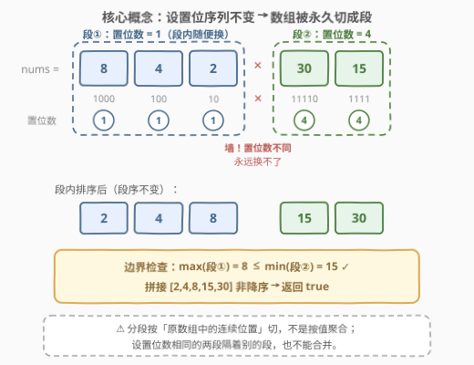
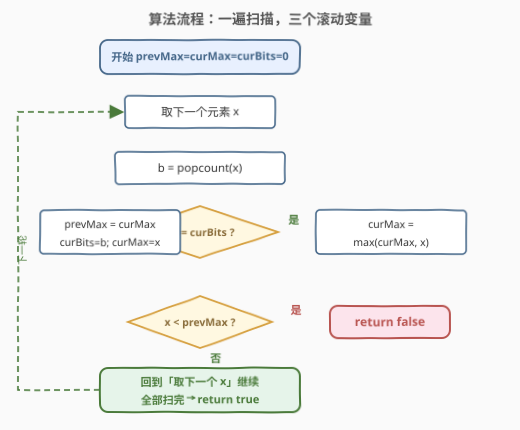
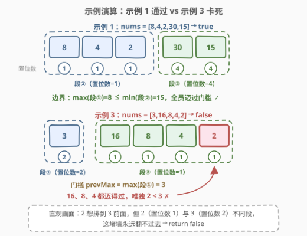

# LeetCode 判断一个数组是否可以变为有序 题解

## 1. 题目概述

- **标题 / 题号**：判断一个数组是否可以变为有序（#3011，medium）
- **链接**：https://leetcode.cn/problems/find-if-array-can-be-sorted/
- **难度**：中等
- **标签**：位运算、数组、排序

**题意**：给你一个下标从 **0** 开始且全是**正**整数的数组 `nums`。

一次**操作**中，如果两个**相邻**元素在二进制下**设定位**（二进制表示中 1 的个数，即 popcount）的数目**相同**，那么你可以将这两个元素交换。你可以执行这个操作**任意次**（也可以 0 次）。

如果你可以使数组变为**非降序**（非递减），返回 `true`，否则返回 `false`。

**示例 1**：

```text
输入：nums = [8,4,2,30,15]
输出：true
解释：2、4、8 都只有 1 个设置位（"10"、"100"、"1000"）；15 和 30 都有 4 个设置位（"1111"、"11110"）。
     通过 4 次交换可得到 [2,4,8,15,30]，数组有序，返回 true。
```

**示例 2**：

```text
输入：nums = [1,2,3,4,5]
输出：true
解释：数组已经是非降序的，0 次操作即可。
```

**示例 3**：

```text
输入：nums = [3,16,8,4,2]
输出：false
解释：无法通过操作使数组变为非降序。
```

**约束**：

- $1 \le \text{nums.length} \le 100$
- $1 \le \text{nums}[i] \le 2^8$

> 💡 读题关键：能交换的条件只有一条——**相邻** 且 **设置位数相同**。这条限制决定了每个元素的「活动范围」，也是本题全部推理的起点。

## 2. 解题思路

### 2.1 暴力思路：受限冒泡模拟到底

把冒泡排序的交换条件改一改：当 $\text{nums}[i] > \text{nums}[i+1]$ 且两者设置位数相同时才交换。反复扫描数组直到某一轮没有任何交换（到达**不动点**），再检查数组是否非降序。

正确性直觉：每次交换都严格减少一个逆序对（交换条件含 `>`），总交换次数不超过 $\binom{n}{2}$，过程必然终止；终止时每个「同设置位数的连续段」内部已被排好（段内交换全部合法，冒泡对每段独立生效），此时再不有序就是永远无解。时间 $O(n^2) \sim O(n^3)$，$n \le 100$ 能过，但完全没抓住结构——正解只要一遍扫描。

### 2.2 核心观察：设置位序列不变 → 按 popcount 永久分段



三步推理：

1. **设置位序列是不变量**。一次交换发生在两个设置位数**相等**的相邻元素之间——把两个相等的值互换，数组每个位置上的设置位数丝毫不变。无论换多少次，`popcount(nums[i])` 组成的序列 $b_0, b_1, \dots, b_{n-1}$ 永远是原来那串。
2. **段边界永久固定**。$b$ 序列中发生「跳变」的位置（$b_i \ne b_{i+1}$）永远不变，于是数组被永久切成若干**极大同位段**：每段是一串设置位数相同的连续元素。不同段的元素**永远无法越过对方**——越界必须和设置位数不同的元素交换，而这被禁止。
3. **段内可以任意重排**。段内任意相邻对设置位数都相同、都可交换，冒泡排序可达段内**任意排列**。

> 💡 **充要条件**：数组可排序 $\iff$ 把每段内部各自排序后、按原顺序拼接的结果非降序 $\iff$ 对每条段边界，**前段最大值 $\le$ 后段最小值**。段内怎么排不影响这个判定。

> ⚠️ 常见误区：以为是「按设置位数分组，同组元素全局乱蹿」。分组不是按值聚合，而是按**原数组中的连续位置**切开——示例 2 里 `[1,2] | [3] | [4] | [5]` 被切成 4 段，设置位数 1、1、2、1、2 交错出现，隔着别的段的同位数元素也**不能**合并到一起。

### 2.3 算法流程：一遍扫描 + 滚动段极值



不需要显式切分出段，只维护三个变量：

- `curBits`：当前段的设置位数；
- `curMax`：当前段的最大值；
- `prevMax`：**紧邻前一段**的最大值，即当前段所有元素要迈过的「门槛」。

对每个元素 `x`：算出 `b = popcount(x)`；若 `b != curBits` 说明跨过段边界，先把旧段的 `curMax` 移交给 `prevMax`，再开新段；随后若 `x < prevMax`，说明 x 被前段的最大值死死压住又跨不过去，直接返回 `false`。扫完全程返回 `true`。

> 💡 **为什么只需和紧邻前一段的 max 比**：链式传递——通过检查的段满足「后段所有元素 $\ge$ 前段 max」，归纳可得前段 max $\ge$ 更早所有段的元素，所以单一门槛就足够。用「全局历史 max」写也对，只是没必要。

### 2.4 示例演算



**示例 1** `nums = [8,4,2,30,15]`：

| 步骤 | x | popcount | 段动作 | prevMax | curMax | 检查 x < prevMax |
|------|---|----------|--------|---------|--------|------------------|
| 1 | 8  | 1 | 开新段（bits=1） | 0  | 8  | 否 |
| 2 | 4  | 1 | 段内，curMax 不变 | 0  | 8  | 否 |
| 3 | 2  | 1 | 段内，curMax 不变 | 0  | 8  | 否 |
| 4 | 30 | 4 | 开新段（bits=4） | **8**  | 30 | 否（30 ≥ 8） |
| 5 | 15 | 4 | 段内 | 8  | 30 | 否（15 ≥ 8） |

扫完返回 `true`。段内排序后拼起来正是 `[2,4,8,15,30]`。

**示例 3** `nums = [3,16,8,4,2]`：

| 步骤 | x | popcount | 段动作 | prevMax | curMax | 检查 x < prevMax |
|------|---|----------|--------|---------|--------|------------------|
| 1 | 3  | 2 | 开新段（bits=2） | 0  | 3  | 否 |
| 2 | 16 | 1 | 开新段（bits=1） | **3**  | 16 | 否 |
| 3 | 8  | 1 | 段内 | 3  | 16 | 否 |
| 4 | 4  | 1 | 段内 | 3  | 16 | 否 |
| 5 | 2  | 1 | 段内 | 3  | 16 | **是（2 < 3）→ false** |

直观画面：`2` 想排到 `3` 前面，但 `2`（设置位数 1）永远跨不过 `3`（设置位数 2）这堵墙，返回 `false`。

## 3. 参考代码

### C++（一遍扫描）

```cpp
class Solution {
  public:
    bool canSortArray(vector<int>& nums) {
        int prevMax = 0;   // 紧邻前一段的最大值（当前段的门槛）
        int curMax = 0;    // 当前段的最大值
        int curBits = 0;   // 当前段的设置位数；正整数 popcount >= 1，
                           // 初值 0 保证首个元素必然触发"开新段"
        for (int x : nums) {
            int b = __builtin_popcount(x);
            if (b != curBits) {              // 跨过段边界：新段开张
                prevMax = curMax;            // 旧段最大值成为新门槛
                curBits = b;
                curMax = x;
            } else {
                curMax = max(curMax, x);     // 段内更新最大值
            }
            if (x < prevMax) return false;   // 被前段 max 压住且跨不过去
        }
        return true;
    }
};
```

### Python（一遍扫描 + groupby 分段版）

一遍扫描版（与 C++ 逻辑一致）：

```python
class Solution:
    def canSortArray(self, nums: List[int]) -> bool:
        prev_max, cur_max, cur_bits = 0, 0, 0
        for x in nums:
            b = x.bit_count()          # Python 3.10+；低版本用 bin(x).count('1')
            if b != cur_bits:          # 跨段：旧段 max 变门槛
                prev_max, cur_max, cur_bits = cur_max, x, b
            else:
                cur_max = max(cur_max, x)
            if x < prev_max:
                return False
        return True
```

`groupby` 显式分段版（语义与 2.2 的推导逐字对应，可读性最好）：

```python
class Solution:
    def canSortArray(self, nums: List[int]) -> bool:
        prev_max = 0
        for bits, group in groupby(nums, key=lambda x: x.bit_count()):
            seg = list(group)
            if min(seg) < prev_max:    # 前段最大值 > 后段最小值 → 卡死
                return False
            prev_max = max(prev_max, max(seg))
        return True
```

> 💡 两个版本复杂度同阶。groupby 版把「分段」写在了明面上，适合向面试官解释推导；一遍版把分段折叠进循环，是终态写法。

## 4. 复杂度分析

| 维度 | 复杂度 | 说明 |
|------|--------|------|
| 时间复杂度 | $O(n)$ | 一遍扫描；每个元素一次 popcount（值域 $\le 2^8$，仅 8 位，$O(1)$）加常数次比较 |
| 空间复杂度 | $O(1)$ | 仅 `prevMax` / `curMax` / `curBits` 三个滚动变量；groupby 版为 $O(n)$（段列表） |

其中 $n = \text{len(nums)}$。即使 $n$ 放大到 $10^6$、值域放到 64 位，一遍扫描依然线性。

## 5. 扩展：变体与推广

**变体一：允许交换任意距离的同位数元素（不限相邻）会怎样？** 位置上的设置位序列依旧不变（互换两个相等值），但元素可以在**同设置位数的不同段**之间跳转了——每个设置位数 $k$ 的值集合（全局多重集）不变，可填进任何"设置位数为 $k$ 的位置"。判定条件随之改变：把每个位数类的值升序填回该类对应的位置序列，检查整体是否非降。可见「必须相邻」这一条件并不是装饰，它把活动范围从"同类全局"压缩到了"同段局部"。

**变体二：要求严格递增而非非降序？** 段内排序后不仅要段间非降，还要段内无重复且段边界取严格不等号：$\max(\text{前段}) < \min(\text{后段})$。相同的值必然设置位数相同（永远可换），但严格递增不允许它们相邻共存，判定更紧。

**popcount 的姿势**：C++ 用 `__builtin_popcount`（编译器内建，多数平台映射到 POPCNT 指令）；Python 3.10+ 用 `int.bit_count()`，低版本 `bin(x).count('1')`；Java 用 `Integer.bitCount(x)`。本题值域只有 8 位，任何写法都是常数，不必炫技。

## 6. 面试要点

1. **为什么设置位序列是不变量？交换会改变它吗？**

   - 交换仅发生在设置位数**相等**的相邻元素之间，等于互换两个相等的值——每个位置的设置位数纹丝不动。因此跳变位置（段边界）永久固定，这是全部推理的地基。

2. **为什么段内可以达到任意排列？**

   - 段内任意相邻对的设置位数都相同、都可交换；冒泡排序靠相邻交换消除逆序对，可生成段内任意目标排列。所以段内排序是「免费」的，唯一约束在段与段之间。

3. **为什么「前段最大值 ≤ 后段最小值」是充要条件？**

   - 可达的最终形态恰好是「各段内部任意重排、段序不变」的全部排列，其中字典上能非降的形态存在 $\iff$ 每段内部排好序后拼接非降 $\iff$ 每条边界处前缀最大值 $\le$ 后段最小值。必要性：段的先后次序无法改变；充分性：直接取「段内升序拼接」这个构造。

4. **一遍扫描里 `prevMax` 只记紧邻前一段的 max，为什么不维护全局历史 max？**

   - 链式传递：通过检查的段满足「后段全部元素 $\ge$ 前段 max」，归纳可得前段 max $\ge$ 更早所有元素。当然用全局 max 写也正确，只是信息冗余。

5. **本题与「模拟交换到不动点」的暴力解是什么关系？**

   - 暴力到达的不动点恰好就是「每段内部有序」的形态——段间交换从未被尝试也永不可能。正解相当于**直接推理出不动点长什么样**，把 $O(n^2)$ 的模拟压缩成 $O(n)$ 的判定。

## 同类练习题

| # | 题目 | 与本题的关联 |
|---|------|-------------|
| 191 | [位 1 的个数](https://leetcode.cn/problems/number-of-1-bits/) | popcount 基本功，本题每一步的「原子操作」 |
| 338 | [比特位计数](https://leetcode.cn/problems/counting-bits/) | $O(n)$ 批量求 $1 \sim n$ 每个数的设置位数（DP 递推），popcount 进阶 |
| 2980 | [检查按位或是否存在尾随零](https://leetcode.cn/problems/check-if-bitwise-or-has-trailing-zeros/) | 数组上的按位运算判定题，同属「位运算 + 数组」标签的小清新组合 |
| 75 | [颜色分类](https://leetcode.cn/problems/sort-colors/) | 受限操作下的一趟原地排序，「带约束的排序」家族近亲 |
| 912 | [排序数组](https://leetcode.cn/problems/sort-an-array/) | 自由排序的母题；本题是「排序自由度被设置位数切段」之后的判定版 |
