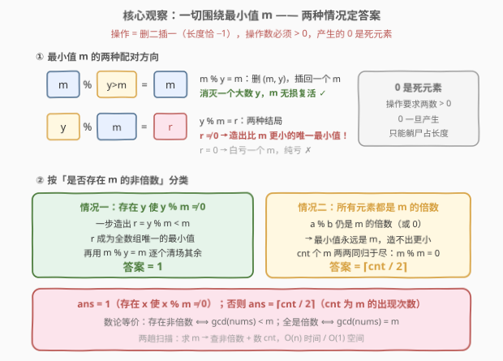
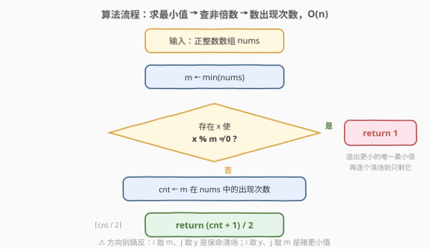

# LeetCode 通过操作使数组长度最小 题解

## 1. 题目概述

- **标题 / 题号**：通过操作使数组长度最小（#3012，medium）
- **链接**：https://leetcode.cn/problems/minimize-length-of-array-using-operations/
- **难度**：中等
- **标签**：贪心、数组、数学、数论

**题意**：给定下标从 0 开始、只含**正**整数的数组 `nums`。每次操作选择两个**不同**的下标 $i$ 和 $j$（要求 $\text{nums}[i] > 0$ 且 $\text{nums}[j] > 0$）：

1. 将结果 $\text{nums}[i] \bmod \text{nums}[j]$ 插入 `nums` 的**末尾**；
2. 删除下标 $i$ 和 $j$ 处的元素。

可以进行**任意次**操作（可以是 0 次）。返回操作后 `nums` 的**最小长度**。

**示例 1**：

```text
输入：nums = [1,4,3,1]
输出：1
解释：m = 1 是最小值且所有元素都是 1 的倍数，cnt = 2 → ⌈2/2⌉ = 1。
      一种等价消法：1%4=1 消掉 4，1%3=1 消掉 3，剩 [1,1]；再 1%1=0 → [0]，长度 1。
```

**示例 2**：

```text
输入：nums = [5,5,5,10,5]
输出：2
解释：m = 5，10 % 5 = 0，全是 5 的倍数，cnt = 4 → ⌈4/2⌉ = 2。
```

**示例 3**：

```text
输入：nums = [2,3,4]
输出：1
解释：m = 2，而 3 % 2 = 1 ≠ 0 → 存在 m 的非倍数，能造出更小的唯一最小值，答案 1。
```

**约束**：

- $1 \le \text{nums.length} \le 10^5$
- $1 \le \text{nums}[i] \le 10^9$

## 2. 解题思路

### 2.1 暴力思路

每次操作「删二插一」，长度**恰好减 1**，因此最小化长度等价于**最大化操作次数**：答案 $= n - T_{\max}$。但每一步有 $O(n^2)$ 种下标选法、操作次数可达 $n-1$，搜索空间指数爆炸；$n = 10^5$ 下连模拟单条序列的意义都不大。

> 💡 **转换视角**：与其问「怎么一步步操作」，不如问「什么终局可达、什么终局不可达」——找**不变量**，一步到位推断终局长度。

### 2.2 核心观察：围绕最小值 m 的分类讨论



设 $m = \min(\text{nums})$。一切由「m 与谁配对、谁当模数」决定，只有两个本质不同的方向：

- **方向 A（m 当被模数：$i$ 取 $m$、$j$ 取 $y > m$）**：插入 $m \bmod y = m$。净效果是**消灭一个大数 $y$，m 无损复活**。所有大于 $m$ 的元素都能被这样逐个「白送」消灭。
- **方向 B（m 当模数：$i$ 取 $y$、$j$ 取 $m$）**：插入 $y \bmod m$。若 $y \bmod m \ne 0$，就造出**比 $m$ 更小的新最小值** $r$，且 $r$ 是全数组唯一的最小值（其余元素都 $\ge m > r$），随后用方向 A 逐个清场，终局只剩 $[r]$；若 $y \bmod m = 0$，则白牺牲一个 $m$ 换来一个死 0，纯亏。

于是全局只分两种情况：

**情况一：存在 $y$ 使 $y \bmod m \ne 0$ → 答案 1**。一步造出唯一最小值 $r$，再逐对 $(r, z)$ 执行 $r \bmod z = r$ 消灭其余 $n-2$ 个元素，终局 $[r]$。而长度恒 $\ge 1$（每次操作都插入一个元素），1 已是下界。

**情况二：所有元素都是 $m$ 的倍数，设 $m$ 出现 $\text{cnt}$ 次 → 答案 $\lceil \text{cnt}/2 \rceil$**。

- **不变量**：对任意两个 $m$ 的正倍数 $a = pm$、$b = qm$，有 $a \bmod b = (p \bmod q) \cdot m$——取模结果要么是 0，要么仍是 $\ge m$ 的 $m$ 的倍数。所以**最小值永远是 $m$，谁也造不出更小的数**。
- **可达性**：先用方向 A 白送消灭全部 $n - \text{cnt}$ 个大数；剩下 $\text{cnt}$ 个 $m$ 两两配对执行 $m \bmod m = 0$，每对产出一个**死 0**（不能再参与任何操作，但占长度）。最终剩 $\text{cnt} \bmod 2$ 个 $m$ 和 $\lfloor \text{cnt}/2 \rfloor$ 个 0，总长恰为 $\lceil \text{cnt}/2 \rceil$。
- **下界**：$\lceil \text{cnt}/2 \rceil$ 无法再小，证明见第 5 节。

> ⚠️ **0 也占长度**：操作要求两个操作数 $> 0$，0 一旦产生只能「躺尸」，但它始终是数组的一员。别把死 0 误当成消失了。

> 💡 $\text{cnt} = 1$ 且全为倍数时公式给出 $\lceil 1/2 \rceil = 1$，与情况一口径一致——「唯一的最小值总能清场到只剩自己」，无需特判。

### 2.3 算法流程图



一趟求最小值，一趟「查非倍数 + 数出现次数」，$O(n)$ 直接出答案。注意判断分支只看「是否存在 $x$ 使 $x \bmod m \ne 0$」——$x = m$ 时 $m \bmod m = 0$ 自然不计入。

### 2.4 示例演算

![示例演算：nums=[5,5,5,10,5]](../images/p3012_example_walkthrough.svg)

以示例 2 `nums = [5,5,5,10,5]` 走完情况二的完整流程：$m = 5$ 出现 4 次，$10 \bmod 5 = 0$，没有非倍数 → 情况二：

| 步骤 | 操作 | 数组 | 说明 |
|------|------|------|------|
| 初始 | — | `[5,5,5,10,5]` | 大数只有 10 |
| 操作① | $5 \bmod 10 = 5$ | `[5,5,5,5]` | 方向 A 白送消灭 10，m 数量不减 |
| 操作② | $5 \bmod 5 = 0$ | `[5,5,0]` | 两个 m 同归于尽，产出死 0 |
| 操作③ | $5 \bmod 5 = 0$ | `[0,0]` | 只剩死 0，无法再操作 |

终局长度 $2 = \lceil 4/2 \rceil$ ✓。对照示例 3 `[2,3,4]`：$3 \bmod 2 = 1 \ne 0$ → 情况一，答案 1。

## 3. 参考代码

### C++

```cpp
class Solution {
  public:
    int minimumArrayLength(vector<int>& nums) {
        int m = *min_element(nums.begin(), nums.end());
        for (int x : nums)
            if (x % m) return 1;          // 存在 m 的非倍数：造出更小的唯一最小值
        int cnt = count(nums.begin(), nums.end(), m);
        return (cnt + 1) / 2;             // 全是倍数：cnt 个 m 两两同归于尽
    }
};
```

### Python

```python
class Solution:
    def minimumArrayLength(self, nums: List[int]) -> int:
        m = min(nums)
        if any(x % m for x in nums):      # 存在 m 的非倍数
            return 1                      # → 造出更小的唯一最小值，清场到 1
        return (nums.count(m) + 1) // 2   # 全是倍数 → m 两两配对，⌈cnt/2⌉
```

> 💡 `(cnt + 1) / 2` 是整数写法的 $\lceil \text{cnt}/2 \rceil$。中途一旦发现非倍数即可提前 `return 1`，无需数完 cnt。

## 4. 复杂度分析

| 维度 | 复杂度 | 说明 |
|------|--------|------|
| 时间复杂度 | $O(n)$ | 求 min 一趟、查非倍数 + 数 cnt 至多一趟线性扫描 |
| 空间复杂度 | $O(1)$ | 只用常数个变量 |

> 💡 $n \le 10^5$、$\text{nums}[i] \le 10^9$：取模结果不超过被模数，全程 `int` 无溢出风险。

## 5. 扩展：情况二下界 $\lceil \text{cnt}/2 \rceil$ 的证明

情况二中，任何时刻每个元素都属于 $\{0\} \cup \{m \text{ 的正倍数}\}$（归纳：$a = pm,\ b = qm \Rightarrow a \bmod b = (p \bmod q)\,m$；0 不再参与操作）。把大于 $m$ 的倍数称为**大数**，按操作数类型穷举所有操作的影响：

| 操作 | 大数个数 $y$ | $m$ 的个数 $c$ | 0 的个数 $z$ |
|------|------|------|------|
| $(m, y) \to m$ | $-1$ | $\pm 0$ | $\pm 0$ |
| $(y, m) \to 0$ | $-1$ | $-1$ | $+1$（纯亏，被上行支配） |
| $(m, m) \to 0$ | $\pm 0$ | $-2$ | $+1$（**唯一直接消耗 m 的操作**） |
| $(y_1, y_2) \to 0$ / $\to m$ / $\to$ 大数 | $-2$ / $-2$ / $-1$ | $+1$ / $\pm 0$ | $+1$ / $\pm 0$ |

设总操作次数 $T$，其中 $(m,m)$ 型 $T_2$ 次、$(y_1,y_2) \to m$ 型 $k$ 次。两条**预算约束**：

1. 除 $(m,m)$ 外每种操作都让大数**净减至少 1**，其中 $(y_1,y_2) \to m$ 型净减 2；大数从 $n - \text{cnt}$ 出发且始终 $\ge 0$，故
   $$(T - T_2) + k \le n - \text{cnt}.$$
2. $m$ 的副本只被 $(m,m)$ 消耗（每次 $-2$），补充只来自 $(y_1,y_2) \to m$（每次 $+1$，且花掉 2 个大数）；$c$ 始终 $\ge 0$，故
   $$2 T_2 \le \text{cnt} + k.$$

两式相加：

$$T = (T - T_2) + T_2 \le (n - \text{cnt} - k) + \left\lfloor \frac{\text{cnt} + k}{2} \right\rfloor \le (n - \text{cnt}) + \left\lfloor \frac{\text{cnt}}{2} \right\rfloor,$$

末步对任意 $k \ge 0$ 成立（$\lfloor (\text{cnt}+k)/2 \rfloor - k \le \lfloor \text{cnt}/2 \rfloor$）。于是最终长度

$$n - T \ \ge\ \text{cnt} - \left\lfloor \frac{\text{cnt}}{2} \right\rfloor = \left\lceil \frac{\text{cnt}}{2} \right\rceil,$$

与 2.2 节的构造互相印证。∎

> 💡 **gcd 视角**：「所有元素都是 $m$ 的倍数」$\iff \gcd(\text{nums}) = m$（因 $m$ 在数组中，$g \mid m$，故 $g \le m$；全为倍数时 $m \mid g$）。因此等价写法：$g = \gcd(\text{nums})$，$g < m$ 时答案 1，$g = m$ 时答案 $\lceil \text{cnt}/2 \rceil$。

## 6. 面试要点

1. **为什么最小化长度等价于最大化操作次数？长度可能变成 0 吗？**

   - 每次操作删二插一，长度恰好 $-1$，且可操作 0 次，故答案 $= n - T_{\max}$。每次操作都会插入一个元素，长度恒 $\ge 1$，不可能变成 0。

2. **怎么想到盯住最小值 $m$？**

   - 取模对「小模大 / 大模小」天然不对称：$m \bmod y = m$（小模大不变，保命清场），$y \bmod m$ 才可能变小。最小值因此支配全局：要么当被模数无损清场，要么当模数赌出更小值。

3. **情况一为什么答案恰是 1？**

   - 先用 $(y, m)$ 造出 $r = y \bmod m \in (0, m)$，它是全数组唯一最小值；再对每个其余元素 $z$ 执行 $r \bmod z = r$ 逐个消灭。终局 $[r]$，共 $n - 1$ 次操作，已达长度下界 1。

4. **情况二为什么不能比 $\lceil \text{cnt}/2 \rceil$ 更小？$(y_1, y_2)$ 配对不是能凭空造出新 m 吗？**

   - 能（如 $6 \bmod 4 = 2$ 会多出一个 $m = 2$），但每个新 m 花掉 2 个大数，而大数本来就能被 m 白送消灭。预算论证（第 5 节）表明任何操作序列 $T \le (n - \text{cnt}) + \lfloor \text{cnt}/2 \rfloor$。

5. **这题和 gcd 有什么联系？实现上有什么坑？**

   - 「存在 $m$ 的非倍数」$\iff \gcd(\text{nums}) < m$，可先求整体 gcd 再比较。坑：0 占长度但不能再参与操作（操作数必须 $> 0$）；$\text{cnt} = 1$ 且全倍数时公式恰为 1，无需特判。

## 同类练习题

| # | 题目 | 与本题的关联 |
|---|------|-------------|
| 2870 | [使数组为空的最少操作次数](https://leetcode.cn/problems/minimum-number-of-operations-to-make-array-empty/) | 同为「按值统计频次 + 配对消除 + $\lceil \cdot/2 \rceil$ 式计数」的 O(n) 贪心 |
| 2244 | [完成所有任务需要的最少轮数](https://leetcode.cn/problems/minimum-rounds-to-complete-all-tasks/) | 频次 + 每轮消 2/3 的配对计数，与 2870 同骨架 |
| 914 | [卡牌分组](https://leetcode.cn/problems/x-of-a-kind-in-a-deck-of-cards/) | 判定所有频次的 gcd 是否 ≥ 2，同属数论 + 哈希计数家族 |
| 1979 | [找出数组的最大公约数](https://leetcode.cn/problems/find-greatest-common-divisor-of-array/) | 数组 min/max 求 gcd，「最小值 + 数论」小热身 |
| 2807 | [在链表中插入最大公约数](https://leetcode.cn/problems/insert-greatest-common-divisors-in-linked-list/) | 相邻节点插 gcd，gcd 模拟基本功 |
