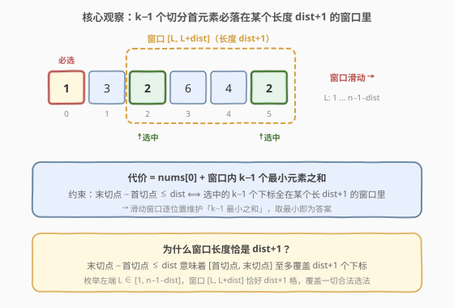
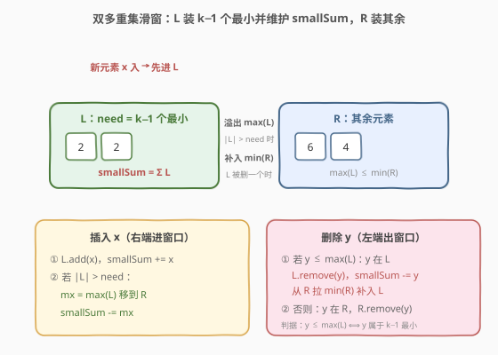

# LeetCode 将数组分成最小总代价的子数组II 题解

## 1. 题目概述

- **标题 / 题号**：将数组分成最小总代价的子数组 II（#3013，hard）
- **链接**：https://leetcode.cn/problems/divide-an-array-into-subarrays-with-minimum-cost-ii/
- **难度**：困难
- **标签**：数组、滑动窗口、有序集合、双多重集、堆

**题意**：给定下标从 0 开始、长度为 $n$ 的整数数组 `nums` 与两个**正**整数 `k` 和 `dist`。一个数组的**代价**是其中的**第一个**元素（如 `[1,2,3]` 代价为 `1`，`[3,4,1]` 代价为 `3`）。

将 `nums` 分割成 `k` 个**连续且互不相交**的子数组：

```text
nums[0..i₁-1], nums[i₁..i₂-1], ..., nums[iₖ₋₁..n-1]
```

需满足**第 2 个子数组首元素下标**与**第 k 个子数组首元素下标**的距离不超过 `dist`，即 $i_{k-1} - i_1 \le dist$。返回这些子数组的**最小总代价**。

> 总代价 = `nums[0] + nums[i₁] + nums[i₂] + ... + nums[iₖ₋₁]`：每个子数组各贡献一个首元素，共 k 个；其中第一个恒为 `nums[0]`，无需选择。

**示例 1**：

```text
输入：nums = [1,3,2,6,4,2], k = 3, dist = 3
输出：5
解释：最优分割 [1,3] | [2,6,4] | [2]，切点首元素下标 i₁=2, i₂=5。
     i₂ - i₁ = 5 - 2 = 3 ≤ dist ✓。代价 = nums[0]+nums[2]+nums[5] = 1+2+2 = 5。
```

**示例 2**：

```text
输入：nums = [10,1,2,2,2,1], k = 4, dist = 3
输出：15
解释：最优分割 [10]|[1]|[2]|[2,2,1]，切点 i₁=1, i₂=2, i₃=3。
     i₃ - i₁ = 3 - 1 = 2 ≤ dist ✓。代价 = 10+1+2+2 = 15。
     而 [10]|[1]|[2,2,2]|[1] 非法：i₃ - i₁ = 5 - 1 = 4 > dist。
```

**示例 3**：

```text
输入：nums = [10,8,18,9], k = 3, dist = 1
输出：36
解释：最优分割 [10]|[8]|[18,9]，切点 i₁=1, i₂=2。
     i₂ - i₁ = 2 - 1 = 1 ≤ dist ✓。代价 = 10+8+18 = 36。
```

**约束**：

- $3 \le n \le 10^5$
- $1 \le \text{nums}[i] \le 10^9$
- $3 \le k \le n$
- $k - 2 \le dist \le n - 2$

> 💡 `dist ≥ k - 2` 保证可行性：k−1 个切点下标的最小跨度为 $k-2$（取 $1,2,\dots,k-1$），`dist ≥ k-2` 时总能塞进一个长 `dist+1` 的窗口。

## 2. 解题思路

### 2.1 暴力思路

在 $n-1$ 个相邻间隙里选 $k-1$ 个切点位置 $1 \le i_1 < i_2 < \dots < i_{k-1} \le n-1$，要求 $i_{k-1} - i_1 \le dist$，最小化 $\sum_j \text{nums}[i_j]$。组合数 $\binom{n-1}{k-1}$ 在 $n=10^5$ 时是天文数字，必然超时。

换个角度：总代价 = `nums[0]` +（后 k−1 个切点首元素之和）。`nums[0]` 固定，只需最小化后 k−1 个切点元素之和。**约束只限制了这 k−1 个下标的「跨度」**——它们必须全部落在某个长度 `dist+1` 的窗口里。

### 2.2 核心观察：滑动窗口 + 维护 k−1 最小



关键转化：

- 约束 $i_{k-1} - i_1 \le dist$ 等价于「这 k−1 个切点下标全部落在某个长度为 `dist+1` 的连续窗口内」。
- 既然只需最小化这 k−1 个元素之和，**固定一个长 `dist+1` 的窗口后，最优选法就是取窗口内最小的 k−1 个元素**。
- 把窗口从左到右滑动（左端 $L \in [1,\ n-1-dist]$），对每个窗口位置求「k−1 最小元素之和」，取所有位置的最小值，加 `nums[0]` 即答案。

> 💡 **正确性双向夹逼**：任一合法选法（跨度 ≤ dist）必被某个窗口 $[i_1,\ i_1+dist]$ 完整覆盖，故其和 ≥ 该窗口的 k−1 最小之和；而「某窗口的 k−1 最小」本身也是一组合法切点（跨度 ≤ dist）。两者结合，$\min\limits_{\text{窗口}}(\text{k−1 最小之和})$ 恰为最优。

实现上，等价于「右端 `right` 从 1 滑到 n−1，窗口始终为 $[\max(1,\ \text{right}-\text{dist}),\ \text{right}]$」——这样自然处理右边界，且每步只新增 `nums[right]`、剔除 `nums[right-dist-1]`（若该下标 ≥ 1，即已滑出窗口）。

### 2.3 算法流程图：双多重集滑窗



窗口里至多 `dist+1` 个元素，要**动态维护其中最小的 k−1 个之和**。用两个有序集合：

- `L`：装窗口里最小的 `need = k−1` 个元素，并维护 `smallSum = ΣL`。
- `R`：装窗口里其余元素。
- 不变式：`max(L) ≤ min(R)`，`|L| = need`（窗口元素不足 need 时 `|L|` 随之不足）。

每步 `right`：

1. **插入 `x = nums[right]`**：先入 `L`，`smallSum += x`；若 `|L| > need`，把 `max(L)` 溢出到 `R`，`smallSum` 减去它。
2. **剔除 `y = nums[right-dist-1]`**（若下标 ≥ 1，即窗口左端滑出）：判据 `y ≤ max(L)` ⟺ `y` 属于 k−1 最小 ⟺ `y` 在 `L` 中。
   - `y` 在 `L`：从 `L` 删 `y`，`smallSum -= y`，再从 `R` 拉 `min(R)` 补入 `L`（维持 `|L| = need`）。
   - `y` 在 `R`：直接从 `R` 删 `y`。
3. **更新答案**：当 `right ≥ need`（窗口已含 ≥ k−1 个元素），`ans = min(ans, smallSum)`。

> ⚠️ **判据为何是 `y ≤ max(L)`**：`L` 始终是当前窗口的「need 个最小」，所以 `y ≤ max(L)` 当且仅当 `y` 是这 need 个最小之一（含等于边界值的情况——边界值的副本可能横跨 `L/R`，但只要 `y ≤ max(L)` 就保证 `L` 中至少有一份 `y` 可删）。这条性质让「该从 `L` 删还是 `R` 删」一比较即定，无需额外标记。

### 2.4 示例演算

![示例演算：nums=[1,3,2,6,4,2], k=3, dist=3](../images/mincost2_example_walkthrough.svg)

以示例 1 `nums=[1,3,2,6,4,2], k=3, dist=3`（`need=2`，窗口长 4）走右端滑动：

| right | 窗口下标 | 窗口元素 | L（2 最小） | smallSum | ans |
|-------|----------|----------|------------|----------|-----|
| 2 | [1,2] | 3, 2 | {2, 3} | 5 | 5 |
| 3 | [1,3] | 3, 2, 6 | {2, 3} | 5 | 5 |
| 4 | [1,4] | 3, 2, 6, 4 | {2, 3} | 5 | 5 |
| **5** | **[2,5]** | **2, 6, 4, 2** | **{2, 2}** | **4** | **4** |

`right=5` 时窗口左端滑过 `nums[1]=3`，新窗口 `[2,5]` 内 2 最小为 `{2,2}`，`smallSum` 由 5 降到 4。最终代价 = `nums[0] + 4 = 1 + 4 = 5`。

## 3. 参考代码

### C++（multiset）

```cpp
class Solution {
  public:
    long long minimumCost(vector<int>& nums, int k, int dist) {
        int n = nums.size();
        int need = k - 1;                   // 除 nums[0] 外还要选 need 个首元素
        multiset<long long> L, R;           // L：need 个最小；R：其余
        long long smallSum = 0, ans = LLONG_MAX;
        for (int right = 1; right < n; ++right) {
            long long x = nums[right];
            L.insert(x);
            smallSum += x;
            if ((int)L.size() > need) {     // L 超量，把最大者溢出到 R
                auto it = prev(L.end());
                smallSum -= *it;
                R.insert(*it);
                L.erase(it);
            }
            int outIdx = right - dist - 1;  // 滑出窗口左端的下标
            if (outIdx >= 1) {
                long long y = nums[outIdx];
                if (!L.empty() && y <= *L.rbegin()) {   // y 在 L 中
                    L.erase(L.find(y));
                    smallSum -= y;
                    if (!R.empty()) {                   // 从 R 补最小者上来
                        auto it = R.begin();
                        smallSum += *it;
                        L.insert(*it);
                        R.erase(it);
                    }
                } else {                                // y 在 R 中
                    R.erase(R.find(y));
                }
            }
            if (right >= need) ans = min(ans, smallSum);
        }
        return nums[0] + ans;
    }
};
```

### Python（SortedList）

```python
from sortedcontainers import SortedList

class Solution:
    def minimumCost(self, nums: List[int], k: int, dist: int) -> int:
        n = len(nums)
        need = k - 1
        L = SortedList()   # need 个最小
        R = SortedList()   # 其余
        smallSum = 0
        ans = float('inf')
        for right in range(1, n):
            x = nums[right]
            L.add(x)
            smallSum += x
            if len(L) > need:          # L 超量，把最大者溢出到 R
                mx = L.pop(-1)
                smallSum -= mx
                R.add(mx)
            outIdx = right - dist - 1  # 滑出窗口左端的下标
            if outIdx >= 1:
                y = nums[outIdx]
                if L and y <= L[-1]:   # y 在 L 中
                    L.remove(y)
                    smallSum -= y
                    if R:              # 从 R 补最小者上来
                        mn = R.pop(0)
                        L.add(mn)
                        smallSum += mn
                else:                  # y 在 R 中
                    R.remove(y)
            if right >= need:
                ans = min(ans, smallSum)
        return nums[0] + ans
```

> 💡 LeetCode Python 环境自带 `sortedcontainers`。若你的评测机不支持，可用「双堆 + 懒删除」等价实现（见第 5 节），逻辑与上面完全同构。

> ⚠️ **两个易错点**：
> 1. **先插入后剔除**：先加入 `nums[right]` 再剔除滑出的 `nums[right-dist-1]`，临时多一个元素不影响答案——答案在两步都完成后才更新，此时窗口恰为 $[\max(1,\ \text{right}-\text{dist}),\ \text{right}]$。
> 2. **剔除判据用 `y ≤ max(L)` 而非「y 是否等于 L 中某值」**：保证边界值（`L` 与 `R` 中都有副本）时也能正确从 `L` 删除一份，并由 `min(R)` 补位，维持 `|L| = need`。

## 4. 复杂度分析

| 维度 | 复杂度 | 说明 |
|------|--------|------|
| 时间复杂度 | $O(n \log(\text{dist}))$ | 每个元素入/出 `L` 或 `R` 各一次，单次有序集合操作 $O(\log(\text{dist}+1))$ |
| 空间复杂度 | $O(\text{dist})$ | `L ∪ R` 至多持有 `dist+1` 个窗口元素 |

> ⚠️ `dist` 最坏 $n-2$，故最坏 $O(n \log n)$ 时间、$O(n)$ 空间，对 $n=10^5$ 完全可接受。`smallSum` 与 `ans` 用 `long long`：k 个首元素之和可达 $k \times 10^9 \le 10^{14}$，超 `int` 范围。

## 5. 扩展：双堆 + 懒删除（stdlib 版 Python）

`multiset` / `SortedList` 不在 Python 标准库中。若评测环境没有 `sortedcontainers`，可用两个堆 + 懒删除等价实现：`L` 用**最大堆**（存 `-v`）装 `need` 个最小，`R` 用**最小堆**装其余；用两个**独立**的计数哈希 `delL` / `delR` 分别标记 L、R 中「已逻辑删除但还没物理弹出」的元素，待它升到各自堆顶时再 `prune` 丢弃。算法骨架与第 3 节完全一致。

```python
import heapq
from collections import defaultdict

class Solution:
    def minimumCost(self, nums, k, dist):
        n = len(nums)
        need = k - 1
        L, R = [], []                    # L：max-heap(存 -v)；R：min-heap
        delL = defaultdict(int)          # L 的懒删除计数
        delR = defaultdict(int)          # R 的懒删除计数（必须与 delL 分开）
        sizeL = sizeR = 0
        smallSum = 0
        ans = float('inf')

        def prune_L():
            while L and delL[-L[0]]:
                v = -heapq.heappop(L)
                delL[v] -= 1
        def prune_R():
            while R and delR[R[0]]:
                v = heapq.heappop(R)
                delR[v] -= 1
        def push_L(v):
            nonlocal sizeL, smallSum
            heapq.heappush(L, -v); sizeL += 1; smallSum += v
        def push_R(v):
            nonlocal sizeR
            heapq.heappush(R, v); sizeR += 1
        def pop_L_max():
            nonlocal sizeL, smallSum
            prune_L()
            v = -heapq.heappop(L); sizeL -= 1; smallSum -= v
            return v
        def pop_R_min():
            nonlocal sizeR
            prune_R()
            v = heapq.heappop(R); sizeR -= 1
            return v

        for right in range(1, n):
            x = nums[right]
            push_L(x)                         # 先入 L
            if sizeL > need:                  # 超量溢出 max(L) 到 R
                push_R(pop_L_max())
            outIdx = right - dist - 1
            if outIdx >= 1:
                y = nums[outIdx]
                prune_L()
                if sizeL > 0 and y <= -L[0]:  # y 在 L：懒删 + 从 R 补最小者
                    delL[y] += 1; sizeL -= 1; smallSum -= y
                    if sizeR > 0:
                        push_L(pop_R_min())
                else:                         # y 在 R：懒删
                    delR[y] += 1; sizeR -= 1
            prune_L(); prune_R()
            if right >= need:
                ans = min(ans, smallSum)
        return nums[0] + ans
```

> 💡 `prune` 只丢弃堆顶的陈旧条目，不改动 `sizeL / sizeR / smallSum`——这三项在「标记懒删」的那一刻就已更新。堆顶若被标记，下次取 `max(L)` / `min(R)` 前先 `prune` 即可拿到真实值。

> ⚠️ **`delL` 与 `delR` 必须分开**：当边界值 `v = max(L) = min(R)` 在 L、R 中都有副本时，若共用一个计数器，则「在 L 标记删一个 v」后，`prune_R` 会误把 R 里那个**真实**的 v 当陈旧条目丢弃，导致 `sizeR` 与堆失配、甚至弹空堆报错。分开计数后，L 的懒删标记只被 `prune_L` 消费、R 的只被 `prune_R` 消费，互不干扰。这套「双堆 + 懒删除」是 [480. 滑动窗口中位数](https://leetcode.cn/problems/sliding-window-median/)、[1825. 求出 MK 平均值](https://leetcode.cn/problems/finding-mk-average/) 的通用骨架。

## 6. 面试要点

1. **约束 $i_{k-1}-i_1 \le dist$ 怎么转化成滑动窗口？**

   - 跨度 ≤ dist 意味着 k−1 个切点全在某个长 `dist+1` 的连续窗口里。枚举窗口左端 $L \in [1,\ n-1-dist]$，对每个窗口取 k−1 最小之和，`min` 即最优。实现时让右端 `right` 滑动、窗口为 $[\max(1,\ \text{right}-\text{dist}),\ \text{right}]$ 更自然，且能自动处理右边界。

2. **为什么取「窗口内 k−1 最小」一定是最优？**

   - 双向夹逼：任一合法选法被某窗口覆盖，其和 ≥ 该窗口 k−1 最小之和；而「窗口 k−1 最小」自身也是合法切点（跨度 ≤ dist）。故 $\min\limits_{\text{窗口}}(\text{k−1 最小}) = $ 最优。

3. **双多重集的剔除判据 `y ≤ max(L)` 为什么对？**

   - `L` 恒为窗口的 need 个最小，故 `y ≤ max(L)` ⟺ `y` 属于 need 个最小 ⟺ `y` 在 `L` 中（含边界值等号情形，`L` 中至少有一份可删）。一比较即定从 `L` 还是 `R` 删，无需维护额外映射。

4. **为什么先插入后剔除，且答案在两步后才更新？**

   - 顺序无关正确性，但「先插后剔」实现最简：插入使 `L` 临时可能超量（立即溢出修正），剔除再按需补位；更新答案放在末尾，此时窗口恰为 $[\max(1,\ \text{right}-\text{dist}),\ \text{right}]$，`smallSum` 正是该窗口的 k−1 最小之和。

5. **和 [3010. 将数组分成最小总代价的子数组 I](https://leetcode.cn/problems/divide-an-array-into-subarrays-with-minimum-cost-i/) 的关系？**

   - 3010 是 $n \le 50$ 的小数据版，可直接 $O(n^2)$ 或枚举切点；3013 把 $n$ 放大到 $10^5$，必须用滑动窗口 + 双多重集 $O(n \log n)$。同 153/154、3010/3013 的「I 暴力 / II 数据放大需单调性优化」套路。

6. **若 `dist` 很大（≥ n−2）会怎样？**

   - 窗口几乎覆盖整个 `[1, n-1]`，约束近似失效，退化为「在 `nums[1..n-1]` 里取 k−1 最小」。滑动窗口仍正确：窗口不再收缩，`L` 持续吸纳直到 need 个最小，后续插入溢出全部进 `R`，`ans` 只在首个满 need 的窗口被更新一次。

## 同类练习题

| # | 题目 | 与本题的关联 |
|---|------|-------------|
| 3010 | [将数组分成最小总代价的子数组 I](https://leetcode.cn/problems/divide-an-array-into-subarrays-with-minimum-cost-i/) | 本题的小数据版，暴力枚举切点即可，对照理解约束与最优结构 |
| 480 | [滑动窗口中位数](https://leetcode.cn/problems/sliding-window-median/) | 双堆 + 懒删除维护窗口中位数，与本题第 5 节同骨架（L/R 分治 + prune） |
| 1825 | [求出 MK 平均值](https://leetcode.cn/problems/finding-mk-average/) | 滑动窗口里维护最小的 k 个之和，几乎是本题的「在线版」 |
| 1438 | [绝对差不超过限制的最长连续子数组](https://leetcode.cn/problems/longest-continuous-subarray-with-absolute-diff-less-than-or-equal-to-limit/) | 双多重集维护窗口 min/max，同「有序集合 + 滑窗」家族 |
| 239 | [滑动窗口最大值](https://leetcode.cn/problems/sliding-window-maximum/)（[题解](../0201-0300/239_滑动窗口最大值.md)） | 滑窗维护最值的另一流派——单调队列 $O(n)$，对比理解「单最值用单调队列 / 多最值用有序集合」的取舍 |
