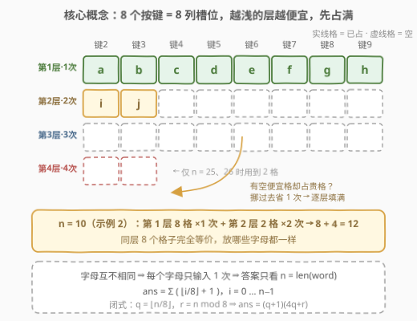
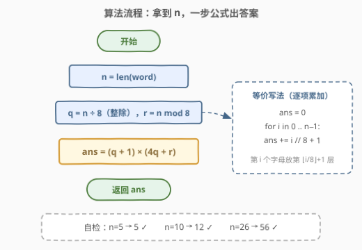
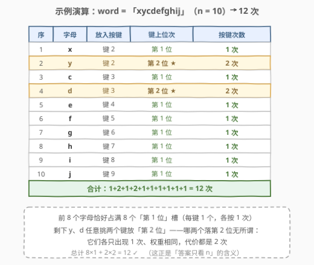

# 输入单词所需的最少按键次数 I

- **题目名称**：输入单词所需的最少按键次数 I
- **链接**：[3014. 输入单词所需的最少按键次数 I](https://leetcode.cn/problems/minimum-number-of-pushes-to-type-word-i/)
- **难度**：简单
- **标签**：贪心、数学、字符串

## 1. 题目概述

给你一个字符串 `word`，由**互不相同**的小写英文字母组成。

电话键盘上的按键可以与字母集合映射，通过连续按键来输入字母：若某字母是它所在按键上的第 $k$ 个字母，输入它就需要按该键 $k$ 次。例如键 `2` 对应 `["a","b","c"]`，则按 1 次输入 `a`，按 2 次输入 `b`，按 3 次输入 `c`。

现在允许你把编号 `2` 到 `9` 的按键**重新映射**到不同字母集合：每个按键可以映射**任意数量**的字母，但每个字母必须**恰好**映射到一个按键上。`1`、`*`、`#`、`0` 不对应任何字母（可用按键只有 2~9 共 **8 个**）。

返回重新映射按键后，输入 `word` 所需的**最少**按键次数。

**示例 1**：

```text
输入：word = "abcde"
输出：5
解释：一种最优映射下——
     "a" -> 在按键 2 上按一次
     "b" -> 在按键 3 上按一次
     "c" -> 在按键 4 上按一次
     "d" -> 在按键 5 上按一次
     "e" -> 在按键 6 上按一次
     总成本 1 + 1 + 1 + 1 + 1 = 5。
```

**示例 2**：

```text
输入：word = "xycdefghij"
输出：12
解释：一种最优映射下——
     "x" -> 在按键 2 上按一次
     "y" -> 在按键 2 上按两次
     "c" -> 在按键 3 上按一次
     "d" -> 在按键 3 上按两次
     "e" ~ "j" -> 分别在按键 4~9 上各按一次
     总成本 1 + 2 + 1 + 2 + 1×6 = 12。
```

**约束条件**：

- $1 \le \text{word.length} \le 26$
- `word` 仅由小写英文字母组成
- `word` 中所有字母互不相同

> ⚠️ 读题陷阱一：不要被九宫格图片带偏，以为必须沿用传统布局（`2=abc`、`3=def`…）——映射可以**任意重排**，唯一约束是「每个字母恰好属于一个键」。陷阱二：`0/1/#/*` 上不能放字母，可用键只有 **8 个**，不是 10 个。

---

## 2. 解题思路

### 2.1 暴力思路

最朴素的想法是枚举映射：每个字母独立地放到 2~9 中的某个键上，共 $8^n$ 种方案（还要再枚举键内顺序）；对每种方案把每个字母的位次加起来取最小。$n=26$ 时约 $8^{26} \approx 3\times 10^{23}$ 种，完全不可行。

但注意本题的关键条件——**字母互不相同**：每个字母地位完全对等（都只出现一次），「谁放在哪儿」根本不影响代价结构。枚举注定是浪费，答案应该有只依赖 $n=\text{len(word)}$ 的简单形态。

### 2.2 核心观察：8 个键 = 8 列槽位，逐层填满



三个关键事实：

1. **每个字母恰好出现一次**（题目保证互不相同），所以每个字母对总代价的贡献就是它在键上的**位次**，至于是哪个字母无所谓；
2. **可用键恰有 8 个**（2~9）；
3. 一个键上放 $k$ 个字母，这些字母分别按 $1,2,\dots,k$ 次——等价地说，**每一列（键）都提供价格为 $1,2,3,\dots$ 的槽位**。

于是问题变成：把 $n$ 个字母放进 8 列槽位中，**总代价 = 所占槽位价格之和**（所选槽位「向下闭合」即可还原出合法布局）。显然贪心：**先占满 8 个价格 1 的格子，再占 8 个价格 2 的格子，依此类推**。

**交换论证（最优性）**：若某字母占着价格为 $c+1$ 的格子，而别处还有空的价格 $c$ 的格子，把它挪过去总代价严格减 $1$。故最优方案中不可能「贵格被占、便宜格空着」，必然逐层填满。

> 💡 **答案只取决于 $n$**：第 $i$ 个（$i$ 从 0 起）字母放进第 $\lfloor i/8 \rfloor + 1$ 层，花费恰为层数，于是

$$\text{ans}=\sum_{i=0}^{n-1}\left(\left\lfloor \frac{i}{8}\right\rfloor+1\right)$$

**闭式**：设 $q=\lfloor n/8 \rfloor$（整层数），$r=n \bmod 8$（最后一层的格子数）。$q$ 个整层的代价为 $8\times(1+2+\dots+q)=4q(q+1)$，剩 $r$ 个格子每个代价 $q+1$，合计：

$$\text{ans}=4q(q+1)+r(q+1)=(q+1)(4q+r)$$

例如 $n=26$：$8\times 1+8\times 2+8\times 3+2\times 4=56$，与闭式 $(3+1)\times(12+2)=56$ 一致。

### 2.3 算法流程图



流程一句话：读出 $n$ → 整除得商 $q$ 与余 $r$ → 套闭式 $(q+1)(4q+r)$（或逐项累加 $\sum (\lfloor i/8\rfloor+1)$，两者等价）→ 返回。连排序都不需要——这是本题「贪心」藏在证明里、代码里只剩算术的特殊形态。

### 2.4 示例演算



以 `word = "xycdefghij"`（$n=10$）走一遍：前 8 个字母恰好占满 8 个「第 1 位」槽（每键 1 个，各按 1 次）；剩下 2 个字母任意挑两个键放到「第 2 位」（各按 2 次）。总计 $8\times 1+2\times 2=12$，与示例 2 一致。

> ⚠️ 哪两个字母落到第 2 位无所谓：它们各只出现一次、权重相同，怎么选总代价都是 4。这正是「答案只看 $n$」的体现。

---

## 3. 参考代码

### C++（逐项累加版）

```cpp
class Solution {
  public:
    int minimumPushes(string word) {
        int n = word.size(), ans = 0;
        for (int i = 0; i < n; ++i) {
            ans += i / 8 + 1;    // 第 i 个字母放进第 i/8+1 层
        }
        return ans;
    }
};
```

### C++（公式版）

```cpp
class Solution {
  public:
    int minimumPushes(string word) {
        int n = word.size(), q = n / 8, r = n % 8;
        return (q + 1) * (4 * q + r);   // 逐层填满的闭式
    }
};
```

### Python（逐项累加版 + 公式版）

```python
class Solution:
    def minimumPushes(self, word: str) -> int:
        return sum(i // 8 + 1 for i in range(len(word)))
```

```python
class Solution:
    def minimumPushes(self, word: str) -> int:
        q, r = divmod(len(word), 8)
        return (q + 1) * (4 * q + r)
```

> 💡 逐项版与公式逐字对应「第 $i$ 个字母放第 $i/8+1$ 层」，可读性最好；公式版 $O(1)$ 纯算术。面试先讲清 2.2 的槽位模型，再任选其一实现即可。

---

## 4. 复杂度分析

| 维度 | 复杂度 | 说明 |
|------|--------|------|
| 时间复杂度 | $O(n)$ / $O(1)$ | 逐项累加版遍历 $n$ 个字母；公式版读出长度后 $O(1)$ 计算。$n \le 26$，两者实际都是常数时间 |
| 空间复杂度 | $O(1)$ | 只用常数个变量，不依赖 `word` 内容 |

标签里的「贪心」体现在 2.2 的**策略与证明**（逐层填满 + 交换论证），而不是代码里的排序——本题连 `word` 的内容都不用看，只看长度。

---

## 5. 扩展：3016——字母可重复时按频率分配

进阶版 [3016. 输入单词所需的最少按键次数 II](https://leetcode.cn/problems/minimum-number-of-pushes-to-type-word-ii/) 中，`word` 长度可达 $10^5$ 且字母可重复。此时字母 $c$ 的贡献变为 $\text{freq}[c]\times$ 位次，问题变成**最小化 $\sum \text{freq}\cdot\text{cost}$ 的分配问题**。

由**重排不等式**（顺序配对乘积和最大、逆序配对最小）：把**频率降序**与**槽位价格升序**配对即得最小值——高频字母优先占便宜格子：

```python
class Solution:
    def minimumPushes(self, word: str) -> int:
        freq = sorted(Counter(word).values(), reverse=True)
        return sum(f * (i // 8 + 1) for i, f in enumerate(freq))
```

本题（3014）正是该式的**全 1 频率特例**：排序后仍是一串 1，答案退化为只看 $n$。复杂度 $O(n + 26\log 26)$。这一「大权重配小系数」的配对套路与 [621. 任务调度器](https://leetcode.cn/problems/task-scheduler/)、[1338. 数组大小减半](https://leetcode.cn/problems/reduce-array-size-to-the-half/) 同族。

---

## 6. 面试要点

1. **为什么答案只取决于 `len(word)`？**

   - 字母互不相同 ⇒ 每个字母恰好输入一次，权重全部相同（都是 1）；任意互换两个字母的位置不改变总代价。于是唯一影响答案的是「选哪 $n$ 个槽位」，而槽位价格结构固定（每层 8 格、层号即价格），贪心下选择唯一，只随 $n$ 变化。

2. **怎么证明「逐层填满」最优？**

   - 交换论证：若存在价格为 $c+1$ 的被占格子与价格为 $c$ 的空格子，把该字母挪到空格总代价减 1，可继续改进；所以最优解中便宜格子必须全满，即逐层填放。

3. **闭式 $(q+1)(4q+r)$ 怎么推导？**

   - $q$ 个整层：第 $j$ 层 8 格各付 $j$，共 $8\cdot\frac{q(q+1)}{2}=4q(q+1)$；剩余 $r$ 个字母进第 $q+1$ 层，各付 $q+1$；合计 $4q(q+1)+r(q+1)=(q+1)(4q+r)$。

4. **一个键放 5 个字母会不会更优？**

   - 不会。$n \le 26 \le 8\times 4$，任何方案中若出现「第 5 位」被占，则必存在价格 $\le 4$ 的空格，挪过去更省（仍是交换论证）。最优解每键至多 $\lceil n/8 \rceil \le 4$ 个字母。

5. **字母可重复（3016）时怎么改？**

   - 按频率降序排序后套同一个求和式 $\sum \text{freq}[i]\cdot(\lfloor i/8\rfloor+1)$，正确性由重排不等式保证；本题即全 1 频率的特例。

---

## 7. 同类练习题

- [3016. 输入单词所需的最少按键次数 II](https://leetcode.cn/problems/minimum-number-of-pushes-to-type-word-ii/)（[题解](3016_输入单词需要的最少按键次数II.md)）：本题泛化版，字母可重复，频率降序 × 槽价升序配对（重排不等式）
- [621. 任务调度器](https://leetcode.cn/problems/task-scheduler/)：高频任务优先铺开间隔，同款「频率 × 位置」贪心调度
- [1338. 数组大小减半](https://leetcode.cn/problems/reduce-array-size-to-the-half/)：按频率从高到低贪心选数，频率贪心家族入门
- [1647. 字符频次唯一的最小删除次数](https://leetcode.cn/problems/minimum-deletions-to-make-character-frequencies-unique/)：频率贪心 + 判重，练习对「频次」的敏感性
- [767. 重构字符串](https://leetcode.cn/problems/reorganize-string/)（[题解](../0701-0800/767_重构字符串.md)）：高频字母优先按列填充相邻错开，家族同款直觉
